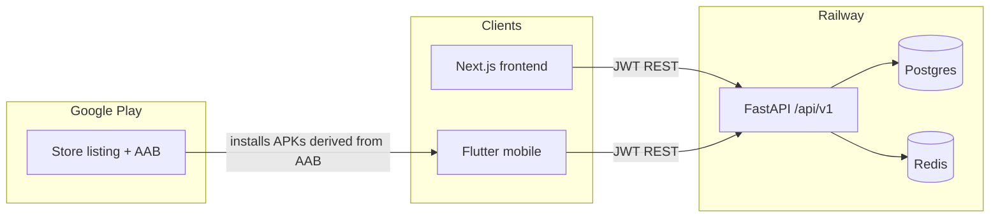

# Android app for MerchantHub — strategy, APK/AAB, and Play Store

Living guide for the Flutter Android client: architecture decisions, phase status,
what APK vs AAB mean, how Google Play fits next to Railway, and what remains to
ship a store listing.

Day-to-day mobile commands (Flutter Web dev loop, OpenAPI codegen, CI emulator)
live in [`README.md`](README.md) under **Mobile client (Flutter)**. This file is
the Android/Play **strategy + release** doc — not a second product bible.

---

## Short answers

| Question | Recommendation |
|---|---|
| Same repo? | **Yes** — top-level `mobile/` next to `backend/` and `frontend/`. |
| Build on Railway? | **No.** Railway runs FastAPI + Next.js. It does not produce APK/AAB or publish to Play. |
| Framework? | **Flutter** (Android now, iOS later with one codebase). Kotlin only if Android-only forever. |
| Host the API on Play? | **No.** Play distributes the **client binary**. API/DB stay on Railway. |

---

## How this fits the product



The Android app is **another client of the same API**, not a fork of the web UI:

- REST under `/api/v1`
- JWT access + refresh (Bearer header; tokens in `flutter_secure_storage`)
- OpenAPI at `/openapi.json` → generated Dart client in `mobile/packages/merchanthub_api/`

CORS only affects browsers. Native apps call HTTPS directly.

---

## Why each major activity exists

| Activity | Why |
|---|---|
| Keep Flutter in this monorepo | One OpenAPI contract, one PR when a slice touches API + web + mobile |
| Leave Railway as API/web host | Mobile needs compile + signing + store distribution, not a container web service |
| Generate API client from OpenAPI | Stop hand-duplicating DTOs; regenerate after backend schema changes |
| Customer MVP before merchant | Matches existing product surfaces (discover, review, favorite, notify) |
| Build APK for QA | Install on emulator/device without Play review cycles |
| Build AAB for Play | Required modern upload format; Play generates device-specific APKs |
| Internal testing track first | Catch config/crash mistakes with the team before public users |
| Prod `API_BASE_URL` on store builds | Phones cannot reach `localhost`; must hit the Railway HTTPS API |

---

## APK vs AAB

### What is an APK?

**APK** (Android Package) is the installable file a device uses to install the app.
You (or CI) run `flutter build apk` → get a `.apk`. Use for sideload, internal QA,
and emulator installs.

### What is an AAB?

**AAB** (Android App Bundle) is Google’s **store upload format**.
You run `flutter build appbundle` → get a `.aab`. You upload it to Play Console;
**Google** then generates optimized APKs per device (ABI, density, language).

### How they correlate

| Artifact | Who builds it | Who installs it | Typical use |
|---|---|---|---|
| **APK** | You / CI | Device / emulator directly | Dev, QA, sideload |
| **AAB** | You / CI | Not installed directly by users | Upload to Play |
| **Device APKs** | **Play** (from your AAB) | End users via Play Store | Production installs |

```text
Flutter code (mobile/)
    → build APK  → testers install manually
    → build AAB  → upload to Google Play
                     → Play generates device APKs
                     → users install from Play Store
```

Same app; different packaging for different distribution channels.

---

## What Google Play looks like (publisher view)

Play is an **app storefront + distribution + signing pipeline**, not your backend host:

1. Create a **Google Play Console** developer account (one-time fee).
2. Create an **app listing** (name, icon, screenshots, description, privacy policy URL, content rating).
3. Upload an **AAB** to a track:
   - **Internal testing** — tiny closed group (team)
   - **Closed testing** — invited testers
   - **Open testing** — public beta
   - **Production** — anyone on Play
4. Google reviews policy/compliance; then distributes updates when you upload a new AAB with a higher `versionCode`.

### Can you “host this over there”?

| Piece | Hosted where? | Why |
|---|---|---|
| FastAPI + Postgres + Redis | **Railway** | Server needs always-on compute/DB |
| Next.js web | **Railway** | Web SSR/static hosting |
| Flutter Android binary | **Google Play** distributes it | Store installs/updates the app |
| App source | **This monorepo** (`mobile/`) | One product, one API contract |

You do **not** move MerchantHub hosting to Play. You **publish the Android client** to Play; Play hosts the **download**, not your database or API.

---

## Monorepo layout and Railway

```text
MEngPlat/
  backend/          # Railway service
  frontend/         # Railway service
  mobile/           # Flutter — ignored by Railway (same as docs/)
  docs/agents/      # PM → Architect → Builder → Tester slices
```

**Why not a separate repo yet:** one product, one OpenAPI contract, small team, shared slice workflow. Split later only if mobile release cadence or CI secrets become painful.

Railway’s job stays: FastAPI, Next.js, Postgres, Redis. Mobile artifacts need GitHub Actions / Codemagic / local Android Studio + Play Console.

---

## Framework choice (locked)

**Flutter in `mobile/`** is the concrete pick:

- One codebase → Android now, iOS later
- Strong HTTP/JWT story against FastAPI
- OpenAPI → Dart client (`dart-dio`)
- Share API, not React/Tailwind UI

Alternatives considered and rejected for now: Kotlin-only (no iOS path), React Native (no meaningful Next.js reuse), WebView/Capacitor wrap (poor auth/nav/Play quality for this product).

---

## Phase status

| Phase | Plan | Status |
|---|---|---|
| **1. Spike** | Flutter skeleton, login + list against `/api/v1` | **Done** — `mobile/` |
| **2. Contract** | OpenAPI codegen + `API_BASE_URL` flavors | **Done** — `mobile/packages/merchanthub_api/`, README |
| **3. Customer MVP** | Discover, reviews, favorites, notifications | **Mostly done** — code in place; slices S-023 / S-024 / S-025 still **Testing** (not Accepted) |
| **4. Merchant later** | Insights (suggestion-only, same non-negotiable as web) | **Not started** |
| **5. Ship Android** | Signed AAB + Play internal → production | **Not done** — `mobile/android/` scaffolding present; day-to-day is Flutter Web; CI now gates PRs on `flutter analyze` + `flutter test` before the emulator job (2026-08-12), still no release-AAB workflow |

Also landed beyond the original five phases: mandatory TOTP (S-020), ADR-003 public business browsing, and [`.github/workflows/mobile-emulator-check.yml`](.github/workflows/mobile-emulator-check.yml).

---

## Ordered release checklist (phase 5)

Do these in order. Each step has a reason.

1. **Accept mobile customer slices (S-023–S-025)**  
   Why: a half-broken store listing is worse than no listing.

2. **Point release builds at production API**  
   `--dart-define=API_BASE_URL=https://<your-backend>.up.railway.app`  
   Why: store-installed apps cannot use `localhost`.

3. **Build a release/debug APK for local QA**  
   `flutter build apk`  
   Why: prove camera, secure storage, permissions, and real-device behavior before Play review.

4. **Create a signing keystore; keep it out of git**  
   Why: Android requires signing; Play requires a stable signing identity across updates. Losing the key means you cannot update the same listing.

5. **Build a release AAB**  
   `flutter build appbundle`  
   Why: modern Play upload format.

6. **Add CI: analyze/test on PR; AAB on tag**  
   Why: Railway will never compile mobile; GitHub Actions/Codemagic is the mobile deploy equivalent.  
   **Done (2026-08-12):** [`.github/workflows/mobile-emulator-check.yml`](.github/workflows/mobile-emulator-check.yml)
   runs an `analyze-test` job as a fast PR gate before the emulator job. A new
   [`.github/workflows/mobile-release-aab.yml`](.github/workflows/mobile-release-aab.yml) builds
   a signed AAB whenever a `mobile-v*` tag is pushed. **It cannot run successfully yet** — it
   reads `MOBILE_KEYSTORE_BASE64`, `MOBILE_KEYSTORE_PASSWORD`, `MOBILE_KEY_ALIAS`,
   `MOBILE_KEY_PASSWORD` (secrets) and `MOBILE_PROD_API_BASE_URL` (repo variable), none of which
   exist yet. See **Step-by-step: signing keystore, CI secrets, and the release-AAB job** below.

7. **Create Play Console app + privacy policy + content rating**  
   Why: Play policy for accounts, reviews, photos. Upload stays blocked without listing metadata.

8. **Upload AAB to Internal testing first**  
   Why: lowest-risk track; team-only.

9. **Promote Closed → Open → Production**  
   Why: staged trust after evidence the app works against prod API.

10. **(Later) Merchant screens; optional FCM push**  
    Why: strategy phase 4; push is separate from polling-based notifications today.

### What else you need (beyond code)

- Google Play developer account (paid registration)
- Public privacy policy URL
- App icon, feature graphic, phone screenshots
- Stable package name (already `com.merchanthub.merchanthub_mobile` — do not change)
- Signing key / Play App Signing enrollment
- Production HTTPS API URL (Railway)
- CI secrets: keystore password, Play service-account JSON — never commit, never put in Railway web env
- Bump `versionName` / `versionCode` on every Play upload

---

## Step-by-step: signing keystore, CI secrets, and the release-AAB job

Do this once. Losing the keystore or its passwords means you can **never update this Play
listing again** under the same app — Play requires the same signing identity on every upload.
Store the file and passwords in a password manager, not just on one laptop.

**1. Generate the keystore** (run locally, requires a JDK — `keytool` ships with it):

```bash
keytool -genkey -v -keystore mobile-release.keystore -keyalg RSA -keysize 2048 \
  -validity 10000 -alias merchanthub
```

You'll be prompted for a store password, a key password (can be the same value), and identity
fields (name/org/etc. — cosmetic, not user-facing). This produces `mobile-release.keystore` in
your current directory. **Do not put it inside the repo** — `mobile/android/.gitignore` already
ignores `key.properties` and `*.keystore`/`*.jks` as a safety net, but keep the file outside the
working tree entirely to avoid ever `git add -A`-ing it by accident.

**2. (Optional) Enable to build locally with this key** — create `mobile/android/key.properties`
(gitignored) pointing at the file:

```properties
storeFile=/absolute/path/to/mobile-release.keystore
storePassword=<the store password from step 1>
keyAlias=merchanthub
keyPassword=<the key password from step 1>
```

`mobile/android/app/build.gradle.kts` already reads this file and signs release builds with it
when present, falling back to the debug key when it's absent — no further Gradle changes needed.

**3. Base64-encode the keystore for CI:**

```bash
# macOS/Linux:
base64 -i mobile-release.keystore | tr -d '\n' > keystore.b64
# Windows PowerShell:
[Convert]::ToBase64String([IO.File]::ReadAllBytes("mobile-release.keystore")) | Out-File keystore.b64 -NoNewline
```

**4. Add GitHub repo secrets** (Settings → Secrets and variables → Actions → **New repository
secret**, one at a time):

| Name | Value |
|---|---|
| `MOBILE_KEYSTORE_BASE64` | contents of `keystore.b64` |
| `MOBILE_KEYSTORE_PASSWORD` | store password from step 1 |
| `MOBILE_KEY_ALIAS` | `merchanthub` (or whatever alias you used) |
| `MOBILE_KEY_PASSWORD` | key password from step 1 |

Then add one **repository variable** (same screen, "Variables" tab — not a secret, since it's
not sensitive):

| Name | Value |
|---|---|
| `MOBILE_PROD_API_BASE_URL` | `https://backend-production-2783.up.railway.app` (or current Railway backend URL) |

**5. Delete the local plaintext copies** (`keystore.b64`, and `mobile-release.keystore` once
it's safely in a password manager) from wherever you generated them, so they don't linger
unencrypted on disk.

**6. Trigger the release build:**

```bash
git tag mobile-v1.0.0
git push origin mobile-v1.0.0
```

This runs [`.github/workflows/mobile-release-aab.yml`](.github/workflows/mobile-release-aab.yml),
which decodes the keystore, writes `key.properties` inside the CI runner only (never committed),
builds `flutter build appbundle --release` against `MOBILE_PROD_API_BASE_URL`, deletes the
signing material, and uploads `app-release.aab` as a downloadable workflow artifact. Download it
from the workflow run's **Artifacts** section — that file is what you upload to Play in the next
section.

---

## Step-by-step: Google Play Console, privacy policy, and store assets

Everything in this section happens in Google's UI, not this repo — nothing here is scriptable
from a coding session.

**1. Register a Play Console developer account** — [play.google.com/console](https://play.google.com/console/signup),
one-time registration fee, requires a Google account and government ID verification (can take a
day or two to clear).

**2. Write and host a privacy policy.** Required even for a simple app once it touches accounts,
reviews, or photos. It needs a stable public URL — the easiest path here is a static page on the
existing Next.js frontend (e.g. `frontend/src/app/privacy/page.tsx` → `https://<your-frontend>.up.railway.app/privacy`),
so it's covered by infrastructure already deployed rather than a new host. Must disclose: what
data is collected (email, name, reviews, photos, location if used), why, and how users can
request deletion.

**3. Create the app in Play Console:** Console → **Create app** → fill in app name
("MerchantHub"), default language, app type (App), free/paid (Free). This generates the app's
internal Play listing shell.

**4. Fill in the Store listing** (Console → your app → Grow → Store presence → Main store
listing):
   - Short description (≤80 chars), full description (≤4000 chars)
   - App icon: 512×512 PNG
   - Feature graphic: 1024×500 PNG/JPG
   - Phone screenshots: at least 2, 16:9 or 9:16, PNG/JPG (screenshot the app from the emulator
     CI job's artifact, or run `flutter run` locally and capture a few core screens: business
     list, business detail, review form, favorites)
   - Category (e.g. Business or Food & Drink) and contact details

**5. Complete the Data safety form** (Console → Policy → App content → Data safety) — declare
what data types are collected/shared, matching the privacy policy from step 2 exactly. Mismatches
are a common review-rejection reason.

**6. Complete Content rating questionnaire** (same App content section) — answers determine the
age rating shown on the listing.

**7. Set package name and upload the AAB** (Console → your app → Release → Testing → Internal
testing → **Create new release**): package name is already fixed as
`com.merchanthub.merchanthub_mobile` (do not change it — it's the permanent listing identity).
Upload the `app-release.aab` artifact from the CI job above. First upload also enrolls the app in
**Play App Signing** (Google re-signs your upload key with its own distribution key — recommended
default, keep your own upload keystore from the previous section regardless as the upload
credential).

**8. Add internal testers** (Console → Testing → Internal testing → Testers tab) — add team email
addresses to a list, share the generated opt-in link so they can install without public review.

**9. Promote through tracks** once internal testing looks good: Internal → Closed → Open →
Production, each requiring a new release created from the same or a newer AAB. Production is the
only track requiring full Google policy review before going live; earlier tracks are lighter-weight.

---

## Day-to-day management rules

1. **Single backend, multiple clients** — features land in FastAPI first (or same PR). Avoid mobile-only endpoints unless there is a real device need (push tokens, device IDs).
2. **OpenAPI is the shared package** — regenerate via `python mobile/scripts/generate_api_client.py` after backend schema changes.
3. **Slices stay the same** — mobile-capable slices list Flutter screens + AC; Architect notes auth storage, deep links, Play constraints.
4. **CI boundaries** — Railway: backend + frontend Docker. Mobile: emulator check today; release AAB workflow still to add.
5. **Env / flavors** — `dev` → local API (`10.0.2.2:8000` on emulator, or LAN IP on device); `staging`/`prod` → Railway URL.
6. **Secrets stay out of the monorepo** — signing keystores, Play service-account JSON, production `.env`.

---

## Session log (2026-08-12) — what changed, and how to resume if it breaks

**Done this session:**
- Confirmed S-023/S-024/S-025 mobile code (reviews, favorites, notifications) is committed
  (`76fa356`) and `flutter analyze` / `flutter test` are both clean (10/10 tests pass).
- Fixed an async-dependency race in `myBusinessIdsProvider`
  ([`mobile/lib/features/businesses/business_list_provider.dart`](mobile/lib/features/businesses/business_list_provider.dart)):
  it read `authControllerProvider` via `.valueOrNull` instead of awaiting `.future`, so on cold
  start it could resolve to `{}` before auth settled and briefly show "Add review" on a
  merchant's own business. Same fix pattern as `FavoritedIdsController.build()` in
  `favorites_providers.dart`.
- Added an `analyze-test` job to
  [`.github/workflows/mobile-emulator-check.yml`](.github/workflows/mobile-emulator-check.yml)
  that runs `flutter analyze` + `flutter test` on every PR touching `mobile/**`, gating the
  slower emulator job behind it (`needs: analyze-test`).

**Known local limitation (not a code bug):** this dev machine has Flutter but **no Android SDK**
(`flutter build apk` fails with "No Android SDK found"). Release APK/AAB builds only work in CI
(once the AAB-on-tag job from checklist item 6 is added) or on a machine with Android Studio
installed. Don't waste time debugging this as if it were a project defect.

**If this work needs to be picked up cold in a new session/agent, paste this:**

> Continue MerchantHub AI mobile work. Read `ANDROID_APP_STRATEGY.md` in full first — it's the
> single source of truth for Android/Play strategy and has a "Session log" section with current
> state. S-023/S-024/S-025 (mobile reviews/favorites/notifications) are code-complete and tested
> (`flutter test` in `mobile/`) but still `Status: Testing` in their slice files under
> `docs/agents/slices/` — they need a formal Tester pass (test plan + AC coverage matrix +
> `docs/agents/test-reports/`) then a Product Manager review to move to `Accepted`, per the
> PM → Architect → Builder → Tester → PM workflow in `README.md` §13. Do not implement ahead of
> a slice's `Status: Specified` gate. This machine has no Android SDK — don't attempt
> `flutter build apk`/`appbundle` locally; that only runs in CI or on a machine with Android
> Studio.

**Scope-creep guardrail for whoever picks this up:** stay inside the numbered AC in each
slice file. If you find a bug or gap outside a slice's AC (like the `myBusinessIdsProvider` race
above), fix it, note it in the slice's Changelog, but don't expand the slice's AC list — draft
a new slice via the Product Manager agent instead.

---

## Bottom line

- Structure Android as a **third client** of the existing FastAPI API.
- Keep code under `mobile/`; Railway continues to deploy only backend + frontend.
- Ship **APKs** for ourselves to test and **AABs** for Google to distribute.
- Play is the **store**; Railway remains the **backend host**.
- Customer Flutter MVP is largely built; **signed release + Play listing** is the open gap.
