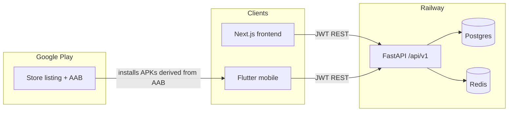

# Android app for MerchantHub — strategy, APK/AAB, and Play Store

Living guide for the Flutter Android client: architecture decisions, phase status,
what APK vs AAB mean, how Google Play fits next to Railway, and what remains to
ship a store listing.

Day-to-day mobile commands (Flutter Web dev loop, OpenAPI codegen, CI emulator)
live in [`README.md`](README.md) under **Mobile client (Flutter)**. This file is
the Android/Play **strategy + release** doc — not a second product bible.

---

## Short answers

| Question | Recommendation |
|---|---|
| Same repo? | **Yes** — top-level `mobile/` next to `backend/` and `frontend/`. |
| Build on Railway? | **No.** Railway runs FastAPI + Next.js. It does not produce APK/AAB or publish to Play. |
| Framework? | **Flutter** (Android now, iOS later with one codebase). Kotlin only if Android-only forever. |
| Host the API on Play? | **No.** Play distributes the **client binary**. API/DB stay on Railway. |

---

## How this fits the product



The Android app is **another client of the same API**, not a fork of the web UI:

- REST under `/api/v1`
- JWT access + refresh (Bearer header; tokens in `flutter_secure_storage`)
- OpenAPI at `/openapi.json` → generated Dart client in `mobile/packages/merchanthub_api/`

CORS only affects browsers. Native apps call HTTPS directly.

---

## Why each major activity exists

| Activity | Why |
|---|---|
| Keep Flutter in this monorepo | One OpenAPI contract, one PR when a slice touches API + web + mobile |
| Leave Railway as API/web host | Mobile needs compile + signing + store distribution, not a container web service |
| Generate API client from OpenAPI | Stop hand-duplicating DTOs; regenerate after backend schema changes |
| Customer MVP before merchant | Matches existing product surfaces (discover, review, favorite, notify) |
| Build APK for QA | Install on emulator/device without Play review cycles |
| Build AAB for Play | Required modern upload format; Play generates device-specific APKs |
| Internal testing track first | Catch config/crash mistakes with the team before public users |
| Prod `API_BASE_URL` on store builds | Phones cannot reach `localhost`; must hit the Railway HTTPS API |

---

## APK vs AAB

### What is an APK?

**APK** (Android Package) is the installable file a device uses to install the app.
You (or CI) run `flutter build apk` → get a `.apk`. Use for sideload, internal QA,
and emulator installs.

### What is an AAB?

**AAB** (Android App Bundle) is Google’s **store upload format**.
You run `flutter build appbundle` → get a `.aab`. You upload it to Play Console;
**Google** then generates optimized APKs per device (ABI, density, language).

### How they correlate

| Artifact | Who builds it | Who installs it | Typical use |
|---|---|---|---|
| **APK** | You / CI | Device / emulator directly | Dev, QA, sideload |
| **AAB** | You / CI | Not installed directly by users | Upload to Play |
| **Device APKs** | **Play** (from your AAB) | End users via Play Store | Production installs |

```text
Flutter code (mobile/)
    → build APK  → testers install manually
    → build AAB  → upload to Google Play
                     → Play generates device APKs
                     → users install from Play Store
```

Same app; different packaging for different distribution channels.

---

## What Google Play looks like (publisher view)

Play is an **app storefront + distribution + signing pipeline**, not your backend host:

1. Create a **Google Play Console** developer account (one-time fee).
2. Create an **app listing** (name, icon, screenshots, description, privacy policy URL, content rating).
3. Upload an **AAB** to a track:
   - **Internal testing** — tiny closed group (team)
   - **Closed testing** — invited testers
   - **Open testing** — public beta
   - **Production** — anyone on Play
4. Google reviews policy/compliance; then distributes updates when you upload a new AAB with a higher `versionCode`.

### Can you “host this over there”?

| Piece | Hosted where? | Why |
|---|---|---|
| FastAPI + Postgres + Redis | **Railway** | Server needs always-on compute/DB |
| Next.js web | **Railway** | Web SSR/static hosting |
| Flutter Android binary | **Google Play** distributes it | Store installs/updates the app |
| App source | **This monorepo** (`mobile/`) | One product, one API contract |

You do **not** move MerchantHub hosting to Play. You **publish the Android client** to Play; Play hosts the **download**, not your database or API.

---

## Monorepo layout and Railway

```text
MEngPlat/
  backend/          # Railway service
  frontend/         # Railway service
  mobile/           # Flutter — ignored by Railway (same as docs/)
  docs/agents/      # PM → Architect → Builder → Tester slices
```

**Why not a separate repo yet:** one product, one OpenAPI contract, small team, shared slice workflow. Split later only if mobile release cadence or CI secrets become painful.

Railway’s job stays: FastAPI, Next.js, Postgres, Redis. Mobile artifacts need GitHub Actions / Codemagic / local Android Studio + Play Console.

---

## Framework choice (locked)

**Flutter in `mobile/`** is the concrete pick:

- One codebase → Android now, iOS later
- Strong HTTP/JWT story against FastAPI
- OpenAPI → Dart client (`dart-dio`)
- Share API, not React/Tailwind UI

Alternatives considered and rejected for now: Kotlin-only (no iOS path), React Native (no meaningful Next.js reuse), WebView/Capacitor wrap (poor auth/nav/Play quality for this product).

---

## Phase status

| Phase | Plan | Status |
|---|---|---|
| **1. Spike** | Flutter skeleton, login + list against `/api/v1` | **Done** — `mobile/` |
| **2. Contract** | OpenAPI codegen + `API_BASE_URL` flavors | **Done** — `mobile/packages/merchanthub_api/`, README |
| **3. Customer MVP** | Discover, reviews, favorites, notifications | **Mostly done** — code in place; slices S-023 / S-024 / S-025 still **Testing** (not Accepted) |
| **4. Merchant later** | Insights (suggestion-only, same non-negotiable as web) | **Not started** |
| **5. Ship Android** | Signed AAB + Play internal → production | **Not done** — `mobile/android/` scaffolding present; day-to-day is Flutter Web; CI runs emulator smoke only (not release AAB) |

Also landed beyond the original five phases: mandatory TOTP (S-020), ADR-003 public business browsing, and [`.github/workflows/mobile-emulator-check.yml`](.github/workflows/mobile-emulator-check.yml).

---

## Ordered release checklist (phase 5)

Do these in order. Each step has a reason.

1. **Accept mobile customer slices (S-023–S-025)**  
   Why: a half-broken store listing is worse than no listing.

2. **Point release builds at production API**  
   `--dart-define=API_BASE_URL=https://<your-backend>.up.railway.app`  
   Why: store-installed apps cannot use `localhost`.

3. **Build a release/debug APK for local QA**  
   `flutter build apk`  
   Why: prove camera, secure storage, permissions, and real-device behavior before Play review.

4. **Create a signing keystore; keep it out of git**  
   Why: Android requires signing; Play requires a stable signing identity across updates. Losing the key means you cannot update the same listing.

5. **Build a release AAB**  
   `flutter build appbundle`  
   Why: modern Play upload format.

6. **Add CI: analyze/test on PR; AAB on tag**  
   Why: Railway will never compile mobile; GitHub Actions/Codemagic is the mobile deploy equivalent.

7. **Create Play Console app + privacy policy + content rating**  
   Why: Play policy for accounts, reviews, photos. Upload stays blocked without listing metadata.

8. **Upload AAB to Internal testing first**  
   Why: lowest-risk track; team-only.

9. **Promote Closed → Open → Production**  
   Why: staged trust after evidence the app works against prod API.

10. **(Later) Merchant screens; optional FCM push**  
    Why: strategy phase 4; push is separate from polling-based notifications today.

### What else you need (beyond code)

- Google Play developer account (paid registration)
- Public privacy policy URL
- App icon, feature graphic, phone screenshots
- Stable package name (already `com.merchanthub.merchanthub_mobile` — do not change)
- Signing key / Play App Signing enrollment
- Production HTTPS API URL (Railway)
- CI secrets: keystore password, Play service-account JSON — never commit, never put in Railway web env
- Bump `versionName` / `versionCode` on every Play upload

---

## Day-to-day management rules

1. **Single backend, multiple clients** — features land in FastAPI first (or same PR). Avoid mobile-only endpoints unless there is a real device need (push tokens, device IDs).
2. **OpenAPI is the shared package** — regenerate via `python mobile/scripts/generate_api_client.py` after backend schema changes.
3. **Slices stay the same** — mobile-capable slices list Flutter screens + AC; Architect notes auth storage, deep links, Play constraints.
4. **CI boundaries** — Railway: backend + frontend Docker. Mobile: emulator check today; release AAB workflow still to add.
5. **Env / flavors** — `dev` → local API (`10.0.2.2:8000` on emulator, or LAN IP on device); `staging`/`prod` → Railway URL.
6. **Secrets stay out of the monorepo** — signing keystores, Play service-account JSON, production `.env`.

---

## Bottom line

- Structure Android as a **third client** of the existing FastAPI API.
- Keep code under `mobile/`; Railway continues to deploy only backend + frontend.
- Ship **APKs** for ourselves to test and **AABs** for Google to distribute.
- Play is the **store**; Railway remains the **backend host**.
- Customer Flutter MVP is largely built; **signed release + Play listing** is the open gap.
