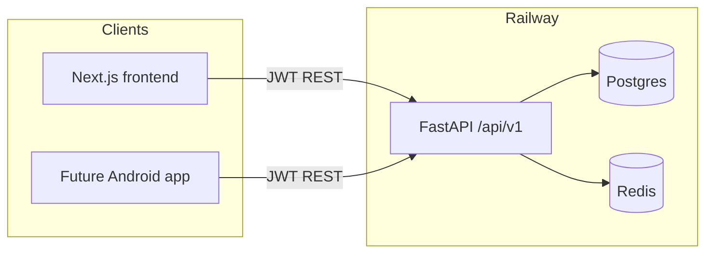

# Android app for MerchantHub — structure and hosting

Architecture advice for adding an Android client to MerchantHub AI: keep the FastAPI backend as the shared source of truth, put mobile in the same monorepo (ignored by Railway), and build/distribute the app with mobile CI—not Railway.

## Short answers

| Question | Recommendation |
|---|---|
| Same repo? | **Yes** — add a top-level `mobile/` (or `android/`) next to `backend/` and `frontend/`. |
| Build on Railway? | **No.** Railway runs server containers (your FastAPI + Next.js). It does not produce APK/AAB or publish to Play Store. |
| Flutter vs native? | Prefer **Flutter** if you may want iOS later or one codebase; prefer **Kotlin + Jetpack Compose** if Android-only and you want deepest platform fit. Do **not** switch hosting because of mobile — keep Railway for API/web. |

---

## How this fits your current app

Today MerchantHub is already a clean split:



The Android app should be **another client of the same API**, not a fork of the web UI. Your contract already exists:

- REST under `/api/v1`
- JWT access + refresh (same as [`frontend/src/lib/api.ts`](frontend/src/lib/api.ts))
- Live OpenAPI at `/openapi.json` (local and Railway backend)

CORS only affects browsers. Native apps call HTTPS directly; store tokens in Android Keystore / Flutter secure storage, not plain prefs.

---

## Same monorepo vs separate repo

**Keep it in this monorepo.** That matches how the project already works (not Turbo/Nx — just sibling folders) and keeps API + web + mobile changes reviewable in one PR when a slice touches all three.

Suggested layout (conceptual only):

```text
MEngPlat/
  backend/          # unchanged — Railway service
  frontend/         # unchanged — Railway service
  mobile/           # NEW — Flutter or Android Studio project
  docs/agents/      # same PM → Architect → Builder → Tester slices
  docker-compose.yml
```

**Why not a separate repo yet:** one product, one OpenAPI contract, small team, shared slice workflow in `docs/agents/`. Split later only if mobile release cadence, permissions, or CI secrets become painful.

**Railway impact:** none meaningful. You already point each Railway service at `backend/` or `frontend/` with their `railway.json`. A `mobile/` folder is simply unused by Railway (same as `docs/`).

---

## Railway cannot build the Android app

Railway’s job for you stays:

1. Host **FastAPI** (API of record)
2. Host **Next.js** (web)
3. Postgres / Redis

Mobile artifacts need a different pipeline:

| Concern | Where it lives |
|---|---|
| Compile APK/AAB | GitHub Actions, Codemagic, Bitrise, or local Android Studio |
| Distribute | Google Play Console (or internal testing tracks) |
| Point at API | Build flavor / env: `API_BASE_URL=https://<your-backend>.up.railway.app` |
| Secrets | Play signing keys + store credentials in mobile CI — never in Railway web env, never committed |

You do **not** need another “web service” like Vercel/Render just because you add Android. Keep Railway for the backend; add mobile CI for binaries.

---

## Framework choice (no coding — decision frame)

### 1. Flutter (good default for you)

- One codebase → Android now, iOS later with low extra cost
- Strong HTTP/JWT story against your existing FastAPI
- OpenAPI → Dart client generators available
- Fits a greenfield client: browse businesses, reviews, favorites, merchant light views
- Tradeoff: UI won’t share React/Tailwind components with Next.js (that’s fine — share API, not UI)

### 2. Kotlin + Jetpack Compose (if Android-only forever)

- Best platform integration, Play policies, performance, “native feel”
- OpenAPI → Kotlin client is straightforward
- Tradeoff: iOS later means a second app (Swift/Compose Multiplatform is another bet)

### 3. React Native / Expo

- Only compelling if you want to reuse TypeScript skills and some shared types with `frontend/`
- You still won’t meaningfully reuse Next.js App Router screens; RN is a separate UI
- Slightly weaker fit than Flutter for a clean greenfield dual-platform client unless the team is already RN-heavy

### 4. Wrap the web app (WebView / Capacitor / PWA)

- Fastest to “ship something,” worst product for a review/merchant platform (navigation, auth storage, offline, Play quality)
- Next.js SSR + Railway frontend makes a Capacitor wrap awkward
- Treat as a prototype only, not the real Android product

**Concrete pick for MerchantHub:** start with **Flutter in `mobile/`**, keep Railway as-is, generate API clients from OpenAPI. Revisit Kotlin only if you commit to Android-only and need deep native features (maps, camera, background sync) that Flutter plugins don’t cover well.

---

## How to manage the codebase day to day

1. **Single backend, multiple clients**  
   Features land in FastAPI first (or in the same PR). Web and mobile both consume `/api/v1`. Avoid mobile-only endpoints unless there is a real device need (push tokens, device IDs).

2. **Treat OpenAPI as the shared package**  
   Commit or CI-fetch `/openapi.json` and generate Dart/Kotlin clients. Stop hand-duplicating DTOs the way the frontend currently does in `api.ts` when you can (long-term win for web too).

3. **Slices stay the same**  
   Use [`docs/agents/slices/`](docs/agents/slices/) as today. A mobile-capable slice should list Android screens + AC alongside API/web. Architect notes auth storage, deep links, and Play constraints in the tech spec.

4. **CI boundaries**  
   - Existing / Railway: backend + frontend Docker builds  
   - New: `mobile/` workflow on PR (analyze/test) and on tag (AAB → Play internal track)  
   - Agent-config sync CI stays untouched

5. **Env / flavors**  
   - `dev` → local Compose API (`10.0.2.2:8000` on emulator, or LAN IP on device)  
   - `staging` / `prod` → Railway backend URL  
   Same JWT flows; different base URL only.

6. **What not to put in the monorepo**  
   Signing keystores, Play service-account JSON, `.env` with secrets — CI secrets / password manager only.

7. **Docs**  
   Per project rules, extend [`README.md`](README.md) (stack, layout, deploy) when you add mobile — don’t invent a second prose bible. Optional ADR under `docs/agents/adrs/` for “Flutter client + monorepo layout.”

---

## Suggested phased approach (when you do build)

1. **Spike:** Flutter skeleton in `mobile/`, login + one list screen against Railway `/api/v1` (or Compose locally).
2. **Contract:** Wire OpenAPI codegen; document `API_BASE_URL` flavors in README.
3. **Customer MVP:** discover businesses, reviews, favorites (matches existing product surfaces).
4. **Merchant later:** insights are suggestion-only (same non-negotiable as web).
5. **CI:** GitHub Actions or Codemagic for debug APK + release AAB; Play internal testing.

---

## Bottom line

- Structure Android as a **third client** of the existing FastAPI API.
- Keep the code in **this monorepo** under `mobile/`; Railway continues to deploy only backend + frontend.
- **Do not** move hosting off Railway for mobile — use mobile-specific CI + Play Store for builds.
- Prefer **Flutter** unless you are sure you will never ship iOS and want pure Kotlin.
- Manage the product via the **same API + same agent slices**; share OpenAPI, not UI code.

## Next decisions (before scaffolding)

- Confirm Flutter (default) vs Kotlin-only
- Add `mobile/` beside `backend/` and `frontend/`; Railway roots unchanged
- Use FastAPI OpenAPI as shared client contract (codegen)
- Plan GitHub Actions/Codemagic + Play — not Railway — for APK/AAB
- When implementing: update README stack/layout + optional ADR for mobile client
