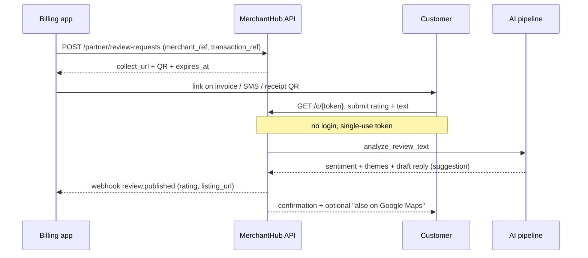

# Partner-led review capture — strategy, API, and channel plan

Growth strategy for MerchantHub AI: give billing / invoicing / payment-acceptance
apps (Vyapar, myBillBook, Khatabook, Razorpay, PhonePe/Paytm for Business, Petpooja…)
a **free API** that turns every invoice or receipt into a verified review on
MerchantHub — and turn their merchant base into ours.

This file is a **strategy + integration-design** doc for a capability that is **not
yet built**. It is the peer of `[ANDROID_APP_STRATEGY.md](ANDROID_APP_STRATEGY.md)`,
not a second product bible. When any slice below is **Accepted**, the living roadmap
entries move into `[README.md](README.md)` §14 (Known gaps) and §16 (investor
overview) per `docs/CLAUDE.md`; the API contract moves into README §7.

| Field | Value |
| ----- | ----- |
| Status | **Proposal** — not an accepted direction |
| Raised | 2026-08-29 |
| Decision gate | One partner pilot commitment (in writing) before building past S-120 |
| First slice | S-120 (next free slice ID) |
| Companion artifact | Claude artifact "Partner-Led Review Capture" — `https://claude.ai/code/artifact/db7e2552-cc98-443a-a69b-1becbc806cff` |

---

## A. The bet

A review platform lives or dies on how many reviews it captures. MerchantHub's own
channels — a QR on the counter, a WhatsApp number, SEO on listing pages — all depend
on a merchant remembering to ask. Billing apps do not have that problem: they are in
the merchant's hand at the exact moment a sale closes.

Vyapar, myBillBook, Khatabook, PhonePe for Business, Petpooja and the rest already
send the customer an invoice, a payment confirmation, or a receipt. Adding one line —
"rate this shop" with a short link — costs them nothing and gives their merchants a
"reputation" feature they keep asking for and do not want to build. For MerchantHub
it means review volume that arrives **pre-verified against a real transaction**, plus
a merchant list to convert into claimed listings.

This is not a pivot. README §16 already commits to *"density in a few neighbourhoods
+ merchant workflow + suggestion-grade AI"*. Partner ingestion is the fastest way to
get that density: every partner transaction in a target pincode is a listing and a
merchant lead in the same motion.

> **The honest read:** the risk is not technical — it is building a partner API that
> no partner adopts. The plan is sequenced so the **first real integration commitment
> comes before the expensive build**. Everything up to that point is one foundation
> slice plus a mock you can demo.

---

## B. What already ships

Grounding the plan in what is actually built. The collect flow, the QR, and the AI
pipeline are done and accepted — the partner API reuses all of it.

| Surface | State | Detail |
| ------- | ----- | ------ |
| Public collect wizard `/collect/{id or slug}` | **Shipped** (S-040) | Star → highlight chips → AI-generated draft starter → submit. All 1–5 stars continue to the same step — no low-score intercept, by policy. |
| Gamified tap-through variant | Flagged off (S-119) | One-question-at-a-time flow behind `NEXT_PUBLIC_GAMIFIED_REVIEW`. Same `POST /reviews` payload. |
| Merchant dashboard QR + short link | **Shipped** | `CollectQrCard` — QR encodes `origin + /collect/{id}`, with a "print for shop" counter sign. |
| Mobile merchant QR / share sheet + in-app collect screen | **Shipped** (S-059) | Native `/collect/:slug`, ungated. Cold physical-scan opens the web page. |
| Android App Links for cold QR scan | Partial (S-118) | Needs the signing SHA-256 pasted into `assetlinks.json` before Android 12+ prefers the app. |
| AI analysis on every review | **Shipped** | Sentiment, recurring themes, draft reply — suggestion-grade, runs automatically on submit via `AIProvider` (mock by default). |
| Keyword moderation | **Shipped** | Disallowed language → `reported` admin queue; otherwise the review is live immediately, no approval step. |
| Signed inbound webhooks | **Shipped** | `X-Hub-Signature-256` HMAC (WhatsApp), Razorpay HMAC — idempotent on a provider reference. The pattern the partner API copies. |
| Featured-boost SKUs | **Shipped** (S-036/042) | ₹299 / ₹499 / ₹899. The revenue line a partner can take a share of. |

---

## C. The gap to close

The collect page assumes a logged-in customer reviewing once per account. A
partner-driven flow is anonymous, one-per-transaction, and machine-initiated.

| Needed | Today |
| ------ | ----- |
| **Login-free review submission** | Missing. The collect page calls `auth.me()` and redirects to `/login?next=…`. `POST /reviews` requires a `customer \| merchant \| admin` role. |
| **One review per transaction**, not per account | Missing. Dedupe is `UNIQUE(author_id, business_id)` — a customer who buys twice cannot review twice. |
| **Partner identity** — API keys, HMAC secret, per-partner rate limit | Missing. No partner entity, no key issuance, no partner-scoped throttling. |
| **Review-request object** — transaction ref, channel, token, expiry, conversion state | Missing. Nothing tracks "we asked for this review" vs "we got it". |
| **Merchant resolution** — partner's merchant → a MerchantHub `Business`, with auto-provision | Missing. Merchants self-register only, and a `Business` must be `APPROVED` before it can receive any review. |
| **`source` / `verified_purchase`** on a review | Missing. No column. Verified reviews should be badged and trusted more than anonymous web ones. |
| **Outbound webhook** — "review collected" back to the partner | Missing. Only inbound webhooks exist. The partner needs a callback to show the merchant a running count. |
| **Partner data terms** — consent, retention, no-resale | Missing. Legal program is deferred (README §14). Needs a one-pager before any customer contact data is accepted. |

> **Design decision:** partner-sourced reviews are **native `reviews` rows** with a
> `source` marker — *not* `external_reviews`. The `external_reviews` / `review_sources`
> layer (S-048) is for third-party review *content* pulled from Google. Here the
> review is first-party; only the distribution channel is a partner.

---

## D. The build

Each slice runs the mandated cycle — PM brief → Architect spec → Builder → Tester
report → PM accept — on a feature branch with a PR. Subagents pinned to
`model: "sonnet"`. Next free ID is **S-120**.

| Slice | Scope | Gate |
| ----- | ----- | ---- |
| **S-120** Partner platform foundation | `partners` + `partner_api_keys` (hashed) tables; key issue / rotate / revoke; an HMAC-verify dependency mirroring the Razorpay webhook check; per-key rate limit; admin `/admin/partners` list. No customer-facing surface. | Build now — needed for the demo. |
| **S-121** Login-free tokenised capture | `review_requests` table (`partner_id`, `merchant_ref`, `transaction_ref`, `contact_hash`, `token`, `channel`, `status`, `expires_at`; `UNIQUE(partner_id, transaction_ref)`). `POST /api/v1/partner/review-requests` (key auth) → `{collect_url, qr, expires_at}`. Public `GET/POST /c/{token}` submits a native review with no login: pseudonymous author keyed to the contact hash, `source="partner:<slug>"`, `verified_purchase=true`, dedupe on token. Keyword moderation + AI pipeline unchanged. | After pilot LOI. May split 121a schema+ingest / 121b public submit. |
| **S-122** Merchant resolution + auto-provision | Match on `merchant_ref`, then GSTIN / phone / name+pincode. Unknown → create a `processing` `Business` from the `merchant_hint`. New admin queue lane for partner-provisioned listings. Merchant claim via phone OTP (reuse S-044) or GSTIN. | After S-121. |
| **S-123** Outbound partner notifications | A `PartnerNotifier` port (mock + http adapter, factory + env var). Signed `review.published`, `review.held_for_moderation`, `merchant.claimed` events with retry + backoff and a partner-visible delivery log. | Parallel with S-122. |
| **S-124** Partner read API + embed widget | `GET /api/v1/partner/merchants/{ref}/summary` — rating, count, AI themes, recent reviews. A self-contained `<script>` / iframe embed the partner drops into their merchant app. | After S-121. |
| **S-125** Partner self-serve console | Web area: get / rotate keys, volume + conversion dashboard, sandbox tester, docs link. | Deferrable — an admin-issued key covers pilot 1. |

Cross-cutting, every slice: README updates per the §-map (§3 architecture, §5 domain
model, §6 flows, §7 API, §9 security, §12 parity, §14 gaps) and a feature → test
index row. The partner data-terms one-pager is a prerequisite artifact for S-121, not
a slice. Consider capturing the direction as an ADR (`docs/agents/adrs/ADR-019-*`)
when S-120 is specified.

---

## E. The free API

Three calls in, one call back. Auth is a bearer API key plus an HMAC body signature —
the same scheme the codebase already uses for Razorpay and WhatsApp webhooks.



### 1 — Create a review request

`POST /api/v1/partner/review-requests`

```
Authorization: Bearer <partner_api_key>
X-MH-Signature: sha256=<hmac(raw_body, partner_secret)>

{
  "merchant_ref":    "vyapar_9f3c21",          // partner's stable merchant id
  "transaction_ref": "INV-2026-00841",         // unique per merchant; the dedupe key
  "occurred_at":     "2026-08-29T11:04:00+05:30",
  "amount":   { "value": 480.00, "currency": "INR" },
  "customer": { "phone_e164": "+9198XXXXXX02", "name": "Anil" },   // optional; hashed at rest
  "channel":  "invoice_link",                   // invoice_link | sms | whatsapp | receipt_qr
  "merchant_hint": {                            // used only when merchant_ref is new to us
    "name": "Sri Balaji Tiffin Center",
    "address": "12 North Usman Rd, T Nagar",
    "pincode": "600017",
    "gstin": "33ABABC1234C1Z5",
    "phone_e164": "+9144XXXXXX10"
  }
}

-> 201 Created
{
  "review_request_id": "rq_8Kd0...",
  "collect_url":  "https://app.merchanthub.ai/c/AB12CD34",   // short, single-use
  "qr_svg_url":   "https://app.merchanthub.ai/c/AB12CD34.svg",
  "expires_at":   "2026-09-12T05:34:00Z",
  "merchant_status": "matched"                 // matched | provisioned_pending
}
```

### 2 — Customer submits (no MerchantHub account)

`GET /c/{token}` · `POST /c/{token}`

The existing collect wizard, served against a token instead of a business id. `POST`
body is `{ rating, body, title? }`. On success the token is burned, a native
`reviews` row is written with `source` and `verified_purchase=true`, the AI pipeline
runs, and the customer sees the normal confirmation screen.

### 3 — Read a merchant's reputation (for the partner's own UI)

`GET /api/v1/partner/merchants/{merchant_ref}/summary`

```
-> 200 OK
{
  "listing_url": "https://app.merchanthub.ai/businesses/sri-balaji-tiffin-center",
  "average_rating": 4.3,
  "review_count": 27,
  "requests_sent": 61,
  "conversion": 0.44,
  "ai_themes": {
    "positives":  ["fast service", "fresh food"],
    "complaints": ["limited seating"]
  },
  "recent": [ { "rating": 5, "body": "...", "created_at": "..." } ]
}
```

### Callback — what MerchantHub sends the partner

`POST <partner_callback_url>`

```
X-MH-Signature: sha256=<hmac(raw_body, partner_secret)>

{
  "event": "review.published",                 // review.held_for_moderation | merchant.claimed
  "review_request_id": "rq_8Kd0...",
  "merchant_ref": "vyapar_9f3c21",
  "transaction_ref": "INV-2026-00841",
  "rating": 5,
  "has_text": true,
  "listing_url": "https://app.merchanthub.ai/businesses/sri-balaji-tiffin-center",
  "published_at": "2026-08-29T11:07:20Z"
}
```

> **Free means free.** No per-call charge, no seat cost, no volume tier for the pilot
> — rate-limited per key (start ~10 req/s, 50k/day). The only money in the loop is an
> optional revenue share when a partner-sourced merchant buys a featured boost.

---

## F. The channel plan

Ordered by how close each target is to a yes — existing surface area, developer
relations, and how light the lift is on their side.

| Target | Why them | Where the link rides |
| ------ | -------- | -------------------- |
| **Razorpay** | Already the payment adapter in this codebase. Runs Payment Pages, invoicing, RazorpayX; large merchant base; real developer-partnerships function. | Payment-success page, e-invoice |
| **PhonePe / Paytm / BharatPe for Business** | Own the QR-at-counter moment for millions of kirana and retail merchants. A review link is a light add to an existing merchant app. | Payment confirmation SMS, merchant-app widget |
| **Vyapar · myBillBook (FloBiz) · Zoho Invoice** | Invoicing / GST apps. Merchants ask them for a "reviews" feature; they have no reason to build a review platform. | Invoice PDF footer, invoice share sheet |
| **Khatabook · OkCredit** | Ledger apps with enormous reach and a direct customer line, even if transaction detail is thinner. | Payment-reminder / receipt message |
| **Petpooja · Dotpe · Gofrugal · Marg ERP** | Vertical POS for restaurants and retail — richer item-level data and warmer to a reputation feature. | Digital bill, post-order message |

### Outreach sequence

1. **Start where there's a warm path.** Razorpay first — the existing payment
   integration is a real contact surface. In parallel, one invoicing app.
2. **Send the one-page brief** (below) to their partnerships or platform-PM contact —
   not the sales org.
3. **Lead with the merchant demand**, not the API. "Your merchants want reputation;
   you don't want to run a review platform." The API is how, not why.
4. **Offer the hooks:** free, no exclusivity, co-branded collect page, revenue share
   on any featured boost their merchants buy.
5. **Ask for a 60-day pilot:** 25–50 merchants in one city, one channel (link on the
   invoice), one metric — requests sent → reviews published.
6. **Hold the build.** S-121–S-125 start only on a written "yes, we'll pilot." Until
   then: S-120 plus an OpenAPI + Postman mock is the demo.
7. **Run the pilot, publish the conversion number,** take it to targets 2–4.

> **How this feeds the neighbourhood play:** every partner-provisioned listing (S-122)
> is a merchant lead in a known pincode. The claim flow is also the acquisition funnel
> for the 1–2 dense neighbourhoods README §16 already wants to win. One motion, not
> two competing ones.

---

## G. Risks and handling

| Risk | Handling |
| ---- | -------- |
| **Build on spec, no partner integrates** — the real risk. | One signed pilot LOI before S-121. S-120 + a mocked OpenAPI/Postman collection is the demo; it costs one foundation slice, not six. |
| **Spam / fake reviews** through a login-free endpoint. | Submission only via a single-use, short-TTL token bound to a real partner `transaction_ref`. Per-partner rate limits. Existing keyword moderation still runs. A `verified_purchase` review is *more* trustworthy than today's anonymous web review — badge it. Optionally hold the first N from a new partner for spot-check. |
| **"A free API" is not a pitch.** | Merchant-demand framing + co-brand + featured-boost revenue share is the pitch. The API is the delivery mechanism. |
| **Consent liability** for messaging customers. | The partner already owns the customer relationship and the messaging consent. The data-terms one-pager puts that obligation on them; MerchantHub supplies a channel-agnostic link and stores only a hash of any contact detail. |
| **Negative reviews scare the partner.** | No low-star gating is a MerchantHub principle (S-040). Frame it as honest ratings plus same-day AI themes and a draft reply — the answer to a bad review is the merchant dashboard, not suppression. |
| **Partner wants to own the data / build it themselves.** | Offer the white-label read API and let them keep customer PII (MerchantHub holds only a hash). If they still want to build, the cost was one email. |

---

## H. Do this next — the first five moves

1. **Write the S-120 PM brief** — partner entity, API keys, HMAC verify, per-key rate
   limit, admin list. Run it through the Architect for the contract.
2. **Stand up the demo artifact** — an OpenAPI spec, a Postman collection, and a
   sandbox key for `POST /partner/review-requests` as a *mock*. No build beyond S-120.
3. **Draft the partner data-terms one-pager** — consent-on-partner, hash-at-rest, no
   PII resale, no exclusivity.
4. **Send the brief below** to Razorpay partnerships (warm path via the existing
   payment integration) and one invoicing app.
5. **Hold S-121–S-125** until one target commits to a pilot in writing.

---

## The partner brief — ready to send

> Everything in this section is written to be sent as-is to a partnerships or
> platform contact. The sections above are internal.

---

### MerchantHub AI — Partnership brief

**Review capture for billing & POS platforms**

**What this is.** MerchantHub AI is a neighbourhood review platform for local
businesses — café, clinic, kirana, repair, all in one graph — with AI that turns raw
reviews into themes a merchant can act on the same day. We are offering billing,
invoicing, and payment-acceptance platforms a **free API to collect verified reviews
for your merchants**, triggered by the transactions you already process.

**The offer**

- **Free.** No per-call fee, no seat cost. Rate-limited per key.
- **No exclusivity, no lock-in.** Stop any time; your merchant and customer data stays yours.
- **Co-branded** review page and QR, carrying your name alongside ours.
- **Revenue share** on any paid listing boost a merchant you referred chooses to buy.
- **You keep the customer relationship.** We store only a one-way hash of any phone or email you send.

**What you do — three steps**

1. When a sale closes, call `POST /api/v1/partner/review-requests` with your merchant
   id and the invoice/transaction id. You get back a short single-use link and a QR.
2. Put that link where your customer already looks — the invoice footer, the
   payment-confirmation SMS, the digital receipt, a QR on the printed bill. Your
   channel, your wording.
3. Optionally receive a signed `review.published` callback so you can show the
   merchant their rating and review count inside your own app.

The customer taps the link, rates 1–5, optionally writes a line, and is done — no
MerchantHub account, no app install. Typical completion is under 30 seconds.

**API at a glance**

```
POST /api/v1/partner/review-requests          -> { collect_url, qr_svg_url, expires_at }
GET  /api/v1/partner/merchants/{ref}/summary   -> rating, count, AI themes, recent
POST <your_callback_url>                       <- review.published / held_for_moderation

Auth:  Authorization: Bearer <api_key>  +  X-MH-Signature: sha256=<hmac>
```

**What the merchant gets**

- A live listing on MerchantHub — auto-created from your data if they do not have
  one, claimable via phone OTP or GSTIN.
- Reviews tied to real transactions, marked *verified purchase*.
- An AI summary of what customers praise and complain about, plus a draft reply for
  each review — framed as suggestions, never as verdicts.
- No score gating: all ratings are published equally and honestly.

**Data & consent.** You confirm you have the customer's consent to send them a review
request — the same consent you rely on to send an invoice or receipt. We receive an
optional contact detail solely to de-duplicate and prevent abuse, store it only as a
salted one-way hash, never sell or share it, and never contact your customers for our
own purposes. A short data-processing addendum accompanies the API key.

**Pilot proposal**

- **Scope:** 25–50 merchants in one city, one channel (link on the invoice or payment confirmation).
- **Duration:** 60 days.
- **Success metric:** review-requests sent → reviews published (conversion rate), shared openly both ways.
- **Your build:** one API call at transaction close, one link in a template. Est. a few engineer-days.

**Contact.** [name] — [email] — [calendar link]. Sandbox key and full API reference
available on request; a working mock is ready to demo now.

---

## Changelog

| Date | Change |
| ---- | ------ |
| 2026-08-29 | Created. Proposal stage — captured from the "Partner-Led Review Capture" plan. No slices started. |
