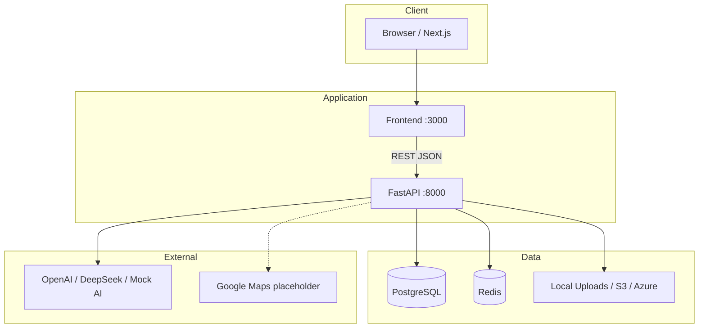
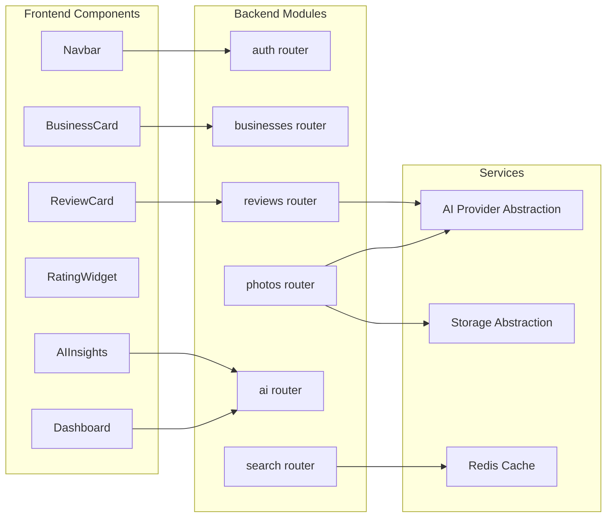

# Architecture

## System Overview

## Component Diagram

## Layer Responsibilities

| Layer | Responsibility |
|-------|----------------|
| Frontend | UI, routing, client auth token storage |
| API Routers | HTTP validation, auth checks, response mapping |
| Services | AI analysis, caching, storage, business logic |
| Models | SQLAlchemy ORM, PostgreSQL persistence |
| Infrastructure | Docker Compose, PostgreSQL, Redis |

## Security

- Passwords hashed with bcrypt
- JWT access tokens (30 min) + refresh tokens (7 days)
- Role-based access: customer, merchant, admin
- CORS restricted to configured origins

## AI Design

All AI outputs include disclaimers. The `AIProvider` protocol allows swapping:
- `mock` — local development (default)
- `openai` / `deepseek` — OpenAI-compatible APIs via env config
