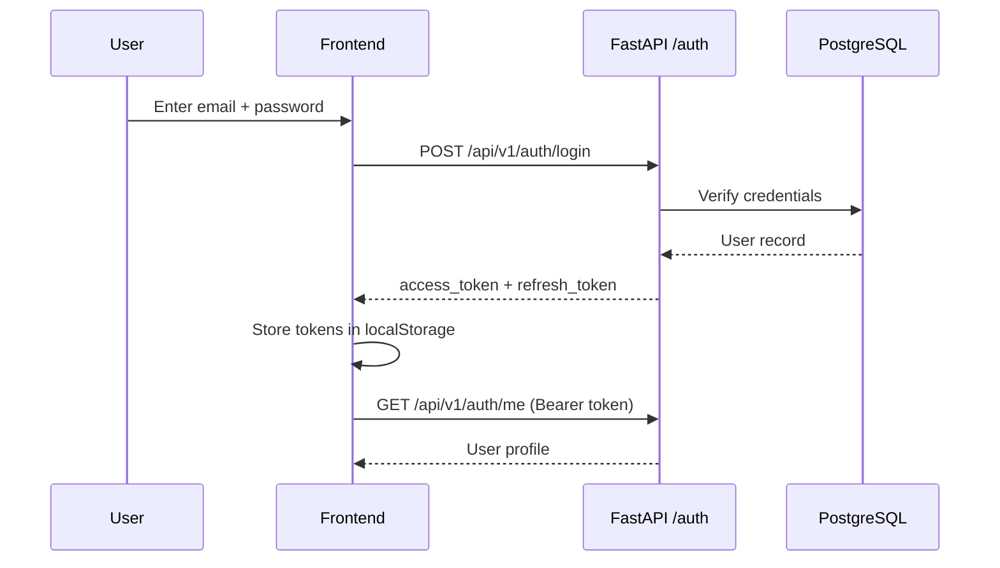
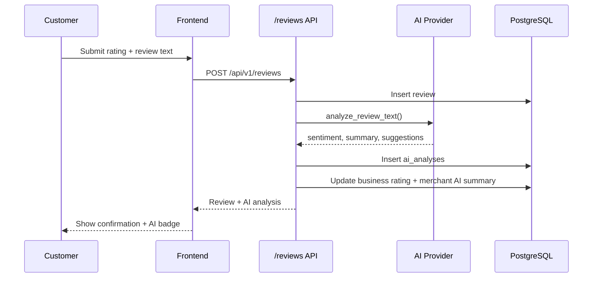
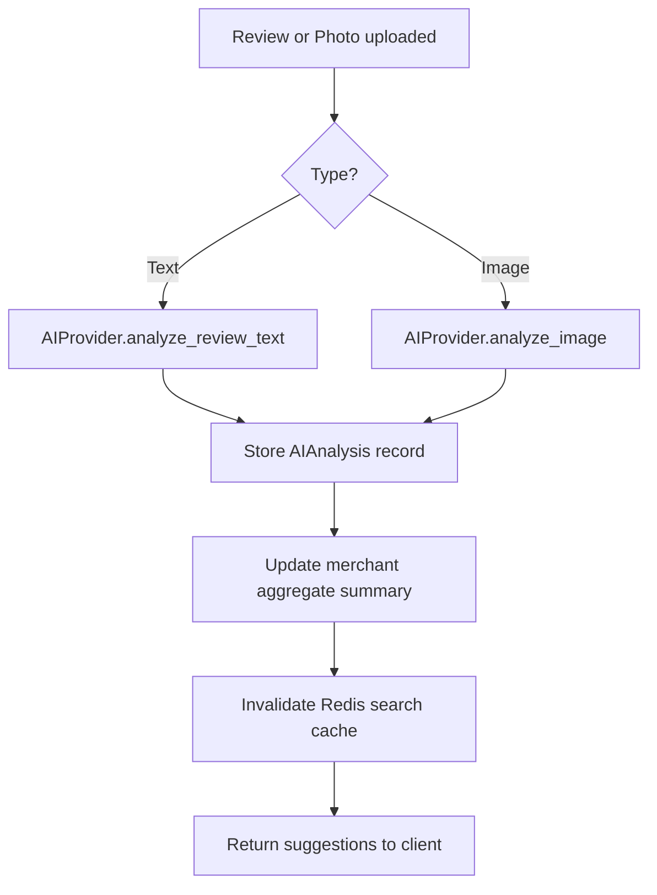
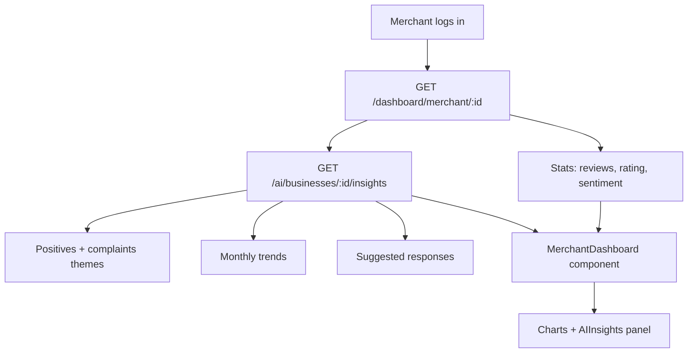
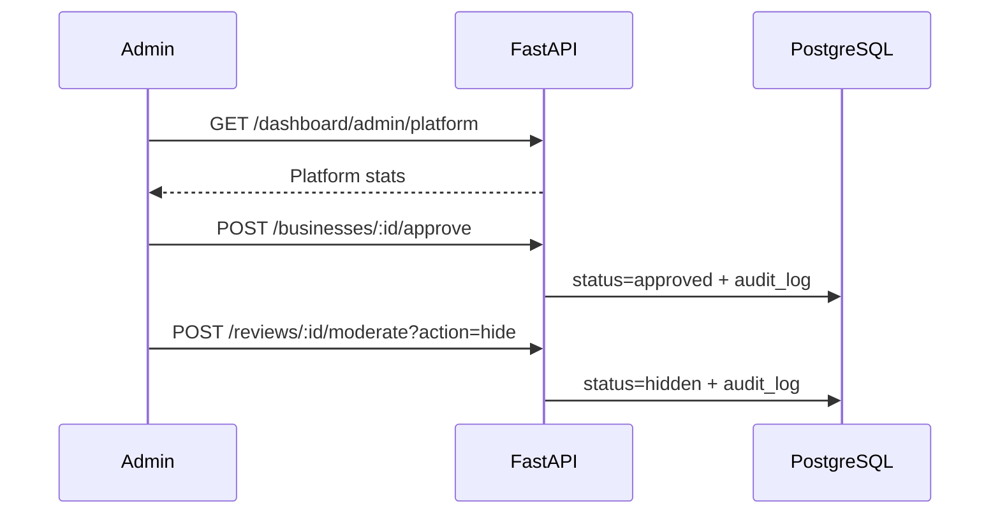

# Flow Diagrams

## Authentication Flow

```mermaid
sequenceDiagram
    participant U as User
    participant F as Frontend
    participant A as FastAPI /auth
    participant D as PostgreSQL

    U->>F: Enter email + password
    F->>A: POST /api/v1/auth/login
    A->>D: Verify credentials
    D-->>A: User record
    A-->>F: access_token + refresh_token
    F->>F: Store tokens in localStorage
    F->>A: GET /api/v1/auth/me (Bearer token)
    A-->>F: User profile
```

## Review Submission Flow

```mermaid
sequenceDiagram
    participant C as Customer
    participant F as Frontend
    participant R as /reviews API
    participant AI as AI Provider
    participant D as PostgreSQL

    C->>F: Submit rating + review text
    F->>R: POST /api/v1/reviews
    R->>D: Insert review
    R->>AI: analyze_review_text()
    AI-->>R: sentiment, summary, suggestions
    R->>D: Insert ai_analyses
    R->>D: Update business rating + merchant AI summary
    R-->>F: Review + AI analysis
    F-->>C: Show confirmation + AI badge
```

## AI Analysis Flow

```mermaid
flowchart TD
    A[Review or Photo uploaded] --> B{Type?}
    B -->|Text| C[AIProvider.analyze_review_text]
    B -->|Image| D[AIProvider.analyze_image]
    C --> E[Store AIAnalysis record]
    D --> E
    E --> F[Update merchant aggregate summary]
    F --> G[Invalidate Redis search cache]
    G --> H[Return suggestions to client]
```

## Merchant Dashboard Flow

```mermaid
flowchart TD
    M[Merchant logs in] --> D[GET /dashboard/merchant/:id]
    D --> S[Stats: reviews, rating, sentiment]
    D --> I[GET /ai/businesses/:id/insights]
    I --> P[Positives + complaints themes]
    I --> T[Monthly trends]
    I --> R[Suggested responses]
    S --> UI[MerchantDashboard component]
    I --> UI
    UI --> CH[Charts + AIInsights panel]
```

## Admin Moderation Flow

```mermaid
sequenceDiagram
    participant A as Admin
    participant API as FastAPI
    participant DB as PostgreSQL

    A->>API: GET /dashboard/admin/platform
    API-->>A: Platform stats

    A->>API: POST /businesses/:id/approve
    API->>DB: status=approved + audit_log

    A->>API: POST /reviews/:id/moderate?action=hide
    API->>DB: status=hidden + audit_log
```
