# MerchantHub AI — Constructive development history

A learning narrative of **what was built, in what order, and why**, mapped from
[`backend/wip plan`](../../backend/wip%20plan) onto the real `git` history on
`main` (`99edb72` → `261c33f`, 34 commits as of 2026-08-10).

This is **not** a substitute for [`README.md`](../../README.md) (product source
of truth). It explains the incremental construction path so technical and
business readers can follow the same graph.

---

## How to read this

### Category tags

| Tag | Meaning |
|-----|---------|
| **Infrastructure** | Docker, Railway, Alembic, compose mounts, Dockerfiles |
| **Backend** | Routers, schemas, models, migrations |
| **Frontend** | Next.js pages/components, `api.ts` |
| **Cache** | Redis search cache, locks, token blocklist |
| **App logic** | Services, integrity rules, RBAC behavior |
| **AI** | Provider registry, gateway, prompts, degradation |
| **Auth/Security** | JWT, Google, logout/blocklist, password hashing |
| **Data/Seed** | Portland / Chennai / US seed scripts |
| **Docs/Tooling** | README consolidation, Cursor↔Claude sync, agents |
| **Deploy** | Start commands, env bake-in, `.gitignore` build fixes |

### Node card format

Each node has two columns:

| Technical | Business / why |
|-----------|----------------|
| What changed in code/architecture | Plain-language reason a customer, merchant, or operator cares |

Commits are grouped by **intent** (~25 nodes), not one card per commit.
Pure typography README tweaks fold into Docs nodes.

### Two zoom levels

1. **Master timeline** — epochs E0→E11  
2. **Per-epoch detail** — individual nodes inside each epoch  

---

## Master timeline

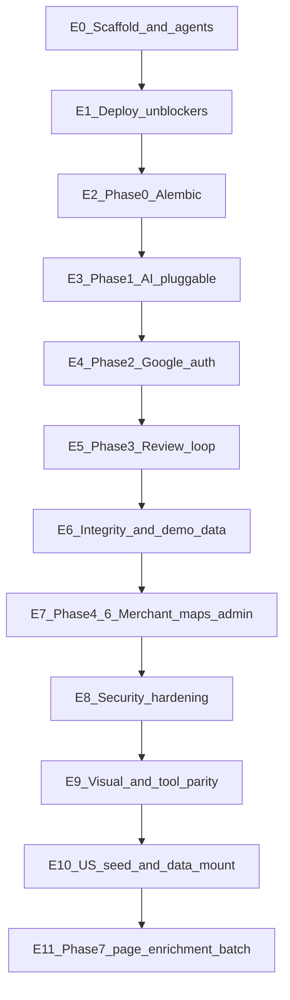

| Epoch | WIP alignment | Commits (representative) | Shipped? |
|-------|---------------|--------------------------|----------|
| E0 Scaffold & agents | Pre-WIP foundation | `99edb72`…`ba3e2ab` | Yes |
| E1 Deploy unblockers | Pre-Phase 0 | `e8bc556`, `b516ccf`, `5542b01`, `f4926f3` | Yes |
| E2 Alembic | Phase 0 | `e59132f` | Yes |
| E3 Pluggable AI | Phase 1a–1c | `5c59b91`, `08ceb13`, `31fe193` | Yes |
| E4 Google auth | Phase 2 | `c8133b6`, `830afa7` | Yes |
| E5 Review loop | Phase 3 | `a5d2235`, `cf62354`, `64b532f`, `a8a7db2` | Yes |
| E6 Integrity + demo | Integrity + Phase 7 demo | `583d50c`, `bcfd51d`, `1752fc0` | Yes |
| E7 Merchant / maps / admin | Phase 4–6 | `886bfb6`, `af148a1` | Yes |
| E8 Session security | Post-Phase 2 | `7667f3a` | Yes |
| E9 Visual / tool parity | Phase 8 partial + tooling | `c67ffb7`, `8dc4e96`, `7be4b10`, `03b67f0` | Yes |
| E10 US real data | Beyond original WIP | `63abd95`, `a79ed5c` | Yes |
| E11 Page enrichment batch | Phase 7 (S-011–S-017) | `261c33f` | Yes (merged) |

---

## E0 — Scaffold and agents (pre-WIP)

**Why this epoch exists:** stand up a monorepo someone can run and a multi-agent
workflow someone can rehearse, before polishing product gaps.

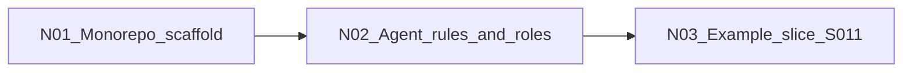

### N01 — Monorepo scaffold

**Categories:** Infrastructure | Backend | Frontend  
**Commits:** `99edb72`, `15548e1`

| Technical | Business / why |
|-----------|----------------|
| Initial FastAPI + Next.js + Postgres/Redis layout; first working app surface (auth, businesses, reviews, search, dashboards as scaffold). | You need a runnable product skeleton before any “next phase” polish — something demos can land on. |

### N02 — Agent rules and roles

**Categories:** Docs/Tooling  
**Commits:** `bf595de`, `ce6e63c`, `ba3e2ab`

| Technical | Business / why |
|-----------|----------------|
| Cursor rules, `AGENTS.md`, PM / Architect / Tester role agents, refined role definitions. | Large features need a repeatable process (who decides what vs how vs ready) so work does not thrash. |

### N03 — Example slice S-011 (draft only)

**Categories:** Docs/Tooling  
**Commits:** `3a575fb`

| Technical | Business / why |
|-----------|----------------|
| Practice multi-agent interaction around customer favorites; slice draft exists, feature not fully wired yet. | Rehearse the PM→Architect→Builder→Tester loop on a clean vertical gap (favorites table existed, API/UI did not). |

---

## E1 — Deploy unblockers

**Why this epoch exists:** the WIP plan assumes a live Railway backend and a
building frontend. These commits fix the blockers that made that assumption false.

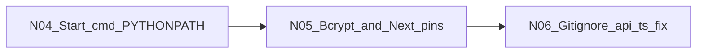

### N04 — Start command / PYTHONPATH

**Categories:** Infrastructure | Deploy  
**Commits:** `e8bc556`

| Technical | Business / why |
|-----------|----------------|
| `docker-compose` and `railway.json` start commands set `PYTHONPATH` so seed/scripts resolve correctly. | Hosted and local boot must actually run migrations/seed — otherwise “deployed” is an empty shell. |

### N05 — bcrypt + Next/ESLint pins

**Categories:** Auth/Security | Frontend | Deploy  
**Commits:** `b516ccf`, `5542b01`

| Technical | Business / why |
|-----------|----------------|
| Explicit `bcrypt` dependency; Next.js / ESLint versions aligned to compatible releases. | Login hashing must work in the image; frontend must build predictably on CI/hosting. |

### N06 — `.gitignore` was swallowing `frontend/src/lib`

**Categories:** Deploy | Frontend  
**Commits:** `f4926f3`

| Technical | Business / why |
|-----------|----------------|
| Unanchored `lib/` ignored `frontend/src/lib/api.ts`; Railway failed with `Can't resolve '@/lib/api'`. Rule scoped to backend venv; API client committed. | Without the shared API client, the production frontend cannot talk to the backend at all. |

---

## E2 — Phase 0 Alembic

**WIP Phase 0.** Schema must be migratable before Google columns, integrity
constraints, or any future table change.

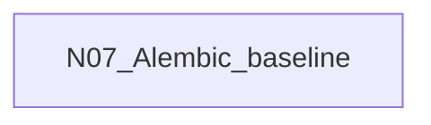

### N07 — Adopt Alembic; stop `create_all()`

**Categories:** Infrastructure | Backend | Deploy  
**Commits:** `e59132f`

| Technical | Business / why |
|-----------|----------------|
| `alembic.ini` + async-aware `env.py` reading URL from settings; 14-table baseline that no-ops on pre-Alembic Railway DBs; `alembic upgrade head` in start commands; drop `Base.metadata.create_all()` from lifespan/seed; `.dockerignore` for local `.venv`. | Deployed DBs never got `ALTER`s under `create_all` — new columns would silently not exist. Migrations unlock every later feature that needs schema. |

---

## E3 — Phase 1 Pluggable AI

**WIP Phase 1a–1c.** Switch among real providers without destroying reviews when
a model misbehaves.

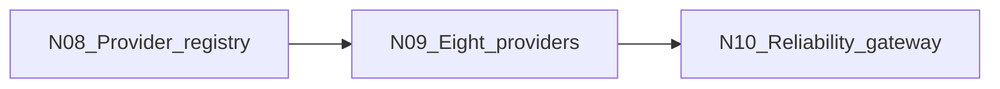

### N08 — Provider registry (1a)

**Categories:** AI | Backend  
**Commits:** `5c59b91`

| Technical | Business / why |
|-----------|----------------|
| Replaced 3-line if/else factory with `@register_provider` + `providers/` autoload; `AIProvider` ABC; `coerce_sentiment()`; `AICallMeta`/`TokenUsage`; settings read inside factory (not at import). | You cannot “just add Groq/Anthropic” with a closed if/else. Also: raw sentiment strings like `"Positive"` used to `ValueError` and **roll back the customer’s review**. |

### N09 — Eight providers behind one switch (1b)

**Categories:** AI | Backend  
**Commits:** `08ceb13`

| Technical | Business / why |
|-----------|----------------|
| `AI_PROVIDER` becomes a registry-validated `str`; nested `AI_PROVIDERS__NAME__API_KEY`; seven OpenAI-shaped specs + Anthropic class; vendor-native env aliases; current model IDs from vendor docs. | Operators pick Qwen/Groq/Gemini/etc. with env vars only — no code edit per vendor, and keys for multiple vendors can coexist. |

### N10 — Reliability gateway (1c)

**Categories:** AI | Cache | App logic | Backend  
**Commits:** `31fe193`

| Technical | Business / why |
|-----------|----------------|
| Retries/deadline/fallback settings; shared HTTP client lifecycle; `ai_degraded` on models; merchant summary moved to background + Redis debounce lock; analysis path degrades instead of failing the write. | A bad API key or timeout must not eat the review. Burst reviews must not fire 20 expensive summary calls. |

---

## E4 — Phase 2 Google sign-in

**WIP Phase 2.** Replace the OAuth stub that minted tokens for a fake UUID.

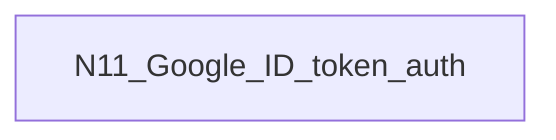

### N11 — Google Identity Services (ID-token flow)

**Categories:** Auth/Security | Backend | Frontend | Docs/Tooling  
**Commits:** `c8133b6`, `830afa7` (docs; `67ae6ba` README clarity folded here)

| Technical | Business / why |
|-----------|----------------|
| `/auth/google` verifies Google ID token; user columns for `google_sub` / `email_verified`; nullable password path; Login/Register GIS buttons; README flow updated away from placeholder OAuth. | Customers expect “Continue with Google.” The old stub issued JWTs that 401’d on the next call — worse than no button. |

---

## E5 — Phase 3 Review loop

**WIP Phase 3.** The product’s core action (write a review, see replies/photos)
had to work end-to-end so AI providers are exercisable from the UI.

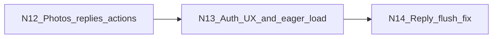

### N12 — Photos, replies, review management

**Categories:** Backend | Frontend | App logic  
**Commits:** `a5d2235`, `cf62354`

| Technical | Business / why |
|-----------|----------------|
| Photo upload validation (type/size); reply APIs wired into `ReviewCard` / `ReviewsList`; eager-load AI analysis on photo queries. | Customers attach photos; merchants answer feedback; galleries show real photo records instead of faking from logo/storefront URLs. |

### N13 — Login/register UX + review fetch hygiene

**Categories:** Frontend | Backend  
**Commits:** `64b532f`

| Technical | Business / why |
|-----------|----------------|
| Hard reload after login/register so nav reflects auth; `AlreadySignedIn` wrapper; eager-load replies/AI on review endpoints. | Avoid “I’m logged in but the UI still thinks I’m not,” and avoid N+1 / missing nested data on dashboards. |

### N14 — `reply_to_review` flush before refresh

**Categories:** Backend | App logic  
**Commits:** `a8a7db2`

| Technical | Business / why |
|-----------|----------------|
| `await db.flush()` before refresh; FakeDB tests enforce flush-before-refresh. | Merchant replies must persist reliably — refreshing an unflushed ORM object is a silent correctness bug. |

---

## E6 — Review integrity and Chennai demo data

**Adjacent to WIP Phase 7 + integrity work.** Trustworthy reviews + a richer
local demo for India.

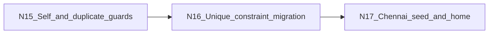

### N15 — App-level integrity guards

**Categories:** App logic | Backend | Data/Seed  
**Commits:** `583d50c`

| Technical | Business / why |
|-----------|----------------|
| Block merchants reviewing their own businesses (403); block duplicate author+business reviews (409); two-phase seed (Portland then Chennai). | Fake self-reviews and spam duplicates destroy trust. Demo needs a second city to show search/home beyond Portland. |

### N16 — DB unique constraint + dedupe

**Categories:** Backend | Infrastructure  
**Commits:** `bcfd51d`

| Technical | Business / why |
|-----------|----------------|
| Migration dedupes existing `(author_id, business_id)` rows then adds `uq_author_business_review`. | App checks are not enough under races or direct API abuse — the database enforces “one review per person per shop.” |

### N17 — Chennai upsert + home/filter display

**Categories:** Data/Seed | Frontend  
**Commits:** `1752fc0`

| Technical | Business / why |
|-----------|----------------|
| Idempotent Chennai businesses + Unsplash photos; home/cards highlight storefronts; FilterPanel Chennai/nearby options. | Portfolio/demo audiences in India see recognizable local listings, not only US Portland fixtures. |

---

## E7 — Phase 4–6 Merchant, maps, admin

**WIP Phases 4–6** (bundled in practice). Merchants see *their* businesses;
search works geographically; admins see reported content; frontend image is
production-ready.

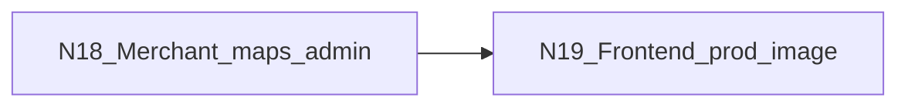

### N18 — My businesses, OSM/geo search, reported queue

**Categories:** Backend | Frontend | App logic  
**Commits:** `886bfb6`

| Technical | Business / why |
|-----------|----------------|
| Merchant-owned business list (any approval status); OpenStreetMap/geocode docs + radius search with lat/lng; admin reported-review listing; FilterPanel preserves geo params. | Merchants must not see a random global `list()[0]`. Customers find shops “near me.” Admins need a moderation queue, not a stats dump only. |

### N19 — Frontend production Dockerfile

**Categories:** Deploy | Infrastructure | Frontend  
**Commits:** `af148a1`

| Technical | Business / why |
|-----------|----------------|
| Build-args for `NEXT_PUBLIC_API_URL` / `NEXT_PUBLIC_GOOGLE_CLIENT_ID`; Railway runs `npm run start` (prod) not `next dev`. | Public env vars must be baked into the client bundle at build time or Google/API wiring breaks only in production. |

---

## E8 — Session security hardening

**Post-Phase 2.** Logout must actually invalidate tokens.

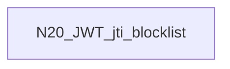

### N20 — Redis JWT `jti` blocklist on logout

**Categories:** Auth/Security | Cache | Backend  
**Commits:** `7667f3a`

| Technical | Business / why |
|-----------|----------------|
| Logout blocklists access (and optional refresh) `jti` until natural expiry; auth checks reject blocklisted tokens; `LogoutRequest` schema. | Without revocation, a stolen JWT stays valid until TTL even after “Log out” — bad for shared computers and incident response. |

---

## E9 — Visual start + tool parity

**WIP Phase 8 (partial)** plus Cursor↔Claude documentation discipline.

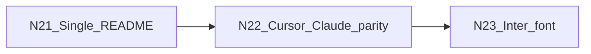

### N21 — Consolidate docs into README

**Categories:** Docs/Tooling  
**Commits:** `c67ffb7`

| Technical | Business / why |
|-----------|----------------|
| Merged scattered `API_REFERENCE.md` / `ARCHITECTURE.md` / etc. into one `README.md`; updated agent references. | One place to read contracts and gaps — agents and humans stop drifting across duplicate markdown. |

### N22 — Cursor ↔ Claude Code sync

**Categories:** Docs/Tooling  
**Commits:** `8dc4e96`, `7be4b10`

| Technical | Business / why |
|-----------|----------------|
| Nested `CLAUDE.md` mirrors `.cursor/rules/`; sync rule + pre-commit/CI check so pairs cannot drift. | The project is built in both tools; conventions must stay identical or parallel agents invent conflicting patterns. |

### N23 — Inter font / layout typography

**Categories:** Frontend  
**Commits:** `03b67f0`

| Technical | Business / why |
|-----------|----------------|
| Tailwind font family + `RootLayout` applies Inter. | First visible step toward Phase 8 visual polish without waiting on a full Figma reskin. |

---

## E10 — US real-business seed

**Beyond the original WIP text**, but same “make demos believable” theme as
Phase 7 enrichment.

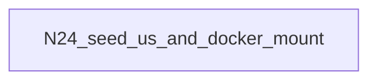

### N24 — `seed_us` + data volume mount

**Categories:** Data/Seed | Infrastructure | Docs/Tooling  
**Commits:** `63abd95`, `a79ed5c`

| Technical | Business / why |
|-----------|----------------|
| Mount `./data/real-businesses` into the backend container; `seed_us.py` upserts ~40 US listings with Unsplash + synthetic reviews; category ensure for new types; README path/resolution clarity. | Demo coverage expands to multiple US cities without scraping real review text; Docker can read JSON that lives outside `backend/`. |

---

## E11 — Phase 7 page enrichment batch (S-011–S-017)

**WIP Phase 7** (and Phase 8 primitives), implemented as parallel slices and
merged in one batch commit on `main`.

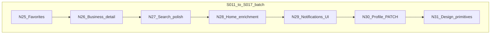

**Commit:** `261c33f` — *Add favorites feature and enhance user profile management*  
(also ships search polish, home enrichment, notifications bell, design primitives, and slice docs).

### N25 — Customer favorites (S-011)

**Categories:** Backend | Frontend | App logic  

| Technical | Business / why |
|-----------|----------------|
| New `/api/v1/favorites` router (list/add/remove); `FavoriteButton` on business detail; favorites grid on `/profile`; `api.ts` client. | Customers can save shops and find them again — the `favorites` table finally has a product surface. |

### N26 — Business detail enrichment (S-012)

**Categories:** Frontend  

| Technical | Business / why |
|-----------|----------------|
| Details section: email (`mailto:`), website (new tab), `BusinessHours`, full `CategoryBadges` (not just first category); RTL tests. | API already returned these fields; users can contact/visit without guessing from a thin header. |

### N27 — Search pagination / sort / live categories (S-013)

**Categories:** Frontend | Backend  

| Technical | Business / why |
|-----------|----------------|
| Search UI gains sort + pagination; category filters from API (not only hardcoded list); FilterPanel/param preservation improvements. | Discovery scales past one page of results and matches how people actually browse. |

### N28 — Home page enrichment (S-014)

**Categories:** Frontend | Backend  

| Technical | Business / why |
|-----------|----------------|
| Home gains category tiles / stats-oriented sections / how-it-works style content wired in `page.tsx` (batch). | First-time visitors see platform shape, not only a raw business grid. |

### N29 — Notifications UI (S-015)

**Categories:** Frontend  

| Technical | Business / why |
|-----------|----------------|
| `NotificationBell` in navbar; list / mark-read / mark-all-read against existing notifications API; smoke test. | Backend notifications existed unused — users now see activity without hunting per page. |

### N30 — Profile settings edit (S-016)

**Categories:** Backend | Frontend | Auth/Security  

| Technical | Business / why |
|-----------|----------------|
| `PATCH /auth/me` for `full_name` / `avatar_url` only (extra fields ignored); profile form + settings entry point. | Users fix their own display identity; email/role stay non-self-service for safety. |

### N31 — Design system primitives (S-017)

**Categories:** Frontend | Docs/Tooling  

| Technical | Business / why |
|-----------|----------------|
| Additive `ui/Select`, `ui/StatCard`, `ui/RatingWidget` + RTL smokes; existing screens **not** mass-migrated. | Future screens share consistent controls; migration of ~25 call sites is an explicit later slice. |

---

## WIP plan vs shipped (matrix)

Source plan: [`backend/wip plan`](../../backend/wip%20plan).

| WIP phase | Status on `main` | Evidence |
|-----------|------------------|----------|
| **0** Alembic | **Done** | E2 / `e59132f` |
| **1a–1c** Pluggable AI + reliability | **Done** | E3 |
| **2** Google sign-in | **Done** | E4 |
| **3** Review loop | **Done** (core path) | E5 |
| **4** Merchant onboarding/dashboard | **Mostly done** | E7 my-businesses + existing create/edit UI on main |
| **5** Maps (Leaflet/OSM) | **Done** | E7 + README maps row |
| **6** Admin moderation | **Mostly done** | E7 reported queue + admin UI on main |
| **7** Page enrichment | **Done** (batch) | E11 / `261c33f` |
| **8** Visual design | **Partial** | Font (E9) + primitives (N31); full Figma reskin / call-site migration open |
| **Parked** cost & billing | **Still parked** | Usage metadata captured in AI path; no spend dashboard |

---

## What is still open

From [`README.md` §14](../../README.md) (post–S-011–S-017):

| Gap | Why it still matters |
|-----|----------------------|
| S3 / Azure storage stubs | Uploads die on redeploy if only local disk is used in production |
| Thin / incomplete test isolation | Harder to change safely as features accumulate |
| Design-system **migration** deferred | Primitives exist; most screens still hand-roll controls |
| Security weaknesses §9 items 1–6 | Cookies, rate limits, secret defaults, etc. |
| No structured request logging | Ops cannot diagnose production without guessing |
| App-level CI (pytest/Jest) | Agent-config sync CI exists; full test CI still open |
| Cost / billing (WIP parked) | Needed before heavy paid-provider traffic |

Suggested next steps remain those in README §14 (security → tests → migrate UI primitives → S3 → CI).

---

## Quick commit index (chronological)

| SHA | Date | Subject |
|-----|------|---------|
| `99edb72` | 2026-07-05 | Initial commit |
| `15548e1` | 2026-07-05 | First version |
| `bf595de` | 2026-07-05 | updated cursor rules and agents.md file |
| `ce6e63c` | 2026-07-05 | Add Role agents |
| `3a575fb` | 2026-07-05 | exampl implemenation of a feature with multiagent interaction |
| `ba3e2ab` | 2026-08-08 | Refine multiagent interaction implementation and enhance agent role definitions |
| `e8bc556` | 2026-08-08 | Update start command … PYTHONPATH |
| `b516ccf` | 2026-08-08 | Add bcrypt dependency |
| `5542b01` | 2026-08-08 | Update Next.js and ESLint configuration |
| `f4926f3` | 2026-08-08 | Fix .gitignore lib/ rule swallowing frontend/src/lib |
| `e59132f` | 2026-08-09 | Adopt Alembic; stop creating schema with create_all() |
| `5c59b91` | 2026-08-09 | Replace the AI if/else factory with a provider registry |
| `c67ffb7` | 2026-08-09 | Consolidate documentation into README.md |
| `08ceb13` | 2026-08-09 | Wire up eight AI providers behind one AI_PROVIDER switch |
| `31fe193` | 2026-08-09 | Enhance AI provider configuration and summary refresh handling |
| `67ae6ba` | 2026-08-09 | Update README.md for improved clarity |
| `c8133b6` | 2026-08-09 | Implement Google sign-in |
| `a5d2235` | 2026-08-09 | Enhance photo upload and review management |
| `cf62354` | 2026-08-09 | Refactor photo retrieval/upload |
| `64b532f` | 2026-08-09 | Enhance review data retrieval and login/register forms |
| `a8a7db2` | 2026-08-09 | Fix reply_to_review flush |
| `583d50c` | 2026-08-09 | Enhance review functionality and seeding |
| `1752fc0` | 2026-08-09 | Enhance Chennai business seeding and frontend display |
| `bcfd51d` | 2026-08-09 | Unique constraint for author-business reviews |
| `886bfb6` | 2026-08-09 | Enhance business and review management features |
| `af148a1` | 2026-08-09 | Frontend Dockerfile production build setup |
| `7667f3a` | 2026-08-09 | Token blocklisting and logout |
| `8dc4e96` | 2026-08-09 | AGENTS.md CLAUDE.md integration |
| `7be4b10` | 2026-08-09 | Cursor ↔ Claude Code sync rules |
| `830afa7` | 2026-08-09 | README auth flow / endpoints |
| `03b67f0` | 2026-08-09 | Custom font support |
| `63abd95` | 2026-08-10 | Data seeding and Docker configuration |
| `a79ed5c` | 2026-08-10 | Refine data seeding process |
| `261c33f` | 2026-08-10 | Favorites + profile + S-011–S-017 enrichment batch |

---

## Related artifacts

- Forward plan that drove E2–E7: [`backend/wip plan`](../../backend/wip%20plan)
- Product gaps / next steps: [`README.md` §14](../../README.md)
- Slice briefs for the enrichment batch: [`docs/agents/slices/`](slices/)
- Multi-agent workflow: [`README.md` §13](../../README.md)
