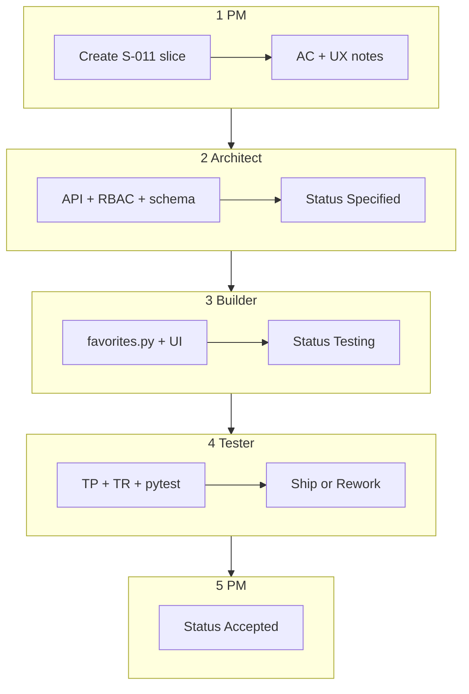

# Multi-agent flow — end-to-end example (S-011 Customer Favorites)

This guide walks through the **PM → Architect → Builder → Tester → PM** cycle using a real MerchantHub AI feature.

**Example slice:** Customers save/unsave favorite businesses and view them on their profile.

**Why this example:** The `Favorite` model exists in `backend/app/models/__init__.py`, but there is **no API router, no API client methods, and no UI** yet — a clean vertical slice to practice the workflow.

**Related rules (Cursor):** `.cursor/rules/agents/workflow.mdc`, `role-product-manager.mdc`, `role-architect.mdc`, `role-tester.mdc`

---

## Before you start

1. Read [`WORKFLOW.md`](WORKFLOW.md) for the overview
2. Open or create [`slices/S-011-customer-favorites.md`](slices/S-011-customer-favorites.md) (companion example slice)
3. Tell the Cursor agent **which role to play** using the prompts below

### Status flow

```
Draft → Specified → In Progress → Testing → Accepted
  PM       Architect    Builder       Tester      PM
```

---

## STAGE 1 — Product Manager

### Your prompt (copy/paste)

```
Act as Product Manager for MerchantHub AI.
Create docs/agents/slices/S-011-customer-favorites.md from docs/agents/slices/_TEMPLATE.md.
Feature: logged-in customers can favorite/unfavorite an approved business and see favorites on /profile.
Set Status: Draft.
Follow .cursor/rules/agents/role-product-manager.mdc.
```

### What PM must produce

**User story:** As a **customer**, I want to save businesses I like, so I can find them quickly later.

**Sample acceptance criteria:**

1. **Given** I am logged in, **when** I click Favorite on a business profile, **then** the business is saved and the button shows "Favorited".
2. **Given** I favorited a business, **when** I click Favorite again, **then** it is removed (toggle).
3. **Given** I have favorites, **when** I open `/profile`, **then** I see a list of favorited businesses (name, city, rating).
4. **Given** I am not logged in, **when** I click Favorite, **then** I am redirected to `/login`.
5. **Given** a business is not approved, **when** I try to favorite it, **then** the API returns 404 or the action is unavailable.
6. AI disclaimer **not required** for this slice (no AI output).

**Out of scope:** Sharing favorites, email notifications on favorite.

**PM sets:** `Status: Draft` → hand off to Architect.

---

## STAGE 2 — Architect

### Your prompt

```
Act as Architect for slice S-011-customer-favorites.
Read docs/agents/slices/S-011-customer-favorites.md and fill the Technical specification section.
Include API contract, RBAC matrix, data model impact (Favorite table already exists).
Set Status: Specified when checklist is complete.
Follow .cursor/rules/agents/role-architect.mdc.
```

### What Architect must produce (example)

#### API contract

| Method | Path | Auth | Request | Response |
|--------|------|------|---------|----------|
| POST | `/api/v1/favorites` | customer | `{ "business_id": "uuid" }` | `{ "favorited": true, "business_id": "uuid" }` |
| DELETE | `/api/v1/favorites/{business_id}` | customer | — | 204 No Content |
| GET | `/api/v1/favorites` | customer | — | `BusinessResponse[]` |

#### RBAC matrix

| Action | customer | merchant | admin |
|--------|----------|----------|-------|
| Add favorite | ✅ | ✅ (optional) | ✅ |
| Remove favorite | ✅ own | ✅ own | ✅ |
| List own favorites | ✅ | ✅ | ✅ |

#### Data model impact

- [x] **Extend existing** — table `favorites` already exists (`user_id`, `business_id`, unique constraint)
- No migration required if schema matches

#### Frontend

| Item | Choice |
|------|--------|
| Route | `/profile` (extend `ProfilePage`) |
| Rendering | **CSR** (requires auth token from localStorage) |
| Business profile | Add Favorite toggle on `businesses/[slug]/page.tsx` |
| Reuse | `BusinessCard` for favorites list |

#### Cache / side effects

- None required for MVP (favorites don't affect search cache)

#### Architect checklist

- [ ] API contract defined
- [ ] RBAC matrix complete
- [ ] Data model impact documented
- [ ] Cache invalidation considered
- [ ] Uses existing abstractions (no new AI/storage)
- [ ] ERD/API updates noted

**Architect sets:** `Status: Specified`

> **Gate:** Do NOT implement until Status is **Specified** and checklist is complete.

---

## STAGE 3 — Builder

### Your prompt

```
Implement slice S-011 per docs/agents/slices/S-011-customer-favorites.md architect spec.
- Add backend router favorites.py mounted at /api/v1/favorites
- Extend frontend src/lib/api.ts and ProfilePage / business profile UI
- Update docs/API_REFERENCE.md if needed
Set slice Status: Testing when done.
Follow backend-fastapi and frontend-nextjs rules.
```

### What Builder produces (file checklist)

| Area | Files |
|------|-------|
| Backend router | `backend/app/routers/favorites.py` |
| Register router | `backend/app/main.py` |
| Schemas | `backend/app/schemas/__init__.py` (if needed) |
| API client | `frontend/src/lib/api.ts` |
| UI | `FavoriteButton.tsx` or inline on business page, `ProfilePage.tsx` |
| Docs | `docs/API_REFERENCE.md` |

**Builder sets:** `Status: Testing`

---

## STAGE 4 — Tester

### Your prompt

```
Act as Tester for slice S-011-customer-favorites.
Create docs/agents/test-plans/TP-S-011-customer-favorites.md and
docs/agents/test-reports/TR-S-011-customer-favorites.md.
Map every acceptance criterion to a test (pytest or manual ID).
Add backend/tests/test_favorites.py. Use AI_PROVIDER=mock.
Follow .cursor/rules/agents/role-tester.mdc.
```

### What Tester must produce

#### AC coverage matrix (example)

| AC# | Description | Type | Test reference |
|-----|-------------|------|----------------|
| 1 | Add favorite when logged in | A | `test_favorites.py::test_create_favorite` |
| 2 | Toggle remove favorite | A | `test_favorites.py::test_remove_favorite` |
| 3 | List on /profile | M | M-001 manual checklist |
| 4 | Unauthenticated → 401 | A | `test_favorites.py::test_favorite_unauthenticated_401` |
| 5 | Unapproved business → 404 | A | `test_favorites.py::test_favorite_unapproved_business_404` |

#### Commands to run

```bash
cd backend && pytest tests/test_favorites.py -v
cd frontend && npm test
docker compose up --build   # smoke test
```

**Tester recommendation:** Ship | Rework (list failed AC# if any)

---

## STAGE 5 — Product Manager (accept)

### Your prompt

```
Act as Product Manager.
Review docs/agents/test-reports/TR-S-011-customer-favorites.md against
docs/agents/slices/S-011-customer-favorites.md acceptance criteria.
Set Status: Accepted or list rework for failed ACs.
```

**PM sets:** `Status: Accepted` when all AC pass.

---

## Full cycle (one prompt)

```
Run multi-agent workflow for S-011 customer favorites.
Stop after PM, Architect, implementation, and Tester stages for my approval.
Use docs/agents/WORKFLOW.md and docs/agents/EXAMPLE-END-TO-END.md.
```

---

## Visual summary



---

## Which Cursor rules apply when

| Stage | Agent rule (`.cursor/rules/agents/`) | Builder rules (auto by file) |
|-------|--------------------------------------|------------------------------|
| PM | `role-product-manager.mdc` | `docs-and-api.mdc` |
| Architect | `role-architect.mdc` | `database.mdc`, `docs-and-api.mdc` |
| Builder | — | `project.mdc`, `backend-fastapi.mdc`, `frontend-nextjs.mdc` |
| Tester | `role-tester.mdc` | `testing.mdc` |

`project.mdc` always applies to every session.

---

## How `.mdc` rules and docs work together

| You provide | Agent uses |
|-------------|------------|
| Feature idea + "Act as PM/Architect/Tester" | Role `.mdc` behavior |
| Slice file path (`S-011-*.md`) | Artifact template + AC |
| "Implement slice S-011" | Builder `.mdc` + slice architect spec |
| This guide | End-to-end reference example |

You do **not** manually enable `.mdc` files — Cursor loads them by `alwaysApply` and `globs`. Opening the slice file in the editor helps attach the right rules.

---

## Common mistakes

1. **Skipping Architect** → API drift, wrong RBAC
2. **Slice too big** → split into S-011a (API) and S-011b (UI) if needed
3. **No numbered AC** → Tester cannot map coverage
4. **Implementing before Specified** → violates workflow gate
5. **Forgetting `docs/API_REFERENCE.md`** → docs out of sync with Swagger

---

## Practice checklist

- [ ] Run Stage 1 PM prompt → slice file exists with AC
- [ ] Run Stage 2 Architect prompt → tech spec + Status: Specified
- [ ] Run Stage 3 Builder prompt → code + Status: Testing
- [ ] Run Stage 4 Tester prompt → test plan + report + pytest
- [ ] Run Stage 5 PM prompt → Status: Accepted

---

## Related files

| File | Purpose |
|------|---------|
| [`WORKFLOW.md`](WORKFLOW.md) | Playbook + backlog table |
| [`slices/_TEMPLATE.md`](slices/_TEMPLATE.md) | Blank slice template |
| [`slices/S-011-customer-favorites.md`](slices/S-011-customer-favorites.md) | Pre-filled PM example to extend |
| [`../AGENTS.md`](../AGENTS.md) | Agent entry point |
