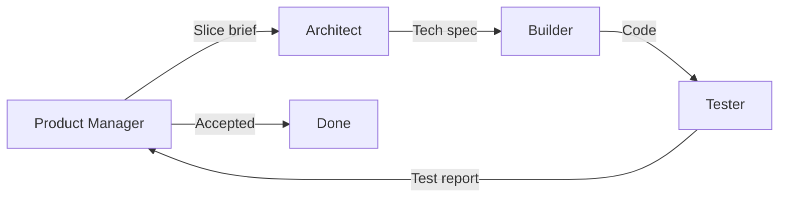

# Multi-agent workflow

How **Product Manager**, **Architect**, and **Tester** agents collaborate to build MerchantHub AI in vertical slices.

## Overview



| Role | Cursor rule | Primary artifacts |
|------|-------------|-------------------|
| Product Manager | `.cursor/rules/agents/role-product-manager.mdc` | `docs/agents/slices/` |
| Architect | `.cursor/rules/agents/role-architect.mdc` | Slice tech spec + `docs/agents/adrs/` |
| Tester | `.cursor/rules/agents/role-tester.mdc` | `docs/agents/test-plans/`, `test-reports/` |
| Orchestration | `.cursor/rules/agents/workflow.mdc` | This file |

**Builder** (implementation) uses existing rules: `backend-fastapi`, `frontend-nextjs`, etc.

---

## Directory layout

```
docs/agents/
├── WORKFLOW.md              ← you are here
├── slices/
│   ├── _TEMPLATE.md         ← copy for new features
│   └── S-001-*.md           ← one file per vertical slice
├── adrs/
│   └── ADR-001-*.md         ← architect decision records
├── test-plans/
│   └── TP-S-001-*.md
└── test-reports/
    └── TR-S-001-*.md
```

---

## Step-by-step

### 1. Product Manager — create slice

1. Copy `docs/agents/slices/_TEMPLATE.md` → `docs/agents/slices/S-00X-short-name.md`
2. Fill user story, acceptance criteria, UX notes
3. Set `Status: Draft`

**Prompt example:**
> Act as Product Manager. Create slice S-005 for merchant AI insights dashboard using the template.

### 2. Architect — technical specification

1. Open the slice file
2. Fill **Technical specification** section and checklist
3. Add ADR if decision is significant
4. Set `Status: Specified`

**Prompt example:**
> Act as Architect. Add technical spec to S-005 including API contract and RBAC matrix.

### 3. Builder — implement

1. Follow Architect spec + builder `.cursor/rules/`
2. Update `docs/API_REFERENCE.md`, ERD, FLOWS as needed
3. Set slice `Status: In Progress` → `Testing` when code complete

**Prompt example:**
> Implement slice S-005 per the architect spec.

### 4. Tester — verify

1. Write `docs/agents/test-plans/TP-S-005-*.md` (can start after Architect step)
2. Add/update pytest and RTL tests
3. Write `docs/agents/test-reports/TR-S-005-*.md` with AC coverage matrix
4. Recommend Ship or Rework

**Prompt example:**
> Act as Tester. Verify S-005 and produce test report with AC coverage.

### 5. Product Manager — accept

1. Review test report
2. If all AC pass → `Status: Accepted`
3. Else → list gaps and re-open

---

## Suggested slice backlog (from build prompt)

| ID | Title | Phase | Status |
|----|-------|-------|--------|
| S-001 | Docker + auth + layout | 1 Foundation | Scaffolded |
| S-002 | Business CRUD + admin approval | 2 Core | Scaffolded |
| S-003 | Review CRUD + photos | 2 Core | Scaffolded |
| S-004 | Search + filter | 2 Core | Scaffolded |
| S-005 | AI review analysis pipeline | 3 AI | Scaffolded |
| S-006 | Merchant dashboard + AI insights | 4 Dashboards | Partial |
| S-007 | Admin moderation + platform analytics | 4 Dashboards | Partial |
| S-008 | Notifications | 4 Dashboards | Scaffolded |
| S-009 | OAuth + maps placeholders | 5 Polish | Partial |
| S-010 | Test hardening + deploy verification | 5 Polish | Open |

Update this table as slices move through the workflow.

---

## Full-cycle prompt

> Run the multi-agent workflow for slice S-006: PM review AC → Architect gap analysis → implement gaps → Tester report.

---

## Conflict rules

| Topic | Decision owner |
|-------|----------------|
| Feature priority | Product Manager |
| API / schema design | Architect |
| Release readiness | Tester |
| Code style / patterns | Builder rules |

---

## Related docs

- [Master build prompt](../MERCHANTHUB_AI_BUILD_PROMPT.md)
- [Architecture](../ARCHITECTURE.md)
- [AGENTS.md](../../AGENTS.md)
