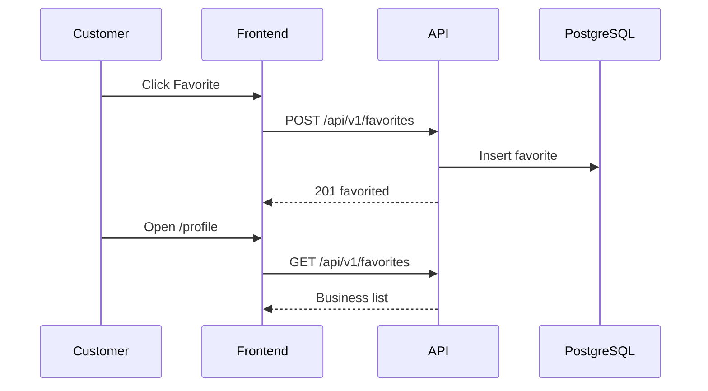

# Slice: S-011 — Customer favorites

| Field | Value |
|-------|-------|
| **Slice ID** | S-011 |
| **Phase** | 2 Core |
| **Status** | Draft |
| **Role(s)** | customer |
| **Owner** | PM / example slice for multi-agent practice |

> **Practice guide:** See [`EXAMPLE-END-TO-END.md`](../EXAMPLE-END-TO-END.md) for step-by-step agent prompts.

---

## User story

**As a** customer  
**I want** to save businesses I like to a favorites list  
**So that** I can quickly find and revisit them later

---

## Acceptance criteria

1. **Given** I am logged in as a customer, **when** I click Favorite on an approved business profile, **then** the business is saved and the button shows a "Favorited" state.
2. **Given** I have favorited a business, **when** I click Favorite again on that business, **then** the favorite is removed (toggle behavior).
3. **Given** I have one or more favorites, **when** I open `/profile`, **then** I see a list of favorited businesses showing name, city, and average rating.
4. **Given** I am not logged in, **when** I click Favorite on a business profile, **then** I am redirected to `/login`.
5. **Given** a business is not in `approved` status, **when** I attempt to favorite it via the API, **then** the server returns 404 or 400 and no favorite is created.

---

## UX notes

- **Screens / routes:** `/businesses/[slug]` (Favorite button), `/profile` (favorites list)
- **Components to reuse:** `BusinessCard`, existing `ProfilePage`
- **Empty state:** Profile shows "No favorites yet — discover businesses" with link to `/search`
- **AI disclaimer required?** No

---

## Out of scope

- Sharing favorites with other users
- Notifications when a favorited business gets new reviews
- Merchants seeing who favorited their business

---

## Dependencies

- S-002 Business CRUD + admin approval (businesses must be approvable/listable) — **Scaffolded**
- S-001 Auth (login required) — **Scaffolded**

---

## Definition of done (PM)

- [ ] All AC verified in test report
- [ ] Favorites list and toggle work for customer role
- [ ] Documented in `docs/API_REFERENCE.md`
- [ ] PM Status set to **Accepted**

---

## Technical specification (Architect)

> **To be filled by Architect.** Run:
> `Act as Architect for slice S-011-customer-favorites.`

### API contract

| Method | Path | Auth | Request | Response |
|--------|------|------|---------|----------|
| | | | | |

### RBAC matrix

| Action | customer | merchant | admin |
|--------|----------|----------|-------|
| | | | |

### Data model impact

- [ ] None  [x] Extend existing  [ ] New table(s)

**Details:** `favorites` table exists in `backend/app/models/__init__.py` with `(user_id, business_id)` unique constraint.

### Cache / side effects

### Frontend

- **Route:** `/profile`, `/businesses/[slug]`
- **Rendering:** CSR
- **Components:** `BusinessCard`, new or inline Favorite toggle

### Flow

### Architect checklist

- [ ] API contract defined
- [ ] RBAC matrix complete
- [ ] Data model impact documented
- [ ] Cache invalidation considered
- [ ] Uses AI/storage abstractions where applicable
- [ ] ERD/API/FLOWS updates noted

### Risks / tradeoffs

-

---

## Links

- Walkthrough: [`docs/agents/EXAMPLE-END-TO-END.md`](../EXAMPLE-END-TO-END.md)
- Test plan: `docs/agents/test-plans/TP-S-011-customer-favorites.md` (to be created)
- Test report: `docs/agents/test-reports/TR-S-011-customer-favorites.md` (to be created)

---

## Changelog

| Date | Agent | Change |
|------|-------|--------|
| 2026-07-05 | PM | Example slice created for multi-agent practice |
