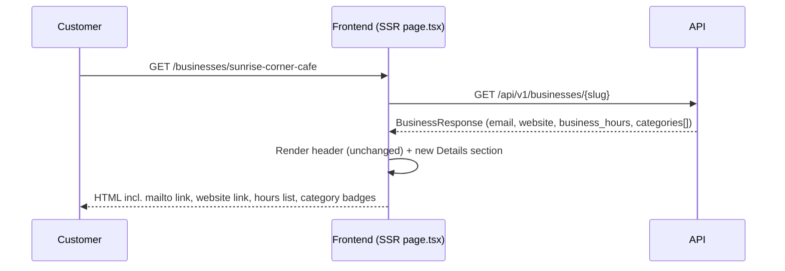

# Slice: S-012 — Business detail enrichment

| Field | Value |
|-------|-------|
| **Slice ID** | S-012 |
| **Phase** | 5 Polish |
| **Status** | Accepted |
| **Role(s)** | customer |
| **Owner** | PM / single-session vertical-slice run |

---

## User story

**As a** customer researching a business
**I want** the business detail page to show its email, website, opening hours, and full list of categories
**So that** I can decide how and when to contact or visit it without leaving the page

---

## Acceptance criteria

1. **Given** a business has an `email`, **when** I view its detail page, **then** the email is rendered as a clickable `mailto:` link showing the address.
2. **Given** a business has no `email`, **when** I view its detail page, **then** no email row is rendered (no broken link, no literal "undefined"/"null").
3. **Given** a business has a `website`, **when** I view its detail page, **then** the website is rendered as a link that opens in a new tab (`target="_blank"`) with `rel="noopener noreferrer"`.
4. **Given** a business has no `website`, **when** I view its detail page, **then** no website row is rendered.
5. **Given** a business has usable `business_hours` entries, **when** I view its detail page, **then** each entry is rendered as a label/value pair (e.g. "mon-fri: 7am-6pm"), matching the free-form `{ "mon-fri": "7am-6pm", "sat-sun": "8am-5pm" }` shape seeded in `backend/scripts/seed.py` and `backend/scripts/seed_chennai.py`.
6. **Given** a business's `business_hours` is `null`, an empty object, or contains only empty/null values, **when** I view its detail page, **then** hours render as a graceful "Hours not listed" fallback (or are omitted if no other detail data exists either) — never a runtime error and never a literal "null"/"undefined" string.
7. **Given** a business has more than one category, **when** I view its detail page, **then** every category is rendered as a `Badge` tag (not just the first, which is the current behavior).
8. **Given** a business has zero categories, **when** I view its detail page, **then** no category badge row/empty container is rendered.
9. **Given** a business has none of email, website, business_hours, or categories, **when** I view its detail page, **then** no empty "Details" section/card is rendered at all.

---

## UX notes

- **Screens / routes:** `/businesses/[slug]` only.
- **Components to reuse:** `ui/Badge` (category tags, `tone="neutral"`), `ui/Card` (new section wrapper).
- **New components:** small presentational `BusinessHours` and `CategoryBadges` components under `frontend/src/components/`, so the new rendering logic is unit-testable with RTL (the page itself is an async Server Component with no existing test harness in this repo).
- **Placement:** a new "Details" `<section>` inserted between the existing header card and the "Location" section. The existing header's eyebrow line (`categories?.[0]?.name`), rating row, and "Write a review" button are left untouched — full category badges appear only in the new Details section, not the eyebrow. This is a deliberate additive placement to avoid the header/rating area, which a parallel slice (S-011, favorites) is also editing.
- **Empty states / errors:** every sub-row (email, website, hours, categories) is independently conditional; the whole Details section is skipped if nothing would render. No error states — this is a defensive rendering-only slice, no new network calls.
- **AI disclaimer required?** No — none of this content is AI-generated.

---

## Out of scope

- Any change to `email`/`website`/`business_hours` on the business **create/edit** forms (`BusinessForm.tsx`) — display only.
- Structured/typed `business_hours` (e.g. a real per-weekday schema, timezone handling, "open now" logic) — the backend stores it as a free-form `dict[str, Any]`; this slice renders whatever keys/values exist.
- Rendering `country` (not requested; low value beside the existing `placeLine`).
- Any backend/schema change — `BusinessResponse` already serializes `email`, `website`, `business_hours`, and the full `categories` array (verified in `backend/app/schemas/__init__.py:95-119`); this is a pure frontend rendering gap.
- Editing the header/rating area of the page (single-category eyebrow, rating widget, "Write a review" button) — left as-is to avoid colliding with the parallel S-011 favorites slice.

---

## Dependencies

- None — the underlying data is already returned by `GET /api/v1/businesses/{slug}` today.

---

## Definition of done (PM)

- [x] All AC verified in test report
- [x] UX matches notes above
- [ ] Documented in `README.md` §7 API reference / §8 Frontend guide if new patterns — n/a for §7 (no API change); §14 gap line closed instead
- [x] PM Status set to **Accepted**

---

## Technical specification (Architect)

### API contract

| Method | Path | Auth | Request | Response |
|--------|------|------|---------|----------|
| GET | `/api/v1/businesses/{slug}` | Public | — | `BusinessResponse` (unchanged — already includes `email`, `website`, `business_hours`, `categories`) |

No new or modified endpoint. `backend/app/schemas/__init__.py:95-119` (`BusinessResponse`) and `backend/app/routers/businesses.py:42` already pass all four fields through; `frontend/src/lib/api.ts:16-39` (`Business` interface) already declares them as optional fields. Confirmed by reading both files — no backend or `api.ts` changes needed.

### RBAC matrix

| Action | customer | merchant | admin |
|--------|----------|----------|-------|
| View business detail page (incl. email/website/hours/categories) | Yes (public route, no auth required) | Yes | Yes |

No RBAC change — the business detail page and its underlying endpoint are already public.

### Data model impact

- [x] None  [ ] Extend existing  [ ] New table(s)

**Details:** All four fields (`email`, `website`, `business_hours`, `categories`) already exist on the `Business`/`BusinessCategory`/`Category` models and are already serialized. Nothing to migrate.

### Cache / side effects

None. No new fetch calls are introduced; the page already fetches the full `Business` object via `businesses.get(slug)` in `frontend/src/app/businesses/[slug]/page.tsx:18`. No search-cache invalidation applies (read-only rendering change).

### Frontend

- **Route:** `frontend/src/app/businesses/[slug]/page.tsx` (existing dynamic SSR route, unchanged rendering mode)
- **Rendering:** SSR (Server Component) — stays a Server Component; no interactivity is introduced, so no `"use client"` needed anywhere in this slice.
- **Components:**
  - `frontend/src/components/BusinessHours.tsx` (new) — pure presentational component. Props: `hours?: Record<string, unknown> | null`. Defensive: treats non-object/null as empty, filters out `null`/`undefined`/`""` values, stringifies non-string values, and renders a "Hours not listed" fallback when no usable entries remain.
  - `frontend/src/components/CategoryBadges.tsx` (new) — pure presentational component. Props: `categories?: { id?: string; name: string; slug: string }[]`. Renders `null` when the list is empty/undefined; otherwise maps every entry (not just index 0) to a `ui/Badge` with `tone="neutral"`.
  - `frontend/src/app/businesses/[slug]/page.tsx` (edit) — insert a new "Details" `<section>` (using `ui/Card`) between the header card and the "Location" section, wiring `business.email`, `business.website`, `business.business_hours` (→ `BusinessHours`), and `business.categories` (→ `CategoryBadges`). Header/rating/eyebrow area untouched.

### Flow

### Architect checklist

- [x] API contract defined (no change — documented existing contract)
- [x] RBAC matrix complete (no change — public route)
- [x] Data model impact documented (none)
- [x] Cache invalidation considered (n/a — no writes)
- [x] Uses AI/storage abstractions where applicable (n/a — not an AI/storage feature)
- [x] ERD/API/FLOWS updates noted (none needed; README §14 gap line to be closed by Builder)

### Risks / tradeoffs

- **Placement choice:** keeping the full category list out of the existing single-category eyebrow (rather than replacing it) is a deliberate scope/merge-safety tradeoff, not a data limitation — it means the eyebrow and the new "Categories" row can briefly show overlapping info (e.g. one category shown twice) for single-category businesses. Acceptable given the explicit instruction to avoid the header area while S-011 is in flight; worth revisiting once S-011 merges.
- **`business_hours` shape is untyped** (`dict[str, Any]` server-side). Rendering it generically (label = key, value = stringified value) is intentionally low-effort/defensive rather than building real weekday/timezone logic, which is out of scope.

---

## Links

- Test plan: `docs/agents/test-plans/TP-S-012-business-detail-enrichment.md`
- Test report: `docs/agents/test-reports/TR-S-012-business-detail-enrichment.md`
- ADR: none — no irreversible/architectural decision, purely additive rendering.

---

## Changelog

| Date | Agent | Change |
|------|-------|--------|
| 2026-08-10 | PM | Slice created: user story, 9 numbered AC, UX notes, out-of-scope, DoD. Status: Draft. |
| 2026-08-10 | Architect | Added API contract (unchanged), RBAC matrix (unchanged), data model impact (none), frontend component plan, flow diagram, risks. Status: Specified. |
| 2026-08-10 | Builder | Added `BusinessHours.tsx` and `CategoryBadges.tsx` (new presentational components) + RTL tests; wired a new "Details" section into `frontend/src/app/businesses/[slug]/page.tsx` between the header card and the Location section (email as `mailto:` link, website as new-tab link, hours via `BusinessHours`, full category list via `CategoryBadges`). Header/rating area left untouched. Status: In Progress. |
