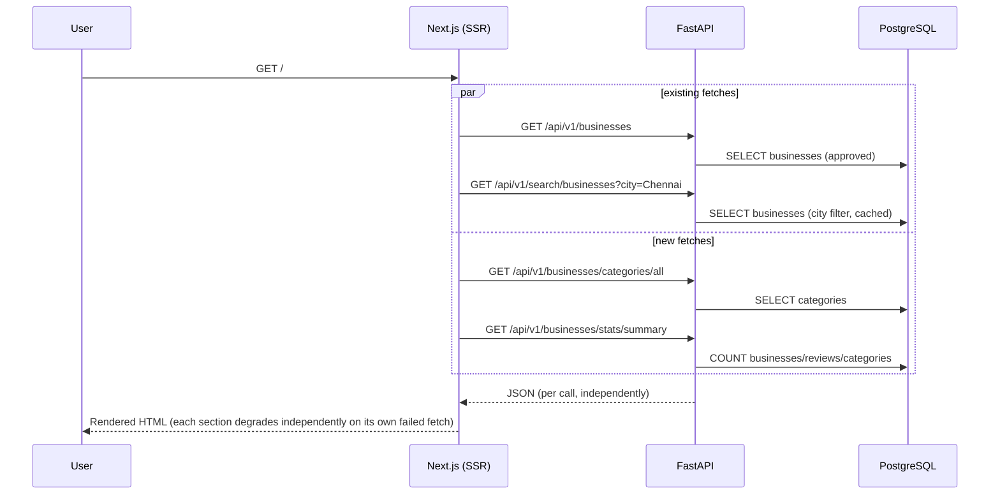

# Slice: S-014 — Home page enrichment

| Field | Value |
|-------|-------|
| **Slice ID** | S-014 |
| **Phase** | 5 Polish |
| **Status** | Accepted |
| **Role(s)** | customer \| merchant \| admin (all roles land on `/`; content is anonymous-safe) |
| **Owner** | PM / 2026-08-10 |

---

## User story

**As a** visitor to MerchantHub AI (any role, including signed-out)
**I want** the home page to show platform scale (stats), a way to browse by category, and a quick explanation of how the site works
**So that** I can trust the platform and find relevant local businesses faster than scrolling the raw listing grid

---

## Acceptance criteria

1. **Given** the backend has categories available, **when** the home page renders, **then** a category tiles section is shown, one tile per category (icon + name), each linking to `/search?category=<slug>`.
2. **Given** the new public stats endpoint responds successfully, **when** the home page renders, **then** a stats strip shows `total_businesses`, `total_reviews`, and `total_categories` as the three figures.
3. **Given** the public stats endpoint or categories endpoint is unreachable or errors, **when** the home page renders, **then** the page still renders successfully (no crash, no 500) and the affected section is simply omitted — the existing hero and business grid are unaffected.
4. **Given** zero categories are returned, **when** the home page renders, **then** the category tiles section is omitted entirely rather than rendering an empty grid.
5. **Given** the home page renders, **when** a visitor scrolls past the business grid, **then** a static 3-step "How it works" section is shown (e.g. Search → Compare → Support local) using generic, hardcoded copy — no backend call, no AI-suggestion framing (this is not AI-derived content).
6. **Given** the new public stats endpoint is called directly (`GET /api/v1/businesses/stats/summary`), **when** inspecting the response body, **then** it contains only `total_businesses`, `total_reviews`, `total_categories` — it must never include `total_users`, `pending_businesses`, or `reported_reviews` (those remain admin-only via the existing `GET /dashboard/admin/platform`).

---

## UX notes

- **Screens / routes:** `/` (home) only
- **Components to reuse:** `Card` (`src/components/ui/Card.tsx`) for stat tiles / category tiles / how-it-works steps; existing `BusinessCard`, `SearchBar` untouched
- **Empty states / errors:** stats strip and category tiles each degrade independently (see AC 3–4) — one failing fetch must not blank the whole page or the other new sections
- **AI disclaimer required?** No — nothing on this page is AI-derived (stats are raw counts, "how it works" copy is static marketing content)

---

## Out of scope

- Personalized or per-city stats breakdowns
- Testimonials / social proof section
- Replacing or adding a hero image
- A dedicated Redis cache for the new stats endpoint (cheap `COUNT` queries; revisit if traffic requires it — see Architect risks)
- Any change to the existing admin-only `GET /dashboard/admin/platform` endpoint

---

## Dependencies

- S-002 Business CRUD + admin approval (Scaffolded) — category and business-status semantics this slice reads
- Existing `GET /api/v1/businesses/categories/all` (public, already implemented) — reused as-is, no change

---

## Definition of done (PM)

- [ ] All AC verified in test report
- [ ] UX matches notes above
- [ ] Documented in `README.md` §7 API reference
- [ ] PM Status set to **Accepted**

---

## Technical specification (Architect)

> Filled by Architect before implementation.

### API contract

| Method | Path | Auth | Request | Response |
|--------|------|------|---------|----------|
| GET | `/api/v1/businesses/stats/summary` | Public | — | `PublicPlatformStats { total_businesses: int, total_reviews: int, total_categories: int }` |
| GET | `/api/v1/businesses/categories/all` | Public | — | `list[CategoryResponse]` (existing, unchanged, reused) |

### RBAC matrix

| Action | customer | merchant | admin |
|--------|----------|----------|-------|
| `GET /businesses/stats/summary` | allowed (also anonymous) | allowed | allowed |
| `GET /businesses/categories/all` (existing) | allowed (also anonymous) | allowed | allowed |

**Security judgment call (documented per root `CLAUDE.md` non-negotiables):** `GET /api/v1/dashboard/admin/platform` (`backend/app/routers/dashboard.py:83-99`) already exists, returns `PlatformAnalytics` (`total_users, total_businesses, pending_businesses, total_reviews, reported_reviews`), and stays gated by `require_roles(UserRole.ADMIN)` — **unchanged by this slice**. The home page needs live numbers but must not relax that endpoint or reuse it as-is, since `total_users` (growth signal) and `pending_businesses` / `reported_reviews` (moderation-queue signal) are operationally sensitive. This slice instead adds a **new, separate, unauthenticated** endpoint, `GET /businesses/stats/summary`, returning a narrower `PublicPlatformStats` schema with only `total_businesses`, `total_reviews`, `total_categories` — a strict subset chosen to be safe for public display and structurally incapable of leaking the sensitive fields (they don't exist on the response model at all, not just filtered out at render time).

### Data model impact

- [x] None  [ ] Extend existing  [ ] New table(s)

**Details:** Pure aggregate `COUNT()` reads over existing `businesses`, `reviews`, `categories` tables. No migration.

### Cache / side effects

No cache added in this slice. The three `COUNT()` queries are cheap and the endpoint has no per-caller variance (unlike `/search/businesses`, which caches per query-param combination). If home-page traffic later makes this a hot path, mirror the existing `cache_get`/`cache_set` pattern from `backend/app/routers/search.py` with a short TTL — tracked as a risk below, not built now (keeps the diff minimal per root `CLAUDE.md`).

### Frontend

- **Route:** `/` (`frontend/src/app/page.tsx`)
- **Rendering:** SSR (Server Component — matches the existing `async function HomePage()`)
- **Components:** New stats-strip / category-tiles / how-it-works sections built inline in `page.tsx` using the existing `Card` UI primitive (`src/components/ui/Card.tsx`); no new component files. The three new home-page data fetches (`categoriesAll()`, `stats()`) are added via `Promise.allSettled` alongside the two existing fetches (`businesses.list()`, `businesses.search({city:"Chennai"})`) so a failure in the new calls degrades only the new sections (AC 3), not the existing hero/grid.

### Flow

### Architect checklist

- [x] API contract defined
- [x] RBAC matrix complete
- [x] Data model impact documented
- [x] Cache invalidation considered
- [x] Uses AI/storage abstractions where applicable (n/a — no AI/storage surface touched)
- [x] ERD/API/FLOWS updates noted (README §7 only; no ERD/schema change, no new §6 flow — this enriches the existing home render, not a new user journey)

### Risks / tradeoffs

- No caching on the new endpoint: acceptable at current scale (three indexed/PK-count queries per home-page SSR render); revisit with a Redis cache mirroring `search.py`'s pattern if home-page traffic grows enough to matter.
- `total_reviews` counts `ReviewStatus.ACTIVE` only (mirrors what's actually visible to the public elsewhere in the app, e.g. `GET /reviews/business/{id}`), so it will read slightly lower than a raw `COUNT(*)` over the `reviews` table when hidden/removed/reported rows exist — intentional, documented here so it isn't mistaken for a bug later.
- Category tiles link to `/search?category=<slug>` even for categories with zero approved businesses right now; acceptable because `/search` already has its own empty-state handling, and hiding categories with 0 businesses would require an extra join/count per category that isn't justified for a Polish-phase slice.
- Using `Promise.allSettled` (new) instead of `Promise.all` (existing pattern) for the home page's fetches is a deliberate, minimal, additive change scoped to `page.tsx` only — it doesn't touch how `Promise.all` is used anywhere else in the codebase.

---

## Links

- Test plan: `docs/agents/test-plans/TP-S-014-home-page-enrichment.md`
- Test report: `docs/agents/test-reports/TR-S-014-home-page-enrichment.md`
- ADR: none (no architecturally significant/irreversible decision beyond the security judgment call already captured inline above)

---

## Changelog

| Date | Agent | Change |
|------|-------|--------|
| 2026-08-10 | PM | Slice created: user story, AC, UX notes, out of scope, dependencies |
| 2026-08-10 | Architect | Technical spec filled: API contract, RBAC matrix + security judgment call, data model impact, cache notes, frontend plan, flow diagram, risks. Status → Specified |
