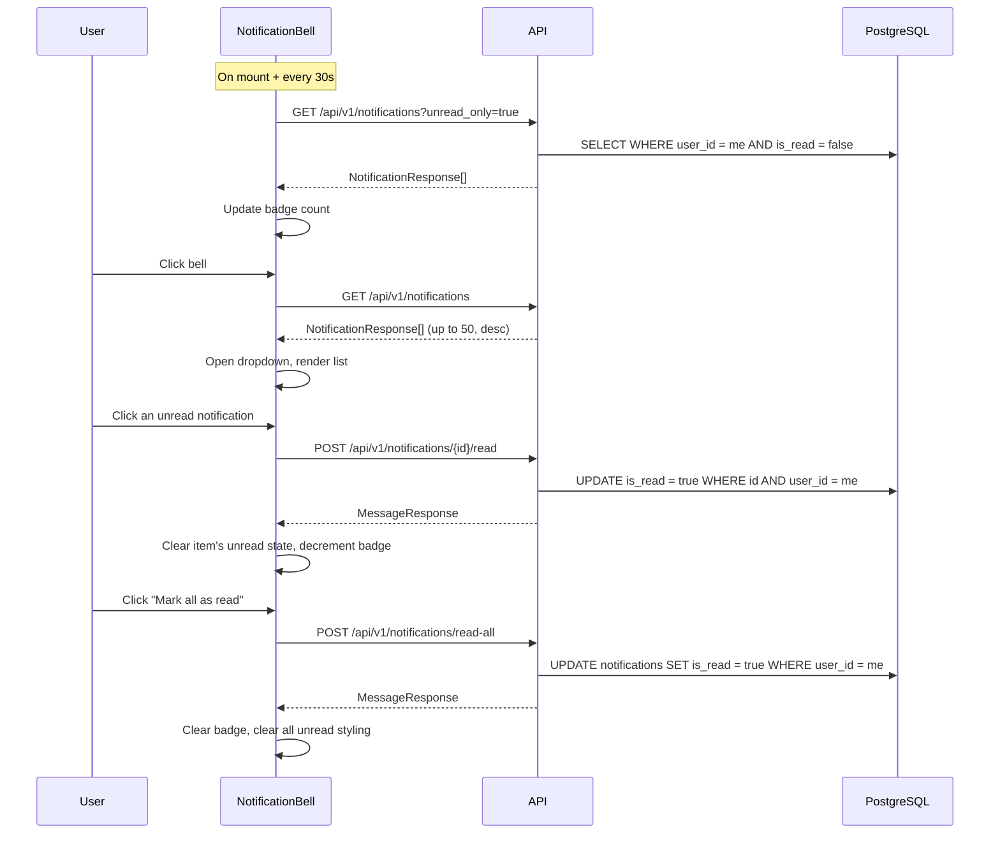

# Slice: S-015 — Notifications UI

| Field | Value |
|-------|-------|
| **Slice ID** | S-015 |
| **Phase** | 5 Polish |
| **Status** | Accepted |
| **Role(s)** | customer \| merchant \| admin |
| **Owner** | PM / S-015 |

---

## User story

**As a** logged-in user (customer, merchant, or admin)
**I want** a notification bell in the global nav with an unread-count badge and a dropdown listing my recent notifications
**So that** I know about relevant platform activity (new reviews, replies, approvals, moderation actions) without having to hunt for it on each page

---

## Acceptance criteria

1. **Given** I am logged in, **when** I view the navbar, **then** I see a notification bell with a badge showing my unread count (badge hidden when unread count is 0).
2. **Given** I am logged in and have notifications, **when** I click the bell, **then** a dropdown opens listing my recent notifications (title, message, created time), most recent first, with unread items visually distinguished from read ones.
3. **Given** the dropdown is open, **when** I click an unread notification, **then** it is marked read via the API, its unread styling clears, and the badge count decrements without a full page reload.
4. **Given** I have one or more unread notifications, **when** I click "Mark all as read", **then** all my notifications are marked read via the API, the badge clears, and no item in the list still shows unread styling.
5. **Given** I have zero notifications, **when** I open the dropdown, **then** I see an empty-state message instead of a blank panel.
6. **Given** I am not logged in, **then** no notification bell is rendered anywhere in the nav.
7. **Given** the dropdown is open, **when** I click outside it or press Escape, **then** it closes.

---

## UX notes

- **Screens / routes:** Global — lives in `Navbar`, so it renders on every page for an authenticated user (gate is "is authenticated," not role).
- **Components to reuse:** `Badge` (unread-count pill), `Button` (mark-all-read action), `Card` (dropdown panel surface).
- **Empty states / errors:** Empty state copy: "No notifications yet". A failed fetch degrades to no badge / empty panel rather than a broken layout — never a blocking error state on the nav.
- **AI disclaimer required?** No. `type` values (`REVIEW`/`REPLY`/`APPROVAL`/`MODERATION`/`SYSTEM`) are factual event notices generated by application logic, not AI-generated judgments — displayed plainly per the root `CLAUDE.md` non-negotiable on AI-suggestion language (that rule governs AI output, which this isn't).

---

## Out of scope

- Real-time delivery (WebSockets/SSE) — polling on an interval is acceptable for this slice.
- A notification preferences/settings page.
- Per-type deep-linking (e.g. clicking a `REVIEW` notification jumping to that review) — `extra_data` isn't guaranteed on every notification, and per-type routing is a separate slice.
- Any change to which events emit a notification server-side (only one emission site exists today, in `reviews.py`; expanding coverage is backend scope, not this slice).

---

## Dependencies

- S-001 Auth (JWT login, `auth.me()`) — **Scaffolded**
- S-008 Notifications (backend API: `GET /notifications`, `POST /notifications/{id}/read`, `POST /notifications/read-all`) — **Scaffolded**, already fully implemented server-side; this slice is the frontend half.

---

## Definition of done (PM)

- [ ] All AC verified in test report
- [ ] Bell renders in the global nav for every authenticated role and nowhere when logged out
- [ ] Documented in `README.md` §7 API reference (frontend consumption note) and §8 Frontend guide (new component)
- [ ] PM Status set to **Accepted**

---

## Technical specification (Architect)

### API contract

| Method | Path | Auth | Request | Response |
|--------|------|------|---------|----------|
| GET | `/api/v1/notifications` | Bearer | query `unread_only?: bool` (default false) | `NotificationResponse[]` (≤50, `created_at desc`) |
| POST | `/api/v1/notifications/{notification_id}/read` | Bearer | — | `MessageResponse` |
| POST | `/api/v1/notifications/read-all` | Bearer | — | `MessageResponse` |

No new/changed backend endpoints — all three already exist in `backend/app/routers/notifications.py` and are mounted at `/api/v1` via `app/main.py`. `NotificationResponse` (`backend/app/schemas/__init__.py:237-246`): `id, type, title, message, is_read, extra_data, created_at`.

### RBAC matrix

| Action | customer | merchant | admin |
|--------|----------|----------|-------|
| List own notifications | yes | yes | yes |
| Mark own notification read | yes | yes | yes |
| Mark all own notifications read | yes | yes | yes |

Not role-gated — only "authenticated" (`get_current_user`). Ownership is enforced server-side (`Notification.user_id == user.id`), not by role.

### Data model impact

- [x] None  [ ] Extend existing  [ ] New table(s)

**Details:** Reuses the existing `notifications` table and `NotificationResponse` schema as-is. No migration.

### Cache / side effects

No backend cache involved (notifications aren't part of the search cache). Frontend: after `markRead` / `markAllRead`, update local component state optimistically (decrement/clear unread count, flip item's `is_read`) rather than a full refetch, to keep the interaction snappy.

### Frontend

- **Route:** N/A — global component, mounted in `frontend/src/components/Navbar.tsx` (rendered by `ClientLayout.tsx` for every page).
- **Rendering:** CSR (`"use client"`) — needs hooks, an interval poll, and localStorage-derived auth state.
- **Components:** New `frontend/src/components/NotificationBell.tsx` — bell icon + `Badge` unread pill + dropdown `Card` listing notifications, "Mark all as read" `Button`. New `notifications` export added to `frontend/src/lib/api.ts` (`list`, `markRead`, `markAllRead`). Only rendered when `Navbar` receives a non-null `user` (mirrors the existing logged-in branch).
- **Polling:** Fetch unread notifications on mount and every 30s thereafter while the component is mounted; also refetch the full list when the dropdown is opened. No WebSockets/SSE (see Out of scope).

### Flow

### Architect checklist

- [x] API contract defined (pre-existing, verified against router source)
- [x] RBAC matrix complete
- [x] Data model impact documented
- [x] Cache invalidation considered (none needed; optimistic local state)
- [x] Uses AI/storage abstractions where applicable (n/a — no AI or storage involved)
- [x] ERD/API/FLOWS updates noted (README §6/§7/§8 updates listed in Links/DoD)

### Risks / tradeoffs

- Polling (30s) means the unread badge can lag briefly behind real state; acceptable trade-off vs. adding WebSocket infrastructure for one bell icon.
- `POST /notifications/{id}/read` silently no-ops (still returns 200) if the id doesn't exist or isn't owned by the caller, instead of 404 — verified in `backend/app/routers/notifications.py:34-44`. Not a security issue (no data leaked, no other user's row touched) and not blocking for this slice, but the frontend should not assume a 200 implies the specific row changed. Flagged here rather than fixed, since backend changes are out of scope for this slice.
- `extra_data` is optional and not rendered/linked in this slice (see Out of scope); future per-type deep-linking should reuse it without a schema change.

---

## Links

- Test plan: `docs/agents/test-plans/TP-S-015-notifications-ui.md`
- Test report: `docs/agents/test-reports/TR-S-015-notifications-ui.md`
- ADR: none — no architecturally significant decision beyond what's captured above (polling vs. push), which doesn't warrant a standalone ADR.

---

## Changelog

| Date | Agent | Change |
|------|-------|--------|
| 2026-08-10 | PM | Slice created: user story, AC, UX notes, out-of-scope, dependencies |
| 2026-08-10 | Architect | Technical specification added (API contract confirmed pre-existing, RBAC, frontend plan, flow diagram); Status → Specified |
