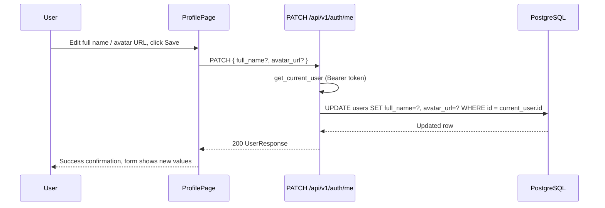

# Slice: S-016 — Profile settings edit

| Field | Value |
|-------|-------|
| **Slice ID** | S-016 |
| **Phase** | 5 Polish |
| **Status** | Accepted |
| **Role(s)** | customer \| merchant \| admin |
| **Owner** | PM / vertical-slice rehearsal |

---

## User story

**As a** logged-in user (any role)
**I want** to edit my display name and avatar from my Profile page
**So that** my account reflects who I am without needing support to fix a typo or update my picture

---

## Acceptance criteria

1. **Given** I am logged in, **when** I open `/profile`, **then** I see my current `full_name` and `avatar_url` in an editable form, plus my `email` and `role` displayed read-only with a short note that email changes aren't supported yet.
2. **Given** I am on `/profile`, **when** I change my full name and/or avatar URL and submit, **then** the update is saved and the form reflects the new values without a full page reload.
3. **Given** I submit the profile form, **when** the request succeeds, **then** I see a brief success confirmation.
4. **Given** I submit the profile form, **when** the request fails (e.g. network/server error), **then** I see an error message and my unsaved input is preserved.
5. **Given** I am not logged in, **when** I open `/profile`, **then** I am shown the existing "please login" state (unchanged behavior).
6. **Given** any authenticated user, **when** they send `email`, `role`, or `is_active` in the `PATCH /api/v1/auth/me` request body (in addition to or instead of allowed fields), **then** those fields are silently ignored — the response and the persisted row show the field unchanged, and no error is raised solely because of the extra fields.
7. **Given** I am logged in, **when** I open `/settings`, **then** I see more than the previous single logout button: at minimum a link/entry point into profile editing, alongside the existing logout control.

---

## UX notes

- **Screens / routes:** `/profile` (edit form), `/settings` (entry point + logout, unchanged logout behavior)
- **Components to reuse/introduce:** `Card`, `Input`, `Button` from `frontend/src/components/ui/` for the new edit form; keep `SettingsPage.tsx`'s existing logout button and styling for the logout action.
- **Empty states / errors:** Inline error text under the form on save failure; no destructive empty state (profile always exists for a logged-in user).
- **AI disclaimer required?** No — this slice has no AI-generated content.

---

## Out of scope

- Changing `email` (requires re-verification flow, not built) — displayed read-only with an explanatory note.
- Changing `password` (requires current-password re-verification, a separate concern with its own security review).
- Changing `role` or `is_active` (admin-only concerns, not self-service).
- Avatar file upload (this slice accepts an `avatar_url` string only; reusing the existing `photos.upload()` pattern for a file picker is a future slice).
- Theme toggle, notification preferences, or any other Settings content — no such system exists in this codebase yet (no theme engine, no notification-preferences model). Settings gets a minimal entry point to profile editing plus the existing logout, not speculative preferences invented for this slice.

---

## Dependencies

- S-001 Auth (login required, `User.full_name`/`User.avatar_url` columns already exist) — **Scaffolded**

---

## Definition of done (PM)

- [ ] All AC verified in test report
- [ ] `email`/`role`/`is_active` proven non-editable via this endpoint even when sent in the request body
- [ ] Documented in `README.md` §7 API reference and §9 Security (RBAC table)
- [ ] `README.md` §14 Known gaps updated to reflect the closed gap
- [ ] PM Status set to **Accepted**

---

## Technical specification (Architect)

> Filled by Architect before implementation.

### API contract

| Method | Path | Auth | Request | Response |
|--------|------|------|---------|----------|
| PATCH | `/api/v1/auth/me` | Bearer (`get_current_user`, any authenticated role) | `{ "full_name"?: string, "avatar_url"?: string \| null }` (both optional; only supplied fields change) | `UserResponse` (200) |

### RBAC matrix

| Action | customer | merchant | admin |
|--------|----------|----------|-------|
| `PATCH /auth/me` (edit own `full_name`/`avatar_url`) | ✅ | ✅ | ✅ |
| `PATCH /auth/me` with `email`/`role`/`is_active` in body | ✅ (fields silently ignored, not an error) | ✅ (fields silently ignored) | ✅ (fields silently ignored) |

No `require_roles()` restriction — every authenticated user may only ever edit their own record via `get_current_user`, so role doesn't gate this endpoint; the schema itself gates *which fields* are editable.

### Data model impact

- [x] None  [ ] Extend existing  [ ] New table(s)

**Details:** `User.full_name` and `User.avatar_url` columns already exist (`backend/app/models/__init__.py`). No migration needed.

### Cache / side effects

None. This endpoint doesn't touch the search cache (businesses/reviews) and has no downstream side effects to invalidate.

### Frontend

- **Route:** `/profile` (edit form), `/settings` (entry point)
- **Rendering:** CSR (both already `"use client"`)
- **Components:** New form built from `frontend/src/components/ui/` primitives (`Card`, `Input`, `Button`) inside `ProfilePage.tsx`; `SettingsPage.tsx` gets a link to `/profile` alongside the existing logout button.

### Flow

### Architect checklist

- [x] API contract defined
- [x] RBAC matrix complete
- [x] Data model impact documented
- [x] Cache invalidation considered (none needed)
- [x] Uses AI/storage abstractions where applicable (n/a — no AI or storage involved)
- [x] ERD/API/FLOWS updates noted (README §7, §9 to be updated by Builder)

### Risks / tradeoffs

- **Schema-level allowlist vs. generic `**body.dict()`:** the update schema (`UserProfileUpdate`) declares *only* `full_name` and `avatar_url`. A client sending `role`/`email`/`is_active` in the JSON body has those keys silently dropped by Pydantic (default `extra="ignore"`) before the handler ever sees them — this is deliberately a schema-level control, not a frontend-only omission, so it holds even against direct API calls (curl/Postman), not just the UI form.
- **`avatar_url` is a free-text string, not validated as a real URL** (matches the existing loose-validation convention used by `Business.website`/`email` fields elsewhere in this codebase) — accepted tradeoff for consistency; a malformed value just fails to render as an image client-side, no security impact since it's never used server-side (e.g. not fetched by the backend).
- **No password change in this slice** — deliberately deferred; bundling it here would require current-password re-verification, a materially different security surface than a profile-fields patch.

---

## Links

- Test plan: `docs/agents/test-plans/TP-S-016-profile-settings-edit.md`
- Test report: `docs/agents/test-reports/TR-S-016-profile-settings-edit.md`
- ADR: none (additive endpoint + form, no irreversible architectural decision)

---

## Changelog

| Date | Agent | Change |
|------|-------|--------|
| 2026-08-10 | PM | Slice brief created — user story, AC, UX notes, out-of-scope |
| 2026-08-10 | Architect | Technical specification added — API contract, RBAC matrix, flow diagram. Status → Specified |
