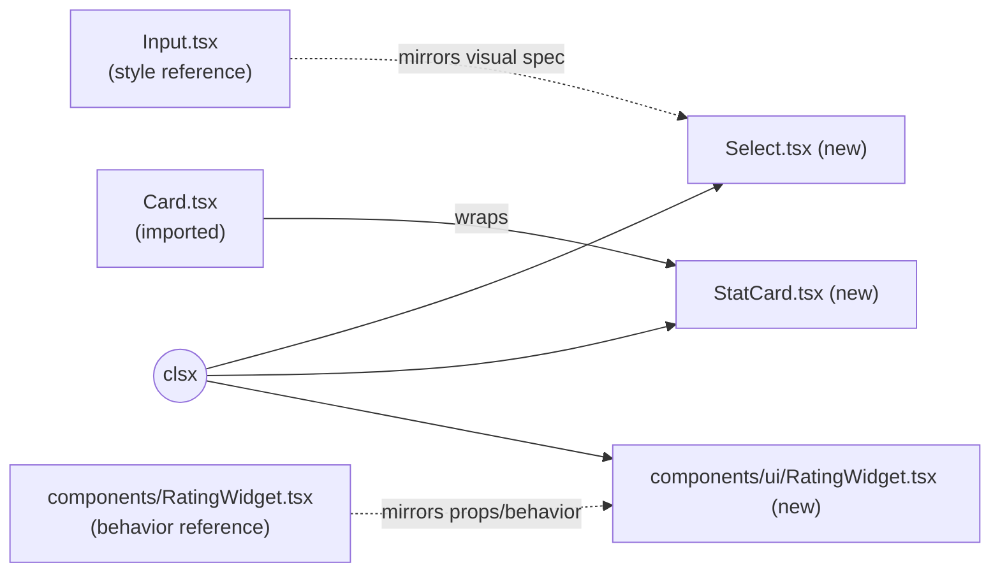

# Slice: S-017 — Design system primitives (Select, StatCard, RatingWidget)

| Field | Value |
|-------|-------|
| **Slice ID** | S-017 |
| **Phase** | 5 Polish |
| **Status** | Accepted |
| **Role(s)** | customer \| merchant \| admin (tooling slice — benefits every role indirectly via consistent UI) |
| **Owner** | PM / tooling slice |

> **Process note:** like S-010, this is an infra/tooling slice, not an end-user feature —
> there's no customer-facing "story" in the traditional sense. Per `README.md` §13's
> worked-example pattern, the user story below is framed around the **developer** who
> builds screens with these primitives, not an app end-user.

---

## User story

**As a** frontend developer building screens for MerchantHub AI
**I want** a `Select`, `StatCard`, and `RatingWidget` primitive in `components/ui/` that
match the visual language of the existing `Button`/`Card`/`Input`/`Badge` primitives
**So that** I can stop hand-rolling raw `<select>` elements and inline stat tiles in
every new screen, and instead compose from a small, consistent set of building blocks —
the same way `Input.tsx` already replaced ad-hoc `<input>` markup for future call sites

---

## Acceptance criteria

1. **Given** a developer needs a dropdown, **when** they render `<Select>` from
   `components/ui/Select.tsx` with `size="sm"` or `size="md"`, **then** it renders a
   native `<select>` with the same border/focus-ring/disabled treatment as `Input.tsx`
   (`rounded border border-gray-200 ... focus:ring-1 focus:ring-brand-500
   focus:border-brand-500`), forwards `className` and standard `<select>` props
   (`value`, `onChange`, `disabled`, `children` options), and composes classes with
   `clsx` like the other three primitives.
2. **Given** a developer needs a labeled stat tile (e.g. "Total reviews: 128"), **when**
   they render `<StatCard>` from `components/ui/StatCard.tsx` with `label` and `value`
   props (and optionally `icon`/`trend`), **then** it renders on top of the existing
   `Card` primitive (imported, not re-implemented) with the value styled
   `text-2xl font-bold`, matching the inline pattern currently duplicated in
   `MerchantDashboard.tsx`'s three stat tiles.
3. **Given** a developer needs a star-rating primitive built the same way as the other
   `ui/` components, **when** they render `<RatingWidget>` from
   `components/ui/RatingWidget.tsx` with `value`, `onChange`, `readonly`, and `size`
   props, **then** it renders 5 star buttons, calls `onChange(n)` when star `n` is
   clicked while interactive, does **not** call `onChange` while `readonly`, and uses
   `clsx` for its conditional classes instead of template-literal string concatenation
   (a cleanup over the existing `components/RatingWidget.tsx`, which predates the
   `clsx` convention).
4. **Given** the 3 new primitives ship, **when** the diff is reviewed, **then** none of
   the ~25 existing feature components (`FilterPanel.tsx`, `MerchantDashboard.tsx`,
   `RegisterForm.tsx`, `components/RatingWidget.tsx`, or any other) are modified — this
   slice only **adds** files, migration is explicitly a future slice.
5. **Given** the 3 new files, **when** the Tester runs `cd frontend && npm test`,
   **then** each has a colocated RTL smoke test under `components/ui/__tests__/`
   covering render + prop-forwarding + the one interactive behavior each component has
   (`Select`'s `onChange`, `StatCard`'s label/value render, `RatingWidget`'s star click).

---

## UX notes

- **Screens / routes:** none — these are reusable primitives with no route of their own.
  They are not wired into any existing screen by this slice (see AC 4 / Out of scope).
- **Components to reuse:** `Card` (wrapped, not duplicated, by `StatCard`); the visual
  spec of `Input` (mirrored, not imported, by `Select`, since a `<select>` and `<input>`
  are different elements); the prop/behavior shape of `components/RatingWidget.tsx`
  (referenced, not imported, by `components/ui/RatingWidget.tsx` — see Architect risks
  on why these stay two separate files).
- **Empty states / errors:** N/A — presentational primitives, no data fetching.
- **AI disclaimer required?** No — no AI output surfaces through these components.

---

## Out of scope

- Migrating any of the ~25 existing components (`FilterPanel.tsx`, `MerchantDashboard.tsx`,
  `RegisterForm.tsx`, `components/RatingWidget.tsx`, etc.) to use the new or existing
  primitives. That is a future, separately-sized migration slice.
- Figma Code Connect (`*.figma.tsx`) mapping files for the 3 new primitives — the
  existing 4 `ui/` primitives (`Button`, `Card`, `Input`, `Badge`) don't have one either,
  so this isn't a new gap introduced by this slice.
- Dark mode implementation — README §8 notes dark-mode tokens exist in Figma's `Color`
  collection but the app ships light-only; these primitives stay light-only, consistent
  with the 4 existing ones.
- Any backend change. This slice touches `frontend/` only.

---

## Dependencies

- None. Pure addition, no other slice needs to be Accepted first.

---

## Definition of done (PM)

- [x] All AC verified in test report
- [x] UX matches notes above
- [x] Documented in `README.md` §8 Frontend guide (new component pattern)
- [x] PM Status set to **Accepted**

---

## Technical specification (Architect)

### API contract

None — pure frontend UI primitives, no backend/API surface touched.

| Method | Path | Auth | Request | Response |
|--------|------|------|---------|----------|
| — | — | — | — | — |

### RBAC matrix

N/A — presentational, role-agnostic primitives. No route or endpoint gate is introduced;
any role (or anonymous view) may render them.

| Action | customer | merchant | admin |
|--------|----------|----------|-------|
| Render `Select`/`StatCard`/`RatingWidget` | yes | yes | yes |

### Data model impact

- [x] None  [ ] Extend existing  [ ] New table(s)

**Details:** none — no schema, no persistence.

### Cache / side effects

None.

### Frontend

- **Route:** none (library components under `frontend/src/components/ui/`, not a page)
- **Rendering:** per `frontend/CLAUDE.md`, `"use client"` only where genuinely needed:
  - `Select.tsx` — no internal state, forwards `onChange`/`value` like a native
    `<select>`. Checked `Input.tsx` first: it is an uncontrolled/passthrough component
    with **no** `"use client"` directive. `Select` follows the same shape, so it also
    gets **no** `"use client"` directive.
  - `StatCard.tsx` — no state, no hooks, wraps `Card`. **No** `"use client"` directive.
  - `RatingWidget.tsx` (ui/) — needs a `hover` `useState` for the hover-preview
    interaction (same reason the existing `components/RatingWidget.tsx` has one). Hooks
    require a client boundary, so this file **does** get `"use client"`.
- **Components:** `Select`, `StatCard`, `RatingWidget` added to `frontend/src/components/ui/`.

### Flow

Not a request/response flow (no API calls) — a component-composition diagram instead,
showing what each new primitive is styled or behaviorally modeled on:

### Architect checklist

- [x] API contract defined — explicitly none (frontend-only slice)
- [x] RBAC matrix complete — explicitly N/A, role-agnostic
- [x] Data model impact documented — None
- [x] Cache invalidation considered — N/A, no cache involved
- [x] Uses AI/storage abstractions where applicable — N/A, no AI or storage involved
- [x] ERD/API/FLOWS updates noted — N/A, no ERD/API change; `README.md` §8 updated instead

### Risks / tradeoffs

- **Figma spec check came up empty.** The Figma MCP connector (`whoami` succeeded,
  authenticated as the project's Figma account) *is* reachable, and `README.md` §8
  names the exact file (`MerchantHub AI — Design System`, key `X0XXhJiwW8SxFdMf39n2t3`).
  But `get_metadata` on that file shows a single `Cover` page (no `Primitives`/`Rating`/
  `Cards` pages), and `search_design_system` for `RatingWidget`/`Select` against that
  file key returns zero components/variables/styles. The 18-component/69-variant system
  §8 describes is not present in the file this session can reach. Per the task's
  documented fallback, `components/ui/RatingWidget.tsx` was built to match the existing
  `components/RatingWidget.tsx`'s behavior/props instead. **Flag for a follow-up:**
  reconcile whether the Figma file needs republishing/sharing, or whether §8's
  description has drifted from the actual file.
- **Naming collision risk.** `components/RatingWidget.tsx` (existing) and
  `components/ui/RatingWidget.tsx` (new) share a filename in different directories. No
  barrel/index file is added in this slice, so every import must be explicit
  (`@/components/RatingWidget` vs `@/components/ui/RatingWidget`) — accepted as a minor
  ergonomic cost rather than risk a barrel export colliding on the same exported name.
- **Two parallel patterns until migration.** Existing raw `<select>` usages
  (`FilterPanel.tsx`, `MerchantDashboard.tsx`, `RegisterForm.tsx`) and inline stat tiles
  (`MerchantDashboard.tsx`) keep working unmodified; the codebase now has both the old
  inline pattern and the new primitive until a future migration slice adopts the latter.
  Accepted per Out of scope — this slice is additive-only by design.

---

## Links

- Test plan: `docs/agents/test-plans/TP-S-017-design-system-primitives.md`
- Test report: `docs/agents/test-reports/TR-S-017-design-system-primitives.md`
- ADR: none — additive, reversible change (delete the 3 files to fully revert); doesn't
  meet the bar for an irreversible architectural decision.

---

## Changelog

| Date | Agent | Change |
|------|-------|--------|
| 2026-08-10 | PM | Slice brief created — developer-persona story, 5 AC, out-of-scope boundaries. Status: Draft |
| 2026-08-10 | Architect | Technical spec filled — no API/RBAC/data-model impact (frontend-only), `"use client"` placement decided per component, Figma-reachability risk documented. Status: Specified |
| 2026-08-10 | Builder | Implemented `Select.tsx`, `StatCard.tsx`, `RatingWidget.tsx` in `components/ui/`; updated `README.md` §8 and §13. Status: Testing |
| 2026-08-10 | Tester | RTL smoke tests added and run; test report filed. |
| 2026-08-10 | PM | Reviewed test report against AC 1-5 — all covered and passing. Status: Accepted |
