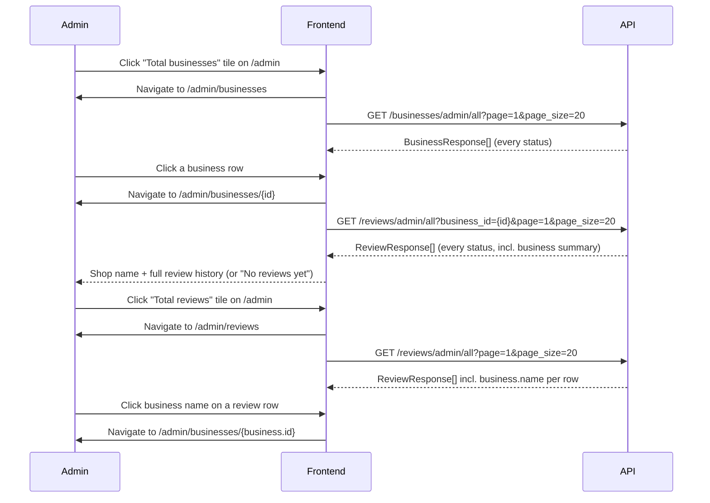

# Slice: S-021 — Admin business & review drill-down

| Field | Value |
|-------|-------|
| **Slice ID** | S-021 |
| **Phase** | 4 Dashboards |
| **Status** | Testing |
| **Role(s)** | admin |
| **Owner** | PM / 2026-08-11 |

---

## User story

**As an** admin moderating the platform
**I want** to click the "Total businesses" and "Total reviews" stat tiles to browse *every* business and review (not just the pending/reported subsets), and drill from any review into its business's shop name and full review history
**So that** I can investigate and moderate content beyond what's currently reported/pending, without having to guess a business's public slug and navigate there manually

---

## Acceptance criteria

1. **Given** I am signed in as admin viewing `/admin`, **when** I click the "Total businesses" stat tile, **then** I am taken to an "All businesses" browse view (new route or in-page section) — not left inert as today.
2. **Given** I am on the "All businesses" browse view, **when** it loads, **then** it lists businesses of *every* status (approved, pending, rejected, suspended) with name, city, status badge, and rating — distinct from the existing Pending queue, which only ever shows `status=pending`.
3. **Given** I am on the "All businesses" browse view, **when** I click a business row, **then** I see that business's shop name and its full review history (all statuses an admin is entitled to see, not only reported reviews) without leaving the admin area or needing to know the business's public slug.
4. **Given** I am signed in as admin viewing `/admin`, **when** I click the "Total reviews" stat tile, **then** I am taken to an "All reviews" browse view listing reviews across every business and status — not left inert as today.
5. **Given** I am on the "All reviews" browse view, **when** a review row renders, **then** it shows the business's shop name as a clickable link/element that opens that business's drill-down from AC 3 — directly satisfying the "give me the reviews, shop names" feedback. (Note: today's `ReportedReviewsQueue` also renders reviews with *no* business name at all — this fixes that gap too, not just the new view.)
6. **Given** a business has zero reviews, **when** I open its drill-down, **then** the review history area shows a "No reviews yet" empty state — never an error or blank panel.
7. **Given** I am not an admin (anonymous, customer, or merchant), **when** I attempt to load the "All businesses" or "All reviews" browse routes/views directly, **then** access is denied (redirect to login or 403) — same protection as the rest of `/admin` today.
8. **Given** a review carries an AI sentiment/summary (`ai_analysis`), **when** it is shown in the "All reviews" browse view or a business drill-down, **then** it uses the existing `ReviewCard` "AI: {sentiment}" badge / "AI summary (suggestion)" treatment — no new definitive-judgment language is introduced for this AI output.
9. **Given** the platform stats load with `total_users` present, **when** I view `/admin`, **then** the "Total users" tile's current (non-interactive) behavior is preserved — this slice does not add a user-management drill-down (see Out of scope).

---

## UX notes

- **Screens / routes:** extends `/admin`. New browse surfaces for "All businesses" and "All reviews", and a per-business drill-down showing shop name + reviews. Exact routing (in-page expand/collapse sections vs. new `/admin/businesses` and `/admin/businesses/[id]` routes) is an Architect/Builder implementation choice — either satisfies the AC as long as it's reachable from the stat tiles and doesn't require the admin to know a slug.
- **Components to reuse:** `ReviewCard` (extend with a business-name element per AC 5 rather than forking it), `Dashboard`/`Card` shells, `RatingWidget`, `Badge` (status tags). Follow the existing `PendingBusinessQueue.tsx` / `ReportedReviewsQueue.tsx` list-row pattern for the new browse views so the admin panel stays visually consistent.
- **Empty states / errors:** "No businesses" / "No reviews" dashed-border empty state matching the existing queues' copy style; "No reviews yet" for a business drill-down with zero reviews (AC 6); network/API errors render inline, matching existing `error` handling in the two queue components.
- **AI disclaimer required?** Yes — any AI sentiment/summary shown must keep the existing "AI: {sentiment}" / "AI summary (suggestion)" language (AC 8). No new AI surface is introduced by this slice; it only reuses the existing `ReviewCard` rendering.

---

## Out of scope

- **"Total users" tile drill-down / admin user management** (view all users, change roles, ban/suspend users). The stakeholder feedback named reviews and shop names specifically; a full user-management screen is a materially different, larger feature and should be its own future slice if prioritized. The tile itself is left as-is (static, per AC 9).
- **New moderation actions** on the new "All businesses" / "All reviews" browse views (e.g., hide/remove a review that isn't reported, or restore a suspended business). Existing approve/suspend (`PendingBusinessQueue`) and hide/restore/remove (`ReportedReviewsQueue`) actions are untouched and remain the moderation entry points; the new views are for browsing + drill-down visibility only.
- Pagination/sort/filter UI polish beyond a basic list (e.g., search-within-admin, column sorting) — ship the simplest list that satisfies the AC; richer controls can follow as a later slice if needed.
- Any change to the public `/businesses/[slug]` page or `BusinessCard` — see the separate suspected-bug note below; this slice does not touch that code path.
- Merchant-side dashboard tile interactivity — tracked separately as S-022.

**Flag for Builder investigation (not part of this slice's scope):** the stakeholder separately reported that on the home page and search results, clicking a business listing card (`BusinessCard` → `/businesses/[slug]`) doesn't show shop name/reviews either. Code inspection shows `BusinessCard.tsx` links via a plain `<a href="/businesses/{slug}">` and the business detail route/API (`GET /api/v1/businesses/{slug}`, unfiltered by status) appear correct, and seed data now exists. Since the code path looks sound on read-through, this needs direct Builder investigation (e.g., in a live/deployed environment — stale build, routing/base-path issue, client-side JS error, or a deploy-environment config problem) rather than a new slice brief. Do not silently drop this — raise it with Builder before or alongside implementing S-021/S-022.

---

## Dependencies

- None blocking — builds on the existing `/admin` page, `PendingBusinessQueue`/`ReportedReviewsQueue` patterns, and the already-public `GET /api/v1/businesses/{slug}` and `GET /api/v1/businesses` (status-filtered, admin-only for non-approved) endpoints.
- Related epic: S-007 "Admin moderation + platform analytics" (Phase 4, status Partial) — this slice extends that epic's admin surface; not a hard blocking dependency.

---

## Definition of done (PM)

- [ ] All AC verified in test report
- [ ] UX matches notes above
- [ ] Documented in `README.md` §7 API reference / §8 Frontend guide if new patterns
- [ ] PM Status set to **Accepted**

---

## Technical specification (Architect)

### API contract

| Method | Path | Auth | Request | Response |
|--------|------|------|---------|----------|
| GET | `/api/v1/businesses/admin/all` | Admin (`require_roles(UserRole.ADMIN)`) | Query: `page: int = 1`, `page_size: int = 20` (cap 100) — **no status filter; always returns every status** | `list[BusinessResponse]` (existing schema, unchanged shape — already has `id`, `name`, `slug`, `city`, `status`, `average_rating`, `review_count`) |
| GET | `/api/v1/reviews/admin/all` | Admin (`require_roles(UserRole.ADMIN)`) | Query: `business_id: UUID \| None = None` (optional scope — powers both the "All reviews" browse view and the business drill-down's review history), `page: int = 1`, `page_size: int = 20` (cap 100) — **no status filter; always returns every status** | `list[ReviewResponse]` — **extended** with a new optional `business: BusinessSummary \| None` field |
| GET | `/api/v1/reviews/reported` | Admin (existing, unchanged route/auth) | — | `list[ReviewResponse]` — response body gains the same new optional `business` field (fixes `ReportedReviewsQueue`'s "no business name" gap, AC 5, with no route/contract-breaking change) |
| GET | `/api/v1/businesses/{slug}` | Public (existing, unchanged) | — | `BusinessResponse` — available for reuse if Builder wants a slug-based link out to the public profile from the drill-down; **not required** for the drill-down's shop-name header, which the frontend already has from the `/businesses/admin/all` row it navigated from |

**New schema** (`backend/app/schemas/__init__.py`):
```python
class BusinessSummary(BaseModel):
    model_config = ConfigDict(from_attributes=True)
    id: UUID
    name: str
    slug: str
    city: str | None = None
    status: BusinessStatus
```
`ReviewResponse` gains `business: BusinessSummary | None = None`.

**Route placement:** `admin/all` is a two-path-segment suffix (`/businesses/admin/all`, `/reviews/admin/all`), so — unlike `/businesses/mine` or `/categories/all`, which are single-segment and must precede `/{slug}` — it cannot collide with either router's single-segment dynamic routes (`/{slug}` on businesses; there is no dynamic single-segment GET on reviews) regardless of declaration order. Still, place both new routes near the other admin/`mine`-style routes (e.g. `/businesses/admin/all` after `/mine`; `/reviews/admin/all` near `/reported`) for readability, per the existing static-before-dynamic convention.

**Ordering:** both new endpoints order by `created_at.desc()` for reviews (matches `list_business_reviews`/`list_reported_reviews`) and `created_at.desc()` for businesses (newest-registered first — distinct from the public `/businesses` list's `average_rating.desc()`, since this is a moderation/browse tool, not a ranking surface).

**Pagination style:** plain `page`/`page_size` query params, plain list response — no total-count envelope. Mirrors this codebase's only existing paginated list endpoint, `GET /search/businesses` (`backend/app/routers/search.py`), rather than introducing a new paginated-response wrapper type. See Risks below.

### RBAC matrix

| Action | customer | merchant | admin |
|--------|----------|----------|-------|
| View `/admin` "Total businesses" / "Total reviews" tiles as clickable | No (page gated) | No (page gated) | Yes |
| `GET /businesses/admin/all` (All businesses browse) | 403 | 403 | Yes |
| `GET /reviews/admin/all` (All reviews browse + business drill-down history) | 403 | 403 | Yes |
| View business drill-down (`/admin/businesses/[id]`) | Redirect/403 (`RequireAuth role="admin"`) | Redirect/403 | Yes |
| `GET /reviews/reported` (existing, now carries `business`) | 403 (unchanged) | 403 (unchanged) | Yes (unchanged) |
| Existing moderation actions (approve/suspend business; hide/restore/remove review) | No | No | Yes (unchanged — untouched by this slice) |
| "Total users" tile | n/a | n/a | Static, no drill-down (AC 9 — unchanged) |

### Data model impact

- [x] None  [ ] Extend existing  [ ] New table(s)

**Details:** No SQLAlchemy model or table changes, no migration. `Review.business` (`backend/app/models/__init__.py:205`) already exists as a relationship; this slice only adds eager-loading (`selectinload(Review.business)`) where it wasn't already loaded, plus a new Pydantic-only DTO (`BusinessSummary`) and one new optional field on `ReviewResponse`. See ADR-002 for why this is a shared-schema extension rather than a new admin-only response type.

**Call sites that must add `selectinload(Review.business)`** (grep `_review_response(` to confirm full coverage before calling this done):
- `backend/app/routers/reviews.py`: `list_business_reviews`, `list_reported_reviews`, `create_review` (final refetch), `update_review` (final refetch), plus the new `list_admin_reviews`.
- `backend/app/routers/dashboard.py`: `merchant_dashboard`'s `recent` query (feeds `recent_reviews`, which also renders via `ReviewCard` on `/merchant/dashboard` — harmless, extra field simply goes unused there).

### Cache / side effects

- All new/changed endpoints are read-only `GET`s — no `cache_delete_pattern` call needed from them.
- No Redis caching added to `/businesses/admin/all` or `/reviews/admin/all`, matching this codebase's existing pattern where only `/search/businesses` is cached (`/businesses`, `/reviews/reported` are not cached today either). Admin moderation needs current data over speed, and traffic on these admin-only surfaces is low.
- Existing moderation writes (`approve_business`, `suspend_business`, `moderate_review`) already call/should continue to call `cache_delete_pattern("search:*")` — unchanged; the new browse views don't read from or write to the `search:*` cache namespace, so no new invalidation path is introduced.

### Frontend

- **Route:**
  - `/admin` (extend) — "Total businesses" and "Total reviews" tiles become navigating link-tiles to `/admin/businesses` and `/admin/reviews` respectively (AC 1, AC 4). "Total users" stays a static `StatCard` (AC 9); "Pending businesses" / "Reported reviews" keep their existing scroll-to-section behavior, unchanged.
  - `/admin/businesses` (new) — "All businesses" browse view, every status, paginated (AC 2).
  - `/admin/businesses/[id]` (new) — business drill-down: shop name + full review history, "No reviews yet" empty state (AC 3, AC 6).
  - `/admin/reviews` (new) — "All reviews" browse view, every business/status, paginated, each row's business name links to the drill-down above (AC 4, AC 5).
- **Rendering:** CSR (`"use client"`) for all three new routes/pages — matches the existing `/admin` page and `PendingBusinessQueue`/`ReportedReviewsQueue`'s client-fetch pattern (admin data needs the client-held JWT via `apiFetch`'s `Authorization` header; no SEO/SSR benefit on an authenticated internal tool).
- **Components (reuse first):**
  - `RequireAuth role="admin"` wraps all three new pages, identical to `/admin` today (AC 7).
  - `ReviewCard` (`frontend/src/components/ReviewCard.tsx`): add a new **optional** prop (e.g. `review.business` already present on the shared `Review` type, or an explicit `businessLink` prop) rendering a small clickable element (`<a href={`/admin/businesses/${review.business.id}`}>{review.business.name}</a>`) above/near the rating row, shown only when `review.business` is present. Optional and additive — non-admin call sites (business detail page, `MerchantDashboard`'s "Recent reviews") are unaffected whether or not `business` happens to be present on their `Review` objects.
  - `ReportedReviewsQueue.tsx` — no route/logic change; automatically starts showing the business-name link once `/reviews/reported`'s payload carries `business` and `ReviewCard` renders it (closes the AC 5 gap with a one-line prop pass-through, not a fork).
  - New `frontend/src/components/admin/AllBusinessesQueue.tsx` — follows `PendingBusinessQueue.tsx`'s row layout (name, address/city, `Badge` status tag, `RatingWidget`), row is a link to `/admin/businesses/{id}`, "No businesses" dashed-border empty state to match.
  - New `frontend/src/components/admin/AllReviewsQueue.tsx` — follows `ReportedReviewsQueue.tsx`'s row layout (`ReviewCard`, business-name link) **minus** the hide/restore/remove action buttons (Out of scope: no new moderation actions on this view).
  - `frontend/src/lib/api.ts`: extend `businesses` client with `adminAll(params: { page?: number; page_size?: number })`; extend `reviews` client with `adminAll(params: { business_id?: string; page?: number; page_size?: number })`. Extend the shared `Review` interface with an optional `business?: { id: string; name: string; slug: string; city?: string | null; status: BusinessStatus }`.
- **Empty states / errors:** "No businesses" / "No reviews" dashed-border style matching `PendingBusinessQueue`/`ReportedReviewsQueue`; drill-down with zero reviews shows "No reviews yet" (AC 6); inline error text on fetch failure, matching the existing `error` state handling in the two queue components.

### Flow



### Architect checklist

- [x] API contract defined
- [x] RBAC matrix complete
- [x] Data model impact documented
- [x] Cache invalidation considered
- [x] Uses AI/storage abstractions where applicable (n/a — no AI/storage surface touched)
- [x] ERD/API/FLOWS updates noted — Builder to add both new endpoints to README §7 and close the relevant §14 gap line; no ERD change (no table change)

### Risks / tradeoffs

- **Shared `ReviewResponse.business` extension touches 5 existing call sites**, not 1 — mechanical (`selectinload(Review.business)` + pass-through) but easy to miss one; Builder should grep `_review_response(` before calling this done. See ADR-002 for why this was chosen over a separate admin-only response type.
- **No total-count pagination envelope** on the two new endpoints — matches this codebase's only precedent (`/search/businesses`), so the frontend uses the same "page came back full ⇒ show Next" heuristic rather than an exact count. Acceptable per Out-of-scope ("ship the simplest list").
- **`/reviews/admin/all` is intentionally one endpoint** serving both the "All reviews" view and the business drill-down (via optional `business_id`), not two — see ADR-002.
- **No new moderation actions** ship on `/admin/businesses` or `/admin/reviews` (Out of scope) — Builder should not add approve/hide buttons there; those remain on the existing `PendingBusinessQueue`/`ReportedReviewsQueue` only.
- **Carried forward, not this slice's scope:** the PM flagged a suspected `BusinessCard` → `/businesses/[slug]` bug (home/search listing cards not showing shop name/reviews in some environment). The code path this Architect spec touches (`GET /businesses/{slug}`, unfiltered by status) is unrelated and unchanged here — Builder should investigate that separately per the PM's note, not fold a fix into these endpoints.

---

## Links

- Test plan: `docs/agents/test-plans/TP-S-021-admin-business-review-drilldown.md`
- Test report: `docs/agents/test-reports/TR-S-021-admin-business-review-drilldown.md`
- ADR: `docs/agents/adrs/ADR-002-admin-review-business-identity.md`

---

## Changelog

| Date | Agent | Change |
|------|-------|--------|
| 2026-08-11 | PM | Slice created from stakeholder feedback ("admin pages are not enhanced properly" / tiles don't show reviews or shop names). Grounded in Builder's read of `frontend/src/app/admin/page.tsx`, `PendingBusinessQueue.tsx`, `ReportedReviewsQueue.tsx`, `ReviewCard.tsx`, and `backend/app/routers/businesses.py` / `reviews.py`. 9 numbered AC, UX notes, out-of-scope incl. flagged suspected `BusinessCard` bug for Builder. Status: Draft. |
| 2026-08-11 | Architect | Added API contract (2 new admin-only endpoints: `GET /businesses/admin/all`, `GET /reviews/admin/all`; extended `ReviewResponse` with optional `business: BusinessSummary`, also fixing `/reviews/reported`'s missing-business-name gap), RBAC matrix, data model impact (none — DTO-only extension, 5 call sites need `selectinload(Review.business)`), cache notes, frontend route/component plan (3 new pages + `ReviewCard`/queue reuse), mermaid flow, risks. Wrote ADR-002 for the endpoint-shape and shared-response-schema decisions. Status: Specified. |
| 2026-08-11 | Tester | TR-S-021 filed — 8/9 AC pass (all automated). AC5 **Fail (partial)**: the new "All reviews" browse view correctly shows a business-name link on every row and the backend contract for `/reviews/reported` is verified fixed (now carries `business`), but `ReportedReviewsQueue.tsx` was never updated to pass `showBusinessLink` to `ReviewCard`, so the existing Reported-reviews queue on `/admin` still shows no shop name — the exact gap AC5 named as in-scope. RBAC verified both DB-free (direct `require_roles` dependency check) and via new CI-only ASGI+DB tests (`test_admin_browse_asgi.py`, collection-checked, not run locally per env constraint). AI disclaimer (AC8) confirmed unchanged. Backend: 186/186 safe-subset pytest pass (+3 new RBAC tests), no regressions. Frontend: 68/68 Jest pass (+20 new tests across 5 new files), no regressions. Also noted a minor doc-sync nit: README's slice-status table still shows S-021 as `Draft`. Recommendation: **Rework** — 1 blocker (add `showBusinessLink` to `ReportedReviewsQueue.tsx`'s `<ReviewCard>` call). See `docs/agents/test-plans/TP-S-021-admin-business-review-drilldown.md`, `docs/agents/test-reports/TR-S-021-admin-business-review-drilldown.md`. Status: Testing. |
