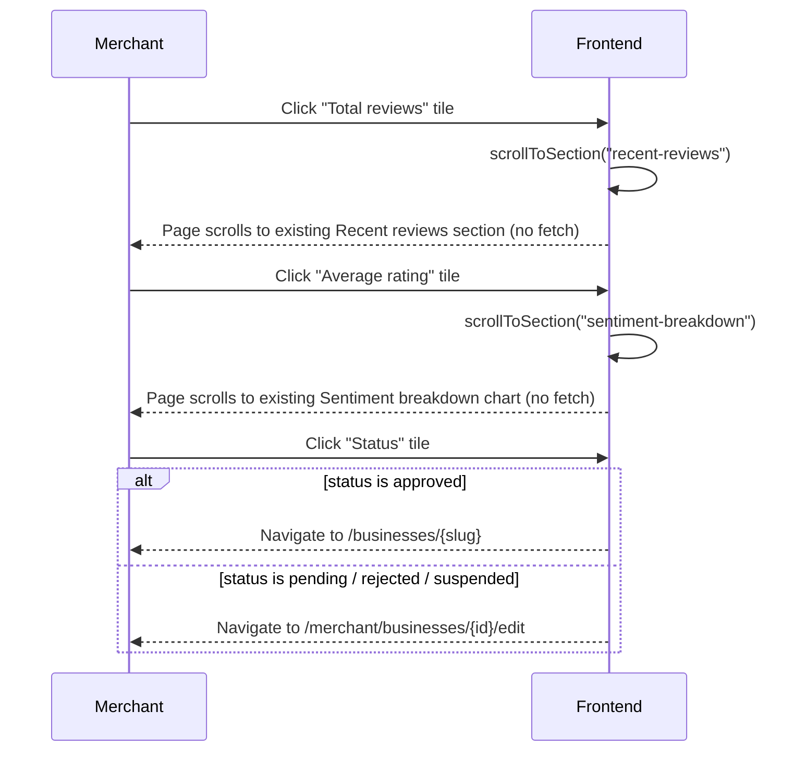

# Slice: S-022 — Merchant dashboard tile interactivity

| Field | Value |
|-------|-------|
| **Slice ID** | S-022 |
| **Phase** | 4 Dashboards |
| **Status** | Specified |
| **Role(s)** | merchant |
| **Owner** | PM / 2026-08-11 |

---

## User story

**As a** merchant viewing my dashboard
**I want** the "Total reviews", "Average rating", and "Status" stat tiles to be clickable shortcuts to the related content already on the page
**So that** the dashboard feels responsive and consistent with the admin panel's tile behavior, instead of static, dead-looking numbers

---

## Acceptance criteria

1. **Given** I am signed in as a merchant viewing `/merchant/dashboard` with a selected business, **when** I look at the "Total reviews" tile, **then** it renders as an interactive element (e.g., `<button>`, matching the existing hover/focus affordance the admin panel already uses for its clickable tiles) rather than a static `
`.
2. **Given** I click the "Total reviews" tile, **when** the click registers, **then** the page scrolls/jumps to the existing "Recent reviews" section further down the same page (no new fetch — that data is already loaded into `stats.recent_reviews`).
3. **Given** I click the "Average rating" tile, **when** the click registers, **then** the page scrolls/jumps to the "Sentiment breakdown" chart section (the closest existing rating-related content on the page).
4. **Given** I click the "Status" tile, **when** the click registers, **then** I am taken to the business's edit page (`/merchant/businesses/{id}/edit`, already linked in the page's nav) if status is `pending`/`rejected`/`suspended` (actionable), or to the business's public profile (`/businesses/{slug}`, already linked in nav) if status is `approved`.
5. **Given** a merchant owns more than one business and switches the "Your businesses" selector, **when** a different business becomes selected, **then** the three tiles' click targets update to reflect the newly selected business's data/id/slug (no stale references to the previously selected business).
6. **Given** a merchant with only one business (no selector shown) or a merchant whose selected business has zero reviews, **when** they click the "Total reviews" tile, **then** they land on the "Recent reviews" section showing its existing "No reviews yet." empty state — no error.
7. **Given** a customer or admin (non-merchant role) attempts to load `/merchant/dashboard` directly, **when** the page renders, **then** existing role-gating behavior is unchanged by this slice (no regression — this slice only changes tile markup/interactivity, not auth).

---

## UX notes

- **Screens / routes:** `/merchant/dashboard` only (`frontend/src/components/MerchantDashboard.tsx`, the 3-tile grid at lines ~163-176).
- **Components to reuse:** match the button-vs-div pattern already established in `frontend/src/app/admin/page.tsx` (`STAT_TARGETS` + `scrollToSection`) for the two scroll-to-section tiles; use existing `<a href>` nav links (already computed in the page's `navItems`) for the "Status" tile's navigate-away behavior.
- **Empty states / errors:** none new — this slice wires existing on-page content/sections and existing nav links; no new network calls, no new empty states beyond what "Recent reviews" and the nav links already handle.
- **AI disclaimer required?** No — the three tiles show review count, average rating, and approval status, none of which are AI-generated. (The dashboard's separate AI insights section, unaffected by this slice, already carries its own "suggestion" language.)

---

## Out of scope

- Any change to the tiles' displayed values, layout, or the data they're computed from (`dashboard.merchant(b.id)` response) — this is an interactivity-only slice.
- Admin panel changes — tracked separately as S-021.
- Migrating these tiles to the `ui/StatCard` design-system primitive (README §14 notes ~25 call sites still use inline tiles / native controls; that migration is a separate, broader cleanup effort, not scoped here).
- Adding new sections to the merchant dashboard that don't already exist (e.g., a dedicated per-review-status breakdown page) — the tiles route to *existing* on-page content only.

---

## Dependencies

- None — purely a frontend interactivity change on data/sections that already render on `/merchant/dashboard` today.

---

## Definition of done (PM)

- [ ] All AC verified in test report
- [ ] UX matches notes above
- [ ] Documented in `README.md` §7 API reference / §8 Frontend guide if new patterns
- [ ] PM Status set to **Accepted**

---

## Technical specification (Architect)

### API contract

| Method | Path | Auth | Request | Response |
|--------|------|------|---------|----------|
| GET | `/api/v1/dashboard/merchant/{business_id}` | Merchant (own business) or Admin — existing, unchanged (`require_roles(UserRole.MERCHANT, UserRole.ADMIN)`) | — | `DashboardStats` (existing, unchanged) — `total_reviews`, `average_rating`, `recent_reviews`, `sentiment_breakdown` are already fetched today and already drive the three static tiles + the sections they'll now link to |

No new or modified endpoint. This is an interactivity-only slice against data (`stats`) and destinations (`navItems` hrefs) `MerchantDashboard.tsx` already fetches/computes.

### RBAC matrix

| Action | customer | merchant | admin |
|--------|----------|----------|-------|
| View `/merchant/dashboard` incl. the three (now-interactive) tiles | No — `RequireAuth role="merchant"` blocks (unchanged) | Yes, own business only | No — blocked by the page's frontend role gate (unchanged; the underlying API also permits admin, but this slice doesn't touch route access, per AC 7) |
| Click "Total reviews" / "Average rating" tile → scroll to existing section | n/a | Yes | n/a |
| Click "Status" tile → navigate to edit page or public profile | n/a | Yes, own business's edit/public-profile links only (already merchant-scoped via existing `navItems`) | n/a |

No RBAC change. AC 7 explicitly requires the existing role-gating behavior to be a no-op regression check for this slice.

### Data model impact

- [x] None  [ ] Extend existing  [ ] New table(s)

**Details:** No backend/schema change of any kind. All three tile values (`total_reviews`, `average_rating`, business `status`) are already present in `DashboardStats`/`Business` and already rendered today — this slice only changes how the existing values are wrapped (interactive vs. static markup).

### Cache / side effects

None. No new network calls are introduced — this wires already-fetched `stats` state and already-computed `navItems` hrefs to click handlers/links. No cache invalidation applies (read-only, no writes).

### Frontend

- **Route:** `/merchant/dashboard` (`frontend/src/components/MerchantDashboard.tsx`, 3-tile grid at lines ~164-171), unchanged rendering mode.
- **Rendering:** CSR (`"use client"`, unchanged — already a client component; no SSR change needed since this is pure post-load interactivity on already-fetched state).
- **Components:**
  - `frontend/src/components/MerchantDashboard.tsx` (edit):
    - Add `id="recent-reviews"` (with `scroll-mt-20`, matching `/admin`'s `section#pending-businesses`/`#reported-reviews` pattern) to the "Recent reviews" section (~line 195), and `id="sentiment-breakdown"` to the "Sentiment breakdown" card (~line 173).
    - Reuse the `scrollToSection(id)` pattern already established in `frontend/src/app/admin/page.tsx` (`STAT_TARGETS`) for the "Total reviews" and "Average rating" tiles: wrap each in a `<button type="button" onClick={() => scrollToSection(...)}>` matching the admin panel's hover/focus affordance (AC 1), rather than the current static `
`-based `StatCard` usage.
    - "Status" tile becomes an `<a href={statusHref}>` wrapping the same `StatCard` content, where `statusHref = status === "approved" ? \`/businesses/${business.slug}\` : \`/merchant/businesses/${business.id}/edit\`` (AC 4) — reusing exactly the hrefs already computed for `navItems` (~lines 93-103), not new href logic. `<a>` (true navigation) is used here deliberately, distinct from the `<button>` used for the two scroll tiles (no URL/history change) — see Risks.
    - Because `statusHref` and the two `scrollToSection` targets are derived directly from the `business`/`status` values already re-set by the existing `loadDashboard` effect (keyed on `selectedId`), switching the "Your businesses" selector naturally updates all three tiles' targets on the next render — no extra state/effect needed (AC 5).
  - No new components. `StatCard` (`frontend/src/components/ui/StatCard.tsx`) keeps its current props; Builder wraps it in `<button>`/`<a>` rather than adding interactivity props to `StatCard` itself, since ~25 other call sites (README §14) use it statically and a prop-contract change there is out of scope for this slice.
- **Empty states / errors:** none new. "Recent reviews" already renders "No reviews yet." when empty (AC 6); the "Status" tile's two destinations are existing, already-linked routes with their own existing handling.

### Flow

### Architect checklist

- [x] API contract defined (none needed — documented existing endpoint reused unchanged)
- [x] RBAC matrix complete (no change)
- [x] Data model impact documented (none)
- [x] Cache invalidation considered (n/a — no writes, no new fetches)
- [x] Uses AI/storage abstractions where applicable (n/a — not an AI/storage feature)
- [x] ERD/API/FLOWS updates noted (none needed; no API/ERD change. Builder may add a short §8 Frontend guide note on the tile-interactivity pattern if it's judged reusable elsewhere)

### Risks / tradeoffs

- **Intentional asymmetry**: "Total reviews"/"Average rating" use `<button>` + in-page scroll (no URL/history change), while "Status" uses `<a>` + real navigation (AC 4 sends the merchant to a different route). This mirrors correct HTML semantics (`<button>` for same-page behavior, `<a>` for navigation) rather than using one element type for all three — worth a quick a11y/keyboard-nav check in the test pass.
- **No `StatCard` prop-contract change** is required by this design (wrap, don't extend) — deliberately avoids touching the ~25 other static call sites of `StatCard` (README §14 design-system-primitives gap) called out as out of scope.
- **No ADR** — this is additive UI interactivity against existing data/routes with no schema, auth, integration, or irreversible decision involved.

---

## Links

- Test plan: `docs/agents/test-plans/TP-S-022-merchant-dashboard-tile-interactivity.md`
- Test report: `docs/agents/test-reports/TR-S-022-merchant-dashboard-tile-interactivity.md`
- ADR: none — purely additive UI interactivity, no irreversible/architectural decision.

---

## Changelog

| Date | Agent | Change |
|------|-------|--------|
| 2026-08-11 | PM | Slice created from stakeholder feedback ("merchant screen enrichment... when I click the tiles I don't get to see..."). Grounded in Builder's read of `frontend/src/components/MerchantDashboard.tsx` lines ~163-176 (static, non-interactive tiles; review list and business name already render lower on the same page). Split from admin work (S-021) per README §13 sizing guidance — different role, different (smaller, no-new-API) scope. 7 numbered AC, UX notes, out-of-scope, DoD. Status: Draft. |
| 2026-08-11 | Architect | Confirmed no new/changed API (existing `GET /dashboard/merchant/{business_id}` already carries everything needed); documented RBAC (no change), data model impact (none), and a frontend-only plan reusing `/admin`'s `scrollToSection` pattern for the two scroll tiles plus an `<a href>` for the Status tile (reusing existing `navItems` href logic). Mermaid flow, risks (deliberate `<button>` vs `<a>` split; no `StatCard` prop-contract change). No ADR — confirmed not warranted. Status: Specified. |
