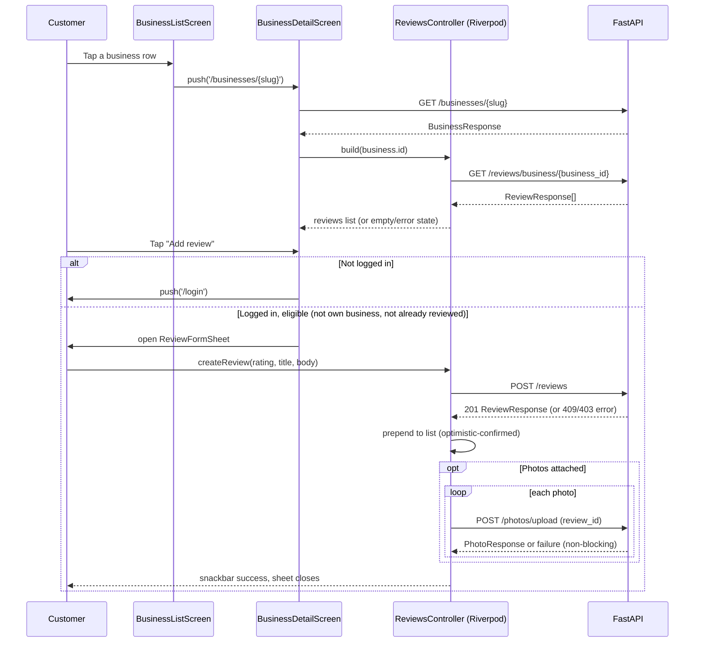

# Slice: S-023 — Mobile reviews

| Field | Value |
|-------|-------|
| **Slice ID** | S-023 |
| **Phase** | 2 Core |
| **Status** | Testing |
| **Role(s)** | customer \| merchant \| admin |
| **Owner** | PM / 2026-08-11 |

---

## User story

**As a** customer using the mobile app
**I want** to read a business's reviews and submit my own star rating and comment from its detail screen
**So that** I can judge trustworthiness before visiting and share my own experience, the same way I can on the web

---

## Acceptance criteria

1. **Given** I am on the business list, **when** I tap a business, **then** I am navigated to that business's detail screen, which shows the business name, average rating, review count, and a list of its reviews (most recent first).
2. **Given** a business has one or more active reviews, **when** its detail screen loads, **then** each review shows the reviewer's name (or "Customer" if unavailable), star rating, title (if present), body text, and — when AI analysis is present — a sentiment badge labeled to make clear it is an AI-generated **suggestion**, not a verified fact (e.g. "AI: positive").
3. **Given** a business has zero active reviews, **when** its detail screen loads, **then** I see an empty-state message (e.g. "No reviews yet — be the first to review") instead of a blank list.
4. **Given** the reviews request fails (network/server error), **when** the detail screen loads, **then** I see an inline error state with a Retry action, not a blank screen or an uncaught crash.
5. **Given** I am on a business detail screen, **when** I pull down on the reviews list, **then** the list refreshes (pull-to-refresh) and shows a refresh spinner while in flight.
6. **Given** I am logged in as a customer or merchant/admin browsing as a reviewer, and I have **not** already reviewed this business, **when** I view the business detail screen, **then** I see an "Add review" action.
7. **Given** I tap "Add review", **when** the review form opens, **then** I can pick a star rating (1–5, required), enter an optional title, and enter a required comment (minimum 10 characters), with the submit action disabled until those requirements are met.
8. **Given** I submit a valid review, **when** the request succeeds, **then** the new review appears at the top of the business's review list without requiring a manual refresh, the form closes, and I see a brief success confirmation (e.g. snackbar/toast).
9. **Given** I am filling out the review form, **when** I optionally attach one or more photos (device gallery/camera, up to the same per-review cap as web) and submit, **then** each photo uploads after the review is created and appears in the review's photo strip once done; **when** a photo upload fails, **then** the review itself remains posted and I see a non-blocking warning that N photo(s) failed to upload, without losing the already-posted review.
10. **Given** I have already submitted a review for this business, **when** I view its detail screen, **then** the "Add review" action is not shown (mirrors the backend's one-review-per-customer-per-business rule) and, if I still attempt to submit a duplicate via a stale form, I see a clear "You have already reviewed this business" error rather than a generic failure.
11. **Given** I try to submit a review while offline or the create-review request fails, **when** the error returns, **then** I see an inline error message on the form and my entered rating/title/comment are preserved (not cleared) so I can retry without retyping.
12. **Given** I am a merchant viewing the detail screen for my **own** business, **when** the screen loads, **then** the "Add review" action is not shown (mirrors the backend's block on merchants reviewing their own business).
13. **Given** I am not logged in and open a business detail screen, **when** the screen loads, **then** I can still see the reviews list, but tapping "Add review" routes me to the login screen instead of opening the form.

---

## UX notes

- **Screens / routes:** New business detail screen (minimal — business header + reviews list; full profile parity with the web `/businesses/[slug]` page such as hours, photos gallery, map, and AI merchant summary is a separate future slice, see Out of scope), reached by tapping a row on the existing business list screen (`lib/features/businesses/business_list_screen.dart`, which currently has no tap navigation — that wiring is part of this slice). A modal/bottom-sheet or pushed-route review form, opened from the detail screen's "Add review" action.
- **Native navigation:** Standard Flutter push (`Navigator`/route) from list to detail, matching the existing single-screen app's navigation style; the review form should feel native (bottom sheet or full-screen route, not a web-style inline expand).
- **Loading states:** Skeleton or centered spinner while reviews load; a distinct in-flight state (spinner/disabled submit button with label change, e.g. "Posting...") while a review is submitting, mirroring `frontend/src/components/ReviewForm.tsx`'s `loading` state.
- **Pull-to-refresh:** Standard `RefreshIndicator` (or platform equivalent) on the reviews list, per AC 5.
- **Offline/empty/error states:** Empty state per AC 3; error state per AC 4 with Retry; submit-error state per AC 11 that preserves form input.
- **AI disclaimer required?** Yes — any AI sentiment badge or AI-generated summary text shown on a review must be visibly labeled as AI-generated / a suggestion (e.g. prefix "AI:" or "(suggestion)"), mirroring `ReviewCard.tsx`'s "AI: {sentiment}" badge and "AI summary (suggestion): ..." text. Never present AI sentiment as a verified fact about the review.

---

## Out of scope

- Editing or deleting an already-submitted review (backend supports `PATCH`/`DELETE /reviews/{id}`, but the web frontend doesn't expose this either — mobile parity means matching that, not going beyond it).
- Liking a review, reporting a review, or merchant replies to reviews (`POST /reviews/{id}/like|report|reply`) — separate future mobile slice(s).
- Admin review moderation (`GET /reviews/reported`, `POST /reviews/{id}/moderate`) — belongs with a future mobile admin-dashboard slice, not this customer-facing one.
- Full business detail screen parity (business hours, photo gallery, map, AI merchant summary) — this slice only builds the minimal shell needed to host the reviews list and review form; broader detail-screen enrichment is a separate future slice.
- Camera-specific capture UX polish (e.g. in-app crop/rotate) — photo attachment uses the standard OS picker only.
- Offline queuing/retry of a review submitted while offline (AC 11 only requires a clear error and preserved form state, not background sync).

---

## Dependencies

- S-002 Business CRUD + admin approval (approved businesses exist to review) — **Scaffolded**
- S-003 Review CRUD + photos (backend `backend/app/routers/reviews.py`, `backend/app/routers/photos.py`) — **Scaffolded**, already fully implemented server-side; this slice is the mobile-frontend half.
- S-005 AI review analysis pipeline (sentiment/summary attached to `ReviewResponse.ai_analysis`) — **Scaffolded**
- Mobile `businesses` feature (`mobile/lib/features/businesses/`) and generated `reviews_api.dart` / `photos_api.dart` clients — already present.

---

## Definition of done (PM)

- [ ] All AC verified in test report
- [ ] Business detail screen and review submission work for the customer role on mobile (Flutter), with merchant/admin/logged-out edge cases per AC 6, 10, 12, 13
- [ ] Documented in `README.md` §8 Frontend guide (or the Mobile client section) if new component/screen patterns are introduced
- [ ] PM Status set to **Accepted**

---

## Technical specification (Architect)

> Filled by Architect before implementation.

### API contract

No new backend endpoints. All existing, unchanged — see `backend/app/routers/reviews.py`, `photos.py`, `businesses.py` and their Dart clients `reviews_api.dart`, `photos_api.dart`, `businesses_api.dart`.

| Method | Path | Auth | Request | Response |
|--------|------|------|---------|----------|
| GET | `/api/v1/businesses/{slug}` | Public | path `slug` | `BusinessResponse` (name, average_rating, review_count, id for downstream calls) |
| GET | `/api/v1/reviews/business/{business_id}` | Public | path `business_id` (UUID) | `ReviewResponse[]` (author, ai_analysis, reply, photo_urls) |
| POST | `/api/v1/reviews` | Bearer (customer\|merchant\|admin) | `{business_id, rating(1-5), title?, body(min 10 chars)}` | 201 `ReviewResponse` |
| POST | `/api/v1/photos/upload` | Bearer | multipart `file`, `review_id`, `photo_type="review"`, `caption?` | 201 `PhotoResponse` |
| GET | `/api/v1/businesses/mine` | Bearer (merchant) | — | `BusinessResponse[]` — reused **client-side only** to compute AC12 (hide "Add review" on my own business); not a new endpoint or a new call pattern for this route |

Errors surfaced to the UI via `ApiException.fromDioException` (existing pattern): `403 "Cannot review your own business"` (defense-in-depth alongside the client-side own-business check), `409 "You have already reviewed this business"` (AC10), `404 "Business not found or not approved"` on a stale slug, `400` on unsupported/too-large photo (`photos_api.dart`).

### RBAC matrix

| Action | customer | merchant | admin | anonymous |
|--------|----------|----------|-------|-----------|
| View business detail + reviews list | Yes | Yes | Yes | Yes (AC13) |
| See "Add review" action | Yes, if not already reviewed | Yes, unless own business | Yes, if not already reviewed | Yes — shown, but tap routes to `/login` (AC13) |
| Submit review | Yes | Yes, not own business (403 if attempted) | Yes | No |
| Attach review photos | Yes (own review only, via `review_id`) | same | same | N/A |

### Data model impact

- [x] None  [ ] Extend existing  [ ] New table(s)

**Details:** No schema/model/router changes. `Review`, `Photo`, `AIAnalysis`, `Business` are consumed as-is.

### Cache / side effects

- Backend: `POST /reviews` already invalidates `search:*` on write (existing behavior, untouched by this slice).
- Mobile: no local disk/HTTP cache layer. `reviewsControllerProvider` (Riverpod `AsyncNotifier`, one instance per `businessId`) is the single in-memory source of truth for a business's reviews. On successful create, the new `ReviewResponse` is **prepended directly to that provider's state** (not a refetch) to satisfy AC8 ("appears at the top ... without requiring a manual refresh"). Photo upload happens after review creation and never rolls back the already-inserted review row on failure (AC9 — only a non-blocking warning is shown). Pull-to-refresh (AC5) calls `ref.invalidate` on the family entry for a clean refetch. The business header's `average_rating`/`review_count` on `BusinessDetailScreen` is not live-recomputed after a submit in this slice (see Risks).

### Frontend

- **Route:** `/businesses/:slug` (new `GoRoute` in `mobile/lib/router.dart`), pushed from `BusinessListScreen`'s row tap via `context.push('/businesses/${business.slug}')`. **Public route** — the router's redirect logic must be updated so `/businesses` and `/businesses/:slug` don't force a login redirect (today the whole app is gated behind `/login`). See **ADR-003**, which this slice is responsible for landing since S-024/S-025 build on top of the same decision.
- **Rendering:** CSR — Flutter has no SSR; every mobile screen in this app is CSR.
- **State management:** Riverpod, matching `auth_provider.dart` / `business_list_provider.dart` conventions:
  - `businessDetailProvider = FutureProvider.autoDispose.family<BusinessResponse, String>(slug)` — new method `BusinessRepository.getBySlug()` wrapping `getBusinessApiV1BusinessesSlugGet`.
  - `reviewsControllerProvider = AsyncNotifierProvider.autoDispose.family<ReviewsController, List<ReviewResponse>, String businessId>` (new `features/reviews/review_providers.dart`) — `build()` calls `ReviewRepository.listForBusiness(businessId)`; exposes `createReview(...)` (prepends on success) and `uploadPhoto(...)`.
  - `myBusinessIdsProvider = FutureProvider.autoDispose<Set<String>>` — calls `GET /businesses/mine` **only when** `authControllerProvider.valueOrNull?.role == UserRole.merchant`, else resolves to `{}`. Used for AC12.
  - Already-reviewed check (AC10) is derived, not fetched separately: compare the loaded reviews' `authorId` against `authControllerProvider.valueOrNull?.id`.
- **New files:**
  - `mobile/lib/features/businesses/business_detail_screen.dart` — header (name, average_rating, review_count) + reviews list (`RefreshIndicator`, empty/error+Retry per AC3/4) + "Add review" action.
  - `mobile/lib/features/reviews/review_repository.dart`, `review_providers.dart` — same `try { } on DioException catch (e) { throw ApiException.fromDioException(e); }` pattern as `business_repository.dart`.
  - `mobile/lib/features/reviews/review_card.dart` — list item: reviewer name (`author?.fullName ?? 'Customer'`), star rating (readonly), title, body, AI badge (`"AI: {sentiment}"`, only when present — mirrors `frontend/src/components/ReviewCard.tsx`), photo strip (`photoUrls`).
  - `mobile/lib/features/reviews/rating_stars.dart` — reusable readonly/interactive (1–5) widget shared by `ReviewCard` and the review form.
  - `mobile/lib/features/reviews/review_form_sheet.dart` — `showModalBottomSheet(isScrollControlled: true, ...)` from `BusinessDetailScreen`'s "Add review" action (not a separate route — transient, no back-stack entry needed). Rating (required), title (optional), body (required, min 10 chars, submit disabled until valid — mirrors `ReviewForm.tsx`), optional photo attach (OS picker, capped at 5 to match web's `MAX_PHOTOS`), "Posting..." submit-disabled state, inline error preserving entered fields on failure (AC11), snackbar success, then pop.
  - `business_list_screen.dart` edited: its `ListTile` gets `onTap: () => context.push('/businesses/${business.slug}')` (currently has none — explicitly in scope per this slice's UX notes).
- **New package dependency:** `image_picker` is not in `mobile/pubspec.yaml` today and is required for AC9's gallery/camera photo attach — Builder must add it plus platform permission entries (`AndroidManifest.xml`, `Info.plist`).

### Flow

### Architect checklist

- [x] API contract defined
- [x] RBAC matrix complete
- [x] Data model impact documented
- [x] Cache invalidation considered
- [x] Uses AI/storage abstractions where applicable (backend `AIProvider`/storage abstractions untouched; mobile only consumes existing endpoints — no direct AI/storage integration in this slice)
- [x] ERD/API/FLOWS updates noted (none needed — no new endpoints/schema; no README §5/§7 changes required at Builder handoff, only §8/mobile-client notes if a new component pattern is introduced)

### Risks / tradeoffs

- **The router currently gates the entire app behind login** (`initialLocation: '/login'`, redirect forces `/login` for every route but itself) — but AC13 requires an anonymous user to reach the business detail screen. This slice must land the router change: exempt `/businesses` and `/businesses/:slug` from the forced-login redirect, and add a "Continue without signing in" link on `LoginScreen` so the path is reachable through real navigation, not only a raw deep link. Full decision and alternatives in **ADR-003**; S-024/S-025 build on top of it rather than re-deciding it.
- No `is_favorited`/ownership field exists on `BusinessResponse` — AC12's "hide Add review for my own business" needs an extra `GET /businesses/mine` call (merchant-only, small list). Acceptable extra round-trip given it's merchant-only and infrequent.
- `image_picker` is a new mobile dependency — Builder should confirm it doesn't conflict with the CI emulator workflow's existing Android/iOS platform setup (`.github/workflows/mobile-emulator-check.yml`).
- Reviews list has no pagination (mirrors the unchanged backend contract, which returns all active reviews for a business) — fine at current data volumes; out of scope to fix here since the endpoint isn't changing.
- `BusinessDetailScreen`'s header rating/review_count is not live-recomputed in place after a new review posts (only the list is) — a stale count until the next full navigation to the screen, same tradeoff the web frontend accepts (its `router.refresh()` re-fetches SSR data, which mobile has no equivalent of). Accepted, not fixed here.

---

## Links

- Test plan: `docs/agents/test-plans/TP-S-023-mobile-reviews.md`
- Test report: `docs/agents/test-reports/TR-S-023-mobile-reviews.md`
- ADR: `docs/agents/adrs/ADR-XXX-*.md` (if any)

---

## Changelog

| Date | Agent | Change |
|------|-------|--------|
| 2026-08-11 | PM | Slice created: user story, AC, UX notes, out-of-scope, dependencies |
| 2026-08-11 | Architect | Technical specification added (API contract reuses existing reviews/photos/businesses endpoints; no backend changes). Introduces ADR-003 (mobile router public-route carve-out for `/businesses`, needed for AC13) — S-024/S-025 depend on it. Status → Specified. |
| 2026-08-11 | Builder | Implemented business detail + reviews list/form (Riverpod, image_picker, public `/businesses` carve-out per ADR-003). Gap-check fixes: AI summary "(suggestion)" on ReviewCard; web-safe photo preview (no `dart:io`). Unit tests for ReviewsController pass. Status → Testing. |
| 2026-08-11 | Builder | Finish polish: hide "Add review" until reviews/ownership eligibility is ready (AC10/AC12 flash); path-safe photo upload basename for Windows `\`. |
