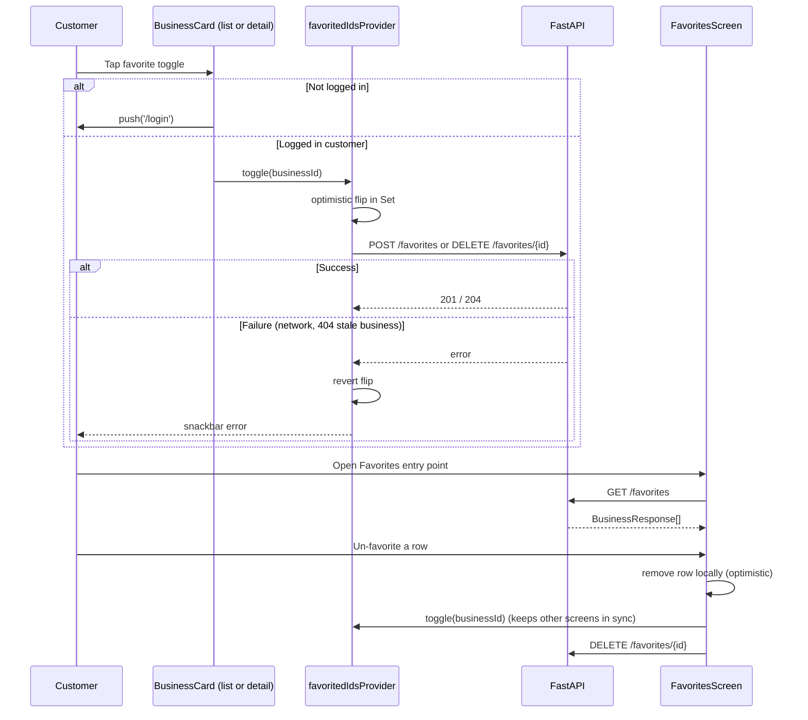

# Slice: S-024 — Mobile favorites

| Field | Value |
|-------|-------|
| **Slice ID** | S-024 |
| **Phase** | 2 Core |
| **Status** | Testing |
| **Role(s)** | customer |
| **Owner** | PM / 2026-08-11 |

---

## User story

**As a** customer using the mobile app
**I want** to favorite/unfavorite a business and see my favorited businesses in one list
**So that** I can quickly find and revisit businesses I like, the same way I can on the web (`/profile` favorites list, S-011)

---

## Acceptance criteria

1. **Given** I am logged in as a customer and viewing an approved business (list row or detail screen), **when** I tap the favorite toggle, **then** the business is saved as a favorite and the toggle switches to its "favorited" visual state (e.g. filled heart/star icon) without a full screen reload.
2. **Given** a business is already in my favorites, **when** I tap the favorite toggle again, **then** the favorite is removed and the toggle reverts to its unfavorited state (toggle behavior, matching the idempotent `POST`/`DELETE /api/v1/favorites` backend contract).
3. **Given** the favorite/unfavorite request fails (network/server error), **when** the error returns, **then** the toggle visually reverts to its prior state (optimistic-update rollback) and I see a brief non-blocking error (e.g. snackbar), not a silently wrong icon state.
4. **Given** I have one or more favorited businesses, **when** I open the Favorites screen, **then** I see a list of my favorited businesses showing name, city/state, and average rating, most-recently-favorited first.
5. **Given** I have zero favorited businesses, **when** I open the Favorites screen, **then** I see an empty-state message (e.g. "No favorites yet — explore businesses to save your favorites") with a way to navigate back to the business list, instead of a blank screen.
6. **Given** I am on the Favorites screen, **when** I pull down on the list, **then** it refreshes (pull-to-refresh) and shows a refresh spinner while in flight.
7. **Given** the Favorites screen's initial load fails (network/server error), **when** it loads, **then** I see an inline error state with a Retry action, not a blank screen or an uncaught crash.
8. **Given** I un-favorite a business from within the Favorites screen itself, **when** the un-favorite succeeds, **then** that business is removed from the visible list immediately (optimistic), without requiring a manual pull-to-refresh.
9. **Given** I am not logged in, **when** I attempt to tap a favorite toggle, **then** I am routed to the login screen instead of a favorite being created (matching the backend, which requires an authenticated customer).
10. **Given** I am not logged in, **then** no Favorites entry point requiring auth silently no-ops — either the entry point is hidden/disabled for logged-out users, or tapping it routes to login (Architect/Builder to pick one consistent with how the app already gates other authenticated-only actions).
11. **Given** a business is not in `approved` status, **when** a favorite toggle is somehow attempted on it (e.g. stale cached data), **then** the app surfaces the backend's 404 as a clear "This business is no longer available to favorite" message rather than a generic failure.

---

## UX notes

- **Screens / routes:** Favorite toggle on business list rows and on the S-023 business detail screen; a new Favorites list screen, reachable from primary navigation (e.g. a bottom nav tab or a button/icon on the business list app bar — Architect/Builder to fit the app's current single-app-bar navigation shell without overbuilding a tab bar just for this).
- **Native navigation:** Favorites screen is a distinct pushed route (or nav-destination), not a dropdown/panel like the web's profile page — mobile has no `/profile` page yet, so this may be its own top-level entry point rather than nested under a profile screen that doesn't exist yet.
- **Components to reuse (conceptually):** Same business-row presentation already used in `business_list_screen.dart` (name, city/state, rating, review count) — mobile has no `BusinessCard` widget yet, so this slice should extract/share that row rendering rather than duplicate it, so both the business list and Favorites list stay visually consistent.
- **Loading/offline states:** Standard loading spinner on first load; pull-to-refresh per AC 6; error+Retry per AC 7; optimistic toggle with rollback-on-failure per AC 1–3.
- **AI disclaimer required?** No — favoriting is a plain user action with no AI-generated content involved.

---

## Out of scope

- Sharing favorites with other users.
- Notifications when a favorited business gets new reviews.
- Merchants seeing who favorited their business.
- A full mobile profile screen — the Favorites screen ships as its own entry point in this slice (see UX notes); folding it into a broader profile screen is future work once one exists.
- Any change to favorite ordering/sort options beyond "most recently favorited first" (matches backend's `Favorite.created_at desc` ordering — no client-side re-sort).

---

## Dependencies

- S-002 Business CRUD + admin approval (businesses must be approvable/listable) — **Scaffolded**
- S-011 Customer favorites (web equivalent; backend `backend/app/routers/favorites.py` and the `favorites` table already exist and are reused as-is) — **Accepted**
- Mobile `businesses` feature (`mobile/lib/features/businesses/`) and generated `favorites_api.dart` client — already present.
- S-023 Mobile reviews — not a hard blocker, but if it ships first its business detail screen is a natural second place (besides the list row) to host the favorite toggle described in AC 1.

---

## Definition of done (PM)

- [ ] All AC verified in test report
- [ ] Favorite toggle and Favorites list work for the customer role on mobile (Flutter), with logged-out and error/rollback edge cases per AC 3, 9, 10, 11
- [ ] Documented in `README.md` §8 Frontend guide (or the Mobile client section) if new component/screen patterns are introduced
- [ ] PM Status set to **Accepted**

---

## Technical specification (Architect)

> Filled by Architect before implementation.

### API contract

No new backend endpoints. All existing, unchanged — see `backend/app/routers/favorites.py` and its Dart client `favorites_api.dart` (S-011's contract, reused as-is).

| Method | Path | Auth | Request | Response |
|--------|------|------|---------|----------|
| GET | `/api/v1/favorites` | Bearer (customer) | — | `BusinessResponse[]` (newest-favorited first) |
| POST | `/api/v1/favorites` | Bearer (customer) | `{business_id}` | 201 `{favorited: true, business_id}` |
| DELETE | `/api/v1/favorites/{business_id}` | Bearer (customer) | path `business_id` | 204 No Content (idempotent) |

Errors: `404 "Business not found or not approved"` on `POST` for a non-approved/missing business (AC11). All three routes are `require_roles(UserRole.CUSTOMER)` server-side — merchant/admin sessions get 403 if they somehow call these; mobile mirrors that by never showing favorite UI to non-customer roles (see RBAC matrix), matching the web's customer-only favoriting.

### RBAC matrix

| Action | customer | merchant | admin | anonymous |
|--------|----------|----------|-------|-----------|
| See favorite toggle on a business row/detail | Yes | No (hidden — favoriting is customer-only) | No | Yes — shown, tap routes to `/login` (AC9) |
| Toggle favorite | Yes | N/A | N/A | No |
| See Favorites entry point | Yes | No | No | No (AC10 — hidden, not disabled) |
| View Favorites screen | Yes | N/A (entry point hidden; direct nav would 403 server-side) | N/A | No — router redirects to `/login` |

### Data model impact

- [x] None  [ ] Extend existing  [ ] New table(s)

**Details:** No schema/model/router changes. `Favorite` (S-011) is consumed as-is.

### Cache / side effects

- Backend: favorites writes do **not** invalidate `search:*` (unaffected — matches existing `favorites.py`, which never calls `cache_delete_pattern`).
- Mobile: a single shared Riverpod source of truth — `favoritedIdsProvider` (new `features/favorites/favorites_providers.dart`, an `AsyncNotifier<Set<String>>`) fetched once via `GET /favorites` and consumed by **every** favorite toggle in the app (business list rows, the S-023 business detail screen, and the Favorites screen itself). Toggling calls the notifier's `toggle(businessId)`, which: (1) optimistically flips the id in the in-memory `Set` (AC1/2), (2) calls `POST`/`DELETE /favorites` in the background, (3) reverts and surfaces a snackbar on failure (AC3). This keeps a toggle on the business list reflected instantly on the detail screen and vice versa, and lets the Favorites screen remove a row immediately on un-favorite (AC8) with no manual pull-to-refresh — answering "does the favorites list need to refresh after a toggle elsewhere" via a shared provider rather than per-screen re-fetches. This is a deliberate improvement over the web's `FavoriteButton.tsx`, which calls `GET /favorites` and does a `.some()` check on *every button mount* — acceptable for one detail page, but would mean one `GET /favorites` per row on a scrollable business list if copied literally; centralizing avoids that fan-out.
  - The Favorites **screen's list content** (name/city/rating, not just membership) is a separate `favoritesListProvider` (`FutureProvider.autoDispose`) also backed by `GET /favorites`; on optimistic un-favorite from within that screen (AC8) the screen removes the row from its own local state and also nudges `favoritedIdsProvider` so other screens stay in sync.

### Frontend

- **Route:** `/favorites` (new `GoRoute`, `mobile/lib/router.dart`), pushed from an app-bar icon (`Icons.favorite`/`Icons.favorite_border`) on `BusinessListScreen`, alongside the existing logout `IconButton`. **Auth-gated** — the router's existing default (`if (!isLoggedIn && !isOnLogin) return '/login'`) already covers `/favorites` with no change needed (only `/businesses`/`/businesses/:slug` are carved out as public, per S-023/ADR-003), satisfying AC9/AC10 for direct navigation; the app-bar icon is additionally hidden outright when logged out (see below) rather than shown-disabled, so there's no dead icon in the guest-browsing state S-023 introduces.
- **Rendering:** CSR — no SSR equivalent in Flutter.
- **State management:** Riverpod (`favoritedIdsProvider` + `favoritesListProvider`, see Cache/side effects). The app-bar icon reads `authControllerProvider` and only renders when `.valueOrNull?.role == UserRole.customer` (merchants/admins never see it; anonymous guest browsers from S-023 never see it either — AC10).
- **New files:**
  - `mobile/lib/features/favorites/favorites_repository.dart` — wraps `favorites_api.dart` (`listFavoritesApiV1FavoritesGet`, `createFavoriteApiV1FavoritesPost`, `deleteFavoriteApiV1FavoritesBusinessIdDelete`), same `ApiException.fromDioException` pattern as `business_repository.dart`.
  - `mobile/lib/features/favorites/favorites_providers.dart` — `favoritedIdsProvider` (shared toggle-state notifier) + `favoritesListProvider`.
  - `mobile/lib/features/favorites/favorites_screen.dart` — list (name, city/state, average_rating), empty state with a button back to `/businesses` (AC5), pull-to-refresh (AC6), error+Retry (AC7).
  - `mobile/lib/features/favorites/favorite_toggle_button.dart` — reusable icon button (filled/outline heart), reads `favoritedIdsProvider`, calls `.toggle(businessId)`; routes to `/login` instead of toggling when logged out (AC9); catches the 404 case and shows "This business is no longer available to favorite" (AC11) instead of a generic error.
  - `mobile/lib/features/businesses/business_card.dart` — **new shared widget**, extracted from `business_list_screen.dart`'s inline `ListTile` (name, city/state, rating, review count) per this slice's UX note ("mobile has no `BusinessCard` widget yet ... extract/share that row rendering") — used by both `BusinessListScreen` and `FavoritesScreen`, hosting `FavoriteToggleButton` as a trailing action.
  - `business_list_screen.dart` edited: switches its inline `ListTile` to `BusinessCard` (which now also carries the favorite toggle, AC1) and adds the new app-bar Favorites icon.

### Flow

### Architect checklist

- [x] API contract defined
- [x] RBAC matrix complete
- [x] Data model impact documented
- [x] Cache invalidation considered (mobile-side shared-provider sync; no Redis impact)
- [x] Uses AI/storage abstractions where applicable (N/A — no AI/storage involved)
- [x] ERD/API/FLOWS updates noted (none needed — no new endpoints/schema)

### Risks / tradeoffs

- Depends on S-023 landing the router change (public `/businesses`, ADR-003) first — until then, `BusinessListScreen` itself is login-gated, so AC9's "not logged in, tap a favorite toggle" scenario is unreachable through normal navigation. The slice backlog already orders S-023 before S-024; build in that order.
- `favoritedIdsProvider` fetches the customer's **entire** favorites set up front — fine at expected data volumes (same total-list-size assumption the web's per-button `GET /favorites` calls already make), would need pagination if a customer's favorites list grew very large; not a concern in scope here.
- Extracting `BusinessCard` out of `business_list_screen.dart` touches an existing, already-shipped file beyond this slice's own new files — flagged so Builder treats it as the deliberate, minimal refactor the UX notes ask for (root `CLAUDE.md`: "keep diffs minimal; match existing patterns"), not an opportunity to restyle the row further.

---

## Links

- Test plan: `docs/agents/test-plans/TP-S-024-mobile-favorites.md`
- Test report: `docs/agents/test-reports/TR-S-024-mobile-favorites.md`
- ADR: `docs/agents/adrs/ADR-XXX-*.md` (if any)

---

## Changelog

| Date | Agent | Change |
|------|-------|--------|
| 2026-08-11 | PM | Slice created: user story, AC, UX notes, out-of-scope, dependencies |
| 2026-08-11 | Architect | Technical specification added (API contract reuses existing favorites endpoints; no backend changes). Introduces shared `favoritedIdsProvider` for cross-screen toggle sync; depends on S-023/ADR-003's router change for AC9/AC10 to be reachable. Status → Specified. |
| 2026-08-11 | Builder | Implemented favorite toggle + `/favorites` screen with shared `favoritedIdsProvider`, optimistic rollback, customer-only app-bar entry. Gap-check: FavoritesScreen now reuses `BusinessCard`. Unit tests for FavoritedIdsController pass. Status → Testing. |
| 2026-08-11 | Builder | Finish polish: hide heart toggle when `favoritedIdsProvider` is in error (no silent empty-heart forever). |
