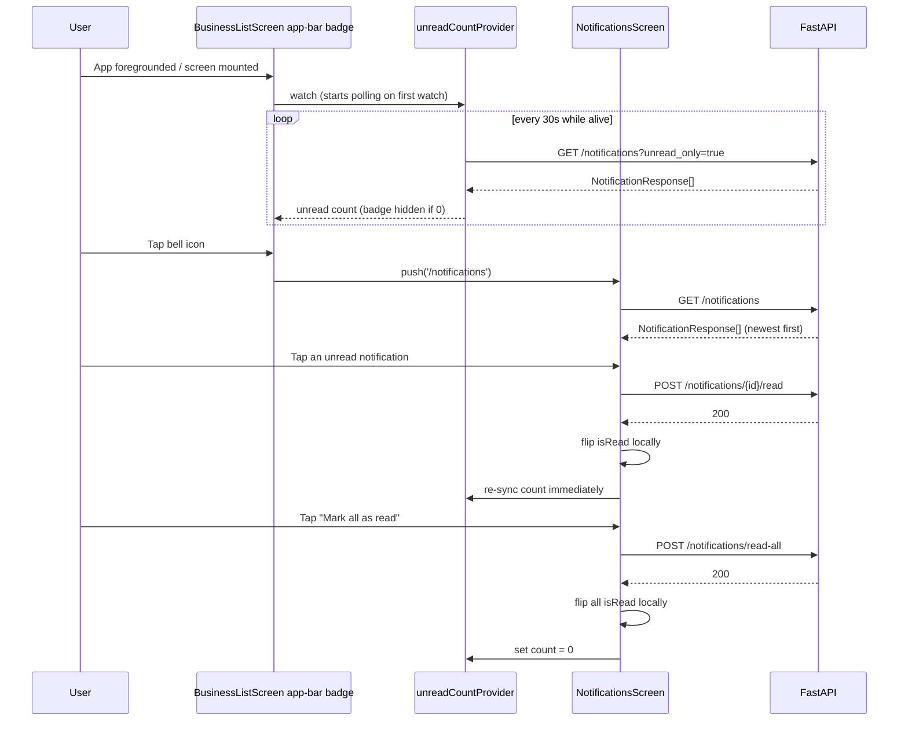

# Slice: S-025 — Mobile notifications

| Field | Value |
|-------|-------|
| **Slice ID** | S-025 |
| **Phase** | 5 Polish |
| **Status** | Specified |
| **Role(s)** | customer \| merchant \| admin |
| **Owner** | PM / 2026-08-11 |

---

## User story

**As a** logged-in mobile user (customer, merchant, or admin)
**I want** a notifications entry point with an unread-count badge and a list of my recent notifications that I can mark read individually or all at once
**So that** I know about relevant platform activity (new reviews, replies, approvals, moderation actions) on my phone, the same way I do on the web (S-015), adapted to how a mobile app surfaces this rather than a navbar dropdown

---

## Acceptance criteria

1. **Given** I am logged in, **when** I view the app's primary navigation, **then** I see a notifications entry point (e.g. bottom-nav tab icon or app-bar icon) showing an unread-count badge, hidden when the unread count is 0.
2. **Given** I am logged in and have notifications, **when** I open the notifications entry point, **then** I am taken to a dedicated Notifications screen listing my recent notifications (title, message, relative created time), most recent first, with unread items visually distinguished from read ones (e.g. bold text, dot, or background tint).
3. **Given** the Notifications screen is open, **when** I tap an unread notification, **then** it is marked read via the API, its unread styling clears, and the badge count on the entry point decrements without navigating away or a full screen reload.
4. **Given** I have one or more unread notifications, **when** I tap "Mark all as read", **then** all my notifications are marked read via the API, the badge clears, and no item in the list still shows unread styling.
5. **Given** I have zero notifications, **when** I open the Notifications screen, **then** I see an empty-state message (e.g. "No notifications yet") instead of a blank screen.
6. **Given** I am on the Notifications screen, **when** I pull down on the list, **then** it refreshes (pull-to-refresh) and shows a refresh spinner while in flight.
7. **Given** the Notifications screen's initial load fails (network/server error), **when** it loads, **then** I see an inline error state with a Retry action, not a blank screen or an uncaught crash.
8. **Given** I am not logged in, **then** no notifications entry point (icon, badge, or screen) is reachable anywhere in the app.
9. **Given** the app is running in the foreground with my session active, **when** 30 seconds elapse, **then** the unread badge count is re-fetched and updated in the background without user action (matches the web's 30s poll — no push/WebSocket in this slice).
10. **Given** notification `type` values are factual event notices (`REVIEW`/`REPLY`/`APPROVAL`/`MODERATION`/`SYSTEM`) generated by application logic, **when** they are displayed, **then** they are shown plainly with no AI-suggestion framing (this data is not AI-generated, so no "suggestion" disclaimer applies — see UX notes).

---

## UX notes

- **Screens / routes:** A dedicated Notifications screen (not a dropdown/overlay — mobile has no persistent navbar to anchor a dropdown to), reachable via a bell/icon entry point with a badge in the app's primary navigation (bottom nav tab if/when one exists, otherwise an app-bar action icon consistent with how `business_list_screen.dart` already places the logout icon action). This is a deliberate adaptation from the web's `NotificationBell.tsx` navbar dropdown (S-015) to a mobile-native pattern: tap icon → push full screen, not an in-place panel.
- **Native navigation:** Standard pushed route from the entry-point icon; back gesture/button returns to the previous screen.
- **Pull-to-refresh:** Standard `RefreshIndicator` (or platform equivalent) on the notifications list, per AC 6.
- **Badge polling:** Poll unread count on app foreground/screen mount and every 30s thereafter while the app is active, mirroring `NotificationBell.tsx`'s polling interval; no background/push notifications in this slice (see Out of scope).
- **Offline/empty/error states:** Empty state per AC 5; error state per AC 7 with Retry; a failed badge poll should degrade to no badge update rather than crash or show a broken icon.
- **AI disclaimer required?** No. Per AC 10 and the same reasoning as S-015: notification `type`/`title`/`message` are factual event notices from application logic, not AI-generated judgments, so the root `CLAUDE.md` AI-suggestion-language rule doesn't apply here.

---

## Out of scope

- Real device push notifications (FCM/APNs) — this slice is in-app polling only, matching the web's polling approach (S-015); true push is a distinct future slice with its own platform setup.
- A notification preferences/settings screen.
- Per-type deep-linking (e.g. tapping a `REVIEW` notification jumping to that review/business) — `extra_data` isn't guaranteed on every notification, and per-type routing is a separate future slice, same as S-015's scoping.
- Any change to which events emit a notification server-side — only one emission site exists today (in `backend/app/routers/reviews.py`); expanding server-side coverage is backend scope, not this slice.
- A bottom navigation bar redesign for the whole app, if one doesn't already exist — this slice adds a single entry point using whatever nav shell exists at build time (app-bar icon as a fallback), not a broader nav-architecture change.

---

## Dependencies

- S-001 Auth (JWT login) — **Scaffolded**
- S-008 Notifications (backend API: `GET /notifications`, `POST /notifications/{id}/read`, `POST /notifications/read-all`) — **Accepted (UI wired)** on web; already fully implemented server-side, this slice is the mobile-frontend half.
- S-015 Notifications UI (web equivalent; same API contract and polling approach, adapted for mobile navigation per UX notes) — **Accepted**
- Mobile auth feature (`mobile/lib/features/auth/`) and generated `notifications_api.dart` client — already present.

---

## Definition of done (PM)

- [ ] All AC verified in test report
- [ ] Notifications entry point, badge, and screen work for every authenticated role on mobile (Flutter) and are unreachable when logged out (AC 8)
- [ ] Documented in `README.md` §8 Frontend guide (or the Mobile client section) if new component/screen patterns are introduced
- [ ] PM Status set to **Accepted**

---

## Technical specification (Architect)

> Filled by Architect before implementation.

### API contract

No new backend endpoints. All existing, unchanged — see `backend/app/routers/notifications.py` and its Dart client `notifications_api.dart` (S-008/S-015's contract, reused as-is).

| Method | Path | Auth | Request | Response |
|--------|------|------|---------|----------|
| GET | `/api/v1/notifications` | Bearer | query `unread_only` (bool, default false) | `NotificationResponse[]` (max 50, newest first) |
| POST | `/api/v1/notifications/{id}/read` | Bearer | path `notification_id` | `MessageResponse` |
| POST | `/api/v1/notifications/read-all` | Bearer | — | `MessageResponse` |

No error branches beyond a standard 401 (missing/expired token, already handled by `AuthInterceptor`); `mark_read` silently no-ops server-side if the id isn't the caller's (matches current backend — no 404 to handle client-side).

### RBAC matrix

| Action | customer | merchant | admin | anonymous |
|--------|----------|----------|-------|-----------|
| See notifications entry point / badge | Yes | Yes | Yes | No (AC8) |
| View Notifications screen | Yes | Yes | Yes | No — router redirects to `/login` |
| Mark one / all read | Yes (own only, enforced server-side by `user_id`) | Yes (own only) | Yes (own only) | N/A |

All three roles behave identically — the endpoint is role-agnostic (`get_current_user`, not `require_roles`), matching this slice's "customer \| merchant \| admin" scope.

### Data model impact

- [x] None  [ ] Extend existing  [ ] New table(s)

**Details:** No schema/model/router changes. Backend still only emits `REVIEW`-type notifications (single emission site in `reviews.py`, per Out of scope) — this slice displays whatever `type`/`title`/`message` already exists.

### Cache / side effects

No Redis involvement (notifications were never part of `search:*`). Mobile-side: `unreadCountProvider` (new `NotifierProvider<UnreadCountController, int>`, **not** `.autoDispose` — see Risks) owns a `Timer.periodic(30s)` calling `GET /notifications?unread_only=true` and storing `.length`; started lazily the first time anything watches it (the `BusinessListScreen` app-bar badge, or `NotificationsScreen`) and kept alive for the rest of the logged-in session so the badge stays live across screen navigation — mirroring `NotificationBell.tsx`'s "poll on mount, every 30s," scoped here to "while the app-bar shell is present" instead of "while the navbar is mounted." A failed poll leaves the last-known count in place (degrades to stale-but-present rather than crashing or blanking the badge, per UX notes). `NotificationsScreen` holds its own `notificationsListProvider` (`AsyncNotifier<List<NotificationResponse>>`) for the full list with local mark-read/mark-all mutations (AC3/4 flip `isRead` in place, no refetch); both mutations also nudge `unreadCountProvider` to re-sync immediately rather than waiting up to 30s, so the badge decrements right away (AC3/4's "without ... a full screen reload").

### Frontend

- **Route:** `/notifications` (new `GoRoute`, `mobile/lib/router.dart`), pushed from an app-bar icon (bell, `Icons.notifications`) with a badge overlay on `BusinessListScreen`, next to the existing logout icon (and the S-024 favorites icon, if both ship) — matches the UX notes' "app-bar action icon consistent with how `business_list_screen.dart` already places the logout icon action." **Auth-gated**, no router change needed — `/notifications` is not part of S-023/ADR-003's public carve-out, so it falls under the router's default "must be logged in" rule.
- **Rendering:** CSR — no SSR equivalent in Flutter.
- **State management:** Riverpod — `unreadCountProvider` and `notificationsListProvider` as above. The app-bar badge widget is gated the same way as S-024's icon: only rendered when `authControllerProvider.valueOrNull != null` (AC8 — no entry point reachable anywhere when logged out).
- **New files:**
  - `mobile/lib/features/notifications/notifications_repository.dart` — wraps `notifications_api.dart` (`listNotificationsApiV1NotificationsGet`, `markReadApiV1NotificationsNotificationIdReadPost`, `markAllReadApiV1NotificationsReadAllPost`), same `ApiException.fromDioException` pattern.
  - `mobile/lib/features/notifications/notifications_providers.dart` — `unreadCountProvider`, `notificationsListProvider`.
  - `mobile/lib/features/notifications/notifications_screen.dart` — list (title, message, relative `createdAt`), unread items visually distinguished (bold/dot), "Mark all as read" action (hidden/disabled at zero unread), pull-to-refresh (AC6), empty state (AC5), error+Retry (AC7), tap-to-mark-read (AC3).
  - `mobile/lib/features/notifications/notification_badge.dart` — small reusable badge widget (count, capped "9+" display, mirroring `Badge` usage in `NotificationBell.tsx`), used by the app-bar icon; hidden entirely at count 0 (AC1).
  - `business_list_screen.dart` edited: adds the app-bar `IconButton` + `NotificationBadge`, gated on login state.
- **Relative time formatting:** no date/time-formatting package exists in `pubspec.yaml` today — Builder should hand-roll a small "Xm/h/d ago" helper rather than add a new dependency (`intl`/`timeago`) for this alone.

### Flow

### Architect checklist

- [x] API contract defined
- [x] RBAC matrix complete
- [x] Data model impact documented
- [x] Cache invalidation considered (mobile-side polling/sync; no Redis impact)
- [x] Uses AI/storage abstractions where applicable (N/A — notifications are explicitly non-AI per AC10; no storage involved)
- [x] ERD/API/FLOWS updates noted (none needed — no new endpoints/schema)

### Risks / tradeoffs

- `unreadCountProvider` being non-`.autoDispose` means its `Timer.periodic` keeps calling the API every 30s for the lifetime of the app process once first watched, even mid-way through an unrelated screen with no badge visible — the same always-on-while-logged-in tradeoff `NotificationBell.tsx` makes on the web (always mounted in the navbar). Acceptable; if it becomes a battery/network concern later, pause on `AppLifecycleState.paused` — not required by AC9, which only specifies foreground behavior.
- `notification.type` isn't used for icon/deep-link differentiation in this slice (Out of scope) — all types render with the same plain title/message treatment, consistent with AC10's "no AI-suggestion framing" and this slice's flat, factual-notice design.
- If S-024 also ships an app-bar icon, `BusinessListScreen`'s `AppBar.actions` carries three icons (favorites, notifications, logout) — fine at three, but this is the ceiling before the UX notes' "no bottom-nav redesign" constraint starts to strain; a future fourth entry point should revisit the nav shell rather than pile on further app-bar icons.

---

## Links

- Test plan: `docs/agents/test-plans/TP-S-025-mobile-notifications.md`
- Test report: `docs/agents/test-reports/TR-S-025-mobile-notifications.md`
- ADR: `docs/agents/adrs/ADR-XXX-*.md` (if any)

---

## Changelog

| Date | Agent | Change |
|------|-------|--------|
| 2026-08-11 | PM | Slice created: user story, AC, UX notes, out-of-scope, dependencies |
| 2026-08-11 | Architect | Technical specification added (API contract reuses existing notifications endpoints; no backend changes). App-bar bell+badge entry point on `BusinessListScreen`, dedicated pushed `/notifications` route (already auth-gated by default, no router change needed). Status → Specified. |
