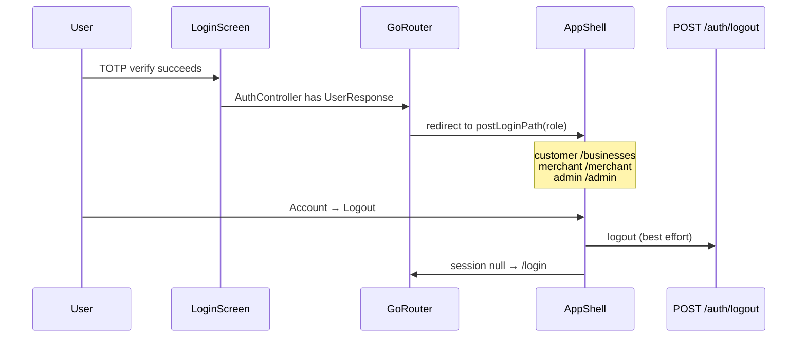

# Slice: S-027 — Mobile P0 chrome (shell, role-aware home, account/logout)

| Field | Value |
|-------|-------|
| **Slice ID** | S-027 |
| **Phase** | 1 Foundation |
| **Status** | Accepted |
| **Role(s)** | customer \| merchant \| admin |
| **Owner** | PM / 2026-08-13 |

---

## User story

**As a** mobile user (guest, customer, merchant, or admin)  
**I want** a persistent primary shell with role-aware landing, an Account screen, and an obvious Logout  
**So that** I can move between Explore / Favorites / Notifications / Account the way I use the web navbar, instead of hunting for icons only on the business list

---

## Acceptance criteria

1. **Given** I am logged in as a **customer**, **when** I am on a primary shell route, **then** I see a bottom navigation bar with **Explore**, **Favorites**, **Notifications**, and **Account** (and I do not see a Merchant or Admin Home tab).
2. **Given** I am logged in as a **merchant**, **when** I am on a primary shell route, **then** I see a bottom navigation bar with **Home**, **Explore**, **Notifications**, and **Account**, and I do **not** see a Favorites tab (favorites remain customer-only, matching S-024).
3. **Given** I am logged in as an **admin**, **when** I am on a primary shell route, **then** I see a bottom navigation bar with **Home**, **Explore**, **Notifications**, and **Account**, and I do **not** see a Favorites tab.
4. **Given** I am **not** logged in and I am browsing businesses, **when** the shell is shown, **then** I see **Explore** and **Sign in** only — no Favorites tab, no Notifications tab, and no Logout control.
5. **Given** I finish login (or restore a session while on `/login`) as a **customer**, **when** redirect runs, **then** I land on Explore (`/businesses`), not a merchant/admin home.
6. **Given** I finish login (or restore a session while on `/login`) as a **merchant**, **when** redirect runs, **then** I land on Merchant home (`/merchant`), not Explore.
7. **Given** I finish login (or restore a session while on `/login`) as an **admin**, **when** redirect runs, **then** I land on Admin home (`/admin`), not Explore.
8. **Given** I am logged in, **when** I open Account, **then** I see my full name, email, a **Profile** link, and a **Logout** action.
9. **Given** I tap **Logout** on Account, **when** logout completes, **then** my session is cleared and I am on the login screen (no authenticated shell / Account identity).
10. **Given** I am a guest on Explore, **when** I tap **Sign in** in the bottom nav, **then** I am taken to the login screen.
11. **Given** I am logged in and have unread notifications, **when** the shell is visible, **then** the Notifications destination shows an unread-count badge; **when** the unread count is 0, **then** the badge is hidden. The 30s unread poll from S-025 continues to run while the shell is mounted.
12. **Given** I am logged in on Account, **when** I tap the **MerchantHub AI** brand/home control, **then** I am taken to Explore (`/businesses`).
13. **Given** I am on login or a business detail screen, **when** the screen is shown, **then** the bottom navigation bar is **not** visible (those routes stay full-screen, matching today’s push-to-detail / login UX).
14. **Given** I am a merchant or admin on my role Home, **when** the screen loads, **then** I see a clear placeholder that full dashboard / admin tools remain on the web (P4 / `future` rows M-50–M-60) — **no** AI insights, stats charts, or moderation queues in this slice. If any future copy mentioned AI, it would have to be labeled a **suggestion**; this slice must not show AI output at all.
15. **Given** I am on Explore as a logged-in user, **when** I look at the app bar, **then** I do **not** see the old list-only Logout / Favorites / Notifications icon actions (those entry points now live in the shell so Logout is not easy to miss).
16. **Given** I tap **Profile** on Account, **when** the profile screen opens, **then** I see my name, email, and role as read-only text (no edit form fields). Profile **edit** remains M-48 / P2.
9. **Given** I tap **Logout** on Account, **when** logout completes, **then** my session is cleared and I am on the login screen (no authenticated shell / Account identity).
10. **Given** I am a guest on Explore, **when** I tap **Sign in** in the bottom nav, **then** I am taken to the login screen.
11. **Given** I am logged in and have unread notifications, **when** the shell is visible, **then** the Notifications destination shows an unread-count badge; **when** the unread count is 0, **then** the badge is hidden. The 30s unread poll from S-025 continues to run while the shell is mounted.
12. **Given** I am logged in on Account, **when** I tap the **MerchantHub AI** brand/home control, **then** I am taken to Explore (`/businesses`).
13. **Given** I am on login or a business detail screen, **when** the screen is shown, **then** the bottom navigation bar is **not** visible (those routes stay full-screen, matching today’s push-to-detail / login UX).
14. **Given** I am a merchant or admin on my role Home, **when** the screen loads, **then** I see a clear placeholder that full dashboard / admin tools remain on the web (P4 / `future` rows M-50–M-60) — **no** AI insights, stats charts, or moderation queues in this slice. If any future copy mentioned AI, it would have to be labeled a **suggestion**; this slice must not show AI output at all.
15. **Given** I am on Explore as a logged-in user, **when** I look at the app bar, **then** I do **not** see the old list-only Logout / Favorites / Notifications icon actions (those entry points now live in the shell so Logout is not easy to miss).

---

## UX notes

- **Screens / routes:** Persistent bottom nav wrapping Explore (`/businesses`), Favorites (`/favorites`, customer), Notifications (`/notifications`), Account (`/account`), read-only Profile (`/account/profile`), Merchant home (`/merchant`), Admin home (`/admin`). Login (`/login`) and business detail (`/businesses/:slug`) stay outside the shell.
- **Native navigation:** `NavigationBar` + `go_router` `ShellRoute` (one child at a time, so guest Explore does not mount Favorites/Notifications). Detail remains a standard push (no tabs on the review screen).
- **Brand / home:** Account footer control labeled `MerchantHub AI` that goes to Explore. Explore app bar title stays `Businesses` (existing list language / emulator smoke).
- **Account:** Identity summary, **Profile** link to a read-only name/email/role screen, and Logout. Not a profile editor (M-48).
- **Role Home:** Short explanation + identity; CTA can point people to Explore. No merchant/admin product tools.
- **Guest:** Explore + Sign in. Sign in goes to `/login`. ADR-003 “Continue without signing in” on LoginScreen stays.
- **Empty states / errors:** Existing list/notifications/favorites empty/error states unchanged.
- **AI disclaimer required?** No AI UI in this slice. Do not add dashboard AI insights here.

---

## Out of scope

- P1 discovery (home marketing, search, filters, location, map, photos, rich business detail) — M-13–M-32 except already-implemented detail basics.
- P2 register, Google sign-in, profile/settings **edit** (M-04, M-05, M-48). M-49 in this slice is Account + Profile **link** + read-only profile + logout.
- P3 review like / report / merchant reply display.
- P4 merchant dashboard, AI insights, replies, business editor, admin queues (M-50–M-60 stay `future`).
- Changing ADR-003 public carve-out or `initialLocation: '/login'`.
- FCM push (M-47).
- Web navbar/footer changes.

---

## Dependencies

- S-018 Secure logout (web) — **Accepted**; mobile already calls `POST /auth/logout` — this slice relocates the control.
- S-023 / S-024 / S-025 — **Accepted**; shell re-homes their entry points.
- ADR-003 public business browsing — remains in force; ADR-005 records the shell decision.

---

## Definition of done (PM)

- [x] All AC verified in test report
- [x] Bottom nav + Account logout + role landing work for customer / merchant / admin / guest
- [x] `README.md` §12 Web ↔ mobile parity tracker P0 rows updated; §12 Mobile client paragraph mentions the shell
- [x] PM Status set to **Accepted**

---

## Technical specification (Architect)

> Filled by Architect before implementation.

### API contract

No new backend endpoints. Reuse existing auth + notifications APIs.

| Method | Path | Auth | Request | Response |
|--------|------|------|---------|----------|
| GET | `/api/v1/auth/me` | Bearer | — | `UserResponse` (already used by `AuthController`) |
| POST | `/api/v1/auth/logout` | Bearer | `LogoutRequest` `{ refresh_token }` | `MessageResponse` (best-effort; local clear always) |
| GET | `/api/v1/notifications` | Bearer | `unread_only` | Used by existing `unreadCountProvider` poll |

Errors: 401 already handled by `AuthInterceptor`. No new error branches.

### RBAC matrix

| Action | customer | merchant | admin | anonymous |
|--------|----------|----------|-------|-----------|
| See Explore tab / `/businesses` | Yes | Yes | Yes | Yes (ADR-003) |
| See Favorites tab / `/favorites` | Yes | No (redirect to `postLoginPath`) | No | No → `/login` |
| See Notifications tab / `/notifications` | Yes | Yes | Yes | No → `/login` |
| See Account / `/account` | Yes | Yes | Yes | No → `/login` |
| See Profile / `/account/profile` (read-only) | Yes | Yes | Yes | No → `/login` |
| See Merchant Home / `/merchant` | No | Yes (post-login landing) | No | No → `/login` |
| See Admin Home / `/admin` | No | No | Yes (post-login landing) | No → `/login` |
| Guest Sign in dest. → `/login` | — | — | — | Yes |
| Logout | Yes | Yes | Yes | N/A |
| Unread badge + 30s poll | Yes | Yes | Yes | No (S-025 AC8) |

### Data model impact

- [x] None  [ ] Extend existing  [ ] New table(s)

**Details:** Client-only navigation. `UserResponse.role` already on `/auth/me`.

### Cache / side effects

- Logout already clears secure token storage and `AuthController` state; GoRouter `refreshListenable` sends the user to `/login`.
- Move `unreadCountProvider` watch from `BusinessListScreen` to `AppShell` so the 30s poll runs on every tab, not only Explore.
- No Redis / search cache impact.

### Frontend (mobile)

- **Route:** Shell branches `/businesses`, `/favorites`, `/notifications`, `/account` (+ `/account/profile`), `/merchant`, `/admin`. Full-screen (root navigator): `/login`, `/businesses/:slug`.
- **Rendering:** Flutter CSR (`go_router` + Riverpod).
- **Components:**
  - `lib/features/shell/app_shell.dart` — `NavigationBar` + role-specific destinations
  - `lib/features/auth/post_login_path.dart` — pure `postLoginPath(UserRole?)`
  - `lib/features/account/account_screen.dart`
  - `lib/features/account/profile_screen.dart` — read-only name/email/role
  - `lib/features/account/role_home_screen.dart` — merchant/admin placeholders
  - `lib/router.dart` — `ShellRoute` + `AppShell`; redirect uses `postLoginPath`
- **Web:** unchanged.

### Flow

### Architect checklist

- [x] API contract defined
- [x] RBAC matrix complete
- [x] Data model impact documented
- [x] Cache invalidation considered
- [x] Uses AI/storage abstractions where applicable (N/A — no AI/storage in this slice)
- [x] ERD/API/FLOWS updates noted (README §12 tracker + Mobile client; no §7 API change)
- [x] No secrets in design

### Risks / tradeoffs

- **Role Home is not web dashboard.** Tracker M-09 → `partial` until P4. Avoid implying merchant/admin tools shipped.
- **`ShellRoute` not `indexedStack`.** An indexed stack would mount Favorites/Notifications under a guest Explore session and hit 401s. Losing per-tab scroll is an acceptable P0 tradeoff.
- **Detail outside the shell** means users lose tabs on a business page (same as today: it was never a tab). Re-adding tabs on detail would crowd the review form (AC13).
- **Guest Sign in is not a shell branch** (`/login` is outside). Tapping Sign in uses `context.go('/login')`.

---

## Links

- Test plan: `docs/agents/test-plans/TP-S-027-mobile-p0-chrome.md`
- Test report: `docs/agents/test-reports/TR-S-027-mobile-p0-chrome.md`
- ADR: `docs/agents/adrs/ADR-005-mobile-primary-shell.md`

---

## Changelog

| Date | Agent | Change |
|------|-------|--------|
| 2026-08-13 | PM | Created slice for README §12 P0 chrome (M-06, M-09, M-10, M-11, M-12, M-49 logout; re-home M-43/M-44) |
| 2026-08-13 | Architect | Technical spec + ADR-005; Status Specified |
| 2026-08-13 | Builder | Shell, role homes, Account + read-only Profile, tracker updates |
| 2026-08-13 | Tester | TP/TR; 16/16 AC pass; recommend Ship |
| 2026-08-13 | PM | Status Accepted |
