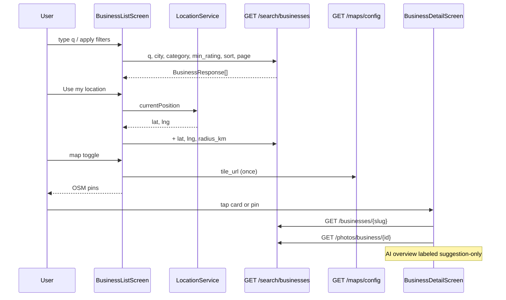

# Slice: S-028 — Mobile P1 discovery + rich business detail

| Field | Value |
|-------|-------|
| **Slice ID** | S-028 |
| **Phase** | 2 Core |
| **Status** | In Progress |
| **Role(s)** | customer \| merchant \| admin (public browse) |
| **Owner** | PM / 2026-08-13 |

---

## User story

**As a** visitor or signed-in user on the Flutter app  
**I want** to search, filter, and map local businesses, then open a rich profile (contact, hours, photos, map pin, AI overview)  
**So that** discovery on mobile is closer to the Next.js `/search` and `/businesses/[slug]` experience, without leaving Explore for a separate marketing home

---

## Acceptance criteria

1. **Given** I am on Explore (`/businesses`), **when** I type a search query into the search field, **then** results refresh from `GET /api/v1/search/businesses` with `q` set to that text (after a short debounce).
2. **Given** I have an active search query, **when** I clear the search field, **then** results return to the unfiltered default list (`q` omitted / empty).
3. **Given** I open Filters, **when** I apply city, category (slug), minimum rating, and sort (`rating` \| `name` \| `reviews`), **then** the list is re-fetched with those query params (page resets to 1).
4. **Given** I open Filters, **when** the sheet renders, **then** the category control is populated from `GET /api/v1/businesses/categories/all` and the city control from `GET /api/v1/businesses/cities` (not a hardcoded list).
5. **Given** location permission is granted, **when** I tap **Use my location**, **then** the next search includes `lat`, `lng`, and `radius_km` (default 10 if I have not chosen another radius).
6. **Given** location permission is denied or the fix fails, **when** I tap **Use my location**, **then** I see an error message and the search is **not** geo-filtered.
7. **Given** my location is active, **when** I change radius in Filters and apply, **then** `radius_km` is sent on the next search.
8. **Given** the current result set includes at least one business with latitude and longitude, **when** I switch to map view, **then** I see an OpenStreetMap results map with pins for those businesses (not Google Maps).
9. **Given** the results map is showing, **when** I tap a pin, **then** I am taken to that business’s detail screen (`/businesses/:slug`).
10. **Given** the first page of results is full (`page_size` items), **when** I scroll to the end of the list, **then** page 2 is requested and new rows are appended (infinite scroll). If a page returns fewer than `page_size` items, no further page is requested.
11. **Given** a business has `storefront_url` or `logo_url`, **when** its card renders on Explore (or Favorites, which reuses the card), **then** that photo is shown. **Given** it has neither, **then** a non-broken placeholder is shown (never a blank crash).
12. **Given** I am **not** logged in on Explore, **when** the screen is shown, **then** I still see search chrome (search field, Filters, Use my location, map toggle) — guest browse is not a bare unfiltered list. Bottom nav remains Explore + Sign in (S-027); this slice does not rewrite `AppShell`.
13. **Given** a business has description, address, phone, and/or website, **when** I open its detail screen, **then** each present field is shown (phone as a dial action, website as an external link). **Given** a field is missing, **then** that row is omitted (no "null" / "undefined" text).
14. **Given** a business has one or more categories, **when** I view detail, **then** every category name is shown (not only the first). **Given** it has zero, **then** no empty category row is shown.
15. **Given** a business has usable `business_hours` entries, **when** I view detail, **then** each key/value is shown (e.g. "mon-fri: 7am-6pm"). **Given** hours are null, empty, or only empty values, **then** I see "Hours not listed" (or the hours block is omitted) — never a crash or the literal "null".
16. **Given** a business has gallery photos from `GET /api/v1/photos/business/{id}` (or storefront/logo fallback), **when** I view detail, **then** I see a photo gallery. **When** I tap a photo, **then** a full-screen lightbox opens. **Given** there are no photos, **then** the gallery is omitted.
17. **Given** a business has latitude and longitude, **when** I view detail, **then** an OpenStreetMap pin is shown at that point. **Given** either coordinate is missing, **then** the map block is omitted (no geocode-on-open; that stays a merchant-form web action).
18. **Given** a business has `ai_merchant_summary`, **when** I view detail, **then** the text is shown and clearly labeled as an AI **suggestion** (not a verdict or verified fact), e.g. "AI overview (suggestion):". **Given** the summary is null/empty, **then** the AI block is omitted entirely.
19. **Given** the search request fails, **when** Explore loads, **then** I see an inline error with Retry (not a blank crash).
20. **Given** search returns zero businesses, **when** Explore shows results, **then** I see an empty-state message (e.g. "No businesses found").
21. **Given** I am on login or a business detail screen, **when** the screen is shown, **then** the bottom navigation bar is **not** visible (S-027 AC13 unchanged).

---

## UX notes

- **Screens / routes:** Keep existing Explore (`/businesses`) and full-screen detail (`/businesses/:slug`). Do **not** rewrite `AppShell` or the tab list. Search chrome lives on Explore (web’s `/search` capability, not a cloned `/` marketing home).
- **Components to reuse:** `BusinessCard` (add photo), existing `FavoriteToggleButton`, `ReviewCard` / add-review gating from S-023. New small presentational pieces: photo gallery, hours, category chips, OSM map view.
- **Empty states / errors:** Search error + Retry; empty list copy; location failure snackbar/message; omit optional detail blocks when data is absent.
- **AI disclaimer required?** Yes — detail AI overview must use **suggestion** language (AC18). Review-card AI labels from S-023 stay as-is.
- **App bar title:** Stay `Businesses` so the emulator smoke (`find.text('Businesses')`) still passes.

---

## Out of scope

- M-13–M-18 home marketing (hero, trust metrics, city/category indexes, featured grid, voices / how-it-works / merchant CTA) — remain `unimplemented` unless a tiny extra fits; none planned.
- P2: register, Google sign-in, profile/settings **edit** (M-04, M-05, M-48).
- P3: review like / report / show merchant reply (M-37–M-39).
- P4 merchant/admin dashboards (M-50–M-60).
- New backend endpoints (reuse `/search/businesses`, `/businesses/{slug}`, `/businesses/cities`, `/businesses/categories/all`, `/photos/business/{id}`, `/maps/config`).
- Rewriting `AppShell` / tab destinations (ADR-005).
- Geocoding on detail open (`GET /maps/geocode` stays unused here; pins use stored lat/lng).
- Sentiment search filter (web FilterPanel does not expose it either).

---

## Dependencies

- S-027 Mobile P0 chrome — **Accepted** (Explore tab, public `/businesses`, full-screen detail).
- S-023 Mobile reviews — **Accepted** (detail reviews + add-review gating stay).
- S-013 / S-012 web search + detail enrichment — **Accepted** (behavior reference).
- ADR-003 public business browsing — remains in force.
- ADR-005 primary shell — do not reopen; this slice only appends chrome **inside** Explore and richness **inside** detail.

---

## Definition of done (PM)

- [ ] All AC verified in test report (widget/unit tests authored; combined `flutter analyze && flutter test` deferred until P2 lands)
- [ ] Search chrome + rich detail match UX notes; AI overview labeled as suggestion
- [x] `README.md` §12 tracker rows M-19–M-25 and M-27–M-32 updated; M-13–M-18 left unimplemented
- [ ] PM Status set to **Accepted**

---

## Technical specification (Architect)

> Filled by Architect before implementation.

### API contract

No new backend endpoints. Reuse existing public REST.

| Method | Path | Auth | Request | Response |
|--------|------|------|---------|----------|
| GET | `/api/v1/search/businesses` | Public | `q`, `city`, `category` (slug), `min_rating`, `lat`, `lng`, `radius_km` (default 10), `page`, `page_size` (20), `sort` (`rating` \| `name` \| `reviews`) | `BusinessResponse[]` (Redis-cached; length `< page_size` ⇒ last page) |
| GET | `/api/v1/businesses/cities` | Public | — | `string[]` distinct approved cities |
| GET | `/api/v1/businesses/categories/all` | Public | — | `CategoryResponse[]` |
| GET | `/api/v1/businesses/{slug}` | Public | — | `BusinessResponse` (description, address, phone, website, hours, categories, lat/lng, `ai_merchant_summary`, storefront/logo URLs) |
| GET | `/api/v1/photos/business/{business_id}` | Public | — | `PhotoResponse[]` (`url`, caption) |
| GET | `/api/v1/maps/config` | Public | — | `{ provider: osm, tile_url, attribution }` — tile template for Flutter OSM |

Errors: existing `ApiException` / Retry. 401 already handled by interceptor; these routes are public. Empty generated-client query strings remain tolerated by search’s `_blank_to_none` (no backend change).

**Not called in this slice:** `POST /maps/nearby` (search already accepts lat/lng/radius), `GET /maps/geocode` (detail uses stored coordinates only).

### RBAC matrix

| Action | customer | merchant | admin | anonymous |
|--------|----------|----------|-------|-----------|
| Search / filter / map on Explore | Yes | Yes | Yes | Yes (ADR-003) |
| Use my location (device GPS → query params) | Yes | Yes | Yes | Yes |
| Open business detail (rich profile) | Yes | Yes | Yes | Yes |
| Favorite from card / detail | Yes (S-024) | Hidden / no-op as today | Hidden / no-op | Hidden / sign-in (existing) |
| Add review | Existing S-023 rules | Existing | Existing | Button → `/login` |
| Rewrite AppShell tabs | — | — | — | — (forbidden this slice) |

### Data model impact

- [x] None  [ ] Extend existing  [ ] New table(s)

**Details:** Client-only. `BusinessResponse` already carries contact, hours, categories, coordinates, AI summary, photo URLs.

### Cache / side effects

- Search remains Redis-cached server-side (`search:*`). Mobile does not invalidate cache (read-only).
- Maps config fetched once per app session (Riverpod); fall back to OSM.org tiles if the call fails.
- Device location is **not** persisted; it is query state only.
- OSM tile requests go to the configured tile URL; send a real User-Agent via `userAgentPackageName` (Nominatim/OSM policy). No API keys.

### Frontend (mobile)

- **Route:** Unchanged. Explore `/businesses` (shell); detail `/businesses/:slug` (root navigator, no bottom nav). No new GoRouter paths required.
- **Rendering:** Flutter CSR (`go_router` + Riverpod).
- **Components:**
  - `SearchQuery` + `SearchController` — debounce `q`, filters, geo, infinite scroll (`page` / `page_size=20`)
  - `BusinessListScreen` — search chrome on Explore; list **or** OSM results map toggle
  - `BusinessCard` — storefront/logo (or placeholder) + existing rating / favorite
  - `OsmMapView` — `flutter_map` + OSM tiles from `/maps/config`
  - `LocationService` — `geolocator` behind a provider (fakeable in tests)
  - Detail: hours, category chips, photo gallery + lightbox, OSM pin, AI overview labeled suggestion-only; `url_launcher` for tel / website
- **Web:** unchanged.
- **Permissions:** Android `ACCESS_COARSE_LOCATION` / `ACCESS_FINE_LOCATION`. Guest location is a device permission, not an auth gate.

### Flow

### Architect checklist

- [x] API contract defined
- [x] RBAC matrix complete
- [x] Data model impact documented
- [x] Cache invalidation considered (read-only search cache)
- [x] Uses AI/storage abstractions where applicable (AI text is display-only; OSM via `/maps/config`; storage URLs as returned)
- [x] ERD/API/FLOWS updates noted (README §12 tracker + Mobile client; no §7 API change)
- [x] No secrets in design

### Risks / tradeoffs

- **No marketing home (M-13–M-18).** Explore is the discovery surface. Document as remaining `unimplemented`.
- **`flutter_map` vs Google Maps.** Required OSM parity with web Leaflet; ADR-006.
- **Infinite scroll vs numbered pages.** Mobile-appropriate; same `page`/`page_size` contract as web.
- **GPS on web-server dev loop.** `geolocator` works in the browser; widget tests use a fake `LocationService` so CI never hits a plugin.
- **Generated search client sends empty optional query params.** Already handled backend-side; do not “fix” by regenerating the client in this slice.
- **Detail map omitted without coordinates.** Matches web (no geocode on profile view).

---

## Links

- Test plan: `docs/agents/test-plans/TP-S-028-mobile-p1-discovery.md`
- Test report: `docs/agents/test-reports/TR-S-028-mobile-p1-discovery.md`
- ADR: `docs/agents/adrs/ADR-006-mobile-osm-flutter-map.md`

---

## Changelog

| Date | Agent | Change |
|------|-------|--------|
| 2026-08-13 | PM | Created slice for README §12 P1 discovery + rich detail (M-19–M-25, M-27–M-32) |
| 2026-08-13 | Architect | Technical spec + ADR-006; Status Specified |
| 2026-08-13 | Builder | Explore search chrome + rich detail; tracker M-19–M-25, M-27–M-32; Status In Progress |
| 2026-08-13 | Tester | TP authored; TR maps AC → tests; execution deferred to combined P1+P2 run |
