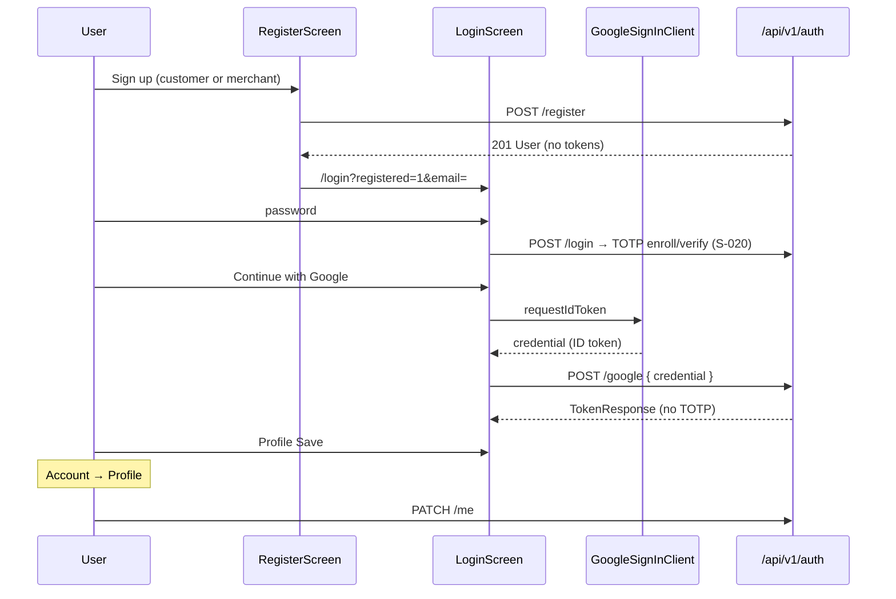

# Slice: S-029 — Mobile P2 auth/account (register, Google, profile edit)

| Field | Value |
|-------|-------|
| **Slice ID** | S-029 |
| **Phase** | 1 Foundation |
| **Status** | Testing |
| **Role(s)** | customer \| merchant \| admin |
| **Owner** | PM / 2026-08-13 |

---

## User story

**As a** mobile user (guest, customer, merchant, or admin)  
**I want** to create an account (customer or merchant), sign in with Google/Gmail, and edit my profile  
**So that** the Flutter app matches web auth/account parity (`/register`, `GoogleSignInButton`, `/profile` edit) instead of being login-only with a read-only profile

---

## Acceptance criteria

1. **Given** I am a guest on Register, **when** I submit a valid form with role **customer**, **then** `POST /auth/register` creates the account and I land on Login with a success note and my email prefilled — **no** session tokens yet (password accounts must enroll TOTP on first login, matching web `RegisterForm`).
2. **Given** I am a guest on Register, **when** I submit a valid form with role **merchant**, **then** the account is created as merchant and I land on Login the same way (then MFA enroll like web).
3. **Given** I am on Register, **when** I look at the role control, **then** I can choose **customer** or **merchant** only — **admin** is not offered (public self-register as admin is forbidden).
4. **Given** that email is already registered, **when** I submit Register, **then** I see an error and stay on Register (no login redirect).
5. **Given** I enter an invalid email or a password shorter than 8 characters, **when** I tap Sign up, **then** client-side validation blocks the request.
6. **Given** I just registered and am on Login with the registered note, **when** I sign in with that password, **then** I enter the existing LoginScreen TOTP enroll/verify flow (S-020) — this slice does not invent a second MFA UI.
7. **Given** I am on Login (credentials step), **when** I tap **Create account**, **then** I go to Register (`/register`).
8. **Given** I am on Register, **when** I tap **Sign in**, **then** I go to Login (`/login`).
9. **Given** `GOOGLE_CLIENT_ID` is configured (same value as web `NEXT_PUBLIC_GOOGLE_CLIENT_ID` / backend `GOOGLE_CLIENT_ID`), **when** I complete Google sign-in on Login, **then** the app `POST /auth/google` with the ID-token `credential`, receives session tokens **without** TOTP, and I land on `postLoginPath(role)`.
10. **Given** Google is configured, **when** I complete Google sign-in on Register, **then** I get a session the same way (new Google accounts are **customer**, matching web/backend — there is no merchant-role choice on the Google path).
11. **Given** `GOOGLE_CLIENT_ID` is empty, **when** Login or Register is shown, **then** the Google button is **not** visible (match web `GoogleSignInButton` returning null).
12. **Given** I dismiss the Google picker, **when** I return to Login/Register, **then** I stay signed out and am not shown a failure for cancel.
13. **Given** I am logged in as **customer**, **merchant**, or **admin**, **when** I open Profile from Account, **then** I see an edit form for display name, phone, avatar URL, address, and national ID, with **email** and **role** read-only (email-change note). Favorites stay on the Favorites tab (M-43) — not duplicated here.
14. **Given** I change my display name and tap Save, **when** `PATCH /auth/me` succeeds, **then** the form shows the new values and a brief success confirmation; Account identity reflects the new name.
15. **Given** I tap Save, **when** the request fails, **then** I see an error and my unsaved input is preserved.
16. **Given** I am a **guest**, **when** I open `/account/profile`, **then** I am redirected to Login (auth-gated, same as S-027).
17. **Given** I am on Profile, **when** I look at email and role, **then** those values are not editable fields (no `TextField` for email/role).
18. **Given** I am on Login credentials (or Register), **when** Google is shown, **then** copy states that Gmail/Google skips the authenticator step.
19. **Given** I am logged in on Account, **when** I tap Logout, **then** my session is cleared and I am on Login (M-49 regression; S-027 already implemented — do not remove).
20. **Given** I am on Register or Login, **when** the screen is shown, **then** the bottom navigation bar is **not** visible (full-screen, matching Login today). Do **not** rewrite `AppShell`.

---

## UX notes

- **Screens / routes:** Register `/register` (full-screen, outside the shell). Login `/login` gains Create account + Google. Profile `/account/profile` upgrades from read-only to the web `ProfilePage` edit form (minus the favorites grid — that is M-43 `/favorites`).
- **Components to reuse:** LoginScreen MFA steps unchanged. Shared Google button on Login and Register. Existing Account screen + logout.
- **Empty states / errors:** Inline error on register/Google/profile save. Duplicate-email 409 surfaces the API `detail`. Google cancel is silent.
- **AI disclaimer required?** no

---

## Out of scope

- P1 discovery (search, filters, map, gallery, rich detail) — another parallel agent.
- P3 like / report / merchant reply.
- P4 merchant dashboard / admin queues (M-50–M-60 stay `future`).
- Rewriting `AppShell` or changing ADR-005 tab sets.
- Changing backend auth APIs or regenerating the OpenAPI client (existing register / google / `PATCH /auth/me` already match).
- Admin self-registration, email change, password change, avatar file upload, KYC verification of national ID.
- FCM (M-47).

---

## Dependencies

- S-020 Mandatory TOTP password — **Accepted**; LoginScreen MFA reused after register.
- S-027 Mobile P0 chrome — **Accepted**; Account, logout, read-only Profile exist; this slice upgrades Profile.
- Web `RegisterForm` / `GoogleSignInButton` / `ProfilePage` — behavior to match.

---

## Definition of done (PM)

- [ ] All AC verified in test report
- [x] Register + Google + profile edit implemented for the roles above; logout still works
- [x] `README.md` §12 tracker M-04, M-05, M-48 updated (`implemented`); M-49 stays `implemented`
- [ ] PM Status set to **Accepted**

---

## Technical specification (Architect)

> Filled by Architect before implementation.

### API contract

No new backend endpoints. No OpenAPI regen. Reuse existing `/api/v1` auth APIs already in `merchanthub_api`.

| Method | Path | Auth | Request | Response |
|--------|------|------|---------|----------|
| POST | `/api/v1/auth/register` | Public | `UserRegister` `{ email, full_name, password, role: customer\|merchant }` | `201 UserResponse` — **no tokens** |
| POST | `/api/v1/auth/login` | Public | existing | existing MFA `LoginResult` (unchanged) |
| POST | `/api/v1/auth/mfa/totp/setup` \| `/confirm` \| `/verify` | MFA token | existing | existing (post-register first login) |
| POST | `/api/v1/auth/google` | Public | `GoogleAuthRequest` `{ credential }` (Google ID token) | `200 TokenResponse` — **no TOTP** |
| GET | `/api/v1/auth/me` | Bearer | — | `UserResponse` |
| PATCH | `/api/v1/auth/me` | Bearer | `UserProfileUpdate` (name, avatar, phone, address, national ID). `email` / `role` / `is_active` / TOTP omitted | `200 UserResponse` |
| POST | `/api/v1/auth/logout` | Bearer | existing | existing (M-49) |

Errors (existing): register `409` email taken, `403` admin self-register, `429` rate limit; Google `401` invalid token, `403` email exists but not Google-linkable / inactive; profile `401` unauthenticated.

### RBAC matrix

| Action | customer | merchant | admin | anonymous |
|--------|----------|----------|-------|-----------|
| Open `/register` | Redirect `postLoginPath` | same | same | Yes |
| Register as customer / merchant | — | — | — | Yes |
| Register as admin (UI) | — | — | — | No (not in dropdown) |
| Google sign-in / sign-up | Yes (session) | Yes if existing Google-linked merchant | Yes if existing | Yes → session; **new** Google users are **customer** |
| TOTP after Google | No | No | No | N/A |
| Open `/account/profile` | Yes | Yes | Yes | No → `/login` |
| PATCH `/auth/me` own profile | Yes | Yes | Yes | 401 |
| Change own email / role via form | No | No | No | — |
| Logout (M-49) | Yes | Yes | Yes | N/A |

### Data model impact

- [x] None  [ ] Extend existing  [ ] New table(s)

**Details:** Client-only. Backend `User` / `UserProfileUpdate` / Google customer-default already exist.

### Cache / side effects

- Register does **not** write tokens (web parity).
- Google `TokenResponse` is saved via existing `TokenStorage.save`, then `GET /auth/me` hydrates `AuthController` — same as TOTP confirm.
- Profile PATCH updates `AuthController` so Account identity refreshes.
- No Redis / search cache impact.
- Google button hidden when `--dart-define=GOOGLE_CLIENT_ID=` is empty, matching web `NEXT_PUBLIC_GOOGLE_CLIENT_ID`.

### Frontend (mobile)

- **Route:** `/register` full-screen (root navigator, beside `/login`). `/account/profile` stays a shell child.
- **Rendering:** Flutter CSR (`go_router` + Riverpod).
- **Components:**
  - `lib/features/auth/register_screen.dart` — name, email, password, role dropdown, Google, Sign in link
  - `lib/features/auth/google_sign_in_button.dart` + `google_sign_in_client.dart` — plugin behind a Riverpod port so tests fake the ID token
  - `lib/features/auth/login_screen.dart` — Create account + Google; query `registered=1` & `email=`
  - `lib/features/auth/auth_repository.dart` / `auth_provider.dart` — `register`, `loginWithGoogle`, `updateMe`
  - `lib/features/account/profile_screen.dart` — upgrade to edit form (web `ProfilePage` fields minus favorites list)
  - `lib/core/config/app_config.dart` — `GOOGLE_CLIENT_ID` dart-define
  - `lib/router.dart` — public `/register`; logged-in `/register` → `postLoginPath`
- **Web:** unchanged.
- **AppShell:** do not rewrite. Register stays outside the shell like Login.

### Flow

### Architect checklist

- [x] API contract defined
- [x] RBAC matrix complete
- [x] Data model impact documented
- [x] Cache invalidation considered
- [x] Uses AI/storage abstractions where applicable (N/A — no AI/storage)
- [x] ERD/API/FLOWS updates noted (README §12 tracker + Mobile client; no §7 API change)
- [x] No secrets in design (`GOOGLE_CLIENT_ID` via dart-define, never committed)

### Risks / tradeoffs

- **Android native Google** needs a Play/Android OAuth client (package + SHA-1) **and** the same **Web** client ID as `serverClientId` so the ID token `aud` matches backend `GOOGLE_CLIENT_ID`. Flutter web-server uses that Web client ID (GIS), same as Next.js. Document in README §12 / §15; do not invent a second backend audience.
- **New Google users are always customer** — product constraint from the backend, not a mobile bug. Merchant Google is only for an already-linked merchant account.
- **Profile does not embed Favorites** — web `ProfilePage` does; mobile already has M-43 `/favorites`. Duplicating it would fight the shell.
- **google_sign_in plugin** is wrapped so widget tests never hit the real SDK.

---

## Links

- Test plan: `docs/agents/test-plans/TP-S-029-mobile-p2-auth-account.md`
- Test report: `docs/agents/test-reports/TR-S-029-mobile-p2-auth-account.md`
- ADR: none (reuses existing auth APIs; no new integration pattern beyond the web Google ID-token flow)

---

## Changelog

| Date | Agent | Change |
|------|-------|--------|
| 2026-08-13 | PM | Created slice for README §12 P2 (M-04, M-05, M-48; M-49 regression) |
| 2026-08-13 | Architect | Technical spec; Status Specified; no OpenAPI regen |
| 2026-08-13 | Builder | Register, Google, profile edit; README §12 tracker |
| 2026-08-13 | Tester | TP/TR; 20/20 AC mapped; execution deferred to combined P1+P2 verify |
