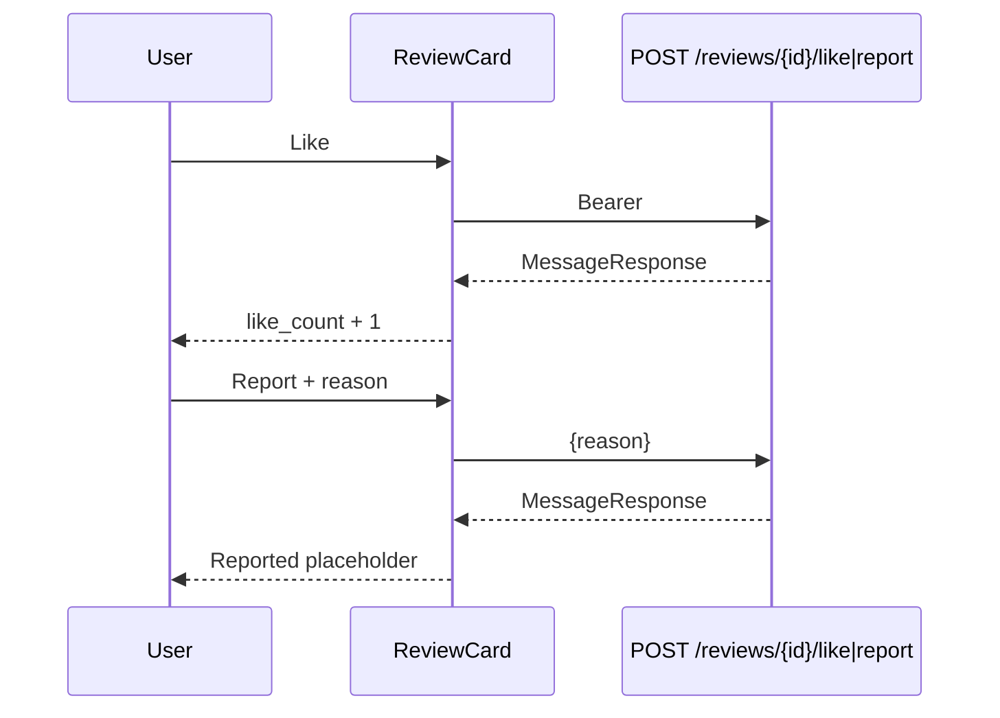

# Slice: S-030 — Mobile P3 review engagement (like, report, show merchant reply)

| Field | Value |
|-------|-------|
| **Slice ID** | S-030 |
| **Phase** | 2 Core |
| **Status** | In Progress |
| **Role(s)** | customer \| merchant \| admin (public browse + signed-in engagement) |
| **Owner** | PM / 2026-08-14 |

---

## User story

**As a** visitor or signed-in user on a business’s mobile detail screen  
**I want** to like or report a review and see the merchant’s public reply on the review card  
**So that** engagement matches the web `ReviewCard` (M-37, M-38, M-39), without editing/deleting reviews or composing a merchant reply here

---

## Acceptance criteria

1. **Given** a review is shown on business detail, **when** I am signed in, **then** I see a like control that displays the current `like_count`.
2. **Given** I am signed in, **when** I tap Like, **then** `POST /api/v1/reviews/{id}/like` is called and the displayed count increases by 1 if the like is new (idempotent likes must not keep inflating the count after a successful already-liked response — optimistic +1 on first tap this session is enough if the API succeeds).
3. **Given** I am a guest, **when** I tap Like, **then** I am taken to Login (no anonymous like).
4. **Given** I am signed in, **when** I tap Report, **then** I see a reason field (min 10 characters) with Submit and Cancel.
5. **Given** I submit a valid report, **when** `POST /api/v1/reviews/{id}/report` succeeds, **then** that card is replaced with copy that the review was reported and is pending moderation (matching web).
6. **Given** I am a guest, **when** I tap Report, **then** I am taken to Login.
7. **Given** a review has a merchant `reply`, **when** the card renders, **then** I see a “Response from the business” block with the reply body.
8. **Given** a review has no reply, **when** the card renders, **then** no reply block and **no** “Reply as business” composer (composer is P4 / M-53).
9. **Given** like or report fails (401/network), **when** the error returns, **then** I see an inline or snackbar error and the list does not crash.
10. **Given** I am on business detail, **when** the screen is shown, **then** bottom nav is still hidden (S-027 AC13).

---

## UX notes

- **Screens / routes:** Existing `/businesses/:slug` only. Reuse `ReviewCard`.
- **Components to reuse:** `ReviewCard` (S-023), `ReviewsController`.
- **Empty states / errors:** Report success replaces the card; like/report errors are non-fatal.
- **AI disclaimer required?** No new AI copy. Existing S-023 suggestion labels stay.

---

## Out of scope

- Review edit/delete (M-40, M-41 remain `n/a`).
- Merchant reply composer (M-53 / S-031).
- Merchant/admin dashboards (S-031).
- AppShell tab list rewrite.
- New backend endpoints.

---

## Dependencies

- S-023 Mobile reviews — **Accepted** (`ReviewCard` + list).
- S-028 Mobile P1 rich detail — **In Progress** (detail host).
- Web `ReviewCard` / `ReviewsList` — behavior to match.

---

## Definition of done (PM)

- [ ] All AC verified in test report (execution deferred; tests authored)
- [x] Like, report, and reply display on existing `ReviewCard`
- [x] `README.md` §12 tracker M-37, M-38, M-39 → `implemented`
- [ ] PM Status set to **Accepted**

---

## Technical specification (Architect)

> Filled by Architect before implementation.

### API contract

No new backend endpoints. No OpenAPI regen.

| Method | Path | Auth | Request | Response |
|--------|------|------|---------|----------|
| POST | `/api/v1/reviews/{review_id}/like` | Bearer | — | `MessageResponse` (idempotent) |
| POST | `/api/v1/reviews/{review_id}/report` | Bearer | `ReviewReportCreate` `{ reason }` (min 10) | `MessageResponse`; review status → reported |
| GET | `/api/v1/reviews/business/{business_id}` | Public | — | `ReviewResponse[]` including `like_count`, `reply` |

Errors: 401 unauthenticated; 404 unknown review. Guest like/report is a client redirect to `/login`, not an anonymous POST.

### RBAC matrix

| Action | customer | merchant | admin | anonymous |
|--------|----------|----------|-------|-----------|
| See like count + reply body | Yes | Yes | Yes | Yes |
| Like | Yes | Yes | Yes | No → `/login` |
| Report | Yes | Yes | Yes | No → `/login` |
| Reply composer on detail | No | No (P4 dashboard) | No | No |
| Edit/delete review | No | No | No | No |

### Data model impact

- [x] None  [ ] Extend existing  [ ] New table(s)

**Details:** Client-only. `ReviewResponse.like_count` and `ReviewResponse.reply` already exist.

### Cache / side effects

- Like: update in-memory `ReviewsController` list (`likeCount + 1` after success, or optimistic with revert on failure).
- Report: mark review id as reported in controller (or drop from list / replace with placeholder). Server sets `reported`.
- No Redis invalidation from mobile.

### Frontend (mobile)

- **Route:** Unchanged `/businesses/:slug` (root navigator, no bottom nav).
- **Rendering:** Flutter CSR.
- **Components:** Stateful `ReviewCard` actions (like, report form); reply display block. Callbacks into `ReviewsController`. `canReply` remains false here.

### Flow

### Architect checklist

- [x] API contract defined
- [x] RBAC matrix complete
- [x] Data model impact documented
- [x] Cache invalidation considered
- [x] Uses AI/storage abstractions where applicable (none new)
- [x] ERD/API/FLOWS updates noted (README §12 only)
- [x] No secrets in design

### Risks / tradeoffs

- Idempotent likes: first tap this session +1; do not +1 again locally if already liked this session.
- Reply composer stays off detail even for the owning merchant (M-53 is dashboard-only, matching web’s `canReply` on dashboard).

---

## Links

- Test plan: `docs/agents/test-plans/TP-S-030-mobile-p3-review-engagement.md`
- Test report: `docs/agents/test-reports/TR-S-030-mobile-p3-review-engagement.md`

---

## Changelog

| Date | Agent | Change |
|------|-------|--------|
| 2026-08-14 | PM | Created slice for M-37–M-39 |
| 2026-08-14 | Architect | Technical spec; Status Specified |
| 2026-08-14 | Builder | ReviewCard like/report/reply display |
