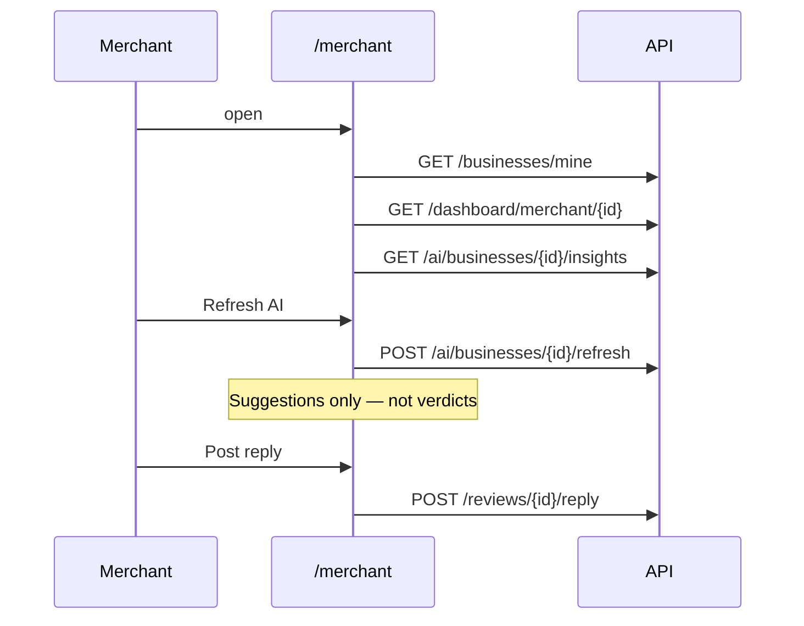

# Slice: S-031 — Mobile P4 merchant dashboard + admin queues

| Field | Value |
|-------|-------|
| **Slice ID** | S-031 |
| **Phase** | 4 Dashboards |
| **Status** | In Progress |
| **Role(s)** | merchant \| admin |
| **Owner** | PM / 2026-08-14 |

---

## User story

**As a** merchant (and, if it fits, an admin)  
**I want** a real Home on mobile instead of the S-027 web-placeholder stub  
**So that** I can pick among my businesses, see stats and AI suggestions, reply to reviews, and create/edit a listing — and admins can moderate pending businesses and reported reviews

---

## Acceptance criteria

### Merchant (M-50–M-54)

1. **Given** I am a merchant with one or more businesses, **when** I open Home (`/merchant`), **then** I see a dashboard for a selected business (default: first owned), not the S-027 “on the web for now” placeholder.
2. **Given** I own more than one business, **when** Home loads, **then** I can switch businesses; stats, sentiment, insights, and recent reviews refresh for the new selection.
3. **Given** I own zero businesses, **when** Home loads, **then** I see an empty state with a Create business action.
4. **Given** a business is selected, **when** dashboard data loads, **then** I see tiles for total reviews, average rating, and status (pending/approved/rejected/suspended labels).
5. **Given** I tap Total reviews, **when** the tap registers, **then** the screen scrolls to Recent reviews (empty copy if none).
6. **Given** I tap Average rating, **when** the tap registers, **then** the screen scrolls to Sentiment breakdown.
7. **Given** I tap Status, **when** status is approved, **then** I go to the public profile (`/businesses/:slug`); **when** it is not approved, **then** I go to edit (`/merchant/businesses/:id/edit`).
8. **Given** sentiment breakdown is present, **when** the dashboard renders, **then** positive/neutral/negative counts are shown (simple bars are enough; no new chart package required).
9. **Given** AI insights load, **when** they render, **then** copy states they are **suggestions only**, not definitive judgments, and I see summary / positives / complaints / suggested responses when present.
10. **Given** I tap Refresh AI insights, **when** `POST /ai/businesses/{id}/refresh` succeeds, **then** the panel updates. **When** it fails, **then** I see an error and prior insights remain.
11. **Given** a recent review has no reply, **when** I am the merchant, **then** I can open a reply composer (min 5 characters) and `POST /reviews/{id}/reply` attaches the reply on the card.
12. **Given** a recent review already has a reply, **when** the card renders, **then** the reply is shown and the composer is hidden (same as web).
13. **Given** I open Create business, **when** I submit valid name, address, and city, **then** `POST /businesses` creates it (pending) and I return to Home. **When** validation fails, **then** the request is not sent.
14. **Given** I open Edit business for an owned listing, **when** I save, **then** `PATCH /businesses/{id}` updates it and I return to Home (or stay with success copy).
15. **Given** a customer or admin opens `/merchant` or `/merchant/businesses/new`, **when** redirect runs, **then** they do not see the merchant dashboard (existing role gate, extended to nested paths).

### Admin (M-57–M-60) — in this slice if it fits

16. **Given** I am an admin, **when** I open Home (`/admin`), **then** I see platform stats (users, businesses, pending, reviews, reported) instead of the S-027 placeholder.
17. **Given** pending businesses exist, **when** I tap Approve or Suspend, **then** the matching `POST …/approve` or `POST …/suspend` runs and the row leaves the pending queue.
18. **Given** reported reviews exist, **when** I tap Hide, Restore, or Remove, **then** `POST /reviews/{id}/moderate?action=` runs and the row leaves the reported queue.
19. **Given** I tap Total businesses (or All businesses), **when** the screen opens, **then** I see businesses of every status (`GET /businesses/admin/all`).
20. **Given** I tap Total reviews (or All reviews), **when** the screen opens, **then** I see reviews across businesses (`GET /reviews/admin/all`).
21. **Given** I am not an admin, **when** I open `/admin` or `/admin/businesses`, **then** I am redirected away.

### Chrome

22. **Given** I am on Login or business detail, **when** the screen is shown, **then** bottom nav is still hidden. AppShell tab **destinations are unchanged** (Home / Explore / Notifications / Account); only **additive** GoRouter paths are added.

---

## UX notes

- **Screens / routes:** Replace stub at `/merchant` and `/admin`. Additive: `/merchant/businesses/new`, `/merchant/businesses/:id/edit`, `/admin/businesses`, `/admin/reviews`. Stay inside the shell (bottom nav remains).
- **Components to reuse:** `ReviewCard` (P3 like/report optional off; `canReply` on merchant recent reviews), `RatingStars`.
- **Empty states / errors:** No businesses; no reviews; queue empty; load error + Retry.
- **AI disclaimer required?** Yes — insights panel must say **suggestions only**.

---

## Out of scope

- M-55 storefront/logo/gallery upload UI (`n/a` on web).
- M-56 business hours editor (`n/a` on web).
- Home marketing M-13–M-18.
- Rewriting AppShell tab lists.
- Regenerating OpenAPI; `/businesses/admin/all` and `/reviews/admin/all` may be called via the authenticated Dio wrapper if missing from the generated client.
- FCM (M-47).

---

## Dependencies

- S-027 P0 chrome — **Accepted** (`/merchant`, `/admin` stubs).
- S-030 P3 ReviewCard — like/report/reply **display** + reply **composer** flags.
- Web `MerchantDashboard`, `AIInsights`, admin queues.

---

## Definition of done (PM)

- [ ] All AC mapped in test report (execution deferred)
- [x] Merchant M-50–M-54 and admin M-57–M-60 implemented
- [x] `README.md` §12 tracker updated; M-55/M-56 stay `n/a`
- [ ] PM Status set to **Accepted**

---

## Technical specification (Architect)

### API contract

No new backend endpoints.

| Method | Path | Auth | Request | Response |
|--------|------|------|---------|----------|
| GET | `/api/v1/businesses/mine` | Merchant | — | `BusinessResponse[]` |
| GET | `/api/v1/dashboard/merchant/{business_id}` | Merchant (own) / Admin | — | `DashboardStats` |
| GET | `/api/v1/ai/businesses/{business_id}/insights` | Merchant (own) / Admin | — | `MerchantInsightsResponse` (may have null summary) |
| POST | `/api/v1/ai/businesses/{business_id}/refresh` | Merchant (own) / Admin | — | `MerchantInsightsResponse` (sync) |
| POST | `/api/v1/reviews/{review_id}/reply` | Merchant (own business) | `ReplyCreate` `{ body }` min 5 | `ReplyResponse` |
| POST | `/api/v1/businesses` | Merchant | `BusinessCreate` | `201 BusinessResponse` (pending) |
| PATCH | `/api/v1/businesses/{business_id}` | Merchant (own) | `BusinessUpdate` | `BusinessResponse` |
| GET | `/api/v1/dashboard/admin/platform` | Admin | — | `PlatformAnalytics` |
| GET | `/api/v1/businesses` `status_filter=pending` | Admin | — | pending queue |
| POST | `/api/v1/businesses/{id}/approve` | Admin | — | `BusinessResponse` |
| POST | `/api/v1/businesses/{id}/suspend` | Admin | — | `MessageResponse` |
| GET | `/api/v1/reviews/reported` | Admin | — | `ReviewResponse[]` |
| POST | `/api/v1/reviews/{id}/moderate` | Admin | query `action=hide\|restore\|remove` | `MessageResponse` |
| GET | `/api/v1/businesses/admin/all` | Admin | `page`, `page_size` | all-status businesses |
| GET | `/api/v1/reviews/admin/all` | Admin | `page`, `page_size` | all-status reviews |
| GET | `/api/v1/businesses/categories/all` | Public | — | categories for the editor |

### RBAC matrix

| Action | customer | merchant | admin |
|--------|----------|----------|-------|
| `/merchant` dashboard + editor | No | Yes (own) | No |
| Reply to review | No | Own business only (403 else) | No |
| `/admin` stats + queues + browse | No | No | Yes |
| Approve / suspend / moderate | No | No | Yes |

### Data model impact

- [x] None  [ ] Extend existing  [ ] New table(s)

### Cache / side effects

- Create/update business: invalidate `myBusinessIdsProvider` / owned list. Server already invalidates `search:*`.
- Reply: patch `recent_reviews` in dashboard state.
- Admin actions: refetch stats + queues.

### Frontend (mobile)

- **Route:** `/merchant` replaces `RoleHomeScreen.merchant`. Additive editor + `/admin/businesses` + `/admin/reviews`. Do not change `AppShell` destination list.
- **Rendering:** Flutter CSR. Dashboard tiles scroll via `GlobalKey` / `Scrollable.ensureVisible`.
- **Components:** `MerchantDashboardScreen`, `AiInsightsPanel` (suggestion disclaimer), simple sentiment bars, `BusinessEditorScreen`, `AdminHomeScreen` + browse screens.
- **Generated client gap:** `GET …/admin/all` may be absent from `merchanthub_api`; call via `MerchanthubApi.dio` + `standardSerializers` (same auth interceptor). Do not regenerate the package in this slice.

### Flow

### Architect checklist

- [x] API contract defined
- [x] RBAC matrix complete
- [x] Data model impact documented
- [x] Cache invalidation considered
- [x] Uses AI/storage abstractions (display-only suggestions; no new AI provider)
- [x] ERD/API/FLOWS updates noted (README §12 + Mobile client)
- [x] No secrets in design

### Risks / tradeoffs

- Insights GET may return `merchant_summary=null` while a job is queued — show the panel + refresh CTA, not a fake verdict.
- Nested `/merchant/*` and `/admin/*` must use `startsWith` in go_router redirect.
- Keep `Key('merchantHomeScreen')` / `Key('adminHomeScreen')` so S-027 shell tests still find Home.

---

## Links

- Test plan: `docs/agents/test-plans/TP-S-031-mobile-p4-merchant-admin.md`
- Test report: `docs/agents/test-reports/TR-S-031-mobile-p4-merchant-admin.md`

---

## Changelog

| Date | Agent | Change |
|------|-------|--------|
| 2026-08-14 | PM | Created slice for M-50–M-54 and M-57–M-60 |
| 2026-08-14 | Architect | Technical spec; Status Specified |
| 2026-08-14 | Builder | Replace merchant/admin stubs |
