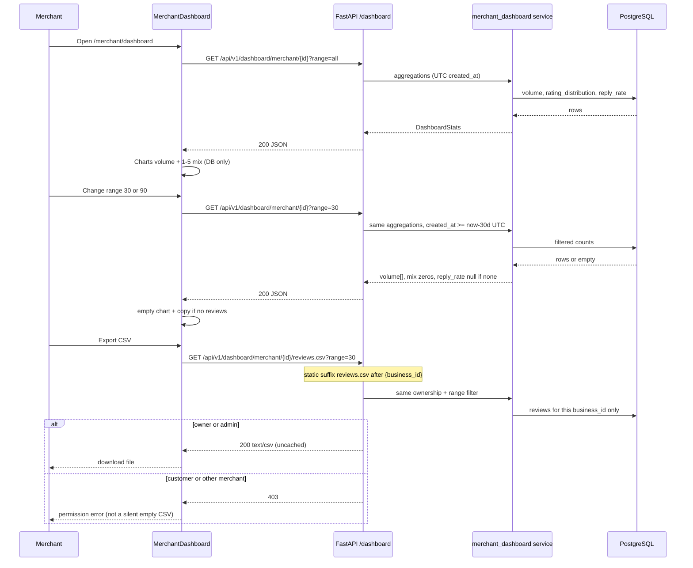

# Slice: S-033 — Merchant analytics that merchants actually use

| Field | Value |
|-------|-------|
| **Slice ID** | S-033 |
| **Phase** | 4 Dashboards |
| **Status** | Accepted |
| **Role(s)** | merchant |
| **Owner** | PM / 2026-08-15 |

---

## User story

**As a** merchant viewing my dashboard
**I want** review volume, rating mix, a date-range filter, and reply-rate driven from real review timestamps
**So that** I can act on patterns I actually have — not canned AI charts or numbers that never appear on screen

Today the merchant dashboard oversells analytics: the dashboard payload already includes `review_volume_by_month`, but `MerchantDashboard.tsx` / `Charts.tsx` do not chart it, and mock AI `monthly_trends` are canned figures rather than dates from stored reviews. S-006 stays **Partial** until this slice ships.

---

## Acceptance criteria

1. **Given** I am signed in as a merchant on `/merchant/dashboard` with a selected business whose dashboard payload already includes `review_volume_by_month`, **when** the dashboard loads, **then** that series is rendered as a visible chart (volume over months) — the field is no longer unused payload.
2. **Given** the selected business has reviews with star ratings, **when** I view the dashboard, **then** I see a 1–5 star rating distribution computed from those reviews. The mix is assembled in a service (not by thickening a router); the UI shows counts or proportions for each star bucket.
3. **Given** I am on `/merchant/dashboard`, **when** I choose a date range of last 30 days, last 90 days, or all time, **then** review volume, rating mix, and reply-rate (AC 5) update using `Review.created_at` for the selected business — not values invented in LLM JSON.
4. **Given** AI `monthly_trends` are shown anywhere on the merchant dashboard, **when** those figures are not derived from stored review dates, **then** they are labeled as mock or degraded **and** carry suggestion language (AI is never a verdict). **When** they *are* derived from the database, **then** they may appear as trends but still with the required suggestion/disclaimer copy — never as a definitive judgment of the business.
5. **Given** a selected date range (AC 3), **when** reply-rate is shown, **then** it equals (reviews in that range that have a merchant reply) / (total reviews in that range) for the selected business. Zero total reviews in range is handled by AC 8, not a divide-by-zero crash.
6. **Given** I am the merchant for the selected business, **when** I choose to export, **then** I can optionally download a CSV of **that** business’s reviews (own business only). Export is optional to use; it is not required to read the charts. A merchant cannot export another merchant’s reviews.
7. **Given** a customer (or any non-owner merchant) attempts to open another merchant’s dashboard or export that business’s reviews, **when** the request is made, **then** they are denied. **Given** an admin views the same merchant dashboard as they can today, **when** they load it, **then** that existing admin-view behavior is unchanged by this slice (admin may view; this slice does not invent a new admin analytics product).
8. **Given** the selected business and date range contain no reviews, **when** the dashboard renders charts and stats for that range, **then** I see an empty chart plus beginner-friendly copy (no crash, no blank unexplained failure, no fake series invented to fill the gap).

---

## UX notes

- **Screens / routes:** `/merchant/dashboard` only. No new merchant analytics route or admin analytics screen.
- **Components to reuse:** `MerchantDashboard`, `Charts`, `StatCard`, `AIInsights`. Prefer extending these over new page chrome. S-022 tile interactivity stays; this slice adds analytics the merchant can actually use on the same page.
- **Empty states / errors:** Empty range → empty chart + clear copy (AC 8). Export denial for the wrong business is a permission failure, not a silent empty file of someone else’s data.
- **AI disclaimer required?** **Yes** — any AI trend copy (`monthly_trends` or similar) must include suggestion language. AI output is never a definitive judgment of the business.

---

## Out of scope

- Revenue, cohorts, or payment analytics — there are no payments yet; that belongs to **S-036**.
- Ad funnels or campaign attribution.
- New AI products or new insight types beyond using (or honestly labeling) existing `monthly_trends`.
- Admin analytics as a product — **S-034**. Admin may still *view* the merchant dashboard as they do today (AC 7).

---

## Dependencies

- **S-006** (Partial) — related epic; this slice is what moves merchant dashboard analytics from oversold payload/mocks toward something merchants can use. S-006 remains Partial until this ships.
- **S-022** (Accepted) — merchant dashboard tile interactivity; reuse the same page; do not regress tiles.
- Does **not** block on **S-034** (admin analytics).

---

## Definition of done (PM)

- [x] All AC verified in test report
- [x] UX matches notes above
- [x] Documented in `README.md` §7 API reference / §8 Frontend guide if new patterns
- [x] README §12 Web ↔ mobile feature parity tracker has a matching row if this ships as a user-facing web capability (typically `unimplemented` / `partial` / `future` on mobile until a later slice)
- [x] PM Status set to **Accepted**

---

## Technical specification (Architect)

> Specified 2026-08-15. Builder implements; do not thicken routers. Date filters are SQL on `Review.created_at` only — never LLM JSON.

### API contract

Prefix: `/api/v1`. Routers stay HTTP-only (`require_roles`, path/query validation, status codes). Aggregations live in a new `backend/app/services/merchant_dashboard.py`. Reuse the same ownership check the dashboard already uses: merchant must own `Business.merchant_id`; admin may load any business (unchanged).

| Method | Path | Auth | Request | Response | Errors |
|--------|------|------|---------|----------|--------|
| GET | `/dashboard/merchant/{business_id}` | Bearer or cookie; `require_roles(UserRole.MERCHANT, UserRole.ADMIN)` | Path: `business_id` UUID. Query: `range=30\|90\|all` (string enum; **default `all`**). Invalid `range` → 422. | `DashboardStats` (extended): existing `total_reviews`, `average_rating`, `sentiment_breakdown`, `recent_reviews`, `review_volume_by_month`; **new** `rating_distribution`, `reply_rate`. | `401` unauthenticated; `403` customer, or merchant who does not own the business; `404` unknown `business_id`; `422` bad `range` |
| GET | `/dashboard/merchant/{business_id}/reviews.csv` | Same as dashboard GET | Path: `business_id` UUID. Query: same optional `range` (default `all`) so export can match the on-screen window. | `text/csv; charset=utf-8` attachment (`Content-Disposition: attachment; filename="reviews-{business_id}-{range}.csv"`). StreamingResponse; **not JSON**. | Same 401/403/404/422. Never return another merchant’s rows as an empty file. |
| GET | `/ai/businesses/{business_id}/insights` | Existing | Unchanged | Unchanged `MerchantInsightsResponse` including `monthly_trends` and `degraded` | Unchanged. Frontend keeps calling this (not `/analytics`). |
| GET | `/analytics/merchant/{id}` and `/analytics/merchant/{id}/summary` | Existing | — | — | **Deprecate; do not call from frontend.** Leave routers mounted this slice. Mobile OpenAPI stubs may still list them; web must not start using them. |

**Route order:** declare `GET /dashboard/merchant/{business_id}/reviews.csv` **before** any broader `/dashboard/merchant/{business_id}/…` catch-alls. Do **not** use `/dashboard/merchant/{business_id}.csv` (would collide with UUID parsing). Existing `GET /dashboard/admin/platform` is unrelated and out of scope (S-034).

**`range` semantics (UTC):**

- `all` — no lower bound on `Review.created_at`.
- `30` / `90` — `Review.created_at >= now(UTC) - 30/90 days` (inclusive lower bound). Do not parse dates from AI JSON.
- Volume buckets: `to_char` / date_trunc in **UTC** so buckets match the filter (see Risks).

**Range-filtered fields:** `review_volume_by_month`, `rating_distribution`, `reply_rate`. Empty range: volume `[]`; `rating_distribution` still keys `"1"`–`"5"` with `0`; `reply_rate` **`null`** (not `0`, not a crash).

**Not range-filtered this slice (preserve current meaning):** `total_reviews` and `average_rating` stay the denormalized all-time `Business` counters; `sentiment_breakdown` and `recent_reviews` stay all-time as today. AC 3 names volume, mix, and reply-rate only.

**`DashboardStats` extensions** (`backend/app/schemas/__init__.py`):

```text
rating_distribution: dict[str, int]   # keys "1","2","3","4","5"; counts of Review.rating in range
reply_rate: float | None              # 0.0–1.0, or null if zero reviews in range
review_volume_by_month: list[{month: "YYYY-MM", count: int}]  # unchanged shape; filtered by range
```

**`reply_rate`:** `(count of in-range reviews that have a replies row) / (count of in-range reviews)`. Join `Review.reply` / `replies.review_id`. If denominator is 0 → `null`.

**Review inclusion:** same as today’s dashboard volume query (no extra status filter unless the current volume query already has one — it does not). Do not invent a hidden-review exclusion in this slice.

**CSV columns (header row required):** `id`, `created_at` (ISO-8601 UTC), `rating`, `title`, `body`, `status`, `author_name` (from review author `full_name`; no extra PII dumps), `has_reply` (`true`/`false`), `reply_body` (empty if none). One row per in-range review for **that** `business_id` only. Sort `created_at` desc.

**CSV not cached.** Dashboard JSON: do not read or write Redis `search:*`. No cache keys for dashboard stats.

### RBAC matrix

| Action | anonymous | customer | merchant (owner) | merchant (other business) | admin |
|--------|-----------|----------|------------------|---------------------------|-------|
| GET dashboard stats | 401 | 403 | 200 | 403 | 200 (view-as-today; no new admin product) |
| GET reviews.csv | 401 | 403 | 200 | 403 | 200 (same ownership bypass as dashboard) |
| `/merchant/dashboard` page | redirect login | redirect / forbidden | CSR page | N/A (page lists own businesses only) | Unchanged: page stays `RequireAuth role="merchant"`; do not add an admin analytics screen |

### Data model impact

- [x] None  [ ] Extend existing  [ ] New table(s)

**Details:** No new tables, columns, enums, or Alembic. Read existing `reviews.created_at`, `reviews.rating`, `reviews.business_id`, `replies` (1:1). ERD in README §5: **no update**. Pydantic `DashboardStats` only.

### Cache / side effects

- Dashboard GET: skip search cache; no `search:*` invalidation on these reads.
- CSV: not cached; generate per request.
- Review/reply writes already invalidate search where they exist; this slice does not add write paths.
- Storage/AI: no `get_storage_provider()`. Insights remain `GET /ai/businesses/{id}/insights` via existing `AIProvider` factory. Do not call LLM to build date windows or chart series.

### Frontend

- **Route:** `/merchant/dashboard` only (`frontend/src/app/merchant/dashboard/page.tsx` → `MerchantDashboard.tsx`). No `/analytics` page.
- **Rendering:** CSR (`"use client"`), already required for charts and auth.
- **API client:** `frontend/src/lib/api.ts` — `dashboard.merchant(businessId, { range })`; add `dashboard.reviewsCsv(businessId, { range })` using the same auth header as other downloads (blob / `text/csv`). **Do not** call `/api/v1/analytics/...`.
- **Components (reuse first):**
  - `MerchantDashboard.tsx` — range control (`30` / `90` / `all`), refetch on change; reply-rate tile/stat; optional Export CSV control; empty-range copy (AC 8). Keep S-022 tile click/scroll behavior.
  - `Charts.tsx` — render **DB** `review_volume_by_month` (volume over months) and **DB** `rating_distribution` (1–5). Reuse Recharts; second series may be a second `<Charts>` instance or a small prop extension (`emptyMessage`). Do **not** feed AI `monthly_trends` into `Charts` as factual bars.
  - `StatCard` / existing tiles — reply-rate display (`null` → empty copy, not `0%` pretending there were reviews).
  - `AIInsights.tsx` — keep suggestion disclaimer. If `monthly_trends` are shown: always suggestion language; if `degraded` **or** trends are mock/canned (`MockAIProvider` figures, not `Review.created_at`), label mock/degraded and **do not** chart them as DB facts. Canonical volume chart is `review_volume_by_month` from dashboard.
- **Empty:** `Charts` already handles `data.length === 0`; add beginner-friendly copy on the dashboard when the selected range has no reviews (AC 8). Do not invent a fake series.

### Service / layering

`backend/app/routers/dashboard.py` currently runs `func.to_char` volume aggregation in the router. Move **all** merchant dashboard aggregations (volume, rating histogram, reply-rate, existing sentiment/recent/volume queries used by this GET) into `backend/app/services/merchant_dashboard.py`. Router: load user, `require_roles`, call service, map HTTP errors. Admin platform GET stays as-is (S-034).

### Flow



### README updates (Builder, when implementing)

- **§7** Dashboard — document `range` on GET merchant dashboard; add CSV row; Auth column may say Merchant/Admin as today. **§7 Analytics** — mark `/analytics/*` deprecated / unused by web; do not delete.
- **§8** — if a second chart series or CSV download pattern is new, note it under `MerchantDashboard` / `Charts`.
- **§12** Web ↔ mobile parity — add **M-61** merchant time-series charts (volume + rating mix + range + reply-rate + optional CSV) on `/merchant/dashboard`; mobile **`unimplemented`** until a later slice. Existing M-50/M-51 remain the shell + sentiment tiles.
- **§14 / S-006** — this slice is what makes merchant analytics usable; after ship, PM/Builder note S-006 progress (still Partial until Tester/PM accept).
- **§5 ERD** — no change. **§6** — optional one-line on range + CSV if a merchant flow bullet exists.

### Architect checklist

- [x] API contract defined and matches `README.md` §7 API reference style
- [x] RBAC matrix complete (all roles + anonymous)
- [x] Data model impact documented; ERD: no new tables
- [x] Cache invalidation considered (reads skip `search:*`; CSV uncached)
- [x] AI/storage/maps use existing abstraction layers (insights via `/ai/...` + `AIProvider`; no LLM date filters; no new storage)
- [x] No secrets in design
- [x] ERD/API/FLOWS updates noted for Builder (README §7/§8/§12/§14)

### Risks / tradeoffs

- **Timezone of `created_at`:** column is timestamptz. Mixing session TZ `to_char` with a UTC cutoff can drop/shift month buckets at day boundaries. **Decision:** compute range cutoff and month labels in UTC.
- **`reply_rate` divide-by-zero:** zero reviews in range → `null`, not `0/0`. UI must not render `0%` as if there were reviews (AC 8).
- **Canned AI trends vs DB volume:** `MockAIProvider.generate_merchant_summary` hard-codes `monthly_trends` months. Charting those as volume would fail AC 4. **Decision:** only `review_volume_by_month` is a fact chart; AI trends stay labeled suggestions (`degraded` / mock).
- **`total_reviews` tile vs range:** tiles stay all-time denormalized counts so we do not silently change S-022 tile meaning. Range applies to the new analytics block.
- **CSV vs UUID routes:** `.csv` is a static final segment `reviews.csv`, not `{business_id}.csv`.
- **Legacy `/analytics`:** leftover alias of AI insights; calling it from the new charts would mix suggestion JSON with facts. Deprecate in docs; delete later, not this slice.
- **No ADR:** extends existing dashboard GET + CSV; no new vendor, auth scheme, or schema pattern.

---

## Links

- Test plan: `docs/agents/test-plans/TP-S-033-*.md`
- Test report: `docs/agents/test-reports/TR-S-033-*.md`
- ADR: none (not required for this slice)

---

## Changelog

| Date | Agent | Change |
|------|-------|--------|
| 2026-08-15 | PM | Created slice. Merchant dashboard currently oversells analytics (`review_volume_by_month` unused in UI; mock AI `monthly_trends` not from DB dates). 8 numbered AC: chart existing volume series, rating mix from reviews (service, not a thicker router), 30/90/all from `Review.created_at`, AI trends only if DB-derived or labeled mock/degraded + suggestion language, reply-rate in range, optional own-business CSV, customer denied / admin view-as-today, empty range copy. UX: `/merchant/dashboard` only; reuse MerchantDashboard, Charts, StatCard, AIInsights. Out of scope: S-036 revenue, ad funnels, new AI products, S-034 admin analytics. Dependencies: S-006 Partial (related), S-022 Accepted; does not block on S-034. Status: Draft. Architect to fill Technical specification. |
| 2026-08-15 | Architect | Technical specification: extend existing GET `/api/v1/dashboard/merchant/{business_id}` with `range=30\|90\|all` (default `all`); move aggregations to `merchant_dashboard` service; extend `DashboardStats` with `rating_distribution` and `reply_rate`; add GET `.../reviews.csv` (static `reviews.csv` after `{business_id}`). Deprecate `/analytics` (do not call from frontend; do not delete). CSR `/merchant/dashboard`. Cache: dashboard skips `search:*`; CSV uncached. No new tables; no ADR. README §7/§8/§12 M-61/§14 S-006 on implement. Status: **Specified**. |
| 2026-08-15 | Builder | Implemented per spec: `backend/app/services/merchant_dashboard.py` (all range-filtered + all-time aggregations, UTC month bucketing, reply-rate null-on-zero, CSV row export); `DashboardStats` extended with `rating_distribution`/`reply_rate`; router now thin (loads business, ownership check, calls service, maps HTTP errors) with `range` query (422 on invalid) and new `GET .../reviews.csv` `StreamingResponse`. Frontend: `dashboard.merchant(id, {range})` + new `dashboard.reviewsCsv` blob download in `api.ts`; `MerchantDashboard.tsx` gained a range `Select`, DB-only volume + rating-mix `Charts`, reply-rate `StatCard` (null → "No reviews in this range", never `0%`), Export CSV button, and empty-range copy; `Charts.tsx` gained an `emptyMessage` prop; `AIInsights.tsx` renders `monthly_trends` (if present) as a suggestion-only list, always disclaimed, additionally flagged "Mock/degraded data" when `degraded` is true — never fed into the fact `Charts` component. README §7 (range/CSV rows), §8 (state + CSV/blob download pattern), §12 (M-61 web `unimplemented`→ now web-built, mobile still `unimplemented`; rollup updated) updated in this PR. Known follow-up for Tester: existing `test_merchant_dashboard_returns_stats_shape_for_owner` asserts the old (pre-`rating_distribution`/`reply_rate`) key set and `MerchantDashboard.test.tsx`'s `getByRole("combobox")` now matches two selects (business picker + new date-range picker) — both need updating, not fixed here per Builder/Tester separation. Status: **Testing**. |
| 2026-08-15 | Tester | TR-S-033 filed — 8/8 AC pass. Fixed both flagged regressions: `test_merchant_dashboard_returns_stats_shape_for_owner` (new key set/shape) and `MerchantDashboard.test.tsx`'s ambiguous-combobox test (scoped by label + updated `{range}` call assertion). Added 2 new real-DB backend tests proving `range` is a real SQL filter on `Review.created_at` (not just response shape), and 7 new frontend tests for previously-uncovered S-033 UI (volume/rating charts, range refetch, reply-rate null-vs-percentage, empty-range copy, CSV export, AI trend suggestion/degraded labeling). Backend DB-free safe subset: 239/239 pass; new real-DB tests individually verified passing (each real-DB test run alone due to a pre-existing engine/event-loop constraint in this suite, not a product bug). Frontend: 19 suites / 85 tests pass, no regressions. Recommendation: **Ship**. See `docs/agents/test-reports/TR-S-033-merchant-analytics.md`. Status stays **Testing** pending PM review. |
| 2026-08-15 | PM | Acceptance review against `TR-S-033-merchant-analytics.md`: AC coverage matrix maps all 8/8 numbered AC to a Pass, no gaps in the matrix, no unresolved regressions (both Builder-flagged pre-existing test issues were fixed and re-verified). DoD checklist verified against artifacts, not just Tester's word: README §7 documents `range` on the merchant dashboard GET and the new `reviews.csv` row (lines ~1078-1079); §8 documents the new CSV/blob download pattern (~line 1325); §12 parity tracker carries **M-61** (`unimplemented` on mobile, "web built — mobile not yet", S-033) — matches AC 1/3/5/6 scope. No new frontend component files were added by this slice (MerchantDashboard/Charts/AIInsights all pre-existed and are already in the §8 Components table), so no additional §8 row was owed. Non-blocking gap carried forward per Tester: the 3 new real-DB backend tests (`test_merchant_dashboard_range_filters_out_older_reviews`, `test_merchant_dashboard_invalid_range_422`, plus the updated shape test) were each verified individually rather than as a batch run, due to a pre-existing asyncpg event-loop constraint in this test file (not a product bug, same documented pattern as prior accepted slices e.g. S-021); `Charts.tsx`'s new `emptyMessage` prop has no dedicated component test file of its own (covered indirectly via `MerchantDashboard.test.tsx`). Neither blocks acceptance. Note for follow-up (not this PR, not blocking): once S-034 also lands, a later commit should flip the "(S-033, Testing)"/"in Testing" labels in README §2 roles table, §14 Frontend row, and §16 built-vs-next language to reflect Accepted, and move S-006 from Partial to closed in the §13 backlog table — Builder's job, not PM's, per workflow. **Status: Testing → Accepted.** |
