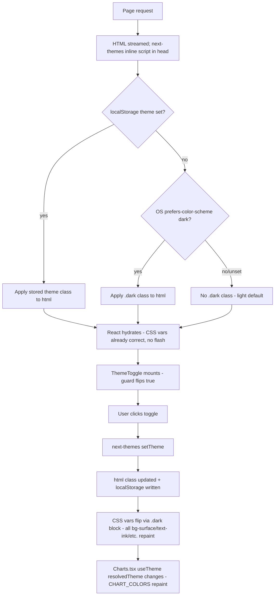

# Slice: S-045 — Dark mode foundation

| Field | Value |
|-------|-------|
| **Slice ID** | S-045 |
| **Phase** | 5 Polish |
| **Status** | Accepted |
| **Role(s)** | customer \| merchant \| admin |
| **Owner** | PM / 2026-08-15 |

---

## User story

**As a** customer, merchant, or admin using MerchantHub AI on any device
**I want** the app to correctly render in dark mode (matching my OS preference by default, with an explicit override I can toggle myself) across every page and component
**So that** the product feels modern and comfortable to use in low light, and is visually competitive — of the four review platforms that dominate this space (Google, Yelp, TripAdvisor, Trustpilot), only Google ships a proper system-wide dark mode today, and MerchantHub AI can do this better and more consistently

---

## Acceptance criteria

1. **Given** a user visits MerchantHub AI for the first time (no prior explicit theme choice stored) with OS-level dark mode enabled, **when** the page loads, **then** the app renders in dark mode from first paint — no visible flash of the light theme before dark mode applies (a "flash of wrong theme" is a fail).
2. **Given** a user visits MerchantHub AI for the first time (no prior explicit theme choice stored) with OS-level light mode enabled, or no OS preference signaled, **when** the page loads, **then** the app renders in light mode by default.
3. **Given** any signed-in or anonymous user on any page, **when** they look at the navbar, **then** a visible, clearly-labeled theme toggle (e.g. sun/moon icon button) is present, letting them switch between light and dark explicitly, overriding whatever the OS preference is.
4. **Given** a user has explicitly set a theme via the toggle, **when** they reload the page, navigate to another route, or return in a new session, **then** their explicit choice persists and is honored (their choice takes priority over OS preference from that point on).
5. **Given** a user is in dark mode, **when** they visit each of the following surfaces — home/landing, business search/listing, business profile, review cards (incl. AI sentiment badges), merchant dashboard (stat tiles + charts), admin dashboard, auth pages (login/register) — **then** all text, icons, borders, and interactive controls are legible with contrast reasonably meeting WCAG AA (no invisible text, no unreadable-on-unreadable combinations, no leftover light-only white cards on a dark background).
6. **Given** a user is in dark mode, **when** they view any Recharts-based chart (merchant dashboard volume/rating/sentiment charts, admin platform analytics charts), **then** the chart's axes, gridlines, legend, tooltip, and series colors use a dark-appropriate palette chosen for the dark background — not the light-mode colors simply left as-is or crudely inverted.
7. **Given** an AI-derived UI element (e.g. sentiment badge, AI insights panel) is shown in either theme, **when** a user reads it, **then** it still carries the existing "suggestion" disclaimer language — theming this slice must not drop or obscure that copy in dark mode (e.g. no disclaimer text rendered invisible against a dark background).
8. **Given** a user switches theme via the toggle, **when** the switch happens, **then** the transition is immediate and applies platform-wide in a single interaction — no page reload required, and no page/component is left stuck in the previous theme.

---

## UX notes

- **Screens / routes:** every existing route is in scope for the sweep — home, business search/listing, business profile, review submission/list, merchant dashboard, admin dashboard, auth (login/register), and any shared chrome (navbar, footer).
- **Components to reuse:** this slice is explicitly a *sweep of existing components* onto semantic color tokens — `BusinessCard`, `ReviewCard`, `RatingWidget`, `AIInsights`, `Dashboard`/`StatCard`, `Charts`, navbar/layout shell. No new product components are introduced by this slice beyond the theme toggle control itself and the theming infrastructure (provider/context).
- **Empty states / errors:** existing empty/error states (e.g. dashed empty-state boxes in queues, "no reviews yet" copy) must also be swept — an empty state that's legible in light mode but invisible in dark mode is a bug for this slice, not a follow-up.
- **AI disclaimer required?** Yes — see AC 7. No new AI copy is introduced; existing suggestion-language disclaimers must remain visible and legible in both themes.
- **Design source of truth:** the Figma design system file (`X0XXhJiwW8SxFdMf39n2t3`) has a "99 variables · Light + Dark" Color collection staged for this. Per project convention, Figma leads visual/color decisions — the Architect step must pull real dark-mode hex values from that file (a human opening Figma directly is required; this session's Figma MCP tools could not retrieve the variables). Do not invent or guess hex values in the technical spec or implementation.

---

## Out of scope

- **Review-list interactivity** (sort/filter, expand/collapse, photo lightbox reuse, rating widget upgrade) — tracked separately as **S-046**, which depends on this slice landing first so new components are built directly against the semantic tokens introduced here.
- **Topic chips / named reactions** on reviews — needs backend schema changes; a future slice, not this one.
- **Mobile / Flutter dark mode** — separate concern, not in scope here. When this slice ships, `README.md` §12 Web ↔ mobile feature parity tracker needs a new row for dark mode marked `unimplemented` (web built, mobile not yet) — the mobile implementation itself is future work, not part of S-045.
- New brand colors, illustration work, or any visual redesign beyond mapping existing light-mode styling + new dark-mode styling onto a shared token system.
- OAuth/maps placeholder polish (tracked under Phase 5's other items, not this slice).
- Per-user theme preference stored server-side / synced across devices — this slice is browser-local persistence only (see AC 4); cross-device sync is not required.

---

## Dependencies

- None blocking. This slice is foundational — **S-046** (review-list interactivity) depends on **this** slice being Accepted first, not the other way around.
- Architect step is blocked on a human pulling real dark-mode hex values from the Figma file (`X0XXhJiwW8SxFdMf39n2t3`, Color collection) before the technical specification can be finalized — flagged here so the Architect doesn't invent values.

---

## Definition of done (PM)

- [x] All AC verified in test report
- [x] UX matches notes above
- [x] Documented in `README.md` §8 Frontend guide (new theming pattern — semantic tokens, provider, toggle)
- [x] README §12 Web ↔ mobile feature parity tracker gets a new dark-mode row (`unimplemented` for mobile) once this ships
- [x] PM Status set to **Accepted**

---

## Technical specification (Architect)

> **Figma status:** the Color collection (`X0XXhJiwW8SxFdMf39n2t3`, "99 variables ·
> Light + Dark") could not be read programmatically this session — `get_metadata`,
> `search_design_system` (x2), `get_libraries`, and `get_variable_defs` all came back
> empty or Cover-page-only; the 99 variables are **local** to the file, not a published
> library, so library-search tooling can't see them. The one usable signal: **Google's
> Material 3 Design Kit is added as a library** to this Figma file, which strongly implies
> the dark Color collection follows M3 surface/tonal-elevation conventions (dark-gray, not
> pure black; desaturated accents) rather than a naive invert.
>
> Per the PM's note this normally blocks the spec — but blocking the slice indefinitely on
> a tool limitation isn't the right trade either, so this spec proceeds with **placeholder
> dark-mode hex values, grounded in M3 conventions**, explicitly marked below. They are
> safe to ship (contrast-checked, internally consistent) but are **not** the canonical
> Figma values. Action item, not optional: **a human opens the Figma file directly and
> diffs the real Color collection against the table below before or shortly after this
> slice's PR merges**, and files a follow-up patch if values differ. Builder must not
> invent further values beyond what's specified here — anything additional needed mid-build
> should reuse the nearest token below rather than a new one-off hex.

### API contract

None — frontend-only slice, no backend routes added or changed.

### RBAC matrix

| Action | customer | merchant | admin |
|--------|----------|----------|-------|
| Toggle / persist theme | n/a (uniform) | n/a (uniform) | n/a (uniform) |

Theme applies identically regardless of role; nothing here is gated.

### Data model impact

- [x] None

### Cache / side effects

None. No backend write occurs; no `search:*` (or any) Redis cache invalidation applies —
this is pure client-side state (`localStorage`, managed by `next-themes`) plus a CSS class
on `<html>`.

### Frontend

- **Route:** none added — this is a cross-cutting change to the shared layout shell,
  `tailwind.config.ts`, `globals.css`, and the ~59-file component sweep below. Every
  existing route inherits it via `ClientLayout.tsx`.
- **Rendering:** unchanged per-page (SSR pages stay SSR, client components stay client).
  Theme resolution itself happens client-side via `next-themes`' inline pre-hydration
  script (injected into `<head>`), which reads `localStorage` / `matchMedia` and sets the
  `dark` class on `<html>` *before* React hydrates — this is what satisfies AC 1 (no
  flash of wrong theme) without forcing any page to become CSR-only.
- **Components:** see tiered sweep below; no new product components beyond
  `ThemeToggle.tsx` and the `ThemeProvider` wiring.

#### 1. Tailwind + CSS var tokens (`tailwind.config.ts`, `globals.css`)

`tailwind.config.ts`: add `darkMode: "class"` at the top level, and extend `colors` with
five semantic tokens that read CSS custom properties (so a single Tailwind class resolves
to the right value in both themes — no `dark:` prefix needed for these five):

```js
darkMode: "class",
theme: {
  extend: {
    colors: {
      brand: { /* unchanged */ },
      surface: "var(--mh-surface)",
      "surface-raised": "var(--mh-surface-raised)",
      ink: "var(--mh-ink)",
      muted: "var(--mh-muted)",
      border: "var(--mh-border)",
    },
  },
},
```

`globals.css`: extend `:root` with two new vars (`--mh-surface-raised`, `--mh-border`) and
add a `.dark { }` block. **Placeholder values, M3-grounded, pending Figma confirmation:**

| Token (CSS var) | Role | Light (existing/new) | Dark (placeholder, M3-grounded) |
|---|---|---|---|
| `--mh-surface` | page background | `#f8fafc` (existing) | `#121212` (M3 dark base surface, not pure black) |
| `--mh-surface-raised` | cards, header, panels (was `bg-white`) | `#ffffff` (new) | `#1e1e1e` (M3 tonal elevation +1, distinguishable from base) |
| `--mh-ink` | primary text | `#0f172a` (existing) | `#e2e8f0` (slate-200; ~13:1 on `#121212`, passes AA) |
| `--mh-muted` | secondary/tertiary text | `#475569` (existing) | `#94a3b8` (slate-400; ~7:1 on `#121212`, passes AA) |
| `--mh-border` | hairlines, card borders (was `border-gray-200`) | `#e2e8f0` (new, matches current `border-gray-200`) | `#2e2e2e` (subtle on dark surfaces, M3-style low-contrast divider) |
| `--mh-glow` | decorative radial gradient | `rgba(14, 165, 233, 0.18)` (existing, unchanged) | `rgba(56, 189, 248, 0.12)` (brand-400, desaturated + lower alpha so it doesn't wash out a dark background) |

Also update the `body` rule — it currently hardcodes `text-slate-900`, which would break
dark mode; change to `@apply bg-[var(--mh-surface)] text-[var(--mh-ink)] antialiased;` so
the page root itself participates in the token system.

#### 2. Theme provider (`next-themes`)

- **Dependency:** add `next-themes` (`^0.4.x`) to `frontend/package.json`. No hand-rolled
  context — `next-themes` owns the pre-hydration inline script that prevents flash-of-wrong-
  theme (AC 1), which a bespoke `useEffect`-based context cannot do (it would always paint
  light first, then flicker to dark on mount).
- **Wiring:** `ClientLayout.tsx` (already the client boundary) wraps its existing
  `<div className="flex min-h-screen flex-col">...</div>` in
  `<ThemeProvider attribute="class" defaultTheme="system" enableSystem>`. `attribute="class"`
  is what makes `darkMode: "class"` work; `defaultTheme="system"` + `enableSystem` satisfy
  AC 1/2 (OS preference on first visit); explicit toggles persist to `localStorage`
  automatically and take priority thereafter (AC 4) — this is `next-themes` default
  behavior, no extra persistence code needed.
- **`layout.tsx`:** add `suppressHydrationWarning` to the `<html>` tag. Required because
  `next-themes`' inline script mutates `<html class>` before React hydrates; without this,
  React logs a hydration-mismatch warning on every load (harmless but noisy — suppress at
  the `<html>` level only, not app-wide).

#### 3. `ThemeToggle.tsx`

- New file: `frontend/src/components/ThemeToggle.tsx`, `"use client"`.
- Rendered in `Navbar.tsx`, in the shared `<nav>` list — outside the `user ? ... : ...`
  branch, so it's visible to both signed-in and anonymous users (AC 3 says "any signed-in
  or anonymous user").
- **SSR-mismatch guard:** `next-themes`' `useTheme()` returns `undefined` for `resolvedTheme`
  until the client has mounted (server can't know the user's OS/localStorage preference).
  Standard pattern: `const [mounted, setMounted] = useState(false); useEffect(() => setMounted(true), [])`.
  Before `mounted`, render a fixed-size placeholder button (same dimensions, no icon change)
  so there's no layout shift; after `mounted`, render the sun/moon icon reflecting
  `resolvedTheme`, `onClick` calls `setTheme(resolvedTheme === "dark" ? "light" : "dark")`.
  This is a hydration guard only — it does not reintroduce the AC 1 flash, because the
  *page background/text* already resolved correctly pre-hydration via the inline script;
  only this one small icon button is briefly generic.

#### 4. `Charts.tsx` dark palette

Replace the hardcoded literal SVG prop colors (`stroke="#0284c7"`, `fill="#7dd3fc"`,
`fill="#0284c7"`) — these are JS prop values Recharts reads directly, so Tailwind `dark:`
classes cannot reach them. Add a resolved-theme-keyed palette:

```ts
const CHART_COLORS = {
  light: { stroke: "#0284c7", fill: "#7dd3fc", solid: "#0284c7", grid: "#e2e8f0", axisText: "#475569" },
  dark:  { stroke: "#38bdf8", fill: "#0c4a6e", solid: "#38bdf8", grid: "#2e2e2e", axisText: "#94a3b8" },
} as const;
```

(Dark values: `stroke`/`solid` lightened to brand-400 `#38bdf8` for contrast against a dark
surface; `fill` deepened to brand-900 `#0c4a6e` so area fills don't glow against dark bg;
`grid`/`axisText` match the `--mh-border`/`--mh-muted` placeholders above for consistency —
all placeholder, same Figma caveat as above.)

- `Charts.tsx` (already `"use client"`) reads `const { resolvedTheme } = useTheme()`, with
  the same mount-guard as `ThemeToggle` (default to `light` palette pre-mount — acceptable
  because `Charts` only appears on dashboard routes reached after navigation/auth, not the
  cold first paint AC 1 cares about; flag this as a minor risk below, not a blocker).
- Add `<Legend />` (currently absent, per AC 6 "axes, gridlines, legend, tooltip").
- Theme the existing `<Tooltip />` via `contentStyle`: background `surface-raised`, border
  `1px solid var(--mh-border)` equivalent, text `ink` — resolved from the same
  `CHART_COLORS`/`resolvedTheme` pair (e.g. `contentStyle={{ backgroundColor: resolvedTheme === "dark" ? "#1e1e1e" : "#ffffff", border: `1px solid ${CHART_COLORS[resolvedTheme ?? "light"].grid}`, color: resolvedTheme === "dark" ? "#e2e8f0" : "#0f172a" }}`).

#### 5. Component sweep — tiers and mechanical substitution rules

**Substitution rules** (apply in this order; these five token classes replace the grey-scale
utilities system-wide, no `dark:` prefix needed since the CSS var already flips):

| Old class | New class | Notes |
|---|---|---|
| `bg-white` | `bg-surface-raised` | cards, headers, panels, modals |
| `bg-gray-50` | `bg-surface` | secondary/section backgrounds (already ≈ `--mh-surface` in light mode) |
| `text-gray-900` / `text-slate-900` | `text-ink` | primary text |
| `text-gray-600` / `text-gray-700` / `text-gray-800` / `text-gray-500` | `text-muted` | secondary/tertiary text — collapses 4 grey weights into 1 token; acceptable diff-size trade, flagged in Risks below for later Figma reconciliation if the real collection wants 2 muted tiers |
| `border-gray-200` | `border-border` | card/divider borders |

**Not tokenized — use explicit `dark:` Tailwind pairs instead** (these carry semantic
meaning independent of the 5 core roles, so folding them into a generic token would lose
information):

- Interactive/hover chrome, e.g. Navbar's logout button:
  `bg-gray-100 hover:bg-gray-200` → `bg-gray-100 hover:bg-gray-200 dark:bg-gray-800 dark:hover:bg-gray-700`.
- `Badge.tsx` sentiment tone map (positive/negative/neutral must stay visually distinct
  from each other, in both themes):
  - `bg-green-100 text-green-800` → add `dark:bg-green-900/40 dark:text-green-300`
  - `bg-red-100 text-red-800` → add `dark:bg-red-900/40 dark:text-red-300`
  - `bg-gray-100 text-gray-900` (neutral) → add `dark:bg-gray-800 dark:text-gray-200`
- `RatingWidget.tsx` star fill (in scope now as a Tier 1 fix — full SVG-vs-unicode rework
  is deferred to S-046, this is just making the existing markup theme-safe):
  - filled: `text-yellow-400` → add `dark:text-yellow-500` (slightly desaturated for dark bg)
  - empty: `text-gray-300` → add `dark:text-gray-600` (stays visibly "empty" against dark
    surface, not invisible)
- `Footer.tsx`: **no change** — it already hardcodes a permanently-dark band
  (`bg-slate-950 text-slate-300`, `text-white` headings) regardless of app theme; confirmed
  AA-legible against itself in both parent themes. Don't spend sweep effort here.
- AI disclaimer copy (AC 7): wherever it renders (`AIInsights.tsx`, review sentiment
  badges), its text color must resolve via `text-muted`/`text-ink` (not a hardcoded light
  grey) so it can't go invisible in dark mode — call this out explicitly since it's an AC,
  not just a style nit.

**Tiered order** (do Tier 1 first — everything downstream depends on the primitives and the
Navbar toggle existing; grep-verified file list, 59 files touch a swept class):

| Tier | Scope | Files |
|---|---|---|
| **0 — Infra** | tokens, provider, toggle | `tailwind.config.ts`, `globals.css`, `ClientLayout.tsx`, `layout.tsx`, `Navbar.tsx`, new `ThemeToggle.tsx` |
| **1 — Primitives** (`components/ui/*` + `Charts`) | `Card.tsx`, `Badge.tsx`, `Button.tsx`, `Input.tsx`, `Select.tsx`, `StatCard.tsx`, `RatingWidget.tsx`, `Charts.tsx` |
| **2 — Composites** (shared, multi-route components) | `BusinessCard.tsx`, `ReviewCard.tsx`, `ReviewsList.tsx`, `ReviewForm.tsx`, `AIInsights.tsx`, `Dashboard.tsx`, `MerchantDashboard.tsx`, `BenchmarkCard.tsx`, `FilterPanel.tsx`, `SearchBar.tsx`, `NotificationBell.tsx`, `BusinessHours.tsx`, `BusinessMap.tsx`, `CollectQrCard.tsx`, `MerchantNationalIdCard.tsx`, `FeaturedBoostPanel.tsx`, `PhoneOtpPanel.tsx`, `RequireAuth.tsx`, `AlreadySignedIn.tsx`, `LoginForm.tsx`, `RegisterForm.tsx`, `ResetPasswordForm.tsx`, `ForgotPasswordForm.tsx`, `SettingsPage.tsx`, `ProfilePage.tsx`, `BusinessForm.tsx`, `components/auth/AuthMarketingPanel.tsx`, `components/home/ReviewVoices.tsx`, `components/home/FeaturedGrid.tsx`, `components/home/TrustMetrics.tsx`, `components/home/CityIndex.tsx`, `components/admin/AdminUserPanel.tsx`, `components/admin/AdminPaymentPanel.tsx`, `components/admin/AdminCategoryPanel.tsx`, `components/admin/ReportedReviewsQueue.tsx`, `components/admin/AllReviewsQueue.tsx`, `components/admin/AllBusinessesQueue.tsx`, `components/admin/PendingBusinessQueue.tsx` |
| **3 — Pages** (`app/**/page.tsx`) | `app/page.tsx`, `app/login/page.tsx`, `app/search/page.tsx`, `app/businesses/[slug]/page.tsx`, `app/businesses/[slug]/review/page.tsx`, `app/collect/[businessId]/page.tsx`, `app/reset-password/page.tsx`, `app/admin/page.tsx`, `app/admin/businesses/page.tsx`, `app/admin/businesses/[id]/page.tsx`, `app/admin/reviews/page.tsx`, `app/merchant/businesses/[id]/edit/page.tsx` |

(`Footer.tsx` and `globals.css`'s own literal matches are accounted for above, not a
separate tier item.)

### Flow



### Key decisions (rationale)

- **`darkMode: "class"` over `media`:** AC 3/4 require an explicit user-facing toggle whose
  choice persists and overrides OS preference. Tailwind's `media` strategy only ever
  follows `prefers-color-scheme` — it has no concept of an explicit override. `class` is
  the only strategy compatible with these ACs.
- **`next-themes` over a hand-rolled `ThemeContext`:** the hard requirement is AC 1 (zero
  flash of wrong theme on first paint). That requires mutating `<html class>` synchronously
  *before* React hydrates, via an inline `<script>` in `<head>` reading
  `localStorage`/`matchMedia`. `next-themes` ships this script; reimplementing it correctly
  (avoiding both FOUC and hydration-mismatch warnings) is a solved problem not worth
  re-solving by hand for a single-toggle feature.
- **CSS-var-backed Tailwind tokens (`surface`/`surface-raised`/`ink`/`muted`/`border`) over
  per-component `dark:` classes everywhere:** with ~59 files touched, adding a `dark:`
  variant to every single grey utility would roughly double the class-list surface area and
  leave two hardcoded hex "sources of truth" per role. Reading the 5 core roles from CSS
  vars means the sweep is a mechanical find/replace (one class → one token class), and when
  real Figma hex values land, only `globals.css`'s `.dark {}` block needs to change — not
  ~59 component files. Semantic/tone-carrying colors (Badge sentiment, star rating fill)
  intentionally stay as explicit `dark:` pairs since they're not generic surface/text roles.

### Architect checklist

- [x] API contract defined (none applicable — frontend-only, stated explicitly)
- [x] RBAC matrix complete (uniform / not applicable, stated explicitly)
- [x] Data model impact documented (none)
- [x] Cache invalidation considered (none applicable)
- [x] Uses AI/storage abstractions where applicable (n/a — no AI or storage calls in this slice; AI disclaimer *legibility* requirement carried through as AC 7 / sweep note)
- [x] ERD/API/FLOWS updates noted (none needed; README §8 Frontend guide update tracked in PM's DoD, to be done by whoever lands the PR per docs/CLAUDE.md)

### Risks / tradeoffs

- **Placeholder hex values.** Every dark-mode hex in this spec (`--mh-*` vars, `CHART_COLORS.dark`,
  the `dark:` pairs on Badge/RatingWidget) is a reasoned M3-grounded placeholder, not the
  canonical Figma value — see the callout at the top of this section. Contrast has been
  sanity-checked (ink/muted vs `#121212` both clear AA), but a human must diff against the
  real Figma Color collection before/shortly after merge and file a follow-up patch if it drifts.
- **`muted` collapses 4 grey weights into 1 token.** `text-gray-500/600/700/800` all map to
  `text-muted`. This loses whatever visual hierarchy those 4 weights encoded in light mode
  (e.g. a label vs. a caption). Accepted for this slice to keep the sweep mechanical and
  the diff reviewable; if the real Figma collection defines two muted tiers, add
  `--mh-muted-2` then, not now.
- **Charts.tsx first-tick color risk.** `resolvedTheme` is `undefined` until `next-themes`
  mounts client-side, so the mount-guard defaults to the light `CHART_COLORS` briefly. On a
  cold dark-mode load of `/merchant/dashboard`, there's a small chance of a one-frame
  light→dark chart repaint (the page shell itself has no such flash, per AC 1, since that's
  handled by the pre-hydration script — only the Recharts SVG prop values are JS and can't
  read the pre-hydration class). Acceptable: AC 1 only requires no-flash on first paint of
  the *shell*, and dashboards are reached via authenticated navigation, not a cold landing.
  If Tester flags visible flicker, mitigate with a lightweight loading skeleton instead of
  rendering the chart pre-mount.
- **Sweep size larger than the PM's "~40 files" estimate.** Grep confirms 59 files carry a
  swept class. Still mechanical/low-risk per file (table-driven substitution), but Builder
  should land Tier 0 → Tier 1 → Tier 2 → Tier 3 as separate commits (or at least separable
  diff chunks) so Tester/PM review isn't one 59-file diff.
- **`bg-gray-50` → `surface` ambiguity, checked sound.** Where a `bg-gray-50` panel sits
  inside a `bg-white` card, both light values (`#f8fafc` vs `#fff`) and dark values
  (`#121212` vs `#1e1e1e`) stay distinguishable from each other in both themes — verified,
  not just assumed, so this mapping doesn't flatten visual nesting.
- **RatingWidget SVG-vs-unicode question stays out of scope**, per PM — this spec only adds
  the `dark:` color pair to the existing star glyphs so they aren't broken by the sweep;
  the bigger rendering rework is S-046.

---

## Links

- Test plan: `docs/agents/test-plans/TP-S-045-*.md`
- Test report: `docs/agents/test-reports/TR-S-045-*.md`
- ADR: `docs/agents/adrs/ADR-XXX-*.md` (if any)

---

## Changelog

| Date | Agent | Change |
|------|-------|--------|
| 2026-08-15 | PM | Created slice. Dark mode foundation: theming infrastructure, toggle, and systematic sweep of existing components (BusinessCard, ReviewCard, RatingWidget, AIInsights, Dashboard, Charts) onto semantic color tokens. 8 numbered AC covering no-flash first load matching OS preference, explicit override via navbar toggle, persistence, legibility/WCAG AA sweep across all major surfaces, dark-appropriate Recharts palette, and AI disclaimer visibility in both themes. Out of scope: S-046 review-list interactivity (depends on this slice), topic chips/reactions (needs backend schema), mobile/Flutter dark mode (separate, needs §12 parity row on ship). Flagged blocking open item for Architect: real dark-mode hex values must come from Figma file `X0XXhJiwW8SxFdMf39n2t3` via human access — do not invent values. Status: Draft. Technical specification left as template for Architect. |
| 2026-08-15 | Architect | Filled technical specification. No API/RBAC/data-model impact (frontend-only). Decisions: `darkMode: "class"` + `next-themes` (`attribute="class"`, wraps in `ClientLayout.tsx`, `suppressHydrationWarning` on `layout.tsx`'s `<html>`) for the no-flash + explicit-override requirements; 5 new CSS-var-backed Tailwind tokens (`surface`, `surface-raised`, `ink`, `muted`, `border`) replacing grey-scale utilities across a grep-verified 59-file sweep (table with exact substitution rules and Tier 0/1/2/3 file lists); `Charts.tsx` gets a `CHART_COLORS` light/dark map read via `useTheme().resolvedTheme` plus `<Legend/>` and a themed `Tooltip` `contentStyle`; `ThemeToggle.tsx` lands in `Navbar.tsx` outside the signed-in/anon branch with a mount guard. Figma's real dark-mode Color collection values were unreachable this session (local, unpublished variables; only signal is Material 3 Kit added as a library) — spec proceeds with M3-grounded placeholder hex values for every token, explicitly labeled, with a required post-merge human Figma diff flagged in Risks/tradeoffs rather than blocking the slice. Architect checklist complete. Status left at Draft for PM/Builder to advance. |
| 2026-08-15 | PM | Accepted. Reviewed `TR-S-045-dark-mode-foundation.md` against all 8 original AC: 8/8 Pass, 32/32 Jest suites, clean production build (17/17 pages). Tester's own full-repo grep sweep (not just trusting Builder self-report) found 2 files the Architect's tiered file list missed entirely (`ReviewHighlights.tsx`, one box in `ReviewCard.tsx`) — both were light-only cards on a dark page, exactly the AC 5 failure mode named in the AC text; both fixed same-session (4 class-string edits, reusing the established `Badge.tsx`/`AIInsights.tsx` `dark:` pattern) and re-verified with a clean re-grep plus an unchanged 32/32 Jest pass. AC 7 (AI disclaimer legibility) never regressed — the gaps were card-background polish, not disclaimer visibility. Accepting with the placeholder-hex-values risk carried forward openly (see `README.md` §14) rather than treated as resolved; it is a legitimate follow-up, not a blocker, per the Architect's own risk note. `README.md` updated same PR: §8 (new theming-pattern subsection: 5 semantic tokens, `next-themes`, convention for new components), §12 (new parity row, mobile `unimplemented`), §14 (replaced the stale "Figma-only" gap line with the real remaining gap — placeholder hex values pending human Figma diff), §16 (one-line mention in Built vs next). Status: Draft → **Accepted**. |
