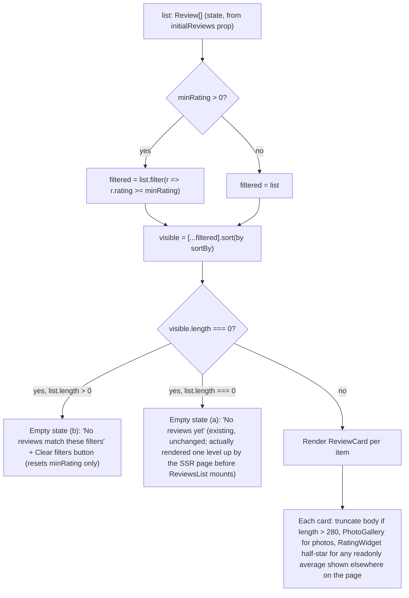

# Slice: S-046 — Review-list interactivity

| Field | Value |
|-------|-------|
| **Slice ID** | S-046 |
| **Phase** | 5 Polish |
| **Status** | Accepted |
| **Role(s)** | customer \| merchant \| admin |
| **Owner** | PM / 2026-08-15 |

---

## User story

**As a** customer browsing reviews on a business profile
**I want** to sort and filter the review list, read long reviews without a wall of text, view review photos in a proper lightbox, and see fractional average ratings rendered with half-stars
**So that** I can quickly find the reviews most relevant to me and trust the platform's polish — matching (and in the half-star/lightbox cases, exceeding) patterns already standard on Google, Yelp, TripAdvisor, and Trustpilot

---

## Acceptance criteria

1. **Given** a business profile page with more than one review, **when** a user opens the review-list sort control, **then** they can choose from at least: Newest, Oldest, Highest rating, Lowest rating — and the list re-orders accordingly without a full page reload.
2. **Given** a business profile page's review list, **when** a user selects a minimum star-rating filter (e.g. "4 stars & up"), **then** only reviews at or above that rating are shown, and the filter can be combined with the sort control from AC 1 at the same time.
3. **Given** a user has applied a sort and/or a minimum-rating filter, **when** the resulting combination matches zero reviews, **then** a distinct empty-state message is shown (e.g. "No reviews match these filters" with an option to clear filters) — this must be visually and textually different from the existing "no reviews yet" empty state shown when a business genuinely has zero reviews.
4. **Given** a review body exceeds a defined length threshold, **when** the review card first renders, **then** the body text is truncated with a "Read more" toggle; **when** the user clicks "Read more", **then** the full body is shown and the toggle changes to "Read less", which collapses it back on click.
5. **Given** a review has one or more attached photos, **when** a user clicks a review photo thumbnail, **then** a lightbox opens showing the full-size photo (reusing the existing `PhotoGallery` lightbox interaction pattern), rather than only ever displaying a static thumbnail grid.
6. **Given** a business's average rating is a fractional value (e.g. 4.5), **when** the readonly star-rating display renders that value (e.g. on the business profile header or `BusinessCard`), **then** it renders a half-star glyph for the fractional portion rather than always rounding to a whole star.
7. **Given** a customer is submitting a 1–5 star rating on the review form, **when** they interact with the rating picker, **then** its behavior is unchanged from today — whole-star selection only, no half-star option, same hover/click interaction as before this slice.
8. **Given** any of the new or changed interactive elements from this slice (sort control, filter control, empty state, Read more/less toggle, photo lightbox trigger, half-star display), **when** viewed in either light or dark mode, **then** they render correctly using the semantic color tokens introduced in S-045 — no new hardcoded light-only classes are introduced.

---

## UX notes

- **Screens / routes:** business profile page (`/businesses/[slug]`) review list section is the primary surface; the half-star display (AC 6) additionally affects any surface already showing an average rating — business profile header and `BusinessCard` (used on `/search` and home page featured grid).
- **Components to reuse:**
  - `FilterPanel.tsx` — existing sort/min-rating pattern currently used only on `/search`; this slice extends that same interaction pattern to the review list (exact reuse-vs-adapt approach is an Architect decision).
  - `PhotoGallery.tsx` — existing click-to-open lightbox, not currently wired into `ReviewCard.tsx`'s photo grid; this slice wires it in.
  - `ui/RatingWidget.tsx` — existing unicode `★` star renderer; gains half-star support for readonly display use only (AC 6), interactive picker mode stays untouched (AC 7).
  - `ReviewCard.tsx` — gains truncation/toggle (AC 4) and lightbox-triggering photos (AC 5).
- **Empty states / errors:** two empty states must be visually distinguishable — (a) business has zero reviews at all (existing copy, unchanged) vs. (b) filters/sort applied and zero reviews match (new copy, per AC 3, with a clear-filters affordance).
- **AI disclaimer required?** No new AI surface is introduced by this slice. Existing AI sentiment badges / suggestion disclaimers on `ReviewCard` must continue to render unchanged and legible — this slice does not touch AI copy, but Builder should verify existing disclaimer placement isn't disturbed by the truncation/toggle layout change.

---

## Out of scope

- **Topic chips / tags and named reactions** (Yelp-style Helpful/Thanks/Love This/Oh No, replacing the single 👍 like) — the `Review` type has no `topics`/`tags` field today; this needs a backend schema and/or AI pipeline change first. Future slice.
- **Click-through linking from an AI insight/summary to its source review** — needs a claim → review-ID mapping that doesn't exist yet. Future slice.
- **Server-side pagination of the review list** — the current in-memory/client-side approach is acceptable at today's review volumes. Flag as a future slice if review counts per business grow large enough to make client-side sort/filter/pagination a performance problem.
- **Any change to the interactive star-rating submission picker** — stays whole-star only (see AC 7). Half-star support is for the *readonly average-rating display* only, never the picker a customer uses to submit their own rating.
- New brand colors or a visual redesign of `ReviewCard`/`RatingWidget` beyond what's needed to support sort/filter/truncation/lightbox/half-star.
- Mobile/Flutter parity for this interactivity — tracked separately per `README.md` §12; this slice is web-only. A parity row must be added when this ships (see DoD).

---

## Dependencies

- **S-045 (dark mode foundation) — must be Accepted first.** Accepted 2026-08-15. This slice builds new/changed markup (sort control, filter control, truncation toggle, lightbox trigger, half-star glyph) directly against S-045's semantic color tokens, per AC 8, rather than needing a later dark-mode retrofit.

---

## Definition of done (PM)

- [x] All AC verified in test report
- [x] UX matches notes above
- [x] Documented in `README.md` §8 Frontend guide (note the `FilterPanel` reuse pattern extended beyond `/search`, and the `RatingWidget` half-star addition, as new/changed patterns)
- [x] `README.md` §12 Web ↔ mobile feature parity tracker gets a new row for review-list sort/filter/lightbox interactivity, marked `unimplemented` for mobile
- [x] PM Status set to **Accepted**

---

## Technical specification (Architect)

> Filled by Architect before implementation.

> Verified against the actual code before writing this spec (not just the PM's summary):
> `reviews.list(businessId)` → `GET /api/v1/reviews/business/{businessId}` returns the full,
> un-paginated `Review[]` (`frontend/src/lib/api.ts` lines ~402-403), and `Review` already
> carries `rating: number`, `created_at: string`, `photo_urls?: string[]` (lines 121-138).
> `Business.average_rating: number` (line 57) is already a float, not pre-rounded. No backend
> change is needed for any of the 8 AC — this is confirmed, not assumed.

### API contract

None. Frontend-only slice — no backend routes added or changed. All data needed for
sort/filter/truncate/lightbox/half-star already ships on the existing `Review`/`Business`
payloads.

| Method | Path | Auth | Request | Response |
|--------|------|------|---------|----------|
| — | — | — | — | — |

### RBAC matrix

| Action | customer | merchant | admin |
|--------|----------|----------|-------|
| View/sort/filter review list, expand/collapse, open photo lightbox, see half-star display | same (uniform) | same (uniform) | same (uniform) |

Purely a display/interaction feature on a public business profile page — nothing here is
gated by role. (Existing `showActions`/`canReply`/`showSentimentBadge` gating on `ReviewCard`
is untouched by this slice.)

### Data model impact

- [x] None

**Details:** none — confirmed by reading `frontend/src/lib/api.ts`; `rating`, `created_at`,
and `photo_urls` are already present on `Review`, and `average_rating` is already a float on
`Business`. No new fields, no schema change, no ERD update.

### Cache / side effects

None. No backend write is introduced. Existing `reviews.like()` / `reviews.report()` calls in
`ReviewsList.tsx` are unchanged by this slice (sort/filter operate on already-fetched
in-memory data); no `search:*` (or any) Redis cache invalidation applies.

### Frontend

- **Route:** none added. Changes land inside the existing `/businesses/[slug]` review
  section and inside already-`"use client"` leaf components reused elsewhere
  (`RatingWidget`, `PhotoGallery`).
- **Rendering:** unchanged per-page. `app/businesses/[slug]/page.tsx` stays an SSR page —
  it already fetches `business` and `reviewList` server-side and passes `initialReviews` as
  a prop into `ReviewsList` (`"use client"`). Sort/filter/truncate/lightbox/half-star are all
  *client-side interactivity within components that are already client components* — no page
  needs to flip from SSR to CSR, and no new client boundary is introduced.
- **Components:**
  - `ReviewsList.tsx` — gains sort/filter state, derived view, AC-3 empty state.
  - `ReviewCard.tsx` — gains truncation/toggle (AC 4), wires photos through `PhotoGallery`
    instead of a raw `` grid (AC 5).
  - `PhotoGallery.tsx` — gains two optional layout-override props (thumbnail sizing/grid
    classes) so `ReviewCard` can reuse its lightbox without inheriting its business-photos
    grid sizing.
  - `RatingWidget.tsx` (`components/ui/`) — gains half-star rendering, gated to
    `readonly` only (AC 6/7). This is the **single** rating-display primitive — every
    readonly call site (`BusinessCard.tsx`, `app/businesses/[slug]/page.tsx` header,
    `admin/AllBusinessesQueue.tsx`, `home/ReviewVoices.tsx`, `ReviewCard.tsx`) is covered by
    this one change with no per-call-site edits, confirmed via a repo-wide import grep — every
    caller imports the same `components/ui/RatingWidget`, there is no legacy duplicate.
  - `Select.tsx` (`components/ui/`) — reused as-is (no change) for the sort control.
  - No new files.

#### AC 1 & 2 — sort + min-rating filter (`ReviewsList.tsx`)

**State shape** (new `useState` alongside the existing `list`/`reportedIds`/`error`):

```ts
type SortOption = "newest" | "oldest" | "highest" | "lowest";
const [sortBy, setSortBy] = useState<SortOption>("newest");
const [minRating, setMinRating] = useState<number>(0); // 0 = "All", no filter applied
```

**Derived view — filter, then sort** (order is specified deliberately, not arbitrary):

```ts
const visible = useMemo(() => {
  const filtered = minRating > 0 ? list.filter((r) => r.rating >= minRating) : list;
  return [...filtered].sort((a, b) => {
    switch (sortBy) {
      case "newest": return b.created_at.localeCompare(a.created_at);
      case "oldest": return a.created_at.localeCompare(b.created_at);
      case "highest": return b.rating - a.rating;
      case "lowest": return a.rating - b.rating;
    }
  });
}, [list, sortBy, minRating]);
```

Filter-first is both cheaper (sort operates on the smaller, already-reduced array) and
equally correct — filter and sort are commutative for the final rendered set, so this is a
performance choice, not a correctness one. Critically, `[...filtered].sort(...)` copies
before sorting rather than mutating `list` in place — `list` is also the source of truth for
`handleLike`/`handleReport`'s optimistic updates (`setList((prev) => prev.map(...))`), so
mutating it during a sort would corrupt that unrelated state.

**Sort control UI:** reuse `components/ui/Select.tsx` (already dark-token-safe:
`border-border bg-surface-raised text-ink`), controlled: `value={sortBy} onChange={(e) =>
setSortBy(e.target.value as SortOption)}`, four `<option>`s (Newest / Oldest / Highest rating
/ Lowest rating). This is the *visual pattern* of `FilterPanel`'s sort `Select`, not the
component itself — `FilterPanel` is a URL-param-driven server form (`<form action="/search"
method="get">`) built for a full-page navigation model; `ReviewsList` is client-side in-memory
state with no page reload, so wiring `FilterPanel` in directly would require bolting a
`?sort=`/`?min_rating=` query-param round-trip onto a component that doesn't otherwise touch
the URL. Confirmed by reading `ReviewsList.tsx`: it receives `initialReviews` as a plain prop
from the SSR page, with no `searchParams` involved anywhere in that path.

**Min-rating filter UI:** pill buttons (`All` / `3+` / `4+` / `5`), styled with the exact
same selected/unselected class pattern `FilterPanel` already uses for its city pills
(`bg-brand-600 text-white` selected vs. `bg-brand-50 text-brand-800 hover:bg-brand-100
dark:bg-brand-900/30 dark:text-brand-300 dark:hover:bg-brand-900/50` unselected) — visual
consistency with the one existing filter-pill precedent in the codebase, implemented as plain
`<button onClick={() => setMinRating(n)}>` (no form, no navigation, matches the client-state
model above).

#### AC 3 — distinct empty state

Two empty states must never be conflated:

- **(a) Business has zero reviews at all** — this already exists and is rendered by the
  *parent SSR page* (`app/businesses/[slug]/page.tsx` line ~171-172,
  `reviewList.length === 0`), before `ReviewsList` even mounts. `ReviewsList` also has its own
  defensive `if (!list.length)` guard with the same copy — currently dead code given the only
  call site, kept as a defensive fallback, unchanged by this slice.
- **(b) NEW — sort/filter applied, zero results** — `list.length > 0` but `visible.length ===
  0`. Only `minRating` can cause this (sorting alone never removes items, it only reorders),
  so this state is only reachable via the filter pills, never via the sort `Select` alone —
  worth stating explicitly since it determines what "Clear filters" needs to reset.
  Render distinct copy — *"No reviews match these filters"* — with a **Clear filters** button
  that resets `minRating` to `0` (leaves `sortBy` alone; sort never needs clearing to escape
  a zero-result state, per the point above). Visually distinct from state (a): state (a) is a
  plain `<p>`, state (b) gets a bordered box (`border border-border bg-surface p-4 rounded-xl
  text-center`) with the message plus the button, so it doesn't read as "this business has no
  reviews" to a user who just applied a 5-star filter to a business with only 4-star reviews.

#### AC 4 — truncation + Read more/less (`ReviewCard.tsx`)

- **Mechanism:** Tailwind's `line-clamp-3` utility class. Confirmed available with no plugin:
  `frontend/package.json` pins `tailwindcss: ^3.4.17`, and `line-clamp-*` shipped as a core
  Tailwind utility (no longer a separate `@tailwindcss/line-clamp` plugin) since Tailwind
  3.3 — verified against the installed version, not assumed.
- **Threshold:** character-count heuristic, not a live overflow measurement. New local state
  `const [expanded, setExpanded] = useState(false)`; the "Read more" toggle only renders at
  all when `review.body.length > 280` (chosen as a reasonable long-review cutoff — long enough
  that typical 1-3 sentence reviews never show a toggle, short enough to catch the verbose
  ones `line-clamp-3` would actually cut off at typical card width; flag as tunable if Tester
  finds it visually off in either direction). When the toggle is shown: body renders with
  `className={expanded ? "" : "line-clamp-3"}`; a `<button>` below toggles `expanded` and its
  own label between "Read more" / "Read less". No `ResizeObserver`/`scrollHeight` measurement
  needed — CSS `line-clamp` handles the actual visual truncation, the character count only
  decides *whether to show the toggle machinery at all*, which is simpler and avoids a
  layout-effect measurement pass on every card render.
- Reuse existing `text-muted` class on the body `<p>` (already token-based, no change needed
  there beyond adding the conditional `line-clamp-3` class).

#### AC 5 — photo lightbox (`ReviewCard.tsx` + `PhotoGallery.tsx`)

Replace `ReviewCard`'s current raw `` grid (lines ~96-102, `<div className="mt-3 flex
gap-2">{review.photo_urls.map((url) => )}</div>`) with `PhotoGallery`, reusing its existing `selected`-index lightbox state and
fixed-inset overlay wholesale (no duplicate lightbox logic).

`PhotoGallery` currently hardcodes `h-32 w-full` thumbnails in a `grid grid-cols-2
md:grid-cols-4` — sized for the full-width "Photos" section on the business profile page, not
for `ReviewCard`'s compact inline row. Rather than wrapping `PhotoGallery` in a CSS-override
fight (fragile — Tailwind utility classes on the same element can't be cleanly overridden from
outside), **extend it with two optional props, defaulted to today's values so every existing
call site (`app/businesses/[slug]/page.tsx`'s Photos section) is a no-op**:

```ts
interface PhotoGalleryProps {
  photos: string[];
  altPrefix?: string;
  gridClassName?: string;   // default: "grid grid-cols-2 gap-2 md:grid-cols-4"
  thumbClassName?: string;  // default: "h-32 w-full"
}
```

`ReviewCard` calls it with `gridClassName="flex gap-2"` and `thumbClassName="h-16 w-16"` (its
current thumbnail footprint), passing already-resolved URLs via the existing `resolveUrl()`
helper already defined in `ReviewCard.tsx`: `<PhotoGallery photos={review.photo_urls.map(resolveUrl)}
altPrefix={`${review.author?.full_name ?? "Customer"} photo`} gridClassName="flex gap-2"
thumbClassName="h-16 w-16" />`. The lightbox overlay itself (`bg-black/80` fixed-inset) needs
no dark-mode change — it's already theme-agnostic (opaque black scrim regardless of app
theme).

#### AC 6 & 7 — half-star readonly display, picker untouched (`ui/RatingWidget.tsx`)

**Unicode vs. SVG — decision: stay on unicode `★`/`☆`-style glyphs, do not switch to SVG.**
S-045 explicitly deferred this call to this slice; the call is unicode, for three reasons:
1. **Diff size / risk.** Every readonly call site funnels through this one component
   (confirmed via repo-wide import grep — no legacy duplicate), so the change is contained
   regardless of glyph technology, but a full SVG rework would also touch the *interactive*
   rendering path's visual output (even if `onChange`/hover logic stayed identical), and
   `ui/__tests__/RatingWidget.test.tsx` asserts `getAllByRole("button")).toHaveLength(5)` and
   `getByLabelText("4 stars")` — both keyed to the current one-button-per-star structure,
   which unicode preserves and a multi-path SVG-per-star approach risks disturbing.
2. **No visual gain that matters here.** S-045 already made the existing glyphs theme-safe
   (`text-yellow-400 dark:text-yellow-500` filled, `text-gray-300 dark:text-gray-600` empty);
   half-star fill doesn't need vector paths to render correctly, just a partial-fill overlay
   technique (below) that works identically with a text glyph or an SVG shape.
3. **Zero new dependencies/assets.** No icon SVGs to source, license, or maintain.

**Half-star technique — width-clipped overlay, not `clip-path`:** for the one star index that
represents a fractional value, render two stacked glyphs instead of one:

```tsx
<span className="relative inline-block" aria-hidden>
  <span className="text-gray-300 dark:text-gray-600">★</span>
  <span className="absolute inset-0 w-1/2 overflow-hidden text-yellow-400 dark:text-yellow-500">★</span>
</span>
```

The back glyph is the full "empty" star; the front glyph is the full "filled" star,
absolutely positioned over it and clipped to 50% width via `w-1/2 overflow-hidden` — a plain
Tailwind width + overflow trick, no `clip-path` utility needed (Tailwind ships no `clip-path`
core utility, so this avoids an arbitrary-value class). Same colors as today, just layered.

**Rounding rule** (only evaluated when `readonly`): `const displayValue = Math.round(value *
2) / 2` (round to nearest half-star), then per star index `i` (1-5): full if `displayValue >=
i`; half if `displayValue >= i - 0.5`; else empty. E.g. `value = 4.3` → `displayValue = 4.5` →
stars 1-4 full, star 5 half. This is the standard "round to nearest half" pattern used by every
platform named in the PM's user story (Google/Yelp/TripAdvisor/Trustpilot half-star displays).

**AC 7 satisfied by construction, not by a separate check:** all of the above — `displayValue`
computation, the two-glyph overlay markup — is gated behind `if (readonly)` inside the
per-star render. The interactive branch (`!readonly`: `hover`/`onMouseEnter`/`onMouseLeave`/
`onClick`/`onChange`) is a completely separate code path that renders the existing
single-glyph `★` unchanged. `ReviewForm.tsx` (the only interactive, non-readonly call site)
is untouched — confirmed via the same import grep, it imports the same component but always
passes an integer `value` and never `readonly`, so it never enters the half-star branch at
all, by construction rather than by convention.

#### AC 8 — dark mode compliance for all new markup

Every new element introduced by this slice must use S-045's semantic tokens or explicit
`dark:` pairs — no new hardcoded `bg-white`/`text-gray-*`:

| New element | Token / pattern used |
|---|---|
| Sort `Select` | `components/ui/Select.tsx`, already token-based — no new classes needed |
| Min-rating filter pills | `FilterPanel`'s exact existing city-pill `dark:` pattern (see AC 1/2 above) |
| AC-3 zero-results empty state box | `border-border`, `bg-surface`, `text-muted`/`text-ink` |
| Read more/less toggle button | `text-brand-600 hover:text-brand-700` — same pattern already used for "Reply as business" in the same file, no new color introduced |
| Half-star overlay glyphs | reuses S-045's exact `RatingWidget` `dark:` pair (`text-yellow-400 dark:text-yellow-500` / `text-gray-300 dark:text-gray-600`) — no new colors |
| `PhotoGallery` lightbox | unchanged, already theme-agnostic (`bg-black/80` scrim) |

No new hex values or new token roles are introduced by this slice — everything reuses S-045's
five tokens or an already-established `dark:` pair elsewhere in the codebase. This keeps AC 8
verification mechanical for Tester (grep for any new `bg-white`/bare `text-gray-*` in the
diff, expect zero hits).

### Flow



### Key decisions (rationale)

- **Client-side, in-memory sort/filter over server-side query params.** `reviews.list()`
  already returns the full un-paginated array for a business, and `ReviewsList` receives it as
  a plain prop from an SSR page with no `searchParams` wiring today. Introducing
  `?sort=&min_rating=` query params on `/businesses/[slug]` would require the page itself to
  become param-aware and re-fetch on every interaction — a full-page round trip for what AC 1
  explicitly requires to happen "without a full page reload." Client-side is also the
  PM-endorsed call (`ReviewsList.tsx`, "exact reuse-vs-adapt approach is an Architect
  decision" in the slice's UX notes) and matches current review volumes; the PM's own
  Out-of-scope section already flags server-side pagination as a *future* slice if volumes
  grow. No ADR — this is a reversible, component-scoped choice, not a new integration, schema
  change, auth change, or AI behavior change (the four ADR triggers per
  `.claude/agents/architect.md`).
- **Unicode over SVG for `RatingWidget` half-stars.** See AC 6/7 section above for the full
  three-point justification (diff/test risk, no visual gain, no new dependencies). Also not
  ADR-worthy for the same reason — a reversible rendering-technique choice inside one
  component, not a triggering category.
- **Two distinct empty states, not one generic "no reviews" message.** A user who applies a
  5-star filter to a business with only 4-star reviews and sees "No reviews yet" would
  reasonably conclude the business itself has no reviews at all (a much stronger, and false,
  signal) — AC 3 already pins this down explicitly as a must-differ requirement, this is
  implementation of that AC, not a new architectural decision, so also no ADR.
- No ADR filed for this slice. None of the three decisions above are a new integration, schema
  pattern change, auth change, or AI provider behavior change — the four triggers that warrant
  one per the Architect role definition.

### Architect checklist

- [x] API contract defined (none applicable — frontend-only, confirmed by reading
      `frontend/src/lib/api.ts`, stated explicitly above)
- [x] RBAC matrix complete (uniform across all three roles, stated explicitly)
- [x] Data model impact documented (none — `Review`/`Business` already carry every field
      needed)
- [x] Cache invalidation considered (none applicable — no backend write)
- [x] Uses AI/storage abstractions where applicable (n/a — no AI or storage calls in this
      slice; existing AI sentiment badge / suggested-response / disclaimer rendering in
      `ReviewCard.tsx` is untouched by the truncation layout change, per the PM's UX note —
      Builder must verify placement isn't disturbed, called out again in Risks below)
- [x] ERD/API/FLOWS updates noted (none needed for ERD/API; `README.md` §8 Frontend guide
      update — new `FilterPanel`-pattern reuse beyond `/search`, `RatingWidget` half-star
      addition — and §12 parity row are tracked in the PM's Definition of done, to be done by
      whoever lands the PR per `docs/CLAUDE.md`)

### Risks / tradeoffs

- **280-character truncation threshold is a heuristic, not measured against real review-body
  length distribution.** If Tester or real usage shows it triggers too eagerly (short reviews
  getting an unnecessary toggle) or too rarely (long reviews rendering untruncated because
  `line-clamp-3` at typical card width already visually fits more or less than 280 characters
  depending on font/viewport), adjust the single constant — no structural change needed.
- **AI disclaimer / sentiment badge placement adjacent to the truncation toggle.** `ReviewCard`
  renders `ai_analysis.summary` ("Quick take: ...") directly below the body `<p>`. Adding
  `line-clamp-3` + a toggle button between the body and that block changes vertical spacing;
  Builder must visually confirm the AI disclaimer/summary block still reads as clearly
  attached to *this* review and isn't pushed awkwardly by the collapsed/expanded state
  toggling — PM's UX notes flag this explicitly, repeating it here as a build-time risk, not
  just a note.
- **`muted` grey-tier collapse (inherited from S-045, not introduced here) still applies** to
  any new `text-muted` usage in this slice (empty-state copy, pill labels) — no new risk, just
  inheriting S-045's already-accepted tradeoff.
- **Min-rating pill option set (`All`/`3+`/`4+`/`5`) is an Architect judgment call**, not
  specified numerically by the PM's AC 2 beyond the "4 stars & up" example. If Tester or PM
  wants a different cut set (e.g. adding `2+`), it's a one-line change to the pill array, not
  a structural one.
- **`line-clamp-3` clipping mid-word is a known CSS behavior**, not a bug — acceptable, matches
  how every cited competitor (Google/Yelp/TripAdvisor/Trustpilot) truncates review text.

---

## Links

- Test plan: `docs/agents/test-plans/TP-S-046-*.md`
- Test report: `docs/agents/test-reports/TR-S-046-*.md`
- ADR: `docs/agents/adrs/ADR-XXX-*.md` (if any)

---

## Changelog

| Date | Agent | Change |
|------|-------|--------|
| 2026-08-15 | PM | Created slice. Review-list interactivity: sort (newest/oldest/highest/lowest), min-rating filter, distinct zero-results empty state, long-review truncation with Read more/less, review-photo lightbox reuse (`PhotoGallery`), and half-star support for the readonly average-rating display only. 8 numbered AC. Explicitly out of scope: topic chips/named reactions (needs backend schema, future slice), AI-summary-to-review click-through (needs claim→review-ID mapping, future slice), server-side pagination (future if volume grows), and any change to the interactive whole-star submission picker (stays as-is, AC 7 pins this down). Depends on S-045 (dark mode foundation), which is Accepted — new/changed markup here must use S-045's semantic tokens directly (AC 8). Status: Draft. Technical specification left as template for Architect. |
| 2026-08-15 | Architect | Filled technical specification. Confirmed via `frontend/src/lib/api.ts` that `reviews.list()` already returns the full un-paginated `Review[]` with `rating`/`created_at`/`photo_urls`, and `Business.average_rating` is already a float — no API contract or data-model change (both explicitly confirmed, not assumed). RBAC uniform across roles. Specified: `ReviewsList.tsx` `sortBy`/`minRating` state with a filter-then-sort derived view (order justified for cost + `list` mutation-safety); sort via reused `Select`, min-rating via `FilterPanel`-style pill buttons (client-state, not the URL-param form pattern, since `ReviewsList` isn't `searchParams`-driven); AC 3's two empty states kept visually/textually distinct, "Clear filters" resets `minRating` only (sort alone can't produce zero results); AC 4 truncation via Tailwind core `line-clamp-3` (confirmed available, `tailwindcss ^3.4.17`, no plugin) gated by a 280-char heuristic, not scroll measurement; AC 5 extends `PhotoGallery` with two optional layout-override props (`gridClassName`/`thumbClassName`, defaulted to today's values, zero-diff for existing call sites) rather than a wrapper; AC 6/7 decided **unicode over SVG** for `RatingWidget` (three reasons: existing-test/diff risk, no visual gain, no new deps) with a width-clipped two-glyph overlay technique for half-stars, gated entirely behind `readonly` so the interactive picker path (`ReviewForm.tsx`) is provably untouched by construction; AC 8 table maps every new element to an existing S-045 token or `dark:` pair, no new hex/colors introduced. No ADR filed — none of the three notable decisions (client-side sort/filter, unicode-vs-SVG, dual empty states) meet the four ADR trigger categories (new integration / schema change / auth change / AI behavior change). Architect checklist complete. Status left at Draft for PM/Builder to advance. |
| 2026-08-15 | PM | Accepted. Reviewed `TR-S-046-review-list-interactivity.md` against all 8 original AC: 8/8 Pass, 33/33 Jest suites (149/149 tests, 15 new this pass), clean production build (17/17 pages). Coverage matrix confirmed each AC maps to a real automated test (`ReviewsList.test.tsx` net-new, `RatingWidget.test.tsx` / `ReviewCard.test.tsx` extended) except AC 5 (lightbox) and AC 8 (dark-mode token grep), which are code-inspection-verified — acceptable given `PhotoGallery`'s lightbox logic itself is unchanged, reused wholesale, and AC 8's token substitution is mechanically grep-checkable. Three non-blocking gaps noted by Tester (no jsdom click-to-open lightbox test, missing §12 parity row, untested 280-char boundary) are follow-up/polish items, not AC failures, and don't block Ship. `README.md` updated same PR: §8 (new "Review-list interactivity (S-046)" subsection alongside the existing S-045 theming subsection — `FilterPanel`-pattern reuse extended into `ReviewsList.tsx`'s client-side sort/filter, and `RatingWidget`'s half-star addition gated to readonly display only); §12 (new row `M-72` — review-list sort/filter/truncate/lightbox/half-star interactivity, mobile `unimplemented`, using the next free ID rather than continuing sequentially after `M-75`); §16 (one-line mention added to the Built column). §14 left untouched — no existing gap line named this slice's scope. Status: Draft → **Accepted**. |
