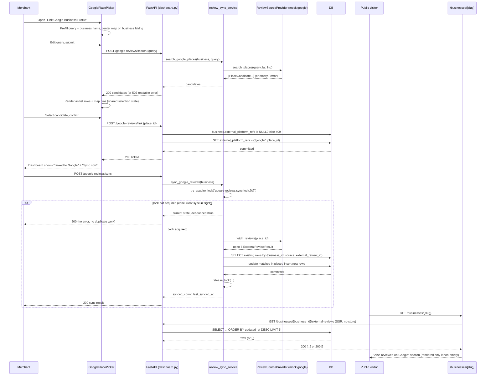

# Slice: S-048 — Multi-platform review aggregator foundation (Google Places)

| Field | Value |
|-------|-------|
| **Slice ID** | S-048 |
| **Phase** | 2 Core |
| **Status** | Specified |
| **Role(s)** | merchant \| admin \| customer |
| **Owner** | PM / 2026-08-16 |

---

## User story

**As a** merchant
**I want** to link my Google Business Profile and see those reviews alongside my native ones
**So that** I can see my full reputation in one place, without checking multiple platforms separately

---

## Background / context

MerchantHub currently only surfaces first-party reviews (customers reviewing directly on-platform).
This slice adds a second, clearly-separate source: a curated sample of a business's Google reviews,
pulled in on demand via the Google Places API. It is the second of three related slices (S-047 home
marketing, S-048 this slice, S-049 AI topic clustering) scoped in the approved plan
`quizzical-knitting-badger.md`. Two product decisions from that plan are load-bearing for every AC
below and must not be re-litigated by Builder or Tester:

1. **External reviews never blend into `Business.average_rating` / `review_count`.** Those fields stay
   100% native — a deliberate trust claim ("every review ties back to a customer"). External reviews
   get their own "Also reviewed on Google" section, visually and structurally separate.
2. **Google Places API only, no automatic polling.** No Zomato/Justdial/TripAdvisor in v1 (no
   ToS-compliant public review API exists for them). Sync is a merchant-triggered "Sync now" button
   only — no scheduler. Google's Place Details API caps at **5 most-relevant reviews per place**; this
   is a real vendor limitation, not a design choice, and must be stated honestly in the UI as a curated
   sample, not a full review history.

---

## Pre-condition (blocking, call out prominently)

**A `GOOGLE_PLACES_API_KEY` with billing enabled, scoped for both Place Details (review fetch) and
Text Search (location picker), must exist before this slice can be tested end-to-end against the real
API.** Until then — and permanently in local dev / CI / pytest — a `mock` review-source provider stands
in, mirroring the existing `backend/app/services/ai/` pattern where `AI_PROVIDER=mock` is the default
for local dev and tests. Builder must implement the mock provider first and can build/test the entire
flow against it; the real `google` provider is validated once the key exists. This is a pre-condition
on end-to-end (real-API) verification, not a blocker on starting the slice.

---

## Acceptance criteria

1. **Given** a merchant viewing their business in the merchant dashboard with no Google place linked yet, **When** they open the "link Google Business Profile" flow, **Then** they see a search box prefilled with the business name and a map (existing Leaflet/OSM component) centered on the business's stored city/lat/lng.
2. **Given** the merchant enters or edits the search text and submits, **When** the search proxy endpoint returns candidate matches, **Then** each candidate appears both as a list row (name, address) and as a pin on the map, and clicking either the pin or the list row selects the same candidate (no separate map-only or list-only path).
3. **Given** the merchant selects a candidate, **When** they confirm the selection, **Then** the business's `external_platform_refs.google` is set to that place's Google Place ID, and the dashboard now shows a "Linked to Google" state instead of the link flow.
4. **Given** a search returns zero candidates (e.g. an obscure or misspelled business name), **When** the merchant views the results, **Then** they see a clear empty state (not a blank list or a raw error) and can retry the search with different text.
5. **Given** the Google Text Search API call fails or times out, **When** the merchant attempts a search, **Then** they see a readable error message (not a raw 500) and the existing linked state, if any, is left untouched.
6. **Given** a business has no `external_platform_refs.google` set, **When** the merchant looks at the dashboard, **Then** the "Sync now" action is disabled/hidden and a "Link your Google Business Profile to sync reviews" prompt is shown instead.
7. **Given** a business has a linked Google place, **When** the merchant clicks "Sync now" for the first time, **Then** up to 5 reviews are fetched and persisted as new `ExternalReview` rows tagged `source="google"`, and the dashboard sync card updates to show the review count and a "last synced" timestamp.
8. **Given** a business already has `ExternalReview` rows from a prior sync, **When** the merchant clicks "Sync now" again and Google returns the same (or overlapping) reviews, **Then** no duplicate `ExternalReview` rows are created for the same `(business_id, source, external_review_id)` — existing rows are updated in place (e.g. refreshed `body`/`rating`/`fetched_at`), not duplicated.
9. **Given** a merchant double-clicks "Sync now" (or two requests land concurrently), **When** the second request arrives while the first is still in flight, **Then** only one fetch actually executes (Redis debounce lock, same pattern as `refresh_merchant_ai_summary_bg` / `try_acquire_lock`), and the second request returns without erroring or creating duplicate rows.
10. **Given** a business has `ExternalReview` rows, **When** any user (customer, merchant, or logged-out visitor) views that business's public profile page, **Then** an "Also reviewed on Google" section is visible, visually distinct from the native reviews list, showing each external review's author name, rating, body, and a link out to the Google listing.
11. **Given** a business has zero `ExternalReview` rows (never linked, or linked but never synced), **When** any user views that business's public profile page, **Then** the "Also reviewed on Google" section does not render at all (no empty placeholder box) — same graceful-degrade convention as other optional home/profile sections.
12. **Given** a business has both native reviews and synced external reviews, **When** any user views `Business.average_rating` / `review_count` on the profile, search results, or `BusinessCard`, **Then** those figures are computed from native `Review` rows only and are numerically unchanged by any sync (verified by comparing the value before and after a sync run in the test suite).
13. **Given** a logged-in customer (non-owning, non-admin) attempts to call the search-proxy or sync endpoints directly, **When** the request is made, **Then** it is rejected with 403 (same RBAC pattern as the existing merchant-dashboard endpoints: owning merchant or admin only).
14. **Given** a merchant who does not own the business (a different merchant account) attempts to link or sync it, **When** the request is made, **Then** it is rejected with 403/404 per the existing `_load_owned_business` ownership-check pattern.
15. **Given** the "Also reviewed on Google" section and the dashboard sync card, **When** a user reads the copy around Google's 5-review cap, **Then** it honestly states this is a curated sample of Google's most-relevant reviews (e.g. "showing up to 5 most-relevant Google reviews"), not implied to be a full review history.
16. **Given** `GOOGLE_PLACES_API_KEY` is unset (local dev / CI / pytest default), **When** the search or sync flow runs, **Then** the mock review-source provider serves deterministic fixture data so the full flow is buildable and testable without a real key.

---

## UX notes

- **Screens / routes:**
  - `/merchant/dashboard` (or the relevant business-detail view inside `MerchantDashboard.tsx`) — new "Google reviews" sync card: link CTA (when unlinked) → search/pick flow → linked state showing review count, last-synced timestamp, and "Sync now" button.
  - `/businesses/[slug]` (public business profile) — new "Also reviewed on Google" section, placed below or alongside the existing native `ReviewsList`, never merged into it.
- **Components to reuse (do not introduce a second map stack):**
  - Existing Leaflet/OSM map component (`BusinessMap.tsx` / `BusinessMapClient.tsx`, backed by `GET /api/v1/maps/config`) — the same component already used on `/search` results and business profile pages. Per the OSM-over-Google-Maps decision documented in ADR-006, this slice must plot Google Places search candidates on that same Leaflet/OSM map, not embed Google Maps JS.
  - Existing `Dashboard`/`MerchantDashboard.tsx` card patterns for the sync card (mirror the AI-summary refresh card's loading/disabled/last-updated states where applicable).
  - `ReviewCard` styling as a visual reference for individual external review entries, but the new "Also reviewed on Google" section should be its own component (`ExternalReviews.tsx` per the plan), not a reuse of `ReviewCard` itself, since external reviews have no `author_id`/no reply/no like affordances.
- **New component:** `GooglePlacePicker.tsx` — search box (prefilled with business name) + candidate list + map pins, per AC 1–5.
- **Empty states / errors:**
  - No candidates found → inline empty state with retry (AC 4).
  - Search/sync API failure → readable error toast/banner, no raw stack trace (AC 5).
  - No external reviews yet → "Also reviewed on Google" section does not render (AC 11); dashboard shows the link/sync prompt instead of a zero-count card.
- **AI disclaimer required?** No. External reviews are raw third-party content, not AI-generated output — no "(suggestion)" language applies to the review text itself. The only required disclaimer is the honest "up to 5 most-relevant reviews" API-limitation caveat (AC 15), which is a data-completeness note, not an AI-suggestion note.

---

## Out of scope

- Automatic/scheduled polling of Google reviews. Manual "Sync now" only. Tracked as a **future backlog item** ("automatic external-review polling"), not part of this slice.
- Any provider other than Google Places (Zomato, Justdial, TripAdvisor, Yelp, etc.) — no public, ToS-compliant review API exists for these; the provider registry is architected to add one later, but none ships now.
- Editing, hiding, replying to, or moderating individual external reviews. They are read-only, sourced content.
- Blending external reviews into `Business.average_rating` or `review_count` in any form (combined average, weighted score, etc.) — explicitly and permanently out of scope for this data model, not just this slice.
- Re-linking a business to a **different** Google place once one is linked (changing the pick). v1 supports linking once; changing the link is deferred pending a decision on what happens to previously-synced `ExternalReview` rows tied to the old place (see Architect open question below).
- Un-linking / removing a linked Google place profile.
- Any AI processing (sentiment, summarization, topic clustering) of external review content — S-049 scopes AI topic clustering for native reviews only; extending it to external reviews is not part of either slice.

---

## Dependencies

- None blocking for Builder to start against the mock provider.
- **`GOOGLE_PLACES_API_KEY`** (billing-enabled, Place Details + Text Search scopes) is required before the `google` provider can be validated end-to-end against the real API — see "Pre-condition" above. Confirm this exists (or is obtainable) before Architect finalizes the tech spec's provider-config section.

---

## Definition of done (PM)

- [ ] All 16 AC verified in test report (`docs/agents/test-reports/TR-S-048.md`), including the mock-provider path and, if the API key is available, at least one real-provider smoke check
- [ ] UX matches notes above — Leaflet/OSM map reused for the picker, no second map stack introduced
- [ ] `README.md` §5 Domain model updated (new `ExternalReview` table, `Business.external_platform_refs`)
- [ ] `README.md` §7 API reference updated (search-proxy + sync endpoints)
- [ ] `README.md` §6 Feature flows updated if a new flow diagram is warranted
- [ ] `README.md` §12 Web ↔ mobile feature parity tracker — new row for "External review sync (Google)" on `/merchant/dashboard` + business profile, mobile status `unimplemented`
- [ ] `README.md` §14 Known gaps (and §16 "built vs next" if investor-visible) updated in the same PR to reflect this feature's scope and the "no auto-polling yet" caveat
- [ ] No new product `.md`/`.txt` checklist created outside `docs/agents/`
- [ ] PM Status set to **Accepted**

---

## Technical specification (Architect)

> Filled by Architect before implementation.

### Provider abstraction (mirrors `app/services/ai/`)

New package `backend/app/services/review_sources/`, structured exactly like `app/services/ai/`
so a future provider (if a ToS-compliant Zomato/Justdial API ever appears) is a drop-in module,
not a rewrite:

- `base.py` — `ReviewSourceProvider` ABC (`provider_name: ClassVar[str]`) with two abstract
  methods:
  - `async def search_places(self, query: str, lat: float | None, lng: float | None) -> list[PlaceCandidate]`
  - `async def fetch_reviews(self, place_id: str) -> list[ExternalReviewResult]`
  - `PlaceCandidate`: `place_id: str, name: str, address: str, latitude: float, longitude: float`
  - `ExternalReviewResult`: `external_review_id: str, author_name: str, author_photo_url: str | None,
    rating: int, body: str | None, language: str | None, external_posted_at: datetime | None,
    source_url: str | None, raw_response: dict`
- `registry.py` — `register_provider` / `create_provider` / `load_providers`, copied verbatim
  from `app/services/ai/registry.py` (same `__init_subclass__` guard is not needed here since
  there's no `abstract=True` base in play yet, but keep the registry shape identical for
  consistency).
- `providers/mock.py` — `@register_provider("mock") class MockReviewSourceProvider`. Deterministic,
  no network, no key required (resolves **Open question 4**):
  - `search_places(...)` always returns 2 fixed `PlaceCandidate`s: one whose `name` echoes the
    query (`f"{query} (Demo Location)"`) at a point ~50m from the business's own lat/lng (or
    `12.9716, 77.5946` if the business has none), and one decoy `"Nearby Cafe (Demo)"` ~150m away.
    `place_id`s are stable strings (`"mock-place-1"`, `"mock-place-2"`) so pytest can assert on
    them directly.
  - `fetch_reviews(place_id)` always returns the same 3 fixed `ExternalReviewResult`s (2 four/five
    star, 1 three-star with `body=None` to exercise the nullable-body path deliberately — see
    Risks), with `external_review_id`s `"mock-review-1..3"`, so re-sync is naturally idempotent
    in tests without extra fixture wiring.
- `providers/google.py` — `@register_provider("google") class GooglePlacesProvider`, `httpx`
  calls to `https://maps.googleapis.com/maps/api/place/textsearch/json` (search, with
  `location`/`radius` bias when the business has lat/lng) and
  `.../place/details/json?fields=name,url,reviews` (reviews), same `httpx.AsyncClient(timeout=...)`
  + `httpx.HTTPError` → readable-error pattern already used in `app/routers/maps.py`'s
  `geocode_address`. Constructs `external_review_id` as `f"{review['time']}:{review['author_name']}"`
  — Google's Places API does not return a stable per-review ID (see Risks); `time` (Google's Unix
  timestamp of the review) plus author name is the most stable available composite key.
- `__init__.py` — `get_review_source_provider() -> ReviewSourceProvider`: if
  `settings.google_places_api_key` is truthy, `create_provider("google")`; otherwise
  `create_provider("mock")`. No gateway/fallback wrapper (unlike `AIGateway`) — a search or sync
  call either serves from the configured provider or surfaces a clear error; silently
  degrading review *content* the way AI degrades to fabricated-but-labeled output is not
  appropriate for third-party review text.
- `app/config.py` — new `google_places_api_key: str = ""` (env `GOOGLE_PLACES_API_KEY`,
  **default `""`, not `"placeholder"`** — the existing `google_maps_api_key` leftover defaults to
  `"placeholder"`, which is truthy and would silently defeat a `bool(...)` check; this field is
  new and must not repeat that). Also `google_reviews_sync_debounce_seconds: int = 20`.

### API contract

| Method | Path | Auth | Request | Response |
|--------|------|------|---------|----------|
| `POST` | `/api/v1/dashboard/merchant/{business_id}/google-reviews/search` | JWT, `MERCHANT`\|`ADMIN` + ownership | `{"query": str}` (min length 2; body only — lat/lng bias comes from the loaded `Business`, not the client) | `200 {"candidates": [{"place_id", "name", "address", "latitude", "longitude"}]}` (empty list is a valid 200, AC4); `502 {"detail": "Couldn't reach Google Places right now"}` on provider timeout/error (AC5) |
| `GET` | `/api/v1/dashboard/merchant/{business_id}/google-reviews` | JWT, `MERCHANT`\|`ADMIN` + ownership | — | `200 {"linked": bool, "place_id": str \| null, "review_count": int, "last_synced_at": datetime \| null}` — powers the dashboard card's unlinked/linked/synced states (AC3, AC6, AC7) |
| `POST` | `/api/v1/dashboard/merchant/{business_id}/google-reviews/link` | JWT, `MERCHANT`\|`ADMIN` + ownership | `{"place_id": str, "name"?: str, "address"?: str}` (`name`/`address` are UI-confirmation echoes only, not persisted) | `200 {"linked": true, "place_id": str}`; `409 {"detail": "Business is already linked to a Google Business Profile"}` if `external_platform_refs.google` is already set (AC3, Open question 3) |
| `POST` | `/api/v1/dashboard/merchant/{business_id}/google-reviews/sync` | JWT, `MERCHANT`\|`ADMIN` + ownership | — (empty body) | `200 {"synced_count": int, "last_synced_at": datetime, "debounced": bool}`; `400 {"detail": "Link a Google Business Profile first"}` if unlinked; `502` on provider failure, existing `ExternalReview` rows left untouched (AC7, AC8, AC9) |
| `GET` | `/api/v1/businesses/{business_id}/external-reviews` | None (public) | — | `200 [{"id", "author_name", "author_photo_url", "rating", "body", "source": "google", "source_url", "external_posted_at"}]`, **max 5 rows**, most-recently-confirmed-present first (`ORDER BY updated_at DESC LIMIT 5`); `[]` when none (AC10, AC11) |

Note on route ordering: `businesses.py` already has a single-segment `GET /{slug}`. The new
`GET /{business_id}/external-reviews` is two path segments, so it cannot collide with `/{slug}`
regardless of registration order — no reordering needed, unlike the `/categories/all` vs
`/{slug}` case this codebase already guards against.

The four `dashboard/merchant/{business_id}/google-reviews*` routes live in
`app/routers/dashboard.py` (reuse `_load_owned_business`, don't duplicate it), calling into a new
`app/services/review_sync_service.py` for all Google/DB logic (routers stay thin). The public
`GET /businesses/{business_id}/external-reviews` lives in `app/routers/businesses.py`, calling a
`list_external_reviews(db, business_id)` helper in the same service module.

### RBAC matrix

| Action | customer (incl. logged-out) | merchant (owner) | merchant (non-owner) | admin |
|--------|------|----------|----------|-------|
| Search Google places | 403 | Allowed | 403/404 (`_load_owned_business`) | Allowed, any business |
| View link/sync status | 403 | Allowed | 403/404 | Allowed, any business |
| Link Google place | 403 | Allowed | 403/404 | Allowed, any business (Open question 2: yes — same capability admin already has for viewing/exporting a merchant's dashboard, not a new privilege class) |
| Sync Google reviews | 403 | Allowed | 403/404 | Allowed, any business |
| View "Also reviewed on Google" (public endpoint) | Allowed (read-only, no auth required) | Allowed | Allowed | Allowed |

All four merchant-dashboard actions use `Depends(require_roles(UserRole.MERCHANT, UserRole.ADMIN))`
+ `_load_owned_business(db, business_id, user)`, identical to every existing endpoint in
`dashboard.py` — no new auth pattern introduced (resolves **Open question 2**).

### Data model impact

- [ ] None  [x] Extend existing  [x] New table(s)

**Details:**

**`Business` — extend.** One new nullable column, no backfill needed:

```python
external_platform_refs: Mapped[dict | None] = mapped_column(JSONB, nullable=True)
```

Same shape as `business_hours` / `ai_positives` / `raw_response` elsewhere in this file: nullable
JSONB, **no `default={}`** (resolves **Open question 1, part 1**) — an unlinked business has
`external_platform_refs IS NULL`, not `{}`. Shape once set: `{"google": "<google_place_id>"}` — a
bare string per platform key (matches AC3's literal wording: "is set to that place's Google Place
ID"), not a nested object; there is deliberately no `linked_at` here because it adds nothing AC7
doesn't already get from `ExternalReview.created_at` on the first synced row (or from the link
call's own timestamp if sync hasn't run yet — the dashboard card's "linked, not yet synced" state
doesn't need a linked-at time per the ACs). `Business.average_rating` / `review_count` are
**not** touched by this column or anything in this slice (AC12) — no code path in
`review_sync_service.py` may call `update_business_rating` or write those two fields, full stop.

`external_platform_refs` is **not** added to `BusinessResponse` / `_to_response()`. It's only ever
read through the merchant-scoped `GET .../google-reviews` status endpoint above. Keeping it out of
the public `BusinessResponse` (used by search, `BusinessCard`, the public profile) is a deliberate
architectural reinforcement of AC12's "never blend" rule — the field structurally cannot leak into
a surface that also carries `average_rating`/`review_count`.

**`ExternalReview` — new table:**

```python
class ExternalReview(Base):
    __tablename__ = "external_reviews"
    __table_args__ = (
        UniqueConstraint("business_id", "source", "external_review_id", name="uq_external_review_source_id"),
    )

    id: Mapped[uuid.UUID] = mapped_column(UUID(as_uuid=True), primary_key=True, default=uuid.uuid4)
    business_id: Mapped[uuid.UUID] = mapped_column(ForeignKey("businesses.id", ondelete="CASCADE"), index=True)
    source: Mapped[str] = mapped_column(String(50), nullable=False)  # "google" today; plain string, not an
                                                                       # enum — see Risks: adding a future
                                                                       # provider must not require a migration.
    external_review_id: Mapped[str] = mapped_column(String(255), nullable=False)
    author_name: Mapped[str] = mapped_column(String(255), nullable=False)
    author_photo_url: Mapped[str | None] = mapped_column(String(512), nullable=True)
    rating: Mapped[int] = mapped_column(Integer, nullable=False)
    body: Mapped[str | None] = mapped_column(Text, nullable=True)  # Google allows rating-only, textless reviews
    language: Mapped[str | None] = mapped_column(String(10), nullable=True)
    source_url: Mapped[str | None] = mapped_column(String(512), nullable=True)  # link to the Google listing (AC10)
    external_posted_at: Mapped[datetime | None] = mapped_column(DateTime(timezone=True), nullable=True)
    raw_response: Mapped[dict | None] = mapped_column(JSONB, nullable=True)  # single review item, AIAnalysis-style
    created_at: Mapped[datetime] = mapped_column(DateTime(timezone=True), server_default=func.now())
    updated_at: Mapped[datetime] = mapped_column(
        DateTime(timezone=True), server_default=func.now(), onupdate=func.now()
    )

    business: Mapped["Business"] = relationship(back_populates="external_reviews")
```

Add `external_reviews: Mapped[list["ExternalReview"]] = relationship(back_populates="business")`
to `Business`.

`UniqueConstraint(business_id, source, external_review_id)` is sufficient for AC8's idempotent
upsert (resolves **Open question 1, part 2**). **Upsert via select-then-update, not
`ON CONFLICT`** — grepped the codebase for `ON CONFLICT`/`on_conflict` and found zero usage
anywhere in `backend/`; every existing write path (`businesses.py`, `reviews.py`,
`payments/featured.py`) either relies on a `UniqueConstraint` + catching `IntegrityError`, or
loads-then-mutates an ORM object. `sync_google_reviews()` therefore:

1. `SELECT` existing `ExternalReview` rows where
   `business_id == business.id AND source == "google" AND external_review_id IN (fetched_ids)`,
   keyed into a dict by `external_review_id`.
2. For each fetched `ExternalReviewResult`: if its `external_review_id` is in that dict, mutate
   the existing row's `author_name`/`author_photo_url`/`rating`/`body`/`source_url`/
   `external_posted_at`/`raw_response` in place (its `updated_at` bumps via `onupdate`); otherwise
   `db.add(ExternalReview(...))`.
3. No deletes. A review that drops out of Google's "5 most relevant" on a later sync is simply not
   refreshed that round — its row goes stale but is not removed (see Risks).

`last_synced_at` for the status endpoint and dashboard card is
`SELECT MAX(updated_at) FROM external_reviews WHERE business_id = :id AND source = 'google'` —
computed on read, not stored redundantly on `Business`, consistent with how `review_count`/
`average_rating` are the only denormalized aggregates this codebase keeps, and those are
explicitly walled off from this feature (AC12).

**Migration:** one Alembic revision — `ALTER TABLE businesses ADD COLUMN external_platform_refs
JSONB NULL` + `CREATE TABLE external_reviews (...)` + the unique constraint + an index on
`external_reviews(business_id)`. No data backfill required (both are additive/nullable).

### Cache / side effects

- **Debounce lock (AC9):** `try_acquire_lock(f"google-reviews:sync-lock:{business_id}", ttl=settings.google_reviews_sync_debounce_seconds)`
  — same helper as `refresh_merchant_ai_summary_bg`, reused as-is (no signature change). If the
  lock is **not** acquired, the sync endpoint does not error or re-fetch: it returns the current
  persisted state (`GET .../google-reviews`'s payload shape) with `"debounced": true`, `200 OK`
  (AC9: "returns without erroring or creating duplicate rows").
- **Deliberate deviation from the AI-summary pattern:** `refresh_merchant_ai_summary_bg` never
  releases its lock early — it's a fire-and-forget debounce where suppressing duplicate work for
  the full TTL is exactly the point. This sync endpoint is **synchronous** (the client is waiting
  on the response to show `synced_count`, per AC7), so blocking a legitimate second click 20
  seconds later just because the first sync already finished 2 seconds ago would be a worse UX
  for no benefit. `review_sync_service.sync_google_reviews()` therefore releases the lock
  explicitly in a `finally` block once the fetch+upsert completes, and the TTL is only a
  crash/timeout safety net. This requires one small addition to `app/services/cache.py`: a
  `release_lock(key: str) -> None` helper, best-effort/fail-open (mirrors `cache_delete_pattern`'s
  fail-open convention, not `try_acquire_lock`'s fail-closed one — a failed release just means the
  TTL becomes the fallback, which is acceptable here).
- **No `cache_delete_pattern("search:*")` call anywhere in this slice.** Linking or syncing
  external reviews never changes anything `search:*` caches (search results, `BusinessCard`,
  `average_rating`/`review_count` are all native-only per AC12) — flagged explicitly so Builder
  doesn't reflexively copy the invalidation call from `businesses.py`/`reviews.py`.
- No caching layer added for the Google Text Search / Place Details calls themselves in v1 (see
  Risks — API cost).

### Frontend

- **Routes:**
  - `/merchant/dashboard` (existing, client-rendered `MerchantDashboard.tsx`) — new "Google
    reviews" card.
  - `/businesses/[slug]` (existing, `frontend/src/app/businesses/[slug]/page.tsx`, an `async`
    Server Component) — new "Also reviewed on Google" section.
- **Rendering:**
  - Dashboard card: **CSR** — `MerchantDashboard.tsx` is already `"use client"`; fetches
    `GET .../google-reviews` status and drives `GooglePlacePicker`/sync actions the same way the
    existing "Refresh AI insights" button drives `refreshingAi` state.
  - Public profile section: **SSR** — `page.tsx` already does `reviewList = await reviews.list(business.id)`
    server-side and passes it into the client `ReviewsList`. Mirror this exactly: add
    `externalReviewList = await externalReviews.list(business.id)` (new `lib/api.ts` namespace,
    `cache: "no-store"` like the rest of that page's SSR fetches) and pass it into a plain **Server
    Component** `<ExternalReviews reviews={externalReviewList} />` — no client interactivity is
    needed for a read-only list, so it does not need `"use client"`.
- **Components (new):**
  - `GooglePlacePicker.tsx` (`frontend/src/components/`, `"use client"`). Props:
    `{ businessId: string; businessName: string; center: [number, number] | null; onLinked: () => void }`.
    Internal state: `query` (initialized to `businessName`, AC1), `candidates: PlaceCandidate[]`,
    `selectedPlaceId`, `loading`, `error`. Search submit calls the new
    `dashboard.searchGooglePlaces(businessId, query)`; renders results as list rows **and** as
    pins via the existing `BusinessMapClient` (mapping `PlaceCandidate` → `MapMarker`, no `slug`
    so pins are non-navigating), with row click and pin click both setting the same
    `selectedPlaceId` state (AC2 — one selection path, not two). Confirm button calls
    `dashboard.linkGooglePlace(businessId, selectedPlaceId, name, address)` then `onLinked()`.
    Zero candidates → inline empty state + retry (AC4), reusing the same search box. Search
    failure → inline error banner, selection/linked state untouched (AC5). **Does not** introduce
    a second map stack — imports `BusinessMapClient`, not `react-leaflet` directly.
  - `ExternalReviews.tsx` (`frontend/src/components/`, plain Server Component). Props:
    `{ reviews: ExternalReviewResponse[] }`. Returns `null` immediately if `reviews.length === 0`
    (AC11 — no empty placeholder box). Otherwise renders a "Also reviewed on Google" heading, the
    AC15 caveat copy ("Showing up to 5 most-relevant Google reviews"), and one card per review
    (author name/photo, star rating, body — or an italic "No written review" fallback when `body`
    is `null`, and a "View on Google" link via `source_url`). Visually distinct container
    (different background/border) from `ReviewsList`; does **not** reuse `ReviewCard` (no
    `author_id`, no reply, no like affordance — per PM's UX notes).
- **`MerchantDashboard.tsx` change:** new card next to the existing AI-summary card. States:
  unlinked → "Link your Google Business Profile to sync reviews" prompt + CTA opening
  `GooglePlacePicker` (AC6); linked, `review_count === 0` → "Sync now" enabled, no count yet;
  linked + synced → review count, formatted `last_synced_at`, "Sync now" (disabled + "Syncing..."
  while in flight, mirroring `refreshingAi`/`disabled={refreshingAi}`); sync error → inline error
  text, existing count/timestamp left as-is (AC5's "leave existing state untouched" principle
  applied to sync too).
- **`lib/api.ts` additions:** `dashboard.searchGooglePlaces`, `dashboard.getGoogleReviewsStatus`,
  `dashboard.linkGooglePlace`, `dashboard.syncGoogleReviews` (new methods on the existing
  `dashboard` export, alongside `refreshInsights`); new `externalReviews = { list: (businessId) => apiFetch(...) }`
  export (public, no auth header needed, same shape as `reviews.list`).

### Flow



### Architect checklist

- [x] API contract defined
- [x] RBAC matrix complete
- [x] Data model impact documented
- [x] Cache invalidation considered
- [x] Uses AI/storage abstractions where applicable (new `review_sources/` provider registry
      mirrors `ai/` exactly; no direct Google SDK/HTTP calls from routers)
- [x] ERD/API/FLOWS updates noted (README §5, §7, §6 updates listed in PM's Definition of Done —
      Builder/PM to apply once code lands, per the Architect role's handoff duty)

### Risks / tradeoffs

- **Google's 5-review cap is a real vendor limit, and "most relevant" can shift between syncs.**
  The Place Details API returns at most 5 reviews, chosen by Google's own undisclosed relevance
  ranking — a review present today can be absent tomorrow even with no user action. This slice
  does not delete rows that drop out of the top 5 (no pruning job in v1); instead, the public
  read endpoint caps display at `ORDER BY updated_at DESC LIMIT 5`, so the section always shows at
  most 5 and skews toward whichever reviews were most recently reconfirmed by a sync. Over many
  syncs, `external_reviews` can accumulate more than 5 historical rows per business; only the
  freshest 5 ever render. This is an accepted v1 behavior, not a bug — flag it to Tester so a
  "row count in DB > 5 after repeated syncs" observation isn't mistaken for an AC8 violation.
- **Google Places API has no stable per-review ID.** `external_review_id` is synthesized as
  `f"{time}:{author_name}"`. This is stable across syncs in the common case (Google does not
  appear to alter a review's `time`), but a same-second review from two authors with an identical
  name, or a `time` field Google omits/changes, could in theory collide or fail to match on
  re-sync (producing a duplicate row instead of an update). No stronger key is available from the
  API; flagged for Tester to probe with the mock provider's fixed IDs (deterministic) rather than
  assuming this can be fully verified against the real API.
- **API cost/billing.** Text Search and Place Details are billed per call. Manual-trigger-only
  (no polling) plus the debounce lock bound cost per click, but there is no per-day/per-user rate
  limit in v1 beyond the 20s debounce — a merchant clicking "Sync now" repeatedly across a session
  still generates one billed call per click. Acceptable for v1 given low expected usage; revisit
  with a daily cap if it becomes a real cost line item.
- **Mock-vs-real provider divergence.** `MockReviewSourceProvider` is deterministic fixture data
  and cannot exercise real Google response quirks: missing `text` on rating-only reviews (the mock
  deliberately includes one textless fixture to cover this), non-English `language` values, HTML
  entities in `author_name`/`body`, or Google-side rate-limit/quota errors. The mock keeps the
  whole flow buildable and testable without a key (AC16), but only the real-provider smoke check
  in the DoD catches these — treat that smoke check as load-bearing, not optional, once the API
  key exists.
- **`external_platform_refs` as a bare JSONB dict, not a normalized link table.** Chosen to match
  existing `Business` JSONB fields (`business_hours`, `ai_positives`) and because v1 has exactly
  one provider and both re-linking and un-linking are out of scope. If a second provider or
  re-linking ships later, this likely needs to become a small `business_external_links` table
  (one row per business+provider, with its own `linked_at`/history) — noted here so that future
  work isn't surprised, not something this slice needs to solve.
- **`ExternalReview.source` is a plain `String(50)`, not a Python `Enum` column** (unlike
  `BusinessStatus`/`ReviewStatus`/`Sentiment`). Deliberate: the whole point of the provider
  registry is that a future source ships as a new module with no schema migration; an `Enum`
  column would force a migration per provider, defeating that.

---

## Open questions for Architect (flagged by PM)

1. **Migration shape:** `Business.external_platform_refs` (JSONB, nullable) and the new `ExternalReview`
   table both need an Alembic migration. Please confirm default value (`NULL` vs `{}`) for
   `external_platform_refs` on existing rows, and confirm the `UniqueConstraint(business_id, source,
   external_review_id)` on `ExternalReview` is sufficient for the idempotent-upsert AC (8) — i.e. whether
   the sync endpoint should use an `ON CONFLICT DO UPDATE` upsert or a select-then-update pattern
   consistent with how the rest of the backend handles idempotent writes.
2. **RBAC exact shape:** PM assumes owning-merchant + admin only for both the search-proxy and sync
   endpoints, following the existing `require_roles(UserRole.MERCHANT, UserRole.ADMIN)` +
   `_load_owned_business` pattern in `backend/app/routers/dashboard.py`. Please confirm this matrix in
   the RBAC section above and decide whether admin should be able to *link* a business on a merchant's
   behalf (not just view), since that's a slightly different capability than the read-only admin access
   patterns elsewhere in the dashboard.
3. **Re-link handling (deferred, not blocking):** since re-linking to a different Google place is out of
   scope for v1 (see "Out of scope"), please confirm the API should simply reject a second link attempt
   once `external_platform_refs.google` is set (rather than silently overwriting it), so the UI can show
   a clear "already linked" state rather than a confusing partial-overwrite.
4. **Mock provider fixture shape:** please define what `MockReviewSourceProvider` returns (fixed
   `ExternalReviewResult` list) so it's usable both in pytest and as a stable local-dev experience, mirroring
   how `MockAIProvider` returns deterministic output.

---

## Links

- Test plan: `docs/agents/test-plans/TP-S-048-*.md`
- Test report: `docs/agents/test-reports/TR-S-048.md`
- ADR: `docs/agents/adrs/ADR-006-mobile-osm-flutter-map.md` (map-stack precedent; no new ADR expected for this slice unless Architect decides otherwise)

---

## Changelog

| Date | Agent | Change |
|------|-------|--------|
| 2026-08-16 | PM | Created slice |
| 2026-08-16 | Architect | Filled technical specification; resolved all 4 open questions inline (see Data model impact, RBAC matrix, Provider abstraction sections); Status → Specified. Signaling Builder to implement. |
