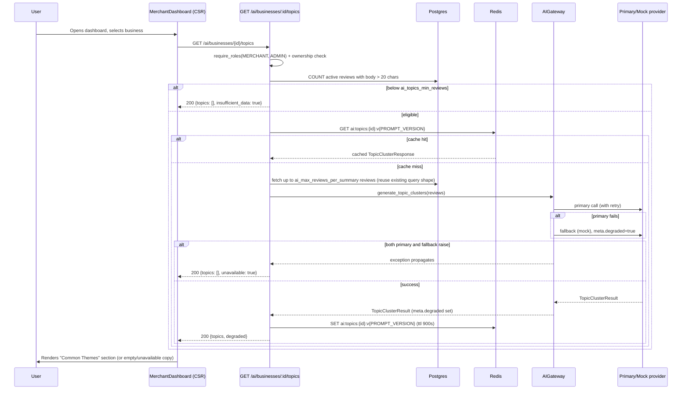

# Slice: S-049 — AI topic clustering for merchant reviews

| Field | Value |
|-------|-------|
| **Slice ID** | S-049 |
| **Phase** | 3 AI |
| **Status** | Accepted |
| **Role(s)** | merchant \| admin |
| **Owner** | PM / 2026-08-16 |

---

## User story

**As a** merchant  
**I want** to see my reviews grouped into named themes with counts (e.g. "Service speed" mentioned in 12 reviews, mostly positive)  
**So that** I know what's actually driving satisfaction or complaints without reading every review myself

---

## Acceptance criteria

1. **Given** an approved business with enough recent review text to cluster (threshold set by Architect, e.g. ≥5 text reviews — see Dependencies/Architect note), **when** the merchant opens their dashboard and the `AIInsights` panel loads, **then** a "Common Themes" section renders a list of named topics (e.g. "Service speed", "Parking"), each showing a mention count and a sentiment indicator (positive / negative / mixed), ordered by count descending.

2. **Given** the Common Themes section is showing real topics, **when** rendered, **then** each topic is visually labeled as a suggestion (matching the existing `(suggestion)` convention already used on the trend list in `AIInsights.tsx`), and the panel's existing top-level disclaimer ("Suggestions only — not definitive judgments. Verify in person before acting.") continues to cover this section — no topic is presented as a verified fact.

3. **Given** the configured AI provider is unavailable and the request falls back to the mock/deterministic provider (the same `meta.degraded` convention used elsewhere in `backend/app/services/ai/`), **when** the merchant views Common Themes, **then** the section still renders (fabricated-but-plausible topics from `MockAIProvider`) and the UI surfaces the degraded state the same way the existing trend section does (e.g. "Mock/degraded data." prefix), so the merchant is never shown fabricated topics presented as if they came from a real model run.

4. **Given** a business with too few reviews (or too little review text) to cluster meaningfully, **when** the merchant views the panel, **then** the Common Themes section shows a plain-language empty state (e.g. "Not enough reviews yet to identify common themes") instead of an empty list, a spinner stuck forever, or an error.

5. **Given** a customer (not the business owner) or an unauthenticated visitor, **when** they attempt to load topic-clustering data for a business (directly or via UI), **then** the request is rejected/not shown — Common Themes is merchant-owner and admin only, matching the existing `require_roles(MERCHANT, ADMIN)` + ownership pattern already used for `ai_merchant_summary`.

6. **Given** an admin viewing a merchant's business (e.g. via an admin-facing equivalent of the dashboard, if one exists), **when** they load Common Themes, **then** they see the same topic data a merchant owner would see for that business.

7. **Given** the AI provider call for topic clustering errors outright (not just falls back to mock), **when** the merchant views the panel, **then** the failure is handled gracefully — no unhandled panel crash, and the merchant sees either the empty state or a short "Common themes are temporarily unavailable" message, never a raw error.

---

## UX notes

- **Screens/routes:** Merchant dashboard (wherever `AIInsights` is currently mounted, e.g. `MerchantDashboard.tsx`). No new route.
- **Components to reuse:** `AIInsights.tsx` gets a new "Common Themes" section added alongside the existing Overall Summary / Frequently Mentioned Positives & Complaints / Suggested Owner Responses / AI Trend Suggestion sections. Reuse the panel's existing card/section styling (`border-brand-400` accent, muted text, section headers) rather than introducing new visual patterns. Topics render as small chips or a compact list — count + sentiment badge per topic, consistent with how the existing trend list line items are styled.
- **Suggestion labeling:** every topic must carry the `(suggestion)` marker or equivalent inline copy, per `frontend/CLAUDE.md`: "AI UI must say 'suggestion', not fact."
- **Empty states:** too-few-reviews state described in AC4 above — short, friendly, no dead air or spinner. Degraded/mock state described in AC3 reuses the existing "Mock/degraded data." prefix pattern already in the trend section.
- **Errors:** AC7 — panel must not crash; failure collapses to the same empty-state treatment or a short unavailable message.

---

## Out of scope

- No retraining or fine-tuning of any model — this is prompt/response shaping on the existing provider abstraction only.
- No click-through from a topic chip to the underlying reviews that mention it — that's a natural next slice, not this one.
- No cross-business topic comparison (e.g. "how does 'Service speed' compare to other cafés in your city") — out of scope for this pass.
- No new external API or provider — this extends the existing `AI_PROVIDER` abstraction (mock provider works out of the box; no new env var required, unlike S-048's Google Places dependency).
- No changes to the existing `positives`/`complaints` flat-list fields (`Business.ai_positives`/`ai_complaints`) or the existing "Frequently Mentioned Positives/Complaints" section — Common Themes is additive, not a replacement, in this slice.

---

## Dependencies

- None blocking. Works with the existing `AI_PROVIDER` env var and the existing mock-provider fallback already in place in `backend/app/services/ai/` — no new external API needed (unlike S-048, which needs a `GOOGLE_PLACES_API_KEY`).
- Extends the existing `Operation` enum / `AIProvider` ABC pattern in `backend/app/services/ai/base.py` (new `Operation.TOPIC_CLUSTERING` + a new `TopicClusterResult` dataclass) — Architect to confirm exact shape and the per-provider implementation plan across `MockAIProvider`, the shared `OpenAISpec`-based OpenAI-family providers, and the Anthropic provider.
- Not dependent on S-047 or S-048 (the other two slices in the same planning pass) — can ship independently and in any order relative to them.

---

## Definition of done (PM)

- [x] All 7 AC verified in a test report (`docs/agents/test-reports/TR-S-049-ai-topic-clustering.md`) mapped 1:1
- [x] UX matches notes above, including suggestion labeling on every topic and both empty/degraded states manually spot-checked
- [x] `README.md` §7 API reference updated for the new `GET /ai/businesses/{id}/topics` endpoint (or equivalent path the Architect settles on)
- [x] `README.md` §12 Web ↔ mobile feature parity tracker has a new row for AI topic clustering on `/merchant/dashboard`, status `unimplemented` on mobile, in the same PR
- [x] `README.md` §14 (Known gaps & roadmap) updated to reflect the gap closing, and §16 ("built vs next") updated if investor-visible, same PR
- [x] No new product `.md`/`.txt` checklist file created — only this slice file and the standard `docs/agents/` artifacts (test plan/report)
- [x] Code lands on a feature branch + PR, never committed directly to `main`
- [x] PM Status set to **Accepted** only after Tester report shows all AC passing

---

## Technical specification (Architect)

### Open questions — resolved

**1. "Too few reviews" threshold (AC4).** A business is eligible for clustering when it has
**≥ 5 `ACTIVE` reviews whose trimmed `body` is > 20 chars**. Both numbers are new settings
(`ai_topics_min_reviews: int = 5`, `ai_topics_min_review_chars: int = 20` in `app/config.py`),
not hardcoded, so they can be tuned/tested without a code change — mirrors how
`ai_max_reviews_per_summary` / `ai_max_review_chars` are already settings, not literals. The
eligibility check is a plain DB count query and runs **before** any AI provider call — a business
below threshold never pays for (or waits on) an LLM call; the endpoint returns the AC4 empty
state directly.

**2. `TopicClusterResult` shape + endpoint contract.** See below. `sentiment` on a topic is a
**3-value domain — `positive | negative | mixed`** — deliberately *not* the DB `Sentiment` enum
(`positive | neutral | negative`), because "mixed" (this topic gets both praise and complaints)
is a different, sharper signal for a topic aggregate than "neutral" (nobody had a strong opinion)
is for a single review. Do not reuse `coerce_sentiment()` for this; add a small local coercion
in the topic-clustering path that maps free-form model output onto these three tokens (default
`"mixed"` when ambiguous, never raise — same non-negotiable as `coerce_sentiment`'s docstring).

**3. Synchronous vs background.** **Synchronous on-request, not persisted, Redis-cached
(cache-aside, short TTL).** Reasoning, from reading `business_service.py` first as instructed:
the existing merchant-summary background+debounce-lock pattern exists to solve one specific
problem — *N reviews created in a burst each schedule a background refresh; the Redis `SET NX
EX` lock coalesces that into one* (see `refresh_merchant_ai_summary_bg`'s docstring). Topic
clustering is never triggered by a review write — it only runs when a merchant/admin opens their
own dashboard, which is bounded, authenticated, single-tenant traffic. The write-burst stampede
the debounce lock guards against does not exist here, so copying that machinery (background task
+ lock + new `Business` columns to hold the last computed result) would be solving a problem this
slice doesn't have, at the cost of new schema and a staleness-invalidation question ("when do
persisted topics get refreshed as new reviews land?") that the summary pattern also has to carry.
The *other* principle behind the existing endpoints — "a GET should not have unbounded latency
(or cost) hiding behind it" (see `get_merchant_insights`'s docstring) — **does** still apply, and
is addressed without persistence: a Redis cache-aside keyed on `business_id` + `PROMPT_VERSION`
with a bounded TTL (`ai_topics_cache_ttl_seconds: int = 900`, i.e. 15 min) means only the first
dashboard load in a 15-minute window pays the LLM call; every reload within that window is a
cheap Redis read. This is the same tier as the existing `search:*` Redis cache, not a
`Business`-column "materialized fact" like `ai_merchant_summary` (which several other read paths
beyond the dashboard consume) — topics have exactly one consumer (this panel), so DB persistence
buys nothing today. Accepted tradeoff: topics can lag up to 15 minutes behind the newest review
(documented under Risks below).

### API contract

| Method | Path | Auth | Request | Response |
|--------|------|------|---------|----------|
| GET | `/api/v1/ai/businesses/{business_id}/topics` | `require_roles(MERCHANT, ADMIN)` + ownership (merchant must own `business_id`; admin unrestricted) | Path: `business_id` (UUID). No query params. | `200 TopicClusterResponse` (see below). `404` if business doesn't exist. `403` if merchant doesn't own the business. `401` if unauthenticated. Never a `5xx` for a downstream AI failure — see AC7 handling below. |

**`TopicClusterResponse` (new Pydantic schema in `app/schemas/__init__.py`, alongside
`MerchantInsightsResponse`):**

```python
class TopicItem(BaseModel):
    label: str
    count: int
    sentiment: Literal["positive", "negative", "mixed"]
    example_quote: str

class TopicClusterResponse(BaseModel):
    business_id: UUID
    topics: list[TopicItem] = []
    degraded: bool = False           # AC3 — fallback/mock provider served this
    insufficient_data: bool = False  # AC4 — below the eligibility threshold, no AI call made
    unavailable: bool = False        # AC7 — AI call errored outright (not even the fallback worked)
```

`topics`, `insufficient_data`, and `unavailable` are mutually exclusive in practice: exactly one
of "empty list + `insufficient_data=True`", "empty list + `unavailable=True`", or "populated
`topics` (with `degraded` set appropriately)" is returned per call. The frontend switches on
`insufficient_data` / `unavailable` before rendering the topic list, same shape as how
`AIInsights.tsx` already gates the trend section on `degraded`.

**New `Operation` + result type in `app/services/ai/base.py`:**

```python
class Operation(str, enum.Enum):
    REVIEW_TEXT = "review_text"
    IMAGE = "image"
    MERCHANT_SUMMARY = "merchant_summary"
    TOPIC_CLUSTERING = "topic_clustering"   # new

@dataclass
class TopicClusterResult:
    topics: list[dict[str, Any]]  # each: {label: str, count: int, sentiment: str, example_quote: str}
    raw_response: dict[str, Any] = field(default_factory=dict)
    meta: AICallMeta = field(default_factory=AICallMeta)
```

Add `generate_topic_clusters(self, reviews: list[dict[str, Any]], context: dict[str, Any] |
None = None) -> TopicClusterResult` as a new `@abc.abstractmethod` on `AIProvider` — this is a
breaking change to the ABC by design (Python enforces every subclass implements it), so the
Builder must implement it in all three places at once or the app fails to import:

- `providers/mock.py` (`MockAIProvider`) — deterministic keyword-bucket topics (reuse the
  existing `NEGATIVE_WORDS`/`POSITIVE_WORDS` lists to assign a sentiment per fabricated topic),
  same spirit as `generate_merchant_summary`'s canned trends.
- `providers/openai_family.py` (`OpenAICompatibleProvider`, covers openai/deepseek/groq/gemini/
  qwen/glm/kimi via `OpenAISpec`) — one more method calling the existing shared `self._chat(...)`
  helper with a new `prompts.TOPIC_CLUSTERING_SYSTEM` string.
- `providers/anthropic.py` (`AnthropicProvider`) — one more method calling the existing shared
  `self._messages(...)` helper with the same prompt.
- `gateway.py` (`AIGateway`) — add `TopicClusterResult` to the `_ResultT` TypeVar and a
  `generate_topic_clusters` passthrough via `self._run(...)`, identical shape to the existing
  three `_run`-wrapped methods. This is what gives AC3 (fallback → mock, `meta.degraded=True`)
  for free — no bespoke fallback logic needed in the router or service.
- `prompts.py` — add `TOPIC_CLUSTERING_SYSTEM` ("Group these reviews into 3–6 common themes.
  Return JSON: topics (array of {label, count, sentiment: positive|negative|mixed,
  example_quote}). Frame as suggestions, not facts.") next to the other three prompts; no
  `PROMPT_VERSION` bump needed (additive prompt, not a change to an existing one), but the new
  Redis cache key below still includes `PROMPT_VERSION` so a *future* prompt edit invalidates
  cached topics the same way it's documented to invalidate other AI caches.

### RBAC matrix

| Action | customer | merchant | admin |
|--------|----------|----------|-------|
| `GET /ai/businesses/{id}/topics` | ✗ 401/403 (AC5) | ✓ own business only, else 403 (AC5) | ✓ any business (AC6) |

Identical ownership check to `get_merchant_insights` in `app/routers/ai.py`: load `Merchant` for
`user.id`, 403 if `business.merchant_id != merchant.id`. Admins skip the ownership check
entirely, same as today.

### Data model impact

- [x] None  [ ] Extend existing  [ ] New table(s)

**Details:** No new table, no new `Business` columns. Topic clusters are a computed, ephemeral
result — see open question 3 above for the explicit reasoning. New config only (`app/config.py`):
`ai_topics_min_reviews: int = 5`, `ai_topics_min_review_chars: int = 20`,
`ai_topics_cache_ttl_seconds: int = 900`. No `README.md` §5 Domain model change needed. No ERD
change.

### Cache / side effects

- **Redis cache-aside**, not `search:*` (topics never appear in search results, so no
  `cache_delete_pattern("search:*")` interaction). Key: `ai:topics:{business_id}:v{PROMPT_VERSION}`.
  TTL: `ai_topics_cache_ttl_seconds` (900s default). Uses the existing `cache_get`/`cache_set`
  helpers in `app/services/cache.py`, which already fail open on a Redis outage — consistent with
  every other cache read/write in this codebase (contrast with `try_acquire_lock`'s deliberate
  fail-closed, which does not apply here since nothing here is a stampede-protection lock).
- Cache is written **only on a successful AI call** (real or degraded-to-mock). A provider error
  that reaches AC7's `unavailable=True` path is never cached, so the next request retries rather
  than being stuck serving "temporarily unavailable" for the rest of the TTL window.
- Eligibility checks (AC4, below-threshold) are **not cached** — they're a cheap `COUNT` query
  against `reviews`, re-run every request; caching a "not enough reviews yet" result is not worth
  the complexity of invalidating it the moment review #5 lands.
- No new invalidation hook on review create/approve — the 15-minute TTL is the only staleness
  bound (see Risks below). This keeps the slice additive; a future slice could add
  `cache_delete_pattern(f"ai:topics:{business_id}:*")` to the review-approval path if the lag
  proves to matter in practice.

### Frontend

- **Route:** No new route — same `/merchant/dashboard` page (`MerchantDashboard.tsx`), which is
  already `"use client"`.
- **Rendering:** CSR. The dashboard is fully client-rendered today (`auth.me()`,
  `businesses.mine()`, `dashboard.insights()` all fire from `useEffect`); topics follow the same
  pattern rather than introducing a mixed SSR/CSR split for one panel.
- **Components (reuse first):**
  - `app/lib/api.ts`: add `dashboard.topics(businessId)` → `apiFetch<TopicClusterResponse>(
    "/api/v1/ai/businesses/${id}/topics")`, next to the existing `dashboard.insights` /
    `dashboard.refreshInsights`.
  - `MerchantDashboard.tsx`: add a `topics` state slot, fetched alongside `insights` inside
    `loadBusiness` (same non-blocking `.catch(() => null)` pattern already used for `insights`,
    so a topics failure never blocks the rest of the dashboard from rendering).
  - `AIInsights.tsx`: extend the `insights` prop with `topics?: TopicItem[]`,
    `topics_degraded?: boolean`, `topics_insufficient_data?: boolean`, `topics_unavailable?:
    boolean` (flat fields, matching the existing flat-prop style rather than a nested object).
    Add a new "Common Themes" section, same card/section conventions as the existing four
    sections (`border-brand-400`/muted-text pattern, no new visual language):
    - `topics_insufficient_data` → plain-language empty state: *"Not enough reviews yet to
      identify common themes."* (AC4)
    - `topics_unavailable` → *"Common themes are temporarily unavailable."* (AC7)
    - Otherwise, render each topic as a compact chip/line: `{label} — {count} mentions ·
      {sentiment} (suggestion)`, prefixed with `"Mock/degraded data. "` when `topics_degraded`
      is true, exactly mirroring the existing trend-section degraded prefix at
      `AIInsights.tsx` L61. Every topic line carries the `(suggestion)` suffix per AC2 — the
      panel's existing top-level disclaimer continues to apply, no new disclaimer text needed.

### Flow



### Architect checklist

- [x] API contract defined
- [x] RBAC matrix complete
- [x] Data model impact documented
- [x] Cache invalidation considered
- [x] Uses AI/storage abstractions where applicable
- [x] ERD/API/FLOWS updates noted

### Risks / tradeoffs

- **LLM cost per request, bounded but not eliminated.** Every eligible business pays one LLM call
  per 15-minute cache window while its dashboard is actively viewed — same order of magnitude
  as `generate_merchant_summary` (same review-count/char caps reused: `ai_max_reviews_per_summary`,
  `ai_max_review_chars`), but this is a *second* LLM call per dashboard session on top of the
  existing summary refresh. If cost becomes a concern, lengthening `ai_topics_cache_ttl_seconds`
  is a one-line config change with no code impact.
- **Topic label consistency across calls.** Free-text LLM-generated labels ("Service speed" vs.
  "Speed of service") are not guaranteed stable across cache expiries or provider swaps — there's
  no canonical topic taxonomy/ID in this slice. Acceptable because Out of scope already excludes
  click-through from a topic to its underlying reviews (which would need a stable ID); a future
  slice introducing that would also need to introduce topic identity, at which point this
  tradeoff should be revisited.
- **Redis fail-open on cache outage.** Consistent with the rest of the cache layer, a Redis
  outage means every request pays the LLM call directly rather than 5xx-ing — but it also means
  cost/latency protection silently disappears exactly when Redis is down. Same accepted tradeoff
  as `search:*` caching elsewhere in the app; not treated as a new risk specific to this slice.
- **New abstract method on `AIProvider`.** Adding `generate_topic_clusters` as `@abc.abstractmethod`
  is a deliberate breaking change — every current and future provider must implement it. This is
  consistent with how the ABC already forces `analyze_image` to exist even on providers that
  `raise NotImplementedError` for it (see `AnthropicProvider.analyze_image`); if a future provider
  genuinely cannot support clustering, the same "raise `NotImplementedError` with a comment
  explaining why" pattern applies, and the gateway's fallback covers it as long as the *fallback*
  provider (mock by default) implements it, which it always will.
- **Staleness window.** Topics can lag up to `ai_topics_cache_ttl_seconds` (15 min) behind the
  newest review — accepted per the sync-vs-background decision above; not wired to review-write
  invalidation in this slice.

---

## Links

- Test plan: `docs/agents/test-plans/TP-S-049-*.md`
- Test report: `docs/agents/test-reports/TR-S-049-*.md`
- ADR: `docs/agents/adrs/ADR-XXX-*.md` (if any)

---

## Changelog

| Date | Agent | Change |
|------|-------|--------|
| 2026-08-16 | PM | Created slice. Scoped from the "Review Aggregation, AI Topic Clustering & Home Marketing Additions" plan (Slice 3 / S-049). Extends the existing `AIProvider` abstraction with a new `Operation.TOPIC_CLUSTERING`; no new external API dependency. |
| 2026-08-16 | Architect | Filled Technical specification. Resolved all 3 open questions: threshold ≥5 reviews with body >20 chars (AC4, both as new settings); `TopicClusterResult`/`TopicClusterResponse` shape with a 3-value `positive\|negative\|mixed` sentiment domain (deliberately not the DB `Sentiment` enum); synchronous on-request with a Redis cache-aside (15 min TTL, keyed by `PROMPT_VERSION`) rather than the existing background+debounce+persisted-column pattern, since the debounce lock in `business_service.py` protects against a write-triggered stampede that doesn't exist here. New `GET /api/v1/ai/businesses/{id}/topics`, RBAC mirrors `ai_merchant_summary`. No data model change (ephemeral, cached, not persisted). Status → Specified. |
| 2026-08-16 | Builder | Implemented `Operation.TOPIC_CLUSTERING` + `TopicClusterResult`/`coerce_topic_sentiment` in `ai/base.py`; `generate_topic_clusters` across `MockAIProvider`, `OpenAICompatibleProvider`, `AnthropicProvider`, and `AIGateway` passthrough; `TOPIC_CLUSTERING_SYSTEM` prompt; new settings (`ai_topics_min_reviews`, `ai_topics_min_review_chars`, `ai_topics_cache_ttl_seconds`); `TopicItem`/`TopicClusterResponse` schemas; `GET /api/v1/ai/businesses/{id}/topics` in `routers/ai.py` (eligibility gate before any AI call, Redis cache-aside, graceful `unavailable` on error). Frontend: `dashboard.topics()` in `api.ts`, `MerchantDashboard.tsx` fetch wiring, new "Common Themes" section in `AIInsights.tsx`. |
| 2026-08-16 | Tester | Test plan + `backend/tests/test_ai_topics.py` (11 tests) + `TestCoerceTopicSentiment` in `test_ai_contract.py` (23 cases) + `frontend/.../AIInsights.test.tsx` (7 tests). Result: 6/7 AC pass, AC1 failed — topics were not ordered by count descending (router returned provider's raw bucket order). Also found and fixed a pre-existing-test regression in `MerchantDashboard.test.tsx`'s shared `dashboard` mock (missing `topics`). Recommendation: Rework. |
| 2026-08-16 | PM | Fixed AC1: sort `cluster_result.topics` by count descending in `routers/ai.py::get_topic_clusters` before caching/returning (provider-agnostic, no schema change). Re-ran `test_ai_topics.py` (11/11 pass, including the ordering test) and the full AI-related backend suite (97/97) plus full frontend suite (36 suites/168 tests) — all green. All 7 AC now verified passing per `docs/agents/test-reports/TR-S-049-ai-topic-clustering.md` (post-fix). README §7/§12/§14/§16 updated same PR. Status: Specified → **Accepted**. |
