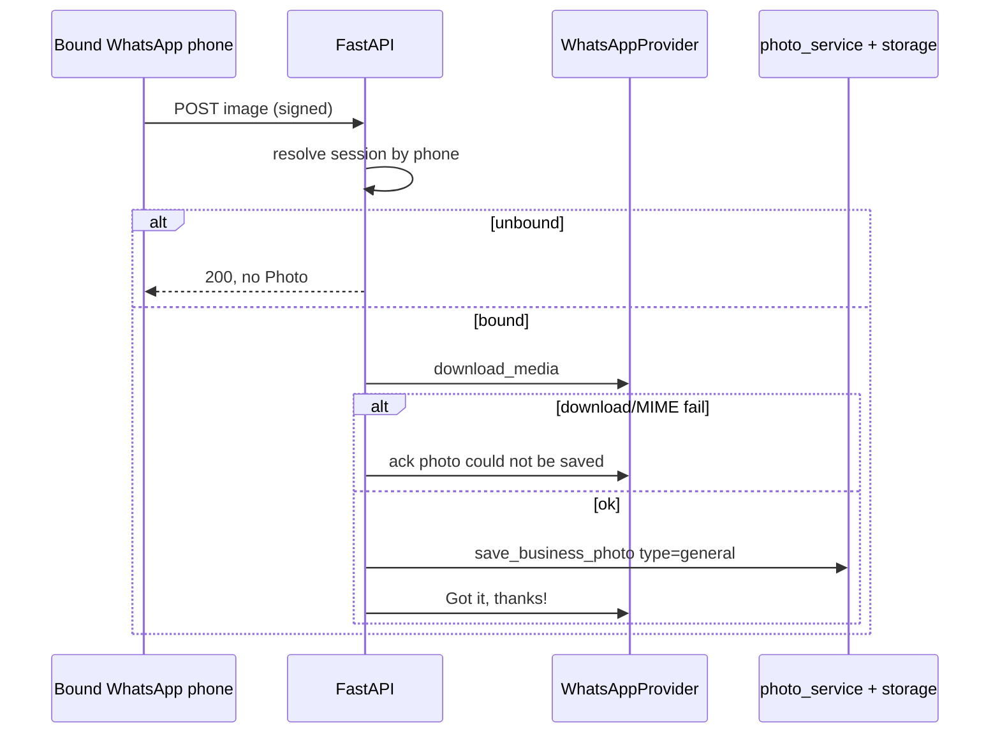

# Slice: S-051 — Photo ingestion via WhatsApp

| Field | Value |
|-------|-------|
| **Slice ID** | S-051 |
| **Phase** | 2 Core |
| **Status** | Testing |
| **Role(s)** | merchant \| admin |
| **Owner** | PM / 2026-08-16 |

---

## User story

**As a** merchant  
**I want** photos I send on the bound WhatsApp chat to appear on my business gallery  
**So that** I can populate storefront and interior shots from my phone without using a web uploader

---

## Background / context

Second of three WhatsApp ingestion slices. S-050 binds a WhatsApp phone to a business and acknowledges messages. This slice handles **media**: download via the official Meta Cloud API (or mock), then persist through the **existing** photo pipeline used by the dashboard upload (storage provider + `Photo` row + AI image analysis). Do not add a second upload implementation.

Confirmed product decisions:

1. Inbound images from a **bound** session attach to that session’s business.
2. New photos default to type **general** (merchant can later promote to logo/storefront when a gallery editor exists, or via a follow-up keyword — not required in this slice).
3. Photos **do** go live on the listing once stored (same as today’s web upload). Text still must not (S-052). AI image labels remain suggestions, as they already are on the web path.

---

## Acceptance criteria

1. **Given** a bound WhatsApp session from S-050 and a valid signed inbound **image** message, **when** the webhook is processed, **then** the image is fetched through the WhatsApp provider and saved using the same storage + `Photo` creation + AI image-analysis path as web `POST /photos/upload` — not a forked copy of that logic.
2. **Given** that saved photo, **when** a visitor views the public business profile gallery, **then** the new image is present with `photo_type` general (or the existing default equivalent), and it is not auto-promoted to logo or storefront.
3. **Given** an inbound image from a WhatsApp phone that is **not** bound to any live session, **when** the webhook is processed, **then** no `Photo` row is created for any business and the file is not stored.
4. **Given** the provider cannot download the media (timeout, 404, unsupported type), **when** the webhook runs, **then** the handler does not crash, no partial Photo row is left attached, and the merchant receives a readable WhatsApp ack that the photo could not be saved (not a raw vendor error).
5. **Given** a non-image media message (video, voice, document, sticker) in v1, **when** received on a bound session, **then** it is not stored on the listing; the ack tells the merchant to send a photo (image) instead.
6. **Given** AI image analysis on the shared upload path, **when** a WhatsApp photo is stored, **then** any AI labels/captions shown in the product remain suggestion-copy (existing convention) — this slice must not introduce a new “verified from WhatsApp” claim.
7. **Given** a customer or non-owning merchant, **when** they have no bound session, **then** they cannot attach photos to someone else’s business via the webhook (binding from S-050 is the only ingest grant; no new public upload API).
8. **Given** `WHATSAPP_PROVIDER=mock` (or equivalent unset live credentials), **when** tests send a fixture inbound image event, **then** a deterministic image is stored through the real storage/Photo path (or an in-memory/local storage provider) without calling Meta.

---

## UX notes

- **Screens / routes:** No new merchant web screen required. Success is visible on the existing public gallery / any existing dashboard photo list. WhatsApp ack is the in-chat UX.
- **Components to reuse:** Existing gallery/`Photo` display. Do not add a second photo manager in this slice.
- **Empty states / errors:** Failed download → in-WhatsApp ack (AC 4). Unsupported media → AC 5. Dashboard does not need a live “incoming photo” spinner in v1.
- **AI disclaimer required?** Only insofar as existing photo-analysis UI already says suggestion — do not drop that disclaimer for WhatsApp-sourced images.

---

## Out of scope

- Applying WhatsApp **text** to hours/address/description (S-052).
- Merchant-facing gallery editor, logo/storefront picker, or delete/reorder UI (M-55).
- Video, PDF menus, or voice notes as listing media.
- Replacing or deleting existing photos via chat commands.
- Changing the web `POST /photos/upload` contract except to share a service function if Architect extracts one.

---

## Dependencies

- **S-050 must be Accepted** (session bind + signed webhook + provider port including media download).
- Existing storage port (`get_storage_provider()`) and photo upload/analysis path.
- Not blocked on S-052; photos and text drafts can ship in either order after S-050.

---

## Definition of done (PM)

- [ ] All 8 AC verified in test report (`docs/agents/test-reports/TR-S-051.md`)
- [ ] Shared upload pipeline confirmed (no duplicated save/analyze logic)
- [ ] `README.md` §6 / §7 / §5 updated if Architect adds fields or a new flow diagram
- [ ] `README.md` §12 M-79 notes photo ingest on web if this slice ships before S-052
- [ ] `README.md` §14 updated (WhatsApp photos in; text-apply still open if S-052 is not Accepted)
- [ ] No new product `.md`/`.txt` checklist outside `docs/agents/`
- [ ] PM Status set to **Accepted**

---

## Technical specification (Architect)

No new public routes. Inbound images are handled in `whatsapp_ingest_service._ingest_image` after S-050 session bind. Media bytes come from `WhatsAppProvider.download_media`; persist via existing `photo_service.save_business_photo` (storage port + `Photo` + image AI on that path).

### Open questions — resolved

1. **Extract vs call-through:** Webhook does **not** import a photo router. It calls `save_business_photo` (same service as `POST /photos/upload`).
2. **MIME/size:** Same `ALLOWED_CONTENT_TYPES` / size checks as web upload. Mock returns a 1×1 PNG. `mock-media-fail` raises → ack `We couldn't save that photo...`.
3. **Gallery cache:** Photo create does not invalidate `search:*` here (same as typical gallery writes unless photo_service already does). Listing search is not photo-driven.
4. **Caption:** Stored on the `Photo` row if present. **Not** fed into S-052 extraction. Caption **can** carry the session token for bind (`TOKEN_RE` searches caption).

### API contract

| Method | Path | Auth | Request | Response |
|--------|------|------|---------|----------|
| POST | `/api/v1/webhooks/whatsapp` | HMAC | image message JSON | `200` ack; photo appears on `GET /api/v1/photos/business/{id}` as `photo_type=general` |
| GET | `/api/v1/photos/business/{business_id}` | existing public gallery | — | includes WhatsApp-sourced general photos |

### RBAC matrix

| Action | customer | merchant | admin |
|--------|----------|----------|-------|
| Attach photo via webhook | only if that phone is bound to a live session (S-050) | same | same |
| No extra upload API | — | — | — |

### Data model impact

- [x] None (reuses `photos` + storage). `photo_type` forced to `general`.

### Cache / side effects

Storage write + `Photo` row. AI image analysis remains suggestion-copy on the existing path.

### Frontend

- **Route:** none new (public gallery / existing photo UI)
- **Rendering:** n/a
- **Components:** none

### Flow

### Architect checklist

- [x] API contract defined
- [x] RBAC matrix complete
- [x] Data model impact documented
- [x] Cache invalidation considered
- [x] Uses AI/storage abstractions where applicable
- [x] ERD/API/FLOWS updates noted

### Risks / tradeoffs

- Photos **do** go live immediately (product AC). Text still does not.
- Video/document → ack to send a photo; not stored.

---

## Open questions for Architect (flagged by PM)

Resolved above.

---

## Links

- Test plan: `docs/agents/test-plans/TP-S-051-whatsapp-photo-ingestion.md`
- Test report: `docs/agents/test-reports/TR-S-051-whatsapp-photo-ingestion.md`
- ADR: `docs/agents/adrs/ADR-012-whatsapp-cloud-api-port.md`
- Depends on: `S-050-whatsapp-link-foundation.md`
- Sibling: `S-052-whatsapp-ai-text-drafts.md`

---

## Changelog

| Date | Agent | Change |
|------|-------|--------|
| 2026-08-16 | PM | Created slice (Draft); technical specification left for Architect |
| 2026-08-16 | Architect | Spec filled as-built; Status → Testing |
