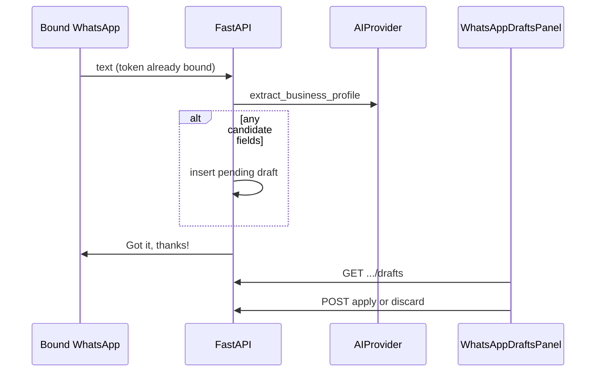

# Slice: S-052 — AI-assisted WhatsApp text extraction + merchant review/apply

| Field | Value |
|-------|-------|
| **Slice ID** | S-052 |
| **Phase** | 3 AI |
| **Status** | Testing |
| **Role(s)** | merchant \| admin |
| **Owner** | PM / 2026-08-16 |

---

## User story

**As a** merchant  
**I want** freeform WhatsApp text about my shop turned into suggested profile fields I can Apply or Discard  
**So that** I can update hours, address, and description quickly without the AI silently overwriting my live listing

---

## Background / context

Third of three WhatsApp ingestion slices. S-050 acknowledges text; this slice **interprets** it. Non-negotiable #1: AI output is **suggestions**, never definitive judgments — extracted fields must not write the live `Business` row until the merchant confirms.

Confirmed product decisions:

1. AI turns chat text (e.g. “open 9–9 mon–sat, near the bus stand…”) into structured **candidate** fields (hours, address, description — Architect may add website/phone if already on the model).
2. Candidates sit in a pending draft until Apply or Discard.
3. Dashboard UI follows the existing suggestion-card pattern (`AIInsights.tsx`): labeled suggestions, not facts.
4. Same `get_ai_provider()` gateway as other AI features (mock in Compose/CI; real vendor via existing `AI_PROVIDER`).

---

## Acceptance criteria

1. **Given** a bound WhatsApp session (S-050) and inbound **text** that looks like shop details, **when** the message is processed, **then** the AI provider returns structured candidate fields stored as a **pending** draft tied to that business — the public profile is unchanged at this point.
2. **Given** that pending draft, **when** the owning merchant opens the dashboard, **then** a “Pending WhatsApp updates” panel lists each extracted field (current live value vs suggested value) with **Apply** and **Discard** actions, and every suggestion is visually labeled as a suggestion (same `(suggestion)` / disclaimer convention as `AIInsights`).
3. **Given** the merchant clicks **Apply** on a field or the whole draft, **when** the request succeeds, **then** only the confirmed fields write to the live business, draft status becomes applied (or remaining fields stay pending if per-field apply — Architect to confirm), and the public profile shows the new values.
4. **Given** the merchant clicks **Discard**, **when** the request succeeds, **then** no live field changes and the draft is no longer pending (discarded).
5. **Given** a customer, logged-out visitor, or non-owning merchant, **when** they attempt to list, apply, or discard drafts for that business, **then** the request is rejected (403/404); the pending panel is not shown on public pages.
6. **Given** too little text to extract anything useful, or AI returning empty candidates, **when** the merchant would otherwise see a draft, **then** either no panel row appears or a plain-language empty state is shown — not a fake hours/address presented as extracted.
7. **Given** the AI provider is unavailable and the gateway degrades to mock, **when** a draft is shown, **then** the UI surfaces the degraded/mock state the same way other AI panels do, and Apply still requires an explicit merchant click (mock output must not auto-apply).
8. **Given** an outright AI failure (not a clean mock fallback), **when** extraction fails, **then** the live listing is untouched, the webhook/ack path does not 500 the whole ingest, and the merchant is told (WhatsApp ack and/or dashboard) that suggestions could not be generated.
9. **Given** admin viewing that business with existing dashboard privileges, **when** they open the pending panel, **then** they can see the same drafts (apply/discard: Architect confirms whether admin may apply on the merchant’s behalf — PM default **yes**, consistent with other merchant-dashboard admin access, unless Architect finds a safety reason not to).

---

## UX notes

- **Screens / routes:** `/merchant/dashboard` — new “Pending WhatsApp updates” panel. Prefer extending `AIInsights` suggestion-card styling or a sibling component; do not invent a second visual language.
- **Components to reuse:** `AIInsights.tsx` card/section chrome, `border-brand-400`, muted helper text, existing top-level “Suggestions only — not definitive judgments…” disclaimer (must remain visible for this panel).
- **Empty states:** No pending drafts → panel hidden or a single quiet line (“No WhatsApp updates to review”), not an empty table. Degraded mock → existing “Mock/degraded data.” prefix.
- **Errors:** Apply/Discard failure → inline error; live values left as-is.
- **AI disclaimer required?** **Yes.** Every extracted field is a suggestion until Apply.

---

## Out of scope

- Auto-applying AI output to the live listing (explicitly forbidden).
- Photo ingest (S-051) except that image **captions** may be treated as text if Architect says so in S-051 Q4.
- Full hours-editor or address-map picker UI (M-56) — this slice is review/apply of extracted JSON, not a general business-edit form.
- Customer WhatsApp, review-via-WhatsApp, or chatbot FAQ.
- Editing the raw WhatsApp transcript in the dashboard (v1 is field-level apply/discard only).
- Multi-language translation product; extraction may still accept mixed-language input as the model allows.

---

## Dependencies

- **S-050 must be Accepted** (bound session + inbound text + ack).
- Existing `AI_PROVIDER` / `get_ai_provider()` — no new AI vendor env var required (unlike S-048 Google Places).
- Not blocked on S-051 (photos can land independently).
- Architect: new prompt + operation on the existing `app/services/ai/` abstraction (`prompts.py` + mock/real providers).

---

## Definition of done (PM)

- [ ] All 9 AC verified in test report (`docs/agents/test-reports/TR-S-052.md`), including mock AI and Apply/Discard authorization
- [ ] UX matches notes — suggestion labeling on every field; live row never updates without Apply
- [ ] `README.md` §5 (draft entity), §7 (list/apply/discard), §6 (flow), §12 (M-79), §14 / §16 updated in the same PR
- [ ] No new product `.md`/`.txt` checklist outside `docs/agents/`
- [ ] PM Status set to **Accepted**

---

## Technical specification (Architect)

Inbound leftover text (token stripped) goes through `get_ai_provider().extract_business_profile` (`Operation.BUSINESS_PROFILE_EXTRACT`). Candidates persist as `business_update_drafts` with `status=pending`. Live `Business` columns change only on Apply.

### Open questions — resolved

1. **Apply granularity:** API accepts optional `fields: list[str]` (`WhatsAppDraftApplyRequest`). Dashboard **Apply** sends the whole draft (all non-empty extracted keys). Per-field UI is not in v1.
2. **Field set:** `description`, `address`, `business_hours`, `phone`, `website`. No lat/lng from chat.
3. **Search cache:** Apply calls `cache_delete_pattern("search:*")`.
4. **Admin apply:** Yes — same `require_roles(MERCHANT, ADMIN)` + `_load_owned_business` as other dashboard mutations.
5. **Empty vs error:** Empty candidates → no draft row (AC6). Provider exception → log, **no draft**, webhook still `200`, ack still `Got it, thanks!` (AC8 dashboard/WhatsApp “could not generate” is **not** a distinct ack — gap). Gateway degrade → `degraded=true` on the draft; UI shows `Mock/degraded data.` Apply still required.

### API contract

| Method | Path | Auth | Request | Response |
|--------|------|------|---------|----------|
| GET | `/api/v1/dashboard/merchant/{business_id}/whatsapp/drafts` | MERCHANT/ADMIN + ownership | — | `200 list[WhatsAppDraftResponse]` pending only |
| POST | `.../whatsapp/drafts/{draft_id}/apply` | same | optional `{fields}` | `200` status `applied`; live columns updated |
| POST | `.../whatsapp/drafts/{draft_id}/discard` | same | — | `200` status `discarded`; listing unchanged |
| | | | | `404` unknown draft; `409` not pending; `403` wrong role/owner |

### RBAC matrix

| Action | customer | merchant | admin |
|--------|----------|----------|-------|
| List/apply/discard drafts | 403 | own business | any business |
| Public pages | panel not rendered | — | — |

### Data model impact

- [x] New table `business_update_drafts` + enum `DraftStatus` (`pending` / `applied` / `discarded`)
- JSONB `extracted_fields`; `degraded` bool; `source` default `whatsapp`

### Cache / side effects

Apply invalidates `search:*`. Discard does not.

### Frontend

- **Route:** `/merchant/dashboard` (`WhatsAppDraftsPanel`, approved only)
- **Rendering:** CSR
- **Components:** Suggestion labeling `(suggestion)` + panel disclaimer. Hidden when no pending drafts.

### Flow

### Architect checklist

- [x] API contract defined
- [x] RBAC matrix complete
- [x] Data model impact documented
- [x] Cache invalidation considered
- [x] Uses AI/storage abstractions where applicable
- [x] ERD/API/FLOWS updates noted

### Risks / tradeoffs

- Whole-draft Apply in the UI (API can subset).
- Extract failure still acks success in chat.

---

## Open questions for Architect (flagged by PM)

Resolved above.

---

## Links

- Test plan: `docs/agents/test-plans/TP-S-052-whatsapp-ai-text-drafts.md`
- Test report: `docs/agents/test-reports/TR-S-052-whatsapp-ai-text-drafts.md`
- ADR: `docs/agents/adrs/ADR-012-whatsapp-cloud-api-port.md`
- Depends on: `S-050-whatsapp-link-foundation.md`
- Sibling: `S-051-whatsapp-photo-ingestion.md`

---

## Changelog

| Date | Agent | Change |
|------|-------|--------|
| 2026-08-16 | PM | Created slice (Draft); technical specification left for Architect |
| 2026-08-16 | Architect | Spec filled as-built; Status → Testing |
