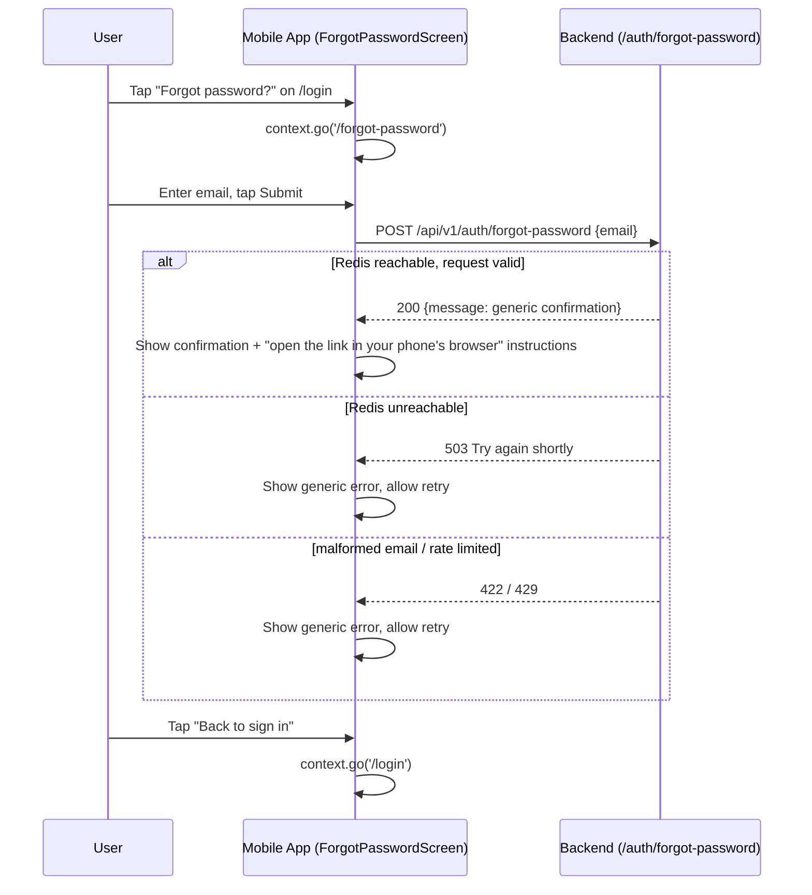

# Slice: S-054 — Mobile forgot/reset password (M-65)

| Field | Value |
|-------|-------|
| **Slice ID** | S-054 |
| **Phase** | 1 Foundation |
| **Status** | Accepted |
| **Role(s)** | customer, merchant, admin |
| **Owner** | PM / 2026-08-17 |

---

## User story

**As a** mobile user who signs in with email/password
**I want** to request a password reset from the app when I've forgotten my password
**So that** I can recover access without needing to already know my password, matching what web already offers (S-035)

---

## Acceptance criteria

1. **Given** I am on the mobile login screen, **when** I look below the credentials fields, **then** I see a "Forgot password?" link (`Key('forgotPasswordLink')`) that was not there before.
2. **Given** I tap "Forgot password?", **when** the forgot-password screen opens, **then** I see a single email field and a submit button — no other fields.
3. **Given** I enter a well-formed email and submit, **when** the app calls `POST /api/v1/auth/forgot-password`, **then** I see the same generic confirmation copy regardless of whether the address is registered (e.g. "If an account exists for that email, we sent password-reset instructions.") — the screen never reveals account existence.
4. **Given** the request fails with a network/5xx error, **when** the response is not a successful generic confirmation, **then** I see a generic error message and can retry; the screen never silently succeeds on failure.
5. **Given** I have submitted the forgot-password request, **when** I view the confirmation state, **then** I see instructions to open the reset link from the email **in my phone's browser** to finish resetting — there is no in-app "enter your reset token" screen (see recommended scope below).
6. **Given** I am on the forgot-password screen, **when** I tap a "Back to sign in" control, **then** I return to `/login` without submitting.
7. **Given** the mobile OpenAPI client, **when** it is regenerated from the live backend, **then** `merchanthub_api` exposes typed request/response models and a repository method for `/auth/forgot-password` (matching the existing `forgot-password` contract: email in, generic `MessageResponse` out, 5/min rate limit surfaced as a normal error on 429).

### Recommended scope decision (binding for this slice)

No deep-link infrastructure (App Links / Universal Links) exists in the Android/iOS mobile projects today, and the backend's reset email always points at the **web** app (`{PUBLIC_APP_URL}/reset-password?token=...`). Given that, this slice ships the **request half only**: a "Forgot password?" entry point and screen that calls `forgot-password` and shows the generic confirmation (AC 1–4, 6–7). The **reset step itself is explicitly out of scope for in-app UI** (AC 5) — the confirmation screen tells the user to open the emailed link in their phone's browser, where the existing web `/reset-password` page (S-035) already handles it end to end. This avoids inventing a manual paste-the-token UX that nobody asked for and that Architect/Builder would otherwise have to guess at.

---

## UX notes

- **Screens / routes:** New top-level go_router route `/forgot-password` (`ForgotPasswordScreen`, sibling to `/login` and `/register`, `parentNavigatorKey: rootNavigatorKey`, public — reachable from `/login` while unauthenticated). No `/reset-password` route in this slice (see scope decision).
- **Components to reuse:** `ConsumerStatefulWidget` + `GlobalKey<FormState>` pattern from `login_screen.dart`; same `TextFormField` / `FilledButton` / error-`Text` styling. Add `TextButton(key: Key('forgotPasswordLink'))` to `login_screen.dart`'s credentials step, next to or below the existing `createAccountLink`.
- **Empty states / errors:** Submit button shows a spinner while in flight (mirror existing `_loading` pattern). Success state replaces the form with confirmation text + "open the link in your browser" instruction + a "Back to sign in" `TextButton`. Generic error text on failure (no distinguishing copy for known/unknown email — that distinction is already collapsed server-side per S-035 AC 2).
- **AI disclaimer required?** No — no AI-generated content in this flow.

---

## Out of scope

- In-app password reset screen (pasting/typing the token manually) — punted per the scope decision above; revisit only if user feedback shows the "open in browser" handoff is a real friction point.
- Deep linking / App Links / Universal Links so the emailed reset link opens the mobile app directly — flagged as a **future slice**; requires Android `assetlinks.json` / iOS associated domains + backend awareness of which client to deep-link, none of which exists today.
- Any backend change — `/auth/forgot-password` and `/auth/reset-password` are already Accepted (S-035) and unchanged by this slice.
- Rate-limit UX beyond a generic error (no countdown timer, no "try again in N seconds").
- Changing the web `/reset-password` flow in any way.

---

## Dependencies

- None — S-035 (backend forgot/reset-password) is already Accepted. This slice is mobile-client-only.

---

## Definition of done (PM)

- [x] All AC verified in test report (`TR-S-054-mobile-forgot-reset-password.md`: 7/7 AC mapped, 6 automated + 1 code-review, `flutter analyze` clean, `flutter test` 149/149)
- [x] UX matches notes above (request-only scope; no in-app reset screen)
- [x] `mobile/openapi.json` regenerated to include `/auth/forgot-password`; `merchanthub_api` client rebuilt
- [x] `README.md` §12 mobile parity row for M-65 updated from `unimplemented` to `partial` (request half only — reflects the reset-step scope decision directly in the row; also noted in §14)
- [x] PM Status set to **Accepted**

---

## Technical specification (Architect)

No backend/database changes in this slice — the endpoint below is already Accepted (S-035)
and unchanged. This is a mobile-only client slice; the template's "Frontend" section is read
as **Mobile** throughout (Flutter/go_router/Riverpod, not Next.js).

### API contract

| Method | Path | Auth | Request | Response |
|--------|------|------|---------|----------|
| `POST` | `/api/v1/auth/forgot-password` | None (public, unauthenticated) | `{ email: string }` (`EmailStr`) | `200` `{ message: string }` — always the generic `"If an account exists for that email, we sent password-reset instructions."`, regardless of whether the address is registered (ADR-007, no enumeration). Errors: `422` malformed email shape, `429` rate-limited (5/minute per IP, shared limiter with web), `503` Redis unreachable (fails closed before the account lookup — does not itself leak known-vs-unknown). |

`POST /api/v1/auth/reset-password` is explicitly **out of scope** for this slice (see PM's
scope decision) and is not specified here — no mobile code calls it.

### RBAC matrix

| Action | customer | merchant | admin |
|--------|----------|----------|-------|
| `POST /auth/forgot-password` | Allowed (unauthenticated — no session exists at this point for any role) | Allowed (same) | Allowed (same) |

No role gating applies: this is a pre-auth, public endpoint by design, unchanged from S-035.

### Data model impact

- [x] None  [ ] Extend existing  [ ] New table(s)

**Details:** None. No schema, model, or migration changes. `User.hashed_password` /
Redis-backed reset-token store are pre-existing (S-035) and untouched by this slice.

### Cache / side effects

- No `search:*` Redis cache invalidation applies — this is not a listing/business write.
- Existing side effect (unchanged, server-side, already Accepted): on a match, the backend
  writes a hashed one-time reset token to Redis and best-effort sends the reset email via
  `try_send_password_reset` (`app/services/email.py`, `get_email_provider()` abstraction,
  ADR-007). This slice adds no new side effects — the mobile client only calls the existing
  endpoint.

### Mobile (Frontend)

- **Route:** New go_router route `/forgot-password` in `mobile/lib/router.dart`, sibling to
  `/login` and `/register` (top-level, `parentNavigatorKey: rootNavigatorKey`, **not** inside
  the authenticated `ShellRoute`).
- **Rendering:** N/A — Flutter mobile has no SSR/CSR distinction; the screen is a plain
  client-rendered `ConsumerStatefulWidget` calling the live API directly (equivalent to CSR).
- **Components (reuse first):**
  - `ForgotPasswordScreen` (new, `mobile/lib/features/auth/forgot_password_screen.dart`):
    `ConsumerStatefulWidget` + `GlobalKey<FormState>`, mirroring `login_screen.dart`'s
    `_credentialsFields()` / `_loading` / `_error` patterns exactly (same `TextFormField`,
    `FilledButton`, error-`Text` styling).
  - Single `TextFormField(key: Key('emailField'))` (reuse the same key convention already used
    in `login_screen.dart`'s email field for widget-test consistency) + `FilledButton(key:
    Key('submitButton'))` mirroring the existing submit-button key convention.
  - `TextButton(key: Key('backToSignInLink'))` → `context.go('/login')`.
  - Success state: replace the form with confirmation `Text` + "open the link in your phone's
    browser" instruction `Text` + the same back-to-sign-in `TextButton`.
  - `login_screen.dart` credentials step gets a new `TextButton(key:
    Key('forgotPasswordLink'))` → `context.go('/forgot-password')`, placed near
    `createAccountLink`.
  - `AuthRepository` (`mobile/lib/features/auth/auth_repository.dart`) gets a new method
    `Future<MessageResponse> forgotPassword({required String email})` calling
    `_client.authFreeApi.getAuthenticationApi().<generated forgot-password method>(...)` —
    **must** use `authFreeApi` (the unauthenticated Dio instance already used by `login`,
    `register`, `loginWithGoogle`), never `api`, since no Bearer token exists at this point.
    Wrap in `try { } on DioException catch (e) { throw ApiException.fromDioException(e); }`,
    matching every other method in that file.
  - Router carve-out (`mobile/lib/router.dart` `redirect:` callback, ~line 104-127): add
    `final isOnForgotPassword = loc == '/forgot-password';` alongside the existing
    `isOnLogin`/`isOnRegister` locals, and extend the unauthenticated bounce condition to
    `if (!isLoggedIn && !isOnLogin && !isOnRegister && !isOnForgotPassword &&
    !isPublicBusinessRoute) return '/login';` — otherwise an unauthenticated user tapping
    "Forgot password?" gets immediately redirected back to `/login` by the existing guard.
    (The `isLoggedIn && (isOnLogin || isOnRegister)` bounce-to-`postLoginPath` branch does
    *not* need to include `/forgot-password` — an already-logged-in user has no reason to be
    there, but nothing in the AC requires guarding against it either; leaving it reachable
    but harmless is acceptable and keeps the diff minimal.)

**Mandatory build sequence (do not reorder):**
1. Regenerate the OpenAPI client **first**, before any Dart repository/UI code: run
   `python mobile/scripts/generate_api_client.py` (existing script — see
   `README.md` "OpenAPI codegen" and `mobile/scripts/generate_api_client.py`) against the
   live backend (`docker compose up --build` backend running, or equivalent), then `cd mobile
   && flutter analyze && flutter test` per the documented regen loop. `mobile/openapi.json`
   currently has no `/auth/forgot-password` path, so `merchanthub_api`'s
   `AuthenticationApi` has no generated method for it yet — Builder must not hand-write a
   raw `Dio.post(...)` call as a workaround.
2. Add `AuthRepository.forgotPassword(...)` using the newly generated method/model.
3. Add the `/forgot-password` route + router redirect carve-out.
4. Add `ForgotPasswordScreen`.
5. Add `Key('forgotPasswordLink')` to `login_screen.dart`.

### Flow

### Architect checklist

- [x] API contract defined and matches `README.md` §7 API reference style — unchanged
      existing entry, no §7 edit needed since no backend change occurs.
- [x] RBAC matrix complete — trivially "all roles, unauthenticated" (public endpoint).
- [x] Data model impact documented — None.
- [x] Cache invalidation considered — None applicable (not a search/listing write).
- [x] AI/storage/maps use existing abstraction layers — N/A, no AI/storage/maps involved;
      the existing `get_email_provider()` abstraction is used server-side, unchanged.
- [x] No secrets in design.

### Risks / tradeoffs

- **Codegen is a hard prerequisite.** If the OpenAPI regen step is skipped or done after
  writing Dart code, `merchanthub_api` will have no typed method for
  `/auth/forgot-password` and Builder will be tempted to hand-roll a raw HTTP call outside
  the generated-client pattern — flagged explicitly in the build sequence above to prevent
  that.
- **Shared IP rate limit (5/min).** Mobile users behind carrier NAT/CGNAT share a public IP
  with many other users, so the existing 5/minute-per-IP limiter (shared with web, unchanged)
  may trigger 429s sooner than a per-user limit would. Accepted as-is — no mitigation in this
  slice (matches existing web behavior; out of scope per PM's "no countdown timer" note).
- **No in-app reset step** means the round trip (app → email app → phone browser → web
  `/reset-password` → back to app to sign in) crosses three apps. This is a deliberate,
  PM-approved scope cut (no deep-link infra exists yet) — not a defect of this spec.
- **Client-side email validation:** mirror `login_screen.dart`'s lightweight `value.contains
  ('@')` validator only as a non-blocking UX nicety; do not attempt to replicate the
  backend's full `EmailStr` RFC validation client-side, since any mismatch would only ever
  cause a false-negative block on a submission the server would have accepted (or vice
  versa) — let the server's `422` be the source of truth, surfaced as the same generic error
  text per AC 4.

---

## Links

- Test plan: `docs/agents/test-plans/TP-S-054-*.md`
- Test report: `docs/agents/test-reports/TR-S-054-*.md`
- ADR: n/a (no new backend pattern; reuses S-035's port)

---

## Changelog

| Date | Agent | Change |
|------|-------|--------|
| 2026-08-17 | PM | Created slice. Mobile parity for M-65 (forgot/reset password), Tier 1 of the mobile parity roadmap. Backend (`/auth/forgot-password`, `/auth/reset-password`) already Accepted via S-035, no backend changes. Scoped to the request half only — mobile calls `forgot-password` and shows the generic confirmation; the reset step is explicitly punted to "open the emailed link in your phone's browser" since no deep-link infra exists and the email always targets the web app. In-app reset screen and deep linking (App Links/Universal Links) are out of scope, flagged as future work. Requires `mobile/openapi.json` regeneration to add the missing endpoint to the generated Dart client. Status: **Draft**. Handoff: Architect to fill Technical specification, then Status → Specified. |
| 2026-08-17 | Architect | Filled Technical specification: API contract (`POST /auth/forgot-password` only, verified against `backend/app/routers/auth.py` and `app/schemas/__init__.py`), RBAC matrix (public/unauthenticated, all roles), data model impact (None), cache/side effects (none new), Mobile route/components (`/forgot-password` go_router entry + `ForgotPasswordScreen` + `AuthRepository.forgotPassword`, router redirect carve-out at `router.dart` ~line 104-127), mandatory OpenAPI-regen-first build sequence (`python mobile/scripts/generate_api_client.py`, existing script — confirmed no separate regen command needed), mermaid flow, and risks/tradeoffs. No ADR needed (no new backend pattern). Status: **Draft → Specified**. Handoff: Builder to implement. |
| 2026-08-17 | PM | Reviewed `TR-S-054-mobile-forgot-reset-password.md` against this slice's ACs: 7/7 mapped, AC 7's code-review-only coverage justified (widget tests fake `AuthController` above the repository layer by design, so `flutter analyze` clean + confirmed generated-method usage is the correct proof, not a gap). Spot-checked `forgot_password_screen_test.dart` and `AuthRepository.forgotPassword` directly — both genuinely exercise/implement the AC behavior, not rubber-stamped. `README.md` §12 M-65 row updated to `partial` (request half only, reset step opens web `/reset-password`) and §14/§16 reconciled in the same pass. Status: **Specified → Accepted**. |
