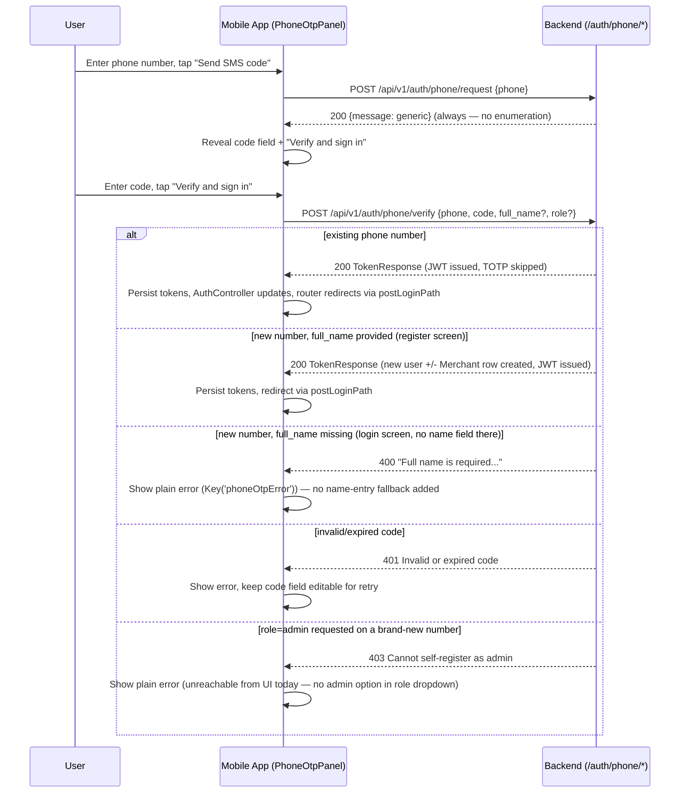

# Slice: S-055 — Mobile phone OTP sign-in (M-74)

| Field | Value |
|-------|-------|
| **Slice ID** | S-055 |
| **Phase** | 1 Foundation |
| **Status** | Accepted |
| **Role(s)** | customer, merchant |
| **Owner** | PM / 2026-08-17 |

---

## User story

**As a** customer or merchant on mobile
**I want** to sign in or sign up with my mobile number and an SMS code, without a password or authenticator app
**So that** I have the same low-friction phone-first entry point mobile users expect, matching web (S-044 / ADR-011)

---

## Acceptance criteria

1. **Given** I am on the mobile login screen, **when** I look below the email/password fields and above (or beside) "Continue with Google", **then** I see a "Continue with phone" panel: a country-code selector (`+91` default, `+1` option), a mobile number field, and a "Send SMS code" button.
2. **Given** I am on the mobile register screen, **when** I look in the equivalent position, **then** I see the same phone panel.
3. **Given** I enter a mobile number and tap "Send SMS code", **when** the app calls `POST /api/v1/auth/phone/request`, **then** the panel always shows the same generic "code sent" confirmation and reveals a 6-digit code field plus a "Verify and sign in" button — matching the request always returning a generic `MessageResponse` regardless of whether the number is known.
4. **Given** I enter the code and tap "Verify and sign in" **from the register screen**, **when** the app calls `POST /api/v1/auth/phone/verify` with `phone`, `code`, and the in-progress `full_name`/`role` already entered on that screen, **then** on success I am signed in (JWT issued, TOTP skipped) and routed the same way any other successful sign-in routes (per `postLoginPath`).
5. **Given** I enter the code and tap "Verify and sign in" **from the login screen** for a phone number that has never verified before, **when** the app calls `phone/verify` **without** a `full_name` (login screen has no name field), **then** the backend's 400 "full name required" error is surfaced as a plain error message on the panel — mobile does not add a name-entry fallback that web doesn't have.
6. **Given** an invalid/expired code, **when** I submit it, **then** the backend's 401 is surfaced as a plain error message on the panel and the code field remains editable for retry.
7. **Given** I select role "merchant" is not applicable on the login screen (no role selector there) and I attempt phone sign-in as a brand-new number intending to self-register as admin, **when** any admin role were passed, **then** the backend's 403 blocking admin self-registration applies unchanged — mobile does not offer an admin option in the register screen's role dropdown today (already true; unaffected by this slice).
8. **Given** the mobile OpenAPI client, **when** it is regenerated from the live backend, **then** `merchanthub_api` exposes typed request/response models and repository methods for `/auth/phone/request` and `/auth/phone/verify`.

---

## UX notes

- **Screens / routes:** No new routes. New widget `PhoneOtpPanel` (or equivalent Flutter component) embedded directly in `login_screen.dart` and `register_screen.dart`, placed next to the existing `GoogleSignInButton`, mirroring `frontend/src/components/PhoneOtpPanel.tsx`'s placement (below the "or" divider, alongside Google).
- **Components to reuse:** Same `ConsumerStatefulWidget` pattern already used by both screens; a shared panel widget parameterized by optional `fullName`/`role` (login passes neither; register passes the current in-progress form values), mirroring the web component's `fullName?`/`role?` props exactly.
- **Widget-test keys:** `Key('phoneCountryCodeField')`, `Key('phoneNumberField')`, `Key('sendPhoneCodeButton')`, `Key('phoneCodeField')`, `Key('verifyPhoneCodeButton')`, `Key('phoneOtpError')` — consistent with existing `Key('...')` conventions in `login_screen.dart`/`register_screen.dart`.
- **Empty states / errors:** "Send SMS code" disabled until a number is entered; "Verify and sign in" disabled until the code field is non-empty (mirror web's `code.trim().length < 4` gate). Error text uses the same inline `Text` + error-color styling already used for `_error` in both screens.
- **AI disclaimer required?** No — no AI-generated content in this flow.

---

## Out of scope

- A name-prompt fallback UI for brand-new numbers verified from the login screen — web does not have this (login page omits `fullName`/`role` and lets the backend's 400 surface as-is), and this slice must not invent one; that would be scope creep beyond parity (per AC 5).
- Apple/iOS-specific SMS autofill polish beyond Flutter's default text-field behavior.
- Any backend change — `/auth/phone/request` and `/auth/phone/verify` are already Accepted (S-044, ADR-011) and unchanged by this slice.
- Country codes beyond `+91` / `+1` (matches web's current two-option dropdown).
- Changing the web phone-OTP flow in any way.

---

## Dependencies

- None — S-044 (backend + web phone OTP) is already Accepted. This slice is mobile-client-only.

---

## Definition of done (PM)

- [x] All AC verified in test report (`TR-S-055-mobile-phone-otp.md`: 8/8 AC mapped, 7 automated + 1 code-review, `flutter analyze` clean, `flutter test` 149/149)
- [x] UX matches notes above (panel placement/behavior mirrors web exactly, including the login-omits-fullName / register-supplies-fullName asymmetry)
- [x] `mobile/openapi.json` regenerated to include `/auth/phone/request` and `/auth/phone/verify`; `merchanthub_api` client rebuilt
- [x] `README.md` §12 mobile parity row for M-74 updated from `unimplemented` to `implemented`
- [x] PM Status set to **Accepted**

---

## Technical specification (Architect)

No backend/database changes in this slice — both endpoints below are already Accepted
(S-044, ADR-011) and unchanged. This is a mobile-only client slice; the template's
"Frontend" section is read as **Mobile** throughout (Flutter/go_router/Riverpod, not
Next.js).

### API contract

| Method | Path | Auth | Request | Response |
|--------|------|------|---------|----------|
| `POST` | `/api/v1/auth/phone/request` | None (public, unauthenticated) | `{ phone: string }` (10-20 chars; backend's `normalize_phone()` in `app/services/phone_otp.py` is lenient — accepts a bare 10-digit national number, a `91`-prefixed 12-digit number, a leading-`0` 11-digit number, or an already `+`-prefixed number, and normalizes to `+91XXXXXXXXXX`-style E.164; mobile does not need to format strictly, just concatenate country code + digits) | `200` `{ message: string }` — always the generic `"If that number can receive SMS, we sent a sign-in code."` (no enumeration, ADR-011). Errors: `400` invalid phone shape (`InvalidPhoneError`), `429` rate-limited (5/minute per IP), `503` Redis/SMS-provider unreachable. |
| `POST` | `/api/v1/auth/phone/verify` | None (public, unauthenticated) | `{ phone: string, code: string (4-8 chars), full_name?: string, role?: UserRole }` | `200` `TokenResponse { access_token, refresh_token, token_type }` — session issued directly, **TOTP is skipped** (same as Google, per ADR-011). Errors: `400` invalid phone shape, or `full_name` missing/blank on a brand-new number's first verify; `401` invalid/expired code; `403` `role=admin` requested for a brand-new number (`"Cannot self-register as admin"`), or existing account `is_active=false` (`"Account suspended"`); `429` rate-limited (10/minute per IP); `503` Redis unreachable. |

### RBAC matrix

Both endpoints are pre-auth/public by design (no caller role exists yet); the matrix below
reflects the **target role** being requested/resulting, not a caller's existing role:

| Action | customer (target) | merchant (target) | admin (target) |
|--------|----------|----------|-------|
| `POST /auth/phone/request` (send code) | Allowed — request carries no `role` | Allowed — same | Allowed — same (request step never carries `role`, only `verify` does) |
| `POST /auth/phone/verify` — phone already belongs to an existing user | Allowed — logs in as that user's actual stored role; any `role` in the request body is ignored for existing accounts | Allowed — same | Allowed — same |
| `POST /auth/phone/verify` — brand-new phone number, self-registering | Allowed — default when `role` omitted (login screen never sends `role`) | Allowed — when `role=merchant` is passed (register screen only; a `Merchant` row is created server-side) | **Blocked — `403`** `"Cannot self-register as admin"`, unchanged existing rule (ADR-011); mobile's register screen has no admin option in its role dropdown today, so this path is already unreachable from the UI, but the backend enforces it regardless. |

### Data model impact

- [x] None  [ ] Extend existing  [ ] New table(s)

**Details:** None from this slice. (Server-side, unchanged, already-Accepted behavior for
context only: a brand-new phone verify creates a `User` row with `auth_provider="phone"`,
`email=None`, and — if `role=merchant` — a companion `Merchant` row. No migration or schema
change is introduced by this mobile slice.)

### Cache / side effects

- No `search:*` Redis cache invalidation applies — not a listing/business write.
- Existing side effects (unchanged, server-side, already Accepted): `issue_otp`/`consume_otp`
  write/delete a SHA-256-hashed, 300-second-TTL code in Redis (`app/services/phone_otp.py`);
  `phone/request` also calls `get_sms_provider().send_otp(...)` (mock in dev, Msg91 in prod,
  `SMS_PROVIDER` abstraction per ADR-011). This slice adds no new side effects.

### Mobile (Frontend)

- **Route:** No new routes — the phone-OTP panel is embedded directly inside the existing
  `/login` and `/register` screens.
- **Rendering:** N/A — Flutter mobile has no SSR/CSR distinction; client-rendered against the
  live API (CSR-equivalent).
- **Components (reuse first):**
  - New shared widget `PhoneOtpPanel` (`mobile/lib/features/auth/phone_otp_panel.dart`), a
    `ConsumerStatefulWidget` parameterized by optional `fullName`/`role` (nullable, matching
    web's `PhoneOtpPanel.tsx` `fullName?`/`role?` props exactly): login passes neither,
    register passes the screen's current in-progress `TextEditingController.text`/role
    selection. Internal state machine mirrors `login_screen.dart`'s `_Step` enum pattern:
    number-entry → code-entry.
  - Embedded in `login_screen.dart` and `register_screen.dart` next to the existing
    `GoogleSignInButton`, below the `Divider`/"or" row, matching
    `frontend/src/components/PhoneOtpPanel.tsx`'s placement.
  - Widget-test keys (per PM's UX notes, reuse verbatim): `Key('phoneCountryCodeField')`,
    `Key('phoneNumberField')`, `Key('sendPhoneCodeButton')`, `Key('phoneCodeField')`,
    `Key('verifyPhoneCodeButton')`, `Key('phoneOtpError')`.
  - `AuthRepository` (`mobile/lib/features/auth/auth_repository.dart`) gets two new methods:
    - `Future<MessageResponse> requestPhoneOtp({required String phone})` — uses
      `_client.authFreeApi` (unauthenticated Dio instance), same pattern as `login`/
      `register`.
    - `Future<UserResponse> verifyPhoneOtp({required String phone, required String code,
      String? fullName, UserRole? role})` — uses `_client.authFreeApi`, and on success
      **must** call `await _client.tokenStorage.save(response.data!)` then `return me();`,
      mirroring `loginWithGoogle`'s exact pattern (`TokenResponse` in, session persisted,
      full `UserResponse` returned) — this is the one call in this slice that issues real
      session tokens directly (no MFA step), same as the Google path.
    - Both wrapped in `try { } on DioException catch (e) { throw
      ApiException.fromDioException(e); }`, matching every other method in that file.
  - `AuthController` (`mobile/lib/features/auth/auth_provider.dart`) gets a thin
    `signInWithPhone({...})` method analogous to the existing `signInWithGoogle`, so
    `PhoneOtpPanel` drives state the same way both screens already drive Google sign-in —
    success flips `authControllerProvider` to a real user and the router's existing
    `postLoginPath` redirect takes over (no new redirect logic needed, unlike S-054).

**Mandatory build sequence (do not reorder):**
1. Regenerate the OpenAPI client **first**, before any Dart repository/UI code: run
   `python mobile/scripts/generate_api_client.py` against the live backend, then `cd mobile &&
   flutter analyze && flutter test` (existing documented regen loop — see README.md "OpenAPI
   codegen" and `mobile/scripts/generate_api_client.py`). `mobile/openapi.json` currently has
   no `/auth/phone/request` or `/auth/phone/verify` paths, so `merchanthub_api`'s
   `AuthenticationApi` has no generated methods/models (`PhoneOtpRequest`,
   `PhoneOtpVerifyRequest`) for either yet — Builder must not hand-write raw `Dio` calls as a
   workaround.
2. Add both `AuthRepository` methods.
3. Add `AuthController.signInWithPhone(...)`.
4. Build the shared `PhoneOtpPanel` widget.
5. Wire it into `login_screen.dart` (no `fullName`/`role` passed) and
   `register_screen.dart` (passes in-progress form values) per the UX notes' placement.

### Flow

### Architect checklist

- [x] API contract defined and matches `README.md` §7 API reference style — unchanged
      existing entries, no §7 edit needed since no backend change occurs.
- [x] RBAC matrix complete — target-role-based, since both endpoints are pre-auth.
- [x] Data model impact documented — None (mobile-side); existing server-side behavior noted
      for context only.
- [x] Cache invalidation considered — None applicable (not a search/listing write).
- [x] AI/storage/maps use existing abstraction layers — N/A directly; the existing
      `get_sms_provider()` abstraction (ADR-011) is used server-side, unchanged.
- [x] No secrets in design.

### Risks / tradeoffs

- **Codegen is a hard prerequisite** for both endpoints — same risk as S-054, called out
  explicitly in the build sequence to prevent Builder from hand-rolling raw HTTP calls
  outside the generated-client pattern.
- **Shared widget across two screens with asymmetric inputs.** `PhoneOtpPanel` must behave
  correctly with `fullName`/`role` both null (login) and both populated (register) —
  parameterizing one widget avoids duplicating the whole two-step flow twice, mirroring
  web's single `PhoneOtpPanel.tsx` component, but means Builder must test both call sites,
  not just one.
- **No client-side full-name fallback on login**, by explicit PM scope decision (AC 5) — a
  brand-new number verified from the login screen surfaces the backend's `400` as a plain
  error with no recovery path other than switching to the register screen. This is
  intentional parity with web, not an oversight.
- **Rate limits (5/min request, 10/min verify) are per-IP**, shared with web/other clients
  behind the same NAT — accepted as-is, no client-side countdown (per Out of scope).
- **Country-code selector is UI sugar only** (`+91` default, `+1` option per AC 1/2) — the
  backend's `normalize_phone()` is lenient about format, but mobile should still concatenate
  the selected country code with the entered digits before sending a single `phone` string,
  rather than sending them as separate fields (the schema has only one `phone` field).

---

## Links

- Test plan: `docs/agents/test-plans/TP-S-055-*.md`
- Test report: `docs/agents/test-reports/TR-S-055-*.md`
- ADR: n/a (reuses ADR-011, no new backend pattern)

---

## Changelog

| Date | Agent | Change |
|------|-------|--------|
| 2026-08-17 | PM | Created slice. Mobile parity for M-74 (phone OTP sign-in), Tier 1 of the mobile parity roadmap. Backend (`/auth/phone/request`, `/auth/phone/verify`) and web already Accepted via S-044/ADR-011, no backend changes. Mirrors web placement/behavior exactly: phone panel next to Google on both login and register screens, login omits `full_name`/`role` (so a brand-new number hits the backend's 400 as on web), register supplies them from the in-progress form. Explicitly does not add a name-prompt fallback beyond what web does — that would be scope creep. Requires `mobile/openapi.json` regeneration to add the two missing endpoints to the generated Dart client. Status: **Draft**. Handoff: Architect to fill Technical specification, then Status → Specified. |
| 2026-08-17 | Architect | Filled Technical specification: API contract for both `POST /auth/phone/request` and `POST /auth/phone/verify` (verified against `backend/app/routers/auth.py` ~line 453-522 and `app/services/phone_otp.py`, including the lenient `normalize_phone()` behavior), target-role-based RBAC matrix (both endpoints pre-auth), data model impact (None), cache/side effects (none new), Mobile route/components (shared `PhoneOtpPanel` widget embedded in `login_screen.dart`/`register_screen.dart`, new `AuthRepository.requestPhoneOtp`/`verifyPhoneOtp` + `AuthController.signInWithPhone` mirroring the existing `signInWithGoogle` pattern), mandatory OpenAPI-regen-first build sequence, mermaid flow covering all four verify branches, and risks/tradeoffs. No ADR needed (reuses ADR-011, no new backend pattern). Status: **Draft → Specified**. Handoff: Builder to implement. |
| 2026-08-17 | PM | Reviewed `TR-S-055-mobile-phone-otp.md` against this slice's ACs: 8/8 mapped, AC 8's code-review-only coverage justified for the same reason as S-054's AC 7. Spot-checked `AuthRepository.requestPhoneOtp`/`verifyPhoneOtp` directly — genuinely call the generated `phoneOtpRequestApiV1AuthPhoneRequestPost`/`phoneOtpVerifyApiV1AuthPhoneVerifyPost` methods, not hand-rolled calls. Noted the Tester's flagged (non-AC) latent nullable-`UserResponse.email` fix surfaced by this slice's own regen — genuine pre-existing bug, correctly fixed, tracked as a follow-up regression-test gap rather than a slice defect. `README.md` §12 M-74 row updated to `implemented` and §14 reconciled in the same pass. Status: **Specified → Accepted**. |
