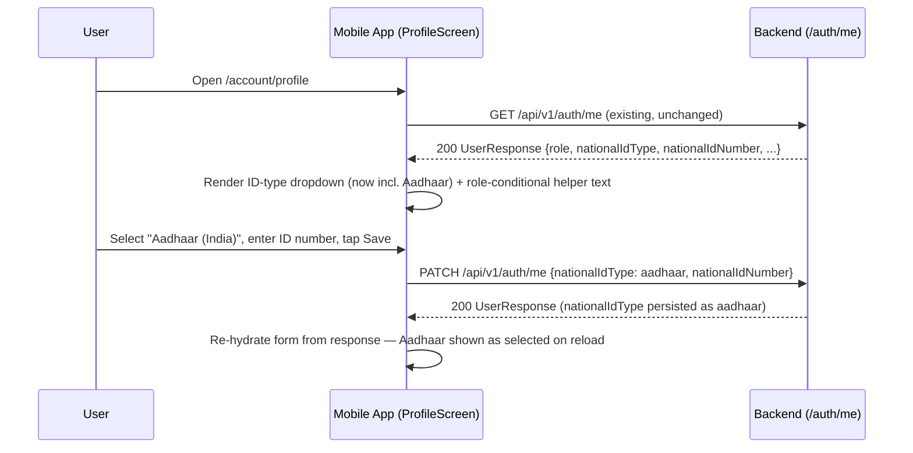

# Slice: S-056 — Mobile National ID parity fix (M-73)

| Field | Value |
|-------|-------|
| **Slice ID** | S-056 |
| **Phase** | 1 Foundation |
| **Status** | Specified |
| **Role(s)** | customer, merchant, admin |
| **Owner** | PM / 2026-08-17 |

---

## User story

**As a** mobile user filling in my profile's National ID fieldset
**I want** to be able to select Aadhaar as an ID type and see wording relevant to my role
**So that** the mobile profile screen matches what web already offers (S-043) instead of shipping a broken dropdown and generic copy

---

## Acceptance criteria

1. **Given** I am a merchant, customer, or admin on the mobile profile screen (`ProfileScreen`), **when** I open the "ID type" dropdown (`Key('nationalIdTypeDropdown')`), **then** I see four options: "Select type" (null/unset), "PAN (India)", "Aadhaar (India)", "Other national ID" — matching web's `ProfilePage.tsx` option set exactly. Today only three options show (Aadhaar is missing); this AC is the regression fix.
2. **Given** I select "Aadhaar (India)" and enter an ID number and save, **when** the update completes, **then** `nationalIdType` persists as `NationalIdType.aadhaar` and is correctly re-hydrated (shown as selected) the next time the profile screen loads.
3. **Given** I am a **merchant** viewing the National ID fieldset, **when** I read the helper text under the ID number field, **then** it reads "Required for merchants before you can submit a listing. Stored for your account — not verified as government KYC." (verbatim, matching web).
4. **Given** I am a **customer or admin** viewing the National ID fieldset, **when** I read the helper text under the ID number field, **then** it reads "Optional. Stored for your account only — not verified as KYC in this version." (verbatim, matching web's non-merchant copy; this is also today's current mobile copy, so customer/admin behavior is unchanged).
5. **Given** I am a merchant with no national ID on my user record, **when** I attempt to create a business listing via `business_editor_screen.dart`, **then** the existing generic error-string surfacing of the backend's 400 ("National ID is required for merchants before creating a listing") is unchanged by this slice — no new screen, no redirect-to-profile UX is introduced.

---

## UX notes

- **Screens / routes:** No new screens or routes. Change is confined to the "National ID" fieldset inside `mobile/lib/features/account/profile_screen.dart` (`/account/profile`).
- **Components to reuse:** Existing `DropdownButtonFormField<NationalIdType?>` and `TextFormField` widgets already in `profile_screen.dart` — add the missing `DropdownMenuItem(value: NationalIdType.aadhaar, child: Text('Aadhaar (India)'))` entry, and make the `helperText` on the ID number field role-conditional using the already-available `UserResponse.role` (same pattern as the existing `_securityCopy(user)` role-conditional helper method on the same screen).
- **Empty states / errors:** No change to error/empty-state behavior — this is a copy + missing-option fix, not a new flow.
- **AI disclaimer required?** No — National ID is explicitly non-AI, self-service, not-KYC-verified data (per S-043); copy for both roles already says "not verified" and this slice does not change that framing.

---

## Out of scope

- Any backend change — the `aadhaar` enum value, `PATCH /auth/me`, and the `POST /businesses` 400 enforcement are already Accepted (S-043) and unchanged.
- New screens, new repository methods, or `mobile/openapi.json` / generated-client regeneration — the Dart `NationalIdType` enum already includes `aadhaar` server-side; this is purely a UI gap in `profile_screen.dart` not exposing it.
- Any change to `business_editor_screen.dart` — its generic error-string handling of the 400 already matches web's lack of special redirect-to-profile UX and needs no changes.
- Format/checksum validation or masking of the ID number on the owner's own profile view (masking stays admin-list-only, server-side, per S-043 — mobile has no admin user-list screen today so this does not apply to mobile at all).

---

## Dependencies

- None — S-043 (backend + web National ID by role) is already Accepted. This slice is a narrow mobile-client bug fix.

---

## Definition of done (PM)

- [ ] All AC verified in test report
- [ ] UX matches notes above (Aadhaar option added; role-conditional helper text added; nothing else changed)
- [ ] `README.md` §12 mobile parity row for M-73 updated from `unimplemented` to `implemented`
- [ ] PM Status set to **Accepted**

---

## Technical specification (Architect)

No backend/database changes in this slice — this is a pure mobile-client UI bug fix against
an already-Accepted, unchanged backend contract (S-043). The template's "Frontend" section is
read as **Mobile** throughout (Flutter, not Next.js). No OpenAPI regeneration is needed —
`NationalIdType.aadhaar` already exists in the generated `merchanthub_api` package (the
backend enum and its generated Dart counterpart were never the bug; only `profile_screen.dart`
fails to expose the option in its dropdown `items` list).

### API contract

| Method | Path | Auth | Request | Response |
|--------|------|------|---------|----------|
| `PATCH` | `/api/v1/auth/me` | Bearer (self, any role — `require current user`) | `UserProfileUpdate` (partial; relevant fields: `national_id_type: NationalIdType \| null`, `national_id_number: string \| null`, max 64 chars) | `200` `UserResponse` (full updated profile). Errors: `401` missing/invalid token. **Unchanged** — already Accepted (S-043); this slice adds no new fields, no new validation, and touches no other endpoint. |

### RBAC matrix

| Action | customer | merchant | admin |
|--------|----------|----------|-------|
| Select "Aadhaar (India)" in ID-type dropdown, save via `PATCH /auth/me` | Allowed (own profile only, unchanged) | Allowed (own profile only, unchanged) | Allowed (own profile only, unchanged) |
| See merchant-specific helper copy ("Required for merchants…") | No — sees the non-merchant copy | **Yes** | No — sees the non-merchant copy |
| See non-merchant helper copy ("Optional. Stored…") | Yes | No | Yes |

Role check is client-side only, driven by the already-fetched `UserResponse.role` (same
source `_securityCopy(user)` already reads on the same screen) — no new authorization
decision is introduced; the server enforces nothing role-specific here (`national_id_type`/
`national_id_number` are self-service fields for every role, per S-043).

### Data model impact

- [x] None  [ ] Extend existing  [ ] New table(s)

**Details:** None. `NationalIdType.AADHAAR = "aadhaar"` already exists in
`backend/app/models/__init__.py` (S-043) and in the generated Dart `NationalIdType` enum —
this slice fixes only the Flutter dropdown's `items` list, which today omits the
already-supported `aadhaar` entry, and makes a `helperText` string role-conditional. No
migration, no schema change, no `mobile/openapi.json` regeneration.

### Cache / side effects

None. Not a search/listing write; `search:*` invalidation does not apply. `PATCH /auth/me`'s
existing side effects (row update only) are unchanged.

### Mobile (Frontend)

- **Route:** No new routes — fix is confined to the existing "National ID" fieldset inside
  `mobile/lib/features/account/profile_screen.dart` (`/account/profile`).
- **Rendering:** N/A — Flutter mobile has no SSR/CSR distinction; client-rendered against the
  live API (CSR-equivalent), unchanged.
- **Components (reuse first):**
  - Existing `DropdownButtonFormField<NationalIdType?>` (`key: const
    Key('nationalIdTypeDropdown')`, ~line 190) — add the missing item:
    `DropdownMenuItem(value: NationalIdType.aadhaar, child: Text('Aadhaar (India)'))`,
    inserted between the existing `pan` and `other` entries so the on-screen order matches
    web's `ProfilePage.tsx` option set exactly (Select type / PAN / Aadhaar / Other).
  - Existing `TextFormField(key: const Key('nationalIdNumberField'))`'s `helperText` (~line
    208), currently a single hardcoded string — replace with a call to a new private helper
    method on the same `State` class, e.g. `_nationalIdHelperText(UserResponse user)`,
    mirroring the existing `_securityCopy(UserResponse user)` role-conditional pattern
    already on this screen (~line 100):
    - `user.role == UserRole.merchant` → `'Required for merchants before you can submit a
      listing. Stored for your account — not verified as government KYC.'` (verbatim, per AC
      3, matching `frontend/src/components/ProfilePage.tsx` line 213's merchant copy).
    - otherwise (`customer`, `admin`) → `'Optional. Stored for your account only — not
      verified as KYC in this version.'` (verbatim, per AC 4 — this is also today's existing
      mobile copy for non-merchants, so no visible change for those two roles).
  - No changes to `business_editor_screen.dart` — its existing generic 400-string handling
    for "National ID is required for merchants…" is explicitly unchanged (AC 5, Out of
    scope).

No build-sequence/codegen step is needed for this slice (unlike S-054/S-055) — it is a
same-day, single-file Dart edit against an already-generated client.

### Flow

### Architect checklist

- [x] API contract defined and matches `README.md` §7 API reference style — unchanged
      existing entry; §7 requires no edit since no backend change occurs.
- [x] RBAC matrix complete — client-side copy branching only, no new server authorization.
- [x] Data model impact documented — None.
- [x] Cache invalidation considered — None applicable.
- [x] AI/storage/maps use existing abstraction layers — N/A, not touched by this slice.
- [x] No secrets in design.

### Risks / tradeoffs

- **Scope discipline risk:** because this touches the same fieldset as a "real" feature
  (National ID by role, S-043), there's a temptation to also add masking, checksum
  validation, or a redirect-to-profile UX from `business_editor_screen.dart` while in the
  file — all three are explicitly Out of scope per the PM's slice and must not be added here;
  keep the diff to the dropdown `items` list and the `helperText` call.
- **Copy drift risk:** both helper strings must match `frontend/src/components/ProfilePage.tsx`
  verbatim (AC 3/4 are explicit about this) — any paraphrase, even a minor one, fails the
  acceptance criteria as written. Builder should copy-paste the exact strings from this spec
  rather than retype them.
- **No test coverage exists yet** for this screen beyond `profile_screen_test.dart` (already
  in `mobile/test/`) — Tester will need to extend that file with cases for the Aadhaar option
  and both helper-text branches; no new test file is warranted for a single-screen fix.

---

## Links

- Test plan: `docs/agents/test-plans/TP-S-056-*.md`
- Test report: `docs/agents/test-reports/TR-S-056-*.md`
- ADR: n/a (no new pattern; bug fix within an already-Accepted feature)

---

## Changelog

| Date | Agent | Change |
|------|-------|--------|
| 2026-08-17 | PM | Created slice. Mobile parity for M-73 (National ID), Tier 1 of the mobile parity roadmap. Narrow scope: mobile's `profile_screen.dart` already has a National ID fieldset (wired to `PATCH /auth/me`, backend/web already Accepted via S-043) but ships two parity bugs — the "aadhaar" dropdown option is missing entirely despite the enum and backend supporting it, and helper copy is a single generic string regardless of role instead of web's merchant-specific "Required..." wording. This slice fixes both; no new screens, no repository changes, no client regeneration needed. `business_editor_screen.dart`'s existing generic 400 handling is explicitly unchanged. Status: **Draft**. Handoff: Architect to fill Technical specification, then Status → Specified. |
| 2026-08-17 | Architect | Filled Technical specification: API contract documented as unchanged (`PATCH /auth/me`, verified against `backend/app/routers/auth.py`/`app/schemas/__init__.py`/`app/models/__init__.py`'s `NationalIdType` enum), RBAC matrix (client-side copy branching by `UserResponse.role`, no new server authorization), data model impact (None), cache/side effects (none), Mobile section confirming the fix is confined to `profile_screen.dart`'s dropdown `items` list (add `NationalIdType.aadhaar`) and a new role-conditional `_nationalIdHelperText` helper mirroring the existing `_securityCopy` pattern, with verbatim copy for both branches, mermaid flow, and risks/tradeoffs (scope-creep and copy-drift risk called out explicitly). Confirmed no OpenAPI regeneration needed — `aadhaar` already exists in the generated client. No ADR needed (bug fix within an already-Accepted feature). Status: **Draft → Specified**. Handoff: Builder to implement. |
