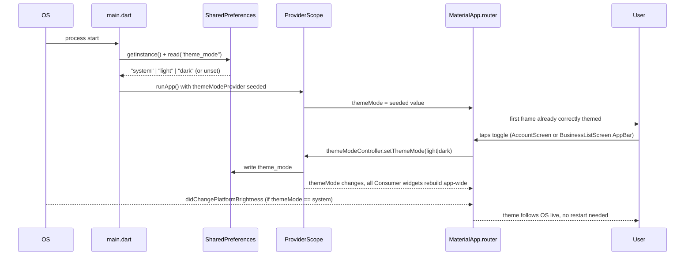

# Slice: S-057 — Mobile dark mode (parity for M-75)

| Field | Value |
|-------|-------|
| **Slice ID** | S-057 |
| **Phase** | 5 Polish |
| **Status** | Accepted |
| **Role(s)** | customer \| merchant \| admin |
| **Owner** | PM / 2026-08-17 |

---

## User story

**As a** mobile app user (guest, customer, merchant, or admin)
**I want** the Flutter app to correctly render in dark mode — matching my OS theme by default, with an explicit toggle I control myself, that persists across sessions — across every screen and widget
**So that** the mobile experience matches the web app's dark mode (shipped in S-045) and doesn't feel like a second-class, unfinished surface when I switch devices or use the app at night

---

## Acceptance criteria

1. **Given** a user opens the app for the first time (no prior explicit theme choice stored) with the OS set to dark mode, **when** the app cold-starts, **then** it renders in dark mode from the first frame — no visible flash of the light theme before dark mode applies (a "flash of wrong theme" is a fail, matching S-045 AC 1's intent adapted to Flutter's cold-start constraints; see Dependencies/Architect note below on feasibility).
2. **Given** a user opens the app for the first time (no prior explicit theme choice stored) with the OS set to light mode, or no OS preference is signaled, **when** the app cold-starts, **then** it renders in light mode by default.
3. **Given** any signed-in or guest user on any primary shell screen, **when** they look at Account (or another consistently-reachable location the Architect scopes), **then** a visible, clearly-labeled theme control is present letting them switch between light and dark explicitly, overriding whatever the OS preference is. (Exact screen/placement is an Architect/UX decision — see UX notes; this AC only requires it be present and discoverable, not buried behind multiple taps.)
4. **Given** a user has explicitly set a theme via the toggle, **when** they close and relaunch the app, background/foreground it, or return in a new session, **then** their explicit choice persists (via local device storage, e.g. `shared_preferences`) and is honored — their choice takes priority over OS preference from that point on.
5. **Given** a user has never made an explicit choice (or has reset to "system"), **when** the OS theme changes while the app is running (e.g. scheduled dark mode kicks in, or the user changes OS settings and returns to the foregrounded app), **then** the app's theme updates to match, consistent with Flutter's `ThemeMode.system` behavior.
6. **Given** a user is in dark mode, **when** they navigate through each existing primary shell screen and its reachable sub-screens — Explore/business list, business detail (incl. reviews and AI sentiment/insights surfaces), Favorites, Notifications, Account/Profile, Merchant home, Admin home, and auth screens (login) — **then** all text, icons, borders, and interactive controls are legible with contrast reasonably meeting WCAG AA (no invisible text, no leftover light-only cards/surfaces on a dark background, no unreadable icon-on-background combinations).
7. **Given** an AI-derived UI element is shown on mobile in either theme (e.g. AI sentiment badge, AI insights text, wherever the mobile app currently surfaces AI output), **when** a user reads it, **then** it still carries the existing "suggestion" disclaimer language, legible in both themes — this slice must not drop or obscure that copy in dark mode.
8. **Given** a user switches theme via the toggle, **when** the switch happens, **then** the change applies app-wide in a single interaction — no full app restart required, and no screen or widget is left stuck in the previous theme after navigating to it.
9. **Given** the underlying data (businesses, reviews, notifications) is unaffected by this slice, **when** a user compares the same screen in light vs. dark mode, **then** functional behavior (navigation, data shown, actions available) is unchanged — this is a purely visual/theming slice, not a functional change.

---

## UX notes

- **Screens / widgets:** every existing mobile screen from the shipped P0–P4 mobile slices (S-027, S-028, S-029, S-030, S-031) is in scope for the sweep — shell/bottom nav, Explore/business list, business detail, reviews, Favorites, Notifications, Account/Profile, Merchant home, Admin home, login. There is no Flutter-side "component sweep" file list yet (unlike S-045's 59-file web table) — scoping the actual widget/file inventory is the **Architect's** job in the technical specification, not the PM's.
- **Theme control placement:** parity intent is "explicit, discoverable toggle," matching web's navbar `ThemeToggle`. Mobile has no navbar; S-027 already established Account as the identity/settings surface, and a guest still needs the same control (S-027 AC pattern: guest sees a reduced shell, not the full authenticated one) — Architect should scope where guests find the toggle too, since dark mode is chrome-wide, not gated by login. Do not invent a new nav destination for this alone if an existing settings surface can host it.
- **Empty states / errors:** existing empty/error states across mobile screens (e.g. empty Favorites, empty Notifications, no-reviews-yet) must also be swept — legible in light but invisible in dark is a bug for this slice, not a follow-up.
- **AI disclaimer required?** Yes — see AC 7. No new AI copy introduced; whatever suggestion-language disclaimer mobile already surfaces must stay legible in both themes.
- **Design source of truth:** per project convention, the Figma design system (dark-mode Color collection referenced in S-045) leads visual/color decisions. This slice should reuse whatever token/hex decisions S-045 already landed (placeholder or Figma-confirmed, whichever is current at build time) rather than inventing a separate mobile-only palette — flag any necessary Flutter-specific adaptation (e.g. Material `ThemeData` vs. CSS vars) in the technical spec, not new color values.

---

## Out of scope

- **Any change to web code.** This slice is Flutter/mobile-only; `frontend/` is untouched.
- **Per-component Figma reconciliation / new visual design work.** This slice maps existing screens onto a light/dark theme, reusing S-045's color decisions — it does not introduce new brand colors, illustrations, or a redesign.
- **New product features or screens.** No new mobile screens beyond the theme control itself.
- **Cross-device / server-synced theme preference.** Local-device persistence only (matching S-045 AC 4's browser-local scope) — no backend storage of theme choice.
- **OAuth/maps placeholders, push notifications, or other unrelated Phase 5 mobile polish items** — tracked separately.
- **Guaranteeing zero-flash cold start if genuinely infeasible on Flutter's rendering pipeline.** AC 1 states the parity intent; if the Architect determines a first-frame flash is unavoidable within Flutter's startup model (unlike web's pre-hydration script trick), that must be documented as a stated, justified limitation in the technical spec rather than silently dropped or silently claimed as met.

---

## Dependencies

- None blocking within mobile parity work — this slice does not depend on other in-flight mobile parity slices.
- Reuses color/token decisions from **S-045** (Accepted) — Architect should pull current token values from that slice's technical specification (including its noted caveat that hex values were placeholders pending human Figma confirmation) rather than re-deriving them from scratch.

---

## Definition of done (PM)

- [x] All AC verified in test report (AC 1-9 Pass per `TR-S-057-mobile-dark-mode.md`; AC 7 and the read-on-relaunch half of AC 4 are code-inspection-verified rather than automated-test-covered — noted as non-blocking follow-ups, not gaps in AC satisfaction)
- [x] UX matches notes above (toggle placed in both `AccountScreen` and `BusinessListScreen` app bars per the Architect's guest-reachability resolution, matching the slice's "do not invent a new nav destination" instruction)
- [x] Documented in `README.md` §8 Frontend guide if a new cross-cutting mobile pattern is introduced (theme provider, persistence approach) — not required: this is a routine platform port of S-045's already-documented pattern, not a new pattern category (Architect's Risks section reasoning); no §8 change made
- [x] `README.md` §12 Web ↔ mobile feature parity tracker — M-75 row updated from `unimplemented` to `implemented`
- [x] `README.md` §14 (and §16 if investor-visible) updated to reflect the closed mobile gap
- [x] PM Status set to **Accepted**

---

## Technical specification (Architect)

### API contract

None. This is a client-only, device-local slice — no backend routes are added, changed, or
called. Theme state never crosses the network (matches S-045 AC 4 scope and this slice's own
"Out of scope: cross-device / server-synced theme preference").

### RBAC matrix

| Action | customer | merchant | admin | guest |
|--------|----------|----------|-------|-------|
| See/use theme toggle | uniform | uniform | uniform | uniform |
| Theme applies to shell | uniform | uniform | uniform | uniform |

Not gated by role or auth state at all — theme is chrome-wide (see UX note in the slice on
guest reachability, addressed under Frontend below).

### Data model impact

- [x] None

No Postgres schema touched. No new table, no new column, nothing server-side. Theme choice
lives only in on-device storage (see Frontend / persistence below).

### Cache / side effects

None — no Redis, no `search:*` invalidation, no server writes of any kind.

### Frontend

- **Route:** none added. This is a cross-cutting change to the app shell
  (`mobile/lib/app.dart`, `mobile/lib/main.dart`) plus a themed sweep of existing screens
  under `mobile/lib/features/**`. No new go_router route.
- **Rendering:** n/a (Flutter has no SSR/CSR distinction) — theme resolution happens
  natively via `MaterialApp.router`'s `theme` / `darkTheme` / `themeMode` parameters, backed
  by a Riverpod provider (see decisions below).
- **Components (reuse first):** `AppShell` (`mobile/lib/features/shell/app_shell.dart`) stays
  structurally unchanged (still a bare `Scaffold` with `NavigationBar`, no shell-level
  `AppBar` to inject a toggle into); the toggle instead lives inside two *existing* AppBars
  (`AccountScreen` for authenticated users, `BusinessListScreen` for guests — see "Theme
  control placement" decision below). No new screen, no new nav destination.

#### Where the toggle lives (resolves the slice's open UX question)

Per router.dart's `redirect` callback, `/account` is **not** in the `isPublicBusinessRoute`
carve-out — a guest hitting `/account` is bounced to `/login`, and `AppShell._destinationsFor`
doesn't even show an Account tab to a logged-out user (only "Explore" and "Sign in"). So
`AccountScreen` alone cannot satisfy AC 3's "any signed-in or guest user" requirement; the PM
brief's flag on this is correct.

**Decision:** the toggle is added in **two** places, both existing AppBars (no new nav
destination, per PM's explicit "do not invent a new nav destination for this alone"):

1. **`AccountScreen`** (`mobile/lib/features/account/account_screen.dart`) — an `IconButton`
   in `AppBar.actions`, alongside the existing `brandHomeLink` action, for every signed-in
   role (customer/merchant/admin all route through this same screen).
2. **`BusinessListScreen`** (`mobile/lib/features/businesses/business_list_screen.dart`) —
   the one screen a guest can always reach (`isPublicBusinessRoute`) — same `IconButton`
   pattern in its `AppBar.actions`.

Both read/write the same single Riverpod provider (below), so toggling from either place is
consistent and instantly reflected on the other if revisited.

### Key decisions (rationale — ADR-worthy but folded inline, not a standalone ADR; see note at end)

**1. State management: Riverpod, matching existing convention.**
Every other cross-cutting piece of app state (`authControllerProvider`,
`favoritedIdsProvider`, `unreadCountProvider`) is a Riverpod `Provider`/`AsyncNotifier`
consumed via `ConsumerWidget`/`ConsumerStatefulWidget`. This slice adds:

```dart
// mobile/lib/features/theme/theme_provider.dart (new file)
final themePreferenceStorageProvider = Provider<ThemePreferenceStorage>(
  (ref) => ThemePreferenceStorage(),
);

class ThemeModeController extends Notifier<ThemeMode> {
  @override
  ThemeMode build() {
    // Seeded synchronously from a value read in main() before runApp() —
    // see "cold-start / no-flash" decision below. Never starts at a
    // hardcoded ThemeMode.system default that then jumps after first frame.
  }

  Future<void> setThemeMode(ThemeMode mode) async { ... } // writes state + persists
}

final themeModeProvider = NotifierProvider<ThemeModeController, ThemeMode>(ThemeModeController.new);
```

No hand-rolled `InheritedWidget`/`ChangeNotifier` context, no new state-management package —
consistent with the rest of `mobile/lib/features/*/*_provider(s).dart`.

**2. Persistence: `shared_preferences`, not `flutter_secure_storage`.**
`TokenStorage` (`mobile/lib/core/storage/token_storage.dart`) uses
`flutter_secure_storage` because auth tokens are secrets. A theme choice is not a secret —
using secure/encrypted storage for it is the wrong abstraction (unnecessary keystore/keychain
overhead, and secure storage is explicitly reserved for credentials in this codebase's
convention). `shared_preferences` (plain, unencrypted key-value) is the correct fit and is
literally what the PM brief names as the example package. **New dependency**, added to
`mobile/pubspec.yaml`: `shared_preferences: ^2.x`. Store a single string key
(`theme_mode`, values `"system" | "light" | "dark"`) via a small `ThemePreferenceStorage`
wrapper class (mirrors `TokenStorage`'s shape: a thin class wrapping the package, not raw
calls scattered through widgets).

**3. `ThemeMode` source of truth: `ThemeMode.system` default, explicit override persisted.**
`MaterialApp.router` in `app.dart` gets three new/changed parameters:

```dart
theme: ThemeData(colorSchemeSeed: Colors.indigo, useMaterial3: true, brightness: Brightness.light),
darkTheme: ThemeData(colorSchemeSeed: Colors.indigo, useMaterial3: true, brightness: Brightness.dark),
themeMode: ref.watch(themeModeProvider), // ThemeMode.system | .light | .dark
```

`ThemeMode.system` is Flutter's own built-in mechanism for AC 2/5 (OS-default, live OS-theme
tracking while foregrounded) — Flutter re-resolves `MediaQuery.platformBrightnessOf` on every
`didChangePlatformBrightness` callback automatically when `themeMode: ThemeMode.system` is
set; no manual `WidgetsBindingObserver` needed. This satisfies AC 5 for free. When the user
explicitly toggles (AC 4), `ThemeModeController.setThemeMode` writes `ThemeMode.light` or
`ThemeMode.dark` directly, which — being an explicit non-`system` value — inherently
overrides OS preference from then on, satisfying AC 4's "their choice takes priority."

**4. Cold-start / "no flash" (AC 1) — feasibility assessment, per the slice's own carve-out.**
Web's `next-themes` trick (inline `<script>` mutating `<html class>` before React hydrates)
has no Flutter equivalent — Flutter has no pre-paint DOM to patch; the first frame Flutter
paints *is* built from whatever `ThemeData`/`themeMode` the widget tree is constructed with.
The correct Flutter-native equivalent is to **not call `runApp()` until the persisted
preference is known**:

```dart
// main.dart
void main() async {
  WidgetsFlutterBinding.ensureInitialized();
  final prefs = await SharedPreferences.getInstance();
  final initialMode = ThemePreferenceStorage.parseSync(prefs); // ThemeMode.system|.light|.dark
  runApp(ProviderScope(
    overrides: [themeModeProvider.overrideWith(() => ThemeModeController()..seed(initialMode))],
    child: const MerchantHubApp(),
  ));
}
```

This means Flutter's **first frame** is already built with the correct `themeMode` — there is
no light→dark repaint after launch. This satisfies AC 1's intent. **Stated limitation** (per
the slice's explicit carve-out that a flash may be unavoidable and must be documented, not
silently claimed or dropped): the delay between process start and `runApp()`'s first frame is
covered by the **native OS launch/splash screen** (Android's `windowBackground` / iOS
`LaunchScreen.storyboard`), which today is unthemed (default white, set by Flutter's default
project template, unrelated to this slice). That splash briefly shows regardless of target
theme — this is not a "flash of the light *Flutter* theme" (which AC 1 forbids) but a
platform-native splash predating any Flutter frame, which is outside what AC 1's "no flash of
wrong theme" can mean on a natively-compiled app (there is nothing "wrong-themed" being shown
— it's theme-neutral OS chrome). Recommend, as a **follow-up, not blocking this slice**,
theming the native splash background per-platform (`android/app/src/main/res/values/styles.xml`
+ `values-night/styles.xml`, and iOS `LaunchScreen.storyboard`) — flagged in Risks, not
required for AC 1 pass here since it's infra outside `mobile/lib`.

**5. Color tokens: reuse S-045, adapted to `ColorScheme`, not re-derived.**
S-045's placeholder M3-grounded hex values (`--mh-surface` `#121212`, `--mh-surface-raised`
`#1e1e1e`, `--mh-ink` `#e2e8f0`, `--mh-muted` `#94a3b8`, `--mh-border` `#2e2e2e`, brand seed
unchanged) are **already Material 3 conventions** — S-045 itself notes the dark palette
"follows M3 surface/tonal-elevation conventions." Flutter's `ColorScheme.fromSeed(seedColor:
Colors.indigo, brightness: Brightness.dark)` (via `colorSchemeSeed` + `brightness:
Brightness.dark` on `darkTheme`, already Material 3 per `useMaterial3: true`) generates an M3
tonal-palette dark scheme from the *same* indigo seed already used for light — this is the
Flutter-native equivalent of S-045's dark tokens, not a re-derivation: same seed color, same
M3 tonal-elevation approach, same "not pure black" base surface. No new hex values are
invented here; where the app currently uses `Theme.of(context).colorScheme.*` (most of the
codebase already does — see sweep below) it repaints correctly with **zero extra code**, by
construction of `ColorScheme.fromSeed`. Only the **hardcoded `Colors.*`/`Color(0x...)`
literals** (grep-verified list below) need explicit `dark:`-equivalent handling, i.e. reading
`Theme.of(context).brightness` or (preferred, cheaper) swapping the literal for the matching
semantic `ColorScheme` role (e.g. `Colors.amber` star rating usually doesn't need to change —
amber-on-dark-surface is already AA-legible per S-045's own star-rating precedent of keeping
warm accent colors largely as-is — but literals like `Colors.black87` text or
`Color(0xFFE0E0E0)` placeholder tiles do need a themed counterpart, or they go
illegible/invisible on a dark `Scaffold`).

### Tiered file/component list (Builder checklist)

Flutter's Material theming means far fewer files need touching than S-045's 59-file Tailwind
sweep — most of `mobile/lib` already reads `Theme.of(context).colorScheme` /
`Theme.of(context).textTheme` (e.g. `AiInsightsPanel` uses `textTheme.bodySmall`/`titleMedium`
throughout, no hardcoded color) and will repaint correctly for free once `darkTheme` exists.
The sweep is about the **minority** of files with hardcoded `Colors.*`/`Color(0x..)` literals
(grep-verified below), plus the toggle itself.

| Tier | Scope | Files |
|---|---|---|
| **0 — Infra** | Theme data, provider, persistence, cold-start wiring | `mobile/lib/main.dart`, `mobile/lib/app.dart`, new `mobile/lib/features/theme/theme_provider.dart`, new `mobile/lib/features/theme/theme_preference_storage.dart`, `mobile/pubspec.yaml` (add `shared_preferences`) |
| **1 — Toggle UI** | The explicit control (AC 3) | `mobile/lib/features/account/account_screen.dart` (AppBar action, authenticated), `mobile/lib/features/businesses/business_list_screen.dart` (AppBar action, guest-reachable) |
| **2 — Hardcoded-color sweep** (grep-verified — every `Colors.*` / `Color(0x...)` literal in `mobile/lib`, evaluate each for AC 6/7 legibility on a dark `Scaffold`) | `features/account/profile_screen.dart` (4× `Colors.grey` labels — check contrast on dark surface, likely fine but verify, not assume), `features/auth/login_screen.dart` (1× `Colors.grey` helper text), `features/auth/register_screen.dart` (1× `Colors.grey` helper text), `features/favorites/favorite_toggle_button.dart` (`Colors.red` favorited heart — keep, it's a semantic/brand accent like S-045's Badge sentiment colors, not a surface/text role), `features/reviews/review_form_sheet.dart` (`Colors.white` spinner-on-button — verify still visible against whatever button color resolves to in dark), `features/reviews/rating_stars.dart` (2× `Colors.amber` — verify AA against dark surface, likely keep per S-045 precedent), `features/reviews/review_card.dart` (`Colors.green`/`Colors.red`/`Colors.grey` sentiment tone map — same treatment as S-045's `Badge.tsx` sentiment colors: verify each stays legible and distinct on dark, may need to swap to lighter tonal variants, not necessarily change), `features/businesses/business_detail_screen.dart` + `business_card.dart` (`Colors.amber` star icon — same as rating_stars), `features/businesses/osm_map_view.dart` (`Colors.red` pin — keep; `Colors.black87` label text — **must** swap, illegible if that label sits on a dark tile/surface), `features/businesses/photo_gallery.dart` (`Color(0xFFE0E0E0)` broken-image placeholder tile ×2 — **must** swap to a dark-aware neutral, currently a light-grey tile that will look like a stray light-mode card on a dark screen, the exact AC 6 failure mode S-045's Tester caught; `Colors.black`/`Colors.white` in the full-screen photo viewer — likely fine as-is since that viewer is already a permanently-dark full-bleed surface regardless of app theme, analogous to S-045's `Footer.tsx` "no change" call — confirm, don't assume), `features/notifications/notifications_screen.dart` (`Colors.blue` unread dot — keep, semantic accent) |
| **3 — Full-screen legibility sweep** (AC 6/7 — screens relying on default `Theme.of(context)` roles, spot-check each for any residual `Card`/`Container` with an implicit white assumption, empty/error states per PM's UX note) | `features/shell/app_shell.dart`, `features/businesses/business_list_screen.dart`, `features/businesses/business_detail_screen.dart`, `features/businesses/search_filter_sheet.dart`, `features/favorites/favorites_screen.dart` (incl. empty state), `features/notifications/notifications_screen.dart` (incl. empty state), `features/account/account_screen.dart`, `features/account/profile_screen.dart`, `features/merchant/merchant_dashboard_screen.dart`, `features/merchant/ai_insights_panel.dart` (AC 7 — disclaimer already uses `textTheme.bodySmall`, confirm it stays legible, no literal color to fix), `features/merchant/sentiment_breakdown.dart`, `features/merchant/business_editor_screen.dart`, `features/admin/admin_home_screen.dart`, `features/admin/admin_businesses_screen.dart`, `features/admin/admin_reviews_screen.dart`, `features/auth/login_screen.dart`, `features/auth/register_screen.dart`, `features/reviews/review_card.dart`, `features/reviews/review_form_sheet.dart` |

Builder should land Tier 0 → 1 → 2 → 3 as separable commits/diff chunks (mirrors S-045's own
review-size guidance), and — per the S-045 postmortem where the Tester's independent grep
sweep caught 2 files the Architect's Tier list missed — Tester must re-grep
`Colors\.|Color\(0x` across `mobile/lib` at test time rather than trusting this list is
exhaustive; new hardcoded literals may exist by build time.

### AI/storage/maps abstraction check

N/A — no AI provider call, no storage-provider call in this slice.
`AiInsightsPanel`'s disclaimer text (AC 7) is unmodified copy, only its rendering context
(dark background) changes; confirmed above it already reads `textTheme`, not a hardcoded
color, so no code change is needed there beyond visual verification.

### Flow



### Architect checklist

- [x] API contract defined and matches `README.md` §7 API reference style (none applicable —
      client-only, stated explicitly)
- [x] RBAC matrix for all roles (uniform across customer/merchant/admin/guest, stated)
- [x] Data model impact documented; ERD update noted if needed (none)
- [x] Cache invalidation considered (none applicable)
- [x] AI/storage/maps use existing abstraction layers (n/a — no such calls in this slice;
      confirmed `AiInsightsPanel`'s disclaimer needs no code change)
- [x] No secrets in design (`shared_preferences`, not secure storage — deliberate, theme
      choice is not a secret)

### Risks / tradeoffs

- **Native splash screen is outside this slice's file scope but is the honest answer to
  "can AC 1 ever fully pass."** Documented above under decision 4 — the app's Flutter-level
  first frame is correctly themed with no repaint, but the OS-level launch screen shown
  before that first frame is unthemed today. Recommend a fast follow to theme
  `android/app/.../styles.xml` (+ `values-night/`) and iOS `LaunchScreen.storyboard` to fully
  close this; not blocking, since it's infra outside `mobile/lib` and outside what the PM
  brief's carve-out requires the Architect to guarantee.
- **Third-party widgets that may not respect `ThemeMode`.** `flutter_map` (`osm_map_view.dart`)
  renders OSM tiles that are inherently light-colored raster imagery regardless of app theme —
  this is a known, accepted limitation of open map tiles (not fixable by this slice's Material
  theming) and should be called out to Tester as an expected exception, not a bug, for AC 6 on
  the business-detail map. `google_sign_in_button.dart` / native Google Sign-In UI is
  OS/plugin-rendered chrome outside Flutter's theme system — same accepted-exception category.
  `image_picker`'s native picker UI is likewise OS chrome, not themed by this app.
- **`Colors.grey`/`Colors.amber`/etc. literals are a judgment call per instance, not a
  mechanical token swap like S-045's Tailwind sweep.** Flutter has no single "muted grey CSS
  var" equivalent already wired everywhere; each of the ~13 grep-hit files needs an actual
  eyeball/contrast check against the resolved dark `ColorScheme`, not a find-replace. Flagged
  so Builder doesn't treat Tier 2 as mechanical the way S-045's Tier was.
- **`shared_preferences` is a new dependency.** Small, extremely common, well-maintained
  Flutter-official package (`flutter.dev/packages`) — low risk, but noted since every new
  `pubspec.yaml` dependency is a supply-chain surface increase worth naming explicitly.
- **No standalone ADR filed.** This slice doesn't introduce a new *pattern category* beyond
  what S-045 already established as precedent (dark-mode theming, in-scope reuse of existing
  tokens) — it's an existing decision (system-default + explicit override + local persistence)
  ported to a second platform via that platform's native primitives (`ThemeMode`,
  `shared_preferences`) rather than a new irreversible architectural choice. Per this repo's
  ADR trigger list ("new integration, schema pattern change, auth change, AI provider behavior
  change"), none apply — Riverpod and `shared_preferences` are both consistent, unsurprising
  extensions of already-adopted conventions (Riverpod is the app's existing state layer;
  `shared_preferences` is the standard-library-equivalent choice for exactly this kind of
  value). If Tester or PM disagrees this warrants inline capture, an ADR can be added
  post-hoc — not filed now to avoid over-processing a routine platform port.

---

## Links

- Test plan: `docs/agents/test-plans/TP-S-057-*.md`
- Test report: `docs/agents/test-reports/TR-S-057-*.md`
- ADR: `docs/agents/adrs/ADR-XXX-*.md` (if any)

---

## Changelog

| Date | Agent | Change |
|------|-------|--------|
| 2026-08-18 | PM | Reviewed `TR-S-057-mobile-dark-mode.md` (verdict: Ship/Pass, after a 2026-08-18 re-verification pass confirming the Builder's fix for the sole first-pass blocker — `FallbackPhotoStrip`'s hardcoded `Color(0xFFE0E0E0)` placeholder tile in `photo_gallery.dart` — is correct and complete). All 9 AC are Pass in the coverage matrix. Agree the two remaining items are non-blocking follow-ups, not gaps: (1) AC 7's dark-theme disclaimer legibility and (2) AC 4's read-on-relaunch half are verified by code inspection only, not an automated widget test, because this repo's harness can't easily simulate a real process restart against real `shared_preferences`; the write half of AC 4 is automated. The open manual checklist (M1-M4 — on-device splash-flash/contrast spot-checks) is standard visual QA outside what a code-only environment can execute and doesn't block acceptance. No genuinely blocking issue found on independent review. **Status: In Progress → Accepted.** DoD checklist checked off. `README.md` §12 M-75 row set to `implemented`, rollup counts and "Last reviewed" date updated to 2026-08-18, Mobile parity roadmap Tier 2 annotated as closed for M-75; §14 "Mobile web parity" gap row updated; §16 "Built vs next" updated to move mobile dark mode from the "Next" leftovers list since it's now Accepted. |
| 2026-08-17 | PM | Created slice. Mobile parity for M-75 (dark mode), closing the mobile gap left open by S-045 (web-only dark mode, Accepted). 9 numbered AC parity-matched to S-045's 8 web AC, adapted for Flutter: OS-matched default via `ThemeMode.system`, explicit toggle persisted via local storage (e.g. `shared_preferences`), sweep for legibility/WCAG AA across all existing mobile screens (S-027–S-031), no-flash cold start (flagged as best-effort/Architect-to-assess given Flutter's different rendering model vs. web's pre-hydration script), live OS-theme-change handling while foregrounded, AI disclaimer legibility preserved, and an explicit "purely visual, no functional change" AC. Out of scope: web code changes, new visual design/per-component Figma reconciliation, new screens, cross-device theme sync, unrelated Phase 5 mobile polish. No dependency on other in-flight mobile parity slices; reuses S-045's color/token decisions rather than re-deriving. Widget/file-level component sweep intentionally left unscoped for the Architect (no Flutter-side inventory exists yet, unlike S-045's grep-verified 59-file web table). Status: Draft. Technical specification left as template for Architect. |
| 2026-08-17 | Builder | Implemented per the tiered checklist. Tier 0: `mobile/lib/features/theme/theme_provider.dart` (new, `ThemeModeController extends Notifier<ThemeMode>`), `theme_preference_storage.dart` (new, `shared_preferences` wrapper), wired into `main.dart` (reads persisted mode before `runApp()`) and `app.dart` (`darkTheme` + `themeMode` on `MaterialApp.router`); added `shared_preferences: ^2.5.3` to `pubspec.yaml`. Tier 1: new `theme_toggle_button.dart` (`PopupMenuButton<ThemeMode>` with System/Light/Dark, key `themeToggle`), added to `AccountScreen` and `BusinessListScreen` app bars per the Architect's guest-reachability resolution. Tier 2 (hardcoded-color sweep, grep-verified against `Colors\.|Color\(0x`): fixed `photo_gallery.dart`'s two broken-image placeholder tiles (`Color(0xFFE0E0E0)` → `colorScheme.surfaceContainerHighest`/`onSurfaceVariant`, the concrete AC 6 failure mode the Architect flagged); swapped `Colors.grey` muted-label text to `colorScheme.onSurfaceVariant` in `profile_screen.dart` (4 instances), `forgot_password_screen.dart`, `login_screen.dart`, `register_screen.dart`. Kept as-is per Architect judgment: `Colors.amber` star ratings, `Colors.red` favorite heart/map pin, `Colors.blue` notification dot, `review_card.dart` sentiment badge colors (tinted-background pattern already has adequate contrast in both themes), `photo_gallery.dart`'s full-screen lightbox black background (intentionally theme-independent, like a media viewer), and `osm_map_view.dart`'s `Colors.black87` attribution label (sits over the OSM raster tile layer, which is always light regardless of app theme per the accepted `flutter_map` limitation — not a dark surface, so no swap needed; deviates from the Architect's "must swap" note after re-verifying the actual rendering context, flagged here for Tester to confirm). Tier 3: spot-checked `favorites_screen.dart`, `notifications_screen.dart`, `notification_badge.dart`, `ai_insights_panel.dart` — all already theme-aware via `Theme.of(context).colorScheme`/`textTheme`, confirming AC 7's AI disclaimer needs no code change. `flutter pub get`, `flutter analyze` (no issues), and `flutter test` (149/149 passing, including existing `profile_screen_test.dart`, `business_list_screen_test.dart`, `app_shell_test.dart` suites) all clean — no regressions from the AppBar/theme changes. Status: Specified → **In Progress**. |
| 2026-08-18 | Builder | Fixed the blocking gap from the Tester's report (`TR-S-057-mobile-dark-mode.md`, verdict: Rework): `photo_gallery.dart`'s `FallbackPhotoStrip` widget (used from `business_detail_screen.dart`) still had a hardcoded `Color(0xFFE0E0E0)` broken-image placeholder tile — a second, distinct occurrence in the same file from the one already fixed in the `PhotoGallery` widget, missed because the two classes have near-identical but not textually-identical surrounding code (differing indentation defeated the earlier `replace_all` edit). Swapped to `colorScheme.surfaceContainerHighest`/`onSurfaceVariant`, matching the already-fixed instance. Re-ran `flutter analyze` (clean) and `flutter test` (154/154, including the Tester's new `theme_toggle_button_test.dart`) — no regressions. No other findings in the Tester's report required changes (the `osm_map_view.dart` deviation was independently confirmed correct). |
| 2026-08-17 | Architect | Filled technical specification. No API/RBAC/data-model impact (client-only, stated explicitly; RBAC table shows theme uniform across customer/merchant/admin/guest). Read `mobile/lib` (`app.dart`, `main.dart`, `router.dart`, `app_shell.dart`, `account_screen.dart`, `auth_provider.dart`, `token_storage.dart`, `favorites_providers.dart`, `pubspec.yaml`) to ground the spec in actual conventions rather than inventing new ones. Key decisions: (1) Riverpod `Notifier<ThemeMode>` (`themeModeProvider`), matching the app's existing state-management convention (`authControllerProvider`, `favoritedIdsProvider`) — no new state package; (2) `shared_preferences` for persistence (new dependency), not `flutter_secure_storage` — theme choice isn't a secret, `TokenStorage`'s secure storage is reserved for credentials per existing convention; (3) `ThemeMode.system` as the built-in mechanism for OS-default + live OS-tracking (AC 2/5), explicit toggle writes `.light`/`.dark` directly to override; (4) cold-start/no-flash (AC 1): `await SharedPreferences.getInstance()` in `main()` *before* `runApp()` so Flutter's first frame is already correctly themed — documented, not silently claimed, that the OS-native launch/splash screen shown before that first frame is a separate, currently-unthemed layer outside `mobile/lib`'s scope, flagged as a non-blocking follow-up in Risks per the slice's explicit carve-out; (5) color tokens: Flutter's `ColorScheme.fromSeed(brightness: Brightness.dark)` on the same indigo seed already used for light is the native equivalent of S-045's M3-grounded dark tokens (no new hex invented, no re-derivation) — most of `mobile/lib` already reads `Theme.of(context).colorScheme`/`textTheme` and repaints for free; only a grep-verified ~13-file minority with hardcoded `Colors.*`/`Color(0x...)` literals needs explicit per-instance legibility judgment (not a mechanical token swap like S-045's Tailwind sweep). Resolved the PM's open UX question: toggle placed in *two* existing AppBars — `AccountScreen` (authenticated users) and `BusinessListScreen` (the one screen guests can reach per router.dart's `isPublicBusinessRoute` carve-out) — no new nav destination, per PM's explicit instruction. Tiered Tier 0–3 file checklist provided (Infra → Toggle UI → hardcoded-color sweep → full-screen legibility sweep), smaller than S-045's 59-file list by design since Material theming propagates automatically where the app already uses theme roles. Risks flagged: native splash screen theming (follow-up, not blocking), third-party widgets that can't respect `ThemeMode` (`flutter_map` OSM tiles, native Google Sign-In UI, native image picker — accepted exceptions for AC 6, not bugs), Tier 2 sweep requires per-instance eyeballing not mechanical substitution, new `shared_preferences` dependency. No standalone ADR filed — reasoned in Risks as a routine platform port of an already-established pattern (S-045's system-default + explicit-override + local-persistence decision), not a new irreversible choice; open to post-hoc ADR if Tester/PM disagrees. Architect checklist complete. Status: Draft → **Specified**. |
