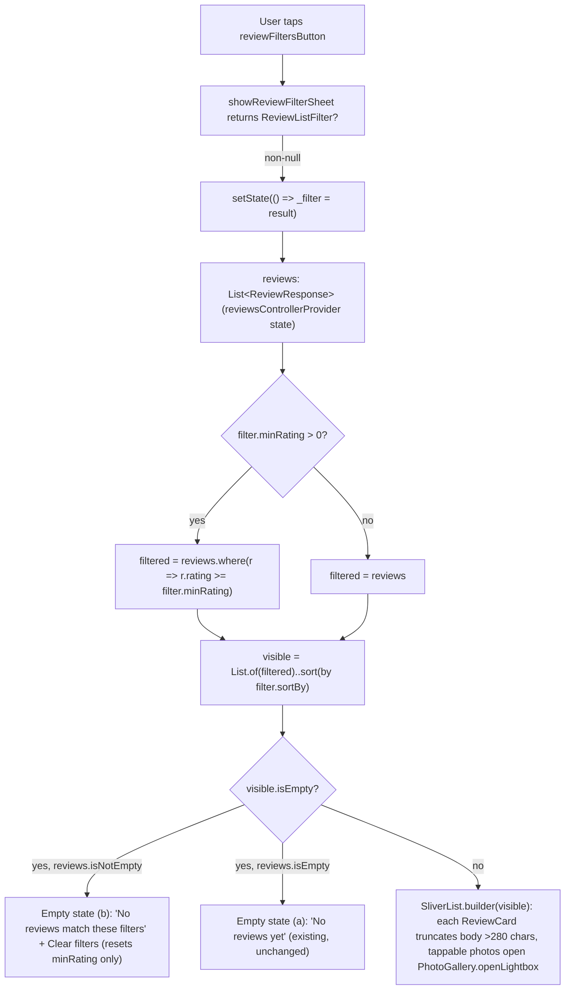

# Slice: S-058 — Mobile review-list interactivity (parity for M-72)

| Field | Value |
|-------|-------|
| **Slice ID** | S-058 |
| **Phase** | 5 Polish |
| **Status** | In Progress |
| **Role(s)** | customer \| merchant \| admin |
| **Owner** | PM / 2026-08-18 |

---

## User story

**As a** mobile app user browsing reviews on a business detail screen
**I want** to sort and filter the review list, read long reviews without an unreadable wall of
text, view review photos in a proper full-screen lightbox, and see fractional average ratings
rendered with half-stars
**So that** the mobile app matches the web app's review-browsing experience (shipped in S-046)
and doesn't feel like a second-class, unfinished surface when I switch from web to mobile

---

## Acceptance criteria

Numbered to parity-match S-046's 8 web AC one-for-one, adapted to Flutter/mobile widgets and
current mobile behavior (verified against `mobile/lib/features/reviews/` and
`business_detail_screen.dart` before writing these — see "Current mobile state" in UX notes).

1. **Given** a business detail screen with more than one review, **when** a user opens the
   review-list sort control, **then** they can choose from at least: Newest, Oldest, Highest
   rating, Lowest rating — and the list re-orders accordingly with no network refetch and no
   screen navigation (in-memory re-sort of the already-loaded list, same data source as today's
   `reviewsControllerProvider`).
2. **Given** a business detail screen's review list, **when** a user selects a minimum
   star-rating filter (e.g. "4 stars & up"), **then** only reviews at or above that rating are
   shown, and the filter can be combined with the sort control from AC 1 at the same time.
3. **Given** a user has applied a sort and/or a minimum-rating filter, **when** the resulting
   combination matches zero reviews, **then** a distinct empty-state message is shown (e.g. "No
   reviews match these filters" with a "Clear filters" affordance) — this must be visually and
   textually different from the existing "No reviews yet — be the first to review" empty state
   shown when a business genuinely has zero reviews (`business_detail_screen.dart` line ~161,
   unchanged by this slice).
4. **Given** a review body exceeds a defined length threshold, **when** the `ReviewCard` first
   renders, **then** the body text is truncated (e.g. Flutter's `maxLines` + `TextOverflow.ellipsis`
   on the `Text` widget, or an equivalent Flutter-native mechanism — Architect's call) with a
   "Read more" toggle below it; **when** the user taps "Read more", **then** the full body is
   shown and the toggle changes to "Read less", which collapses it back on tap.
5. **Given** a review has one or more attached photos, **when** a user taps a review photo
   thumbnail, **then** a full-screen lightbox opens (reusing the existing `_Lightbox` /
   `PhotoGallery` pattern already shipped in `mobile/lib/features/businesses/photo_gallery.dart`
   for business-level photos), rather than the current static, non-tappable thumbnail row in
   `ReviewCard`'s `Image.network` strip (see UX notes — `ReviewCard` today has no `onTap`/lightbox
   at all).
6. **Given** a business's average rating is a fractional value (e.g. 4.5), **when** a readonly
   star-rating display renders that value, **then** it renders a half-star glyph/icon for the
   fractional portion rather than always rounding to a whole star or (as today) showing only a
   single static star icon plus a numeric label. This applies wherever the app shows a
   multi-star readonly average — at minimum the business detail screen header and `BusinessCard`
   (used on the business list / Explore screen). See UX notes: today neither surface renders a
   5-star readonly row at all (both use one `Icons.star` + `averageRating.toStringAsFixed(1)`
   text) — the Architect must decide whether this AC requires introducing a readonly multi-star
   `RatingStars` display for the first time on these surfaces, or another mobile-appropriate
   treatment; either way the fractional value must be visually communicated via partial-star
   fill, not text alone.
7. **Given** a customer is submitting a 1–5 star rating on the review form
   (`ReviewFormSheet`/interactive `RatingStars`), **when** they interact with the rating picker,
   **then** its behavior is unchanged from today — whole-star selection only via `onChanged`, no
   half-star option, same tap interaction as before this slice.
8. **Given** any of the new or changed interactive elements from this slice (sort control,
   filter control, empty state, Read more/less toggle, photo lightbox trigger, half-star
   display), **when** viewed in either light or dark mode, **then** they render correctly using
   the theme (`ColorScheme`/`ThemeData`) established in S-057 (mobile dark mode, Accepted) — no
   new hardcoded `Colors.*` literals that fail to adapt between themes are introduced, consistent
   with S-057's "Tier 2 hardcoded-color sweep" precedent.

---

## UX notes

- **Screens affected:** `business_detail_screen.dart` (review list section is the primary
  surface — AC 1-5, 8); `business_detail_screen.dart` header and `business_card.dart` (used on
  the Explore/business-list screen) additionally for the half-star average display (AC 6).
- **Current mobile state (verified before writing these AC, not assumed):**
  - `RatingStars` (`mobile/lib/features/reviews/rating_stars.dart`) takes an `int rating` only —
    whole-star `Icon(Icons.star / Icons.star_border)` per index, readonly or interactive
    (`onChanged`), no half-star/fractional support of any kind today.
  - `ReviewCard` (`mobile/lib/features/reviews/review_card.dart`) renders review photos as a
    plain horizontal `ListView` of `Image.network` thumbnails with **no `onTap`, no lightbox** —
    tapping a review photo today does nothing.
  - The review body `Text(review.body)` in `ReviewCard` has **no truncation** — long reviews
    render in full, unbounded, today.
  - `business_detail_screen.dart` renders the full, un-paginated `reviews` list from
    `reviewsControllerProvider` (an `AsyncNotifier` wrapping `ReviewRepository.listForBusiness`)
    directly into a `SliverList.builder`, in whatever order the backend returns — **no sort or
    filter control exists today**.
  - Both the business detail header and `BusinessCard` show the average rating as a single
    static `Icon(Icons.star, color: Colors.amber)` plus `Text(business.averageRating.toStringAsFixed(1))`
    — **not** a 5-star readonly row. There is no existing readonly multi-star average display on
    mobile to extend; AC 6 may require introducing one for the first time (Architect decision,
    flagged explicitly above).
  - A full-screen photo lightbox pattern (`_Lightbox`, `PhotoGallery`/`FallbackPhotoStrip`)
    already exists and ships today in `mobile/lib/features/businesses/photo_gallery.dart`, used
    for *business*-level photos (not review photos) — this is the reuse target for AC 5, not a
    net-new lightbox implementation.
- **Mobile has no equivalent of web's sidebar `FilterPanel`.** S-046's web implementation used a
  `Select` dropdown for sort and pill buttons for the min-rating filter, both inline above the
  review list on a wide desktop layout. Mobile's business detail screen is a single scrolling
  column with much less inline width, and there is no existing sort/filter chrome anywhere in
  `mobile/lib` to extend (unlike web's `FilterPanel` precedent). **The Architect must choose the
  mobile-appropriate interaction pattern** — options to evaluate include (non-exhaustive, not a
  PM mandate): a bottom sheet (consistent with `ReviewFormSheet`'s existing bottom-sheet
  convention in this same feature folder), an app-bar/segment control, or inline chips similar to
  S-046's pill pattern if screen width allows. Do not assume a direct port of `FilterPanel` is
  correct or even possible on mobile's layout constraints.
- **Empty states / errors:** two empty states must be visually distinguishable on mobile just as
  on web — (a) business has zero reviews at all (existing copy at
  `business_detail_screen.dart` line ~161, unchanged) vs. (b) filters/sort applied and zero
  reviews match (new copy per AC 3, with a clear-filters affordance).
- **AI disclaimer required?** No new AI surface is introduced by this slice. `ReviewCard`'s
  existing AI sentiment badge and "AI summary (suggestion): ..." text must continue to render
  unchanged and legible — Builder must verify the truncation/toggle layout change (AC 4) doesn't
  disturb where that disclaimer sits relative to the (now possibly collapsed) body text, mirroring
  the same risk S-046's Architect flagged on web for `ReviewCard.tsx`.

---

## Out of scope

- **Any change to web code.** This slice is Flutter/mobile-only; `frontend/` is untouched (S-046
  already shipped and is Accepted there).
- **Any new backend endpoint or API contract change.** S-046's Architect confirmed the web slice
  needed zero backend changes — `Review`/`Business` payloads already carry every field needed
  (`rating`, `created_at`, `photo_urls`, `average_rating` as a float). The mobile-generated API
  client (`merchanthub_api`/`ReviewResponse`/`BusinessResponse`) already mirrors those same
  fields; this slice should not need a new endpoint or a generated-client regeneration unless the
  Architect finds an actual gap on inspection (verify, don't assume, per S-046's own precedent).
- **Topic chips/tags, named reactions (Helpful/Thanks/etc.), AI-summary-to-review click-through,
  server-side pagination** — same out-of-scope list as S-046 on web; none of these exist on
  either platform and this slice does not introduce them on mobile either.
- **Any change to the interactive whole-star submission picker** (`ReviewFormSheet`'s
  `RatingStars` with `onChanged`) — stays whole-star only (AC 7). Half-star support is for the
  *readonly average-rating display* only.
- **Unrelated review-flow changes** — review creation, photo upload, like/report, merchant reply,
  and admin moderation flows (`ReviewsController`, `ReviewRepository`) are untouched by this
  slice; only the read/browse/display path is in scope.
- **Native splash-screen theming, OAuth/maps placeholders, or other unrelated Phase 5 mobile
  polish items** — tracked separately (M-71, and S-057's already-noted follow-ups).
- **A new mobile-only visual redesign of `ReviewCard`/`RatingStars`** beyond what's needed to
  support sort/filter/truncation/lightbox/half-star.

---

## Dependencies

- **S-046 (web review-list interactivity) — Accepted.** This slice parity-matches its 8 AC; the
  Architect should read S-046's technical specification (`docs/agents/slices/S-046-review-list-interactivity.md`)
  for the web implementation's reasoning (filter-then-sort order, 280-char truncation heuristic,
  half-star rounding rule, etc.) as a reference starting point, adapting rather than reinventing
  where Flutter allows an equivalent approach.
- **S-057 (mobile dark mode) — Accepted.** Not a hard blocking dependency (this slice is
  self-contained per the task brief), but AC 8 requires all new markup to render correctly in
  both themes established by S-057 — build directly against that theme rather than needing a
  later dark-mode retrofit.
- Does not depend on M-71 (QR review-collection wizard, not yet started) — no shared surface.

---

## Definition of done (PM)

- [ ] All AC verified in test report
- [ ] UX matches notes above (mobile-appropriate sort/filter interaction chosen and justified by
      Architect, not a blind port of web's `FilterPanel`)
- [ ] Documented in `README.md` §8 Frontend guide if a new cross-cutting mobile pattern is
      introduced (e.g. a new reusable filter/sort widget)
- [ ] `README.md` §12 Web ↔ mobile feature parity tracker — M-72 row updated from
      `unimplemented` to `implemented` (or `partial` if any AC is knowingly deferred — must be
      justified, not silent)
- [ ] `README.md` §12 Mobile parity roadmap Tier 2 annotated as closed for M-72, matching the
      S-057/M-75 precedent
- [ ] `README.md` §14 (and §16 if investor-visible) updated to reflect the closed mobile gap
- [ ] PM Status set to **Accepted**

---

## Technical specification (Architect)

> Verified against the actual mobile code before writing this spec (not just the PM's
> summary), and against the backend router (not assumed): `GET /api/v1/reviews/business/{business_id}`
> (`backend/app/routers/reviews.py` lines 69-70, `list_business_reviews`) takes only
> `business_id` — **no `sort`/`min_rating` query params exist**, it returns the full,
> un-paginated `list[ReviewResponse]`. `ReviewRepository.listForBusiness` (`mobile/lib/features/reviews/review_repository.dart`
> lines 16-26) calls this endpoint as-is and `ReviewsController` (`review_providers.dart`)
> caches the full result in an `AsyncNotifier`. This is the exact same shape S-046's Architect
> found on web (`frontend/src/lib/api.ts`) — confirmed independently here, not assumed from
> the web spec. `ReviewResponse.rating` is `int`, `.createdAt` is `DateTime`, `.photoUrls` is
> `BuiltList<String>?` (`mobile/packages/merchanthub_api/lib/src/model/review_response.dart`),
> and `BusinessResponse.averageRating` is already `num` (not pre-rounded) — every field this
> slice needs already ships on the generated client. **No backend change and no
> `merchanthub_api` client regeneration are needed** — confirmed, not assumed.

### API contract

None. Mobile-only slice — no backend routes added or changed, no generated-client
regeneration. All data needed for sort/filter/truncate/lightbox/half-star already ships on
the existing `ReviewResponse`/`BusinessResponse` models used by `reviewsControllerProvider`.

| Method | Path | Auth | Request | Response |
|--------|------|------|---------|----------|
| — | — | — | — | — |

### RBAC matrix

| Action | customer | merchant | admin |
|--------|----------|----------|-------|
| View/sort/filter review list, expand/collapse body, open photo lightbox, see half-star average display | same (uniform) | same (uniform) | same (uniform) |

Purely a display/interaction feature on the public business detail screen — nothing here is
gated by role, identical to S-046's web finding. Existing `showActions`/`canReply`/
`onRequireLogin` gating on `ReviewCard` (like/report/reply) is untouched by this slice.

### Data model impact

- [x] None

**Details:** none — confirmed by reading `review_response.dart` and `business_response.dart`
in `mobile/packages/merchanthub_api`: `rating`, `createdAt`, `photoUrls` are already present
on `ReviewResponse`, and `averageRating` is already `num` on `BusinessResponse`. No new
fields, no schema change, no ERD update, no `openapi`/codegen diff.

### Cache / side effects

None. No backend write is introduced. Sort/filter operate on the already-fetched, in-memory
list held by `reviewsControllerProvider` (`AsyncNotifier<List<ReviewResponse>>`); the
existing `likeReview`/`reportReview`/`createReview`/`uploadPhoto` mutations on that controller
are unchanged by this slice. No Redis `search:*` (or any) cache invalidation applies —
consistent with S-046's web finding for the equivalent client-side approach.

### Frontend

- **Route:** none added. Changes land inside the existing `business_detail_screen.dart`
  review section and inside `rating_stars.dart` / `review_card.dart` / `photo_gallery.dart`
  (all already-mounted widgets on that screen and the Explore/business-list screen via
  `business_card.dart`).
- **Rendering:** n/a (Flutter, not SSR/CSR) — all changes are widget-level state and
  rendering logic within screens that already fetch data via Riverpod providers on mount;
  no navigation/route change.
- **Components (reuse first):**
  - `business_detail_screen.dart` (`_BusinessDetailBody`) — converts from `ConsumerWidget` to
    `ConsumerStatefulWidget` to hold new local sort/filter UI state (AC 1-3); gains the
    `Icons.tune` filter-trigger button and half-star header row (AC 6).
  - `review_card.dart` (`ReviewCard`, already `StatefulWidget`) — gains truncation/toggle
    state (AC 4) and tappable photo thumbnails wired to `PhotoGallery`'s lightbox (AC 5).
  - `rating_stars.dart` (`RatingStars`) — widens `rating` from `int` to `num` and gains a
    half-star-aware readonly render path (AC 6), interactive path untouched (AC 7).
  - `photo_gallery.dart` (`PhotoGallery`) — gains one new public static entry point,
    `PhotoGallery.openLightbox`, so the lightbox (`_Lightbox`) can be reused from
    `ReviewCard` without duplicating it or making it public wholesale (AC 5).
  - `business_card.dart` — swaps its static `Icon(Icons.star)` + numeric text for
    `RatingStars(rating: business.averageRating)` + the same numeric text (AC 6).
  - No new files, no new Riverpod providers (see "State management" below for why).

#### AC 1 & 2 — sort + min-rating filter (`business_detail_screen.dart`)

**Mobile-appropriate interaction pattern — decision: bottom sheet, not inline chips/dropdown.**
Two independent precedents already exist in `mobile/lib` for exactly this shape, and this
slice follows both rather than inventing a third:
1. `search_filter_sheet.dart`'s `showSearchFilterSheet` — a `showModalBottomSheet` returning
   a typed result object (`SearchQuery?`) via `Navigator.pop(value)`, triggered by an
   `Icons.tune` `IconButton` (key `filtersButton`) in `business_list_screen.dart`'s app bar
   (line ~90-92). Same shape, reused directly (sort `DropdownButtonFormField` + a min-rating
   `DropdownButtonFormField`, same `Apply`/`Clear` button pair).
2. `review_form_sheet.dart`'s `ReviewFormSheet.show` — a bottom sheet already living in this
   same feature folder (`features/reviews/`), confirming bottom sheets are the established
   transient-UI convention for this screen family, not just for search.
   
   Rejected alternatives: inline chips (S-046's web pill pattern) don't fit — the business
   detail screen is a single scrolling column with review cards immediately below, and PM's
   UX notes explicitly flag mobile has no `FilterPanel`-equivalent sidebar/inline chrome to
   extend; an app-bar segmented control doesn't have room for 4 sort options + 4 rating tiers
   simultaneously without wrapping. A bottom sheet matches two existing precedents, needs no
   new widget category, and keeps the trigger to one `IconButton` above the review list.

**New file:** `mobile/lib/features/reviews/review_filter_sheet.dart`, mirroring
`search_filter_sheet.dart`'s shape:

```dart
enum ReviewSortOption { newest, oldest, highest, lowest }

@immutable
class ReviewListFilter {
  const ReviewListFilter({this.sortBy = ReviewSortOption.newest, this.minRating = 0});
  final ReviewSortOption sortBy;
  final double minRating; // 0 = "All", no filter applied
}

Future<ReviewListFilter?> showReviewFilterSheet({
  required BuildContext context,
  required ReviewListFilter initial,
}) => showModalBottomSheet<ReviewListFilter>(
  context: context,
  isScrollControlled: true,
  builder: (context) => _ReviewFilterSheet(initial: initial),
);
```

Body: a `DropdownButtonFormField<ReviewSortOption>` (Newest / Oldest / Highest rating /
Lowest rating — same 4 options as web AC 1) and a `DropdownButtonFormField<double>` (All / 3+
/ 4+ / 5, same tier set `search_filter_sheet.dart` already uses for business min-rating,
reused verbatim for consistency), plus `Clear`/`Apply` buttons exactly like
`_SearchFilterSheet` (`Clear` pops a filter reset to defaults; `Apply` pops the edited
values) — same interaction shape, new data type.

**State management — local `State`, not a new Riverpod provider.** `_BusinessDetailBody`
converts from `ConsumerWidget` to `ConsumerStatefulWidget` and holds
`ReviewListFilter _filter = const ReviewListFilter()` as a plain `State` field, set via
`setState` when the sheet returns a non-null result. This mirrors the existing convention in
this exact file tree for ephemeral, screen-scoped UI state that doesn't need cross-widget
sharing — `ReviewCard`'s own `_reporting`/`_replying`/`_reported` fields are already plain
`State`, not providers (`review_card.dart` lines 40-44). A `StateProvider.family` would work
but adds indirection with no benefit: nothing outside this one screen reads sort/filter
state, and Riverpod's own convention elsewhere in `mobile/lib` (`review_form_sheet.dart`'s
`_rating`/`_photos`, `search_filter_sheet.dart`'s `_city`/`_category`) already reserves plain
`State` for exactly this kind of form/filter-local value, reserving providers for state that
crosses widget boundaries (`reviewsControllerProvider` itself, `authControllerProvider`).

**Derived view — filter, then sort** (same order and same rationale as S-046 web):

```dart
List<ReviewResponse> _visibleReviews(List<ReviewResponse> reviews, ReviewListFilter filter) {
  final filtered = filter.minRating > 0
      ? reviews.where((r) => r.rating >= filter.minRating).toList()
      : reviews;
  final sorted = List<ReviewResponse>.of(filtered);
  sorted.sort((a, b) => switch (filter.sortBy) {
    ReviewSortOption.newest => b.createdAt.compareTo(a.createdAt),
    ReviewSortOption.oldest => a.createdAt.compareTo(b.createdAt),
    ReviewSortOption.highest => b.rating.compareTo(a.rating),
    ReviewSortOption.lowest => a.rating.compareTo(b.rating),
  });
  return sorted;
}
```

Computed inline in `build()` (not memoized — Flutter's `build()` cost here is a `List.sort`
over an already-small, already-in-memory list per rebuild, the same cost profile S-046
accepted for `useMemo` on web; no measured perf issue to justify `Selector`/manual caching).
Critically, this **copies before sorting** (`List<ReviewResponse>.of(filtered)`) rather than
sorting `reviewsControllerProvider`'s state in place — that provider's list is also the
source of truth for `likeReview`/`reportReview`'s optimistic updates and the `reportedIds`
lookup in `_BusinessDetailBody`'s `itemBuilder` (index-based today, must switch to
`review.id`-based lookups once `visible` can reorder relative to the provider's `reviews`
list — flagged again in Risks).

**Trigger UI:** one `IconButton` (`Icons.tune`, key `reviewFiltersButton`) placed in the
`Row` that currently shows the average-rating line (`business_detail_screen.dart` lines
99-107), opening `showReviewFilterSheet`. When `_filter` is non-default, the icon shows a
small badge dot (reusing the same `Badge` widget pattern Flutter Material ships, no new
dependency) so users can see a filter is active without opening the sheet — parity with
web's persistent pill-button highlighting.

#### AC 3 — distinct empty state

Two empty states, same distinction as S-046 web:
- **(a) Business has zero reviews at all** — existing `reviews.isEmpty` branch in
  `business_detail_screen.dart` (line ~158-163, "No reviews yet — be the first to review"),
  unchanged.
- **(b) NEW — filter/sort applied, zero results** — `reviews.isNotEmpty && visible.isEmpty`.
  Only `minRating` can cause this (sorting alone only reorders, same reasoning as web) — the
  "Clear filters" affordance resets `_filter.minRating` to `0` only, leaves `sortBy` alone.
  Rendered as a bordered `Container` (`Theme.of(context).colorScheme.outline` border,
  `surfaceContainerHighest` background per S-057's token conventions) with the message *"No
  reviews match these filters"* plus a `TextButton` (key `clearReviewFiltersButton`) that
  calls `setState(() => _filter = ReviewListFilter(sortBy: _filter.sortBy))` — visually and
  structurally distinct from state (a)'s plain centered `Text`, so a 5-star filter on an
  all-4-star business never reads as "this business has no reviews."

#### AC 4 — truncation + Read more/less (`review_card.dart`)

**Mechanism:** `Text` widget's built-in `maxLines`/`overflow`, gated by local `State`
(`_expanded`), Flutter's direct equivalent of web's CSS `line-clamp-3` + toggle — no
`TextPainter`/`LayoutBuilder` overflow measurement needed for the *visual* clamp (Flutter's
`Text` handles that natively via `maxLines: 3` + `TextOverflow.ellipsis`).

**Threshold:** same 280-character heuristic as S-046 web, for the same reason — deciding
*whether to show the toggle at all* only needs a cheap length check, not a measured overflow
pass; `review.body.length > 280` gates whether the "Read more" button renders. When shown:
`Text(review.body, maxLines: _expanded ? null : 3, overflow: _expanded ? TextOverflow.visible
: TextOverflow.ellipsis)`, with a `TextButton` (key `reviewReadMoreToggle`) below it toggling
`_expanded` and its own label between "Read more"/"Read less". `_expanded` defaults to
`false`, lives in `_ReviewCardState` alongside the existing `_reporting`/`_replying` fields.

Flag (mirrors S-046's own flagged risk): the 280-char cutoff is tunable, not load-bearing —
one constant, adjust if Tester finds it visually off for typical card width/font size on
mobile viewports (which differ from web's).

#### AC 5 — photo lightbox (`review_card.dart` + `photo_gallery.dart`)

**Confirmed not directly reusable as-is:** `_Lightbox` in `photo_gallery.dart` is a private
class (leading underscore) — file-private in Dart, so `ReviewCard` cannot import and use it
directly without a refactor. `PhotoGallery` itself is public but is a full section widget
("Photos" heading + its own hardcoded 96×96 grid), not designed to be embedded inside
`ReviewCard`'s existing compact horizontal photo strip — wrapping it there would duplicate
the "Photos" heading and force `ReviewCard` into `PhotoGallery`'s fixed thumbnail sizing.

**Resolution — minimal, additive refactor:** add one new public static method to
`PhotoGallery`, exposing only the lightbox-opening behavior without exposing `_Lightbox`
itself or changing any existing call site:

```dart
class PhotoGallery extends StatelessWidget {
  // ...existing code unchanged...

  static void openLightbox(BuildContext context, {required List<String> urls, required int initialIndex}) {
    showDialog<void>(
      context: context,
      builder: (context) => _Lightbox(urls: urls, initialIndex: initialIndex),
    );
  }
}
```

`PhotoGallery`'s and `FallbackPhotoStrip`'s own existing `onTap` handlers are refactored to
call `PhotoGallery.openLightbox(...)` instead of inlining `showDialog`/`_Lightbox` directly —
a zero-behavior-change dedup, not a new code path (both today do exactly what the new static
method does, just inline). `ReviewCard` keeps its own existing compact photo strip layout
(unchanged 64×64 `ListView.separated` thumbnails, `review_card.dart` lines 168-187) and wraps
each thumbnail in a `GestureDetector` (key `Key('reviewPhotoThumb_$index')`) calling
`PhotoGallery.openLightbox(context, urls: photoUrls.map(ReviewCard._resolveUrl).toList(),
initialIndex: index)` — reuses the lightbox interaction (`_Lightbox`'s `PageView` +
`InteractiveViewer` pinch-zoom + close button) wholesale, with zero duplicate lightbox logic,
while keeping `ReviewCard`'s own thumbnail sizing untouched (unlike web's `PhotoGallery.tsx`,
which needed layout-override *props* because React's version renders the grid *and* the
lightbox from one component; Flutter's version already separates "the grid" from "the
lightbox trigger," so only the trigger needs exposing here — a smaller, lower-risk change
than the web equivalent).

#### AC 6 & 7 — half-star readonly display, picker untouched (`rating_stars.dart`)

**Type widen, not a new widget.** `RatingStars.rating` changes from `int` to `num` (backward
compatible — every existing caller passes an `int`, which is a subtype of `num`; confirmed
via repo-wide grep, only 3 call sites: `review_card.dart` readonly, `review_form_sheet.dart`
interactive, and `rating_stars.dart` itself). This lets the same widget accept
`BusinessResponse.averageRating` (already `num`) directly, with no new component.

**Half-star technique — `Icons.star_half`, not a manual overlay.** Unlike web (which had to
build a width-clipped two-glyph overlay because unicode `★` has no built-in half-star glyph),
Flutter's Material icon set ships `Icons.star_half` natively — no new asset, no overlay
widget, no new dependency. Readonly branch (`_readonly == true`, i.e. `onChanged == null`):

```dart
final displayValue = (rating * 2).round() / 2; // round to nearest half-star
for (var i = 1; i <= 5; i++)
  Icon(
    displayValue >= i
        ? Icons.star
        : displayValue >= i - 0.5
            ? Icons.star_half
            : Icons.star_border,
    size: size,
    color: Colors.amber,
  )
```

Same rounding rule as S-046 web (`Math.round(value * 2) / 2`) — e.g. `rating = 4.3` →
`displayValue = 4.5` → stars 1-4 full, star 5 half. `Colors.amber` is kept as-is, not
converted to a `ColorScheme` role — this matches S-057's own explicit precedent ("`Colors.amber`
star rating usually doesn't need to change," S-057 technical spec §5) since amber reads
correctly against both the light and dark `ColorScheme` surfaces already in place; AC 8 is
satisfied by inheritance from that prior decision, not a new one.

**AC 7 satisfied by construction:** the interactive branch (`onChanged != null`) is a
completely separate `IconButton`-per-star code path (existing code, lines 32-40 of
`rating_stars.dart`), untouched by this change — it still does a plain `i <= rating`
whole-star comparison (works unchanged under `num`, since `_rating` in `ReviewFormSheet` is
always assigned as `int`) and never computes `displayValue` or renders `Icons.star_half`. The
half-star logic lives entirely inside the `_readonly` branch.

**Call sites gaining a readonly star row for the first time (resolves PM's open question):**
- `business_detail_screen.dart` header (lines 99-107) — the existing `Row` with a static
  `Icon(Icons.star)` + `Text(business.averageRating.toStringAsFixed(1))` + review count. The
  single static icon is replaced with `RatingStars(rating: business.averageRating)`; the
  numeric `Text(...toStringAsFixed(1))` is **kept alongside it**, same as S-046 kept the
  numeric label next to web's `RatingWidget` — the star row communicates the fractional value
  visually (AC 6's actual requirement), the digit gives the precise number, neither replaces
  the other.
- `business_card.dart` (lines 77-84) — same swap, same reasoning, inside the existing
  `trailing` `Column`.
- **Decision: yes, this AC requires introducing a readonly multi-star row on both surfaces
  for the first time** (the PM's open question, resolved). The alternative the PM floated —
  "another mobile-appropriate treatment" that keeps a single icon — was rejected because a
  single icon cannot visually communicate a *partial* fill at all (that's the actual AC 6
  requirement: "the fractional value must be visually communicated via partial-star fill, not
  text alone"), so a 5-star row is the only option that satisfies the AC literally, and
  `RatingStars` already exists and needs no new component to do it once widened to `num`.

#### AC 8 — dark mode compliance for all new markup

| New element | Token / pattern used |
|---|---|
| `reviewFiltersButton` icon + badge dot | `IconButton`/`Badge` default Material theming, already `ColorScheme`-driven — no hardcoded colors |
| `ReviewFilterSheet`'s `DropdownButtonFormField`s | same `InputDecoration`/dropdown widgets `search_filter_sheet.dart` already uses today, already theme-safe (no new classes) |
| AC-3 zero-results empty state box | `Theme.of(context).colorScheme.outline` border, `.surfaceContainerHighest` background, `.onSurfaceVariant`/default text color — same tokens `_GalleryBlock`'s error fallback and `merchantReplyBlock` already use elsewhere in this file |
| Read more/less `TextButton` | default `TextButton` theming (`ColorScheme.primary`), same pattern as the existing "Reply as business" `TextButton` in `review_card.dart` — no new color |
| `RatingStars` half-star icons | `Colors.amber`, unchanged from today's whole-star rendering — explicitly accepted as staying literal per S-057 precedent (see AC 6/7 above), not a new hardcoded-color introduction since it was already there pre-slice |
| `PhotoGallery.openLightbox` / `_Lightbox` | unchanged, already theme-agnostic (`backgroundColor: Colors.black` scrim, same as web's `bg-black/80`) |

No new hex values or new hardcoded `Color(0x...)` literals are introduced by this slice —
every new element either reuses `Theme.of(context).colorScheme.*` or an already-accepted
literal (`Colors.amber` on stars, `Colors.black` on the lightbox scrim), both pre-existing
and already reasoned about in S-057. This keeps AC 8 mechanically verifiable for Tester (grep
the diff for new `Color(0x`/bare `Colors.*` outside the two already-accepted cases, expect
zero hits).

### Flow



### Key decisions (rationale)

- **Client-side, in-memory sort/filter over server query params.** Confirmed by reading
  `backend/app/routers/reviews.py` directly (not assumed from S-046's web finding): the
  `GET /business/{business_id}` route takes only `business_id`, no `sort`/`min_rating`
  params, and returns the full array. Adding server-side params would need a new backend
  contract change this slice's own Out-of-scope section rules out ("Any new backend endpoint
  or API contract change"), and would reintroduce a network round-trip AC 1 explicitly rules
  out ("no network refetch"). Not ADR-worthy — reversible, component-scoped, matches S-046's
  same call on web.
- **Bottom sheet over inline chips/dropdown for sort+filter UI.** Two existing precedents
  (`search_filter_sheet.dart`, `review_form_sheet.dart`) already establish this as the
  mobile-appropriate pattern for transient multi-field UI in this app; inline chips (web's
  pattern) don't fit the single-column, limited-width business detail screen. Not ADR-worthy
  — a UI-pattern choice, not one of the four ADR trigger categories.
- **Local `State`, not a new Riverpod provider, for sort/filter state.** Matches the existing
  convention for screen-scoped ephemeral UI state elsewhere in this file tree
  (`ReviewCard._reporting`/`_replying`, `_SearchFilterSheetState`'s form fields). No cross-
  widget sharing is needed. Not ADR-worthy.
- **`Icons.star_half` over a manual clipped-overlay technique.** Flutter ships this icon
  natively; web had no unicode equivalent and had to build one. Simpler and lower-risk than
  porting web's overlay technique verbatim. Not ADR-worthy.
- No ADR filed for this slice. None of the four decisions above are a new integration, schema
  pattern change, auth change, or AI provider behavior change — the four triggers per
  `.claude/agents/architect.md`.

### Architect checklist

- [x] API contract defined (none applicable — mobile-only, confirmed against
      `backend/app/routers/reviews.py` directly, not assumed)
- [x] RBAC matrix complete (uniform across all three roles, stated explicitly)
- [x] Data model impact documented (none — `ReviewResponse`/`BusinessResponse` already carry
      every field needed, confirmed against the generated client models)
- [x] Cache invalidation considered (none applicable — no backend write)
- [x] Uses AI/storage abstractions where applicable (n/a — no AI or storage calls in this
      slice; existing AI sentiment badge / "AI summary (suggestion)" text in `ReviewCard`
      untouched by the truncation layout change — Builder must verify placement, called out
      again in Risks below, same risk S-046's Architect flagged on web)
- [x] ERD/API/FLOWS updates noted (none needed for ERD/API; `README.md` §8 Frontend guide —
      new `review_filter_sheet.dart` bottom-sheet pattern, `RatingStars` half-star widen,
      `PhotoGallery.openLightbox` — and §12 parity row (M-72 → `implemented`) are tracked in
      the PM's Definition of done, to be done by whoever lands the PR per `docs/CLAUDE.md`)

### Risks / tradeoffs

- **`reportedIds`/like optimistic-update lookups must stay `review.id`-keyed, not
  index-keyed, once the rendered list can reorder.** `_BusinessDetailBody`'s current
  `itemBuilder` already looks up `reviewsController.reportedIds.contains(reviews[index].id)`
  by `.id` (not raw index), so this is *already* safe by construction — flagged here as a
  Builder verification point, not a required change, since it would be an easy regression to
  introduce accidentally while wiring `visible` in as the new list source instead of
  `reviews`.
- **280-character truncation threshold is a heuristic carried over from web, not
  re-measured against mobile viewport/font metrics.** Same caveat S-046 flagged; adjust the
  single constant if Tester finds it visually off for typical Flutter card widths, which
  differ from web's.
- **AI disclaimer / sentiment badge placement adjacent to the truncation toggle** — identical
  risk to S-046's web flag. `ReviewCard` renders the "AI summary (suggestion): ..." block
  directly below the body `Text` (lines 150-167); adding the truncation toggle between them
  changes vertical spacing. Builder must visually confirm the AI block still reads as clearly
  attached to *this* review in both collapsed and expanded states.
- **`PhotoGallery.openLightbox` is a small but real public-API surface change** (new static
  method) — low risk (additive, no signature change to the constructor or existing methods)
  but Builder should confirm no existing test asserts `_Lightbox`/`showDialog` call counts in
  a way the internal dedup (existing call sites routed through the new static) could disturb.
- **Widget-test complexity for the bottom-sheet sort/filter interaction** — `showModalBottomSheet`
  interactions (open sheet, select dropdown value, tap Apply, assert the underlying list
  reordered) are inherently more multi-step in `flutter_test`'s `pumpAndSettle`-driven model
  than a plain `tap()`/`expect()`; flagged for Tester as the highest-effort AC coverage in
  this slice (mirrors S-046's own flagged gap that the equivalent web click-to-open lightbox
  interaction went code-inspection-verified rather than fully scripted — Tester may make the
  same call here for the bottom-sheet round trip if a full `pumpAndSettle` script proves
  flaky).
- **No known backend gap.** Unlike a hypothetical scenario where mobile needed server-side
  filtering the web slice didn't, this slice's needs are a strict subset of what
  `GET /business/{business_id}` already returns — confirmed directly against the router, not
  inferred from S-046's web spec alone.

---

## Links

- Test plan: `docs/agents/test-plans/TP-S-058-*.md`
- Test report: `docs/agents/test-reports/TR-S-058-*.md`
- ADR: `docs/agents/adrs/ADR-XXX-*.md` (if any)

---

## Changelog

| Date | Agent | Change |
|------|-------|--------|
| 2026-08-18 | PM | Created slice. Mobile parity for M-72 (review-list sort/filter/truncate/lightbox + half-star ratings), closing the mobile gap left open by S-046 (web-only, Accepted). 8 numbered AC parity-matched one-for-one to S-046's web AC, adapted for Flutter after directly inspecting `mobile/lib/features/reviews/` (`rating_stars.dart`, `review_card.dart`, `review_form_sheet.dart`, `review_providers.dart`, `review_repository.dart`) and `business_detail_screen.dart`/`business_card.dart` — confirmed current mobile state: whole-star-only `RatingStars` (no half-star), no sort/filter control anywhere, `ReviewCard` photo thumbnails have no tap/lightbox (though a reusable `_Lightbox`/`PhotoGallery` pattern already exists for business-level photos and is the reuse target for AC 5), no body truncation, and both readonly average-rating surfaces show a single static star icon + numeric text rather than a 5-star row (flagged as an open question for the Architect on AC 6). Explicitly noted mobile has no equivalent of web's `FilterPanel` sidebar — Architect must choose a mobile-appropriate interaction (bottom sheet / app-bar control / inline chips), not assume a direct port. Out of scope: web changes, new backend endpoints (S-046 confirmed none needed on web; verify not assume on mobile), unrelated review-flow changes (create/like/report/reply/moderate untouched), and the interactive whole-star submission picker (stays as-is, AC 7). Depends on S-046 (Accepted, reference for adapted reasoning) and non-blockingly on S-057 (Accepted, dark-mode tokens to build against per AC 8) — self-contained otherwise, no dependency on M-71 or M-75. Status: Draft. Technical specification left as template for Architect. |
| 2026-08-18 | Builder | Implemented per the Architect's spec. New `mobile/lib/features/reviews/review_filter_sheet.dart` (`ReviewListFilter`/`ReviewSortOption`, bottom sheet mirroring `search_filter_sheet.dart`). `rating_stars.dart`: `rating` widened `int` → `num`, readonly branch renders `Icons.star_half` via `(rating*2).round()/2`; interactive branch untouched (AC 7). `business_detail_screen.dart`: `_BusinessDetailBody` converted `ConsumerWidget` → `ConsumerStatefulWidget` holding local `_filter` state; added `_visibleReviews` (filter-then-sort, copies before sorting); added `reviewFiltersButton` (`Icons.tune` + active-filter `Badge` dot) next to the rating line, shown only when reviews exist; added the distinct `reviewFiltersEmptyState` (bordered container + "Clear filters", `clearReviewFiltersButton` resets `minRating` only) separate from the existing zero-reviews empty state; header rating icon replaced with `RatingStars(rating: business.averageRating)` (AC 6). `business_card.dart`: same `RatingStars` swap for the Explore/list surface, numeric label kept alongside both (per Architect decision). `review_card.dart`: added `_expanded` state + 3-line `maxLines`/`overflow` truncation with a `reviewReadMoreToggle` button gated on `body.length > 280` (AC 4); wired photo thumbnails to `PhotoGallery.openLightbox` via a new `GestureDetector` per thumbnail (key `reviewPhotoThumb_$index`) (AC 5). `photo_gallery.dart`: added public static `PhotoGallery.openLightbox(context, {urls, initialIndex})`; both `PhotoGallery`'s own thumbnail `onTap` and `FallbackPhotoStrip`'s now route through it instead of inlining `showDialog`/`_Lightbox` (zero behavior change, pure dedup) so `ReviewCard` can reuse the lightbox without exposing `_Lightbox`. AC 8: no new hardcoded colors — new empty-state container uses `colorScheme.outline`/`.surfaceContainerHighest`, everything else reuses default Material theming or the already-accepted `Colors.amber`/`Colors.black` literals per S-057 precedent. `flutter analyze` clean; `flutter test` 154/154 passing (no regressions; no new widget-test coverage added yet for the bottom-sheet flow, half-star rendering, truncation toggle, or lightbox trigger — flagged for Tester per the Architect's own risk note on widget-test complexity for this slice). Status: Specified → **In Progress**. |
| 2026-08-18 | Architect | Filled technical specification. Confirmed directly against `backend/app/routers/reviews.py` (`GET /business/{business_id}`, no `sort`/`min_rating` params, full un-paginated list) and the generated `merchanthub_api` models (`ReviewResponse.rating`/`.createdAt`/`.photoUrls`, `BusinessResponse.averageRating: num`) that no backend change or client regeneration is needed — same finding as S-046 web, independently re-verified on mobile. RBAC uniform, no data-model impact, no cache/side effects. Specified: sort+filter via a new `review_filter_sheet.dart` bottom sheet (`ReviewListFilter`/`ReviewSortOption`), following two existing bottom-sheet precedents (`search_filter_sheet.dart`, `review_form_sheet.dart`) rather than porting web's inline `FilterPanel` pills; state held as local `State` on `_BusinessDetailBody` (converted to `ConsumerStatefulWidget`), not a new Riverpod provider, matching the existing convention for screen-scoped ephemeral UI state; filter-then-sort derived list mirrors S-046's ordering rationale; AC 3's two empty states kept distinct, "Clear filters" resets `minRating` only; AC 4 truncation via `Text`'s native `maxLines`/`overflow` gated by the same 280-char heuristic as web; AC 5 resolved the reuse question — `_Lightbox` is file-private and not directly reusable, so `PhotoGallery` gains one new public static `openLightbox` method (existing call sites refactored to use it too, zero behavior change) rather than exposing `_Lightbox` wholesale or duplicating lightbox logic in `ReviewCard`; AC 6/7 decided **`Icons.star_half`** (Flutter's native half-star icon, simpler than web's manual unicode overlay) with `RatingStars.rating` widened from `int` to `num` (backward-compatible, only 3 call sites); resolved the PM's open question — yes, AC 6 requires introducing a readonly multi-star row on `business_detail_screen.dart`'s header and `business_card.dart` for the first time, numeric label kept alongside per S-046's precedent; AC 7 satisfied by construction (interactive branch untouched, separate code path); AC 8 table maps every new element to an existing `ColorScheme` token or an already-accepted literal (`Colors.amber` on stars per S-057's own precedent, `Colors.black` lightbox scrim), no new hardcoded colors. No ADR filed — none of the four notable decisions (client-side sort/filter, bottom-sheet UI, local `State` over a provider, `Icons.star_half`) meet the four ADR trigger categories. Flagged risks: `reportedIds`/like lookups must stay `.id`-keyed once the list can reorder (already true today, verification point not a required change), 280-char threshold heuristic, AI-disclaimer spacing adjacent to the truncation toggle (same risk S-046 flagged on web), `PhotoGallery.openLightbox`'s small public-API addition, and bottom-sheet interaction being the highest widget-test-effort AC in this slice. No backend gap found. Architect checklist complete. Status: Draft → **Specified**. |
