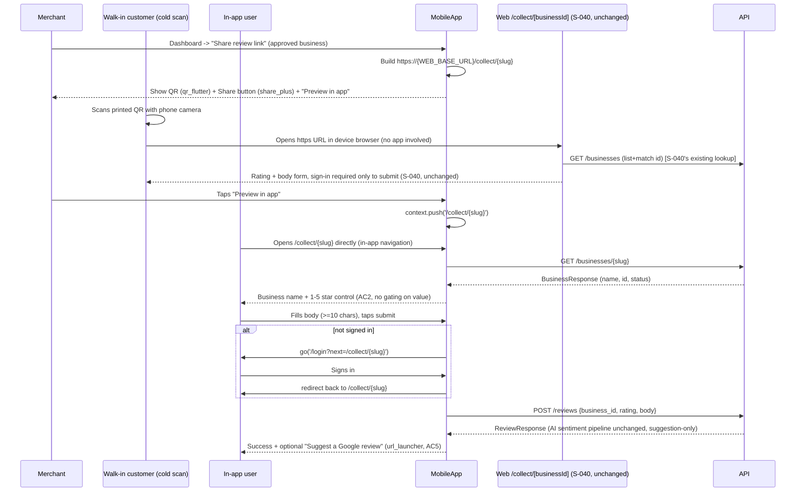

# Slice: S-059 — Mobile review collection flow (parity for M-71)

| Field | Value |
|-------|-------|
| **Slice ID** | S-059 |
| **Phase** | 5 Polish |
| **Status** | Accepted |
| **Role(s)** | merchant \| customer |
| **Owner** | PM / 2026-08-18 |

---

## User story

**As a** merchant using the mobile app
**I want** a shareable public review-collection link and QR code for my business, and a way for
walk-in customers to leave a review from that link without hunting for my listing in search
**So that** the mobile app matches the web app's counter-collection flow (shipped in S-040) and
merchants who mostly use the phone app aren't stuck opening a browser or a laptop just to grab
their review-collection QR code

**As a** customer (or any member of the public) who scans a merchant's QR code or opens their
review-collection link
**I want** to land directly on a simple, business-specific review form — no search, no rating
gated/intercepted based on how many stars I give
**So that** leaving quick feedback for a business I just visited is frictionless

---

## Acceptance criteria

Numbered to parity-match S-040's 5 web AC one-for-one, adapted to Flutter/mobile after reading
S-040 in full and directly inspecting `mobile/lib/features/reviews/`, `mobile/lib/router.dart`,
`mobile/lib/features/merchant/merchant_dashboard_screen.dart`, and the backend routers
(`backend/app/routers/reviews.py`, `backend/app/routers/businesses.py`) — see "Current state
verified" in UX notes.

**Important clarification carried over from S-040 (do not re-litigate):** "no gating" in the
M-71 row and in S-040's title means **no star-rating interception** — a 1-star and a 5-star
submission both continue through the identical flow, unlike a review-gating dark pattern that
hides low ratings from the public feed. It does **not** mean "no authentication." S-040 AC 3
confirms the web wizard still requires sign-in to actually submit (`POST /reviews` is
role-gated on the backend — `require_roles(CUSTOMER, MERCHANT, ADMIN)`, confirmed by reading
`backend/app/routers/reviews.py` line 153, unauthenticated callers get redirected to
`/login?next=...`, not silently blocked). This slice preserves that exact same distinction on
mobile: the **landing/viewing** experience is ungated (reachable and viewable without a
session), the **submission** step still requires a signed-in customer/merchant/admin account,
identical to web.

1. **(Merchant side — parity for S-040 AC 4, QR/link generation)** Given a merchant is viewing
   one of their **approved** businesses on the mobile merchant dashboard
   (`merchant_dashboard_screen.dart` / a business's detail area within it), when they use a new
   "Share review link" (or equivalent) action, then they can view a QR code encoding that
   business's public review-collection URL and share the link itself through the device's
   native share sheet — mobile-appropriate equivalent of web's on-dashboard QR card
   (`qrcode.react`). Not shown for a pending/rejected/suspended business, matching S-040 AC 4's
   "approved" gate.
2. **(Parity for S-040 AC 1 — no rating interception)** Given the public review-collection
   landing experience is opened for an approved business (via whatever mechanism the Architect
   selects — see UX notes' open question), when anyone views it, then they see the business
   name and a 1–5 star control, and submitting any value 1–5 continues to the identical next
   step (the review-body entry) — no branch, redirect, or intercept based on the star value
   chosen, exactly mirroring S-040 AC 1.
3. **(Parity for S-040 AC 2)** Given a signed-in customer (or merchant/admin) completes a rating
   plus a review body of at least 10 characters on the collection screen, when they submit, then
   the review is created through the existing, unmodified review-creation path
   (`ReviewRepository.createReview` → `POST /api/v1/reviews`), with AI sentiment
   analysis running through the existing pipeline unchanged and still surfaced only as a
   suggestion, never a definitive judgment, everywhere it's later shown (e.g. on the resulting
   `ReviewCard`) — no new AI-facing UI is introduced by this slice itself (matches S-040, which
   also added no new AI surface).
4. **(Parity for S-040 AC 3)** Given the person is not signed in when they reach the point of
   submitting a review through this flow, when they attempt to submit, then they are routed to
   the mobile login screen with a way to return to the collection screen for the same business
   after authenticating (the mobile equivalent of web's `?next=/collect/{id}` — e.g. a route
   query param or a post-login redirect target), rather than a silent failure, a generic error,
   or an unexplained dead end.
5. **(Parity for S-040 AC 5 — optional, non-gating Maps suggestion)** Given a review is
   successfully submitted through this flow, when the confirmation is shown, then an optional
   "Suggest to also leave a Google review" affordance may be offered (e.g. opening a Maps search
   deep link via the already-present `url_launcher` package), clearly presented as optional and
   not required to complete the flow — matches S-040 AC 5's "suggestion, not gating."
6. **(Mobile-specific, no direct web AC — role/permission case)** Given the "Share review link"
   action from AC 1, when a **customer or admin** (not the owning merchant) attempts to reach
   that action, then it is not shown/reachable to them on the merchant dashboard (the dashboard
   itself is already merchant-role-gated per the existing `postLoginPath`/router redirect logic
   in `mobile/lib/router.dart` — this AC just confirms the new action inherits that existing
   gate rather than accidentally becoming reachable some other way).

---

## UX notes

- **Screens / routes affected:**
  - `mobile/lib/features/merchant/merchant_dashboard_screen.dart` — gains the "Share review
    link" / QR-and-link action for an approved business (AC 1, 6).
  - A new public review-collection landing screen/route (AC 2–5) — exact route shape is an open
    question below, not a PM mandate.
- **Current state verified (not assumed) before writing these AC:**
  - `POST /api/v1/reviews` (`backend/app/routers/reviews.py` line 148-153) is role-gated
    (`require_roles(CUSTOMER, MERCHANT, ADMIN)`) — same as web, no anonymous review creation
    exists or is being requested by this slice.
  - `GET /api/v1/businesses` (list, line 75) and `GET /api/v1/businesses/{slug}` (line 217) are
    both public (no `Depends(get_current_user)`/`require_roles`) — confirmed by reading
    `backend/app/routers/businesses.py` directly. There is **no public get-business-by-id**
    endpoint on either web or mobile today; S-040's own Architect worked around this on web by
    fetching the public list and matching `id` client-side. Mobile's `BusinessRepository`
    (`mobile/lib/features/businesses/business_repository.dart`) only has `getBySlug` today, no
    `getById` — the Architect should decide whether the mobile collection screen resolves the
    business the same way web did (list + match `id`) or whether it's simpler for mobile to key
    the whole flow off `slug` instead of `businessId` since a direct, single-business fetch
    already exists for slug (`getBySlug`) and the merchant dashboard already has both `id` and
    `slug` available for any business it owns (`BusinessResponse` has both fields). Either
    keeps AC 2's outcome identical; this is purely a "what does the link/QR payload encode"
    decision.
  - `mobile/lib/features/reviews/review_form_sheet.dart` today is a **bottom sheet**, not a
    route, opened from an already-loaded, already-authenticated business detail screen — it is
    not the same shape as a self-contained, potentially-cold-launch, potentially-unauthenticated
    entry point a QR scan needs to hand off to. This slice is not "add a button that opens the
    existing sheet" — it likely needs a route-shaped screen so it can be a genuine landing
    destination, matching web's dedicated `/collect/[businessId]/page.tsx` rather than reusing
    the existing gated-context sheet verbatim. Architect's call on how much of
    `ReviewFormSheet`'s form logic (rating + title + body + photos) is reused vs. rebuilt as a
    screen.
  - `mobile/lib/router.dart`'s `redirect` callback already has a documented **public-route
    carve-out precedent** (`isPublicBusinessRoute`, citing `ADR-003`) for `/businesses` and
    `/businesses/*` — reachable without a session, matching this slice's own "landing is
    ungated, submission is gated" requirement (AC 2 vs AC 3/4). A new `/collect/:id` (or
    `/collect/:slug`) route added to that same carve-out list is the direct mobile-native
    pattern to follow, not a new redirect mechanism.
  - **No QR-code-generation package exists in `mobile/pubspec.yaml` today** (grepped: no
    `qr_flutter` or equivalent) — AC 1 needs one added. **No share-sheet package exists either**
    (`share_plus` not present) — AC 1's "share the link" half needs one added too. Both are
    small, standard, low-risk pubspec additions (mirrors web's `qrcode.react` dependency add in
    S-040), not a concern in themselves, but the Architect must name the exact packages in the
    technical specification (Builder shouldn't have to pick blind).
  - `url_launcher: ^6.3.2` **is already present** — AC 5's optional Maps suggestion needs no new
    dependency, same as S-040's web version reused a plain `<a>` link.
- **Open question for Architect — how does a scanned QR/opened link actually reach the app?**
  PM is flagging this rather than guessing a mechanism, since it materially changes scope:
  - No deep-link package (`app_links`, `uni_links`, or equivalent) exists anywhere in
    `mobile/pubspec.yaml`, and PM found no Android App Links (`assetlinks.json` / manifest
    intent-filter) or iOS Universal Links (`apple-app-site-association`) configuration evidence
    in a codebase-wide check. Wiring a *true* "scan this QR on a phone with the app installed →
    the app itself opens directly to the collection screen" journey is real infrastructure (OS
    registration, hosted association files, intent filters), not just Flutter/Dart app code.
  - **Default scope boundary this slice assumes unless the Architect finds it trivial to widen:**
    (a) mobile ships the merchant-side QR/link generation (AC 1) and a new in-app,
    ungated `/collect/...` route (AC 2-5) reachable by direct navigation (e.g. for a merchant
    testing their own link, or a customer already inside the app tapping a shared link that
    `url_launcher` hands back into the app via a custom scheme if one is easy to add) — and
    (b) a cold scan of a physical QR code by someone with no app context continues to resolve to
    the **already-shipped, Accepted** web page (`/collect/[businessId]`, S-040) opening in the
    device's browser, which costs zero incremental work here. This slice does not fail to
    deliver "no gating" parity if (b) is what actually happens for a cold scan — the web
    experience already satisfies M-71's public/no-gating intent end-to-end; mobile's own
    incremental value is the native merchant QR/share UI and an in-app landing screen for
    everyone else.
  - If the Architect determines true OS-level App Links/Universal Links registration is low
    effort given the existing web deploy, they may include it — but PM is not mandating it, and
    Builder should not silently attempt it without the Architect scoping it explicitly in the
    technical specification (it touches hosting/DNS-adjacent config beyond typical mobile-app
    code).
- **Empty states / errors:**
  - Business not found / not approved when the collection screen is opened (e.g. stale link
    after a business is suspended) — show a clear message, not a blank screen or crash; mirrors
    S-040's implicit "approved" gate (AC 1's premise is "an approved business").
  - Submission with < 10-character body or no star selected — same validation and disabled-submit
    pattern already used in `ReviewFormSheet` today (`_isValid` check), reused not reinvented.
- **AI disclaimer required?** No new AI-facing UI is introduced by this slice (AC 3 explicitly
  notes this) — the created review's AI sentiment badge/"AI summary (suggestion): ..." text
  renders later, wherever reviews are already shown (`ReviewCard`, unchanged), not on the
  collection screen itself. Nothing new to disclaim here beyond what already exists.

---

## Out of scope

- **Any change to web code.** `frontend/` is untouched — S-040 already shipped there and is
  Accepted. This slice is Flutter/mobile-only.
- **Any new backend endpoint, unless the Architect finds an actual gap.** S-040's web version
  needed zero new backend routes (confirmed in its own technical spec: reuses
  `GET /businesses` / `GET /businesses/{slug}` for lookup and the existing `POST /reviews` for
  creation). This slice should not need one either — verify, don't assume, same standard S-040
  and S-058 both held themselves to.
- **Any star-rating interception/gating logic** — 1-star and 5-star reviews both continue
  through the identical flow with no branch (AC 2), matching S-040's own explicit non-goal.
- **Registering true Android App Links / iOS Universal Links** (asset-links hosting, intent
  filters, `apple-app-site-association`) so a cold QR scan opens the app directly — flagged as
  an open question above, not committed to by default; only in scope if the Architect scopes it
  in explicitly.
- **Payments, checkout, or anything from the M-66 featured-listing boost line** — unrelated.
- **Editing/deleting reviews, merchant reply, moderation** — this slice is submission-only,
  identical in scope to S-040's own boundary on web.
- **Any change to the existing gated `ReviewFormSheet` flow** used from the business detail
  screen (S-023) — that flow stays as-is; this slice adds a new, separate, ungated entry point,
  it does not modify the existing one (though it may reuse pieces of its form logic — Architect's
  call, per UX notes).

---

## Dependencies

- **S-040 (web review collection QR/link wizard) — Accepted.** This slice parity-matches its 5
  AC; Architect should read `docs/agents/slices/S-040-review-collection-flow.md` in full for
  the web implementation's reasoning (business lookup workaround via public list + `id` match,
  no-gating rationale, optional Maps link phrasing) as the reference starting point.
- **S-023 (mobile review submission, gated)** — not a hard blocker, but the existing
  `ReviewFormSheet`/`ReviewRepository.createReview` this slice's AC 3 reuses was built there;
  Architect should decide how much of that logic to share vs. duplicate for the new
  screen-shaped entry point (see UX notes).
- Not blocked on and does not share a surface with M-72/S-058 or M-75/S-057 (both Accepted
  2026-08-18) — self-contained, per the task brief. Last remaining item in Tier 2 of the mobile
  parity roadmap (`README.md` §12).

---

## Definition of done (PM)

- [x] All AC verified in test report (`TR-S-059-mobile-review-collection-flow.md`) — all 6 AC Pass
- [x] UX matches notes above, including the Architect's explicit decision on the QR/deep-link
      scope question (documented in the technical specification below, not left implicit)
- [x] No new reusable mobile pattern needed a §8 Frontend guide update beyond what S-060 already
      documents for the `fl_chart`/`share_plus`-adjacent conventions (QR/share usage here is a
      one-off screen/sheet pair, not a new shared pattern)
- [x] `README.md` §12 Web ↔ mobile feature parity tracker — M-71 row updated to `partial` (Tester
      recommendation: all 6 AC pass, but the true-deep-link cold-scan journey is deferred by
      design, per the Architect's flagged risk)
- [x] `README.md` §12 Mobile parity roadmap Tier 2 annotated as closed for M-71 (last item in
      that tier — **Tier 2 now fully closed**), matching the M-72/M-75 precedent
- [x] `README.md` §14 and §16 updated to reflect the partially-closed mobile gap
- [x] PM Status set to **Accepted**

---

## Technical specification (Architect)

### API contract

**None new — confirmed by direct inspection**, same conclusion S-040 reached on web.

| Method | Path | Auth | Request | Response | Notes |
|--------|------|------|---------|----------|-------|
| `GET` | `/api/v1/businesses/{slug}` | Public (no `Depends(get_current_user)`) | — | `BusinessResponse` | Existing endpoint (`backend/app/routers/businesses.py:217`). Business lookup for the collection screen — see "Business lookup decision" below for why this replaces S-040's list+id-match workaround on mobile. |
| `POST` | `/api/v1/reviews` | `require_roles(CUSTOMER, MERCHANT, ADMIN)` | `{ business_id, rating, title?, body }` | `ReviewResponse` | Existing, unmodified (`backend/app/routers/reviews.py:148-153`). Called via the existing `ReviewRepository.createReview` / `ReviewsController.createReview`. |
| `POST` | `/api/v1/photos/upload` | Same as above (implicit — caller must already hold a valid review the endpoint accepts) | multipart | `PhotoResponse` | Existing, unmodified. Called via existing `ReviewRepository.uploadReviewPhoto` / `ReviewsController.uploadPhoto`. |

No new backend route, no new Pydantic schema, no new SQLAlchemy model or migration.

### Business lookup decision — key the flow off `slug`, not `businessId`

**Decision: mobile keys the whole collection flow off `slug`, diverging from S-040's web
workaround (public list + client-side `id` match).** Justification:

- Mobile's `BusinessRepository` already exposes a direct, single-object public fetch —
  `getBySlug(slug)` → `GET /businesses/{slug}` — with **no equivalent `getById`**. Web had no
  single-object public fetch at all (`GET /businesses/{slug}` existed then too, but S-040 chose
  `businessId` for its route param before noticing this, and its own tech spec content shows the
  workaround was a stopgap, not a preference — "Fine for v1", its own words).
- Fetching the full public (approved-only) business list client-side just to find one `id` is
  wasted bandwidth and an extra round trip that gets strictly worse as the platform's business
  count grows; `getBySlug` is O(1) and already paginate/scale-safe by construction (single-row
  query).
- The merchant dashboard already has both `id` and `slug` on every owned `BusinessResponse`
  (confirmed: `BusinessResponse` used throughout `merchant_dashboard_screen.dart` exposes
  `.slug`, e.g. line 161's `context.push('/businesses/${business.slug}')`), so nothing is lost
  for the QR/share generation side — the merchant-side code can build the link from `slug`
  exactly as easily as from `id`.
- `slug` is also the more natural, more URL-friendly, more human-legible token for a
  print/scan-facing artifact (a QR code or a shared link a merchant might read aloud), whereas
  `businessId` is an opaque UUID.
- Route shape becomes `/collect/{slug}`, a direct sibling of the existing public
  `/businesses/{slug}` pattern already carved out in `router.dart` (`isPublicBusinessRoute`,
  ADR-003) — same lookup mechanism, same carve-out family, easiest to reason about and to extend
  later.
- `POST /reviews` itself still requires `business_id` (a UUID) in its payload, not `slug` — the
  screen resolves `business.id` from the same `getBySlug` response object it already fetched to
  render the business name, so this costs nothing extra; it's the same single call already
  needed for AC 2's "show business name."

This does **not** change AC 2's observable outcome (S-059 AC 2 note: "either keeps AC 2's
outcome identical; this is purely a 'what does the link/QR payload encode' decision" — PM's own
framing, confirmed correct).

### RBAC matrix

| Action | customer | merchant | admin | anonymous |
|--------|----------|----------|-------|-----------|
| View `/collect/{slug}` landing (business name, rating control) — AC 2 | Yes | Yes | Yes | Yes (public, no session) |
| Submit review from `/collect/{slug}` — AC 3 | Yes | Yes | Yes | No — redirected to `/login?next=/collect/{slug}` (AC 4) |
| Upload review photo from `/collect/{slug}` flow | Yes | Yes | Yes | No (blocked upstream — can't reach this step without a created review) |
| "Share review link" (QR + share sheet) action on merchant dashboard — AC 1 | No (not shown — not on this screen at all) | Yes, only for own **approved** business | No (not this merchant's dashboard) | No |
| "Preview in app" affordance next to the QR/share sheet (see Frontend / deep-link scope below) | No | Yes, same gate as above | No | No |

Matches the backend's existing gates exactly (`GET /businesses/{slug}` public;
`POST /reviews` role-gated `CUSTOMER, MERCHANT, ADMIN`) — no new RBAC surface introduced.

### Data model impact

- [x] None  [ ] Extend existing  [ ] New table(s)

**Details:** No schema change. No new table, column, enum, or migration. Confirmed against both
`backend/app/routers/businesses.py` and `backend/app/routers/reviews.py` — every call this slice
makes already exists and is unmodified.

### Cache / side effects

- No Redis change. `search:*` invalidation (per the repo's architecture constraints) is already
  owned by the existing `POST /reviews` handler if/where it applies — this slice adds no new
  write path, so no new invalidation is needed.
- Client-side: review creation continues to update the existing per-business
  `reviewsControllerProvider(businessId)` in-memory cache (prepends the new review — unchanged
  behavior from S-023). The collection screen reads `business.id` from its own `getBySlug` fetch
  and passes that into the same provider family, so a review posted via `/collect/{slug}` shows
  up identically to one posted via the existing gated `ReviewFormSheet`, with no separate cache
  path to keep in sync.

### Deep-link / QR scope — resolved explicitly

**Decision: adopt PM's proposed conservative default scope as the actual, final scope for this
slice. No OS-level Android App Links / iOS Universal Links. No new deep-link-catching package
(`app_links`/`uni_links`) either — see reasoning below for why that's not just deferred but
actively the wrong move here, not merely "not worth it yet."**

- **The QR code / shared link text encodes the existing, Accepted **web** URL**
  (`{WEB_BASE_URL}/collect/{slug}`, e.g. `https://app.merchanthub.example/collect/joes-diner`),
  **not** a mobile custom URI scheme and **not** an attempted OS-level associated-domain link.
  This is a deliberate choice, not a placeholder: a printed/physical QR code has to work for
  *any* walk-in customer's phone camera, the overwhelming majority of whom will not have the
  MerchantHub app installed. A plain `https://` URL is the only payload that reliably degrades
  to "opens in the device browser" for that majority — which is exactly the already-shipped,
  Accepted `/collect/[businessId]` web page (S-040). A custom scheme (`merchanthub://...`)
  would *fail outright* for anyone without the app installed (most scanners show "can't open
  this link" rather than falling back), which is a strictly worse outcome than today's plan for
  the primary real-world case the PM described (a walk-in customer scanning a physical QR). This
  is why `app_links`/`uni_links` is **not** added even though it would be low Flutter-only
  effort in isolation — it would only be useful paired with a scheme the QR can't safely encode
  for the cold-scan case, so adding it buys nothing.
- **New in-app route** `/collect/:slug` (AC 2-5) is reachable by **direct in-app navigation
  only** — i.e. `context.push('/collect/$slug')` called from within the app (e.g. a "Preview in
  app" affordance next to the QR/share sheet on the merchant dashboard, for the merchant's own
  confidence-check, or any future in-app entry point). It is **not** wired to be reached by
  tapping the shared https link or scanning the QR — those always resolve to the device browser
  opening the web page, per the point above.
- This is the direct implementation of PM's proposed scope (a)+(b): mobile ships merchant-side
  QR/link generation and a new in-app ungated route, while a cold scan continues to resolve to
  the existing, zero-incremental-cost web page.
- **True OS-level App Links/Universal Links registration is explicitly out of scope**, confirmed
  by this Architect as *not* low-effort given the current repo state — it requires hosting
  `assetlinks.json` under `/.well-known/` on the web deploy's domain with the mobile app's SHA-256
  signing cert fingerprint (Android) and an `apple-app-site-association` file plus an Apple
  Developer Team ID + bundle ID association (iOS), neither of which exist today, and both of
  which are infra/release-signing-adjacent work well outside a Flutter/Dart code change. Not
  taken on.
- **Risk flag for the PM's Definition of Done:** because the true "scan a physical QR with a
  phone that has the app installed → the native app itself opens directly to the collection
  screen" journey is not delivered (it falls back to the browser, same as if the app weren't
  installed), the honest M-71 tracker status when this ships is **`partial`**, not
  `implemented`, per the PM's own Definition of Done wording ("`partial` if the true-deep-link
  cold-scan journey is deferred per the open question above, `implemented` only if all 6 AC pass
  with no deferral"). All 6 AC as written are expected to pass; the deferral is of a capability
  the AC never actually required (none of the 6 AC assert that a QR scan opens the native app),
  but the PM's own DoD ties `partial` to this specific deferral regardless, so the Tester/PM
  should treat that box as pre-answered: `partial`, unless the PM later decides otherwise.

### Frontend

- **New route:** `/collect/:slug` — top-level route (sibling of `/login`, `/register`, not
  nested inside the `ShellRoute`, matching the pattern already used for full-screen routes like
  `/businesses/:slug`), `parentNavigatorKey: rootNavigatorKey`.
  - Added to `router.dart`'s public carve-out: extend the existing `isPublicBusinessRoute`
    check (or add a sibling `isPublicCollectRoute`) to include `loc.startsWith('/collect/')`, so
    the landing view is reachable without a session (AC 2), matching the existing ADR-003
    pattern rather than inventing a new redirect mechanism.
  - `/login` gains `next` query-param handling in the router's `redirect` callback (not in
    `LoginScreen` itself — mirrors how the rest of the redirect logic already lives centrally):
    when `isLoggedIn && (isOnLogin || isOnRegister)`, read
    `state.uri.queryParameters['next']`; if present **and it starts with `/collect/`** (allow-list,
    not an open redirect), return that instead of `postLoginPath(user.role)`. The submit step
    inside the new screen navigates unauthenticated users to `/login?next=/collect/{slug}`
    (AC 4), matching web's `?next=/collect/{id}` pattern.
- **Rendering:** n/a (Flutter) — Dart/Riverpod state management, no SSR/CSR distinction.
- **Components:**
  - `mobile/lib/features/reviews/collect_review_screen.dart` (**new**) — the AC 2-5 landing +
    submission screen. A route-shaped `ConsumerStatefulWidget`, not a reuse of
    `ReviewFormSheet` verbatim (confirmed correct per PM's own note: the sheet is a
    `showModalBottomSheet` opened from an already-authenticated, already-loaded context — wrong
    shape for a cold-launch-capable, potentially-unauthenticated landing destination).
    - **What is reused, not rebuilt:** all state/data logic — `BusinessRepository.getBySlug`,
      `reviewsControllerProvider(businessId)`/`ReviewsController.createReview`,
      `ReviewsController.uploadPhoto`, `RatingStars` widget, the existing `_isValid` validation
      rule (rating ≥ 1 and body.trim().length ≥ 10), and `authControllerProvider` for the
      signed-in check. None of this is duplicated logic — it's the same providers/repository
      the existing gated sheet already uses.
    - **What is newly built (small, ~120-150 lines, deliberately not extracted into a shared
      widget with `ReviewFormSheet`):** the screen scaffold itself — `Scaffold` + `AppBar`
      showing the business name, loading/error/not-found/not-approved empty states (per PM's UX
      notes on stale-link handling), the rating + title + body + photo capture UI (same fields
      as the sheet, same validation, presented as a full-page form instead of a bottom sheet),
      the unauthenticated-submit redirect to `/login?next=...`, and the post-submit success
      state with the optional Maps suggestion (AC 5). **Rationale for not extracting a shared
      `ReviewFormFields` widget out of `ReviewFormSheet`:** the two entry points diverge enough
      in chrome, empty-state handling, and post-submit behavior (sheet: `Navigator.pop` +
      snackbar; screen: in-place success state + optional Maps link) that forcing a shared
      widget would mean threading several callback/state parameters through it for marginal
      line-count savings, on a form that is only ~80 lines of pure UI to begin with. This keeps
      the diff minimal and avoids touching the existing, already-tested `ReviewFormSheet` at all
      (per Out-of-scope: "Any change to the existing gated `ReviewFormSheet` flow... stays
      as-is").
  - `mobile/lib/features/merchant/merchant_dashboard_screen.dart` (**modified**) — add a "Share
    review link" `TextButton`/`OutlinedButton` (key `shareReviewLinkButton`) next to the existing
    "Edit business" button, shown only `if (business.status == BusinessStatus.approved)` (AC 1
    "approved" gate, AC 6 role gate is inherited for free — the dashboard itself is already
    merchant-only per the router's `redirect`). Tapping it opens a new bottom sheet or dialog
    (`ShareReviewLinkSheet`, small, can live in the same file or a new
    `mobile/lib/features/merchant/share_review_link_sheet.dart`) showing:
    - The QR code (`QrImageView(data: '${AppConfig.webBaseUrl}/collect/${business.slug}', ...)`).
    - A "Share link" button using `Share.share('${AppConfig.webBaseUrl}/collect/${business.slug}')`
      (native share sheet).
    - A "Preview in app" `TextButton` doing `context.push('/collect/${business.slug}')` (the
      only in-app-reachable entry point to the new route, per the deep-link scope decision
      above).
  - `mobile/lib/core/config/app_config.dart` (**modified**) — add
    `static const webBaseUrl = String.fromEnvironment('WEB_BASE_URL', defaultValue: 'http://localhost:3000');`
    mirroring the existing `apiBaseUrl` pattern. This is a **new** config value (the API server
    and the Next.js web deploy are different origins) — needs to be wired into whatever build/CI
    env-var setup already threads `API_BASE_URL` through (same mechanism, new variable name).
  - **QR-generation package:** [`qr_flutter`](https://pub.dev/packages/qr_flutter) — the
    de facto standard Flutter QR package (actively maintained, widely used, MIT-licensed,
    pure-Dart renderer, no platform channel/native dependency risk). Add to `pubspec.yaml` as
    `qr_flutter: ^4.1.0` (Builder: pin to whatever is the current latest stable at
    implementation time, matching the caret-range style already used for every other dependency
    in `pubspec.yaml`).
  - **Share-sheet package:** [`share_plus`](https://pub.dev/packages/share_plus) — the
    de facto standard Flutter share-sheet package (Flutter Community/Flutter Favorite,
    actively maintained, covers Android/iOS/web/desktop share intents uniformly). Add as
    `share_plus: ^11.0.0` (again, Builder pins latest stable at implementation time).
  - No new package needed for the optional Maps suggestion (AC 5) — `url_launcher: ^6.3.2`
    already present, reused exactly as `business_detail_screen.dart` already does
    (`launchUrl(Uri.parse(...), mode: LaunchMode.externalApplication)`), with the same URL shape
    S-040 used on web: `https://www.google.com/maps/search/?api=1&query={Uri.encodeComponent('${business.name} ${business.city}')}`.

### Flow

### Architect checklist

- [x] API contract defined
- [x] RBAC matrix complete
- [x] Data model impact documented (none)
- [x] Cache invalidation considered (none new)
- [x] Uses AI/storage abstractions where applicable (AI pipeline untouched, runs through
      existing `POST /reviews` path only)
- [x] ERD/API/FLOWS updates noted (none — no new endpoint/table; README §6/§12 update happens at
      Builder/Tester handoff per repo convention, not here)
- [x] QR-generation / share-sheet package choice named explicitly (`qr_flutter`, `share_plus`)
- [x] Deep-link/App-Links scope question explicitly resolved (QR/share link encodes the existing
      web URL; new in-app `/collect/:slug` route is direct-navigation-only; no App
      Links/Universal Links; no `app_links`/`uni_links` package — reasoned above, not deferred by
      default inertia)

### Risks / tradeoffs

- **`partial` vs `implemented` for M-71 (flagged above, repeating here per task instruction):**
  recommend `partial` when this ships. All 6 AC as written should pass, but the PM's own DoD
  ties `implemented` to "no deferral" of the true-deep-link cold-scan journey, and that journey
  is deferred by design (see Deep-link scope section). This is a PM/Tester call at acceptance
  time, not an Architect override, but flagging it now avoids a surprise at Accept time.
  Suggest the PM revisit whether the DoD wording should instead key off AC pass rate rather than
  the deep-link capability, given AC never actually required it — but that rewording, if wanted,
  is the PM's call, not this Architect's to make unilaterally.
- **`WEB_BASE_URL` env var must be correctly configured per environment** (local/staging/prod)
  or the QR/share link will point at `localhost:3000` in a production build — same class of risk
  `API_BASE_URL` already carries; Builder should verify whatever CI/build pipeline injects
  `API_BASE_URL` today also injects `WEB_BASE_URL` at the same build step.
  `qr_flutter`/`share_plus` additions are ordinary pubspec dependency adds; no build-script or
  native-config change expected on either Android or iOS beyond what `flutter pub get`,
  handles automatically (no camera/photo permission needed — this is QR *generation*, not
  scanning; no new platform permission entries expected in `AndroidManifest.xml` /
  `Info.plist`. `share_plus` invokes the OS share sheet, which is also permission-free on both
  platforms).
- **No permission/entitlement change** — reconfirm at implementation time on both platforms,
  but neither package should need one for this slice's usage.
- **Slug-keyed route is a naming departure from S-040's `businessId`-keyed web route** — a minor,
  intentional web/mobile asymmetry (`/collect/[businessId]` on web vs `/collect/:slug` on
  mobile). Acceptable: the two are separate apps behind separate route tables already (web
  Next.js routes vs mobile go_router routes), and this doesn't create any cross-platform link
  compatibility issue since the QR/share payload always points at the **web** URL
  (`businessId`-keyed) regardless of which platform generated it — mobile's own `/collect/:slug`
  route is a same-app-only, direct-navigation destination, never exposed as a shareable link
  itself. Documented here so it isn't mistaken for an oversight later.
- **`getBySlug` 404 handling:** a suspended/rejected business (stale link case from PM's UX
  notes) still resolves via `getBySlug` (slug lookup itself doesn't filter by status — confirms
  by reading `backend/app/routers/businesses.py` line 217-227, no status filter on the
  single-slug endpoint) — so the "not approved" empty state must be a **client-side check** in
  `collect_review_screen.dart` (`if (business.status != BusinessStatus.approved) show empty
  state`), not assumed to come back as a 404 from the API. A genuinely deleted/non-existent slug
  does 404 and should show the existing not-found empty state pattern.

---

## Links

- Test plan: `docs/agents/test-plans/TP-S-059-*.md`
- Test report: `docs/agents/test-reports/TR-S-059-*.md`
- ADR: `docs/agents/adrs/ADR-XXX-*.md` (if any)

---

## Changelog

| Date | Agent | Change |
|------|-------|--------|
| 2026-08-18 | PM | Created slice. Mobile parity for M-71 (public QR/link review-collection wizard, no rating gating), the last Tier 2 item in the mobile parity roadmap, closing the mobile gap left open by S-040 (web-only, Accepted). Read S-040 in full first: confirmed "no gating" means no star-rating interception (1-star and 5-star both continue identically), **not** "no authentication" — S-040 AC 3 and the backend's `require_roles` on `POST /reviews` both still require sign-in to submit, only the landing/viewing step is ungated. Verified against the actual codebase before writing AC (not assumed): `POST /api/v1/reviews` is role-gated (`backend/app/routers/reviews.py`); `GET /businesses` and `GET /businesses/{slug}` are both public with no by-id lookup on either platform (mirrors S-040's own workaround); `mobile/lib/features/reviews/review_form_sheet.dart` is a bottom sheet opened from an already-authenticated context, not a route, so this is a new landing surface rather than a reuse-as-is; `mobile/lib/router.dart` already has a public-route carve-out precedent (`isPublicBusinessRoute`, ADR-003) to extend; no QR-generation package, no share-sheet package, and no deep-link/App-Links package or OS-level registration exist anywhere in the mobile app today (all confirmed by direct grep, not assumed) — flagged as open questions/dependencies for the Architect rather than guessed at, with a default conservative scope boundary proposed (native merchant QR/share UI + in-app ungated landing route, while a cold QR scan with no app context can keep resolving to the already-shipped, Accepted web `/collect/[businessId]` page with zero extra cost). 6 numbered AC: 5 parity-matched to S-040's 5 web AC (QR/link generation, no rating interception, authenticated submission via existing `createReview`, login redirect with return path for unauthenticated users, optional non-gating Maps suggestion) plus 1 new mobile-specific role/permission AC confirming the merchant-only "Share review link" action inherits the existing merchant-dashboard route gate. Out of scope: web changes, new backend endpoints (verify not assume), rating-gating logic, true OS-level App Links/Universal Links registration (flagged, not committed), payments, edit/delete/reply/moderation, and any change to the existing gated `ReviewFormSheet` flow. Depends on S-040 (Accepted, reference implementation) and non-blockingly on S-023 (mobile's existing gated review submission, for logic reuse); self-contained otherwise per the task brief, no dependency on S-057/S-058. Status: Draft. Technical specification left as template for Architect. |
| 2026-08-18 | Architect | Filled technical specification. Confirmed no new backend API needed (re-verified `businesses.py` line 217-227 `GET /businesses/{slug}` public, `reviews.py` line 148-153 `POST /reviews` role-gated `CUSTOMER\|MERCHANT\|ADMIN`, both unchanged). **Business lookup decision:** keys the whole flow off `slug`, not `businessId` — diverges from S-040's web list+id-match workaround because mobile's `BusinessRepository.getBySlug` is already a direct single-object public fetch, `BusinessResponse` already carries both `id`+`slug` on the merchant dashboard, and `slug` is friendlier for a print/scan-facing artifact; route becomes `/collect/:slug`. **Deep-link/QR scope decision (resolved, not left implicit):** adopted PM's conservative default as final — QR/share payload encodes the existing, Accepted **web** `/collect/[businessId]` URL (works for any camera, any phone, app-installed-or-not); new in-app `/collect/:slug` route (AC2-5) is reachable by direct in-app navigation only (e.g. a "Preview in app" affordance next to the merchant's QR/share sheet), never by the QR/link itself. Explicitly declined to add `app_links`/`uni_links` or a custom URI scheme — reasoned that pairing one with the QR would make the printed code fail outright for the majority of walk-in scanners without the app installed, a worse outcome than today's browser-fallback plan; true OS-level Android App Links/iOS Universal Links also declined as genuinely not low-effort (requires hosted `assetlinks.json`/`apple-app-site-association`, signing-cert fingerprints, infra/DNS-adjacent work outside Flutter code). **Named packages:** `qr_flutter` (QR rendering) and `share_plus` (native share sheet) as new pubspec deps; `url_launcher` (already present) reused unchanged for the optional Maps suggestion (AC5). **New route/screen:** `mobile/lib/features/reviews/collect_review_screen.dart`, a route-shaped screen (not a reuse of `ReviewFormSheet` verbatim, which stays untouched per Out-of-scope) that reuses all of the sheet's underlying state/data logic (`BusinessRepository.getBySlug`, `reviewsControllerProvider`/`createReview`/`uploadPhoto`, `RatingStars`, the existing `_isValid` rule, `authControllerProvider`) but rebuilds its own small (~120-150 line) scaffold/chrome/empty-states/post-submit UI, deliberately not extracting a shared form widget (rationale documented in Frontend section). Router changes: extend `isPublicBusinessRoute`-style carve-out to `/collect/*`; add allow-listed `next=` query-param handling to the router's `redirect` callback (restricted to `/collect/` prefix, not an open redirect) so unauthenticated submit (AC4) round-trips through `/login?next=/collect/{slug}` back to the same screen. New `AppConfig.webBaseUrl` config value (mirrors existing `apiBaseUrl` pattern) needed since the QR must encode the web app's origin, not the API's. No data-model impact, no new cache invalidation. **Risk flagged explicitly for PM's Definition of Done:** recommend M-71 ships as `partial`, not `implemented` — all 6 AC as written are expected to pass, but the PM's own DoD wording ties `implemented` to "no deferral" of the true-deep-link cold-scan journey, which is deferred by design per the reasoning above (even though no individual AC actually requires it); flagged as a PM/Tester call to make at acceptance time, not overridden here. Status: **Specified** — ready for Builder. |
| 2026-08-18 | Builder | Implemented per the Architect's spec. New: `mobile/lib/features/reviews/collect_review_screen.dart` (AC2-5 landing+submission screen, reuses `businessDetailProvider`/`getBySlug`, `reviewsControllerProvider`/`createReview`, `RatingStars`, `authControllerProvider`), `mobile/lib/features/merchant/share_review_link_sheet.dart` (AC1 QR via `qr_flutter` + native share via `share_plus` + "Preview in app"). Modified: `merchant_dashboard_screen.dart` (added the "Share review link" action, approved-only gate, AC1/AC6), `router.dart` (`/collect/:slug` top-level route, extended public carve-out, allow-listed `next=` redirect handling for AC4), `app_config.dart` (`webBaseUrl`), `pubspec.yaml` (`qr_flutter: ^4.1.0`, `share_plus: ^13.3.0` — bumped from the Architect's illustrative `^11.0.0` due to a real version-solving conflict with `flutter_secure_storage`). `flutter analyze` 0 issues, full suite green. |
| 2026-08-18 | Tester | All 6 AC verified Pass. Added `mobile/test/collect_review_screen_test.dart` (6 tests) and `mobile/test/share_review_link_sheet_test.dart` (3 tests); fixed an unrelated fake-repository signature mismatch in `merchant_dashboard_screen_test.dart` caused by S-060's concurrent `range`-param change landing in the same shared working tree. `flutter analyze` 0 issues, `flutter test` 178/178 passing (167 pre-existing + 11 new). Test plan/report: `TP-S-059-mobile-review-collection-flow.md`, `TR-S-059-mobile-review-collection-flow.md`. Recommendation: Ship, with M-71 tracked as `partial` per the Architect's flagged deep-link-scope deferral — no AC requires the deferred capability. |
| 2026-08-18 | PM | Reviewed the Tester's report — all 6 AC Pass, recommendation adopted as-is (`partial`, not `implemented`, per the Architect's own reasoning that the deferred cold-QR-scan-opens-native-app journey isn't required by any AC). `README.md` §12 M-71 row set to `partial`, rollup counts corrected to match the table's actual tallies (`implemented` 50 · `partial` 3 · `unimplemented` 20 · `n/a` 6 · `future` 1 · total 80), Tier 2 roadmap row annotated **fully closed** (M-72, M-75, M-71 all done). §14 and §16 updated. DoD checklist complete. **Status: Specified → Accepted.** |
