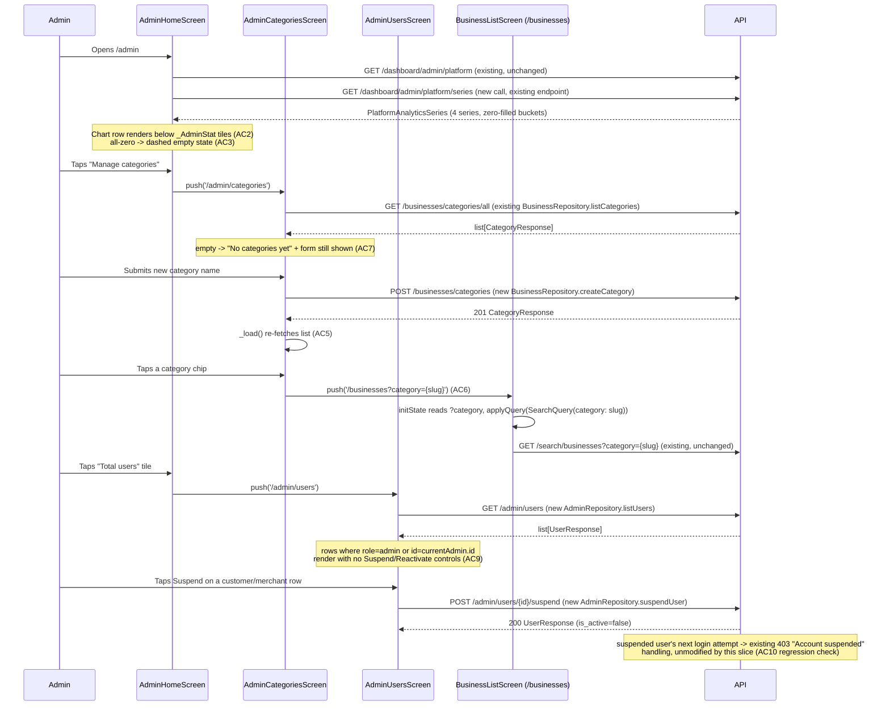

# Slice: S-061 — Mobile admin ops parity (Tier 4: platform charts, categories, user suspend)

| Field | Value |
|-------|-------|
| **Slice ID** | S-061 |
| **Phase** | 5 Polish |
| **Status** | Accepted |
| **Role(s)** | admin |
| **Owner** | PM / 2026-08-18 |

---

## User story

**As an** admin who sometimes reaches for the phone instead of a laptop
**I want** the same platform time-series charts, category create/list tools, and user
suspend/reactivate controls the mobile app already gives me for pending-business approval and
review moderation (M-59/M-60)
**So that** I am not forced to switch to a desktop browser for routine platform-health checks,
category upkeep, or account moderation just because those three specific admin tools never made
it to the phone app

---

## Acceptance criteria

Numbered to parity-match S-034's admin web AC and S-041's category-chip AC, adapted to the
existing Flutter admin surface (`admin_home_screen.dart`) after directly reading it, its two
sibling browse screens, `router.dart`'s admin route gating, and the generated
`merchanthub_api` Dio client — see "Current state verified" in UX notes.

**M-62 — Platform time-series charts**

1. **(Parity for S-034 AC 1)** Given I am signed in as admin on the mobile admin home screen,
   when platform analytics load, then I see the same four time series web already shows (new
   users, businesses moved pending → approved, new reviews, new reports), sourced from the
   existing `GET /dashboard/admin/platform/series` endpoint (already reachable through the
   generated `DashboardApi.platformAnalyticsSeriesApiV1DashboardAdminPlatformSeriesGet` client
   method — no new backend work implied by this AC). Day or week granularity is acceptable,
   matching S-034 AC 1's own either/or.
2. **(Parity for S-034 AC 2 — placement)** Given the admin home screen already shows the five
   stat tiles (`_AdminStat` row) above the "Pending businesses" and "Reported reviews" lists,
   when the chart row renders, then it appears **below the stat tiles** and does not replace or
   reorder them, matching web's "charts sit under the snapshot tiles, never above or instead of
   them" placement rule.
3. **(Parity for S-034 AC 8 — empty state)** Given a series has no data for the selected window
   (e.g. a freshly seeded platform), when I view the chart, then I see a clear empty-chart
   treatment consistent with the existing dashed/"No pending businesses" / "No reported reviews"
   empty-list copy already on this screen — never a crash, a blank widget, or an unhandled chart
   render error.
4. **(Parity for S-034 AC 9 — no AI framing)** Given the chart labels and any surrounding copy,
   when I read them, then none of it presents this data as AI output — these are operational
   counts and trends, worded the same way the existing stat tiles are (e.g. "Total users"), not
   as an AI suggestion or insight.

**M-63 — Category create / list UI**

5. **(Parity for S-034 AC 3)** Given I am signed in as admin, when I open the category admin
   surface on mobile and submit a new category name, then the category is created (via the
   existing `POST /businesses/categories`, already reachable through the generated
   `BusinessesApi.createCategoryApiV1BusinessesCategoriesPost`) and appears in the admin category
   list (`GET /businesses/categories/all`, via
   `BusinessesApi.listCategoriesApiV1BusinessesCategoriesAllGet`) without leaving the admin area.
6. **(Parity for S-041 AC 1 — category chip opens search)** Given the mobile admin category list
   has at least one category, when I tap a category chip, then I am taken to the mobile search
   screen (`BusinessListScreen` behind the `/search` route) pre-filtered to that category —
   the same outcome S-041 gave the web category chips and business-detail `CategoryBadges`
   (`SearchQuery.category` already exists as a filter field client-side; only the "tap navigates
   with it pre-set" wiring is missing on mobile today — confirmed by reading
   `business_detail_screen.dart`'s `categoryChips`, which currently render as plain,
   non-interactive `Chip` widgets).
7. **(Empty state)** Given no categories exist yet, when I open the category admin surface, then
   I see a clear "No categories yet" (or equivalent) empty state plus the add-category control —
   not a blank list or an error, matching the empty-list pattern already used elsewhere on this
   screen.

**M-64 — User suspend / reactivate**

8. **(Parity for S-034 AC 4)** Given I am signed in as admin viewing a non-admin user (customer
   or merchant) in a new mobile user-admin list, when I suspend that account, then `is_active` is
   set to false (via the existing `POST /admin/users/{id}/suspend`, already reachable through the
   generated `AdminApi.suspendUserApiV1AdminUsersUserIdSuspendPost`); when I reactivate that same
   account, then `is_active` is set to true (`AdminApi.reactivateUserApiV1AdminUsersUserIdReactivatePost`).
   The list itself comes from the existing `GET /admin/users`
   (`AdminApi.listUsersApiV1AdminUsersGet`).
9. **(Parity for S-034 AC 6 — self/admin refusal)** Given I attempt to suspend my own account or
   another admin's account from the mobile user-admin list, when I do so, then the action is
   refused — the backend's existing 400 self-or-admin rule (unchanged by this slice) is surfaced
   as a clear inline error if reachable at all, but the preferred mobile treatment (Architect's
   call, matching web's own choice per its technical spec) is to hide the Suspend/Reactivate
   controls entirely for `role=admin` rows and for the signed-in admin's own row, so the refused
   state is rarely hit through the UI.
10. **(Parity for S-034 AC 5 — regression check, no new mobile work expected)** Given a customer
    or merchant account has been suspended (`is_active=false`) through this new mobile surface
    (or through the existing web admin panel — either origin), when that user next attempts to
    log in on mobile, then login is rejected, matching the mobile app's existing (already-shipped,
    unmodified-by-this-slice) handling of the backend's 403 "Account suspended" response. This AC
    exists to confirm no regression, not to introduce new client logic.
11. **(Mobile-specific — role/permission case, all three)** Given I am not an admin (anonymous,
    customer, or merchant), when I attempt to reach the platform-charts section, the category
    admin surface, or the user suspend/reactivate surface added by this slice, then none of them
    are reachable — they inherit the existing `/admin` route's role gate
    (`router.dart`'s `if (loc.startsWith('/admin') && user.role != UserRole.admin)` redirect),
    the same protection `admin_businesses_screen.dart` and `admin_reviews_screen.dart` already
    get for free as sub-routes of `/admin`.

---

## UX notes

- **Screens / routes affected:**
  - `mobile/lib/features/admin/admin_home_screen.dart` — gains the platform time-series chart
    row (AC 1-4) and, unless the Architect decides a dedicated sub-route reads better for a
    small phone screen, the category and user-admin sections (AC 5-10). Exact layout (in-page
    sections vs. `/admin/categories` and `/admin/users` sub-routes, mirroring the existing
    `/admin/businesses` and `/admin/reviews` sibling pattern) is the Architect's call — see open
    question below.
  - `mobile/lib/features/businesses/business_detail_screen.dart` — its existing `categoryChips`
    (currently plain, non-interactive `Chip` widgets, confirmed by direct read, line ~377-381)
    become tappable, navigating to `/search` with the category pre-set (AC 6). This is the one
    piece of this slice that touches a screen outside `features/admin/` — flagged explicitly so
    it isn't missed at review, same as S-041 touching both `/admin` and business-detail on web.
  - `/search` (`BusinessListScreen`) needs to accept an initial category filter when navigated to
    with one — `SearchQuery.category` already exists as a field; the gap is purely "does the
    route/screen accept an incoming category and pre-populate `SearchQuery` with it," which the
    Architect should confirm/spec (may already partially work via route extras/query params;
    verify, don't assume, per repo convention).
- **Current state verified (not assumed) before writing these AC:**
  - `admin_home_screen.dart` (read in full) already has the merchant/admin-style stat tile row
    (`_AdminStat`, some tiles tappable via `onTap` to push `/admin/businesses` / `/admin/reviews`),
    a "Pending businesses" list with Approve/Suspend actions, and a "Reported reviews" list with
    Hide/Restore/Remove actions (S-031, M-57–M-59) — no charts, no category UI, no user list
    exist on it today.
  - `admin_businesses_screen.dart` and `admin_reviews_screen.dart` (both read in full) are the
    established mobile pattern for an admin sub-route: simple `FutureBuilder` + `ListView`
    reading from a repository method, mounted as nested `GoRoute`s under `/admin` in
    `router.dart` (`/admin/businesses`, `/admin/reviews`) — no extra role check needed in those
    files because the parent `/admin` route's `redirect` callback already gates the whole
    subtree (confirmed by reading `router.dart` line 158). This is the direct precedent this
    slice's new category/user surfaces (if the Architect chooses sub-routes over in-page
    sections) should follow.
  - **The backend/API surface already exists end-to-end — this is a client-wiring slice, not a
    new-endpoint slice.** Directly confirmed by reading the generated `merchanthub_api` Dio
    client: `DashboardApi.platformAnalyticsSeriesApiV1DashboardAdminPlatformSeriesGet` (series),
    `BusinessesApi.createCategoryApiV1BusinessesCategoriesPost` /
    `listCategoriesApiV1BusinessesCategoriesAllGet` (categories), and
    `AdminApi.listUsersApiV1AdminUsersGet` / `suspendUserApiV1AdminUsersUserIdSuspendPost` /
    `reactivateUserApiV1AdminUsersUserIdReactivatePost` (users) are **all already generated and
    present in `mobile/packages/merchanthub_api`** (from the shared `openapi.json`, same
    mechanism that produced S-059's `merchanthub_api` additions). None of them are called from
    any app-layer repository yet — `dashboard_repository.dart` (read in full) only wires
    `merchantStats`, `insights`, `refreshInsights`, and `platformAnalytics` (the five-tile
    snapshot); it does not yet wire `platformAnalyticsSeries`. `business_repository.dart` has no
    category methods yet. There is no `admin_repository.dart` / `admin_providers.dart` file at
    all today (grepped `mobile/lib/features/admin/` — only the three screen files exist, no
    repository/provider layer). The Architect should confirm whether user-admin methods belong
    on a new `AdminRepository` (cleanest, mirrors `DashboardRepository`/`BusinessRepository`
    one-concern-per-file convention) vs. bolted onto an existing repository.
  - **No charting package exists in `mobile/pubspec.yaml` today** (grepped: no `fl_chart`,
    `syncfusion_flutter_charts`, or equivalent) — AC 1 needs one added, mirroring S-059's own
    precedent of the Architect naming an exact new pubspec dependency (`qr_flutter`, `share_plus`)
    rather than leaving Builder to pick blind. Web's own chart component for S-034 is a
    lightweight Recharts wrapper (`Charts`) reused generically; the Architect should pick a
    similarly minimal Flutter equivalent, not a heavyweight dashboard-charting library, to match
    "beginner-friendly, portfolio-quality polish" over a new visual product.
  - `search_query.dart`'s `SearchQuery.category` field already exists — reused, not reinvented,
    for AC 6's pre-filtered search navigation.
- **Open question for Architect — in-page sections vs. new sub-routes for categories/users?**
  PM is flagging this rather than mandating a shape, since `admin_home_screen.dart` is already a
  fairly dense scroll (tiles + two lists) and a phone screen has much less room than web's
  `/admin` page to add two more panels in-page without it becoming unwieldy. The existing
  `/admin/businesses` and `/admin/reviews` sub-route precedent (simple, already-gated-for-free
  nested `GoRoute`s) is the most idiomatic mobile-native answer and PM's default expectation
  unless the Architect finds a good reason to inline instead — but this is explicitly the
  Architect's call, not a PM mandate, same posture S-059 took on its own open questions.
- **Empty states / errors:**
  - All-zero/empty series → empty-chart treatment (AC 3), not a crash or a blank chart library
    error state.
  - Empty category list → "No categories yet" + add control (AC 7).
  - Empty/short user list → plain empty list, not an error (no AC number needed — same convention
    as the existing pending/reported empty states already on this screen).
  - Network failures on any of the three new sections stay inline, matching the existing
    `_error` + "Retry" pattern already on `admin_home_screen.dart` (`_load()`'s `catch` block) —
    reused, not reinvented.
- **AI disclaimer required?** No. This slice adds zero new AI-facing UI (AC 4 explicitly calls
  this out for the charts; categories and user suspend/reactivate are pure CRUD/moderation
  actions with no AI involvement, same as their web counterparts in S-034).

---

## Out of scope

- **Any change to web code.** `frontend/` is untouched — S-034 and S-041 already shipped there
  and are both Accepted. This slice is Flutter/mobile-only.
- **Any new backend endpoint.** Confirmed by direct inspection (see UX notes) that every API
  call this slice needs already exists, unmodified, and is already present in the generated
  mobile OpenAPI client. If the Architect finds an actual gap during spec, they should flag it
  explicitly rather than this PM pre-authorizing new backend work.
- **Category edit/delete, category reorder** — same boundary S-034 held on web; create + list
  (+ the S-041 chip-to-search link) is the full scope, matching README §2's "manage categories"
  language.
- **Role changes (promote/demote to admin), password reset by admin, or deleting users** — same
  boundary S-034 held on web.
- **Pagination/sort/filter polish on the mobile user list beyond what makes suspend/reactivate
  and category-add usable** — matches S-034's own "basic list" scope note.
- **True OS-level deep-linking, QR codes, or share sheets** — not applicable to this slice (that
  was S-059/M-71's scope, a different Tier). Not touched here.
- **Merchant-facing analytics (M-68/M-69), featured-listing boost (M-66), or any other Tier
  outside Admin ops (Tier 4: M-62/M-63/M-64)** — out of scope, tracked separately.
- **Replacing the five existing `_AdminStat` snapshot tiles** — they stay; charts sit below them
  (AC 2), matching web's own non-negotiable placement rule from S-034.

---

## Dependencies

- **S-034 (admin platform analytics + role-table truth) — Accepted.** This slice parity-matches
  its relevant web AC (1, 2, 3, 4, 6, 8, 9) for the M-62/M-63/M-64 subset; Architect should read
  `docs/agents/slices/S-034-admin-platform-analytics.md` in full for the reference
  implementation's reasoning (audit-log-derived `businesses_approved` series, zero-fill bucket
  contract, self/admin suspend refusal, idempotent suspend/reactivate).
- **S-041 (admin category chips open search) — Accepted.** Source for AC 6; Architect should
  read `docs/agents/slices/S-041-admin-category-search-links.md` for the exact `/search?category=`
  contract being mirrored.
- **S-031 (mobile admin home, M-57–M-59) — Accepted (implied; `admin_home_screen.dart` already
  ships and is in active use).** This slice extends that existing screen/surface; it does not
  build a new admin entry point.
- Not blocked on and does not share a surface with S-059/M-71 (mobile review collection) — no
  overlap, self-contained per the task brief, last item closing the Tier 4 "Admin ops" bucket in
  the mobile parity roadmap (`README.md` §12/§16).

---

## Definition of done (PM)

- [x] All AC verified in test report (`TR-S-061-mobile-admin-ops-parity.md`) — 11/11 AC pass (10
      automated, AC10 by code inspection per its own "regression check, no new logic" framing)
- [x] UX matches notes above, including the Architect's explicit decision on the in-page-sections
      vs. sub-routes open question (documented in the technical specification below, not left
      implicit) — confirmed by Tester reading every new/changed file directly against the spec
- [x] Documented in `README.md` §8 Frontend guide if a new reusable mobile pattern is introduced
      (e.g. a mobile chart-rendering convention, or a new `AdminRepository`/`admin_providers`
      layer) — `fl_chart` reuse and the `AdminRepository` one-concern-per-file convention both
      noted as extensions of existing patterns (not new ones) in the "Mobile parity conventions"
      paragraph
- [x] `README.md` §12 Web ↔ mobile feature parity tracker — M-62, M-63, and M-64 rows each
      updated from `unimplemented` to `implemented` or `partial` individually (they need not all
      resolve to the same status; if, say, categories and user-suspend ship but charts are
      deferred for a real reason, only the shipped rows flip) — all three flipped to
      `implemented`, all 11 AC pass with no partial/deferred subset
- [x] `README.md` §12/§16 mobile parity roadmap — Tier 4 ("Admin ops") annotated as closed once
      all three rows flip, matching the Tier 2/Tier 1 close-out precedent already in the doc
- [x] `README.md` §14 (and §16 if investor-visible) updated to reflect the closed/partially-closed
      mobile gap(s)
- [x] PM Status set to **Accepted**

---

## Technical specification (Architect)

### Correction to PM's UX notes — the mobile search route is `/businesses`, not `/search`

AC 6 and the UX notes both say "the mobile search screen (`BusinessListScreen` behind the
`/search` route)." Re-verified directly against `mobile/lib/router.dart` (line 73):
`BusinessListScreen` is mounted at **`/businesses`**, nested in the `ShellRoute`. There is no
`/search` route anywhere in the router today (grepped). This is a naming-only discrepancy in the
PM's brief, not a scope change — `/businesses` is where AC 6's "tap a category chip → filtered
search screen" outcome is delivered. All references below use `/businesses?category={slug}`, the
real route. AC 6's observable outcome (tap chip → filtered business list) is unaffected.

### API contract

**None new — confirmed by direct inspection**, same conclusion S-034 reached on web and S-059
reached for its own mobile slice. Every method below is already generated and present in
`mobile/packages/merchanthub_api` (re-verified directly against the generated Dio client, not
taken on PM's word):

| Method | Path | Auth | Request | Response | Notes |
|--------|------|------|---------|----------|-------|
| `GET` | `/api/v1/dashboard/admin/platform/series` | Admin JWT (`require_roles(ADMIN)`, unchanged from S-034) | Query `granularity` (`day`\|`week`, default `day`), `days` (default `90`) | `PlatformAnalyticsSeries` | Generated client: `DashboardApi.platformAnalyticsSeriesApiV1DashboardAdminPlatformSeriesGet` (`dashboard_api.dart:733`, confirmed both query params optional with the same defaults as the backend). Mobile calls with defaults (`day`/90) — no granularity toggle UI required by any AC. |
| `POST` | `/api/v1/businesses/categories` | Admin JWT (unchanged from S-034) | `CategoryCreate` (`name`, `slug` required; `description`, `icon` optional — confirmed `category_create.dart:20-30`) | `201 CategoryResponse` | `BusinessesApi.createCategoryApiV1BusinessesCategoriesPost` (`businesses_api.dart:228`). Existing 409-on-duplicate mapping from S-034 is unchanged, unmodified by this slice. |
| `GET` | `/api/v1/businesses/categories/all` | Public | — | `list[CategoryResponse]` | `BusinessesApi.listCategoriesApiV1BusinessesCategoriesAllGet` (`businesses_api.dart:584`). **Already wired mobile-side** — `BusinessRepository.listCategories()` (`business_repository.dart:71-78`) calls this exact method today (used by the existing search-filter sheet); this slice reuses it, not duplicates it. |
| `GET` | `/api/v1/admin/users` | Admin JWT (unchanged from S-034) | Query `page` (default 1), `pageSize` (default 20), optional `q` | `list[UserResponse]` | `AdminApi.listUsersApiV1AdminUsersGet` (`admin_api.dart:235`). No pagination UI required by any AC (PM's out-of-scope note) — mobile calls page 1 / default page size only for this slice. |
| `POST` | `/api/v1/admin/users/{id}/suspend` | Admin JWT | Path UUID | `200 UserResponse` (`is_active=false`), `400` self/admin target, `404` unknown id | `AdminApi.suspendUserApiV1AdminUsersUserIdSuspendPost` (`admin_api.dart:487`). Backend rule unchanged — see AC 9's client-side avoidance strategy below. |
| `POST` | `/api/v1/admin/users/{id}/reactivate` | Admin JWT | Path UUID | `200 UserResponse` (`is_active=true`), `400` self/admin target, `404` unknown id | `AdminApi.reactivateUserApiV1AdminUsersUserIdReactivatePost` (`admin_api.dart:325`). |

No new backend route, no new Pydantic schema, no new SQLAlchemy model or migration — all six
calls reuse S-034's already-Accepted, unmodified backend surface.

### RBAC matrix

| Action | customer | merchant | admin |
|--------|----------|----------|-------|
| View platform charts (`admin_home_screen.dart` chart row) — AC 1-4 | No (route gated, unreachable) | No (route gated, unreachable) | Yes |
| Open `/admin/categories`, submit new category — AC 5, 7 | No (route gated) | No (route gated) | Yes |
| Tap category chip → `/businesses?category={slug}` — AC 6 | Yes (reachable from `/businesses` chips or admin, if admin) | Yes | Yes |
| Open `/admin/users`, list users — AC 8 | No (route gated) | No (route gated) | Yes |
| Suspend/reactivate a customer or merchant row — AC 8 | — | — | Yes |
| Suspend/reactivate an **admin** row or **own** row — AC 9 | — | — | Control not rendered (see below) |
| Reach any of `/admin`, `/admin/categories`, `/admin/users` while not signed in as admin — AC 11 | No — redirected via `router.dart`'s existing `if (loc.startsWith('/admin') && user.role != UserRole.admin) return postLoginPath(user.role);` (line 158) | No — same | Yes |

Matches the backend's existing S-034 gates exactly (`require_roles(ADMIN)` on every admin
endpoint) — no new RBAC surface introduced on either client or server. AC 9's "hide, don't
surface-then-refuse" resolution (PM left this as the Architect's call): **hide the
Suspend/Reactivate buttons entirely** for any user row where `row.role == UserRole.admin` or
`row.id == currentAdmin.id` (read from `authControllerProvider`'s `UserResponse.id`), the same
choice S-034 made on web (`AdminUserPanel.tsx`, confirmed by that slice's own Frontend section:
"Hide those buttons for `role=admin` and for the signed-in admin's own row"). The backend's 400
refusal stays as an unreachable-through-the-UI defense-in-depth safety net, never surfaced as an
expected user-facing error path.

### Data model impact

- [x] None  [ ] Extend existing  [ ] New table(s)

**Details:** No migration, no new table/column/enum. Reuses `users.is_active`, `audit_logs`
(`businesses_approved` series), `users.created_at`, `reviews.created_at`, `review_reports.created_at`
— all already present and unchanged since S-034. Confirmed by re-reading S-034's own Data model
section; this slice adds zero backend code, so nothing new to verify beyond that S-034 is
Accepted and unmodified.

### Cache / side effects

- **No Redis change.** Series/user-list reads are live SQL on the backend, unchanged from S-034.
  Category create does not invalidate `search:*` today (S-034's own conclusion, re-confirmed, not
  reopened here) and this slice adds no new write path that would require it.
- **Client-side:** category creation refreshes `AdminCategoriesScreen`'s own in-memory list via a
  `_load()` re-fetch after a successful `createCategory` call (same `_load()`-after-mutate pattern
  `admin_home_screen.dart` already uses for approve/suspend/moderate, reused not reinvented).
  Suspend/reactivate similarly re-fetches `AdminUsersScreen`'s list (or patches the single row
  in place from the mutation response — Builder's call, either satisfies the AC).
- No new provider-level cache invalidation needed: `BusinessRepository.listCategories()` has no
  existing cache/provider wrapper to invalidate (called directly per-screen today, e.g. by the
  search filter sheet) — `AdminCategoriesScreen` calling it fresh on load is consistent with that
  existing no-cache convention.

### Frontend

- **New routes** (nested under the existing `/admin` `GoRoute` in `mobile/lib/router.dart`,
  sibling of the existing `businesses` and `reviews` sub-routes at lines 111-112 — inherits the
  parent's `redirect` gate for free per AC 11, no new redirect logic needed, same as those two
  siblings):
  ```dart
  GoRoute(path: 'businesses', builder: (context, state) => const AdminBusinessesScreen()),
  GoRoute(path: 'reviews', builder: (context, state) => const AdminReviewsScreen()),
  GoRoute(path: 'categories', builder: (context, state) => const AdminCategoriesScreen()), // new
  GoRoute(path: 'users', builder: (context, state) => const AdminUsersScreen()), // new
  ```
  **Decision (open question 1 — sub-routes, not in-page sections):** categories and users each
  get their own `/admin/categories` and `/admin/users` sub-route, matching PM's own default
  expectation and the direct, already-idiomatic mobile precedent (`/admin/businesses`,
  `/admin/reviews`, both simple `FutureBuilder`-over-repository screens with zero extra role-check
  code because the parent route already gates the subtree). Rejected in-page sections on
  `admin_home_screen.dart` because that screen is already a dense scroll (five stat tiles +
  pending-businesses list + reported-reviews list) — adding a category-create form and a
  suspend/reactivate user list in-page as well would make the primary admin screen the single
  worst-scrolling screen in the app for no benefit, when the sub-route pattern is already
  established, already tested (implicitly, by the two existing siblings), and costs nothing extra
  to wire (same `redirect` gate, same navigation pattern as the two existing sub-routes).
  **The platform-charts row (AC 1-4) is the one exception and stays in-page** on
  `admin_home_screen.dart`, directly below the five `_AdminStat` tiles — this is not optional per
  AC 2's explicit placement rule ("appears below the stat tiles... matching web's placement rule"),
  and charts are read-only/no-form, so they don't add the same scroll-depth problem a create-form
  or an actionable list would.
- **Rendering:** n/a (Flutter) — Dart/Riverpod state management, no SSR/CSR distinction.
- **Components:**
  - `mobile/lib/features/admin/admin_home_screen.dart` (**modified**):
    - New chart row inserted between the `_AdminStat` `Wrap` (ends line 72) and the "Pending
      businesses" heading (line 74) — satisfies AC 2's placement rule exactly. Renders four
      small `fl_chart` `LineChart`s (or one `LineChart` with four series if visually cleaner —
      Builder's call), one per `new_users` / `businesses_approved` / `new_reviews` / `new_reports`
      key of `PlatformAnalyticsSeries.series` (a `BuiltMap<String, BuiltList<JsonObject>>` —
      confirmed `platform_analytics_series.dart:29`; each `JsonObject`'s underlying value is a
      `{bucket, count}` map per S-034's own documented shape, so the screen extracts `count` via
      `(entry.value as Map)['count']` when building chart points).
      Titles use operational-facts language mirroring the existing `_AdminStat` labels (e.g.
      "New users", "Businesses approved", "New reviews", "New reports" — AC 4, no AI framing).
      **Empty-chart treatment (AC 3):** if every bucket across all four series sums to zero,
      render the same dashed/empty-state visual language already used for "No pending businesses"
      / "No reported reviews" on this screen (e.g. a bordered `Container` with "No platform
      activity yet" text) instead of an empty/blank `fl_chart` widget — mirrors S-034's own
      explicit web decision to override the chart library's own empty rendering with the app's
      existing empty-state convention rather than trust the library's default.
    - `_load()` (existing method, line 144) gains a fourth parallel fetch:
      `dash.platformAnalyticsSeries()` alongside the existing `platformAnalytics()`,
      `listByStatus`, `listReported` calls, using the same `try`/`catch` → `_error` + "Retry"
      pattern already there (no new error-handling code path).
    - New navigation entries to the two new sub-routes: a `TextButton`/`ListTile` "Manage
      categories" → `context.push('/admin/categories')` and re-purposing the existing "Total
      users" `_AdminStat` tile's (currently non-interactive) `onTap` to
      `context.push('/admin/users')` — the direct mobile analogue of S-034's own web decision to
      turn the "Total users" tile into the user-admin doorway (its Frontend section: "Total users"
      tile now scrolls to `#admin-users`"), adapted from "scroll to in-page section" (web) to
      "navigate to sub-route" (mobile), matching this slice's sub-route decision.
  - `mobile/lib/features/admin/admin_categories_screen.dart` (**new**) — AC 5, 6, 7. A
    `ConsumerStatefulWidget` following the same `_load()`/`_error`/`_loading` shape as
    `admin_home_screen.dart` (not the plain `FutureBuilder` shape of `admin_businesses_screen.dart`
    / `admin_reviews_screen.dart`, because this screen also mutates via create, unlike those two
    read-only siblings):
    - Loads `BusinessRepository.listCategories()` on `initState` (existing method, reused
      unchanged — `business_repository.dart:71-78`).
    - A small add-category form (`TextField` for name, slugified client-side the same way the
      existing search-filter category picker or web's `AdminCategoryPanel` would — a simple
      `name.toLowerCase().trim().replaceAll(RegExp(r'[^a-z0-9]+'), '-')` helper is enough,
      Builder's call on exact slugify rule since no AC specifies one) submitting via
      `BusinessRepository.createCategory(CategoryCreate((b) => b..name = name..slug = slug))`
      (**new method on `BusinessRepository`**, extending the existing file rather than a new one
      — see "Repository placement decision" below), then re-`_load()`s the list (AC 5).
    - Renders the category list as tappable `Chip`/`ActionChip` widgets (not the plain,
      non-interactive `Chip` used in `business_detail_screen.dart` today), each `onTap` doing
      `context.push('/businesses?category=${category.slug}')` (AC 6).
    - Empty state: "No categories yet" text + the add-category form still visible/usable (AC 7),
      matching the "empty list + the way to add the first item stays visible" pattern S-034 used
      on web (its own AC 3/UX notes: "'No categories yet'... plus a way to add the first one").
  - `mobile/lib/features/admin/admin_users_screen.dart` (**new**) — AC 8, 9. Same
    `ConsumerStatefulWidget` `_load()`/`_error`/`_actingId` shape as `admin_home_screen.dart`'s
    existing pending-business/reported-review sections (reusing the exact busy-row-disables-button
    pattern at lines 172-196, not reinventing one):
    - Loads `AdminRepository.listUsers()` on `initState`.
    - Renders each non-admin, non-self user row as a `ListTile` (email/name, `is_active` badge)
      with Suspend/Reactivate `FilledButton`/`OutlinedButton` pair, toggled by `isActive`; the
      button pair is **not rendered at all** (not merely disabled) when `row.role ==
      UserRole.admin` or `row.id == currentAdmin.id` (AC 9, per the RBAC matrix decision above).
      `currentAdmin` comes from `ref.watch(authControllerProvider).valueOrNull`.
    - Suspend/Reactivate call `AdminRepository.suspendUser(id)` /
      `AdminRepository.reactivateUser(id)`, then patch that row's `is_active` locally or re-`_load()`
      (Builder's call, either satisfies the AC).
    - Empty/short list → plain empty text, no error UI (per PM's UX notes, no AC number).
  - `mobile/lib/features/admin/admin_repository.dart` (**new**) + `admin_providers.dart`
    (**new**) — **Repository placement decision (open question 3, resolved):**
    - **New `AdminRepository`** (not bolted onto `DashboardRepository` or `BusinessRepository`)
      for the three `/admin/users` calls (`listUsers`, `suspendUser`, `reactivateUser`) — these
      are a distinct concern (user-account moderation) with no existing home, matching the
      repo's established one-concern-per-repository-file convention
      (`DashboardRepository` = dashboard/analytics, `BusinessRepository` = business CRUD/search,
      `ReviewRepository` = review CRUD/moderation). Confirmed by grep: no
      `admin_repository.dart`/`admin_providers.dart` exists yet, and the three admin-user methods
      don't naturally belong to either of the two closest existing repositories (they're not
      "dashboard analytics" and not "business" data).
    - **The other two new calls do *not* get new files** — `platformAnalyticsSeries()` is added
      as a new method on the **existing** `DashboardRepository` (`dashboard_repository.dart`,
      alongside its existing `platformAnalytics()`, the exact five-tile snapshot this series
      extends — same file, same concern, direct sibling method); `createCategory()` is added as a
      new method on the **existing** `BusinessRepository` (`business_repository.dart`, alongside
      its existing `listCategories()` — again, same file, same concern, direct sibling method,
      avoiding splitting one API resource's read and write methods across two files).
    - `admin_providers.dart` (mirrors `merchant_providers.dart`'s shape exactly):
      ```dart
      final adminRepositoryProvider = Provider<AdminRepository>(
        (ref) => AdminRepository(ref.watch(apiClientProvider)),
      );
      ```
  - `mobile/lib/features/businesses/business_detail_screen.dart` (**modified**, line ~366-386) —
    `_CategoryChips` becomes tappable: `Chip(label: Text(category.name))` (line 381) becomes
    `ActionChip(label: Text(category.name), onTap: () =>
    context.push('/businesses?category=${category.slug}'))` (AC 6's other half — the S-041
    parity, mirroring web's `CategoryBadges` becoming clickable). Needs a `go_router` import added
    to this file if not already present (verify at implementation time).
  - `mobile/lib/features/businesses/business_list_screen.dart` (**modified**) — **Decision (open
    question 4, resolved):** `BusinessListScreen` gains an `initState` (it currently has none —
    confirmed by reading the full file, `build()` starts at line 61 with no lifecycle override
    above it) that reads an incoming `category` query parameter and seeds
    `searchControllerProvider` with it on first frame, mirroring the exact
    `WidgetsBinding.instance.addPostFrameCallback((_) => ...)` pattern `admin_home_screen.dart`
    already uses for its own post-frame initial load (line 30):
    ```dart
    @override
    void initState() {
      super.initState();
      WidgetsBinding.instance.addPostFrameCallback((_) {
        final category = GoRouterState.of(context).uri.queryParameters['category'];
        if (category != null) {
          ref.read(searchControllerProvider.notifier).applyQuery(SearchQuery(category: category));
        }
      });
    }
    ```
    No router-level change needed — `GoRoute(path: '/businesses', ...)` (router.dart line 73)
    already accepts arbitrary query parameters without a route-pattern change (go_router routes
    match path segments only; query params are always available via `state.uri.queryParameters`
    / `GoRouterState.of(context)`), so `context.push('/businesses?category=$slug')` from either
    `admin_categories_screen.dart` or `business_detail_screen.dart` reaches this screen and
    pre-filters it with zero new routing surface. `SearchQuery.category` (`search_query.dart:24`)
    is reused entirely unchanged.
  - **Charting package (open question 2, resolved): [`fl_chart`](https://pub.dev/packages/fl_chart)**
    — the de facto standard Flutter charting package (actively maintained, MIT-licensed, pure-Dart
    renderer, no platform-channel/native dependency, ~15k GitHub stars). Add to `pubspec.yaml` as
    `fl_chart: ^0.69.0` (Builder: pin to whatever is the current latest stable at implementation
    time, matching the caret-range style already used for every other dependency and the same
    "Builder pins latest stable" convention S-059 established for `qr_flutter`/`share_plus`).
    Rejected `syncfusion_flutter_charts` (commercial-license-adjacent, heavier, requires a
    community license key for some feature tiers — wrong fit for "beginner-friendly,
    portfolio-quality polish" per PM's own framing) and a hand-rolled `CustomPainter` sparkline
    (more code, more risk, no meaningful benefit over an established package for four small time
    series). `fl_chart`'s `LineChart` widget is the minimal, generic `{x, y}`-style API closest in
    spirit to web's own thin `Charts` (Recharts) wrapper reused generically across all four series
    — matches S-034's own stated preference for "a simple chart that matches current admin visual
    density over a new analytics product look."

### Flow



### Architect checklist

- [x] API contract defined and matches `README.md` §7 style (all 6 calls already documented
      there from S-034; this slice adds no new rows, only new mobile client callers)
- [x] RBAC matrix complete for all roles (customer/merchant/admin; anonymous inherits the
      existing `/admin` redirect-to-login gate, unchanged)
- [x] Data model impact documented (none — confirmed against S-034's own unmodified backend)
- [x] Cache invalidation considered (none new required; existing S-034 conclusions re-confirmed,
      not reopened)
- [x] AI/storage/maps use existing abstraction layers (N/A — zero AI/storage/maps surface in this
      slice, confirmed AC 4/9's "no AI framing" requirement needs no abstraction-layer touch)
- [x] No secrets in design
- [x] Open question 1 resolved: sub-routes (`/admin/categories`, `/admin/users`) for
      categories/users; charts stay in-page on `admin_home_screen.dart` per AC 2's placement rule
- [x] Open question 2 resolved: `fl_chart` named explicitly with rejected alternatives reasoned
- [x] Open question 3 resolved: new `AdminRepository`/`admin_providers.dart` for user-admin calls;
      series/category calls extend the existing `DashboardRepository`/`BusinessRepository` instead
- [x] Open question 4 resolved: `/businesses` (not `/search` — PM naming correction) gains an
      `initState` reading `?category=` and seeding `SearchQuery.category`; no router pattern change
- [x] ERD/API/FLOWS updates noted (none — no new endpoint/table; README §7/§12/§14/§16 updates
      happen at Builder/Tester handoff per repo convention, not here)

### Risks / tradeoffs

- **`fl_chart` is a new pubspec dependency with real (if small) bundle-size and maintenance
  cost** — accepted as the standard, low-risk choice for a beginner-friendly four-line-chart admin
  screen; no alternative considered meaningfully reduces this cost (see package reasoning above).
- **Slug generation for new categories is client-side and ad hoc** (no AC specifies an exact
  slugify algorithm) — Builder should keep it simple and match whatever pattern web's own
  `AdminCategoryPanel` uses if convenient, but this is not a hard requirement; a naive
  lowercase-and-hyphenate transform is sufficient to satisfy AC 5.
- **`admin_categories_screen.dart`'s chip-tap (AC 6) and `business_detail_screen.dart`'s
  chip-tap (also AC 6) both navigate to the same `/businesses?category={slug}` target** — this is
  intentional convergence, not duplication to fix; they are two different entry points to the
  identical S-041-parity outcome, exactly mirroring how web's `AdminCategoryPanel` chips and
  `CategoryBadges` chips both resolve to the same `/search?category={slug}` URL per S-041's own
  spec.
- **No pagination on `AdminUsersScreen`'s user list** — matches PM's explicit out-of-scope note
  ("Pagination/sort/filter polish... beyond what makes suspend/reactivate... usable"); if the
  platform's user count grows large enough that a single unpaginated `GET /admin/users` page
  becomes slow, that's a follow-up slice, not this one's problem to solve pre-emptively.
- **Chart data freshness:** `_load()` re-fetches all four `dash`/`businesses`/`reviews` calls
  plus the new series call on every pull-to-refresh (`RefreshIndicator`, existing behavior) —
  no separate refresh cadence for the new series call; acceptable, matches how the existing three
  calls already behave and avoids introducing an inconsistent refresh model for one of five
  parallel fetches.
- **No ADR** — reuses S-034's already-Accepted backend endpoints, the existing `/admin` route
  gate (`router.dart` line 158, unchanged), and adds one ordinary pubspec dependency (`fl_chart`,
  same risk class as S-059's `qr_flutter`/`share_plus` additions, which also received no ADR).
  Not a new integration, auth pattern, or schema pattern — confirmed at spec time per the repo's
  own ADR-creation trigger list.

---

## Links

- Test plan: `docs/agents/test-plans/TP-S-061-*.md`
- Test report: `docs/agents/test-reports/TR-S-061-*.md`
- ADR: none (reuses existing endpoints, existing `/admin` route gate, existing
  `AuditLog`/`is_active` model — no new auth or schema pattern; `fl_chart` is an ordinary pubspec
  dependency, same risk class as S-059's `qr_flutter`/`share_plus`, which also received no ADR),
  confirmed at spec time

---

## Changelog

| Date | Agent | Change |
|------|-------|--------|
| 2026-08-18 | PM | Created slice. Mobile parity for Tier 4 "Admin ops" (M-62 platform time-series charts, M-63 category create/list UI, M-64 user suspend/reactivate), the lowest-urgency tier in the mobile parity roadmap per README §16 ("admins are more likely to be at a desk than on mobile") but grouped as one combinable slice since all three share the same extension point. Read `S-034-admin-platform-analytics.md` and `S-041-admin-category-search-links.md` in full as web reference implementations. Verified against the actual codebase before writing AC (not assumed): `admin_home_screen.dart`, `admin_businesses_screen.dart`, `admin_reviews_screen.dart` read in full (existing admin-tile/list/sub-route/empty-state/error-retry patterns to extend, not replace); `router.dart`'s `/admin` redirect gate already protects the whole subtree for free, same as the two existing sub-routes; **all backend endpoints this slice needs already exist and are already present in the generated `merchanthub_api` OpenAPI client** (`platformAnalyticsSeriesApiV1DashboardAdminPlatformSeriesGet`, `createCategoryApiV1BusinessesCategoriesPost`, `listCategoriesApiV1BusinessesCategoriesAllGet`, `listUsersApiV1AdminUsersGet`, `suspendUserApiV1AdminUsersUserIdSuspendPost`, `reactivateUserApiV1AdminUsersUserIdReactivatePost`) — confirming this is a client-wiring slice, not a new-endpoint slice; `dashboard_repository.dart` and `business_repository.dart` read in full, neither wires these methods yet, and no `admin_repository.dart`/`admin_providers.dart` exists at all yet (grepped); `business_detail_screen.dart`'s category chips are currently plain non-interactive `Chip` widgets (confirmed by direct read), the mobile gap S-041's AC 6 parity closes; no charting package and no category/admin-user repository layer exist in `pubspec.yaml`/`mobile/lib` today (grepped, flagged as open items for the Architect to name explicitly, same posture S-059 took for its own new-package decisions). 11 numbered AC across the three M-numbers (4 for M-62 parity-matching S-034 AC 1/2/8/9, 3 for M-63 parity-matching S-034 AC 3 + S-041 AC 1 + an empty-state AC, 3 for M-64 parity-matching S-034 AC 4/6/5) plus 1 shared mobile-specific role/permission AC confirming all three new surfaces inherit the existing `/admin` route gate. Out of scope: web changes, new backend endpoints (verify not assume — none found), category edit/delete/reorder, role changes/password reset/user deletion, pagination/sort polish beyond usable, deep-linking/QR (that's S-059/M-71, different tier), other tiers' mobile gaps. Depends on S-034 (Accepted, primary reference), S-041 (Accepted, AC 6's source), and S-031 (existing mobile admin home this slice extends). Open questions explicitly left for the Architect rather than guessed at: (1) in-page sections vs. new `/admin/categories` + `/admin/users` sub-routes (PM's default expectation leans sub-routes, matching the existing `/admin/businesses`/`/admin/reviews` precedent, given how dense a phone screen already is, but not mandated); (2) exact charting package to add (no fl_chart/syncfusion/equivalent present today); (3) whether user-admin methods belong on a new `AdminRepository` or an existing one; (4) how `/search`'s `BusinessListScreen` should accept and pre-populate an incoming category filter for AC 6. Status: Draft. Technical specification left as template for Architect. |
| 2026-08-18 | Architect | Filled technical specification. Corrected PM's "`/search` route" reference to the real route (`/businesses`, `BusinessListScreen`) — no `/search` route exists in `router.dart`, confirmed by grep. **Resolved all 4 open questions:** (1) sub-routes for categories/users (`/admin/categories`, `/admin/users`, mirroring `/admin/businesses`/`/admin/reviews`), charts stay in-page on `admin_home_screen.dart` below the `_AdminStat` tiles per AC 2's placement rule; (2) `fl_chart` named as the charting package (rejected `syncfusion_flutter_charts` for licensing/weight, rejected a hand-rolled `CustomPainter`); (3) new `AdminRepository`/`admin_providers.dart` for the three `/admin/users` calls, but `platformAnalyticsSeries()` extends the existing `DashboardRepository` and `createCategory()` extends the existing `BusinessRepository` (both alongside their existing sibling methods, not new files); (4) `business_list_screen.dart` gains an `initState` reading `?category=` and seeding `SearchQuery.category` via `searchControllerProvider.notifier.applyQuery` — no router pattern change needed since go_router already passes through query params on `/businesses`. API contract: confirmed all 6 calls already generated in `mobile/packages/merchanthub_api` with exact method/line citations (`dashboard_api.dart:733`, `admin_api.dart:235/325/487`, `businesses_api.dart:228/584`) — zero new backend work, reuses S-034's unmodified, Accepted backend surface. RBAC: AC 9 resolved as "hide, don't surface-then-refuse" (mirrors S-034's own web `AdminUserPanel.tsx` choice) — Suspend/Reactivate controls not rendered for `role=admin` rows or the signed-in admin's own row. Data model: none (reuses S-034's `is_active`/`AuditLog`/timestamp columns unchanged). Named every new/modified file: new `admin_categories_screen.dart`, `admin_users_screen.dart`, `admin_repository.dart`, `admin_providers.dart`; modified `admin_home_screen.dart` (chart row + nav entries to the two new sub-routes), `business_detail_screen.dart` (`_CategoryChips` becomes tappable `ActionChip`), `business_list_screen.dart` (new `initState`), `dashboard_repository.dart` (+`platformAnalyticsSeries()`), `business_repository.dart` (+`createCategory()`), `router.dart` (+2 nested `GoRoute`s), `pubspec.yaml` (+`fl_chart`). No ADR (reuses existing endpoints/route gate/schema, one ordinary pubspec dependency, same risk class as S-059's `qr_flutter`/`share_plus`). Status: **Specified** — ready for Builder. |
| 2026-08-18 | PM | **Accepted.** Reviewed `TR-S-061-mobile-admin-ops-parity.md` in full: all 11 AC pass (10 automated via `flutter_test`, AC10 by code inspection per its own "regression check, not new client logic" framing, matching the same M-classification precedent `TR-S-059` used) — `flutter analyze` 0 issues, `flutter test` 210/210 (188 pre-existing + 22 new, 0 regressions in any file this slice touches). Reviewed and accepted the Tester's 4 in-scope production-code fixes (missing `JsonObject` import, two `ActionChip.onTap` → `onPressed` corrections, a defensive `try`/`on GoError` guard around `business_list_screen.dart`'s new `initState`) as the kind of small/obvious fix the Tester role is authorized to make directly rather than bounce back to the Builder — none change AC-observable behavior. The one flagged out-of-scope flaky test (`merchant_dashboard_screen_test.dart`'s S-060 CSV-export case) belongs to a different, concurrently in-flight Tier-3 slice sharing this branch — not S-061's concern, left untouched. All three rows (M-62, M-63, M-64) ship at `implemented`, not `partial` — no AC was deferred or partially covered, so no split-status subset was needed. Updated `README.md`, surgically scoped to avoid collision with two other concurrent slices editing the same file: §12 tracker rows M-62/M-63/M-64 flipped `unimplemented` → `implemented` (S-034 web + S-061 mobile, both Accepted); §12 rollup counts updated (`implemented` 51→54, `unimplemented` 19→16); §12 mobile parity roadmap Tier 4 row struck through and marked "Done (S-061, Accepted 2026-08-18)" + "**Tier 4 fully closed**", matching the Tier 1/Tier 2 close-out style already in the doc; §14 "Mobile web parity" row's running prose extended with a Tier 4 close-out paragraph (same style as the Tier 1/2/3 paragraphs already there) and its "N rows remain unimplemented" count corrected 19→16; §16 "Built vs next" Built column appended with S-061; §8 Frontend guide's "Mobile parity conventions" paragraph extended to note S-061 reused `fl_chart` as-is (no second charting package) and that the new `AdminRepository` is a new instance of the existing one-concern-per-repository-file convention, not a new pattern — no other README rows, Tier 1-3 language, or table structure touched. Did not touch `docs/agents/slices/S-060-mobile-dashboard-analytics.md` (different, concurrently in-flight slice ID, despite the historical S-060/S-061 renumbering note in this file's own first Changelog entry). Slice `Status` set to **Accepted**; all Definition of done (PM) boxes checked. |
