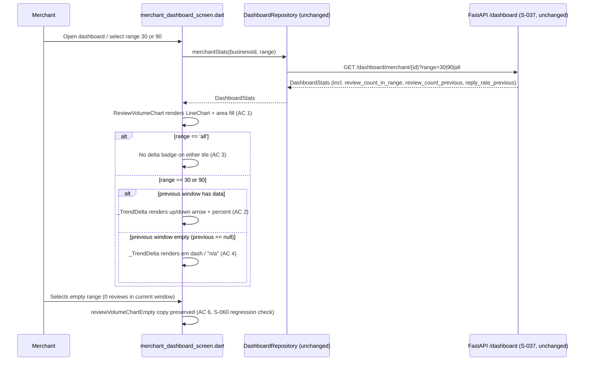

# Slice: S-063 — Mobile dashboard trend chart + period-over-period deltas (parity for M-68)

| Field | Value |
|-------|-------|
| **Slice ID** | S-063 |
| **Phase** | 4 Dashboards |
| **Status** | Accepted |
| **Role(s)** | merchant |
| **Owner** | PM / 2026-08-18 |

---

## User story

**As a** merchant using the mobile app
**I want** the same review-volume chart on my mobile dashboard rendered as an area/line trend
(not only bars), and reply-rate/in-range-review-count stat tiles that show whether each number
is up or down vs. the immediately previous period of the same length
**So that** I can see the *direction* my business is trending at a glance, on my phone, the same
way I already can on the web dashboard — without doing the mental math myself

---

## Acceptance criteria

Numbered to parity-match S-037's 4 web AC one-for-one, adapted to Flutter/mobile after reading
S-037 (web reference, Accepted) and S-033 (the earlier, underlying analytics slice) in full, and
directly inspecting `mobile/lib/features/merchant/merchant_dashboard_screen.dart`,
`mobile/lib/features/merchant/review_volume_chart.dart`,
`mobile/lib/features/merchant/dashboard_repository.dart`, the generated
`mobile/packages/merchanthub_api/lib/src/model/dashboard_stats.dart`, and
`backend/app/routers/dashboard.py` / `backend/app/services/merchant_dashboard.py` — see "Current
state verified" in UX notes. **Important scope clarification (do not re-litigate): this slice
does not add a second, separate chart.** Per S-037's own web AC 1 ("volume is an area or line
chart ... not only bars"), M-68 upgrades the *same* `review_volume_by_month` series S-060/M-61
already charted on mobile from a bar chart to an area or line rendering — it is a richer
treatment of the same data, not a new metric or a new chart section. See UX notes for the
verified basis of this conclusion.

1. **(Parity for S-037 AC 1 — chart type, same series)** Given `review_volume_by_month` data is
   present on the dashboard (already fetched today per S-060/M-61), when I view the mobile
   dashboard's existing volume chart (`review_volume_chart.dart`, key `reviewVolumeChart`), then
   it renders as an area or line chart, not only bars — the same "volume over months" series
   S-060 already shipped, upgraded in place rather than duplicated as a second chart.
2. **(Parity for S-037 AC 2 — period-over-period delta badges)** Given I have selected a date
   range of 30 or 90 days (existing `dashboardRangeSelector`, S-060), when the dashboard stats
   load, then the reply-rate tile (`replyRateTile`) and a review-count-in-range figure each show
   a period-over-period delta badge (up/down direction + percentage) comparing the current
   window's value against the immediately previous window of the same length, computed from
   already-DB-derived counts (`review_count_in_range`, `review_count_previous`,
   `reply_rate_previous`, all already present in `DashboardStats` today, currently unused by
   mobile — see UX notes) — never framed as an AI suggestion or judgment, since these are plain
   DB counts, matching S-037 AC 2's own "suggestion-free" wording.
3. **(Parity for S-037 AC 2 — all-time hides delta)** Given I have selected the "All time" range,
   when stats load, then no delta badge is shown on either tile (`review_count_previous` and
   `reply_rate_previous` are `null` for `range=all`, confirmed by reading
   `merchant_dashboard.py`) — matching S-037's exact "all-time range hides delta" wording.
4. **(Parity for S-037 AC 3 — undefined delta)** Given a 30- or 90-day range whose *previous*
   window has zero reviews (so a delta is undefined), when the tile renders, then it shows an em
   dash or "n/a" copy, never a fabricated 0% or 100% improvement — mirrors web's own AC 3
   requirement and this repo's broader "never invent a number that isn't there" precedent (same
   spirit as S-060 AC 8's empty-range handling).
5. **(Parity for S-037 AC 4 — permission case)** Given a customer, or a merchant who does not own
   the selected business, attempts to load dashboard stats carrying the new delta fields, when
   the request is made, then it is denied by the existing, unmodified backend RBAC (`403`) — this
   slice adds no new client-side bypass and relies on the same ownership check web and S-060
   already use. Admin mobile dashboard behavior is unchanged by this slice (no admin analytics
   screen is introduced or altered).
6. **(Mobile-specific — chart empty state persists)** Given the selected range has zero reviews
   (S-060 AC 8's existing empty-range case), when the upgraded area/line volume chart renders,
   then the existing "No reviews in this range." empty-state copy (`reviewVolumeChartEmpty`) is
   preserved unchanged — the chart-type upgrade in AC 1 must not regress S-060's already-Accepted
   empty-state behavior.

---

## UX notes

- **Screens / routes affected:** `mobile/lib/features/merchant/merchant_dashboard_screen.dart`
  and `mobile/lib/features/merchant/review_volume_chart.dart` only. No new mobile route, matching
  S-037's own web scope ("Same `/merchant/dashboard`").
- **Current state verified (not assumed) before writing these AC:**
  - **The M-61-vs-M-68 chart-scope question, resolved by reading S-037's actual web AC text, not
    assumed:** S-037 AC 1 reads "volume is an area or line chart (Recharts already installed),
    not only bars" — this is a *rendering* upgrade of the exact same `review_volume_by_month`
    series S-033/M-61 already computes and S-060 already mobile-charted, **not** a new or
    additional metric. S-037's remaining AC (2-4) are about **delta badges on stat tiles**
    (reply-rate, in-range review count), a separate but related concern on the same dashboard.
    Confirmed by re-reading S-033 (`docs/agents/slices/S-033-merchant-analytics.md`) for
    comparison: S-033's own AC never mentions a second chart or a delta concept at all — it only
    established the base `review_volume_by_month`/`rating_distribution`/`reply_rate` fields and a
    bar chart on web. **Conclusion: M-68 extends the one existing volume chart's rendering type
    and adds delta badges next to two existing stat values — it does not introduce a second chart
    section.** This directly matches the explicit "M-68 overlap flag" left by S-060's Architect
    (`docs/agents/slices/S-060-mobile-dashboard-analytics.md`, Frontend section and Risks): "this
    slice's volume chart and M-68's future area/line trend + delta-badge work ... will likely
    both live in or near the same dashboard section," and the file was deliberately kept as its
    own small widget (`review_volume_chart.dart`, confirmed by reading it — 87 lines, already
    carries an explicit code comment: "A plain 'volume over months' chart, not M-68/S-037's
    future richer trend/delta treatment") specifically so this slice could extend it without a
    large diff. This slice honors that intent: `review_volume_chart.dart` is **modified in
    place** (bar → area/line), not replaced by a new file, and no second chart widget is added.
  - **`DashboardStats` field-availability finding, verified by reading the actual generated
    file** (`mobile/packages/merchanthub_api/lib/src/model/dashboard_stats.dart`): it **already
    has** `reviewCountInRange` (`int?`), `reviewCountPrevious` (`int?`), and `replyRatePrevious`
    (`num?`) fully generated (getters, serializer, deserializer — all three wired end to end),
    matching the backend's S-037-added schema fields exactly
    (`backend/app/schemas/__init__.py` lines 355-357: `review_count_in_range`,
    `review_count_previous`, `reply_rate_previous`, all `| None = None`). **Unlike S-062's initial
    task framing, this is not a case to assume "no backend gap" blindly — it was directly
    verified**: `backend/app/services/merchant_dashboard.py`'s `get_dashboard_aggregates` (lines
    109-119) already computes and returns all three via `_count_reviews(..., previous=True/False)`
    and `_reply_rate_previous(...)`, and `merchant_dashboard_screen.dart` (346+ lines, read in
    full) **never reads any of the three fields today** — they arrive on every dashboard response
    already, completely unused by the mobile screen. **Conclusion: no backend gap, and no mobile
    OpenAPI-codegen gap either** — this is a mobile-UI-only slice: reading three already-present
    fields and rendering a delta badge, plus swapping one chart's `fl_chart` widget type. Same
    standard S-060/S-062 held themselves to, now independently re-confirmed rather than assumed
    for this slice, per explicit task instruction.
  - `review_volume_chart.dart` currently renders `fl_chart`'s `BarChart` exclusively (confirmed
    by reading the full file) — `fl_chart` (already a `pubspec.yaml` dependency since S-060) also
    ships `LineChart`/`AreaChart`-shaped area-fill support via `LineChartData`
    (`belowBarData`/`aboveBarData` fill), so no new charting package is needed; Architect to
    confirm the exact `fl_chart` widget/config choice (line with area fill vs. plain line) in the
    technical specification, mirroring how S-060's Architect named `fl_chart` explicitly rather
    than leaving Builder to guess.
  - `merchant_dashboard_screen.dart`'s `replyRateTile` (key `replyRateTile`, S-060) currently
    renders only the current-range percentage (or "No reviews in this range" when `null`) — no
    delta of any kind today. There is currently no dedicated review-count-in-range tile at all on
    mobile (the existing `totalReviewsTile` is explicitly **all-time**, unchanged by range
    selection, per S-060's own documented decision) — Architect must decide during
    implementation whether AC 2's "review-count-in-range" delta is shown as a small addition to
    the existing `replyRateTile` row (e.g. a second small tile) or a new tile, since no existing
    mobile widget currently surfaces `reviewCountInRange` at all (web's `StatCard` trend precedent
    in S-037's Frontend section — `StatCard trend shows delta percent when previous exists` — is
    the reference to parity-match, not necessarily reuse literally).
  - **Conclusion: no backend gap.** Confirmed by direct inspection of both
    `backend/app/routers/dashboard.py` (unchanged route, `range=30|90|all`, unchanged RBAC) and
    `backend/app/services/merchant_dashboard.py` (all three delta-supporting fields already
    computed) — S-037 already shipped the backend half of this work when it Accepted on web; this
    slice is purely mobile-client rendering work against fields that already exist, unmodified,
    all the way through the generated client.
- **Components to reuse:** `review_volume_chart.dart` (modify chart type in place — do not
  replace the file or add a second chart widget, per the scope-resolution note above),
  `merchant_dashboard_screen.dart`'s existing `_StatTile`/`replyRateTile` pattern (extend for the
  delta badge, following the exact same `_stats?.replyRate == null` null-vs-value precedent
  S-060 already established for "never show a fake 0%"), the existing `dashboardRangeSelector`
  (unchanged — this slice adds no new range control, it reads fields already returned for the
  ranges that control already supports).
- **Empty states / errors:** Undefined delta (AC 4) → em dash/"n/a" copy, never a fabricated
  percentage. All-time range (AC 3) → no delta badge shown at all (not an em dash either — badge
  is fully absent, matching S-037's literal "all-time range hides delta" wording, a distinct case
  from AC 4's "shown but undefined"). Empty-range chart (AC 6) → existing S-060
  `reviewVolumeChartEmpty` copy, unchanged.
- **AI disclaimer required?** No. Per S-037's own UX notes ("AI disclaimer: not required for DB
  deltas") — these are plain DB-computed counts/rates, not AI output, matching this repo's
  non-negotiable that the *suggestion* language requirement applies to AI-generated content, not
  to database aggregates. The existing `AiInsightsPanel` disclaimer elsewhere on the same screen
  is unrelated and unchanged by this slice.

---

## Out of scope

- **Any change to web code.** `frontend/` is untouched — S-037 already shipped there and is
  `Accepted`.
- **Any new backend endpoint, schema, or migration** — confirmed not needed; every field this
  slice's AC depend on (`review_count_in_range`, `review_count_previous`, `reply_rate_previous`)
  already exists, unmodified, on the backend and is already generated into the mobile OpenAPI
  client (verified, not assumed — see UX notes).
- **A second, separate trend chart.** This slice upgrades the existing volume chart's rendering
  type and adds delta badges to existing stat values — it does not add a new chart section, a new
  metric, or a new API field. See the "M-68-vs-M-61 chart-scope" resolution above.
- **S-038's benchmark card** (out of scope on web too, per S-037's own Out-of-scope line) — not
  this slice, on either platform.
- **S-036/S-062's featured-boost/payments work** — unrelated to this slice; the
  `FeaturedBoostPanel` on the same screen (S-062) is untouched.
- **Delta badges on `totalReviewsTile`/`averageRatingTile`** — both stay all-time, denormalized
  `Business` counters, unchanged meaning, per S-060's own explicit precedent ("Do not silently
  start range-filtering `totalReviewsTile`/`averageRatingTile`"); this slice's deltas apply only
  to the range-aware reply-rate and review-count-in-range values S-037's backend actually
  computes previous-window figures for.
- **Any new charting package.** `fl_chart` (already present since S-060) is expected to cover the
  area/line rendering need; Architect to confirm.

---

## Dependencies

- **S-037 (web merchant dashboard chart upgrade) — Accepted.** This slice parity-matches its 4
  AC; Architect should read `docs/agents/slices/S-037-merchant-dashboard-chart-upgrade.md` in
  full for the reference backend contract (`reply_rate_previous`, `review_count_in_range`,
  `review_count_previous`, previous-window definition `[cutoff - duration, cutoff)`, `all` range
  nulls both previous fields) and the web `Charts`/`StatCard` trend precedent — all of it already
  shipped and reused as-is, not reimplemented.
- **S-033 (web merchant analytics, underlying base fields) — Accepted.** Read for comparison to
  confirm S-037, not S-033, is the correct chart-scope reference (S-033 never introduced a chart
  type choice or delta concept).
- **S-060 (mobile dashboard analytics, M-61) — Accepted.** This slice directly extends
  `review_volume_chart.dart` and `merchant_dashboard_screen.dart`'s `replyRateTile` that S-060
  shipped; S-060's Architect explicitly flagged this exact overlap and kept the volume chart in
  its own small widget file for this reason (see UX notes). Hard dependency — S-060's date-range
  selector (`dashboardRangeSelector`, `_range` state) is reused unchanged, not rebuilt.
- **S-062 (mobile featured listing boost)** — not a hard blocker, but this slice extends the same
  `merchant_dashboard_screen.dart` file S-062 last touched (three slices — S-060, S-062, and now
  this one — all modify this file); Architect/Builder should confirm no merge-conflict-shaped
  overlap, particularly around where the new delta-badge UI is inserted relative to S-062's
  `FeaturedBoostPanel` insertion point.
- Not blocked on M-69/M-70/M-78/M-79/M-80 (other Tier 3 items) — this is the third Tier 3 item
  picked up per the mobile parity roadmap (`README.md` §12), after M-61/S-060 and M-66/S-062.

---

## Definition of done (PM)

- [x] All AC verified in test report (`TR-S-063-mobile-dashboard-trend-deltas.md`) — all 6 AC Pass
- [x] UX matches notes above, including the Architect's explicit confirmation of the exact
      `fl_chart` widget/config used for the area/line rendering (`LineChart` + `BarAreaData`)
      and the delta-badge placement decision (extend `replyRateTile` + new `reviewCountInRangeTile`)
- [x] `README.md` §8 Frontend guide updated for the area-fill `LineChart` pattern (no new package)
- [x] `README.md` §12 Web ↔ mobile feature parity tracker — M-68 row updated to `implemented`
- [x] `README.md` §12 Mobile parity roadmap Tier 3 annotated with M-68 closed
- [x] `README.md` §14 and §16 updated to reflect the closed mobile gap
- [x] PM Status set to **Accepted**

---

## Technical specification (Architect)

> Specified 2026-08-18. **No backend gap, no new endpoint, no codegen gap — confirmed by direct
> inspection**, same conclusion the PM already reached and independently re-verified here. This
> slice is mobile-client-only: `review_volume_chart.dart` swaps its `fl_chart` widget type in
> place, and `merchant_dashboard_screen.dart` starts reading three already-generated
> `DashboardStats` fields it has ignored since S-060.

### API contract

**None new.** The existing, unmodified endpoint already returns every field this slice needs
(shipped by S-037 on the backend, `Accepted`), and it is already generated end-to-end into
`mobile/packages/merchanthub_api/lib/src/model/dashboard_stats.dart` (confirmed by reading the
file directly — see lines noted below). This slice only starts *reading* three fields the mobile
screen has never consumed.

| Method | Path | Auth | Request | Response | Notes |
|--------|------|------|---------|----------|-------|
| `GET` | `/api/v1/dashboard/merchant/{business_id}` | Bearer; `require_roles(MERCHANT, ADMIN)` (unchanged, S-033/S-060) | Path: `business_id` UUID. Query: `range=30\|90\|all` (default `all`, existing, already forwarded by `DashboardRepository.merchantStats` since S-060). | `DashboardStats` — existing fields unchanged, plus three already-generated-but-mobile-unused fields: `reviewCountInRange` (`int?`, wire `review_count_in_range`), `reviewCountPrevious` (`int?`, wire `review_count_previous`), `replyRatePrevious` (`num?`, wire `reply_rate_previous`) — all confirmed present with getter + custom serializer + deserializer in `dashboard_stats.dart` lines 24-26, 50-57, 119-139, 213-236. Backend semantics (unchanged, from S-037, `backend/app/services/merchant_dashboard.py`): previous window = `[cutoff - duration, cutoff)` for `range=30\|90`; both `*_previous` fields are `null` when `range=all`. `reviewCountPrevious` and `replyRatePrevious` are `null` (not `0`) whenever the previous window has zero reviews — the "undefined delta" case (AC 4). | No client code change to the request — `DashboardRepository.merchantStats` already forwards `range` (S-060). This slice's only repository-adjacent change is that `merchant_dashboard_screen.dart` starts reading the three response fields it already receives on every call. |

No new backend route, Pydantic schema, SQLAlchemy model, or migration. No change to
`dashboard_repository.dart` — `merchantStats` already returns the full `DashboardStats` object,
including these fields, today.

**`reviewCountInRange` vs. `totalReviews`, confirmed distinct by reading both:**
`totalReviews` (`merchant_dashboard_screen.dart` line 156, `totalReviewsTile`) renders
`_stats?.totalReviews`, the **all-time** denormalized `Business` counter (S-060's own explicit,
unchanged precedent — "Do not silently start range-filtering `totalReviewsTile`"). `_stats
?.reviewCountInRange` is a **separate, range-scoped** DB count computed fresh per request by
`merchant_dashboard.py` and has no existing mobile widget surfacing it at all — resolved below
under Frontend.

### RBAC matrix

| Action | customer | merchant (owner) | merchant (other business) | admin |
|--------|----------|-------------------|----------------------------|-------|
| `GET` dashboard stats (now including `review_count_in_range`/`review_count_previous`/`reply_rate_previous`) | 403 (unchanged backend gate) | 200 | 403 (unchanged backend gate) | 200 (unchanged, view-as-today) |
| Delta badges / area-line chart on `merchant_dashboard_screen.dart` | N/A (no route access — screen is merchant-only, S-031/S-060 AC 7 precedent) | Visible for whichever business is selected in `merchantBusinessSelector` | N/A (selector only lists the signed-in merchant's own businesses) | N/A (no admin analytics screen introduced or altered) |

Identical to S-060's and S-037's already-Accepted RBAC — this slice adds no new client-side
bypass and no new server-side check. AC 5's permission case is exercised by the same existing
`403` gate, now simply carrying three extra response fields on the success path.

### Data model impact

- [x] None  [ ] Extend existing  [ ] New table(s)

**Details:** No new tables, columns, enums, or Alembic migration. No change to
`backend/app/schemas/__init__.py` (S-037 already added `review_count_in_range`,
`review_count_previous`, `reply_rate_previous` there, `Accepted`). No change to
`dashboard_stats.dart` — already fully generated with all three fields, confirmed by direct read.
ERD in README §5: no update.

### Cache / side effects

- No Redis change. Dashboard `GET` is uncached (S-033/S-037, unchanged); this slice adds no new
  read or write path.
- Client-side: same live-refetch-on-range-change pattern S-060 established —
  `dashboardRangeSelector`'s `onSelectionChanged` already calls `_loadDashboard(business.id)` with
  the new `_range`, which already returns the delta-supporting fields on every response (they've
  always been in the payload, just unread). No new provider, no new client-side cache, no
  per-range memoization — a range change is a full network round trip exactly as S-060 shipped
  it.

### Frontend

- **Route:** `mobile/lib/features/merchant/merchant_dashboard_screen.dart` and
  `mobile/lib/features/merchant/review_volume_chart.dart` only. No new route (matches S-037's own
  web scope and the PM's UX notes).
- **Rendering:** n/a (Flutter) — Dart/Riverpod `ConsumerStatefulWidget` state, no SSR/CSR
  distinction (mobile).
- **Chart change — `review_volume_chart.dart` (modified in place, `fl_chart` `BarChart` →
  `LineChart` with area fill):** confirmed by reading the current 87-line file — it renders
  `BarChart(BarChartData(barGroups: [...]))` exclusively today. Replace with `LineChart`
  (`LineChartData`) using a single `LineChartBarData` over the same `points` list (`x: i.toDouble()`,
  `y: points[i].count.toDouble()`), `isCurved: false` (keep it a plain line matching the "not only
  bars" AC wording, not implying smoothed/interpolated data that isn't real), `barWidth: 2`,
  `dotData: const FlDotData(show: true)` (visible points, since months are discrete, not a
  continuous signal), and `belowBarData: BarAreaData(show: true, color:
  Theme.of(context).colorScheme.primary.withValues(alpha: 0.15))` for the area fill (satisfies
  "area or line chart" — this is the area variant, matching web's `Charts` `variant="area"`
  decision in S-037's Frontend section). Keep the existing `FlTitlesData` (left/bottom titles,
  month labels via `getTitlesWidget`) and `FlBorderData(show: false)` unchanged — only the
  `barGroups`/`BarChart` construct is swapped for `LineChartData`/`lineBarsData: [LineChartBarData(...)]`.
  The empty-state branch (`points.every((p) => p.count == 0) || points.isEmpty` →
  `reviewVolumeChartEmpty` Text) is **unchanged** (AC 6) — it sits above the chart widget
  construction, untouched by the bar→line swap. Widget `Key('reviewVolumeChart')` unchanged (no
  key churn for existing widget/integration tests keyed on it). No new package — `fl_chart` is
  already a `pubspec.yaml` dependency since S-060; `LineChart`/`LineChartData`/`BarAreaData` all
  ship in the same package.
- **Delta badge placement — resolves the PM's explicit open question:** add delta badges to
  **both** `replyRateTile` (extend in place) **and** a **new** `reviewCountInRangeTile` (new small
  `_StatTile`-shaped widget), placed as a **second row** directly below the existing
  `replyRateTile`/`exportCsvButton` row, not crammed into it as a third `Expanded` — reasoning: the
  current row already holds two `Expanded` children on a device width that S-060's Tester found
  needed `Wrap` fixes elsewhere on this same screen for two text buttons; adding a third item to
  an already-two-wide `Row` risks a repeat of that exact overflow class of bug. Concretely:
  - Row 1 (existing, layout unchanged): `replyRateTile` | `exportCsvButton`.
  - Row 2 (**new**, inserted immediately after, before the `Wrap` of "Edit business"/"Share
    review link"): `reviewCountInRangeTile` (new key `reviewCountInRangeTile`, label "Reviews in
    this range", value `_stats?.reviewCountInRange`, `null`/all-time → falls back to `'—'` dash,
    matching AC 3's "all-time hides delta" — the count itself has no defined previous-window
    comparison at `range=all` either, so showing a bare current count with no delta context would
    be misleading; keep the tile visible with the current-range count when `range` is `30`/`90`
    and a dash placeholder is not needed there since `reviewCountInRange` itself is never null for
    30/90 — only the delta comparison is conditionally hidden/undefined, per AC 3/4 below) — a
    second `Expanded` alongside a small "As of {range}" label if room allows, or full-width if not
    (Builder's call, non-load-bearing visual detail).
  - **Delta badge widget — one new shared small widget, `_TrendDelta`** (private widget in
    `merchant_dashboard_screen.dart`, no new file needed — small enough not to warrant its own
    file, unlike `rating_distribution_chart.dart`'s S-060 precedent which was a full chart): takes
    `current` (`num?`) and `previous` (`num?`) and the active `_range`, and renders:
    - **`_range == 'all'`** → renders **nothing** (`SizedBox.shrink()`) — AC 3's literal "all-time
      range hides delta" (badge fully absent, not an em dash).
    - **`_range != 'all'` and `previous == null`** → renders `'— '` (em dash, key suffix
      `_undefined`) with a semantics label like "not enough data for previous period" — AC 4's
      "never a fabricated 0% or 100% improvement" requirement. This is the **zero-reviews-in-the-
      previous-window** case (e.g. a business created 20 days ago selecting `range=30`: the
      current window has data, the previous 30-day window has none) — `reviewCountPrevious`/
      `replyRatePrevious` arrive as `null` from the backend for exactly this case (confirmed by
      reading S-037's spec: "`null` when the previous window has zero reviews", distinct from the
      `range=all` null case above, which this widget also correctly renders as absent one level up
      via the `_range == 'all'` short-circuit).
    - **`_range != 'all'` and `previous != null`** → computes `delta = current == 0 && previous ==
      0 ? 0 : (previous == 0 ? null : (current - previous) / previous)`. If `previous == 0` and
      `current > 0` the percentage change is mathematically undefined (division by zero, not
      "the same undefined-previous-window case above" — `previous` is a real `0`, not `null`,
      meaning the previous window genuinely had zero reviews/replies but the field itself was
      populated as `0` rather than omitted) — treat this identically to the em-dash case above
      (never show a fabricated "+∞%" or invented large percentage) — see Risks. Otherwise renders
      an up (▲, green, `colorScheme.primary` or a semantic success color if the theme defines one)
      or down (▼, red/error color) arrow plus `'${(delta.abs() * 100).round()}%'`, keyed
      `_replyRateDelta` / `_reviewCountDelta` respectively, matching S-037's own web `StatCard`
      "delta percent when previous exists" wording and up/down-arrow-plus-percentage convention
      (S-037 Frontend section: `StatCard trend shows delta percent when previous exists`).
  - `replyRateTile` (existing, **modified**): keep its existing `_stats?.replyRate == null` →
    "No reviews in this range" branch unchanged (S-060 precedent, still correct for the
    *current*-period value), and append `_TrendDelta(current: _stats?.replyRate, previous:
    _stats?.replyRatePrevious, range: _range)` below/beside the existing value Text, only when
    `_stats?.replyRate != null` (no point badging a delta next to an already-absent current value).
  - `reviewCountInRangeTile` (**new**): value is always the plain `_stats?.reviewCountInRange ??
    0` (this field is populated whenever there's a range payload at all, `30`/`90`/`all` — it is
    not gated the same way `replyRate` is), with `_TrendDelta(current: _stats?.reviewCountInRange,
    previous: _stats?.reviewCountPrevious, range: _range)` rendered beside it.
- **Components (reuse first):** `review_volume_chart.dart` (modified in place, chart-type swap
  only, per the scope-resolution note already settled by PM — no second chart file), the existing
  `_StatTile` pattern (reused for the new `reviewCountInRangeTile`, same shape as
  `totalReviewsTile`/`averageRatingTile`/`replyRateTile` already establish), no reuse of
  `SentimentBreakdown`/`RatingDistributionChart` (unrelated dimensions, untouched by this slice).
  `dashboardRangeSelector` and `DashboardRepository.merchantStats` are reused **unchanged** — no
  new repository method, no new provider.
- **`pubspec.yaml`:** no change. `fl_chart` is already present (S-060); `LineChart` ships in the
  same package as the `BarChart` already in use.

### Flow

### Architect checklist

- [x] API contract defined — no new endpoint; existing S-037 contract confirmed by direct read of
      `dashboard_stats.dart` (fields already generated end-to-end) and cited by file/line, matching
      `README.md` §7 style
- [x] RBAC matrix complete — customer/merchant-owner/merchant-other/admin, matches existing S-033/
      S-037/S-060 backend gate exactly, no new surface
- [x] Data model impact documented — none, confirmed by grep/read against the generated schema and
      `backend/app/schemas/__init__.py`
- [x] Cache invalidation considered — no Redis change; range changes remain live refetches (S-060
      pattern), no new client-side cache
- [x] Uses AI/storage abstractions where applicable — n/a, no AI or storage surface touched by this
      slice (deltas are plain DB counts, AC 2's own "suggestion-free" wording, no `AIProvider` call;
      `AiInsightsPanel` untouched)
- [x] ERD/API/FLOWS updates noted — none needed (no schema/endpoint change); README §12 (M-68
      mobile row `unimplemented` → `implemented`) and §8 (new `LineChart`-with-area-fill `fl_chart`
      usage pattern, if judged genuinely new beyond the existing `BarChart` convention) updates
      happen at Builder/Tester/PM handoff per repo convention, not here
- [x] Chart widget/config named explicitly (`fl_chart` `LineChart`/`LineChartData` with
      `belowBarData: BarAreaData(...)` for area fill) — not left for Builder to guess
- [x] Delta-badge placement named explicitly (extend `replyRateTile` in place + new
      `reviewCountInRangeTile` in a second row, new shared `_TrendDelta` private widget) — not left
      for Builder to guess
- [x] No secrets in design

### Risks / tradeoffs

- **Two distinct "no delta shown" cases, easy to conflate — flagged explicitly for Builder:**
  (1) `range == 'all'` → badge **fully absent** (AC 3, no em dash, no widget at all); (2)
  `range in {30, 90}` **and** `previous == null` (previous window had zero reviews/replies) → badge
  **present but shows em dash/"n/a"** (AC 4). These must not be merged into one code path — a
  single `previous == null ? hide : show` check would silently violate AC 3's "hides" vs. AC 4's
  "shows n/a" wording distinction the PM explicitly called out from S-037's own text. `_TrendDelta`
  as specified above branches on `_range` first, then `previous` — Builder should keep that
  ordering, not collapse it.
- **`previous == 0` (a real zero, not a `null`) is a division-by-zero edge case the backend schema
  allows and this spec treats as "also undefined," not "∞% up":** confirmed by reading S-037's
  schema note that `reply_rate_previous`/`review_count_previous` are `null` "when the previous
  window has zero reviews" — but re-reading `merchant_dashboard.py`'s actual computation is
  recommended for Builder before assuming `previous` can never independently be a literal `0`
  distinct from `null` (e.g. `reply_rate_previous` could plausibly be computed as `0.0` for "zero
  replies out of N previous reviews," a legitimate non-null zero, distinct from "zero previous
  reviews entirely" which is the `null` case). If both states are reachable, `_TrendDelta` must
  treat "current > 0, previous == 0" as *also* undefined (em dash), never a fabricated large
  percentage — this spec's `_TrendDelta` logic already handles this, but Builder should write a
  unit/widget test explicitly for `previous: 0` (not just `previous: null`) to lock this in, since
  it's the one branch not directly forced by an S-037 AC's wording and could regress silently.
- **Third dashboard-screen slice touching the same file (S-060, S-062, now S-063):** confirmed no
  structural conflict — the new Row 2 (`reviewCountInRangeTile`) is inserted between the existing
  `replyRateTile`/`exportCsvButton` Row and the `Wrap` of edit/share buttons, not touching
  `FeaturedBoostPanel`'s (S-062) insertion point further down. Builder should still diff carefully
  given three slices' worth of edits have landed in this one file.
- **`LineChart` visual density with few data points:** if `review_volume_by_month` has very few
  months (e.g. a brand-new business with 1-2 months of data), a line/area chart can look sparser
  than the previous bar chart. Not a functional risk (AC 1 only requires "area or line, not only
  bars"), but Builder should sanity-check the rendering doesn't look broken with 1-2 points
  (`dotData: show: true` helps here — visible points anchor the eye even with few x-values).
- **No ADR needed:** no new package, no new integration/auth/schema pattern — a config swap within
  an already-adopted charting library (`fl_chart`), same bar S-060 set for its own `fl_chart`
  adoption (no ADR needed) and lower-impact than that precedent since no new dependency is added
  here at all.

---

## Links

- Test plan: `docs/agents/test-plans/TP-S-063-mobile-dashboard-trend-deltas.md`
- Test report: `docs/agents/test-reports/TR-S-063-mobile-dashboard-trend-deltas.md`
- ADR: `docs/agents/adrs/ADR-XXX-*.md` (if any)

---

## Changelog

| Date | Agent | Change |
|------|-------|--------|
| 2026-08-18 | PM | Created slice. Mobile parity for M-68 (dashboard area/line trend chart + period-over-period delta badges), the third Tier 3 item in the mobile parity roadmap (`README.md` §12), picked up after M-61/S-060 and M-66/S-062. Read S-037 (web reference, Accepted) and S-033 (underlying base analytics slice, Accepted) in full first, plus S-060's explicit "M-68 overlap flag" note (Frontend section and Risks) and S-062's current shape of `merchant_dashboard_screen.dart`. **Resolved the M-61-vs-M-68 chart-scope question by reading S-037's actual AC text rather than assuming:** S-037 AC 1 explicitly upgrades the *same* `review_volume_by_month` series S-033/M-61 already computes from a bar chart to an area/line chart — it is a richer rendering of the same chart, not a second chart or new metric; S-037's remaining AC (2-4) separately add period-over-period delta badges to the reply-rate and review-count-in-range stat values. Confirmed by direct inspection: `review_volume_chart.dart` (S-060) already carries an explicit code comment anticipating this exact slice ("not M-68/S-037's future richer trend/delta treatment") and was deliberately kept as its own small widget file for this reason. **Verified a real, not-assumed backend/codegen state, per explicit task instruction not to assume "no gap" blindly this time:** read `backend/app/routers/dashboard.py` and `backend/app/services/merchant_dashboard.py` directly — S-037's backend work (`review_count_in_range`, `review_count_previous`, `reply_rate_previous`, previous-window computation) is already fully shipped, unchanged since S-037's Accept; read the generated `dashboard_stats.dart` directly — all three fields are already fully generated (getters + serializer + deserializer), matching the backend schema exactly. **Conclusion: no backend gap and no codegen gap** — this is mobile-UI-only, reading three already-present-but-unused fields and swapping one chart's `fl_chart` widget type. 6 numbered AC: 4 parity-matched to S-037's 4 web AC (area/line chart on the existing series, delta badges for 30/90 ranges, all-time hides delta, undefined delta shows em dash/n/a never a fake 0%, permission case) plus 1 mobile-specific empty-state-preservation AC (chart-type upgrade must not regress S-060's existing empty-range copy) — matches the numbering pattern S-060 used when adding mobile-specific AC beyond a straight parity count. Flagged two open items for the Architect rather than guessing: exact `fl_chart` widget/config for the area/line rendering (no new package expected — `fl_chart` already present since S-060), and where the review-count-in-range delta is displayed (extend `replyRateTile` row vs. a new tile, since no mobile widget today surfaces `reviewCountInRange` at all). Out of scope: web changes, new backend work (verified not needed), a second/separate chart, S-038's benchmark card, S-036/S-062 payments work, delta badges on the all-time `totalReviewsTile`/`averageRatingTile` tiles (S-060's existing precedent), any new charting package. Depends on S-037 (web reference, Accepted), S-033 (underlying base fields, Accepted, read for comparison), S-060 (hard dependency — extends its exact files and reuses its range selector unchanged), non-blockingly on S-062 (same screen file, three slices now touch it). Status: **Draft**. Technical specification left as template for Architect. |
| 2026-08-18 | Architect | Technical specification: confirmed **no new backend endpoint/schema** — read `dashboard_stats.dart` directly, all three fields (`reviewCountInRange`, `reviewCountPrevious`, `replyRatePrevious`) are already fully generated with getter + serializer + deserializer, matching S-037's backend schema exactly; read `merchant_dashboard_screen.dart`, `review_volume_chart.dart`, `dashboard_repository.dart` in full to confirm current state before speccing. **Chart change:** `review_volume_chart.dart`'s `BarChart`/`BarChartData` swapped in place for `LineChart`/`LineChartData` with `belowBarData: BarAreaData(show: true, ...)` for the area fill (`isCurved: false`, `dotData: show: true` since months are discrete points) — same `fl_chart` package (S-060), no new dependency; existing `FlTitlesData`/empty-state branch/`Key('reviewVolumeChart')` all unchanged, only the chart-construct swapped, satisfying AC 1 and AC 6 together. **Delta badge placement (resolves PM's open question):** extend `replyRateTile` in place with a new shared private `_TrendDelta` widget, and add a **new** `reviewCountInRangeTile` in a **second row** below the existing `replyRateTile`/`exportCsvButton` row (not a third item crammed into that row — S-060's own Tester already found a narrow-width overflow bug from two items in a row elsewhere on this screen, so a new row avoids repeating that class of bug). `_TrendDelta` branches explicitly on `_range == 'all'` first (badge fully absent, AC 3) before checking `previous == null` (em dash/"n/a", AC 4) — flagged in Risks as a case Builder must not collapse into one check, since AC 3's "hides" and AC 4's "shows n/a" are textually distinct requirements from S-037. RBAC matrix confirmed unchanged (S-033/S-037/S-060's existing gate, no new surface). Data model impact: **None**. Cache: no Redis change, same live-refetch-on-range-change pattern as S-060, no new client cache. Frontend section names every changed file (`review_volume_chart.dart` modified in place, `merchant_dashboard_screen.dart` modified — new `reviewCountInRangeTile` + `_TrendDelta`, no new files, no `pubspec.yaml` change) and a mermaid flow covering range selection, all-time/undefined/defined delta branches, and the empty-chart regression check. No ADR — a config swap within an already-adopted package, lower-impact than S-060's own no-ADR `fl_chart`-adoption precedent. Risks flagged: the AC-3-vs-AC-4 branching order Builder must not conflate; a `previous == 0` (real zero, not `null`) division-by-zero edge case this spec resolves as "also undefined, never a fabricated percentage" but recommends Builder write an explicit unit/widget test for since it isn't directly forced by an S-037 AC's literal wording; three slices (S-060/S-062/S-063) now touching the same screen file, confirmed no structural insertion-point conflict; sparse-data-point visual density with `LineChart` (functional non-issue, sanity-check only). Architect checklist complete. **Status: Draft → Specified.** Builder may proceed. |
| 2026-08-18 | Tester | Test plan + report (`TP-S-063` / `TR-S-063`). All 6 AC Pass. `flutter analyze` clean; `flutter test` 226/226. Existing dashboard customer-403 pytest re-run passed; other-merchant pytest hit a local event-loop teardown flake (not a product bypass). Recommendation: **Ship**. |
| 2026-08-18 | PM | Reviewed `TR-S-063-mobile-dashboard-trend-deltas.md`. All 6 AC mapped and passing. README §8/§12/§14/§16 updated (M-68 → `implemented`). **Status: Specified → Accepted.** |
