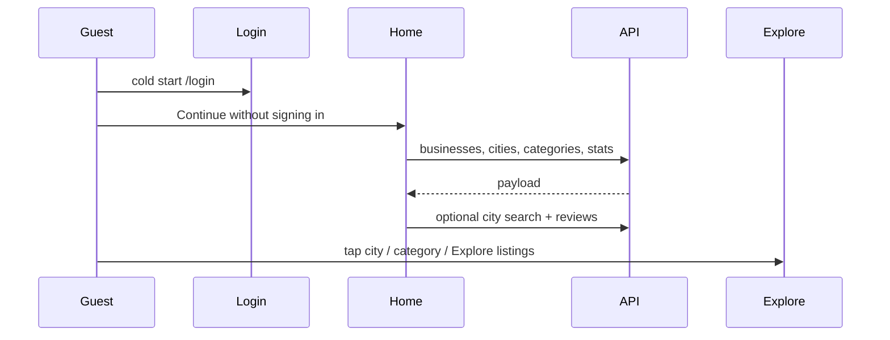

# Slice: S-064 — Mobile home marketing surfaces (Tier 5: M-13–M-18, M-76, M-77)

| Field | Value |
|-------|-------|
| **Slice ID** | S-064 |
| **Phase** | 5 Polish |
| **Status** | Accepted |
| **Role(s)** | customer \| merchant (public, pre-auth — visible to any guest in the app shell) |
| **Owner** | PM / 2026-08-18 |

---

## User story

**As a** visitor who opens MerchantHub on their phone before signing in
**I want** the same home-page story the web already tells (hero, social proof, the three review problems, live trust counts, city and category indexes, featured listings with photos, neighborhood review voices, how-it-works, and a merchant CTA)
**So that** I can decide the product is real and useful *on the phone* — without being dropped straight into a search list or a login form with no framing

---

## Acceptance criteria

Grouped by §12 row. Numbered so Tester can map 1:1. Web references: `frontend/src/app/page.tsx` plus S-047 (`SocialProofRail` / `ProblemSection`). Current mobile state verified before writing AC: there is **no** `/home` route; guest shell is Explore + Sign in (`app_shell.dart`); cold start is `/login`; Explore is the discovery surface (S-028); city/category **filters** exist on Explore (M-20) but the home **indexes** do not; `BusinessRepository` already has `listCities` / `listCategories` / `searchBusinesses`; generated client already has `listBusinessesApiV1BusinessesGet` (city/slugs) and `publicStatsSummaryApiV1BusinessesStatsSummaryGet`; `ReviewRepository.listForBusiness` is already public.

**M-13 — Home hero + marketing sections (shell)**

1. **Given** I am not signed in and I enter the public app shell (after "Continue without signing in" or by opening `/home`), **when** the Home tab is selected, **then** I see a dedicated marketing home screen (`/home`) — not a clone of Explore's search list, and not a WebView of the Next.js `/`.
2. **Given** that home screen, **when** it renders, **then** section order matches web `/`: hero → social proof rail → problem section → trust metrics (if stats loaded) → city index → category index → featured businesses → review voices → how it works → merchant CTA.
3. **Given** the hero, **when** I view it, **then** it shows the MerchantHub brand, headline "Local businesses, reviewed with clarity", supporting copy that AI insights are **suggestions** (never definitive judgments), a search field, an "Explore listings" action to `/businesses` (optionally with `?q=` from the field), and a "List your business" action to `/register`.

**M-76 — Social proof rail**

4. **Given** the social proof rail, **when** it renders, **then** it shows a small-caps "Businesses using MerchantHub" label above a horizontal row of name-or-photo entries, and it does **not** display any numeric stat, count, or percentage (those stay in trust metrics).
5. **Given** the rail's data, **when** the seeded-slug fetch succeeds, **then** entries come from `GET /api/v1/businesses?slugs=…` using the same curated slug list as web `SocialProofRail.tsx`; **when** that fetch fails or matches nothing, **then** it falls back to the same hardcoded placeholder roster (never an empty hole, never a crash). The rail always renders (no live-data `null` hide).

**M-77 — Problem section**

6. **Given** the problem section, **when** I view it, **then** it presents exactly three numbered points (`01`/`02`/`03`) with titles (1) "Your reviews are scattered", (2) "You don't know what's actually working", (3) "Vague reviews don't help anyone" — same honestly-scoped copy as web (no claim that multi-platform aggregation or AI topic clustering is live; point 3 may mention the guided collect flow). It always renders.

**M-14 — Trust metrics**

7. **Given** `GET /api/v1/businesses/stats/summary` returns counts, **when** home renders, **then** I see the four live figures web shows: approved businesses, active reviews, categories, cities covered. **Given** that call fails, **then** the trust-metrics block is omitted (same as web's `{stats && …}`), not shown as zeros invented from nothing.

**M-15 / M-16 — City and category indexes**

8. **Given** at least one city with listings, **when** I view the city index, **then** I see city names with listing counts, and tapping a city opens Explore pre-filtered to that city (`/businesses?city=`). **Given** zero cities, **then** the city index is omitted (same as web `CityIndex` returning null).
9. **Given** at least one category, **when** I view the category index, **then** I see category names with listing counts, and tapping a category opens Explore pre-filtered to that slug (`/businesses?category=`). **Given** zero categories, **then** the category index is omitted.

**M-17 — Featured businesses + photos**

10. **Given** approved businesses load, **when** the featured section renders, **then** it shows up to 6 listing cards with photos (reuse `BusinessCard`), titled around the first catalog city when one exists (else "Featured businesses"), with a "View all" action to Explore (city-filtered when a featured city was used). Optional `ai_merchant_summary` under a card is labeled as a **suggestion**. **Given** the list is empty, **then** an empty-state message is shown (not a blank crash); if the load failed, the empty state mentions the load error.

**M-18 — Review voices / how it works / merchant CTA**

11. **Given** at least one featured business with reviews that have a body, **when** home renders, **then** "Voices from the neighborhood" shows up to 3 real reviews with ratings; any AI summary is labeled as a **suggestion**. **Given** no such reviews, **then** the voices section is omitted (same as web).
12. **Given** home renders, **when** I scroll to the end of the marketing content, **then** I see a "How it works" three-step block (Search / Compare / Support local — Compare mentions AI summaries as suggestions) and a merchant CTA ("For business owners") with "Create a merchant account" → `/register` and "Sign in to dashboard" → `/login`.

**Chrome / permission / AI**

13. **Given** I am a guest, **when** I am on `/home` or `/businesses`, **then** bottom nav is Home, Explore, Sign in (Sign in still opens `/login` outside the shell, no bottom nav — S-027 AC13 unchanged). Signed-in customer/merchant/admin tab lists are **unchanged** (no extra marketing Home tab on those shells — Tier 5 is logged-out acquisition).
14. **Given** I am not signed in, **when** I open `/home`, **then** I am not redirected to `/login` (`/home` is a public carve-out next to `/businesses` and `/collect/:slug`).
15. **Given** neither social proof nor the problem section presents AI-derived content, **when** reviewed, **then** those two sections include no AI disclaimer. Hero, how-it-works Compare, featured AI blurbs, and review-voice AI notes **do** use suggestion language where AI is mentioned.
16. **Given** light or dark theme, **when** home is viewed, **then** section colors use `Theme.of(context).colorScheme` / existing theme tokens (no new hardcoded light-only `Color(0xFF…)` palettes that would fail S-057).

---

## UX notes

- **Screens / routes:** New public `/home` inside the existing `ShellRoute` (`HomeScreen`). Guest `AppShell` destinations become Home (`/home`), Explore (`/businesses`), Sign in (`/login`). Login cold-start stays `/login` (do not reopen S-027's first-run auth screen). "Continue without signing in" should land on **`/home`**, not Explore, so the new acquisition surface is actually reached from the existing guest path.
- **Not a cloned web homepage inside Explore.** S-028 already decided Explore is search/map. This slice adds a sibling marketing surface.
- **Components to reuse:** `BusinessCard`, `RatingStars`, `ThemeToggleButton` on the home app bar, existing `searchControllerProvider.applyQuery` via `/businesses?city=` / `?category=` / `?q=` (extend `BusinessListScreen`'s existing category query-param wiring to also honor `city` and `q`).
- **Empty states:** trust metrics / city index / category index / voices omit when empty; featured shows dashed empty copy; social proof + problem + how-it-works + CTA always show.
- **AI disclaimer required?** Yes, wherever AI text appears (hero, Compare step, featured blurb, voice nutshell). No on social proof / problem / trust metrics / indexes.

### Current state verified (not assumed)

- `router.dart`: public carve-outs are `/businesses*` and `/collect/`; `initialLocation` is `/login`.
- `app_shell.dart`: guest destinations are Explore + Sign in only.
- `business_list_screen.dart` already applies `?category=` on first frame (S-061); **does not** yet apply `?city=` or `?q=`.
- No `features/home/` directory exists.

### Open question for Architect

Cold-start: keep `/login` vs switch unsigned `initialLocation` to `/home`. PM default: **keep `/login`**, send "Continue without signing in" to `/home`. Flag if Architect prefers acquisition-first cold start (would rewrite S-027 guest tests).

---

## Out of scope

- Any change to web `frontend/` home components.
- New backend endpoints or OpenAPI regeneration (confirmed existing).
- Live CMS for social-proof names; A/B testing; analytics/impression tracking.
- Native SEO / App Store screenshot copy.
- Signed-in marketing Home tab (merchant/admin already use "Home" for dashboards).
- FCM, M-67 email, remaining Tier 3 merchant rows (M-69/M-70/M-78/M-79/M-80).
- Deep linking `/` from a custom URL scheme.

---

## Dependencies

- S-014 / S-047 (web home + social proof / problem) — Accepted; copy and order reference.
- S-027 (guest shell, Continue as guest) — Accepted; this slice **extends** guest tabs, does not remove Sign in.
- S-028 (Explore) — coded; Home must not swallow search chrome.
- S-057 (dark mode) — Accepted; home must stay token-themed.
- S-041 / S-061 — category → Explore `?category=` already works; city `?city=` is the missing sibling.

---

## Definition of done (PM)

- [x] All AC verified in test report (`TR-S-064-mobile-home-marketing.md`) — 16/16 Pass
- [x] UX matches notes above (Architect kept `/login` cold start; Continue as guest → `/home`)
- [x] `README.md` §12 rows M-13–M-18, M-76, M-77 updated to `implemented`; Tier 5 annotated closed
- [x] `README.md` §14 / §16 updated
- [x] PM Status set to **Accepted**

---

## Technical specification (Architect)

### Cold-start decision

**Keep `initialLocation: '/login'`.** Unsigned users still see the S-027 login screen first. `continueAsGuestButton` changes from `context.go('/businesses')` to `context.go('/home')`. Guest nav becomes Home / Explore / Sign in. This closes Tier 5 without reopening S-027's "app opens on login" contract. Rejected switching cold start to `/home` in this slice — that would be a separate chrome decision, not required by any M-13–M-18 row (those rows require the *surfaces*, not that they replace the login screen).

### API contract

None new. Existing public GETs:

| Method | Path | Auth | Request | Response | Notes |
|--------|------|------|---------|----------|-------|
| `GET` | `/api/v1/businesses` | Public (approved) | optional `city`, `slugs` | `list[BusinessResponse]` | `BusinessesApi.listBusinessesApiV1BusinessesGet`. Wire `BusinessRepository.listPublic({city, slugs})`. |
| `GET` | `/api/v1/businesses/cities` | Public | — | `list[string]` | Already `listCities()`. |
| `GET` | `/api/v1/businesses/categories/all` | Public | — | `list[CategoryResponse]` | Already `listCategories()`. |
| `GET` | `/api/v1/businesses/stats/summary` | Public | — | `PublicPlatformStats` | `publicStatsSummaryApiV1BusinessesStatsSummaryGet`. Wire `BusinessRepository.publicStats()`. |
| `GET` | `/api/v1/search/businesses` | Public | `city`, … | search hits | Already `searchBusinesses` — featured grid uses `SearchQuery(city: firstCity)` capped at 6. |
| `GET` | `/api/v1/reviews/business/{id}` | Public | — | `list[ReviewResponse]` | Already `listForBusiness` — voices pick first body-bearing review, cap 3 businesses. |

No OpenAPI regen.

### RBAC matrix

| Action | anonymous | customer | merchant | admin |
|--------|-----------|----------|----------|-------|
| `GET /home` | Yes | Yes (reachable via URL; not a signed-in tab) | Yes | Yes |
| Guest bottom-nav Home tab | Yes | No (tab list unchanged) | No | No |
| City/category tap → `/businesses?…` | Yes | Yes | Yes | Yes |

### Data model impact

- [x] None  [ ] Extend existing  [ ] New table(s)

**Details:** No schema change. `SocialProofEntry` is Dart-only, mirroring web's TS shape.

### Cache / side effects

None on Redis. Client: one `homePayloadProvider` (`FutureProvider.autoDispose`) that `Future.wait`s list/cities/categories/stats, then optionally city search + review fetches. Retry via `ref.invalidate`. Social-proof slug fetch is best-effort inside that load; failure uses `kSocialProofFallback`.

### Frontend (Flutter)

- **Route:** `GoRoute(path: '/home', … HomeScreen())` as a **sibling** of `/businesses` inside `ShellRoute`.
- **Public carve-out** in `redirect`: `loc == '/home'`.
- **Guest destinations** (order): `/home` (`homeTab`), `/businesses` (`exploreTab`), `/login` (`signInTab`).
- **Login:** `continueAsGuestButton` → `/home`.
- **Explore query params:** `BusinessListScreen` first-frame callback applies `q`, `city`, and `category` together into `SearchQuery` (today only `category`).
- **Files:**
  - `mobile/lib/features/home/social_proof_data.dart` — fallback roster + slug list (parity with `SocialProofRail.tsx`).
  - `mobile/lib/features/home/home_providers.dart` — `HomePayload` + provider.
  - `mobile/lib/features/home/home_screen.dart` — scroll of keyed sections; `ThemeToggleButton` in app bar.
  - Presentational sections may live in the same file or `home_sections.dart` — Builder's call; keys listed below are required.
- **Required keys:** `homeScreen`, `homeHero`, `homeSearchField`, `homeExploreButton`, `homeRegisterButton`, `socialProofRail`, `problemSection`, `trustMetrics`, `cityIndex`, `categoryIndex`, `featuredGrid`, `reviewVoices`, `howItWorks`, `merchantCta`, `homeTab`.
- **Widget tests** may inject `homePayloadProvider` / repositories; do not hit the network.

### Flow

### Architect checklist

- [x] API contract defined (existing public GETs only)
- [x] RBAC matrix complete
- [x] Data model impact documented (none)
- [x] Cache invalidation considered (none)
- [x] Uses AI/storage abstractions where applicable (N/A beyond suggestion copy)
- [x] ERD/API/FLOWS updates noted (README §12/§14/§16 only; no §7 API change)

### Risks / tradeoffs

- Guest nav grows from 2 to 3 destinations; Sign in index in tests that used `onDestinationSelected!(1)` must move to index 2 or tap `signInTab`.
- Fake `BusinessRepository`s used with the full router do not need the new methods unless a test navigates to `/home`.
- Social-proof placeholders can read as fake social proof — same accepted web risk (S-047).
- Home is a long scroll on a phone; order is a web parity constraint, not optional.

---

## Links

- Test plan: `docs/agents/test-plans/TP-S-064-mobile-home-marketing.md`
- Test report: `docs/agents/test-reports/TR-S-064-mobile-home-marketing.md`
- Web reference: `docs/agents/slices/S-047-home-marketing-sections.md`, `frontend/src/app/page.tsx`

---

## Changelog

| Date | Agent | Change |
|------|-------|--------|
| 2026-08-18 | PM | Created slice. Tier 5 mobile parity for M-13–M-18, M-76, M-77 as one combinable slice (shared `/home` extension point, same grouping rationale as S-061). 16 AC. Verified no home route exists today. |
| 2026-08-18 | Architect | Spec: keep `/login` cold start; Continue as guest → `/home`; guest tabs Home/Explore/Sign in; reuse existing public GETs; extend Explore query params for `city`/`q`; no backend work. Status → Specified. |
| 2026-08-18 | Builder | Implemented `/home` `HomeScreen`, guest Home tab, repository `listPublic`/`publicStats`, Explore `?city=`/`?q=`, login continue → `/home`. README §12/§14/§16. |
| 2026-08-18 | Tester | `TR-S-064-mobile-home-marketing.md` — 16/16 Pass, analyze clean, 240/240 tests. Recommendation: Ship. |
| 2026-08-18 | PM | Reviewed TR. All eight Tier 5 tracker rows `implemented`. Status: Specified → **Accepted**. |
