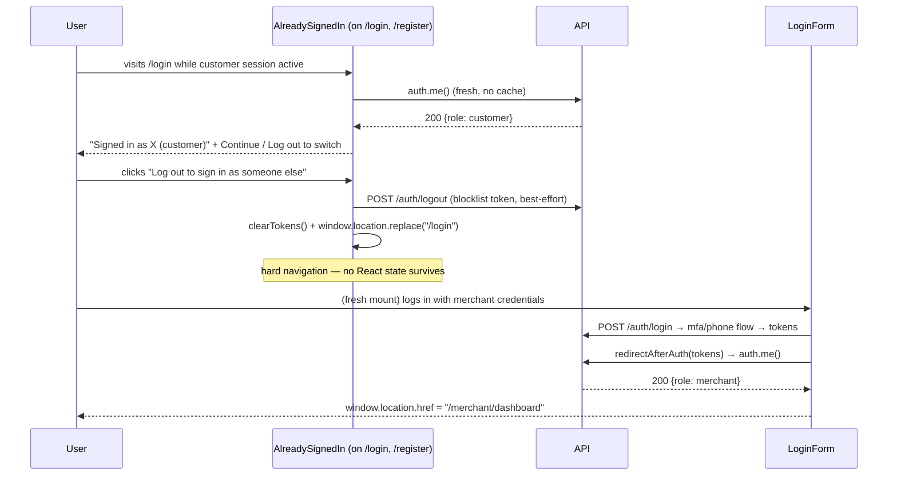

# Slice: S-067 — Customer↔merchant session switching

| Field | Value |
|-------|-------|
| **Slice ID** | S-067 |
| **Phase** | 1 Foundation |
| **Status** | Accepted |
| **Role(s)** | customer \| merchant \| admin |
| **Owner** | PM / 2026-08-18 |

---

## User story

**As a** logged-in customer (or merchant)
**I want** to be clearly and safely stopped from starting a session as a different role while my current session is still active, and to have my previous session's context fully cleared once I do sign out and sign in as another role
**So that** I never end up in a broken or ambiguous state where the app shows the wrong role's data, and I always know exactly what account/role I'm acting as

---

## Acceptance criteria

1. **Given** a customer is logged in with an active session, **when** they navigate to the merchant login or merchant registration screen, **then** the app detects the existing active session and blocks silent role-switching — it does not attempt to log the merchant flow in "on top of" the customer session.
2. **Given** a customer is logged in with an active session, **when** they attempt to start a merchant login/registration flow, **then** the app clearly informs them they are already logged in as a customer and offers an explicit "Log out and continue" action (or equivalent single-step affordance) rather than a dead end.
3. **Given** a user chooses "Log out and continue" from the role-switch prompt, **when** the logout completes, **then** all client-side session state (JWT/session token, cached `auth.me()` result, any in-memory or localStorage user/role data) is fully cleared before the merchant (or customer) login/registration form is shown.
4. **Given** a user has fully logged out (via the normal logout action or the role-switch flow), **when** they log in with credentials belonging to a different role than their previous session, **then** the app correctly re-evaluates the account via a fresh `auth.me()` (or equivalent) call and routes them to the correct role's landing area (customer home vs. merchant dashboard) with no stale UI left over from the prior session.
5. **Given** a user has fully logged out, **when** they attempt to access a role-gated route that requires re-authentication (e.g. merchant dashboard), **then** `RequireAuth` treats them as unauthenticated and redirects to login — it does not honor any cached/stale role state.
6. **Given** an admin is logged in, **when** they attempt to reach customer or merchant login/registration while their admin session is active, **then** the same block-and-prompt behavior from AC1–AC3 applies (admin is not a special case).
7. **Given** a user is not logged in at all, **when** they visit merchant login/registration or customer login/registration, **then** there is no change in behavior from today — the role-switch guard only activates when an existing session is detected.
8. **Given** a user successfully switches accounts (logs out of role A, logs in as role B), **when** they open a new browser tab to an authenticated route, **then** the new tab reflects the role B session consistently (no split-brain between tabs from stale localStorage reads).

---

## UX notes

- Screens / routes: `/login`, `/register` (or merchant-specific login/register entry points), any route guarded by `RequireAuth`.
- Components to reuse: `RequireAuth.tsx` (session re-evaluation logic), `LoginForm.tsx`, `RegisterForm.tsx`. No new screens — the role-switch notice should be an inline banner/dialog within the existing login/register form, not a separate page.
- Empty states / errors: If session clearing fails partway (e.g. network error on logout call), show a clear retry message rather than silently proceeding into a half-logged-out state.
- AI disclaimer required? no — this slice has no AI-generated content.

---

## Out of scope

- Multi-role accounts / a single account holding both customer and merchant roles simultaneously (out of current product scope — one account = one role, per README §2).
- Any backend token-format change (e.g. separate merchant token type) — that is an Architect decision to evaluate, not prescribed here.
- Remember-me / persistent "switch back" shortcuts between two accounts on the same device.
- httpOnly cookie auth migration (tracked separately, see S-026 if applicable).

---

## Dependencies

- None required to be Accepted first, but this slice touches the same auth surface as S-018 (secure logout), S-020 (mandatory TOTP), and S-026 (httpOnly cookie auth migration) — Architect should confirm no conflicting in-flight changes.

---

## Definition of done (PM)

- [ ] All AC verified in test report
- [ ] UX matches notes above
- [ ] Documented in `README.md` §7 API reference / §8 Frontend guide if new patterns
- [x] PM Status set to **Accepted**

---

## Technical specification (Architect)

### Pre-read finding (important — read before implementing)

This is **not** a from-scratch build. The frontend already has most of the role-switch
guard in place, shipped as part of the existing auth surface:

- `frontend/src/components/AlreadySignedIn.tsx` — wraps `LoginForm`/`RegisterForm` on
  `/login` and `/register`. On mount it calls `auth.me()` fresh (no cached user object
  anywhere client-side). If a session exists it renders a block screen — "You're signed
  in as `{full_name}` (`{role}`)" with **Continue** (`/`) and **"Log out to sign in as
  someone else"** (`performLogout("/login")`) — instead of the form. This already
  satisfies **AC1, AC2, AC6, AC7** for both roles, because `/login` and `/register` are
  the *only* login/register entry points (there is no separate merchant-specific login
  route to bypass the guard).
- `frontend/src/lib/api.ts` → `performLogout()` — best-effort `auth.logout()` (blocklists
  the JWT server-side), then synchronous `clearTokens()` (removes both
  `access_token`/`refresh_token` from `localStorage`), then
  `window.location.replace(redirectTo)` — a **hard navigation**, not a client-side route
  change. This already satisfies **AC3**: there is no cached `auth.me()` result or
  in-memory user object surviving a hard navigation (React state does not persist across
  a full document reload), so the next screen mounts with zero session state to leak.
- `frontend/src/components/RequireAuth.tsx` — no cached role; calls `auth.me()` fresh on
  every mount and again on bfcache `pageshow` (`e.persisted`), so Back-button restores
  cannot show stale access. Missing/invalid token → `router.replace("/login")`; wrong
  role → `router.replace("/")`. This already satisfies **AC5**.
- **AC8** (new tab reflects the latest session): a new tab is a fresh mount of
  `ClientLayout`/`RequireAuth`/`AlreadySignedIn`, each of which reads `localStorage` and
  calls `auth.me()` at mount time — there is no stale in-memory cache carried into a new
  tab, so this already holds once tab B is opened *after* tab A's logout write completes.
  (Cross-tab *live* sync — e.g. an already-open tab reacting instantly to another tab's
  logout via a `storage` event listener — is explicitly not required by AC8's wording
  ("open a new browser tab") and is out of scope here.)

**Backend:** no change. JWT is stateless; `role` is a claim taken from the DB row at
token-issue time (`create_access_token(str(user.id), {"role": user.role.value})` in
`app/routers/auth.py::_issue_session_tokens`), never cached server-side per session. There
is no server-side "current session" concept to reconcile — confirming the slice's own
"Out of scope" note that a token-format change is not warranted.

### The actual gap (AC4)

**AC4** is not yet met literally: `LoginForm.finishWithTokens` and
`PhoneOtpPanel.verify()` both unconditionally hard-navigate to `"/"` after storing
tokens — they never call `auth.me()` before redirecting, and there is no role-based
landing page (merchant always lands on the public home page, not
`/merchant/dashboard`). This is the one concrete, narrow fix in scope for S-067:

- Add a shared helper in `frontend/src/lib/api.ts`:
  ```ts
  export async function redirectAfterAuth(tokens: TokenResponse, fallback = "/"): Promise<void> {
    storeTokens(tokens);
    let destination = fallback;
    try {
      const me = await auth.me();
      if (me.role === "merchant") destination = "/merchant/dashboard";
    } catch {
      // token just stored should be valid; on any failure fall back to `fallback`
      // rather than blocking the redirect — ClientLayout will re-resolve on load.
    }
    window.location.href = destination;
  }
  ```
- Replace `LoginForm.finishWithTokens`'s body with a call to `redirectAfterAuth(tokens)`.
- Replace `PhoneOtpPanel.verify()`'s `storeTokens(tokens); window.location.href = "/";`
  with `await redirectAfterAuth(tokens);`.
- This one helper is also the seam S-068 will reuse to surface a role-mismatch note (see
  S-068 spec) — do not duplicate the `auth.me()` call there.

No other file needs to change for S-067. Do not touch `AlreadySignedIn.tsx`,
`performLogout`, or `RequireAuth.tsx` — they are already correct; re-implementing them
risks introducing a regression in already-covered ACs.

### API contract

| Method | Path | Auth | Request | Response |
|--------|------|------|---------|----------|
| — | — | — | — | No new/changed endpoints. Reuses existing `GET /auth/me`, `POST /auth/logout` as-is. |

### RBAC matrix

| Action | customer | merchant | admin |
|--------|----------|----------|-------|
| See role-switch block screen when a session is active | yes | yes | yes |
| Post-login redirect target | `/` | `/merchant/dashboard` | `/` |

### Data model impact

- [x] None  [ ] Extend existing  [ ] New table(s)

**Details:** JWT `role` claim is unchanged; no schema/token-shape change.

### Cache / side effects

None. No Redis cache keys are relevant to this slice (`performLogout`'s existing
blocklist call is unchanged).

### Frontend

- **Route:** `/login`, `/register` (existing, unchanged), post-login destination now
  branches to `/merchant/dashboard` for merchants.
- **Rendering:** CSR for the guard/form components (`AlreadySignedIn`, `LoginForm`,
  `RegisterForm`, `PhoneOtpPanel`, `RequireAuth` are all `"use client"`); the `/login`
  and `/register` page shells remain SSR Server Components fetching `businesses.stats()`
  (unchanged).
- **Components:** `frontend/src/lib/api.ts` (new `redirectAfterAuth` export),
  `frontend/src/components/LoginForm.tsx` (`finishWithTokens` calls the new helper),
  `frontend/src/components/PhoneOtpPanel.tsx` (`verify()` calls the new helper). No
  changes to `AlreadySignedIn.tsx`, `RequireAuth.tsx`, or backend.

### Flow



### Architect checklist

- [x] API contract defined (none needed — confirmed no backend change)
- [x] RBAC matrix complete
- [x] Data model impact documented (none)
- [x] Cache invalidation considered (none applicable)
- [x] Uses AI/storage abstractions where applicable (n/a — no AI/storage involved)
- [x] ERD/API/FLOWS updates noted (none — no new endpoint; §8 Frontend guide note only if
      Builder wants to document the `redirectAfterAuth` pattern)

### Risks / tradeoffs

- The fix is deliberately minimal (one shared redirect helper) precisely because the
  bulk of the AC list was already implemented by prior slices (`AlreadySignedIn`,
  `performLogout`, `RequireAuth`). Re-verify AC1, AC2, AC3, AC5, AC6, AC7, AC8 as
  **regression checks** against existing behavior in the test plan, not as new
  functionality to build.
- `redirectAfterAuth`'s `auth.me()` call adds one extra round-trip before redirect on
  every login (password, TOTP, Google via `finishWithTokens` — Google's own handler is
  unchanged in this slice — and phone-OTP). This is a small, one-time latency cost,
  acceptable given it removes a UX gap (merchant landing on the customer home page).
- No httpOnly-cookie migration, no multi-role-account support — both explicitly out of
  scope per the slice's own "Out of scope" section; nothing in this spec touches either.

---

## Links

- Test plan: `docs/agents/test-plans/TP-S-067-*.md`
- Test report: `docs/agents/test-reports/TR-S-067-*.md`
- ADR: none — no new integration, schema, or auth-provider behavior change; see
  "Pre-read finding" above for why this is a narrow fix, not an architectural decision.

---

## Changelog

| Date | Agent | Change |
|------|-------|--------|
| 2026-08-18 | PM | Created slice |
| 2026-08-18 | Architect | Filled technical specification; identified most ACs as already implemented (`AlreadySignedIn`, `performLogout`, `RequireAuth`); scoped the real gap to a shared `redirectAfterAuth` helper for AC4. Status → Specified. |
| 2026-08-18 | PM | Reviewed TR-S-067: all 8 AC covered and passing (7 automated/code-read regression, 1 code-read+manual for AC8, justified sandbox limitation). Status → Accepted. |
