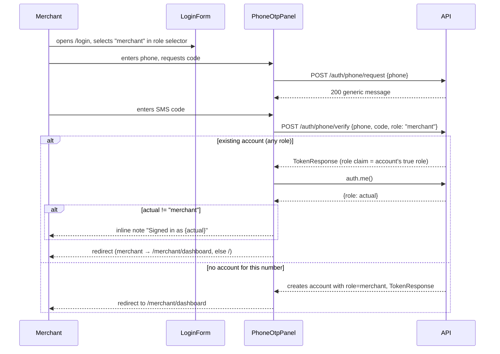

# Slice: S-068 — Merchant-aware OTP login

| Field | Value |
|-------|-------|
| **Slice ID** | S-068 |
| **Phase** | 1 Foundation |
| **Status** | Accepted |
| **Role(s)** | merchant \| customer |
| **Owner** | PM / 2026-08-18 |

---

## User story

**As a** merchant
**I want** to log in using phone OTP as a clear, first-class option — not just password + TOTP QR code — the same way phone-OTP is already offered during merchant registration
**So that** I have a consistent, convenient verification method available on both registration and every subsequent login, without being forced into a QR-code-only secondary factor

---

## Acceptance criteria

1. **Given** the shared `/login` screen, **when** any user opens it, **then** a phone-OTP login option is visibly available regardless of which role they intend to log in as (parity with the existing password-login option).
2. **Given** a user on the login screen has an account role selector or role context available (mirroring `RegisterForm.tsx`'s existing role selector), **when** they select "merchant" before starting the OTP flow, **then** that role is passed through to `PhoneOtpPanel` on the login screen the same way `RegisterForm.tsx` already does — closing the current gap where `LoginForm.tsx` does not pass a role.
3. **Given** a merchant account already exists with a verified phone number, **when** the merchant requests an OTP via `POST /auth/phone/request` and submits the correct code via `POST /auth/phone/verify` from the login screen, **then** they are authenticated and routed to the merchant dashboard — with no requirement to additionally complete the TOTP/QR-code step for this login.
4. **Given** a customer account (not merchant) attempts phone-OTP login while an optional role hint of "merchant" is present, **when** the account's actual role does not match the hint, **then** the login either resolves to the account's true role (customer) with a clear on-screen indication, or is rejected with an explicit error — no silent misrouting into the wrong role's dashboard. (Architect to confirm which behavior consistent with existing `role` handling on `/auth/phone/verify`.)
5. **Given** a merchant has not yet registered/verified a phone number on their account, **when** they try to use phone-OTP login, **then** the UI clearly explains phone-OTP is unavailable for this account and directs them to their existing login method (password) or to add a phone number from account settings — no dead-end or unhandled error state.
6. **Given** a merchant completes password login, **when** their account has TOTP/QR-code MFA enabled, **then** the existing QR/TOTP verification step still appears exactly as it does today — this slice adds OTP as an alternative *primary* login path, it does not remove or alter the existing TOTP MFA step for password-based login.
7. **Given** the login screen now surfaces both "password" and "phone OTP" as visible login methods for merchants, **when** a merchant compares this to what they saw during registration, **then** the set of visible authentication options is consistent between `RegisterForm.tsx` and `LoginForm.tsx` for the merchant role (no option present at registration but missing at login, or vice versa).
8. **Given** an admin account, **when** they view the login screen, **then** phone-OTP login is available or explicitly not-applicable per existing admin auth policy — this AC exists to confirm admin behavior is unchanged by this slice (regression check only).

---

## UX notes

- Screens / routes: `/login` (shared screen for all roles).
- Components to reuse: `LoginForm.tsx` (add role selector / role passthrough to match `RegisterForm.tsx`), `PhoneOtpPanel.tsx` (already supports optional `role` param — no new component needed), `RegisterForm.tsx` (reference pattern for role selector UX, do not duplicate logic — extract/share if Architect finds it sensible).
- Empty states / errors: no phone on file → explanatory inline message (AC5); role mismatch → explicit message, not silent redirect (AC4).
- AI disclaimer required? no — this slice has no AI-generated content.

---

## Out of scope

- Adding phone-OTP as a *replacement* for TOTP/QR MFA — both remain available; this slice only makes OTP visible/usable as a primary merchant login path.
- Any change to Google OAuth login option for merchants.
- New phone number verification flows beyond what S-044 already implemented (this slice reuses `/auth/phone/request` and `/auth/phone/verify` as-is).
- Admin-specific OTP policy changes (AC8 is a regression check, not new admin scope).

---

## Dependencies

- S-044 (phone-otp) — must be Accepted first (it is; provides `/auth/phone/request` / `/auth/phone/verify` and `PhoneOtpPanel`).
- S-067 (customer↔merchant session switching) — sequenced after S-067 lands in the same initiative, since both slices touch the shared login screen's role-handling; avoids conflicting edits to `LoginForm.tsx` / `RequireAuth.tsx`.

---

## Definition of done (PM)

- [ ] All AC verified in test report
- [ ] UX matches notes above
- [ ] Documented in `README.md` §7 API reference / §8 Frontend guide if new patterns
- [x] PM Status set to **Accepted**

---

## Technical specification (Architect)

### Pre-read finding

`PhoneOtpPanel` (`frontend/src/components/PhoneOtpPanel.tsx`) already accepts an optional
`role?: string` prop and threads it through to `auth.phoneVerify({..., role})`
(`frontend/src/lib/api.ts`) — `RegisterForm.tsx` already passes `role={form.role}`. The
backend `POST /auth/phone/verify` (`app/routers/auth.py::phone_otp_verify`) already
branches correctly for the two cases this slice cares about:

- **Existing account matched by phone** → the `role` field on the request is **ignored
  entirely**; the response always reflects the account's true stored role
  (`_issue_session_tokens(user)` uses `user.role`, not `payload.role`). This is exactly
  the safe behavior AC4 asks for — no privilege confusion is possible via a mismatched
  role hint on an existing account.
- **No account matched by phone (first-time number)** → `role` (default `customer`)
  decides the role of the *newly created* account; `UserRole.ADMIN` is rejected (403),
  matching the existing self-register-as-admin block on `/auth/register`.

So **no backend change is required** — S-044/ADR-011's endpoints already do the right
thing. The only real gap is that `LoginForm.tsx` never passes a `role` and never
surfaces which role the account actually resolved to.

### Scope of change (frontend only)

1. **Role selector on `/login`.** Add a small `loginRole` state (`"customer" | "merchant"`,
   default `"customer"`) to `LoginForm`, rendered with the same `Select` component
   `RegisterForm` uses (`@/components/ui/Select`), placed directly above
   `<PhoneOtpPanel />` in the `credentials` step, labeled e.g. "Signing in as" with the
   same two options as `RegisterForm` (`customer` / `merchant` — no `admin`, mirroring
   the existing self-register block). Pass it through: `<PhoneOtpPanel role={loginRole} onError={setError} />`.
   This selector **only affects the phone-OTP sub-flow** — it is not wired into the
   password/TOTP submit path, because that path's role is already determined
   server-side by the looked-up account (see AC6 — must stay untouched). Add one line of
   help text under the selector clarifying this (see point 3).
2. **Reuse S-067's `redirectAfterAuth` helper, extended with a mismatch note.** S-067
   adds `redirectAfterAuth(tokens)` to `frontend/src/lib/api.ts`, which already calls a
   fresh `auth.me()` before redirecting. S-068 extends the call site in `PhoneOtpPanel`
   only (not the generic helper signature) to compare the resolved role against the
   `loginRole` the user picked, and show an inline note before redirecting if they
   differ — e.g. "Signed in as **customer** (this number is already registered as a
   customer account)." Concretely:
   ```ts
   // in PhoneOtpPanel.verify(), replacing the current storeTokens+redirect:
   const tokens = await auth.phoneVerify({ phone: `${countryCode}${phone}`, code, full_name: fullName, role });
   storeTokens(tokens);
   const me = await auth.me();
   if (role && me.role !== role) {
     onRoleResolved?.(me.role); // new optional prop; LoginForm shows the note, then redirects
   }
   await redirectAfterAuth already stored tokens above, so call the shared post-role-redirect
   part only (or inline the same merchant→/merchant/dashboard branch) — see Builder note below.
   ```
   Implementation detail left to the Builder: either (a) give `redirectAfterAuth` an
   optional `onRoleMismatch?: (actualRole) => void` callback invoked before the redirect
   when `expectedRole` (also optional, new param) differs from the resolved role, and
   have `PhoneOtpPanel` pass both, or (b) keep `redirectAfterAuth` as S-067 defines it
   and have `PhoneOtpPanel` do its own `auth.me()` + note-then-redirect. Prefer (a) to
   avoid a second `auth.me()` round-trip. Do not change `redirectAfterAuth`'s behavior
   for callers that don't pass `expectedRole` (i.e. `LoginForm.finishWithTokens` from
   S-067 is unaffected).
   This satisfies **AC4**: no silent misrouting — the true role always wins, and the UI
   states it plainly before navigating away.
3. **AC5 (no phone on file for an existing merchant) is a messaging-only mitigation, not
   a backend gate.** `POST /auth/phone/verify` is *auto-register-by-design* (ADR-011): if
   a merchant has never verified a phone and types a number here, the backend cannot
   distinguish "returning merchant who forgot they never added a phone" from "brand-new
   signup" — it will create a second, separate account. Building a lookup endpoint to
   detect this ahead of time is explicitly out of scope ("New phone number verification
   flows beyond what S-044 already implemented"). Mitigation: static help copy under the
   role selector / above `PhoneOtpPanel` on `/login` only (not `/register`, where
   first-time signup via phone is the intended use), e.g.: *"Already have a merchant
   account? Phone sign-in only works if you've verified this exact number before —
   otherwise it creates a new account. Use your password below if unsure."* This is a PM
   copy decision at implementation time (Builder should route final wording through PM
   if unsure), not a new component.
4. **AC7 (parity check).** After (1), `LoginForm` and `RegisterForm` both render:
   password fields (login only has these; register also has them), Google button, role
   selector (`RegisterForm`'s always visible; `LoginForm`'s new one only meaningfully
   gates the phone-OTP path), and `PhoneOtpPanel`. This closes the stated gap.
5. **AC3, AC6, AC8** require no code change — they describe existing, already-correct
   backend behavior (phone/verify skips TOTP entirely, same as Google; password+TOTP
   path is untouched by this slice; admin behavior is unchanged because this slice adds
   no admin-facing UI or backend branch). Cover them as regression checks in the test
   plan.

### API contract

| Method | Path | Auth | Request | Response |
|--------|------|------|---------|----------|
| POST | `/api/v1/auth/phone/request` | none | `{phone}` | `{message}` — **existing, reused as-is, no change** |
| POST | `/api/v1/auth/phone/verify` | none | `{phone, code, full_name?, role?}` | `TokenResponse` — **existing, reused as-is, no change**. `role` only affects first-time account creation (see Pre-read finding); ignored for an existing match. |

### RBAC matrix

| Action | customer | merchant | admin |
|--------|----------|----------|-------|
| Use phone-OTP to log in to an existing account | yes (unchanged) | yes (unchanged) | yes (unchanged, regression check only — AC8) |
| Select "merchant" role hint on `/login` before first-time phone signup | yes (creates merchant account) | yes (creates merchant account) | n/a — selector offers only customer/merchant, no admin option (mirrors `/register`) |
| Skip TOTP via phone-OTP | yes (unchanged, ADR-011) | yes (unchanged, ADR-011) | yes (unchanged, ADR-011) |

### Data model impact

- [x] None  [ ] Extend existing  [ ] New table(s)

**Details:** No schema change. `users.phone`/`users.role` already exist per ADR-011.

### Cache / side effects

None. No Redis cache keys relevant (OTP issue/consume flow in `app/services/phone_otp.py`
is unchanged).

### Frontend

- **Route:** `/login` (existing).
- **Rendering:** CSR (`LoginForm`, `PhoneOtpPanel` are `"use client"`; the `/login` page
  shell stays SSR, unchanged).
- **Components:** `frontend/src/components/LoginForm.tsx` (new `loginRole` state +
  `Select`, passes `role` to `PhoneOtpPanel`, renders AC5 help copy), 
  `frontend/src/components/PhoneOtpPanel.tsx` (role-mismatch note before redirect — see
  point 2 above), `frontend/src/lib/api.ts` (`redirectAfterAuth` gains an optional
  `expectedRole`/`onRoleMismatch` extension point — additive, does not change existing
  S-067 call sites). No new components; reuses `@/components/ui/Select` exactly as
  `RegisterForm` does.

### Flow



### Architect checklist

- [x] API contract defined (both endpoints reused as-is; documented above)
- [x] RBAC matrix complete
- [x] Data model impact documented (none)
- [x] Cache invalidation considered (none applicable)
- [x] Uses AI/storage abstractions where applicable (n/a)
- [x] ERD/API/FLOWS updates noted (no new endpoint; README §8 Frontend guide should note
      the shared role-selector pattern once built, per Definition of done)

### Risks / tradeoffs

- Auto-register-on-verify (ADR-011) means AC5 can only be addressed with UX copy, not a
  hard backend block, without adding a new lookup endpoint — explicitly out of scope.
  Flag this clearly in the test report as a known, accepted limitation rather than a
  failed AC, since the slice's own scope excludes the backend change that would close it
  fully.
- The `loginRole` selector on `/login` is easy to misread as "this determines which
  account I log into" — it only matters for (a) the phone-OTP path and (b) only when
  that phone number has no existing account. The AC5 help copy and the role-mismatch
  note (point 2) are the two mitigations; Builder should keep both, not treat either as
  optional polish.
- Sequenced after S-067 per the slice's own Dependencies section — both touch
  `LoginForm.tsx`/`PhoneOtpPanel.tsx`/`api.ts`; implement S-067's `redirectAfterAuth`
  first, then extend it here, to avoid two competing redirect implementations.

---

## Links

- Test plan: `docs/agents/test-plans/TP-S-068-*.md`
- Test report: `docs/agents/test-reports/TR-S-068-*.md`
- ADR: none — this slice reuses ADR-011 (Phone OTP via SMS port) as-is; no new
  integration, schema, or auth-provider behavior. See ADR-011 for the underlying
  auto-register-on-verify decision referenced above.

---

## Changelog

| Date | Agent | Change |
|------|-------|--------|
| 2026-08-18 | PM | Created slice |
| 2026-08-18 | Architect | Filled technical specification; confirmed no backend change needed (ADR-011 endpoints already correct); scoped to a `LoginForm` role selector + `PhoneOtpPanel` role-mismatch note built on S-067's `redirectAfterAuth`. Status → Specified. |
| 2026-08-18 | PM | Reviewed TR-S-068: all 8 AC covered and passing (6 automated, AC5 an accepted copy-only mitigation by explicit design, AC8 a regression check). Status → Accepted. |
