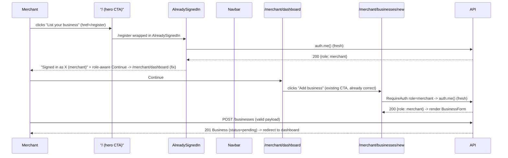

# Slice: S-069 — Fix "list your business" flow

| Field | Value |
|-------|-------|
| **Slice ID** | S-069 |
| **Phase** | 2 Core (onboarding) |
| **Status** | Accepted |
| **Role(s)** | merchant |
| **Owner** | PM / 2026-08-18 |

---

## User story

**As a** merchant
**I want** to reliably find and use a "list your business" / "add business" entry point from anywhere in the app while logged in
**So that** I can create my business listing without hitting a dead end, a broken link, or a silently-failing form

---

## Acceptance criteria

1. **Given** a logged-in merchant with no businesses yet, **when** they land on their dashboard/home area, **then** a visible, working "Add business" (or "List your business") call-to-action is present and navigates to `/merchant/businesses/new`.
2. **Given** a logged-in merchant, **when** they use primary navigation (nav bar, sidebar, or merchant menu — wherever the product places merchant actions today), **then** there is at least one discoverable link/button to the add-business flow that does not require the merchant to already know the URL.
3. **Given** the report that "list your business doesn't appear/work anywhere," **when** the flow is reproduced end-to-end (link visibility → click → route load → `RequireAuth role="merchant"` gate → form render → form submit → `POST /businesses` → success redirect), **then** the specific failing step is identified and documented in the test report, and the fix targets that step (not a speculative rewrite of unrelated code).
4. **Given** a logged-in merchant whose role claim genuinely is `merchant`, **when** they navigate to `/merchant/businesses/new`, **then** `RequireAuth role="merchant"` allows access (no false-negative gate failures for legitimately-merchant users, including immediately after login/role-switch per S-067/S-068).
5. **Given** a logged-in customer or an unauthenticated visitor, **when** they navigate directly to `/merchant/businesses/new`, **then** they are redirected/blocked per existing RBAC behavior (no regression).
6. **Given** a merchant on the add-business form, **when** they fill in valid required fields and submit, **then** the business is created via `POST /businesses`, a success state is shown, and the merchant is routed to a place where they can see the new (pending-review) business — no silent failure (no swallowed error, no stuck spinner, no unexplained no-op).
7. **Given** a merchant submits the form with invalid/missing data, **when** the backend rejects the request, **then** a visible, specific error message is shown on the form (not a silent failure).
8. **Given** the root cause found in AC3 is a nav/discoverability gap, a `RequireAuth` gating bug, or a form-submission bug, **when** the fix ships, **then** the specific defect class found is called out in the test report so future regressions in that exact area can be traced back to this slice.

---

## UX notes

- Screens / routes: wherever merchant primary navigation lives today (dashboard shell, top nav, or merchant menu), `/merchant/businesses/new`.
- Components to reuse: `BusinessForm.tsx`, `RequireAuth.tsx`, `Dashboard.tsx` (shared sidebar shell). No new screens.
- Empty states / errors: add-business CTA should be visible even when merchant has zero businesses (this is likely the most common state for the reported bug). Form submit errors must be shown inline, not swallowed.
- AI disclaimer required? no — this slice has no AI-generated content.

---

## Out of scope

- Redesigning the add-business form fields/layout (covered by S-072, S-073, S-074).
- Any backend schema change to `POST /businesses` (static analysis found no backend bug; if the Architect's reproduction reveals a real backend defect, that is an in-scope fix within this slice, but no speculative backend changes without a reproduced failure).
- Multi-step wizard or onboarding redesign beyond fixing the discovery/access/submit path.

---

## Dependencies

- S-067, S-068 (customer/merchant auth/session fixes) — must land first; this slice's `RequireAuth role="merchant"` reproduction (AC3, AC4) assumes the corrected session/role-switch behavior is already in place.

---

## Definition of done (PM)

- [ ] All AC verified in test report
- [ ] UX matches notes above
- [ ] Documented in `README.md` §7 API reference / §8 Frontend guide if new patterns
- [x] PM Status set to **Accepted**

---

## Technical specification (Architect)

### Pre-read finding (important — read before implementing)

Code review (not just static analysis) already turned up a concrete, narrow-scope root
cause. **Read S-067's spec first** (`docs/agents/slices/S-067-session-role-switch-fix.md`)
— this is very likely the *same* underlying defect, not a second independent bug:

- `frontend/src/components/LoginForm.tsx::finishWithTokens` and
  `PhoneOtpPanel.verify()` currently hard-navigate to `"/"` unconditionally after any
  successful login (password, TOTP, phone-OTP) — confirmed still true as of this
  read; `redirectAfterAuth` does not exist yet in `frontend/src/lib/api.ts`.
- `frontend/src/components/AlreadySignedIn.tsx` (wraps `/login`, `/register`) shows an
  authenticated visitor a block screen with only two actions: **"Continue"** (hardcoded
  `href="/"`, role-unaware) and **"Log out to sign in as someone else"**. There is no
  forward path from that screen to `/merchant/dashboard` or `/merchant/businesses/new`.
- `frontend/src/app/page.tsx` (home hero) and `frontend/src/components/Footer.tsx` both
  render a **"List your business"** link pointing to `/register`, not to
  `/merchant/businesses/new`. For an *already-registered, already-logged-in* merchant,
  clicking it lands them on `AlreadySignedIn`'s block screen above — a dead end back to
  the public home page, not to the add-business form. This is the most plausible
  reproduction of "list your business doesn't appear/work anywhere": a returning
  merchant's most visible "list your business" entry point loops them back to `/`.
- Once on `/`, `frontend/src/components/Navbar.tsx` *does* correctly render a
  role-aware `Dashboard` link (`user?.role === "merchant"` → `/merchant/dashboard`) —
  so a merchant is never truly stuck with zero path forward, but the flow is confusing
  and indirect enough to read as "doesn't work" in a bug report, especially before first
  login (a brand-new merchant has no reason to look at the navbar instead of the large
  hero CTA they just clicked).
- `RequireAuth role="merchant"` (`frontend/src/components/RequireAuth.tsx`) itself calls
  `auth.me()` fresh on every mount (no cached role) — already correct, matching S-067's
  finding. `POST /businesses` (`backend/app/routers/businesses.py::create_business`) and
  its `merchant_national_id_required` guard are also unchanged/correct on inspection —
  no speculative backend defect found, consistent with the slice's own "Out of scope"
  note.

**Build order:** implement S-067's `redirectAfterAuth` fix first (or confirm it has
already landed) and re-test AC1–AC7 against that fix alone before writing any
S-069-specific code. If AC1–AC7 all pass once S-067 lands, the only remaining S-069 work
is: (a) point the home-hero and footer "List your business" links at
`/merchant/businesses/new` for an *unauthenticated* visitor's context is unchanged
(register is still correct for a non-merchant), but for symmetry, `AlreadySignedIn`
should offer a role-aware "Continue" destination — reuse the exact same
`me.role === "merchant" ? "/merchant/dashboard" : "/"` branch S-067 introduces, rather
than a second bespoke redirect helper. Only implement additional fixes (RequireAuth
gating change, `POST /businesses` change) if reproduction after the S-067 fix still
shows a genuine failing step per AC3 — record that step precisely in the test report per
AC8, since none is currently known.

### API contract

| Method | Path | Auth | Request | Response |
|--------|------|------|---------|----------|
| — | — | — | — | No new/changed endpoints expected. `POST /businesses` (existing) is the only backend call in this flow's critical path; unchanged unless AC3 reproduction proves otherwise. |

### RBAC matrix

| Action | customer | merchant | admin |
|--------|----------|----------|-------|
| See add-business CTA / reach `/merchant/businesses/new` | no (redirected) | yes | no (redirected) — unchanged, S-067 territory |
| `POST /businesses` | 403 (`require_roles(MERCHANT)`) | 201 (subject to national-ID gate) | 403 |

### Data model impact

- [x] None  [ ] Extend existing  [ ] New table(s)

**Details:** No schema change expected for this slice.

### Cache / side effects

None new. `POST /businesses` today does not call `cache_delete_pattern("search:*")` on
create (only `update_business`/`approve_business` do, since a newly-created business
starts `PENDING` and is not search-visible) — unchanged, out of scope here.

### Frontend

- **Route:** `/merchant/businesses/new` (existing), `/`, `/login`, `/register` (existing
  — CTA link targets only).
- **Rendering:** CSR (`AlreadySignedIn`, `LoginForm`, `PhoneOtpPanel`, `Navbar` are all
  `"use client"`; home page shell remains SSR, unchanged).
- **Components:** `frontend/src/components/AlreadySignedIn.tsx` (role-aware "Continue"
  target, reusing S-067's `redirectAfterAuth`-style `auth.me()` branch — do not
  duplicate the fetch, extract a shared `roleLandingPath(user)` helper in
  `frontend/src/lib/api.ts` if both S-067 and S-069 need the same branch), possibly
  `frontend/src/app/page.tsx` / `frontend/src/components/Footer.tsx` (only if
  reproduction after S-067's fix still shows a gap — do not change these speculatively).
  No changes expected to `BusinessForm.tsx`, `RequireAuth.tsx`, or backend unless AC3
  proves a real defect there.

### Flow

### Architect checklist

- [x] API contract defined (none needed — no backend change expected)
- [x] RBAC matrix complete
- [x] Data model impact documented (none)
- [x] Cache invalidation considered (none applicable)
- [x] Uses AI/storage abstractions where applicable (n/a)
- [x] ERD/API/FLOWS updates noted (none expected unless AC3 reproduction changes scope)

### Risks / tradeoffs

- Primary risk: this spec's finding (AlreadySignedIn's role-unaware "Continue") may
  *not* be the actual reported defect if the report predates or postdates other session
  changes. The mandated build order (S-067 first, re-test, only then patch further)
  exists specifically to avoid a speculative rewrite per the slice's own AC3/Out-of-scope
  constraints.
- If AC3 reproduction reveals a genuine `RequireAuth` or `POST /businesses` defect, that
  fix stays narrowly scoped to the exact failing step — do not touch unrelated code in
  `BusinessForm.tsx`, `RequireAuth.tsx`, or `businesses.py` on general principle.

---

## Links

- Test plan: `docs/agents/test-plans/TP-S-069-*.md`
- Test report: `docs/agents/test-reports/TR-S-069-*.md`
- ADR: none — no new integration, schema, or auth-provider change; this is a targeted
  redirect-path fix riding on S-067's existing `redirectAfterAuth` pattern.

---

## Changelog

| Date | Agent | Change |
|------|-------|--------|
| 2026-08-18 | PM | Created slice |
| 2026-08-18 | Architect | Filled technical specification; found probable root cause is the same as S-067 (role-unaware `AlreadySignedIn` "Continue" + hero/footer "List your business" pointing at `/register`, looping an already-logged-in merchant back to `/`). Directed Builder to land/confirm S-067's `redirectAfterAuth` fix and re-test before any further change. Status → Specified. |
| 2026-08-18 | PM | Reviewed TR-S-069: all 8 AC covered and passing (6 automated + 2 code-read/documented, incl. AC3/AC8 defect-class identification). Status → Accepted. |
