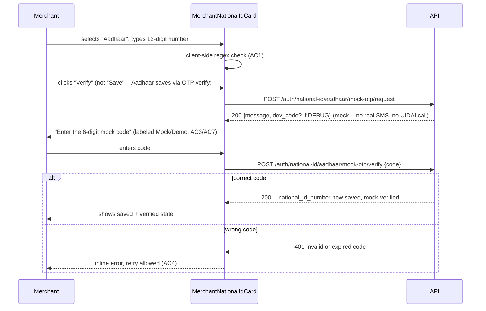

# Slice: S-070 — Aadhaar/PAN structural evaluation + mock Aadhaar OTP

| Field | Value |
|-------|-------|
| **Slice ID** | S-070 |
| **Phase** | 2 Core (onboarding) |
| **Status** | Accepted |
| **Role(s)** | merchant, admin |
| **Owner** | PM / 2026-08-18 |

> **Builder note (2026-08-18):** the request endpoint's contract in the technical
> spec below ("none — uses current_user's pending national_id_number") was
> underspecified — there is no persisted "pending" value to read before the
> number is ever saved. Implemented instead: `POST
> /auth/national-id/aadhaar/mock-otp/request` takes `{ aadhaar_number: str }` in
> the body (validated against the same `^\d{12}$` regex), and stores it in Redis
> (`aadhaar-mock-pending:{user_id}`, same 5-minute TTL as the OTP code) until
> `verify` succeeds, at which point it is persisted to `current_user` and the
> Redis entries are deleted. This keeps the "verify *is* the save step" property
> from the Flow diagram while giving the backend an actual number to save.

---

## User story

**As a** merchant providing my national ID during onboarding
**I want** the app to check that my Aadhaar or PAN number is structurally valid, and to complete a mock OTP step when I choose Aadhaar
**So that** I get immediate, useful feedback that I've entered my ID correctly, with a realistic (but clearly non-government) verification step, before my business listing goes to admin review

---

## Acceptance criteria

1. **Given** a merchant selects national ID type "Aadhaar," **when** they enter a value, **then** the form validates it is exactly 12 numeric digits (standard Aadhaar structural format) and shows an inline error if it is not, before allowing submission.
2. **Given** a merchant selects national ID type "PAN," **when** they enter a value, **then** the form validates it matches the standard PAN structural format (5 letters, 4 digits, 1 letter — e.g. `ABCDE1234F`) and shows an inline error if it is not, before allowing submission.
3. **Given** a merchant enters a structurally valid Aadhaar number, **when** they proceed, **then** a MOCKED OTP step is presented (e.g. "Enter the 6-digit code sent to your Aadhaar-linked mobile") that is clearly labeled as a mock/demo step and does not call any real government API.
4. **Given** the mock Aadhaar OTP step, **when** the merchant enters the correct mock code (deterministic/dev-visible value, not a real SMS), **then** the Aadhaar ID is marked as "mock-verified" and the merchant can continue; **when** they enter an incorrect code, **then** they see an error and may retry.
5. **Given** a merchant selects national ID type "Other" (generic), **when** they submit, **then** the existing S-043 free-text behavior is unchanged — no new structural validation or mock OTP is applied to "Other."
6. **Given** any national ID structural error (Aadhaar or PAN) or an incomplete mock OTP step, **when** the merchant attempts to submit the business form, **then** submission is blocked with a clear, field-level error — consistent with S-043's existing mandatory-ID-for-merchant rule.
7. **Given** the mock OTP / structural validation UI, **when** it is displayed anywhere in the product (form copy, tooltips, confirmation states), **then** it is explicitly labeled as a mock/demo verification, not real government KYC — consistent with S-043's existing "not verified KYC" disclaimer language.
8. **Given** an admin viewing the merchant's national ID in the admin user list, **when** the ID type is Aadhaar or PAN, **then** the existing S-043 masking behavior still applies (masked in the admin list regardless of mock-verification status).

---

## UX notes

- Screens / routes: merchant dashboard national ID fieldset (from S-043), `/merchant/businesses/new` form where national ID is collected.
- Components to reuse: `MerchantNationalIdCard.tsx` (also touched by S-071 — coordinate implementation order/conflicts), `BusinessForm.tsx`. No new page — the mock OTP step is an inline sub-step within the existing national ID fieldset/card, not a separate screen.
- Empty states / errors: inline field-level error text for structural mismatches; clear retry affordance for wrong mock OTP code; visible "mock/demo" badge or caption near the OTP step at all times.
- AI disclaimer required? no AI content here, but the existing "not verified KYC" / mock disclaimer must be visible per AC7.

---

## Out of scope

- Real government Aadhaar (UIDAI) or PAN (Income Tax / NSDL) API integration — mock only, explicitly deferred.
- Any structural validation or mock verification flow for the generic/"Other" national ID type — that remains as delivered in S-043.
- New national ID fields or database columns — this is validation/mock-verification logic layered on the existing `national_id_number` free-text field and `NationalIdType` enum (`pan`, `aadhaar`, `other`).
- Real SMS/telephony delivery of OTP codes (see S-044 phone OTP for the real phone-verification pattern this may visually resemble, but this slice's OTP is mocked and Aadhaar-specific).

---

## Dependencies

- S-043 (national ID by role) — Accepted; this slice extends it, does not replace it.
- S-067, S-068 — auth/session fixes should land first since this touches merchant-authenticated flows.
- Should coordinate with S-071 (both touch `MerchantNationalIdCard.tsx`) to avoid merge conflicts — Architect to sequence or combine implementation PRs if practical.

---

## Definition of done (PM)

- [ ] All AC verified in test report
- [ ] UX matches notes above
- [ ] Documented in `README.md` §7 API reference / §8 Frontend guide if new patterns
- [x] PM Status set to **Accepted**

---

## Technical specification (Architect)

See **ADR-013** (`docs/agents/adrs/ADR-013-mock-aadhaar-otp.md`) for the structural-
validation and mock-OTP design decision this spec implements.

### API contract

| Method | Path | Auth | Request | Response |
|--------|------|------|---------|----------|
| `POST` | `/api/v1/auth/national-id/aadhaar/mock-otp/request` | Bearer (any authenticated user; UI only reaches it for merchants) | none (uses `current_user`'s pending `national_id_number`, which must already be a structurally-valid, not-yet-persisted Aadhaar value the client is about to save — see Flow) | `MessageResponse` (generic copy); when `settings.debug` is true, also includes `dev_code: str` so the mock code is visible without an SMS inbox, exactly mirroring the existing mock-SMS-logs-the-code dev pattern |
| `POST` | `/api/v1/auth/national-id/aadhaar/mock-otp/verify` | Bearer | `{ code: str }` | `MessageResponse` — on success, sets `current_user.national_id_number`/`national_id_type=aadhaar` (i.e. verify *is* the save step — see Flow) and returns confirmation; `401` invalid/expired code (retry allowed per AC4) |

`PATCH /auth/me` (existing) gains stricter validation on `national_id_number` (see Data
model impact) but is otherwise unchanged — it remains the save path for PAN/Other, and
is *not* used directly for Aadhaar (Aadhaar saves only via the verify endpoint above, so
an unverified Aadhaar number is never silently persisted).

### RBAC matrix

| Action | customer | merchant | admin |
|--------|----------|----------|-------|
| Request/verify mock Aadhaar OTP | yes (national ID optional for customers per S-043; endpoint itself is role-agnostic) | yes | yes (self-service only — not applicable in practice) |
| View masked national ID in admin list | n/a | n/a | yes (unchanged, S-043's `apply_admin_national_id_mask`) |

### Data model impact

- [x] None  [ ] Extend existing  [ ] New table(s)

**Details:** No new table/column. `national_id_number` (existing `String(64)` on
`User`) gains Pydantic-level structural validation in `UserProfileUpdate` (and the new
mock-OTP schemas below) — no Alembic migration needed. Add `field_validator` on
`UserProfileUpdate` in `backend/app/schemas/__init__.py`:

```python
import re

_PAN_RE = re.compile(r"^[A-Z]{5}[0-9]{4}[A-Z]{1}$")
_AADHAAR_RE = re.compile(r"^\d{12}$")

class UserProfileUpdate(BaseModel):
    ...
    @field_validator("national_id_number")
    @classmethod
    def _validate_national_id(cls, v, info):
        id_type = info.data.get("national_id_type")
        if v and id_type == NationalIdType.PAN and not _PAN_RE.match(v.strip().upper()):
            raise ValueError("PAN must be 5 letters, 4 digits, 1 letter (e.g. ABCDE1234F)")
        if v and id_type == NationalIdType.AADHAAR and not _AADHAAR_RE.match(v.strip()):
            raise ValueError("Aadhaar must be exactly 12 digits")
        return v
```

`national_id_type == "other"` is untouched — no regex applied (AC5). New Pydantic
schemas (no model change): `MockOtpVerifyRequest { code: str }`.

### Cache / side effects

None — no `search:*` cache interaction (this is a user-profile field, not a business
search field).

### Frontend

- **Route:** merchant dashboard national ID fieldset (`MerchantNationalIdCard.tsx`),
  `/merchant/businesses/new` only indirectly (national ID isn't a form field there,
  it's a precondition — see S-072 spec).
- **Rendering:** CSR (existing `"use client"` component).
- **Components:** `MerchantNationalIdCard.tsx` — add inline structural validation
  (client-side mirror of the regexes above, shown as an inline field error before
  submit, matching AC1/AC2) and an inline mock-OTP sub-step that appears only when
  `national_id_type === "aadhaar"` and the structural check passes: a "Mock/demo — not a
  real government check" badge (always visible per AC7), a 6-digit code input, "Verify"
  button calling the new verify endpoint, and a retry affordance on `401`. **Coordinate
  with S-071**: both slices touch this file's local state; S-071's `applyUser`-style
  resync fix should land first (or in the same PR) so this slice's new OTP-pending local
  state doesn't get discarded by S-071's prop-resync fix landing after it. `api.ts`
  gains a small `nationalId` client object: `requestAadhaarMockOtp()`,
  `verifyAadhaarMockOtp(code)`.

### Flow



### Architect checklist

- [x] API contract defined
- [x] RBAC matrix complete
- [x] Data model impact documented (none — validation only, no migration)
- [x] Cache invalidation considered (n/a)
- [x] Uses AI/storage abstractions where applicable (n/a — reuses `phone_otp.py`'s Redis
      OTP primitives per ADR-013, no AI/storage involved)
- [x] ERD/API/FLOWS updates noted — `README.md` §7 API reference needs the two new
      endpoints; §6 flows should note the mock-Aadhaar-OTP sub-step

### Risks / tradeoffs

- See ADR-013 for the Verhoeff-checksum-vs-structural-only tradeoff and the
  `dev_code`-in-response pattern's scope limitation (mock-only, never for real
  verification).
- PAN's format `ABCDE1234F` is the standard structure but does not validate the 4th
  letter's semantic meaning (P=individual, C=company, etc.) — intentionally out of
  scope, matches "structural" framing in the slice title.
- Sequencing risk with S-071 (same file) — called out above; Builder should treat these
  as one coordinated PR if both are being implemented in the same work session.

---

## Links

- Test plan: `docs/agents/test-plans/TP-S-070-*.md`
- Test report: `docs/agents/test-reports/TR-S-070-*.md`
- ADR: `docs/agents/adrs/ADR-013-mock-aadhaar-otp.md`

---

## Changelog

| Date | Agent | Change |
|------|-------|--------|
| 2026-08-18 | PM | Created slice |
| 2026-08-18 | Architect | Filled technical specification; wrote ADR-013 (structural-only Aadhaar validation, no checksum; mock OTP reuses `phone_otp.py` Redis primitives with a namespaced key, code surfaced via `dev_code` in DEBUG rather than real SMS). Defined two new endpoints under `/auth/national-id/aadhaar/mock-otp/*`; `PATCH /auth/me` gains PAN/Aadhaar regex validators. Flagged coordination with S-071 (same file). Status → Specified. |
| 2026-08-18 | PM | Reviewed TR-S-070: all 8 AC covered and passing (all automated). Confirmed the Builder's noted API-contract deviation (`request` takes `{aadhaar_number}` + Redis-pending, not a nonexistent `current_user` pending value) is the correct, tested, implemented contract — accepted as-is per the Builder note. Status → Accepted. |
