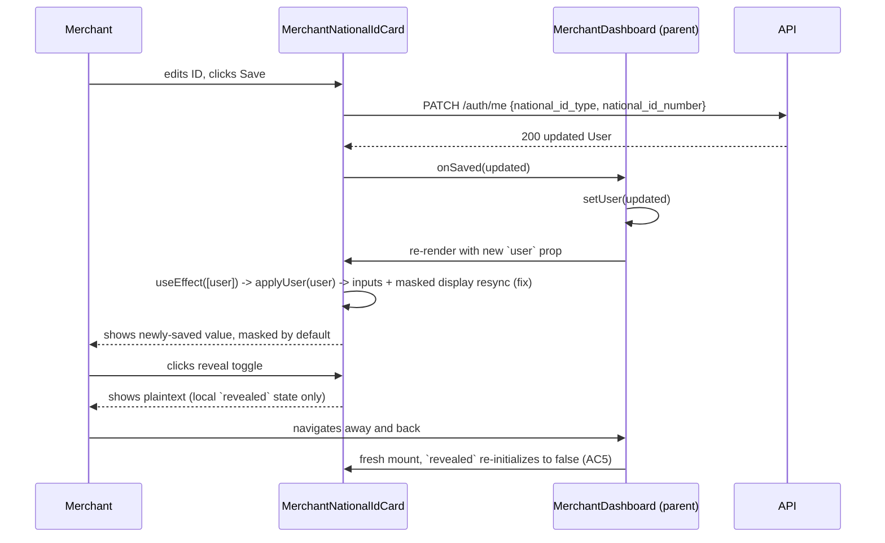

# Slice: S-071 — Fix National ID save/display + hide-by-default toggle

| Field | Value |
|-------|-------|
| **Slice ID** | S-071 |
| **Phase** | 2 Core (onboarding) |
| **Status** | Accepted |
| **Role(s)** | merchant |
| **Owner** | PM / 2026-08-18 |

---

## User story

**As a** merchant who has saved my national ID
**I want** the saved value to reliably display after I save it, and to stay hidden by default so it isn't shown in plaintext unless I choose to reveal it
**So that** I can trust the save actually worked and my sensitive ID number isn't exposed on screen every time I view my dashboard

---

## Acceptance criteria

1. **Given** a merchant edits and saves their national ID in `MerchantNationalIdCard.tsx`, **when** the save succeeds, **then** the card immediately reflects the newly saved value (root cause: local input state must resync from the updated `user` prop on every change, e.g. via an `applyUser`-style callback, matching the pattern already used in `ProfilePage.tsx`, not a one-time `useState` initializer).
2. **Given** a merchant reloads the page or navigates away and back after saving, **when** the dashboard re-fetches the current user, **then** the national ID card shows the latest saved value (not a stale or empty value).
3. **Given** a merchant has a saved national ID, **when** they first view the national ID card, **then** the number is hidden by default (e.g. masked as `••••1234` or fully obscured, consistent with how admin already masks the value per S-043), not shown in plaintext.
4. **Given** the national ID card is showing the hidden/masked state, **when** the merchant clicks a "reveal" (show/hide) toggle, **then** the full value is shown in plaintext; clicking again re-hides it.
5. **Given** the merchant reveals the value, **when** they navigate away from the page and return, **then** the card resets to hidden-by-default (reveal state is not persisted across navigations/sessions).
6. **Given** a merchant has never saved a national ID, **when** they view the card, **then** the existing S-043 empty state is shown (no reveal toggle needed when there is nothing to reveal).
7. **Given** the fix in AC1, **when** regression-tested against the rest of the merchant dashboard (e.g. other fields on `MerchantNationalIdCard.tsx` or nearby cards), **then** no other field's display/resync behavior is broken.

---

## UX notes

- Screens / routes: merchant dashboard national ID fieldset (`MerchantNationalIdCard.tsx`).
- Components to reuse: `MerchantNationalIdCard.tsx` (fix in place), pattern reference from `ProfilePage.tsx`'s `applyUser` resync callback. No new screens.
- Empty states / errors: unchanged empty state per S-043; hidden-by-default masked state is the new default "has a value" state.
- AI disclaimer required? no — this slice has no AI-generated content.

---

## Out of scope

- Structural validation of Aadhaar/PAN format (covered by S-070).
- Backend changes — the problem statement and root cause are both frontend-only (`useState` not resyncing to prop changes); no `PATCH`/save endpoint changes expected unless the Architect's investigation finds otherwise.
- Persisting the reveal/hide preference across sessions (explicitly hide-by-default every time, per AC5).

---

## Dependencies

- S-043 (national ID by role) — Accepted; this is a bug fix on top of it.
- S-067, S-068 — auth/session fixes should land first since stale-prop-on-user-change bugs are adjacent to session/role-switch state handling.
- Should coordinate with S-070 (both touch `MerchantNationalIdCard.tsx`) to avoid merge conflicts.

---

## Definition of done (PM)

- [ ] All AC verified in test report
- [ ] UX matches notes above
- [ ] Documented in `README.md` §7 API reference / §8 Frontend guide if new patterns
- [x] PM Status set to **Accepted**

---

## Technical specification (Architect)

### Root cause (confirmed on read)

`MerchantNationalIdCard.tsx` initializes its local state with a one-time `useState`
initializer:

```tsx
const [nationalIdType, setNationalIdType] = useState<NationalIdType | "">(user.national_id_type || "");
const [nationalIdNumber, setNationalIdNumber] = useState(user.national_id_number || "");
```

`useState`'s initial-value argument only runs on first mount — if the parent
(`MerchantDashboard.tsx`) re-renders this component with a new `user` prop after a save
(e.g. via `setUser(updated)` passed as `onSaved`), React does **not** re-run the
initializer, so the card keeps showing whatever was typed/blank before, not the fresh
`user.national_id_number`. This exactly matches `ProfilePage.tsx`'s already-correct
pattern comment: `ProfilePage` uses a `useCallback`-wrapped `applyUser(u)` function that
explicitly calls every setter (`setNationalIdType`, `setNationalIdNumber`, etc.) and is
invoked both on initial load (`auth.me().then(applyUser)`) **and** after every successful
save (`applyUser(updated)` in `onSubmit`). `MerchantNationalIdCard` has no equivalent —
its `onSaved` prop bubbles the updated user up to the parent but never resyncs its own
local inputs.

### API contract

| Method | Path | Auth | Request | Response |
|--------|------|------|---------|----------|
| — | — | — | — | No new/changed endpoints — reuses existing `PATCH /auth/me` exactly as today. This is a frontend-only fix per the slice's own "Out of scope." |

### RBAC matrix

| Action | customer | merchant | admin |
|--------|----------|----------|-------|
| n/a — no backend/RBAC surface touched | — | — | — |

### Data model impact

- [x] None  [ ] Extend existing  [ ] New table(s)

**Details:** None.

### Cache / side effects

None.

### Frontend

- **Route:** merchant dashboard (`MerchantNationalIdCard.tsx`, rendered from
  `MerchantDashboard.tsx`).
- **Rendering:** CSR (existing `"use client"` component, unchanged).
- **Components:** `MerchantNationalIdCard.tsx` — the fix, in full:

```tsx
export function MerchantNationalIdCard({ user, onSaved }: { user: User; onSaved: (u: User) => void }) {
  const [nationalIdType, setNationalIdType] = useState<NationalIdType | "">(user.national_id_type || "");
  const [nationalIdNumber, setNationalIdNumber] = useState(user.national_id_number || "");
  const [revealed, setRevealed] = useState(false); // AC5: never persisted, resets on remount

  const applyUser = useCallback((u: User) => {
    setNationalIdType(u.national_id_type || "");
    setNationalIdNumber(u.national_id_number || "");
    setRevealed(false); // re-hide after any resync, including a fresh save
  }, []);

  // AC1/AC2: resync whenever the parent hands us a new user object (post-save,
  // post-refetch-on-navigate-back) -- not just on first mount.
  useEffect(() => {
    applyUser(user);
  }, [user, applyUser]);

  async function onSubmit(e: FormEvent) {
    ...
    const updated = await auth.updateMe({ ... });
    onSaved(updated); // parent updates its own `user` state -> flows back down via the effect above
  }
  ...
}
```

  Masking/reveal (AC3, AC4): render `nationalIdNumber` through the existing
  `mask_national_id_number`-equivalent **client-side** helper (same `••••1234`-style
  masking already implemented server-side in `backend/app/services/national_id.py` for
  the admin list — do not call the backend for this; duplicate the same trivial
  last-4-visible logic as a small pure function in the frontend, since this is a
  display-only concern with no sensitive computation) unless `revealed` is `true`. A
  small eye-icon/toggle button flips `revealed`. AC6 (never-saved empty state): the
  existing `!complete` branch is unchanged and renders before any masked/reveal UI, since
  there is nothing to reveal.

### Flow



### Architect checklist

- [x] API contract defined (none needed)
- [x] RBAC matrix complete (n/a)
- [x] Data model impact documented (none)
- [x] Cache invalidation considered (n/a)
- [x] Uses AI/storage abstractions where applicable (n/a)
- [x] ERD/API/FLOWS updates noted (none — no new pattern beyond the existing
      `applyUser` convention already documented via `ProfilePage.tsx`; no README change
      needed unless the Builder wants to note the masking helper's location)

### Risks / tradeoffs

- AC7 (no regression elsewhere in this file/nearby cards): the `useEffect([user])` fix
  is scoped to this one component's own props; it does not touch `MerchantDashboard.tsx`'s
  own `useState`/`useEffect` for loading `user`, so no other field's resync behavior
  changes.
- Coordinate with S-070 — both touch this file. Recommend landing S-071's resync fix
  first (or in the same PR) since S-070's mock-OTP sub-step adds new local state
  (OTP-pending) that should compose with a component that already resyncs correctly on
  prop changes, rather than being built against the buggy one-time-`useState` version.

---

## Links

- Test plan: `docs/agents/test-plans/TP-S-071-*.md`
- Test report: `docs/agents/test-reports/TR-S-071-*.md`
- ADR: none — bug fix matching an already-established pattern (`ProfilePage.tsx`), no
  new architectural decision.

---

## Changelog

| Date | Agent | Change |
|------|-------|--------|
| 2026-08-18 | PM | Created slice |
| 2026-08-18 | Architect | Filled technical specification; confirmed root cause is `MerchantNationalIdCard`'s one-time `useState` initializer not resyncing on prop change (unlike `ProfilePage.tsx`'s `applyUser` pattern); specified the exact `useEffect`/`applyUser` fix plus a local-only `revealed` mask toggle. Flagged coordination with S-070 (same file). Status → Specified. |
| 2026-08-18 | PM | Reviewed TR-S-071: all 7 AC covered and passing (all automated). Status → Accepted. |
