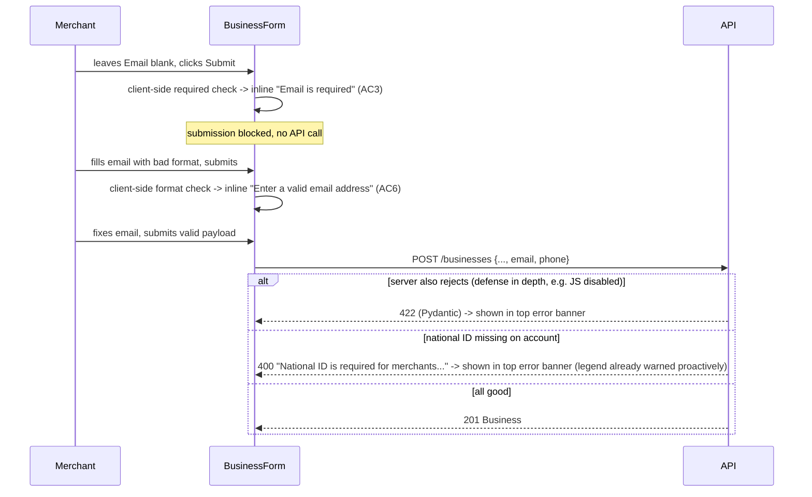

# Slice: S-072 — Mandatory field enforcement + required-field legend

| Field | Value |
|-------|-------|
| **Slice ID** | S-072 |
| **Phase** | 2 Core (onboarding) |
| **Status** | Accepted |
| **Role(s)** | merchant |
| **Owner** | PM / 2026-08-18 |

---

## User story

**As a** merchant filling out the add-business form
**I want** email, phone number, and national ID to be clearly required (with a legend explaining what the ★ symbol means), consistently with the other required fields
**So that** I know exactly what I must provide before I can submit, and I don't get an unexpected rejection after filling out the form

---

## Acceptance criteria

1. **Given** the add-business form (`BusinessForm.tsx`), **when** it renders, **then** a legend is visible near the top or alongside the form explaining that a ★ (star) marks required fields (e.g. "★ Required field").
2. **Given** the legend from AC1, **when** any required field label is rendered, **then** it consistently uses the ★ marker (replacing the current bare/inconsistent `*` on name/address/city) so all required fields — name, address, city, email, phone number, national ID — are marked the same way.
3. **Given** a merchant leaves email blank, **when** they attempt to submit, **then** the form blocks submission with an inline "Email is required" error, and (if not already enforced) the backend also rejects a `POST /businesses` request missing email with a 400-level error.
4. **Given** a merchant leaves phone number blank, **when** they attempt to submit, **then** the same client-side and server-side mandatory enforcement applies as AC3.
5. **Given** a merchant leaves national ID blank, **when** they attempt to submit, **then** the same enforcement applies — noting this is consistent with S-043's existing rule that merchants cannot create a business without a national ID (this slice ensures the UI/legend correctly signals it, not that the rule is new).
6. **Given** a merchant fills in an invalid email format (e.g. missing `@`) or an invalid phone format, **when** they attempt to submit, **then** a field-level format error is shown distinct from the "required" error (so the merchant knows whether the problem is "missing" vs. "wrong format").
7. **Given** a customer or admin encounters any form using the same shared required-field legend/marker pattern elsewhere in the app (if reused), **when** that form renders, **then** the legend only marks fields that are actually required for that role/context — no over-marking.
8. **Given** the mandatory enforcement in AC3–AC5, **when** verified against S-043 and S-070/S-071 (aadhaar/PAN validation, hide/reveal), **then** there is no conflicting behavior — mandatory-ness and structural validation both apply together where relevant.

---

## UX notes

- Screens / routes: `/merchant/businesses/new` (`BusinessForm.tsx`).
- Components to reuse: `BusinessForm.tsx`. A small shared "RequiredFieldLegend" pattern is acceptable as a minor addition within this component, not a new screen.
- Empty states / errors: distinct copy for "required and missing" vs. "present but invalid format," per AC6.
- AI disclaimer required? no — this slice has no AI-generated content.

---

## Out of scope

- Backend schema changes beyond making email/phone/national-ID enforcement consistent with what the form now requires (national ID enforcement already exists per S-043; this slice may need to add/confirm equivalent enforcement for email and phone at the schema/service level — Architect to confirm current backend state before assuming a gap).
- Redesigning the overall form layout/visual hierarchy (see S-074 for the left info panel, which may reference this legend but is a separate slice).
- Aadhaar/PAN structural validation (S-070) and hide/reveal display (S-071) — this slice only covers "is it present," not "is it correctly formatted" or "is it displayed safely."

---

## Dependencies

- S-043 (national ID by role) — Accepted; national-ID-mandatory-for-merchant is already established there.
- S-069 (fix list-your-business flow) should land first so the form is reliably reachable before enforcing new mandatory fields on it.
- S-067, S-068 — auth/session fixes sequenced first per overall onboarding batch ordering.

---

## Definition of done (PM)

- [ ] All AC verified in test report
- [ ] UX matches notes above
- [ ] Documented in `README.md` §7 API reference / §8 Frontend guide if new patterns
- [x] PM Status set to **Accepted**

---

## Technical specification (Architect)

### Current backend state (confirmed on read)

`BusinessCreate` (`backend/app/schemas/__init__.py`) has `email: str | None = None` and
`phone: str | None = None` — **not currently enforced** at the schema level, so
`POST /businesses` today accepts a payload with both blank. National ID enforcement
already exists but lives at the **service** level, not the `Business` schema, because
it's a `User` field: `create_business` calls
`national_id.merchant_national_id_required(user)` and 400s before ever touching the
`Business` row. This slice closes the email/phone gap **at the `BusinessCreate` schema
level only** (not `BusinessUpdate`, and not the `User`/`Merchant` model) — recommended
per the slice's own dependency note, to avoid retroactively breaking existing
`Business` rows or unrelated `PATCH /businesses/{id}` calls that don't touch these
fields (`exclude_unset=True` semantics in `update_business` already limit blast radius,
but making `BusinessUpdate.email`/`.phone` non-optional would incorrectly force every
partial-update caller to always resend them).

### API contract

| Method | Path | Auth | Request | Response |
|--------|------|------|---------|----------|
| `POST` | `/api/v1/businesses` | merchant | `BusinessCreate` — `email` and `phone` become **required, non-null** fields (were optional); `email: EmailStr`, `phone` validated by a lightweight format check (E.164-ish: `+`? followed by 7–15 digits) | unchanged `BusinessResponse`; `422` (Pydantic validation — a 400-level status, per AC3's "400-level error") on missing/malformed email or phone, distinct from the existing `400` national-ID-required error from the service layer |

`BusinessUpdate` is unchanged (still fully optional fields) — out of scope per the
slice's own note.

### RBAC matrix

| Action | customer | merchant | admin |
|--------|----------|----------|-------|
| `POST /businesses` with missing/invalid email or phone | 403 (role gate first) | `422` | 403 |
| `POST /businesses` with all required fields valid | 403 | 201 | 403 |

### Data model impact

- [x] None  [ ] Extend existing  [ ] New table(s)

**Details:** No DB/model change. `email`/`phone` columns on `Business` are already
`nullable=True` at the DB level (existing approved businesses created before this slice
may still have nulls) — this slice only tightens the **create-time schema**, it does not
retroactively require these on existing rows or add a NOT NULL constraint. That keeps
existing data valid and avoids a data-backfill migration.

### Cache / side effects

None new — `create_business` does not call `cache_delete_pattern("search:*")` today
(new businesses start `PENDING`, not search-visible) and this slice doesn't change that.

### Frontend

- **Route:** `/merchant/businesses/new` (`BusinessForm.tsx`).
- **Rendering:** CSR (existing `"use client"` component).
- **Components:** `BusinessForm.tsx` —
  1. Add a small `RequiredFieldLegend` note near the top of the form: `"★ Required
     field"`.
  2. Replace the bare `*` on Business name / Street address / City labels with `★`, and
     add `★` to the Email and Phone labels (National ID has no field in this form — see
     note below); add `required` attribute to the `email` and `phone` `<input>`s
     (currently missing `required`) so the browser also blocks submission client-side,
     matching AC3/AC4.
  3. National ID (AC5): this form does **not** collect national ID — it's set via
     `MerchantNationalIdCard.tsx` on the dashboard, and enforced server-side via
     `merchant_national_id_required`. Add a short legend line: `"National ID — set once
     in your dashboard profile, required before you can submit a listing"` with a link
     to `/merchant/dashboard`. When `POST /businesses` 400s with the existing
     "National ID is required…" message, `BusinessForm`'s existing `error` banner already
     surfaces it verbatim (no code change needed there) — this slice just makes the
     legend proactively explain it *before* a failed submit, rather than only reactively
     after one.
  4. Distinguish "required" vs "invalid format" errors (AC6): client-side, check
     `!value.trim()` → `"Email is required."` vs a regex mismatch on a non-empty value →
     `"Enter a valid email address."` (same pattern for phone). This is inline
     per-field text under each input, not the shared top-of-form `error` banner (which
     stays reserved for server-side/submit-level errors).
  5. AC7 (no over-marking if `RequiredFieldLegend` is reused elsewhere): keep the legend
     component parameterized by which fields it lists for a given form/role rather than
     a single global hardcoded list, so a future reuse (e.g. `ProfilePage.tsx`, where
     national ID is optional for customers) doesn't inherit merchant-only requirements.

### Flow

### Architect checklist

- [x] API contract defined
- [x] RBAC matrix complete
- [x] Data model impact documented (schema-level only, no migration)
- [x] Cache invalidation considered (n/a)
- [x] Uses AI/storage abstractions where applicable (n/a)
- [x] ERD/API/FLOWS updates noted — `README.md` §7 API reference: note `BusinessCreate`
      now requires `email`/`phone`

### Risks / tradeoffs

- Making `email`/`phone` required only on `BusinessCreate` (not `BusinessUpdate` or the
  DB column) means an admin or merchant could theoretically still end up with a null
  email/phone via other paths (e.g. a pre-existing business, or a future bulk-import
  tool) — acceptable, matches the slice's explicit scope ("is it present" only for the
  add-business form, not a retroactive data guarantee).
- Phone format validation is intentionally loose (accepts most digit-string shapes) to
  avoid rejecting valid international numbers merchants may enter differently than a
  strict E.164 parser expects — consistent with the existing looseness of
  `national_id.py`'s free-text `national_id_number` field.

---

## Links

- Test plan: `docs/agents/test-plans/TP-S-072-*.md`
- Test report: `docs/agents/test-reports/TR-S-072-*.md`
- ADR: none — a validation tightening on an existing schema/field set, no new
  integration or irreversible architecture change.

---

## Changelog

| Date | Agent | Change |
|------|-------|--------|
| 2026-08-18 | PM | Created slice |
| 2026-08-18 | Architect | Filled technical specification; scoped email/phone required-ness to `BusinessCreate` schema only (not `BusinessUpdate`, not a DB NOT NULL) to avoid breaking existing rows/partial updates; specified ★ legend, national-ID legend note (field lives on dashboard, not this form), and required-vs-format error distinction. Status → Specified. |
| 2026-08-18 | PM | Reviewed TR-S-072: all 8 AC covered and passing (7 automated, AC7 a code-read "holds vacuously today" finding since the legend pattern isn't yet reused elsewhere). Status → Accepted. |
