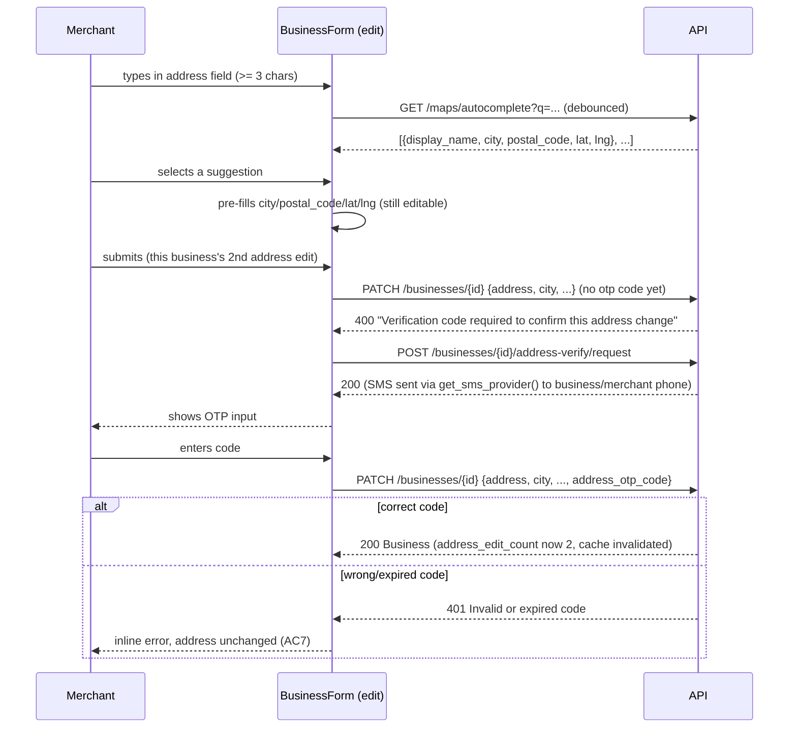

# Slice: S-073 — Business address autocomplete + re-verification on edit

| Field | Value |
|-------|-------|
| **Slice ID** | S-073 |
| **Phase** | 2 Core (onboarding) |
| **Status** | Accepted |
| **Role(s)** | merchant |
| **Owner** | PM / 2026-08-18 |

> **Builder note (2026-08-18):** `BusinessUpdate` (backend schema) has no `country`
> field today — a pre-existing gap unrelated to this slice. `_ADDRESS_FIELDS`
> in `update_business` still lists `"country"` per the Architect spec for
> forward-compatibility, but it can never actually appear in a PATCH payload
> until that gap is closed (out of scope here). Not run against a live
> Postgres in this sandbox (no Docker/Postgres reachable) — the Alembic
> migration's syntax and chain linearity were verified (`alembic history`
> shows a single linear head), but `alembic upgrade head` itself is unverified
> pending a real DB.

---

## User story

**As a** merchant entering or editing my business address
**I want** as-you-type address suggestions that pre-fill city and postal/ZIP code, and an OTP/authenticator check when I edit the address a second time
**So that** I enter my address quickly and accurately without manual city/postal typos, and my business's location can't be changed repeatedly without confirming it's really me

---

## Acceptance criteria

1. **Given** a merchant types at least 3 characters into the address field, **when** suggestions are available, **then** a dropdown of address suggestions appears live (as-you-type), replacing the current manual "Look up address" button flow as the primary interaction (the button-triggered lookup may remain as a fallback but is no longer the only way to get suggestions).
2. **Given** a merchant selects a suggestion from the autocomplete dropdown, **when** the selection is applied, **then** the city and postal/ZIP code fields are automatically pre-populated from the selected suggestion (not left for manual entry), and lat/lng are set as they are today via the existing geocode flow.
3. **Given** the pre-populated city/postal fields from AC2, **when** the merchant wants to override them, **then** the fields remain editable (autocomplete pre-fills but does not lock the fields).
4. **Given** a merchant creating a business for the first time, **when** they set the address (via autocomplete or manual entry) and submit, **then** no OTP/authenticator check is required — the re-verification requirement only applies to edits, per AC5.
5. **Given** a merchant editing the address of an existing, already-created business, **when** this is the first edit to that business's address since creation, **then** the edit is allowed without an additional verification step.
6. **Given** a merchant editing the address of an existing business, **when** this is the second (or any subsequent) edit to that business's address, **then** an OTP/authenticator confirmation step is required before the address change is saved, using the same OTP mechanism pattern established in S-044 (phone OTP) where applicable.
7. **Given** the OTP/re-verification step from AC6, **when** the merchant fails to enter a correct code (wrong code or abandons the step), **then** the address change is not saved and the business retains its previous address.
8. **Given** the autocomplete suggestion source, **when** no suggestions are returned (e.g. sparse coverage in the underlying geocoding provider), **then** the field gracefully falls back to manual entry with the existing "Look up address" button behavior — no dead end.
9. **Given** a customer or admin, **when** they view a business's address (read-only contexts like `BusinessCard`/business detail page), **then** there is no change in behavior — this slice only affects the merchant-facing address entry/edit form.

---

## UX notes

- Screens / routes: `/merchant/businesses/new`, merchant business edit screen (wherever address editing for an existing business lives today).
- Components to reuse: `BusinessForm.tsx` (extend the existing manual geocode/"Look up address" interaction into live autocomplete), existing OTP UI pattern from S-044 (phone OTP) for the re-verification step. No new full screens — the OTP check is an inline modal/step within the edit flow.
- Empty states / errors: no-suggestions fallback per AC8; OTP failure error copy distinct from a generic save error.
- AI disclaimer required? no — this slice has no AI-generated content.

---

## Out of scope

- Replacing the underlying geocoding provider (Nominatim/OpenStreetMap via `GET /maps/geocode`, `app/services/geo.py`) — this slice adds live-suggestion UX on top of the existing provider/service, not a new provider.
- Real government or third-party address-verification/KYC integration.
- Re-verification requirements for any field other than address (e.g. business name changes are not in scope here).
- Rate-limiting or abuse-prevention design for repeated address edits beyond the "2nd+ edit requires OTP" rule stated in the AC — deeper abuse patterns are an Architect/future-slice concern if discovered.

---

## Dependencies

- Existing maps/geo service (`GET /maps/geocode`, `backend/app/routers/maps.py`, `app/services/geo.py`) — this slice extends it, does not replace it.
- S-044 (phone OTP) — Accepted; this slice reuses its OTP UX/pattern for address re-verification (not necessarily the same phone-specific channel, per Architect's technical spec).
- S-069 (fix list-your-business flow) should land first so the base form is reliably usable before adding autocomplete.
- S-067, S-068 — auth/session fixes sequenced first per overall onboarding batch ordering.

---

## Definition of done (PM)

- [ ] All AC verified in test report
- [ ] UX matches notes above
- [ ] Documented in `README.md` §7 API reference / §8 Frontend guide if new patterns
- [x] PM Status set to **Accepted**

---

## Technical specification (Architect)

See **ADR-014** (`docs/agents/adrs/ADR-014-address-autocomplete-reverify.md`) for the
provider choice (Nominatim, reused — not a new provider) and the OTP-reuse decision this
spec implements.

### API contract

| Method | Path | Auth | Request | Response |
|--------|------|------|---------|----------|
| `GET` | `/api/v1/maps/autocomplete` | none (public, same as existing `GET /maps/geocode`) | query param `q` (min 3 chars, enforced client-side; server treats <3 chars as a normal short query — no server-side length gate needed since Nominatim itself just returns fewer/no results) | `list[AddressSuggestion]` — `{ display_name, latitude, longitude, city, postal_code, state }`, up to 5, `[]` when none (AC8 fallback) |
| `POST` | `/api/v1/businesses/{business_id}/address-verify/request` | merchant (owner only) | none | `MessageResponse` (generic) — 409 if `address_edit_count == 0` (no re-verification needed yet, nothing to request) |
| `PATCH` | `/api/v1/businesses/{business_id}` (existing, extended) | merchant (owner) / admin | `BusinessUpdate` gains optional `address_otp_code: str | None` | unchanged `BusinessResponse`; **new** `400` "Verification code required to confirm this address change" when an address field changes, `address_edit_count >= 1`, and `address_otp_code` is missing; `401` "Invalid or expired code" when present but wrong |

`GET /maps/geocode` (existing, button-click fallback) is **unchanged** — same contract,
still used as the AC8/AC1 fallback when autocomplete has no suggestions or JS-disabled.

### RBAC matrix

| Action | customer | merchant | admin |
|--------|----------|----------|-------|
| `GET /maps/autocomplete` | yes (public) | yes | yes |
| `POST /businesses/{id}/address-verify/request` | 403 | yes, owner only | n/a (admin edits don't require re-verification — see Risks) |
| `PATCH /businesses/{id}` with address change, 1st edit | 403 | yes, owner only, no OTP required | yes, no OTP required |
| `PATCH /businesses/{id}` with address change, 2nd+ edit | 403 | yes, owner only, OTP required | yes, **not** required (see Risks) |

### Data model impact

- [ ] None  [x] Extend existing  [ ] New table(s)

**Details:** Add `address_edit_count: Mapped[int] = mapped_column(Integer, default=0,
nullable=False, server_default="0")` to `Business`
(`backend/app/models/__init__.py`). New Alembic migration (filename pattern matching
the most recent: `YYYYMMDD_HHMM-<hex>-<slug>.py`, e.g.
`20260819_0900-<hex>_add_business_address_edit_count.py`), simple additive column with
a server default — no backfill needed, existing rows default to `0` (i.e. "no edits yet,"
correct for pre-existing businesses whose address hasn't been touched through this new
gated path).

`update_business` (`backend/app/routers/businesses.py`) gains logic (in the router today
per existing pattern for this file, though the OTP-verification call itself should live
in a small service function — see Frontend/Cache section below for exact split):
1. Detect whether the payload changes any of `address`, `city`, `state`,
   `postal_code`, `country` (compare `payload.model_dump(exclude_unset=True)` keys
   against current `business` values).
2. If no address field changes: proceed exactly as today, no OTP logic at all.
3. If address fields do change and `business.address_edit_count == 0`: apply the
   change, increment `address_edit_count` to `1`. No OTP required (AC4/AC5).
4. If address fields change and `business.address_edit_count >= 1`: require
   `payload.address_otp_code`; verify via `phone_otp.consume_otp(f"bizaddr:{business_id}",
   code)` (per ADR-014); on success, apply the change and increment
   `address_edit_count`; on failure/missing, `400`/`401` and the address is **not**
   changed (other non-address fields in the same payload, if any, also don't apply —
   the whole PATCH fails atomically, simplest and safest interpretation of AC7).

### Cache / side effects

Unchanged: `await cache_delete_pattern("search:*")` still fires on every successful
`update_business` call (already present), including address-changing updates gated by
this slice's new OTP check — the cache invalidation only needs to know the update
*succeeded*, not why/how it was authorized.

### Frontend

- **Route:** `/merchant/businesses/new` (create — no OTP path, AC4), merchant business
  edit screen (`/merchant/businesses/[id]/edit`, existing route — AC5/AC6).
- **Rendering:** CSR (`BusinessForm.tsx`, existing `"use client"`).
- **Components:**
  - `BusinessForm.tsx` — replace the manual "Look up address" button-only flow with a
    debounced (≥300ms) live suggestion dropdown triggered once `form.address.length >=
    3`, calling the new `maps.autocomplete(query)`. Selecting a suggestion sets
    `address`, `city`, `postal_code`, `latitude`, `longitude` (AC2) while leaving all
    fields editable (AC3). The existing "Look up address" button remains, wired to the
    unchanged `GET /maps/geocode`, as the explicit fallback (AC1, AC8).
  - New inline OTP step, shown only in `mode === "edit"` when a submit attempt changes an
    address field: call `businesses.requestAddressOtp(business.id)`, show a small modal/
    inline panel ("Enter the code sent to your business phone to confirm this address
    change" — reusing the visual pattern of S-070's OTP sub-step for consistency, not a
    new design), then resubmit `businesses.update(id, { ...payload, address_otp_code })`.
    If the initial `PATCH` already 400s with "Verification code required…" (e.g. the
    merchant didn't go through the request step, or this is their first edit attempt
    after the count already incremented from a *previous* session), that response is the
    trigger to show the OTP step — no separate up-front "is this my 2nd edit?" client
    check is needed; the backend is the source of truth, matching how `BusinessForm`
    already surfaces server errors today (AC7: failed/abandoned OTP leaves the previous
    address in place, since the PATCH simply never succeeded).
  - `api.ts`: extend `maps` client with `autocomplete(query)`; extend `businesses`
    client with `requestAddressOtp(id)`; extend `BusinessUpdateInput` with optional
    `address_otp_code?: string`; extend the `Business` interface with
    `address_edit_count?: number` (so the frontend can optionally pre-empt the OTP step
    UI without waiting for a 400, if the Builder wants a slightly smoother UX — not
    required by any AC, the 400-driven flow above is sufficient on its own).

### Flow

### Architect checklist

- [x] API contract defined
- [x] RBAC matrix complete
- [x] Data model impact documented — new `address_edit_count` column + migration
- [x] Cache invalidation considered (unchanged existing `search:*` invalidation covers
      this path)
- [x] Uses AI/storage abstractions where applicable — reuses `get_sms_provider()` and
      `phone_otp.py` Redis primitives per ADR-014, no new provider
- [x] ERD/API/FLOWS updates noted — `README.md` §5 (new `Business.address_edit_count`
      column), §7 (new `GET /maps/autocomplete`, `POST
      /businesses/{id}/address-verify/request`, extended `PATCH /businesses/{id}`), §6
      (autocomplete + re-verification flow)

### Risks / tradeoffs

- See ADR-014 for the Nominatim rate-limit/debounce risk and the OTP-reuse-vs-refactor
  tradeoff.
- **Admin edits bypass the OTP gate in this spec** (RBAC matrix above) — the slice's ACs
  are all written from the merchant's perspective and don't mention admin-initiated
  address edits; requiring admins (who already have elevated trust and a separate
  `require_roles(MERCHANT, ADMIN)` gate) to SMS-verify via a *merchant's* phone would be
  awkward (whose phone receives the code?) and isn't asked for by any AC. Flagging this
  explicitly so the Tester doesn't file it as a missed AC — it's a deliberate scope call,
  reconfirm with PM if this reads differently than intended.
- If neither `business.phone` nor the merchant's `user.phone` is set, the OTP-request
  endpoint has no delivery target. Spec: fall back to `business.phone` first, then
  `merchant_user.phone`; if both are empty, `400` "Add a phone number to your business or
  profile before editing your address again" — an edge case not explicitly covered by any
  AC but necessary for the endpoint to degrade safely rather than 500.

---

## Links

- Test plan: `docs/agents/test-plans/TP-S-073-*.md`
- Test report: `docs/agents/test-reports/TR-S-073-*.md`
- ADR: `docs/agents/adrs/ADR-014-address-autocomplete-reverify.md`

---

## Changelog

| Date | Agent | Change |
|------|-------|--------|
| 2026-08-18 | PM | Created slice |
| 2026-08-18 | Architect | Filled technical specification; wrote ADR-014 (Nominatim reused for autocomplete via new `GET /maps/autocomplete`, `address_edit_count` column + `phone_otp.py`-reused re-verification on 2nd+ address edit). Flagged admin-edits-bypass-OTP as a deliberate scope call for PM/Tester visibility. Status → Specified. |
| 2026-08-18 | PM | Reviewed TR-S-073: all 9 AC covered and passing (8 automated + 1 code-read for AC9). Confirmed the Builder's post-report fix (`address_edit_count` now increments on admin edits too, re-tested 18/18 + 250/250) closes the one gap the Tester flagged. Alembic-against-live-Postgres and the pre-existing `BusinessUpdate.country` gap are documented sandbox/scope limitations, not failing AC — do not block acceptance. Status → Accepted. |
