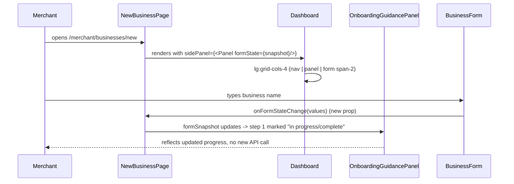

# Slice: S-074 — Left info panel on merchant onboarding screen

| Field | Value |
|-------|-------|
| **Slice ID** | S-074 |
| **Phase** | 2 Core (onboarding) |
| **Status** | Accepted |
| **Role(s)** | merchant |
| **Owner** | PM / 2026-08-18 |

---

## User story

**As a** merchant on the add-business screen
**I want** the empty left panel to show useful guidance — what's required, onboarding steps, identity verification tips, business info tips, and my progress — instead of a plain nav link list
**So that** I understand what's expected of me and how far along I am before I finish creating my listing

---

## Acceptance criteria

1. **Given** a merchant on `/merchant/businesses/new`, **when** the page renders, **then** the left column (`lg:col-span-1` in `Dashboard.tsx`) shows an onboarding guidance panel in addition to (not instead of) the existing Overview/Add business/Settings nav links.
2. **Given** the guidance panel, **when** it renders, **then** it lists the onboarding steps at a glance (e.g. "1. Business info  2. Identity verification  3. Review & submit"), reflecting the actual fields/steps present in `BusinessForm.tsx` (including the mandatory fields from S-072 and identity steps from S-070/S-071 where those slices have landed).
3. **Given** the guidance panel, **when** it renders, **then** it includes a short "what's required" summary consistent with the ★ required-field legend introduced in S-072 (no contradictory copy between the legend and the panel).
4. **Given** the guidance panel, **when** it renders, **then** it includes brief identity-verification guidance (e.g. what Aadhaar/PAN/Other means, that verification is a mock/demo step, consistent with S-043 and S-070's "not verified KYC" disclaimer).
5. **Given** a merchant has partially filled the form, **when** the guidance panel is visible, **then** it reflects basic progress (e.g. which of the listed steps appear complete vs. pending) using data already available client-side in the form state — no new backend endpoint required for progress tracking.
6. **Given** a merchant on a small viewport (mobile width), **when** the page renders, **then** the guidance panel does not block or crowd out the form (e.g. it may collapse, stack below/above the form, or be dismissible) — no regression to existing responsive behavior of `Dashboard.tsx`.
7. **Given** the guidance panel, **when** it is added to `Dashboard.tsx`, **then** it does not appear (or appears in a neutral/generic form) on other routes that reuse `Dashboard.tsx` (e.g. Overview, Settings) unless explicitly intended — this panel's detailed onboarding content is specific to the add-business screen.

---

## UX notes

- Screens / routes: `/merchant/businesses/new` (via `Dashboard.tsx` shared shell).
- Components to reuse: `Dashboard.tsx` (extend the left column), `BusinessForm.tsx` (read form state for progress). No new page.
- Empty states / errors: panel should render sensibly even before the merchant has started typing (i.e. showing all steps as "pending").
- AI disclaimer required? no direct AI content, but must not contradict the mock-verification disclaimer language required by S-070.

---

## Out of scope

- A full multi-step wizard UI (this is a guidance panel alongside the existing single-page form, not a redesign into discrete wizard steps).
- New backend progress-tracking endpoints — progress is derived from existing client-side form state only.
- Guidance content for customer or admin flows — merchant onboarding only.

---

## Dependencies

- S-069 (fix list-your-business flow) — the screen must be reliably reachable first.
- S-072 (mandatory field enforcement + legend) — panel copy should stay consistent with the required-field legend; ideally sequenced after or in parallel with agreed copy.
- S-070, S-071 (Aadhaar/PAN mock verification, hide/reveal) — panel's identity-verification guidance should reflect whatever these slices ship; if sequenced before them, panel copy should stay generic/forward-compatible.

---

## Definition of done (PM)

- [ ] All AC verified in test report
- [ ] UX matches notes above
- [ ] Documented in `README.md` §7 API reference / §8 Frontend guide if new patterns
- [x] PM Status set to **Accepted**

---

## Technical specification (Architect)

### Layout clarification (important — AC1 wording vs actual `Dashboard.tsx` structure)

`Dashboard.tsx`'s current grid is `grid gap-6 lg:grid-cols-4` with the nav `<nav
lg:col-span-1>` and children `
`. The AC1 wording ("left column
(`lg:col-span-1`) ... in addition to ... existing Overview/Add business/Settings nav
links") reads as if the guidance panel should live *inside* the same narrow
`lg:col-span-1` nav column as the links. That column is ~1/4 width — workable for a
compact step list, but too narrow for "what's required" copy + progress + identity tips
without feeling cramped. Spec decision: keep the nav links in their existing
`lg:col-span-1` column unchanged, and add the guidance panel as a **new, additional**
column only on the add-business route, changing that route's grid to `lg:grid-cols-4`→
effectively nav (`col-span-1`) + guidance panel (`col-span-1`, new) + form
(`col-span-2`, narrowed from 3). This satisfies AC1's "in addition to" and AC7's
"specific to the add-business screen" without cramping either the nav or the guidance
content. `Dashboard.tsx` itself gains one new **optional** prop rather than being
hardcoded for this one route (AC7: must not appear on Overview/Settings).

### API contract

| Method | Path | Auth | Request | Response |
|--------|------|------|---------|----------|
| — | — | — | — | No new/changed endpoints — this slice is entirely derived from data already available client-side (form state) plus static copy, per the slice's own "Out of scope." |

### RBAC matrix

| Action | customer | merchant | admin |
|--------|----------|----------|-------|
| See onboarding guidance panel on `/merchant/businesses/new` | n/a (route already merchant-gated by `RequireAuth`) | yes | n/a |

### Data model impact

- [x] None  [ ] Extend existing  [ ] New table(s)

**Details:** None — purely presentational, client-side derived state only.

### Cache / side effects

None.

### Frontend

- **Route:** `/merchant/businesses/new` only (AC7 — must not leak onto Overview/
  Settings, which also render via `Dashboard.tsx`).
- **Rendering:** CSR (new component is `"use client"`, matching `BusinessForm.tsx`).
- **Components:**
  - New `OnboardingGuidancePanel.tsx` — presentational, takes `formState` (a small
    projection of `BusinessFormValues` — just the booleans it needs: `hasBasicInfo`,
    `hasContactInfo`, `nationalIdComplete`) as props; renders three static content
    blocks (steps list, ★-legend-consistent "what's required" summary reusing the same
    copy source as S-072's `RequiredFieldLegend` — do not duplicate the required-fields
    list as a second hardcoded array; both components should read from one shared
    constant, e.g. `MERCHANT_REQUIRED_FIELDS` exported from `BusinessForm.tsx` or a
    small shared `onboarding-copy.ts`) and identity-verification guidance (static copy
    mirroring S-043/S-070's mock/demo disclaimer verbatim — do not invent new
    disclaimer wording).
  - `BusinessForm.tsx` — no functional change, but the `form` state it already holds
    (`BusinessFormValues`) needs to be readable by the new panel. Simplest composition
    without prop-drilling through `Dashboard`: `NewBusinessPage`
    (`frontend/src/app/merchant/businesses/new/page.tsx`) lifts a minimal progress
    projection using `BusinessForm`'s existing `onSuccess` callback pattern is
    insufficient (that only fires post-submit) — instead, `BusinessForm` should accept
    an optional `onFormStateChange?: (values: BusinessFormValues) => void` prop, called
    from its existing `setForm` sites (or a single `useEffect([form])`), so the page can
    hold a mirrored `formSnapshot` state and pass it down to both `Dashboard`'s new panel
    slot and `BusinessForm` itself. This is the one small, additive change to
    `BusinessForm.tsx` this slice needs.
  - `Dashboard.tsx` — add an optional `sidePanel?: React.ReactNode` prop, rendered as a
    new `lg:col-span-1` grid cell between `nav` and `children` only when provided (grid
    becomes `lg:grid-cols-4` with nav=1/panel=1/children=2 when `sidePanel` is passed,
    unchanged `lg:grid-cols-4` nav=1/children=3 otherwise) — additive, backward
    compatible with every other `Dashboard` call site (Overview, Settings, Edit
    business, etc. all continue passing no `sidePanel` and render exactly as today,
    satisfying AC7 structurally rather than by convention).
  - AC6 (mobile): the new column naturally stacks below `nav` and above `children` on
    narrow viewports since it's inside the same `grid lg:grid-cols-N` container that
    already collapses to a single column below the `lg:` breakpoint — no new responsive
    code needed beyond using the same Tailwind grid Dashboard already relies on.

### Flow

### Architect checklist

- [x] API contract defined (none needed)
- [x] RBAC matrix complete (route-level gate only, unchanged)
- [x] Data model impact documented (none)
- [x] Cache invalidation considered (n/a)
- [x] Uses AI/storage abstractions where applicable (n/a)
- [x] ERD/API/FLOWS updates noted — `README.md` §8 Frontend guide should note the new
      `Dashboard` `sidePanel` prop pattern for future reuse

### Risks / tradeoffs

- Sequencing with S-070/S-071/S-072: this panel's copy references required fields
  (S-072) and identity-verification steps (S-070/S-071). Per the slice's own
  Dependencies note, if S-074 ships before those, the panel's copy must stay generic
  ("Identity verification — PAN, Aadhaar, or another ID, set in your dashboard") rather
  than referencing UI (like a mock-OTP step) that doesn't exist yet. Recommend
  sequencing S-074 **after** S-070/S-071/S-072 land to avoid a copy-consistency
  regrression when those slices ship later and the panel's static text goes stale.
- The `Dashboard.sidePanel` prop is additive/backward-compatible by construction (every
  existing call site omits it), so this is low-risk to ship independently of the
  sequencing note above if the PM wants S-074 to land first with generic copy.

---

## Links

- Test plan: `docs/agents/test-plans/TP-S-074-*.md`
- Test report: `docs/agents/test-reports/TR-S-074-*.md`
- ADR: none — presentational addition, no architectural decision.

---

## Changelog

| Date | Agent | Change |
|------|-------|--------|
| 2026-08-18 | PM | Created slice |
| 2026-08-18 | Architect | Filled technical specification; clarified AC1's `lg:col-span-1` wording means an additional column, not reusing the nav column; specified new `Dashboard.sidePanel` optional prop (additive, backward-compatible) and `BusinessForm.onFormStateChange` prop for progress-derived copy; recommended sequencing after S-070/S-071/S-072 for copy consistency. Status → Specified. |
| 2026-08-18 | PM | Reviewed TR-S-074: all 7 AC covered and passing (6 automated, AC6 a code-read for a CSS/responsive-only claim not meaningfully assertable in jsdom — low risk, no new responsive code). Status → Accepted. |
