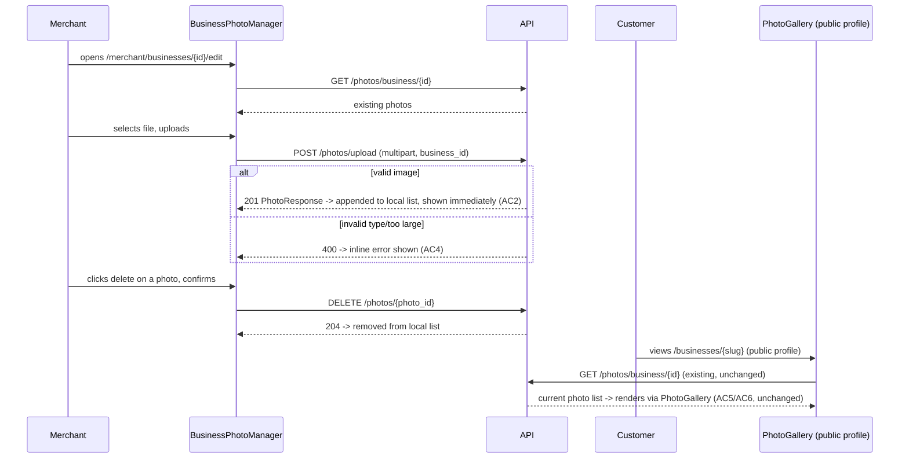

# Slice: S-075 — Optional merchant public-profile photo upload

| Field | Value |
|-------|-------|
| **Slice ID** | S-075 |
| **Phase** | 2 Core (onboarding) |
| **Status** | Accepted |
| **Role(s)** | merchant, customer |
| **Owner** | PM / 2026-08-18 |

---

## User story

**As a** merchant
**I want** to optionally upload a photo to my business's public profile
**So that** customers see a more trustworthy, recognizable listing, without being forced to provide a photo if I don't have one ready

---

## Acceptance criteria

1. **Given** a merchant managing their business (creation flow or an existing business's management screen), **when** they view the photo section, **then** an upload control is present and clearly optional (no validation error blocks submission if no photo is uploaded).
2. **Given** a merchant selects a valid image file, **when** they upload it, **then** the file is sent to the existing photo upload endpoint (`backend/app/routers/photos.py`) and, on success, appears in the merchant's own preview immediately.
3. **Given** a merchant has uploaded one or more photos, **when** they view the upload UI again, **then** the existing photos are listed (using the existing list endpoint) with a way to remove/delete a photo (using the existing delete endpoint), and deletion requires confirmation.
4. **Given** a merchant attempts to upload a file that is not a supported image type or exceeds any size limit enforced by `photo_service.py`, **when** the upload is rejected by the backend, **then** the frontend shows a clear, specific error message (not a silent failure or generic error).
5. **Given** a customer viewing a business's public profile page, **when** the business has at least one uploaded photo, **then** the photo displays via the existing `PhotoGallery.tsx` component (already working today) — no change to customer-facing display behavior, only the addition of a way for merchants to get photos there in the first place.
6. **Given** a business with zero uploaded photos, **when** a customer views its public profile, **then** the existing empty state (no photos) is unchanged.
7. **Given** the upload UI, **when** implemented, **then** `frontend/src/lib/api.ts` gains a `photos` client object (upload/list/delete) so the upload UI is wired through the app's standard API client pattern, consistent with other resource clients in that file.
8. **Given** a merchant is not the owner of a given business (e.g. attempts to upload to another merchant's listing via direct action, if reachable), **when** the upload/delete request is made, **then** the existing backend ownership/permission check in `photos.py` rejects it (no new permission bug introduced by the new frontend UI).

---

## UX notes

- Screens / routes: merchant business creation flow (`/merchant/businesses/new`, optional step) and/or merchant business management/edit screen; public business profile page (customer-facing, unchanged display).
- Components to reuse: `PhotoGallery.tsx` (customer-facing display, unchanged), `Dashboard.tsx`/`BusinessForm.tsx` (host the new upload control). Build a small upload/preview control within these existing screens rather than a new page.
- Empty states / errors: "no photo yet, optional" empty state on the merchant side; existing "no photos" empty state on the customer-facing side is unchanged; explicit error copy for unsupported file type / size limit.
- AI disclaimer required? no — this slice has no AI-generated content.

---

## Out of scope

- Any backend changes to `photos.py`, `photo_service.py`, or the storage abstraction — the backend pipeline is already built and working; this slice is frontend-only.
- Making photo upload mandatory at any point in onboarding — explicitly optional per the problem statement.
- Image editing/cropping tools, multiple-photo reordering, or cover-photo selection beyond what the existing `PhotoGallery.tsx` already supports for display.

---

## Dependencies

- S-069 (fix list-your-business flow) — the business creation/management screens this upload UI attaches to must be reliably reachable first.
- Existing backend photo pipeline (`backend/app/routers/photos.py`, `app/services/photo_service.py`, storage service abstraction) — already built; no dependency on other in-flight slices to function, but this slice should not duplicate or bypass the storage abstraction.

---

## Definition of done (PM)

- [ ] All AC verified in test report
- [ ] UX matches notes above
- [ ] Documented in `README.md` §7 API reference / §8 Frontend guide if new patterns
- [x] PM Status set to **Accepted**

---

## Technical specification (Architect)

### Correction to the slice's own dependency note (important)

`frontend/src/lib/api.ts` **already has** a `photos` client object (`listForBusiness`,
`upload`) — AC7's premise ("gains a `photos` client object") is only partially true: it
needs to gain a `delete` method, not be created from scratch. No other gap exists in the
existing backend pipeline — `backend/app/routers/photos.py`'s
`DELETE /photos/{photo_id}` already exists and already has the correct ownership check
(merchant must own the business the photo belongs to, `require_roles(MERCHANT, ADMIN)`),
confirming the slice's own "no backend changes" scope is accurate for delete too, not
just upload/list.

### API contract

| Method | Path | Auth | Request | Response |
|--------|------|------|---------|----------|
| `POST` | `/api/v1/photos/upload` | any authenticated (ownership checked server-side) | existing, unchanged — multipart `file`, `business_id`, `photo_type` (use `"gallery"` default for this slice), `caption`? | existing, unchanged `PhotoResponse` |
| `GET` | `/api/v1/photos/business/{business_id}` | none (public) | existing, unchanged | existing, unchanged `list[PhotoResponse]` |
| `DELETE` | `/api/v1/photos/{photo_id}` | merchant (owner) / admin | existing, unchanged | existing, unchanged `204` |

No backend changes at all — this row exists only to confirm the contract this slice's
frontend work is built against; all three endpoints are pre-existing and unmodified.

### RBAC matrix

| Action | customer | merchant | admin |
|--------|----------|----------|-------|
| Upload photo to own business | n/a | yes (owner check in `photos.py`, unchanged) | yes |
| Upload photo to another merchant's business | n/a | 403 (existing check, unchanged — AC8) | yes |
| List photos for a business | yes (public) | yes | yes |
| Delete a photo | n/a | yes, owner only (existing check, unchanged) | yes |
| View `PhotoGallery` on public profile | yes | yes | yes |

### Data model impact

- [x] None  [ ] Extend existing  [ ] New table(s)

**Details:** None — reuses the existing `Photo` model, `photo_service.py`, and storage
abstraction exactly as-is, per the slice's "Out of scope."

### Cache / side effects

None — `photos.py` does not touch `search:*` cache today (photos aren't a search facet)
and this slice doesn't change that. No new side effects introduced.

### Frontend

- **Route:** merchant business management screen
  (`/merchant/businesses/[id]/edit`, existing route, extending `BusinessForm.tsx`'s
  edit mode) for the upload/manage UI; public business profile page (existing route,
  unchanged — `PhotoGallery.tsx` display is untouched).
- **Rendering:** CSR for the upload control (new `"use client"` component); public
  profile page's SSR/CSR split is unchanged.
- **Components:**
  - New `BusinessPhotoManager.tsx` — small upload/preview/delete control. Placement
    decision: **inside `BusinessForm.tsx`'s edit mode only** (not create mode, and not a
    separate `MerchantDashboard.tsx` section) — a `business_id` is required to call
    `photos.upload()` (per the existing `business_id` form field in the upload
    endpoint), and `BusinessForm`'s `mode === "create"` has no `business.id` to attach
    photos to until after the first successful `POST /businesses`. Rendering the photo
    manager only in edit mode (`{mode === "edit" && business && <BusinessPhotoManager
    businessId={business.id} />}`) avoids a two-phase "create then immediately edit to
    add photos" UX complication and keeps this slice's diff minimal — a merchant can add
    photos as soon as their first edit visit, which satisfies AC1's "creation flow or an
    existing business's management screen" (the "or" is satisfied by "management
    screen," matching the simpler of the two allowed placements).
  - `api.ts`: extend the existing `photos` client object with
    `delete: (photoId: string) => apiFetch<void>(\`/api/v1/photos/${photoId}\`, { method: "DELETE" })`
    — the only client-side gap identified above.
  - `PhotoGallery.tsx` — **unchanged**, reused as-is for the merchant's own preview
    (AC2) by passing the freshly-fetched photo URL list, exactly as the public profile
    page already does.
  - Upload error handling (AC4): `photo_service.py`'s existing `400` responses
    ("Unsupported file type…", "File too large…") already come through as
    `err.detail` via `apiFetch`'s existing error-throwing behavior — `BusinessPhotoManager`
    just needs its own local `error` state + catch block, the same pattern already used
    in `BusinessForm.tsx`/`MerchantNationalIdCard.tsx`, no new error-plumbing needed.
  - Delete confirmation (AC3): a simple `window.confirm()` or small inline confirm
    step before calling `photos.delete(id)` — no new UI pattern needed beyond what's
    already common in the codebase for destructive actions.

### Flow

### Architect checklist

- [x] API contract defined (all three endpoints pre-existing, confirmed unchanged)
- [x] RBAC matrix complete
- [x] Data model impact documented (none)
- [x] Cache invalidation considered (none applicable)
- [x] Uses AI/storage abstractions where applicable — reuses `get_storage_provider()`
      and `get_ai_provider()` (image analysis) exactly as `photo_service.py` already
      does; this slice adds zero new calls to either
- [x] ERD/API/FLOWS updates noted — `README.md` §7 should note the frontend now has a
      merchant-facing upload UI (the endpoints themselves are already documented); §8
      Frontend guide should note the completed `photos` client object

### Risks / tradeoffs

- Placement decision (edit-mode-only, not create-mode) means a brand-new merchant
  cannot attach a photo in the same flow as their very first business submission — they
  must save once, then return to edit to add a photo. This is explicitly acceptable
  because AC1 already frames the photo as fully optional and reachable via "an existing
  business's management screen," and avoids the added complexity of a create-then-
  immediately-upload two-phase flow for a feature explicitly deferred as non-essential.
  Flagging so PM can confirm this reading of AC1 matches intent.
- No new AI-provider calls are introduced by this slice, but every photo uploaded through
  the existing `save_business_photo()` path already triggers `get_ai_provider().analyze_image()`
  (existing behavior, unrelated to this slice) — worth the Tester double-checking that a
  degraded/mock AI provider in test environments doesn't block the upload response (it
  doesn't today; `AIAnalysis` failures don't raise, per existing `degraded` flag pattern).

---

## Links

- Test plan: `docs/agents/test-plans/TP-S-075-*.md`
- Test report: `docs/agents/test-reports/TR-S-075-*.md`
- ADR: none — frontend-only wiring onto an already-built, already-abstracted backend
  pipeline; no new integration or architectural decision.

---

## Changelog

| Date | Agent | Change |
|------|-------|--------|
| 2026-08-18 | PM | Created slice |
| 2026-08-18 | Architect | Filled technical specification; corrected the slice's premise — `api.ts` already has a `photos` client object, it only needs a `delete` method added; confirmed all three backend endpoints (upload/list/delete) are unchanged; scoped the upload UI to `BusinessForm`'s edit mode only (needs a `business_id`). Status → Specified. |
| 2026-08-18 | PM | Reviewed TR-S-075: all 8 AC covered and passing (6 automated, 2 code-read/regression backed by explicit `git diff` showing zero backend/customer-facing changes). Status → Accepted. |
